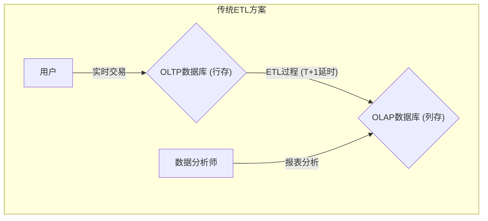
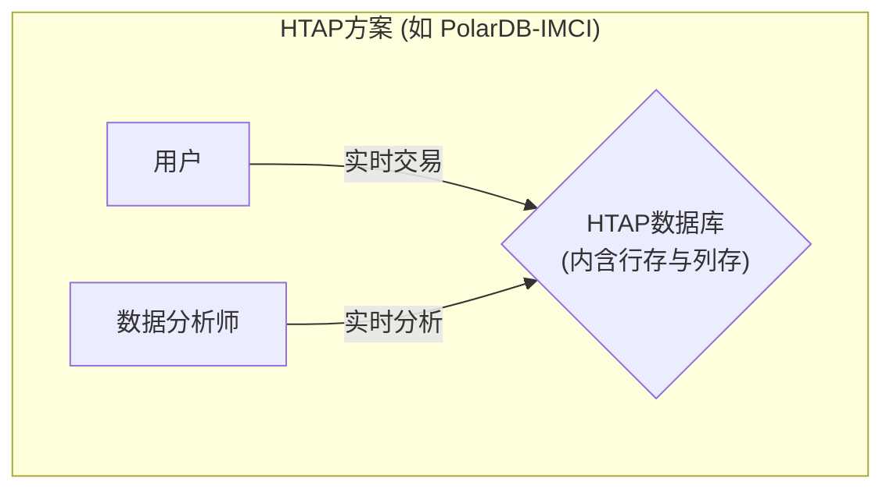
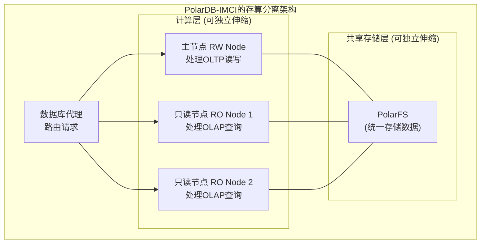
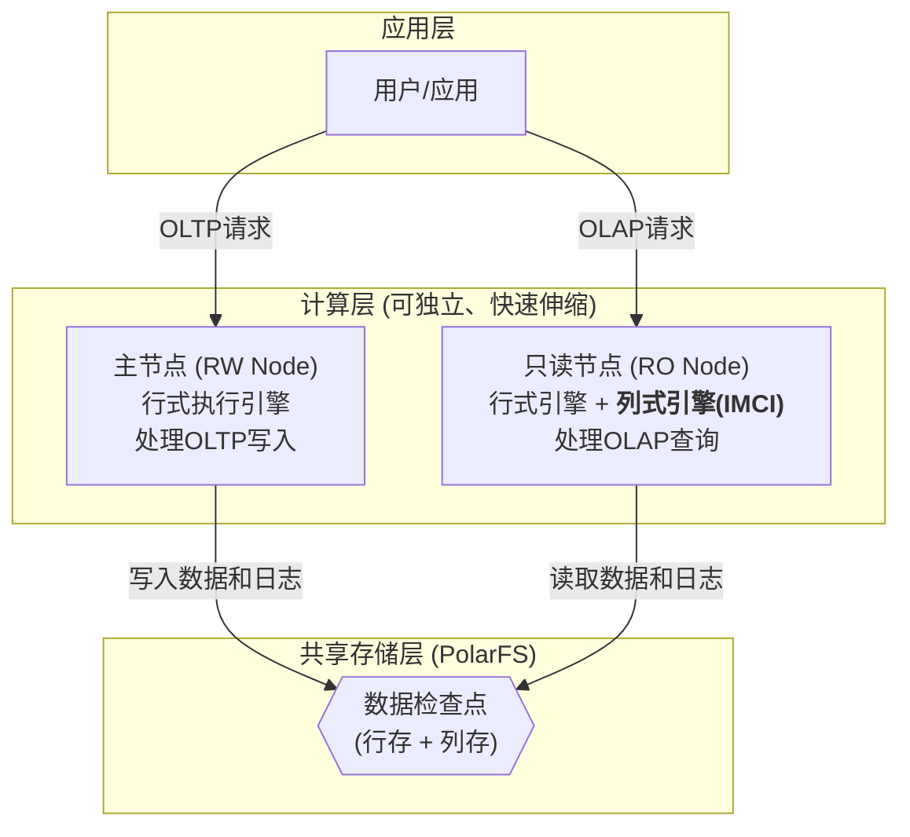
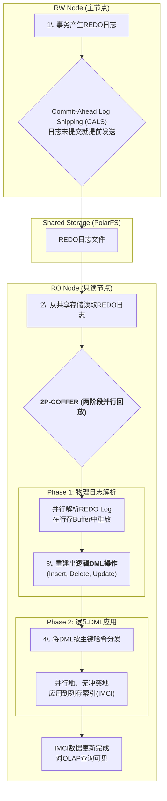
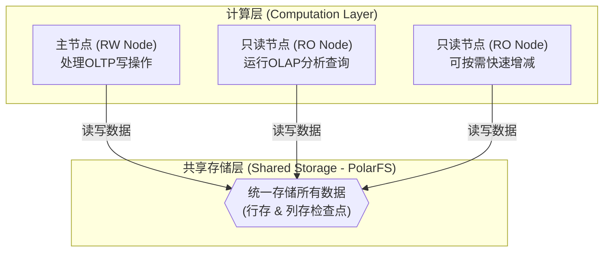
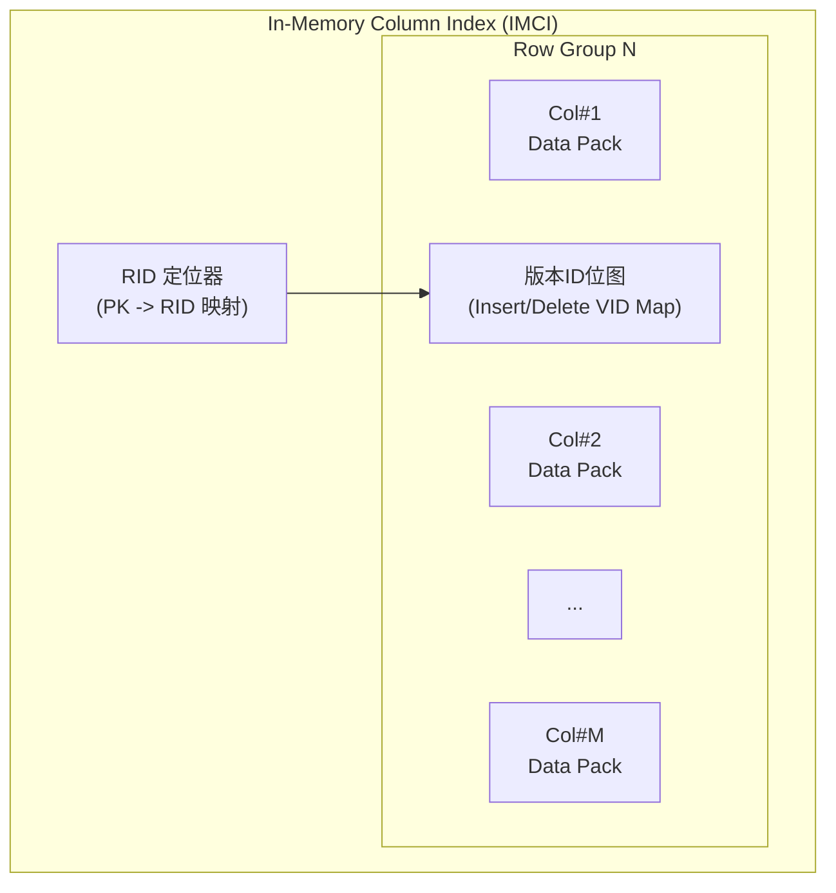
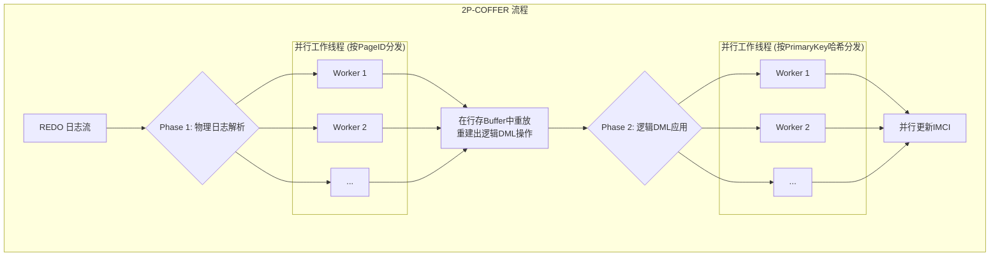

## AI论文解读 | PolarDB-IMCI: A Cloud-Native HTAP Database System at Alibaba
        
### 作者        
digoal        
        
### 日期        
2025-07-16       
        
### 标签        
PostgreSQL , PolarDB , DuckDB , AI , 论文解读        
        
----        
        
## 背景  
      
https://arxiv.org/pdf/2305.08468        
  
      
提示:        
```        
读懂《PolarDB-IMCI: A Cloud-Native HTAP Database System at Alibaba》这篇论文需要提前掌握哪些基础知识, 请使用中文给我讲一下这些基础知识, 尽量通熟易懂, 可以使用markdown支持的图形增加解释性.        
        
使用中文通熟易懂的解读《PolarDB-IMCI: A Cloud-Native HTAP Database System at Alibaba》这篇论文, 关键内容请深入讲解, 可以使用markdown支持的图形增加解释性.        
        
使用中文提取《PolarDB-IMCI: A Cloud-Native HTAP Database System at Alibaba》论文中一些重要的术语并详细解释, 可以使用markdown支持的图形示增加解释性.        
```        
        
## 1 前置知识 
  
### 理解《PolarDB-IMCI》论文所需的核心基础知识

要完全读懂《PolarDB-IMCI: A Cloud-Native HTAP Database System at Alibaba》这篇关于阿里巴巴云原生混合事务和分析处理（HTAP）数据库的论文，您需要对现代数据库的几个核心概念有扎实的理解。以下将用通俗易懂的语言，结合图表，为您讲解这些必备的基础知识。

-----

#### 1\. OLTP 与 OLAP：数据库的两种核心应用场景

首先，我们需要理解数据库系统通常需要应对两种截然不同的工作负载（Workload）：

  * **OLTP (Online Transactional Processing，在线事务处理)**

      * **是什么？** 主要处理高并发、简短的“事务性”操作。您可以将其想象成电商网站的下单、支付系统，或者银行的存取款业务。
      * **特点：**
          * **操作简单：** 大多是针对单条或少量几条记录的增加、删除、修改、查询操作。
          * **高并发：** 同一时间有成千上万的用户在进行操作。
          * **响应快：** 操作必须在毫秒级完成，以保证用户体验。
          * **数据一致性要求极高：** 每一笔交易都不能出错。
      *  **典型系统：** MySQL  、银行核心交易系统。

  * **OLAP (Online Analytical Processing，在线分析处理)**

      * **是什么？** 主要处理复杂的“分析性”查询，用于商业智能和数据挖掘。您可以将其想象成公司的决策者在分析季度财报，例如“统计过去一年里每个商品品类的总销售额”。
      * **特点：**
          * **查询复杂：** 通常涉及对海量数据的聚合运算（如求和、平均、分组）。
          * **数据量大：** 需要扫描数月甚至数年的历史数据。
          * **响应时间不苛刻：** 用户愿意等待数秒甚至数分钟来获得一个复杂的分析结果。
      *  **典型系统：** ClickHouse   、Snowflake  。

**核心矛盾：** OLTP追求快速读写单行数据，而OLAP追求快速扫描大量数据的某一列。这两种需求对数据的存储方式和处理引擎的要求几乎是完全相反的。

-----

#### 2\. 行式存储 vs. 列式存储：数据的两种存放之道

为了分别优化OLTP和OLAP的性能，数据库采用了不同的数据组织格式。

  * **行式存储 (Row-based Storage)**

      * **方式：** 数据以“行”为单位连续存放在一起。一行记录的所有字段（例如一个用户的所有信息：ID、姓名、年龄、地址）在物理上是挨着存储的。
      * **优势：** 非常适合OLTP。当您需要处理一整行数据时（如获取某个用户的所有信息），效率极高，因为只需要一次磁盘I/O。
      * **劣势：** 在OLAP场景下效率低下。如果您只想分析所有用户的“年龄”分布，数据库也必须把每一行的所有字段（姓名、地址等无关信息）都读取出来，造成了大量的资源浪费。

    

    ```markdown
    ### 行式存储 (Row-based)
    | ID  | Name  | Age | City    |
    |-----|-------|-----|---------|
    | 1   | Alice | 30  | New York|  --> 物理存储: [ 1 | Alice | 30 | New York ]
    | 2   | Bob   | 25  | London  |  --> 物理存储: [ 2 | Bob   | 25 | London   ]
    ```

  * **列式存储 (Column-based / Columnar Storage)**

      * **方式：** 数据以“列”为单位连续存放在一起。同一列的所有数据（例如所有用户的年龄）在物理上是挨着存储的。
      * **优势：** OLAP的利器。当您要分析所有用户的年龄时，数据库只需读取“年龄”这一列的数据，极大地减少了I/O。同时，因为同一列的数据类型相同，非常有利于数据压缩。
      * **劣势：** 不适合OLTP。如果要获取单个用户的所有信息，数据库需要分别到ID列、姓名列、年龄列、地址列去读取数据再拼接，I/O操作会非常多。

    

    ```markdown
    ### 列式存储 (Column-based)
    | ID  | Name  | Age | City    |
    |-----|-------|-----|---------|
    | 1   | Alice | 30  | New York|
    | 2   | Bob   | 25  | London  |

    ### 物理存储:
    ID列:   [ 1 | 2 ]
    Name列: [ Alice | Bob ]
    Age列:  [ 30 | 25 ]
    ```

 PolarDB-IMCI正是通过在一个系统中同时支持行式存储和列式存储（论文中称为“列存索引”  ）来兼顾两种负载的。

-----

#### 3\. HTAP：当OLTP与OLAP“联姻”

 传统上，企业会部署两套独立的数据库系统：一个OLTP数据库处理在线业务，一个OLAP数据库用于数据分析。然后通过 **ETL (Extract-Transform-Load，抽取-转换-加载)**   工具，定期（如每天晚上）将数据从OLTP系统同步到OLAP系统。

  * **ETL方案的痛点：**
      *  **数据延迟高：** 分析系统看到的数据不是实时的，可能是几小时甚至一天前的  。
      *  **成本与复杂度高：** 需要维护两套独立的系统和数据同步链路  。




 为了解决这些问题，**HTAP (Hybrid Transactional/Analytical Processing，混合事务和分析处理)**    概念应运而生。其目标是在**同一个数据库系统**内，同时高效地处理OLTP和OLAP负载，让数据分析能够基于最新的在线数据进行   。PolarDB-IMCI正是一个HTAP数据库系统  。



-----

#### 4\. 云原生与存算分离

  * **云原生 (Cloud-Native)**

      *  **是什么？** 这是一种软件架构理念，旨在充分利用云计算的优势（如弹性、分布式、高可用）来构建和运行应用程序  。

  * **存算分离 (Storage-Computation Separation)**

      *  **是什么？** 这是云原生数据库最关键的架构特征，它将数据库的“计算”（处理查询、执行逻辑）和“存储”（持久化数据）两个功能模块解耦，使其可以独立扩展  。
      * **计算层 (Computation Layer)：** 由多个计算节点组成，负责执行SQL和处理事务。
      *  **存储层 (Storage Layer)：** 是一个共享的、高可用的分布式存储池（如论文中的PolarFS  ），负责数据的统一存储。
      * **巨大优势——弹性 (Elasticity)：**
          *  当分析任务增多时，可以快速增加计算节点（论文中的**只读节点RO Node**  ）来应对，而无需移动和复制庞大的底层数据。
          * 当业务高峰过去，可以缩减计算节点以节约成本。
          *  这正是PolarDB-IMCI能实现“秒级”弹性伸缩能力的核心原因  。




-----

#### 5\. 数据同步与REDO日志

 在PolarDB-IMCI的架构中，写入操作在 **主节点（RW Node）** 上完成，而分析查询则在 **只读节点（RO Node）** 上执行，以实现负载隔离  。这就需要一种高效的机制，将主节点的数据变更实时同步到只读节点。

  *  **Binlog (逻辑日志):** 记录的是SQL语句级别的变更（如`UPDATE...`）。这种方式对接收方友好，但会给主节点带来额外的I/O开销，影响OLTP性能  。

  *  **REDO Log (物理日志):** 记录的是数据在物理存储层面（如在哪个数据页的哪个位置）的“差异”变化  。它写入极快，对OLTP性能影响微乎其微。

      *  **挑战：** REDO日志是为行式存储紧密耦合设计的  。如何用它来更新一个结构完全不同的列式存储，是业界公认的难题。

 **PolarDB-IMCI的重大创新：** 论文的核心贡献之一就是实现了利用**REDO日志**来同步异构存储（从行存到列存）  。通过**CALS（预提交日志传输）**    和 **2P-COFFER（两阶段无冲突并行回放）**    等技术，将数据可见延迟降低到了毫秒级  ，实现了极高的数据新鲜度。

### 总结

掌握了以上概念后，您就能清晰地理解论文的设计目标及其对应的技术方案：

| 论文设计目标 | 关联的基础知识 | PolarDB-IMCI 的解决方案 |
| :--- | :--- | :--- |
| **G\#1: 透明性** | OLTP/OLAP, HTAP |  提供统一的SQL接口和智能查询路由，用户无需关心底层是行存还是列存  。 |
| **G\#2: 高OLAP性能** | OLAP, 列式存储 |  在只读节点上构建**列存索引 (IMCI)**，并配备了为列存优化的向量化并行执行引擎  。 |
| **G\#3: 对OLTP影响小** | OLTP, 存算分离 |  通过**存算分离**架构，将消耗资源的分析负载隔离在 **只读节点 (RO Node)** 上执行  。 |
| **G\#4: 高数据新鲜度** | HTAP, REDO日志 |  放弃传统的ETL，创新地使用REDO日志进行数据同步，实现毫秒级数据可见延迟  。 |
| **G\#5: 高资源弹性** | 云原生, 存算分离 |  基于**存算分离**和共享存储，可以快速（秒级）拉起新的只读节点来应对突发的分析需求  。 |

希望这份讲解能为您扫清阅读障碍，助您顺利深入地理解这篇优秀的论文。
  
## 2 解读论文 
  
好的，我们来一起深入解读这篇来自阿里巴巴的重磅论文——《PolarDB-IMCI: A Cloud-Native HTAP Database System at Alibaba》。这篇论文在数据库领域的顶级会议SIGMOD '23上发表，介绍了一种先进的云原生HTAP（混合事务和分析处理）数据库系统。

我将用通俗易懂的语言，结合图表，为您剖析其核心思想、关键技术和创新之处。

### 核心思想：一个系统，解决两类问题

首先，我们要理解传统数据库面临的一个巨大挑战：**事务处理 (OLTP)** 和 **分析处理 (OLAP)** 是两种截然不同的需求。

  * **OLTP (Online Transactional Processing)**：就像电商下单、银行转账，要求是快速、高并发地处理单条或少量数据。
  * **OLAP (Online Analytical Processing)**：就像分析季度财报、用户行为，要求是对海量数据进行复杂的聚合、统计。

 传统方案是使用两种独立的数据库（如用MySQL处理OLTP，用ClickHouse处理OLAP），然后通过ETL（数据抽取、转换、加载）工具同步数据   。这种方案不仅成本高、架构复杂，而且分析的数据存在数小时甚至一天的延迟  。

 PolarDB-IMCI的目标就是**在一个数据库系统内，同时高效地解决这两类问题**，实现对最新鲜数据的实时分析，这就是HTAP（Hybrid Transactional/Analytical Processing）  。

 基于此，论文提出了云原生HTAP数据库的五大设计目标  ：

1.   **G\#1: 透明查询**：用户无需区分是OLTP还是OLAP查询，系统自动路由到最优的执行引擎  。
2.   **G\#2: 高性能分析**：OLAP查询性能需媲美顶尖的专用分析型数据库  。
3.   **G\#3: 对事务影响极小**：在大幅提升分析性能的同时，不能拖慢核心的OLTP业务  。
4.   **G\#4: 高数据新鲜度**：分析的数据必须是准实时的，延迟要尽可能低  。
5.   **G\#5: 高资源弹性**：作为云原生系统，必须能根据负载变化，在秒级或分钟级快速伸缩资源  。

-----

### 关键架构：存算分离与读写分离

 为了实现上述目标，PolarDB-IMCI采用了“**存算分离**”的云原生架构，这是整个系统的基石  。

  *  **存储层 (Shared Storage)**：采用阿里巴巴自研的分布式文件系统PolarFS，所有数据（包括行存和列存的检查点）都存放在这一共享层  。
  *  **计算层 (Computation Layer)**：由两种角色的计算节点组成，它们不存持久化数据，只负责计算，可以按需、快速地创建和销毁  。
      *  **主节点 (Read/Write Primary)**：集群中只有一个，负责处理所有的写入请求（OLTP事务） 。
      *  **只读节点 (Read-only Replica)**：可以有多个，负责处理所有的读取请求，特别是资源消耗巨大的OLAP分析查询  。

这种架构的好处是显而易见的：

  *  **资源隔离**：OLAP的复杂查询在只读节点上运行，不会与主节点上的OLTP事务争抢CPU和内存，完美实现了**G\#3 (对事务影响极小)**  。
  *  **极致弹性**：当分析请求突增时，只需利用共享存储层的数据，在几秒内快速拉起新的只读节点即可应对，实现了**G\#5 (高资源弹性)**  。




图1: PolarDB-IMCI 存算分离架构示意图  

-----

### 核心技术与创新

#### 1\. 列存索引 (IMCI)：OLAP性能的加速器

 为了实现与专业OLAP系统媲美的性能（**G\#2**），PolarDB-IMCI在**只读节点**上，为行存数据建立了一份内存中的**列式副本**，称为**列存索引 (In-Memory Column Index, IMCI)**  。

  *  **双存储格式**：只读节点同时维护了行存（Buffer Pool）和列存（IMCI），可以根据查询类型选择最优的数据格式  。
  * **列存数据组织**：
      *  数据被划分为多个**行组 (Row Group)**  。
      *  在行组内，每列数据被组织成一个**数据包 (Data Pack)**，并进行高效压缩  。
      *  为了快速定位，系统通过一个 **RID定位器 (RID Locator)** 维护主键(PK)到行ID(RID)的映射  。
      *  为了实现多版本并发控制（MVCC），每个行组都包含 **版本ID位图 (VID Map)** 来控制行的可见性  。
  *  **写操作优化**：对列存的更新采用 **out-place（非原地）** 方式，即更新操作被分解为一个删除（标记旧数据为不可见）和一个插入（追加新数据），这极大地提升了写入性能和并发度  。

#### 2\. 更新传播：低延迟、低影响的数据同步方案

 这是论文中最具创新性的部分，完美地解决了**G\#3 (低影响)** 和 **G\#4 (高新鲜度)** 的核心矛盾。PolarDB-IMCI摒弃了传统的Binlog（逻辑日志）方案，因为它会对主节点OLTP性能造成额外负担   ，而是开创性地**复用物理REDO日志**来同步异构存储（从行存到列存） 。

这个过程非常精妙，可以分解为以下几个步骤：



图2: PolarDB-IMCI 基于REDO日志的更新传播流程  

  *  **Commit-Ahead Log Shipping (CALS)**：主节点的事务日志（REDO Log）在**提交前**就被发送到共享存储，只读节点可以立即开始拉取和处理，极大地缩短了数据同步的起始延迟  。

  * **2P-COFFER (两阶段无冲突并行回放)**：这是解决“如何用物理日志更新列存”这一难题的关键。

      *  **阶段一：物理日志解析**：只读节点上的工作线程并行地读取REDO日志。由于REDO日志只记录了物理页面的变更，为了还原出完整的“逻辑操作”（比如，`UPDATE users SET age = 31 WHERE id = 100`），线程会在只读节点的一个 **行存缓存(Buffer Pool)** 中重放这些页面变更。通过这个过程，系统就能准确地知道原始的逻辑操作是什么  。这一步巧妙地绕开了直接解析物理日志的复杂性。
      *  **阶段二：逻辑DML应用**：重建出的逻辑DML操作（增、删、改）会被分发给多个工作线程。分发的依据是操作行的**主键哈希值**   。这样可以保证对**同一行数据的所有操作都会被分配到同一个线程中按顺序执行**，而不同行数据的操作则可以完全并行，从而避免了锁冲突，实现了高效的并行回放  。

 通过这一系列创新，PolarDB-IMCI实现了毫秒级的可见延迟（\<5ms on typical workloads），同时对主节点OLTP性能的影响小于5%  。

#### 3\. 查询处理与弹性

  *  **透明查询路由 (G\#1)**：PolarDB-IMCI的优化器会进行成本估算。对于简单的点查等请求，它会生成行存执行计划；而对于复杂的分析请求，如果估算出的成本超过一个阈值，它会自动生成列存执行计划，并交由列式引擎执行  。整个过程对用户完全透明。
  *  **高性能执行引擎**：其列式引擎吸收了业界先进技术，如流水线执行模型、并行算子和利用CPU SIMD指令的向量化计算，以加速查询  。
  *  **秒级弹性 (G\#5)**：当需要扩容一个新的只读分析节点时，新节点可以直接从共享存储加载最新的**列存检查点(Checkpoint)来快速构建内存中的列存索引   。之后，再通过高效的REDO日志回放机制追平少量增量数据   。整个过程耗时仅为数十秒**，实现了强大的资源弹性  。

### 评估结果总结

论文通过在标准测试集（TPC-H）和生产环境中的大量实验，验证了其设计的有效性：

  *  **OLAP性能**：在TPC-H 100GB测试中，相比纯行存的PolarDB，取得了最高**149倍**的加速比，整体性能与顶尖的OLAP数据库ClickHouse相当甚至更优  。
  *  **OLTP影响**：即使在OLAP负载持续增加的情况下，对OLTP核心业务的性能影响也**小于5%**  。
  *  **数据新鲜度**：在典型负载下，数据从写入到可分析的延迟**小于5毫秒**，重负载下也小于30毫秒  。
  *  **资源弹性**：增加一个只读节点（Scale-out）以增强分析能力，耗时仅需**数十秒**  。

### 结论

《PolarDB-IMCI》这篇论文系统性地展示了如何在云原生时代，通过存算分离、创新的异构数据同步机制和智能查询处理，打造一个真正能同时满足OLTP和OLAP需求的HTAP数据库。它不仅解决了传统ETL方案的诸多痛点，还为未来云数据库的发展方向提供了宝贵的实践经验和理论参考。
  
## 3 术语  
  
好的，以下是从《PolarDB-IMCI: A Cloud-Native HTAP Database System at Alibaba》这篇论文中提取的关键术语及其详细解释，并配有Markdown图形以帮助理解。

-----

### 1\. 存算分离 (Storage-Computation Separation)

  * **解释**:
     这是PolarDB-IMCI作为云原生数据库的基石架构   。它将数据库系统的两大核心功能——“计算”（处理SQL查询、执行事务逻辑）和“存储”（持久化保存数据）——解耦成两个独立的层级   。计算层由多个无状态的计算节点组成，存储层则是一个共享的分布式存储池（PolarFS）  。这种架构使得计算资源和存储资源可以根据需求独立、快速地进行伸缩，而无需移动底层数据，从而实现极高的资源弹性和成本效益  。




图1: 存算分离架构示意图   

-----

### 2\. 列存索引 (In-Memory Column Index, IMCI)

  * **解释**:
     IMCI是PolarDB-IMCI为加速分析查询（OLAP）而设计的核心组件   。它本质上是在只读（RO）节点上，为传统的行式存储数据创建的一份**内存中的、只追加的(append-only)列式副本**   。当执行复杂的分析查询时，系统会利用IMCI的列式布局，只需读取相关列的数据，从而极大减少I/O，并利用列式数据的特点进行高效压缩和向量化计算，实现OLAP性能的飞跃  。

     其内部数据组织结构如下  ：

      *  **行组 (Row Group)**: 数据表被水平切分成多个固定大小的行组（例如，每组包含64K行） 。
      *  **数据包 (Data Pack)**: 在一个行组内，每一列的数据被组织成一个数据包，并进行压缩存储  。
      *  **RID 定位器 (RID Locator)**: 由于数据是按插入顺序存储的，需要一个高效的映射结构（论文中实现为两层LSM树）来根据主键（PK）快速找到行的物理位置（Row-ID, RID） 。
      *  **版本ID位图 (VID Map)**: 用于实现多版本并发控制（MVCC），通过记录每个数据版本的插入和删除时间戳，来控制事务的可见性  。




图2: IMCI 内部结构示意图  

-----

### 3\. 更新传播 (Update Propagation)

  * **解释**:
     这是指将主节点（RW Node）上的数据变更实时、高效地同步到只读节点（RO Node）上的IMCI的过程   。PolarDB-IMCI的创新之处在于**复用物理REDO日志**而非额外的逻辑日志（如Binlog）来进行同步，从而最大限度地降低对主节点OLTP性能的影响  。

-----

### 4\. 预提交日志传输 (Commit-Ahead Log Shipping, CALS)

  * **解释**:
     CALS是更新传播过程中的一项关键优化技术   。它指的是，主节点上的事务在生成REDO日志后，**无需等待事务完全提交**，就立即将这些日志发送到共享存储中   。只读节点可以马上开始拉取并预处理这些日志，从而有效缩短从数据写入到数据在分析节点可见的端到端延迟，提升数据新鲜度  。

-----

### 5\. 两阶段无冲突并行回放 (2-Phase Conflict-Free Parallel Replay, 2P-COFFER)

  * **解释**:
     这是论文中解决“如何用物理REDO日志来更新异构的列式存储”这一核心难题的创新算法   。它将复杂的日志回放过程分解为两个无冲突的并行阶段  ：
      * **阶段一：物理日志解析 (Physical Log Parse)**:
         只读节点的工作线程并行读取REDO日志   。由于REDO日志只记录了物理页面的变更信息，为了还原出完整的逻辑操作，线程会在一个内存中的**行存缓存区 (row-based buffer pool)** 中重放这些页面变更   。通过这个“模拟执行”的过程，系统能准确地将物理变更“翻译”成上层的逻辑DML操作（如Insert、Delete、Update） 。

      * **阶段二：逻辑DML应用 (Logical DML Apply)**:
         上一阶段生成的逻辑DML操作，会被一个分发器根据其操作行的**主键（Primary Key）哈希值**，分发给不同的工作线程   。这种分发策略确保了**对同一行的所有修改都会被送到同一个线程中按序执行**，而不同行之间的修改则可以完全并行处理   。这巧妙地避免了线程间的锁竞争，实现了高效、无冲突的并行数据更新  。




图3: 2P-COFFER 流程示意图   

-----

### 6\. 可见延迟 (Visibility Delay, VD)

  * **解释**:
     这是衡量HTAP系统数据新鲜度的一个关键指标   。它定义为：从一个更新在主节点（RW Node）上提交完成，到这个更新在只读节点（RO Node）上对分析查询可见，所经过的时间间隔   。PolarDB-IMCI通过CALS和2P-COFFER等一系列优化，将典型负载下的可见延迟控制在5毫秒以内，重负载下也能保持在30毫秒以内  。
  
## 参考        
         
https://arxiv.org/pdf/2305.08468  
        
        
<b> 以上内容基于DeepSeek、Qwen、Gemini及诸多AI生成, 轻微人工调整, 感谢杭州深度求索人工智能、阿里云、Google等公司. </b>        
        
<b> AI 生成的内容请自行辨别正确性, 当然也多了些许踩坑的乐趣, 毕竟冒险是每个男人的天性.  </b>        
    
  
  
#### [期望 PostgreSQL|开源PolarDB 增加什么功能?](https://github.com/digoal/blog/issues/76 "269ac3d1c492e938c0191101c7238216")
  
  
#### [PolarDB 开源数据库](https://openpolardb.com/home "57258f76c37864c6e6d23383d05714ea")
  
  
#### [PolarDB 学习图谱](https://www.aliyun.com/database/openpolardb/activity "8642f60e04ed0c814bf9cb9677976bd4")
  
  
#### [PostgreSQL 解决方案集合](../201706/20170601_02.md "40cff096e9ed7122c512b35d8561d9c8")
  
  
#### [德哥 / digoal's Github - 公益是一辈子的事.](https://github.com/digoal/blog/blob/master/README.md "22709685feb7cab07d30f30387f0a9ae")
  
  
#### [About 德哥](https://github.com/digoal/blog/blob/master/me/readme.md "a37735981e7704886ffd590565582dd0")
  
  

  
