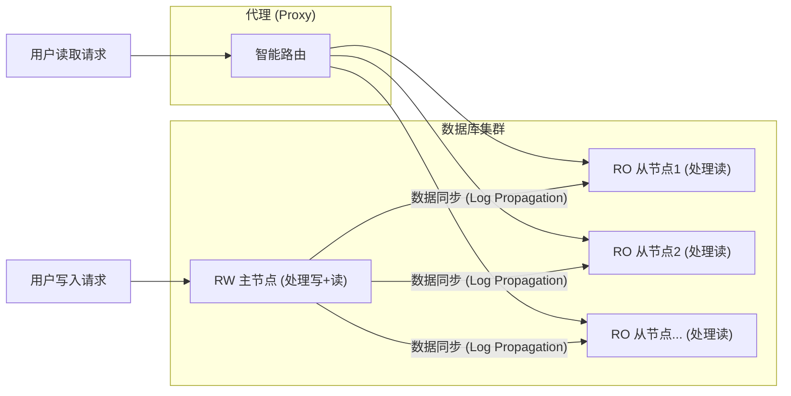
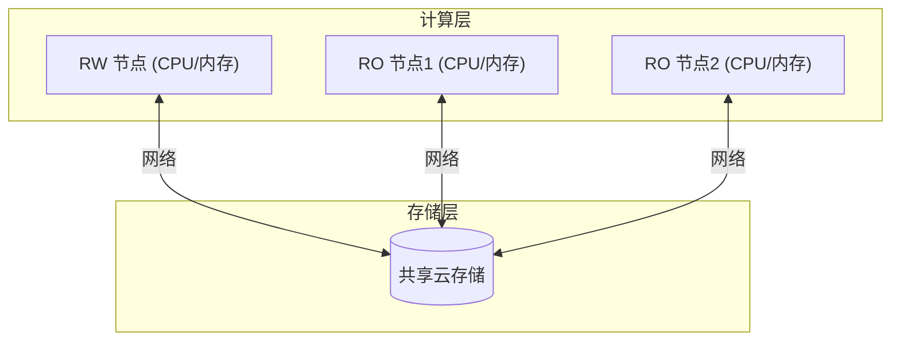
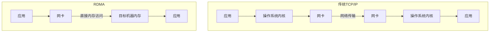
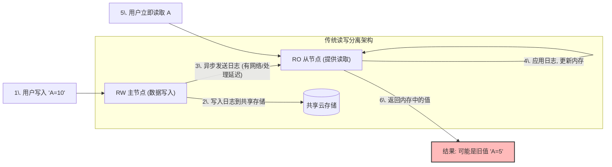
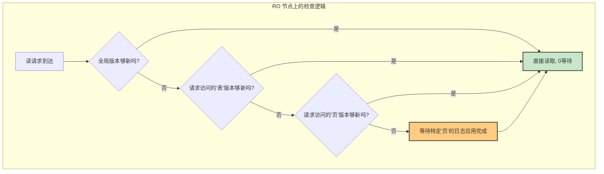
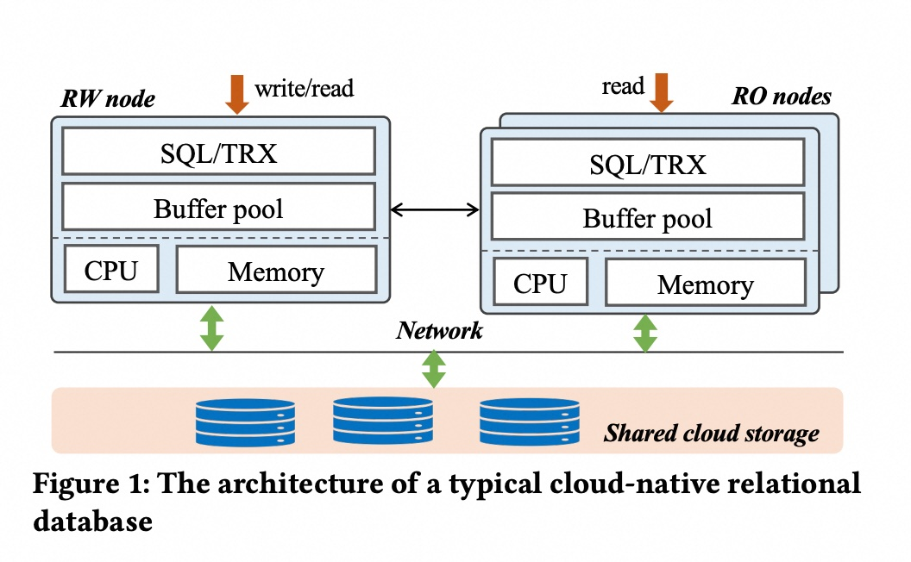
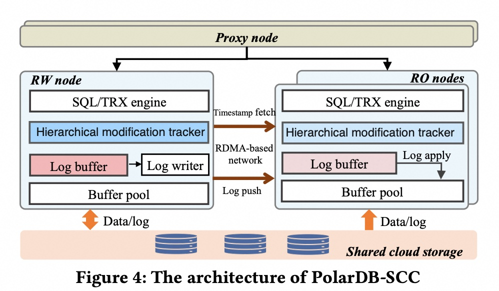

## AI论文解读 | PolarDB-SCC: A Cloud-Native Database Ensuring Low Latency for Strongly Consistent Reads
        
### 作者        
digoal        
        
### 日期        
2025-07-16       
        
### 标签        
PostgreSQL , PolarDB , DuckDB , AI , 论文解读        
        
----        
        
## 背景  
      
https://www.vldb.org/pvldb/vol16/p3754-chen.pdf        
  
      
提示:        
```        
读懂《PolarDB-SCC: A Cloud-Native Database Ensuring Low Latency for Strongly Consistent Reads》这篇论文需要提前掌握哪些基础知识, 请使用中文给我讲一下这些基础知识, 尽量通熟易懂, 可以使用markdown支持的图形增加解释性.        
        
使用中文通熟易懂的解读《PolarDB-SCC: A Cloud-Native Database Ensuring Low Latency for Strongly Consistent Reads》这篇论文, 关键内容请深入讲解, 可以使用markdown支持的图形增加解释性.        
        
使用中文提取《PolarDB-SCC: A Cloud-Native Database Ensuring Low Latency for Strongly Consistent Reads》论文中一些重要的术语并详细解释, 可以使用markdown支持的图形示增加解释性.        
```        
        
## 1 前置知识 
  
好的，为了完全理解《PolarDB-SCC：一种为强一致性读取确保低延迟的云原生数据库》这篇论文，你需要掌握一些数据库、分布式系统和网络技术的基础知识。

下面我将用通俗易懂的语言，为你讲解这些核心基础知识，并使用Markdown图表辅助解释。

-----

### 1\. 数据库架构基础 (The "Stage")

这是理解论文中系统所处环境的基础。

#### (1) 读写分离 (Read/Write Splitting)

在很多应用场景中，读取数据的次数远多于写入数据的次数。为了提升整个系统的处理能力（吞吐量），一种常见的架构就是“读写分离”。

  * **写/读节点 (RW Node / 主节点)**: 负责处理所有**写入**请求（如新增、修改、删除数据）和一部分读取请求。它是数据的唯一权威来源。
  * **只读节点 (RO Node / 从节点)**: 可以有一个或多个，它们从主节点同步数据，专门负责处理**只读**请求。这样可以分担主节点的读取压力。

 这篇论文的背景就是这种一个主节点（RW）、多个从节点（RO）的架构  。



#### (2) 存算分离 (Disaggregated Storage and Compute)

这是“云原生”数据库的一个核心特征。传统数据库中，计算（CPU、内存）和存储（硬盘）是紧密耦合在一台服务器里的。而存算分离架构将它们解耦。

  * **计算节点**: 就是上面提到的 RW 和 RO 节点，它们主要负责执行 SQL、处理事务、管理内存中的热数据。
  * **共享存储 (Shared Storage)**: 所有的计算节点共享同一份底层的、高可用的云存储。

 **好处**: 增加只读（RO）节点时，不需要复制一份完整的物理数据，只需要启动一个新的计算实例并接入共享存储即可，这使得扩缩容变得非常快速和节省成本  。



-----

### 2\. 数据一致性模型 (The "Problem")

这是论文要解决的核心问题。

#### (1) 强一致性 (Strong Consistency)

 简单来说，强一致性保证任何用户在任何时刻读取数据，读到的都必须是**最新**的、已成功提交的版本。一个非常重要的特例是“写后读一致性”（Read-after-write Consistency）  。

  * **生活中的例子**: 你在银行App存了一笔钱，交易成功后，你**立刻**查询余额，显示的一定是存钱后的新余额。绝不允许你看到旧的余额。
  *  **论文中的场景**: 在电商应用中，用户下了订单并支付成功后，查询订单状态时必须显示为“已支付”，而不能是“未支付”的旧状态  。

#### (2) 最终一致性 (Eventual Consistency)

 这是一种比强一致性弱的模型。它不保证能立即读到最新数据，只保证如果后续没有新的写入，系统中的所有副本“最终”会达到一致的状态。在达到一致之前，读取可能会读到旧数据，这被称为“**脏读**”或“**读到旧数据**”（Stale Read）  。

  * **生活中的例子**: 你发了一条朋友圈，你的朋友A可能马上就看到了，但因为网络延迟，朋友B可能要过几秒钟才能看到。在这几秒钟内，对于B来说，数据就是“旧”的。
  *  **论文中的问题**: 在读写分离架构中，主节点的数据是通过网络异步同步给从节点的   。这个同步过程有延迟，导致用户从只读节点查询时，很容易读到几毫秒甚至更久之前的旧数据  。

 **PolarDB-SCC这篇论文的核心目标，就是在读写分离的架构下，让只读（RO）节点也能提供强一致性的读取能力，同时还不带来巨大的性能延迟**  。

-----

### 3\. 核心数据库内部概念 (The "Tools")

这些是数据库内部用于实现同步和数据管理的机制。

#### (1) 预写日志 (Write-Ahead Log, WAL) 和 LSN

  * **WAL**: 这是数据库保证数据持久性和可恢复性的核心机制。任何对数据的修改，都必须**先**将描述这个修改的“日志”记录写入到稳定存储（如硬盘）中，然后才能去修改内存中的数据页。这个日志就是WAL。
  *  **LSN (Log Sequence Number)**: 每一条日志记录都有一个唯一的、单调递增的编号，就是LSN。它相当于数据库状态的版本号。LSN越大，代表数据的状态越新。在论文中，主从节点的数据同步就是通过传递和应用这些WAL日志来实现的   ，而LSN则被巧妙地用作了修改时间的“时间戳”  。

#### (2) 缓冲池 (Buffer Pool)

 数据库为了避免频繁读写慢速的硬盘，会在内存中开辟一块区域来缓存最常访问的数据页，这块区域就是缓冲池。所有的数据读写操作都优先在缓冲池中进行。RO节点也一样，它接收到主节点传来的日志（WAL），然后在自己的缓冲池里应用这些修改，以保持缓存数据的更新  。

-----

### 4\. 关键网络与分布式技术 (The "Enablers")

这些是论文中实现低延迟方案所依赖的关键技术。

#### (1) RDMA (远程直接内存访问)

  * **传统网络 (TCP/IP)**: 数据从一台机器的内存发送到另一台，需要经过发送方和接收方两边操作系统的内核进行多次拷贝和处理，这会消耗大量的CPU资源，并且延迟较高。
  *  **RDMA**: 它允许一台计算机的网卡直接读写另一台计算机的内存，完全绕过了对方的操作系统和CPU。这极大地降低了网络延迟和CPU开销  。

 论文中，PolarDB-SCC使用RDMA来高速传输日志和获取时间戳，这是实现“低延迟”的一个关键武器  。



#### (2) Lamport 时间戳 (Lamport Timestamp)

在分布式系统中，由于没有一个统一的物理时钟，很难判断两个事件的先后顺序。Lamport时间戳是一种逻辑时钟，它不关心物理时间，只关心事件之间的因果“偏序”关系（Happens-Before）。

  * **核心思想**: 如果事件A发生在事件B之前，那么A的时间戳一定小于B的时间戳。
  *  **论文中的应用**: 论文提出的“线性Lamport时间戳”    就是借鉴了这个思想。它允许多个在时间上靠得很近的读取请求，复用一次从主节点获取来的时间戳，而不需要每个请求都去网络上问一次主节点  。这大大减少了网络通信的开销。

### 总结

掌握了以上基础知识后，你就可以更好地理解这篇论文的精髓了：

> 在一个**读写分离**和**存算分离**的云原生数据库架构中，由于主从节点间**异步的日志同步**，导致从节点存在**数据陈旧（Stale Read）** 的问题，无法满足**强一致性**的要求。
>
> **PolarDB-SCC** 通过引入三个核心技术：
>
> 1.  **分层修改追踪器 (Hierarchical Modification Tracker)**：更精细地判断数据是否为最新，避免不必要的等待。
> 2.  **线性Lamport时间戳 (Linear Lamport Timestamp)**：减少从节点向主节点确认“当前最新版本”的次数。
> 3.  **基于RDMA的日志传输 (RDMA-based Log Shipment)**：用超低延迟的网络硬件加速数据同步过程。
>
> 最终，它在几乎不增加额外延迟的情况下，让只读节点也能提供强一致性的读取服务，从而真正发挥了读写分离架构的威力。
  
## 2 解读论文 
  
好的，我们来一起深入解读这篇重量级的数据库论文——《PolarDB-SCC: A Cloud-Native Database Ensuring Low Latency for Strongly Consistent Reads》。

这篇论文的核心是解决了一个在云原生数据库领域普遍存在的“鱼与熊掌不可兼得”的难题：如何在提供高吞吐、可扩展的只读节点的同时，保证用户能立即读到最新的数据（即强一致性），而且还不牺牲性能。

-----

### 一、问题的根源：云原生数据库的“原罪”——数据延迟

首先，我们需要理解论文所针对的经典云原生数据库架构。

  *  **架构特点**：通常采用“读写分离”和“存算分离”的设计  。

      *  一个 **读写 (RW) 主节点**：处理所有写入请求和部分读取请求  。
      *  多个 **只读 (RO) 从节点**：通过增加从节点来水平扩展读取能力  。
      *  所有节点共享底层的 **云存储**  。

  *  **问题的产生**：主节点完成数据写入后，会将描述这些数据变更的**预写日志 (WAL)** 异步地传输给从节点   。从节点接收到日志后再应用到自己的内存中，以保持数据更新  。这里的“**异步**”就是问题的根源。




这个延迟导致了棘手的二选一：

1.   **接受最终一致性**：读取 RO 节点，速度快，但可能读到旧数据（Stale Read）  。这对于金融、电商等要求严格的场景是不可接受的  。
2.   **保证强一致性**：所有读请求都发给唯一的 RW 节点，或者采用低效的等待策略，导致 RO 节点形同虚设，系统扩展性大打折扣  。

这篇论文提出的 PolarDB-SCC，就是要打破这个僵局。

-----

### 二、传统解决方案的弊端

论文首先分析了两种简单的强一致性实现方式，并指出了它们的性能缺陷。

1.   **提交时等待 (Commit-Wait)**：RW 节点在提交一个事务前，必须等待所有 RO 节点都确认收并应用了相关的日志   。这会严重拖慢写入操作的响应时间，对写性能是毁灭性的打击  。

2.   **读取时等待 (Read-Wait)**：这是 PolarDB-SCC 改进的基础。当一个读请求到达 RO 节点时，它先去问一下 RW 节点当前的最新数据版本（时间戳），然后一直等待，直到自己的数据追上这个版本后，再执行读取  。

      *  **缺点1：拖慢主节点**：大量的读请求会产生同等数量的时间戳查询请求，给 RW 节点带来巨大压力  。
      *  **缺点2：无效等待**：即使读请求只关心一张小表或几行数据，RO 节点也必须等待整个数据库的内存状态都达到最新版本，这其中大部分等待都是不必要的  。

 实验表明，简单的 Read-Wait 策略性能极差，相比于直接把所有请求都发给主节点，几乎没有优势  。

-----

### 三、PolarDB-SCC 的三大核心创新

 PolarDB-SCC 的设计思想是：**在 Read-Wait 的基础上，通过一系列优化，最大限度地消除不必要的等待，并缩短必须的等待时间**  。

#### 创新一：分层修改追踪器 (Hierarchical Modification Tracker)

这是为了解决“无效等待”问题的关键。它不再要求整个数据库都达到最新，而是以更精细的粒度来判断数据是否足够新。

  *  **追踪三个层级**：PolarDB-SCC 在 RW 节点上维护了三个不同粒度的“最新修改时间戳”  。

     1.  **全局级 (Global Level)**：整个数据库最新的提交时间戳。
     2.  **表级 (Table Level)**：某张表最新的修改时间戳。
     3.  **页级 (Page Level)**：某个数据页（物理存储的最小单位）最新的修改时间戳。

  * **工作流程**：当 RO 节点处理一个读请求时，它会按“从粗到细”的顺序检查：

    1.  **先看全局**：我的数据版本是否已经比请求需要的最老版本还要新？如果是，那万事大吉，直接读取，无需任何等待。
    2.  **再看表**：如果全局版本落后了，那就只看这个请求要访问的**表**的版本是否满足要求。如果满足，也直接读。
    3.  **最后看页**：如果表的版本也落后了，那就精确到这个请求要访问的**数据页**。
    4.   **最终等待**：只有当最精确的“页”级别的数据还没同步过来时，才需要等待，而且只等待这一个或几个页的日志应用完成即可  。




 这个设计极大地减少了不必要的等待时间，因为大部分请求可能只访问了早已同步完成的数据  。

#### 创新二：线性 Lamport 时间戳 (Linear Lamport Timestamp)

这是为了解决“拖慢主节点”问题的利器。它旨在减少 RO 节点向 RW 节点发起“现在最新版本是哪个？”的查询次数。

  *  **核心思想**：如果一个读请求 `r1` 到达 RO 节点后，发现有另一个请求 `r2` （在 `r1` 之后到达）已经去问了 RW 节点并拿到了一个时间戳 `TS`，那么 `r1` 完全可以“搭便车”，直接复用这个 `TS`，因为这个 `TS` 肯定比 `r1` 出现时还要新，用它来保证一致性是绝对安全的  。

  * **实现方式**：

    1.   RO 节点在向 RW 节点发起时间戳查询时，会记录下查询的**开始时刻 `TS_ro`**（RO节点的本地时间） 。
    2.   当从 RW 节点拿到**最新版本时间戳 `TS_rw`** 后，RO 节点会缓存一个二元组 `<TS_rw, TS_ro>`  。
    3.   后续任何新的读请求，只要它的到达时间早于 `TS_ro`，就可以直接使用缓存的 `TS_rw`，无需再向 RW 节点发起网络请求  。

 在高并发场景下，一次时间戳获取可以服务成百上千个请求，极大地降低了网络开销和 RW 节点的压力  。

#### 创新三：基于 RDMA 的高速网络

 为了让必须的等待时间（如日志传输、时间戳获取）尽可能短，PolarDB-SCC 全面采用了 **RDMA (远程直接内存访问)** 技术  。

  *  **优势**：RDMA 允许服务器的网卡直接读写另一台服务器的内存，绕过了传统 TCP/IP 网络中繁琐的操作系统内核协议栈，延迟极低，并且几乎不消耗对方服务器的 CPU 资源  。
  *  **应用**：PolarDB-SCC 利用 RDMA 来高速地进行**日志传输**和**时间戳获取**，将网络延迟和对 RW 节点的 CPU 干扰降到最低  。

### 四、性能评估：惊人的结果

论文通过详尽的实验证明了 PolarDB-SCC 的卓越性能。

  *  **几乎零开销**：最亮眼的结果是，PolarDB-SCC 在保证强一致性的前提下，其吞吐量和延迟与只提供最终一致性（Stale Read）的方案几乎完全相同  。
  * **碾压式优势**：
      *  与简单的 Read-Wait 方案相比，PolarDB-SCC 的吞吐量提升了高达 **4.51** 倍，延迟降低了 **3.66** 倍  。
      *  与其他商业数据库相比，开启强一致性后，其他系统的延迟增加了 **126%** 到 **5128%** 不等，而 PolarDB-SCC 的延迟仅增加了 **3.8%**  。
  *  **杜绝旧数据**：在一个真实的生产负载测试中，传统的只读策略产生了约 **98%** 的旧数据读取，而 PolarDB-SCC 的旧数据读取率为 **0**，同时保持了和前者一样的高吞吐量  。
  *  **高可扩展性**：在增加 RO 节点时，PolarDB-SCC 的总吞吐量能随之线性增长，证明了其优秀的扩展能力。例如，使用 8 个 RO 节点的吞吐量是使用 1 个时的 **3.73** 倍  。

### 五、结论与意义

《PolarDB-SCC》这篇论文的设计和实现，为云原生数据库领域的发展指明了一个重要方向。

  *  **核心贡献**：通过**分层修改追踪器、线性Lamport时间戳和RDMA网络**三大创新，它成为了首个在读写分离架构下支持强一致性读取且几乎没有性能开销的云原生数据库  。
  * **深远影响**：
      *  **释放RO节点潜力**：它让 RO 节点不再是只能处理非关键业务的“二等公民”，而是可以真正为核心业务分担读取压力的“主力军”  。
      *  **赋能Serverless**：它使得向用户提供一个统一的、保证强一致性的数据库访问入口成为可能，后端可以根据负载透明地增减 RO 节点，完美契合了 Serverless（无服务器）的弹性理念  。
      *  **商业化落地**：该技术已在阿里云的 PolarDB 上商业化，为大量对数据一致性有苛刻要求的客户（如金融、电信、智能物流等）提供了服务  。

总而言之，PolarDB-SCC 通过一系列精巧的设计，优雅地解决了困扰业界已久的难题，让数据库的“高性能、高可用、高扩展”与“强一致性”不再是一道单选题。
  
## 3 术语  
  
**《PolarDB-SCC: 一种确保强一致性读取低延迟的云原生数据库》论文中的重要术语解释**

根据您提供的论文内容，以下是一些重要的术语及其详细解释：

*  **PolarDB-SCC (PolarDB-Strongly Consistent Cluster)**  
    *  **解释**: PolarDB-SCC（PolarDB-强一致性集群）是本文提出的一种云原生数据库架构，旨在以极低的延迟保证强一致性读取。它改进了现有的读写分离云原生数据库设计，解决了只读节点（RO node）可能返回陈旧数据的问题，使得只读节点能够真正用于支持需要强一致性的应用，并支持无服务器数据库的自动扩展能力。  

*  **云原生数据库 (Cloud-native Databases)**  
    *  **解释**: 云原生数据库是为云计算环境设计和构建的数据库系统，旨在充分利用底层云资源和基础设施，提供更好的性能、弹性、可扩展性和可用性。这类数据库通常采用分离式共享存储架构。  

*  **读写分离 (Read-Write Splitting)**  
    *  **解释**: 读写分离是云原生数据库中的一种经典设计模式，通常由一个读写（RW）节点和一个或多个只读（RO）节点组成。RW节点处理读写请求，而RO节点仅处理读请求，以此提高读取性能和系统可扩展性。  

*  **RW节点 (RW Node)**  
    *  **解释**: RW节点，即读写节点（Read/Write Node），在云原生数据库架构中扮演主节点的角色，负责处理所有的写入请求以及需要最新数据（强一致性）的读取请求。  

*  **RO节点 (RO Node)**  
    *  **解释**: RO节点，即只读节点（Read-Only Node），在云原生数据库架构中用于处理读取请求。传统设计中，由于日志异步传播，RO节点可能返回陈旧数据，限制了其在需要强一致性应用中的使用。PolarDB-SCC 致力于使RO节点支持强一致性读取。  

*  **强一致性读 (Strongly Consistent Read)**  
    *  **解释**: 强一致性读是指一个读取请求总是能看到在其发生之前已经提交的最新更新，即严格一致性模型。对于许多应用（如电商交易、金融服务等）而言，这种一致性保证是至关重要的。  

*  **陈旧读 (Stale Read)**  
    *  **解释**: 陈旧读是指只读节点返回的数据不是最新的，即没有反映读写节点上已发生的最新更新。这通常是由于写前日志（WALs）或重做日志（Redo Logs）从RW节点到RO节点的异步传播延迟所导致。  

*  **写前日志 (Write-Ahead Logs, WALs) / 重做日志 (Redo Logs)**  
    *  **解释**: 写前日志（WALs）或重做日志（Redo Logs）是数据库中用于记录数据变更的日志。RW节点生成这些日志并将其传输给RO节点，RO节点通过应用这些日志来更新其缓存数据，以保持数据同步。  

*  **提交等待 (Commit-Wait)**  
    *  **解释**: 一种实现强一致性读取的简单设计方案。在提交等待方案中，RW节点必须等待相关的日志被所有RO节点应用后才能提交事务。这种方法会显著增加写入事务的等待时间，严重牺牲性能。  

*  **读取等待 (Read-Wait)**  
    *  **解释**: 另一种实现强一致性读取的简单设计方案。在读取等待方案中，RO节点在处理读取请求之前，需要获取RW节点的当前时间戳，并等待该时间戳之前发生的所有日志都被应用后才处理请求。虽然对写入请求的影响小于提交等待，但仍会引入显著的等待时间和开销，尤其是在RW节点负载较重时。PolarDB-SCC 正是在该策略的基础上进行优化。  

*  **分层修改追踪器 (Hierarchical Modification Tracker)**  
    *  **解释**: PolarDB-SCC 的核心组件之一。它在RW节点上以三个不同粒度级别（全局、表和页面级别）跟踪修改时间戳。这使得RO节点在进行强一致性读取时，可以在更细粒度（例如页面级别）等待日志应用，从而最小化不必要的等待时间，提高效率。  

*  **线性Lamport时间戳 (Linear Lamport Timestamp)**  
    *  **解释**: PolarDB-SCC 的另一个核心组件。它旨在减少RO节点从RW节点频繁获取时间戳的操作。通过这种设计，RO节点可以在本地存储时间戳并在满足条件时重用它，从而显著减少网络和通信开销。  

*  **RDMA网络 (RDMA Network)**  
    *  **解释**: RDMA（远程直接内存访问）是一种高速网络技术，允许计算机直接访问另一台计算机的内存，而无需CPU的参与。PolarDB-SCC 利用RDMA网络进行日志传输和时间戳获取，以最小化网络开销和额外的CPU使用，从而实现低延迟。  

 请注意，作为文本模型，我无法直接生成 markdown 支持的图形。但是，您可以根据上述解释结合论文中的图表（例如，图1展示了典型的云原生数据库架构，图4展示了PolarDB-SCC的架构）来增强理解。      

如果您有其他问题，或需要进一步解释其他术语，请随时提出。
  
## 参考        
         
https://www.vldb.org/pvldb/vol16/p3754-chen.pdf  
        
        
<b> 以上内容基于DeepSeek、Qwen、Gemini及诸多AI生成, 轻微人工调整, 感谢杭州深度求索人工智能、阿里云、Google等公司. </b>        
        
<b> AI 生成的内容请自行辨别正确性, 当然也多了些许踩坑的乐趣, 毕竟冒险是每个男人的天性.  </b>        
    

   
  
#### [期望 PostgreSQL|开源PolarDB 增加什么功能?](https://github.com/digoal/blog/issues/76 "269ac3d1c492e938c0191101c7238216")
  
  
#### [PolarDB 开源数据库](https://openpolardb.com/home "57258f76c37864c6e6d23383d05714ea")
  
  
#### [PolarDB 学习图谱](https://www.aliyun.com/database/openpolardb/activity "8642f60e04ed0c814bf9cb9677976bd4")
  
  
#### [PostgreSQL 解决方案集合](../201706/20170601_02.md "40cff096e9ed7122c512b35d8561d9c8")
  
  
#### [德哥 / digoal's Github - 公益是一辈子的事.](https://github.com/digoal/blog/blob/master/README.md "22709685feb7cab07d30f30387f0a9ae")
  
  
#### [About 德哥](https://github.com/digoal/blog/blob/master/me/readme.md "a37735981e7704886ffd590565582dd0")
  
  

  
