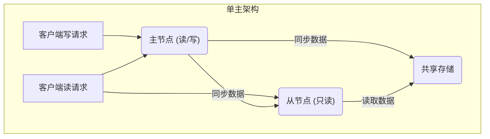
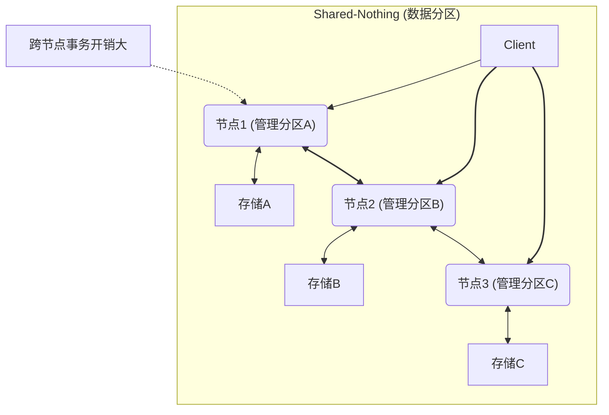
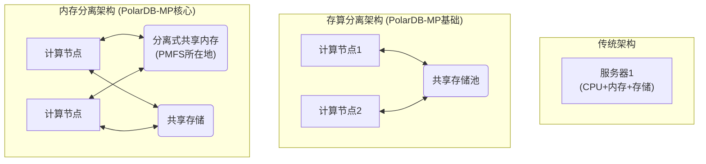
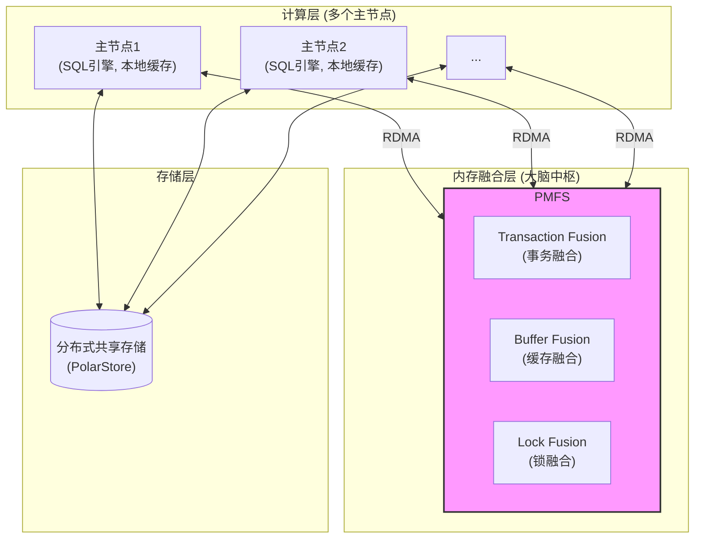
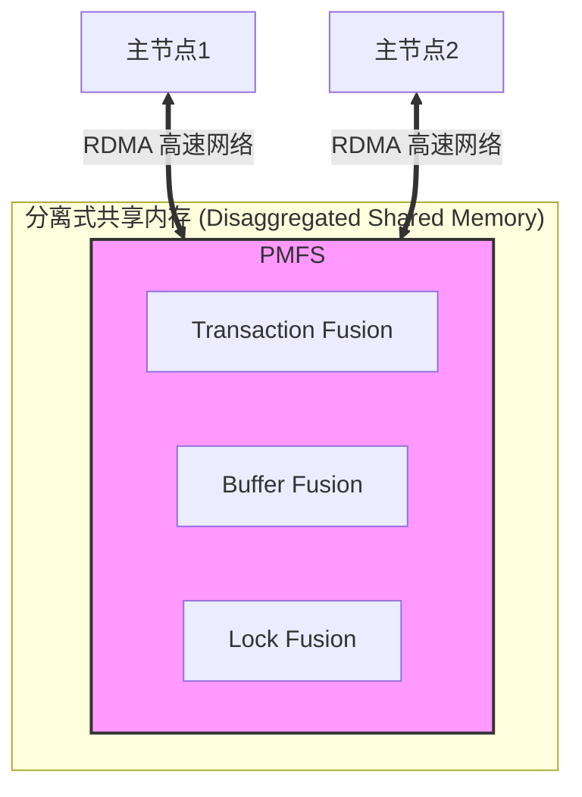

## AI论文解读 | PolarDB-MP: A Multi-Primary Cloud-Native Database via Disaggregated Shared Memory
        
### 作者        
digoal        
        
### 日期        
2025-07-17       
        
### 标签        
PostgreSQL , PolarDB , DuckDB , AI , 论文解读        
        
----        
        
## 背景  
      
https://dl.acm.org/doi/pdf/10.1145/3626246.3653377        
  
      
提示:        
```        
读懂《PolarDB-MP: A Multi-Primary Cloud-Native Database via Disaggregated Shared Memory》这篇论文需要提前掌握哪些基础知识, 请使用中文给我讲一下这些基础知识, 尽量通熟易懂, 可以使用markdown支持的图形增加解释性.        
        
使用中文通熟易懂的解读《PolarDB-MP: A Multi-Primary Cloud-Native Database via Disaggregated Shared Memory》这篇论文, 关键内容请深入讲解, 可以使用markdown支持的图形增加解释性.        
        
使用中文提取《PolarDB-MP: A Multi-Primary Cloud-Native Database via Disaggregated Shared Memory》论文中一些重要的术语并详细解释, 可以使用markdown支持的图形示增加解释性.        
```        
        
## 1 前置知识 
  
好的，为了完全读懂《PolarDB-MP》这篇论文，你需要对数据库、分布式系统和现代计算机网络的一些核心概念有扎实的理解。我会将这些基础知识分为三大块，并用通俗易懂的语言和图示来解释。

-----

### 块一：数据库架构演进 (理解论文的背景与动机)

这篇论文的核心是提出一种新的“多主架构”数据库。要理解它的创新之处，首先要明白当前主流的数据库架构以及它们的优缺点。

#### 1\. 单主架构 (Primary-Secondary)

这是最常见的云数据库架构，比如Amazon Aurora的基础版和阿里云PolarDB的基础版。

  * **通俗理解**: 想象一个团队，只有一个“主节点” (Primary) 是项目经理，他拥有最终决策权，负责所有**写入和修改**任务。其他“从节点” (Secondary) 都是实习生，他们只能从项目经理那里同步工作进度，然后负责处理**只读**的查询任务。

  * **优点**: 架构简单，数据一致性强（因为所有修改都由一个人说了算）。

  * **痛点 (论文要解决的问题)**:

      *  **写瓶颈**: 所有写操作都要经过唯一的“主节点”，当写入量巨大时，主节点会不堪重负，成为整个系统的性能瓶颈。  
      *  **高可用性问题**: 如果主节点宕机，需要花时间从从节点中“提拔”一个新的主节点，这个过程会导致服务短暂中断。  




#### 2\. 多主架构 (Multi-Primary)

为了解决单主架构的写瓶颈，多主架构应运而生，允许多个节点同时处理写请求。它主要分为两种流派：

##### a) Shared-Nothing (无共享架构)

  *  **通俗理解**: 想象一个联邦国家，每个州（节点）都有自己的土地、资源和人口（数据），并且完全自治。    当一个任务（事务）需要跨州协作时，就必须走非常复杂的“联邦外交”流程（分布式事务协议，如两阶段提交）。  

  *  **代表**: Google Spanner, TiDB, CockroachDB  

  * **优点**: 扩展性非常好，节点间干扰小。

  * **痛点 (论文要解决的问题)**:

      *  **分布式事务开销大**: 跨节点的数据操作非常慢且复杂，严重影响性能。  
      *  **数据迁移复杂**: 增加或减少节点时，需要进行大规模的数据重分区（repartitioning），这个过程很重。  




##### b) Shared-Storage (共享存储架构)

  *  **通俗理解**: 想象一个大公司的所有员工（节点）都在同一个共享硬盘（存储）上工作，每个人都可以读取和修改任何文件。  

  *  **代表**: Oracle RAC, IBM pureScale  

  * **优点**: 不需要数据分区，任何节点都能访问全量数据，避免了复杂的分布式事务。

  * **痛点 (论文要解决的问题)**:

      *  **并发冲突严重**: 既然大家都能改同一个文件，就必须有一个非常高效的“协调员”（分布式锁管理器）来防止大家把文件改乱。这个协调成本非常高。  
      *  **缓存一致性难题**: 节点A在自己的内存（缓存）里修改了数据，但还没写回共享存储。这时节点B想读这个数据，怎么才能读到最新的版本？传统方法依赖日志和存储I/O，效率低下。  

**PolarDB-MP** 正是建立在 **Shared-Storage** 模型之上，并致力于用创新的技术解决其核心痛点。

-----

### 块二：数据库内核核心概念 (理解论文的技术细节)

这篇论文提出的“三驾马车”——`Transaction Fusion`, `Buffer Fusion`, `Lock Fusion`——分别对应解决了分布式环境下的事务、缓存和锁的核心问题。

#### 1\. 事务与MVCC (多版本并发控制)

  * **事务 (Transaction)**: 一系列数据库操作的集合，要么全部成功，要么全部失败（原子性），是保证数据正确性的基本单位。
  * **MVCC (Multi-Version Concurrency Control)**: 这是现代数据库解决“读写冲突”的主流方法。
      *  **通俗理解**: 当你修改一行数据时，数据库**不会直接覆盖**旧数据，而是创建一个新版本的数据。   这样，正在读取旧数据的事务不受影响，可以继续读它的旧版本。每个事务启动时会获得一个“快照”，决定了它能看到哪些版本的数据。
      *  **论文中的挑战**: 在多主环境下，一个事务在节点A启动，它如何知道节点B上刚刚提交的另一个事务所做的修改对它是否可见？    这需要一个全局的、高效的事务信息视图。这就是 `Transaction Fusion` 和 `Timestamp Oracle (TSO)` 要解决的问题，它们通过 `TIT` (事务信息表) 来去中心化地管理全局事务状态。  

#### 2\. 锁 (Lock) 与并发控制

  * **通俗理解**: 锁就像会议室的门锁。
      *  **悲观锁 (Pessimistic Lock)**: 先敲门，拿到钥匙（加锁）再进去开会（修改数据）。PolarDB-MP采用此策略来避免高冲突下的性能衰退。  
      *  **乐观锁 (Optimistic Lock)**: 直接推门进去，开完会出门时再看有没有人跟你抢会议室（提交时检查冲突）。在冲突少时很快，但冲突多时会导致大量会议失败（事务回滚），论文中提到的Aurora-MM就是例子。  
  * **论文中的挑战**: 在多主环境下，锁需要是全局的。PolarDB-MP的 `Lock Fusion` 负责管理两种全局锁：
      *  `PLock (Page Lock)`: 物理页级别的锁，确保对数据页的物理修改是原子的。  
      *  `RLock (Row Lock)`: 逻辑行级别的锁，保证事务的逻辑一致性。  

#### 3\. 日志与恢复 (Logging and Recovery)

  * **WAL (Write-Ahead Logging)**: “先写日志，再写数据”。在对数据做任何修改前，数据库会先把“将要做什么修改”记录到日志（Log）里。这样即使系统崩溃，也能通过日志来恢复数据。
  * **LSN (Log Sequence Number)**: 日志序列号，可以理解为日志的编号，保证了日志的顺序。
  *  **论文中的挑战**: 在多主环境下，每个节点都在写自己的日志文件，它们的LSN是无法直接比较的。如果多个节点修改了同一个数据页，恢复时应该按什么顺序应用这些日志？这就是 `LLSN (Logical LSN)` 设计的初衷，它为跨节点的日志建立了一个“偏序”关系，确保**同一个数据页的日志**能按正确的生成顺序被恢复。  

-----

### 块三：现代硬件与网络技术 (理解论文的性能保障)

PolarDB-MP的高性能并非凭空而来，它深度依赖于现代数据中心的技术。

#### 1\. 存算分离 (Disaggregation)

  *  **通俗理解**: 传统服务器是“一体机”，CPU、内存、硬盘都在一个盒子里。存算分离就像把它们换成了“组装机”，计算资源（CPU/内存）和存储资源（硬盘）可以独立地放在不同的机柜里，通过高速网络连接。  
  * **优点**: 弹性。计算不够加计算节点，存储不够加存储设备，互不影响。
  *  **PolarDB-MP的创新**: 它不仅做了**存算分离**，还更进一步提出了 **内存分离 (Memory Disaggregation)**   ，将一部分内存资源也池化，形成了论文中最重要的组件 **PMFS (Polar Multi-Primary Fusion Server)**，这个PMFS就构建在“分离式共享内存”之上。  




#### 2\. RDMA (远程直接内存访问)

  *  **通俗理解**: 传统网络通信像寄快递，需要打包（CPU参与）、投递、收件人再拆包（CPU参与）。而RDMA就像开了个“传送门”，一个节点的内存可以直接、快速地读写另一个节点的内存，几乎不需要对方CPU的干预。  
  *  **对论文的重要性**: RDMA是实现PMFS高性能的关键。    无论是节点间同步缓存（Buffer Fusion），还是请求全局锁（Lock Fusion），或是获取全局事务信息（Transaction Fusion），都通过RDMA以极低的延迟完成。没有RDMA，论文提出的架构性能会大打折扣。  

### 总结

当你掌握了以上这些基础知识后，再阅读这篇论文就会豁然开朗：

你会明白，PolarDB-MP选择**共享存储**架构是为了**避免分布式事务的开销**。为了解决共享存储架构下的**并发冲突和缓存一致性**难题，它没有走传统数据库的老路，而是创新地利用了**内存分离**和**RDMA**技术，构建了一个超高速的协调中心`PMFS`。PMFS内部通过`Transaction Fusion`、`Buffer Fusion`和`Lock Fusion`这“三驾马车”，高效地解决了多主节点间的**事务可见性、缓存同步和全局锁**问题，再辅以`LLSN`机制确保了**日志的正确恢复**，最终实现了高性能、高可用的多主云原生数据库。
  
## 2 解读论文 
  
好的，我们来一起深入解读这篇重量级的数据库论文《PolarDB-MP: A Multi-Primary Cloud-Native Database via Disaggregated Shared Memory》。

本文提出了一种名为 **PolarDB-MP** 的创新性多主数据库架构。其核心思想是，在传统的“存算分离”基础上，引入“**分离式共享内存 (Disaggregated Shared Memory)**”并通过高速 **RDMA 网络**进行连接，从而高效地解决了多主数据库在数据同步、事务协调和并发控制上的核心难题。

为了方便理解，我将从“**为什么需要 PolarDB-MP**”、“**PolarDB-MP 的核心架构**”以及“**三大核心技术揭秘**”三个层面，由浅入深地进行解读。

-----

### 一、为什么需要 PolarDB-MP？现有架构的痛点

 要理解一项新技术的价值，首先要看它解决了什么旧问题。论文开篇就分析了当前云数据库架构的局限性  。

1.  **传统“主从架构” (Primary-Secondary) 的写瓶颈**

      *  大多数云数据库（如AWS Aurora, Alibaba PolarDB）采用一主多从的模式   。所有写请求都必须由唯一的“主节点”处理，这导致在写密集型场景下，主节点会成为性能天花板，无法水平扩展写入能力   。同时，主节点故障切换会造成服务短暂中断  。

2.  **“无共享架构” (Shared-Nothing) 的跨节点事务开销**

      *  另一些分布式数据库（如Google Spanner, TiDB）采用无共享架构，数据被切分到不同节点   。这种架构虽然扩展性好，但一旦事务需要操作分布在不同节点上的数据，就必须启用复杂的“分布式事务”协议（如两阶段提交），这会带来巨大的性能开销   。在全局二级索引（GSI）更新等场景下，这个问题尤为突出  。

3.  **现有“共享存储架构” (Shared-Storage) 的效率问题**

      *  为了避免分布式事务，共享存储架构允许多个主节点访问同一份数据  。但它也面临新的挑战：
          *  **乐观锁的低效**：AWS Aurora 多主版 (Aurora-MM) 采用乐观锁，在数据冲突高时，会导致大量事务失败回滚，性能甚至不如单节点  。
          *  **悲观锁的同步成本**：华为 Taurus-MM 采用悲观锁，但它依赖于“日志重放”来保证节点间的缓存数据一致，这个过程涉及存储I/O和额外的CPU消耗，效率不高，扩展性受限  。

 **PolarDB-MP 的目标**：设计一个既能像“共享存储”架构一样避免分布式事务，又能高效解决节点间数据同步和冲突协调问题的新型多主数据库。它找到的答案就是——**分离式共享内存**  。

-----

### 二、PolarDB-MP 的核心架构：引入“大脑中枢” PMFS

 PolarDB-MP 的架构可以看作是在多个“主数据库节点”和“共享存储”之间，增加了一个基于分离式共享内存的“大脑中枢”——**PMFS (Polar Multi-Primary Fusion Server)**  。



  *  **计算节点 (Primaries)**: 每个都是功能完整的数据库实例，负责处理用户的读写请求  。
  *  **共享存储 (Distributed Shared Storage)**: 底层的数据存储，所有节点共享  。
  *  **PMFS (大脑中枢)**: 这是 PolarDB-MP 的灵魂。它构建在一块独立、共享、可通过 **RDMA (远程直接内存访问)** 高速访问的内存池上   。PMFS 内部包含三大核心组件，负责全局的协调工作  。
  *  **RDMA 网络**: 节点与 PMFS 之间通过 RDMA 网络通信   。RDMA 允许一个节点的内存直接读写另一个节点的内存，延迟极低（微秒级），几乎不消耗对方的 CPU  。这是整个架构高性能的基石。

-----

### 三、三大核心技术揭秘：“三驾马车”如何工作

PMFS 的三大组件——事务融合、缓存融合和锁融合，共同构成了支撑 PolarDB-MP 高效运行的“三驾马车”。

#### 1\. Transaction Fusion (事务融合)：全局事务的“去中心化”管理

  *  **解决的问题**：在多主环境下，一个事务如何知道其他节点上事务的状态？（例如，判断一个数据版本对自己是否可见，即 MVCC 问题） 。
  * **核心设计**：
    1.   **全局时钟 (TSO)**：PMFS 中有一个时间戳预言机 (Timestamp Oracle)，为每个提交的事务分配一个全局唯一的、单调递增的“提交时间戳” (CTS)，以此确定事务的全局顺序  。
    2.   **去中心化事务信息表 (TIT)**：这是一个非常巧妙的设计。它不像传统方式那样用一个全局表管理所有事务，而是**每个计算节点只在自己的内存里维护一张事务信息表 (TIT)，记录本节点上所有事务的状态**（如 CTS） 。
    3.   **RDMA 远程读取**：当节点A需要查询节点B上某个事务的状态时，它会通过 RDMA **直接读取**节点B内存中的 TIT   。这避免了节点间的消息通信和请求处理，效率极高。全局事务ID (`g_trx_id`)的设计包含了节点ID和槽位信息，使得这种远程直接定位成为可能  。

 **工作流程小结**：通过 `TSO` 保证全局顺序，通过 `TIT` 分散存储事务状态，再通过 `RDMA` 实现高效的状态获取。这套组合拳优雅地解决了分布式环境下的 MVCC 可见性难题  。

#### 2\. Buffer Fusion (缓存融合)：构建高速的“数据中转站”

  *  **解决的问题**：如何让一个节点高效地读取被另一个节点修改过的最新数据页，避免从慢速的共享存储中读取？ 
  * **核心设计**：
    1.   **分布式缓存池 (DBP)**：Buffer Fusion 在 PMFS 的共享内存中维护了一个巨大的分布式缓存池 (Distributed Buffer Pool)，可以看作是所有节点共享的“二级缓存”  。
    2.  **“推送-失效-拉取”机制**：
          *  **推送 (Push)**：当节点A修改了一个数据页后，会在合适的时机（如释放页面锁时）将这个**最新版本的数据页**通过 RDMA 推送到 DBP 中  。
          *  **失效 (Invalidate)**：与此同时，Buffer Fusion 会通知所有其他缓存了该页旧版本的节点，将它们的本地副本标记为“失效”  。
          *  **拉取 (Fetch)**：当节点B需要访问这个数据页时，发现本地副本已失效，它就会通过 RDMA 直接从 DBP 中拉取最新的版本，而不是去访问底层存储  。

**工作流程小结**：Buffer Fusion 利用 PMFS 的共享内存构建了一个高速的数据中转站 (DBP)。通过“推送-失效-拉取”三步曲和 RDMA，实现了节点间缓存页的快速同步，保证了缓存一致性，并极大降低了读写延迟。

#### 3\. Lock Fusion (锁融合)：轻量级的全局并发控制

  *  **解决的问题**：如何对分布在不同节点上的事务进行并发访问控制，防止数据被同时修改导致错乱？ 
  * **核心设计**：
    1.   **页锁 (PLock)**：这是一种物理锁，用于保证对数据页本身修改的原子性（如 B+树的分裂）  。节点在操作任何数据页前，都必须向 Lock Fusion 申请对应的共享（S）或排他（X）页锁  。
    2.  **行锁 (RLock) 的创新实现**：为了减少行锁带来的大量网络消息，PolarDB-MP 做了一个创新：
          *  **锁信息内嵌**：它不把行锁信息集中存放在 Lock Fusion，而是将**持有该行锁的事务的全局ID (`g_trx_id`) 直接写入行记录的元数据中**  。
          *  **等待关系集中管理**：只有当发生锁冲突时（一个事务发现某行已被另一个活跃事务锁定），它才会向 Lock Fusion 注册“等待关系”  。
          *  **状态判断靠 RDMA**：当事务A发现某行被事务B锁住时，它会通过 Transaction Fusion 的机制（RDMA读TIT）来判断事务B是否仍然活跃  。

**工作流程小结**：Lock Fusion 通过 `PLock` 保证物理数据一致性，通过将 `RLock` 信息内嵌于行数据中，并仅在冲突时才与中心交互，极大地减少了并发控制的通信开销，实现了轻量级且高效的全局锁管理。

### 四、日志与恢复 (LLSN)

  *  **解决的问题**：多主节点各自产生日志，如何保证在系统崩溃恢复时，对同一个数据页的修改能够按照正确的顺序重放？ 
  * **核心设计：LLSN (Logical Log Sequence Number)**
      *  它不追求对所有日志进行全局排序，那太浪费了   。它只保证**对于同一个数据页，其相关的日志是按序的**，这已经足够保证恢复的正确性  。
      *  实现方式很简单：每个节点维护一个本地 LLSN 计数器。当一个节点要修改一个数据页时，它必须先持有该页的 PLock。它会读取该页当前的 LLSN，将自己的本地 LLSN 更新为比它更大的值，然后再用这个新 LLSN 去标记新产生的日志和数据页   。由于 PLock 保证了同一时间只有一个节点能修改页面，这个机制巧妙地确保了页面 LLSN 的单调递增，从而维持了日志的正确偏序关系  。

### 结论

 《PolarDB-MP》这篇论文描绘了一个清晰而优雅的下一代云数据库架构。它精准地抓住了现有架构的痛点，并创新性地将**分离式共享内存**和 **RDMA** 网络技术深度融合到数据库内核中，通过其核心组件 **PMFS** 及其“三驾马车”，高效地解决了多主数据库在**事务、缓存、锁**这三大领域的经典难题，最终在测评中展现出远超同类产品的性能和扩展性  。它为如何构建高性能、高可用的分布式数据库系统提供了一个极具启发性的范例。
  
## 3 术语  
  
好的，我们来从《PolarDB-MP》这篇论文中提取并详细解释其关键术语。这些术语是理解其架构和创新点的核心。

### 1\. Disaggregated Shared Memory (分离式共享内存)

这可以说是整篇论文的基石。

  *  **解释**: 传统服务器中，CPU、内存和存储紧密耦合在一个物理机箱内。而“分离式”架构则将这些资源池化，可以独立扩展   。**分离式共享内存**更进一步，它指的是将一部分内存资源从计算节点中分离出来，形成一个独立的、可被多个计算节点通过高速网络共享访问的内存池   。在 PolarDB-MP 中，这个内存池是其核心组件 PMFS 的物理载体  。
  * **作用**:
      *  作为全局协调和数据交换的中心，避免了传统多主架构中节点间复杂的点对点通信  。
      *  提供了极高吞吐和极低延迟的数据共享能力，这是实现高性能缓存融合和锁融合的前提  。

### 2\. RDMA (Remote Direct Memory Access / 远程直接内存访问)

这是实现分离式共享内存高性能访问的关键技术。

  *  **解释**: RDMA 是一种网络技术，它允许一个节点的内存直接对另一个节点的内存进行读写操作，几乎不需要对方 CPU 的介入   。传统的网络通信需要操作系统内核和 CPU 深度参与打包、拆包过程，而 RDMA 绕过了这些步骤，极大地降低了通信延迟和 CPU 负载  。
  *  **作用**: 在 PolarDB-MP 中，所有计算节点与 PMFS 之间的数据交换，以及节点间对彼此元数据（如TIT）的访问，都通过 RDMA 完成   。这保证了事务协调、缓存同步和锁管理等操作能以微秒级的延迟完成   ，是整个系统高性能的保障  。

### 3\. PMFS (Polar Multi-Primary Fusion Server / PolarDB多主融合服务器)

这是 PolarDB-MP 架构的“大脑中枢”。

  *  **解释**: PMFS 是一个构建在分离式共享内存之上的核心服务组件   。它整合了全局事务管理、缓存一致性维护和并发控制三大功能   。所有主节点通过 RDMA 与 PMFS 高效交互，以协调它们在共享数据上的操作  。
  *  **构成**: PMFS 内部由三个关键的子组件（“三驾马车”）构成：Transaction Fusion, Buffer Fusion, 和 Lock Fusion  。




### 4\. 三大融合组件 (The Fusion Components)

#### a. Transaction Fusion (事务融合)

  *  **解释**: 负责全局事务的排序和可见性判断   。在多版本并发控制 (MVCC) 中，一个事务需要知道其他事务创建的数据版本对自己是否可见，Transaction Fusion 正是为此服务  。
  * **核心机制**:
      *  **TSO (Timestamp Oracle)**: PMFS 中的一个时间戳预言机，为每个提交的事务分配一个全局唯一的提交时间戳 (CTS)，从而建立全局事务顺序  。
      *  **TIT (Transaction Information Table)**: 一种巧妙的**去中心化**设计   。每个主节点在自己的内存中维护一张 TIT，只记录本节点事务的状态   。当需要查询其他节点的事务状态时，可通过 RDMA 直接远程读取对方的 TIT  ，效率极高。

#### b. Buffer Fusion (缓存融合)

  *  **解释**: 负责维护所有主节点本地缓存之间的数据一致性   。它在 PMFS 中实现了一个**分布式缓存池 (DBP, Distributed Buffer Pool)**  。
  *  **核心机制**: 当一个节点修改了某个数据页后，它会将新版本的数据页“推送”到 DBP   。Buffer Fusion 随即会“失效”掉其他节点上该页的旧缓存副本   。当其他节点需要访问此页时，会从 DBP 中通过 RDMA 直接“拉取”最新版本，而非访问慢速的底层存储  。

#### c. Lock Fusion (锁融合)

  *  **解释**: 负责全局的并发控制，协调不同节点对共享数据的访问冲突   。它实现了两种全局锁协议  。
  * **核心机制**:
      *  **PLock (Page Lock)**: 物理页锁。节点在读写任何数据页前，必须从 Lock Fusion 获取对应的共享/排他锁，以保证数据页的物理完整性  。
      *  **RLock (Row Lock)**: 事务性行锁。为了减少通信开销，行锁信息（持有锁的事务ID）被直接**内嵌**在行记录的元数据中   。只有发生锁等待时，等待关系才会被记录到 Lock Fusion  。

### 5\. LLSN (Logical Log Sequence Number / 逻辑日志序列号)

这是为解决多主环境下的日志排序与恢复问题而设计的。

  *  **解释**: 在多主环境下，每个节点都独立生成日志，它们的物理日志序列号 (LSN) 无法直接比较。LLSN 是一种逻辑序列号，它不追求对所有节点的全部日志进行全局排序，而是建立一个**偏序关系**，仅确保**对于同一个数据页的修改日志，能够维持其正确的生成顺序**  。
  *  **作用**: LLSN 保证了在系统崩溃恢复时，可以正确地重放所有对同一个数据页的修改日志，从而恢复出正确的数据状态   。它的偏序特性避免了全局排序的巨大开销，设计得非常高效  。
  
## 参考        
         
https://dl.acm.org/doi/pdf/10.1145/3626246.3653377  
        
        
<b> 以上内容基于DeepSeek、Qwen、Gemini及诸多AI生成, 轻微人工调整, 感谢杭州深度求索人工智能、阿里云、Google等公司. </b>        
        
<b> AI 生成的内容请自行辨别正确性, 当然也多了些许踩坑的乐趣, 毕竟冒险是每个男人的天性.  </b>        
    
  
  
#### [期望 PostgreSQL|开源PolarDB 增加什么功能?](https://github.com/digoal/blog/issues/76 "269ac3d1c492e938c0191101c7238216")
  
  
#### [PolarDB 开源数据库](https://openpolardb.com/home "57258f76c37864c6e6d23383d05714ea")
  
  
#### [PolarDB 学习图谱](https://www.aliyun.com/database/openpolardb/activity "8642f60e04ed0c814bf9cb9677976bd4")
  
  
#### [PostgreSQL 解决方案集合](../201706/20170601_02.md "40cff096e9ed7122c512b35d8561d9c8")
  
  
#### [德哥 / digoal's Github - 公益是一辈子的事.](https://github.com/digoal/blog/blob/master/README.md "22709685feb7cab07d30f30387f0a9ae")
  
  
#### [About 德哥](https://github.com/digoal/blog/blob/master/me/readme.md "a37735981e7704886ffd590565582dd0")
  
  

  
