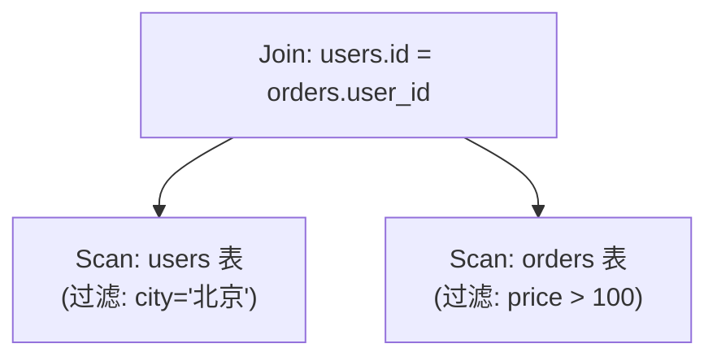
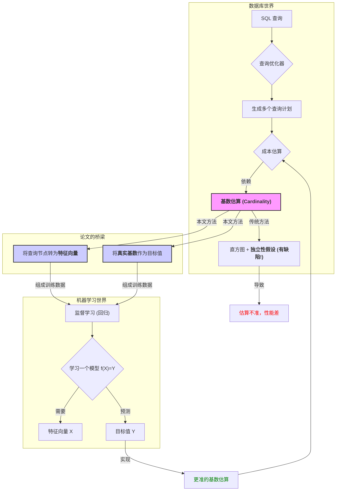
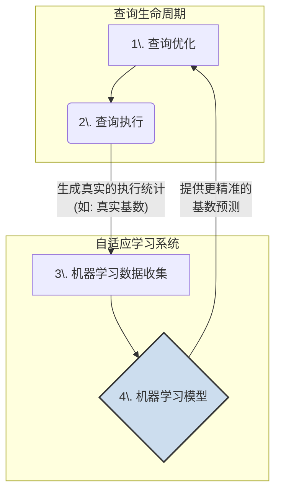
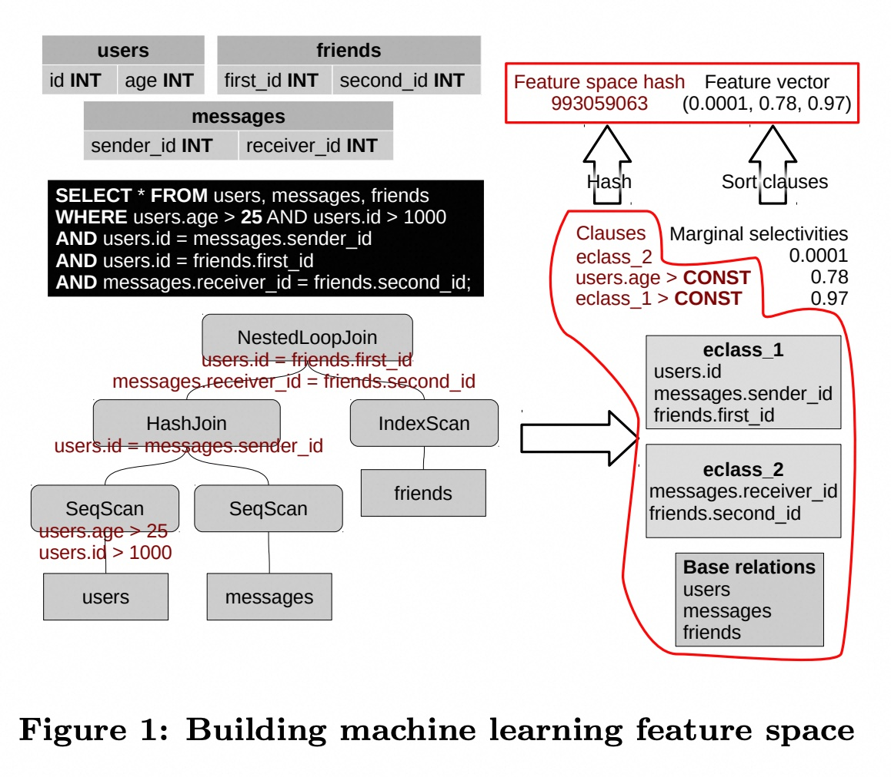
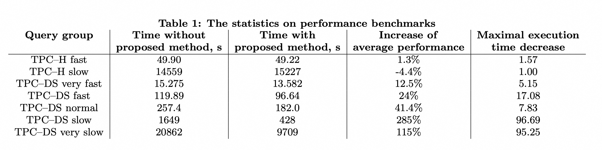

## AI论文解读 | Adaptive Cardinality Estimation
        
### 作者        
digoal        
        
### 日期        
2025-07-17       
        
### 标签        
PostgreSQL , PolarDB , DuckDB , AI , 论文解读        
        
----        
        
## 背景  
      
https://arxiv.org/pdf/1711.08330        
  
      
提示:        
```        
读懂《Adaptive Cardinality Estimation》这篇论文需要提前掌握哪些基础知识, 请使用中文给我讲一下这些基础知识, 尽量通熟易懂, 可以使用markdown支持的图形增加解释性.        
        
使用中文通熟易懂的解读《Adaptive Cardinality Estimation》这篇论文, 关键内容请深入讲解, 可以使用markdown支持的图形增加解释性.        
        
使用中文提取《Adaptive Cardinality Estimation》论文中一些重要的术语并详细解释, 可以使用markdown支持的图形示增加解释性.        
```        
        
## 1 前置知识 
  
好的，没问题。为了完全理解《Adaptive Cardinality Estimation》这篇论文，你需要了解一些数据库和机器学习的基础知识。我会用尽量通俗易懂的方式，为你讲解这些必备的“前置技能点”。

我们可以把这些知识分为三个层面：

1.  **数据库核心概念**：这是故事发生的舞台。
2.  **查询优化的经典问题**：这是故事要解决的矛盾。
3.  **机器学习基本思想**：这是主角（论文作者）使用的新式武器。

-----

### 1\. 数据库核心概念 (舞台背景)

#### 1.1 关系型数据库 和 SQL

首先，你需要知道什么是关系型数据库 (Relational DBMS)。你可以把它想象成一个由很多张 Excel 表格组成的系统。

  * **表 (Table/Relation)**: 就是一张二维表格，比如 `用户表`、`订单表`。
  * **行 (Row/Tuple)**: 表中的一条记录，比如某个具体的用户信息。
  * **列 (Column/Attribute)**: 表中的一个字段，比如 `年龄`、`城市`。

**SQL (Structured Query Language)** 是我们用来和数据库沟通的语言。论文中提到的“查询 (Query)” 主要就是指 SQL 中的 `SELECT` 语句，比如：

```sql
SELECT *
FROM users, orders -- 从用户表和订单表中查询
WHERE users.id = orders.user_id -- 关联条件
  AND users.city = '北京' -- 过滤条件
  AND orders.price > 100; -- 过滤条件
```

#### 1.2 查询计划 (Query Plan)

当你向数据库发送一条 SQL 查询时，数据库不会马上开始傻乎乎地工作。它会先制定一个详细的“执行方案”，这个方案就叫做 **查询计划 (Query Plan)**。

查询计划就像一份菜谱，告诉数据库具体该如何一步步地操作数据，才能最高效地得到你想要的结果。它通常是一个树形结构：

  * **叶子节点**: 代表最基础的操作，比如直接读取一张表 (`Table Scan`)。
  * **中间节点**: 代表数据的处理和连接，比如连接两张表 (`Join`)、排序 (`Sort`)、过滤 (`Filter`)。
  * **数据流**: 数据从叶子节点流向根节点，最终在根节点产出查询结果。

下面是一个简单的查询计划示意图：



这个图表示，数据库先分别扫描 `users` 表和 `orders` 表，并进行过滤，然后将两者的结果进行 `Join` 操作。

**重点**: 对于同一条 SQL，可能会有成百上千种不同的查询计划。比如，是先扫描 `users` 表还是先扫描 `orders` 表？是用 `Hash Join` 还是 `Nested Loop Join`？这些不同的计划，执行效率可能相差成千上万倍！

-----

### 2\. 查询优化的经典问题 (核心矛盾)

#### 2.1 基于成本的优化器 (Cost-Based Optimizer, CBO)

既然有这么多查询计划，数据库怎么知道哪个是最好的呢？现代数据库普遍使用**基于成本的优化器 (Cost-Based Optimizer, CBO)**。

它的工作原理很简单：

1.  **枚举 (Enumerate)**: 找出所有可能的查询计划。
2.  **估算成本 (Estimate Cost)**: 对每一个计划，估算出一个“成本值”（通常代表预估的执行时间或资源消耗）。
3.  **选择最优 (Choose)**: 挑选成本最低的那个计划去执行。

这个过程的关键在于第二步：**如何准确地估算成本？**

#### 2.2 基数 (Cardinality)

在成本估算的所有参数中，最重要的一个参数叫做 **基数 (Cardinality)**。

> **基数 (Cardinality)**: 指一个操作步骤（即查询计划中的一个节点）将会返回多少行数据。

举个例子，在上面的查询计划中：

  * `Scan: users 表 (过滤: city='北京')` 这个节点的基数，就是 `users` 表里 `city` 是 `北京` 的用户有多少个。
  * `Join` 节点的基数，是两个子节点的结果连接后，会生成多少行数据。

**为什么基数如此重要？**
因为几乎所有操作的成本都和它处理的数据量（也就是基数）直接相关。比如排序10行数据和排序100万行数据的成本天差地别。如果基数估算错了，整个成本模型就全错了，优化器就很可能选出一个非常糟糕的计划。**这正是这篇论文要解决的核心问题。**

#### 2.3 传统基数估算方法的缺陷

传统数据库主要用 **直方图 (Histogram)** 来估算基数。直方图可以告诉你单个列上数据的分布情况。比如，它可以记录 `users` 表中，`city` 列各个城市的分布（北京有多少人，上海有多少人等）。

但是，传统方法有一个致命的**独立性假设 (Independence Assumption)**。当查询涉及多个条件时，它假设这些条件是相互独立的。

  * **公式**: `selectivity(条件A AND 条件B) = selectivity(条件A) * selectivity(条件B)`
      * (selectivity 指的是“选择率”，即满足条件的行数占总行数的比例)

这个假设在现实中经常是错的！比如：

  * `条件A: 车型 = '迈腾'`
  * `条件B: 品牌 = '大众'`

这两个条件显然是高度相关的，而不是独立的。如果独立计算，`P(迈腾 | 大众) = P(迈腾)`，这显然是错误的。错误地使用独立性假设，会导致基数估算出现几个数量级的偏差，这也是传统查询优化器性能瓶颈的主要原因。

-----

### 3\. 机器学习基本思想 (新式武器)

这篇论文的创新之处在于，它提出用机器学习来解决这个老大难的基数估算问题。

#### 3.1 监督学习 (Supervised Learning)

你需要了解监督学习中的 **回归 (Regression)** 问题。它的思想是：

> 给定一堆输入数据和它们对应的“正确答案”，让机器从这些数据中学习一个模型（一个函数 `f`）。当有新的输入时，这个模型就能预测出它的答案。

  * **训练数据**: `(输入X, 答案Y)` 的集合。
  * **模型**: `Y = f(X)`
  * **目标**: 找到一个最好的 `f`，使得对于新的 `X_new`，预测出的 `Y_pred` 和真实的 `Y_true` 尽可能接近。

#### 3.2 特征向量 (Feature Vector)

机器学习模型不能直接理解“查询计划的一个节点”这种复杂的东西。我们需要把它转换成一个由数字组成的向量，这个向量就叫 **特征向量 (Feature Vector)**。

这是论文中最巧妙、最核心的一步。他们是这样做的：

1.  **识别对象**: 要预测的对象是查询计划中的一个**节点 (Node)**。
2.  **提取信息**: 一个节点最关键的信息是它包含了哪些**表 (Base relations)** 和哪些**过滤/连接条件 (Clauses)**。
3.  **特征化**:
      * 他们将一个节点所包含的所有条件（比如 `users.age > 25`, `users.id = msg.sender_id`）拿出来。
      * 对于每个条件，他们使用**数据库传统的估算方法**计算出这个条件的**选择率 (Selectivity)** (一个 0 到 1 之间的数字)。
      * 把所有这些选择率组合在一起，就形成了一个特征向量。

**举例说明 (简化版):**

一个 Join 节点有两个条件: `users.age > 25` 和 `users.id = msg.sender_id`。

  * 传统方法估算出 `users.age > 25` 的选择率是 `0.78`。
  * 传统方法估算出 `users.id = msg.sender_id` 的选择率是 `0.0001`。
  * 那么，这个节点的特征向量就是 `(0.78, 0.0001)`。

#### 3.3 论文的核心思路 (Adaptive Estimation)

现在，整个流程就清晰了：

1.  **收集训练数据**:

      * 当数据库执行完一个查询后，它就知道了每个节点的 **真实基数** (True Cardinality)。
      * 对于每个节点，我们可以构造出它的 **特征向量 (Feature Vector)** (如上所述)。
      * 这样，我们就得到了一条训练数据：`(一个节点的特征向量, 这个节点的真实基数)`。

2.  **训练模型**:

      * 用大量历史查询产生的训练数据，去训练一个机器学习回归模型（论文中比较了多种模型，最终选择了一种改进的 k-NN）。
      * 这个模型学习到了 **特征向量** 和 **真实基数** 之间的复杂关系（不再是简单的独立性假设！）。

3.  **进行预测 (自适应估算)**:

      * 当优化器为一个**新的查询**估算基数时，它同样为新查询的节点构造特征向量。
      * 然后，把这个特征向量喂给训练好的机器学习模型。
      * 模型会输出一个比传统方法更精准的**预测基数**。
      * 因为这个模型利用了过去查询的“经验”，所以它被称为 **自适应 (Adaptive)** 的。

### 总结

要读懂这篇论文，你需要掌握的知识地图如下：



掌握了这些背景知识，你就能轻松理解论文中为什么反复强调**查询计划、成本、基数**，以及它是如何巧妙地将一个经典的数据库问题，转化为一个可以用**特征向量**和**回归模型**来解决的机器学习问题了。
  
## 2 解读论文 
  
好的，我们来一起深入解读这篇在数据库领域非常有影响力的论文——《Adaptive Cardinality Estimation》。

 这篇论文的核心思想是：**利用过去执行过的查询所产生的真实统计信息，通过机器学习来“校准”数据库的估算模型，从而对未来的查询做出更精准的基数估算，最终找到性能更好的执行计划**  。

我将为你分步拆解这篇论文的精髓。

### 一、问题的根源：为何数据库会“选错路”？

要理解这篇论文的价值，首先要明白数据库查询优化的核心痛点。

 当你向数据库发送一条SQL查询时，数据库内部的“查询优化器”会像一个战略家，制定一个详细的执行方案，这被称为**查询计划 (Query Plan)**   。对于复杂的查询，可选的计划成千上万，而不同计划的执行时间可能相差几个数量级  。

 现代数据库普遍采用**基于成本的优化 (Cost-Based Optimization)**   。优化器会估算每个备选计划的“成本”（通常是执行时间），然后选择成本最低的那个   。这个策略的成败，极度依赖于成本估算的准确性  。

 成本估算模型中最关键、也最容易出错的变量，就是**基数 (Cardinality)**——即查询计划中每一步操作预计会返回多少行数据  。

**传统方法的缺陷：独立性假设**

 传统优化器（如System R开创并沿用至今的模型   ）在估算基数时，依赖一个致命的假设：**所有查询条件都是相互独立的**  。这意味着，它会认为`P(条件A 且 条件B) = P(条件A) * P(条件B)`。

 这个假设在现实世界的数据中经常不成立   。例如，查询条件为“汽车品牌=大众”和“车型=迈腾”，这两个条件是高度相关的。独立性假设会严重低估同时满足这两个条件的行数，导致基数估算错得离谱   。错误的基数将导致错误的成本估算，最终让优化器选出一个性能极差的“最优”计划  。

>  **小结**：传统查询优化器因其核心的“独立性假设”存在根本缺陷，导致基数估算不准，这是数据库常常“选错路”、性能不佳的根本原因  。

-----

### 二、核心思想：用机器学习“自适应”地校准估算

这篇论文提出的“自适应基数估算”方法，正是为了打破独立性假设的桎梏。其核心是一个巧妙的反馈闭环系统。



 *该图展示了自适应基数估算的整体工作流程*

整个系统的工作流程如下：

1.   **查询优化**：当一个新查询到来时，优化器向机器学习模型请求基数估算  。
2.  **查询执行**：数据库按照选定的计划执行查询。
3.   **数据收集**：执行完毕后，系统会收集到计划中每个节点的**真实基数**  。
4.   **模型训练**：将这次查询的“特征”和“真实基数”作为一条新的训练数据，用来更新（或训练）机器学习模型  。

 通过这个闭环，模型不断从真实执行的“经验”中学习，其预测能力会越来越精准，从而实现“自适应”  。

-----

### 三、关键技术：如何将“查询计划”变成“机器学习语言”？

 这篇论文最巧妙、最核心的贡献在于，它设计了一套方法，将一个复杂的查询计划节点，转换成机器学习模型可以理解的**特征向量 (Feature Vector)**  。

这个过程分为两步：

#### 第1步：抽象化查询条件 (Clause Abstraction)

 一个查询节点由它所处理的 **表 (Relations)** 和 **条件 (Clauses)** 定义   。但查询条件中的具体值（常量）千变万化，例如 `users.age > 25` 和 `users.age > 26`。如果将它们视为完全不同的条件，那模型的学习空间就太大了  。

 作者的解决方案是：**忽略条件中的常量，只保留其结构**  。

  *  `users.age > 25`  -\> `users.age > CONST`  
  * `users.id = 1000` -\> `users.id = CONST`
  * `users.id = messages.sender_id` (连接条件，没有常量，保持不变)

 通过这种方式，结构相同但常量不同的查询被归为一类，大大减少了需要处理的模式数量  。

#### 第2步：向量化 (Feature Vector Creation)

 虽然抽象化解决了模式爆炸的问题，但也丢失了常量中包含的重要信息   。为了弥补这一点，作者将每个原始条件（带常量的）的**选择率 (Selectivity)作为特征。这个选择率本身是用数据库传统的方法**（如直方图）计算出来的  。

 最终，一个查询节点的特征向量就由它所包含的**所有条件的选择率**以及它所涉及的**基表**和**连接关系**共同定义  。

**我们来看一个论文中经典的例子 (Figure 1):**  

假设有一个查询，它连接了 `users`, `messages`, `friends` 三张表。其中一个计划节点需要处理以下条件：

  * `users.age > 25`
  * `users.id > 1000`
  * `users.id = messages.sender_id`
  * `users.id = friends.first_id`
  * `messages.receiver_id = friends.second_id`

这个节点可以被转换成如下的特征空间和特征向量：

| 构成部分 | 具体内容 | 特征化处理 |
| :--- | :--- | :--- |
| **基表** | `users`, `messages`, `friends` |  构成特征空间的唯一标识之一   |
| **等价类1 (eclass\_1)** | `users.id = messages.sender_id = friends.first_id` |  构成特征空间的唯一标识之二   |
| **等价类2 (eclass\_2)** | `messages.receiver_id = friends.second_id` |  构成特征空间的唯一标识之三   |
| **其他条件** | `users.age > CONST`, `users.id > CONST` |  构成特征空间的唯一标识之四   |
| **特征向量** | `(sel_1, sel_2, sel_3)` |  `sel_1`: `users.age > 25` 的选择率 (例如 0.78) \<br\> `sel_2`: `users.id > 1000` 的选择率 (例如 0.97) \<br\> `sel_3`: `eclass_2` 的选择率 (例如 0.0001)   |

 这样，一个复杂的查询节点就被“翻译”成了一个机器学习模型可以处理的数字向量，例如 `(0.78, 0.97, 0.0001)`。而这个节点的**真实基数**（比如执行后发现是 5000 行），就是这个特征向量对应的**目标值 (Target Value)**  。

-----

### 四、实验与效果：新方法真的有效吗？

 作者在 PostgreSQL 数据库上实现了这套系统   ，并使用了多个行业标准测试集（如 TPC-H, TPC-DS, Join Order Benchmark）进行验证  。

**核心结论非常震撼：**

  *  **对复杂查询效果拔群**：该方法对性能的提升在慢查询和复杂查询上尤其显著   。很多所谓的“复杂查询”并非计算本身复杂，而仅仅是因为传统优化器估算错误导致其变得极度低效  。
  *  **性能提升巨大**：在 TPC-DS 测试集中，该方法让一些“慢查询”（100-1000秒）的平均性能提升了 **285%**，“非常慢的查询”（\>1000秒）的性能提升了 **115%**  。
  *  **平均性能提升**：在绝大多数情况下，该方法都能提升数据库的平均性能  。
  * **代价与风险**：
      *  在学习初期，或者当数据库的成本模型本身不准时，该方法有时可能导致性能下降  。
      *  该方法会引入一些计算开销，但论文指出这并不显著  。

下面是 TPC-DS 测试集上性能提升的统计数据摘要：

| 查询分组 (按原始执行时间) | 原始平均耗时 (秒) | 使用新方法后耗时 (秒) | 平均性能提升 |
| :--- | :--- | :--- | :--- |
| **非常快** (\< 1s) | 15.275 | 13.582 |  12.5%   |
| **快** (1-10s) | 119.89 | 96.64 |  24%   |
| **正常** (10-100s) | 257.4 | 182.0 |  41.4%   |
| **慢** (100-1000s) | 1649 | 428 |  **285%**   |
| **非常慢** (\>1000s) | 20862 | 9709 |  **115%**   |

 *数据来源：论文 Table 1*    

-----

### 五、总结与启示

这篇论文做出了三个主要贡献：

1.   **揭示了问题的严重性**：它通过实验证明，标准查询优化器生成的计划与真正的最优计划之间存在巨大鸿沟，尤其是在查询变复杂时  。
2.   **提供了可行的解决方案**：它不仅指出了问题，还提出了一套完整的、可落地的机器学习方法来寻找这些更好的计划  。
3.   **开创了新的研究范式**：其核心创新在于利用**历史查询的执行时统计信息**来动态地、自适应地改进基数估算，为查询优化领域开辟了一个新的方向  。

总而言之，《Adaptive Cardinality Estimation》通过一种巧妙的特征工程方法，成功地在数据库的传统世界和机器学习的现代世界之间架起了一座桥梁，为解决查询优化这个经典难题提供了一个强大而有效的新思路。
  
## 3 术语  
  
《自适应基数估计》论文中涉及以下重要术语及其详细解释：

### 1\. 基数估计 (Cardinality Estimation)

  *  **定义**: 查询计划节点返回的元组数量  。
  *  **重要性**: 它是查询优化中的一个重要子问题   。基数估计的质量极大地影响了基于成本的查询优化质量   。不准确的基数估计可能导致选择的执行计划比最优计划差几个数量级  。
  *  **在成本模型中的作用**: 在成本模型中，基数是唯一不依赖硬件参数，而是依赖数据库中数据和查询子句的部分  。

### 2\. 查询优化 (Query Optimization)

  *  **定义**: 关系型数据库管理系统 (DBMS) 的一部分，负责为给定查询找到最佳执行方式  。
  *  **目标**: 从同一查询的众多不同计划中选择最快的计划  。
  *  **影响**: 查询优化器的质量对整个 DBMS 性能具有关键影响  。

### 3\. 查询计划 (Query Plans)

  *  **定义**: DBMS 构建的执行查询的特定方式  。
  *  **结构**: 通常表示为一棵有根树，其中节点描述对数据的物理操作，边描述节点之间的数据流  。
  *  **数量**: 一个查询可能有很多不同的计划，其数量随连接关系的增加呈指数增长  。

### 4\. 基于成本的查询优化 (Cost-based Query Optimization)

  *  **定义**: 现代 DBMS 采用的一种查询优化方法   。它为给定计划引入一个函数来估计其成本，然后最小化所有可能计划的此函数值  。
  *  **成本**: 通常是执行计划所需的某种类型资源（例如时间）的数量  。
  *  **最佳计划**: 最小化成本函数的计划被认为是最佳计划  。
  *  **起源**: 最早的基于成本的查询优化器和基于成本的查询优化方法是在 System R 中提出的  。

### 5\. 自适应基数估计 (Adaptive Cardinality Estimation)

  * **定义**: 一种新颖的基数估计方法，利用先前执行查询的查询执行统计信息来改进基数估计  。
  * **特点**: 具有通用性、灵活性且易于实现  。
  * **机器学习方法**: 可以与各种机器学习算法结合使用，从最近邻算法到神经网络  。
  * **工作流程**: 适应当前的工作负载和数据库内容   。其工作流程如下图所示 :
    ```mermaid
    graph TD
        A[Query optimization] --> B[Query execution]
        B --> C["Machine learning data (Query execution statistics)"]
        C --> D[Machine learning]
        D --> A
    ```
     (图示：自适应基数估计工作流程)

### 6\. 成本模型 (Cost Model)

  *  **定义**: 用于估计查询计划节点成本的模型  。
  *  **组成**: 通常包含硬件参数和节点处理的元组数量（即基数） 。
  *  **误差来源**: 论文研究表明，基数估计是导致最显著错误的部分，比成本模型（公式和硬件常数）更关键，尤其是在复杂查询的情况下  。

### 7\. 直方图 (Histograms)

  *  **定义**: 一种简单快速的存储数据分布信息的方式  。
  *  **用途**: 大多数 DBMS 在单列上构建直方图，可以轻松且足够精确地估计满足范围子句或相等子句的元组数量  。
  *  **局限性**: 使用一维直方图只能估计子句选择性，无法估计节点选择性，特别是对于相关列或依赖条件，这是不可能的  。

### 8\. 子句选择性 (Clause Selectivity)

  *  **定义**: 节点中满足子句的元组数量与节点中处理的总元组数量之比   。也可以理解为节点中元组满足该子句的概率  。

### 9\. 节点选择性 (Node Selectivity)

  *  **定义**: 节点中满足所有子句的元组数量与节点中处理的总元组数量之比   。也可以理解为节点中元组不被过滤的概率  。
  *  **计算**: 如果已知节点选择性以及连接节点的子节点的基数或扫描节点的表中元组的数量，就可以计算该节点的基数  。

### 10\. 子句独立性假设 (Clauses Independence Assumption)

  *  **定义**: 大多数现代查询优化器中接受的假设，意味着一个子句的真假不依赖于所有其他子句的真假  。
  *  **推论**: 这意味着节点选择性等于该节点中所有子句选择性的乘积  。
  *  **局限性**: 在真实的数据库中，独立性假设经常失效   ，这可能导致节点基数的低估或高估   。在真实的 SQL 查询中，子句通常是正相关的，因此最常见的情况是低估  。

### 11\. 特征空间 (Feature Space)

  * **定义**: 在机器学习中，对象被表示为实值向量，这些向量被称为特征向量，它们所在的 $\\mathbb{R}^{n}$ 空间被称为特征空间  。
  * **在论文中的构建**: 为了将基数估计问题转化为机器学习问题，论文引入了特征空间   。将常量不同的子句视为相同，并使用每个子句的选择性向量作为特征向量  。
  * **图示**: 论文中构建机器学习特征空间的过程如下图所示 :
    ```
    +-----------------+   +------------------+   +-------------------+
    |     users       |   |     friends      |   |     messages      |
    | id INT age INT  |   | first_id INT     |   | sender_id INT     |
    +-----------------+   | second_id INT    |   | receiver_id INT   |
                          +------------------+   +-------------------+
             |
             V
    SELECT * FROM users, messages, friends
    WHERE users.age > 25 AND users.id > 1000
    AND users.id = messages.sender_id
    AND users.id = friends.first_id
    AND messages.receiver_id = friends.second_id;
             |
             V
    +-----------------+     +-----------------+     +-----------------+
    | NestedLoop Join |     |    HashJoin     |     |    IndexScan    |
    |  users.id =     | --> | users.id =      | --> |     friends     |
    |  friends.first_id|     | messages.sender_id |     +-----------------+
    |  messages.receiver_id = |     +-----------------+
    |  friends.second_id|           |
    +-----------------+           V
                                  +---------+
                                  | SeqScan |
                                  | users   |
                                  | users.age > 25 |
                                  | users.id > 1000 |
                                  +---------+
                                        |
                                        V
                                  +---------+
                                  | SeqScan |
                                  | messages|
                                  +---------+
    ```
     (图示：构建机器学习特征空间   - 简化表示，原始图示更复杂，包含哈希和排序子句等步骤，并映射到特征向量)
      * **左侧**: 示例 SQL 查询及其对应的查询计划树（包括 NestedLoopJoin, HashJoin, IndexScan, SeqScan）。
      * **右侧**: 如何从查询子句（如 `users.age > CONST`, `eclass 1 CONST`）和基础关系（`users`, `messages`, `friends`）中提取特征，并计算边际选择性，最终形成特征向量（如 `(0.0001, 0.78, 0.97)`）。

### 12\. 机器学习问题设置 (Machine Learning Problem Setting)

  *  **目标**: 预测计划节点的基数  。
  *  **挑战**: 查询计划可能是一个任意复杂的二叉树，其节点中包含任意复杂的子句  。
  *  **解决方案**: 通过将节点映射到有限的实值特征空间来克服这一限制  。

### 13\. 查询执行统计信息 (Query Execution Statistics)

  *  **定义**: 从先前执行的查询中收集的数据，用于改进基数估计  。
  *  **作用**: 自适应基数估计方法利用这些统计信息来适应当前的工作负载和数据库内容  。
  *  **在机器学习中的应用**: 作为机器学习方法的训练数据  。
  
## 参考        
         
https://arxiv.org/pdf/1711.08330  
        
        
<b> 以上内容基于DeepSeek、Qwen、Gemini及诸多AI生成, 轻微人工调整, 感谢杭州深度求索人工智能、阿里云、Google等公司. </b>        
        
<b> AI 生成的内容请自行辨别正确性, 当然也多了些许踩坑的乐趣, 毕竟冒险是每个男人的天性.  </b>        
    
  
