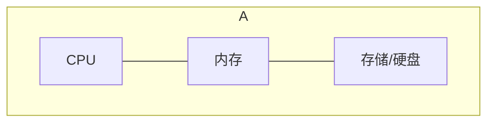
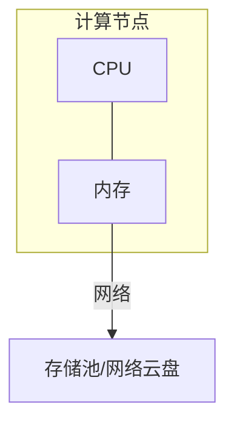
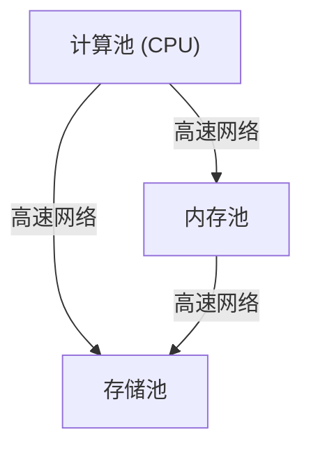
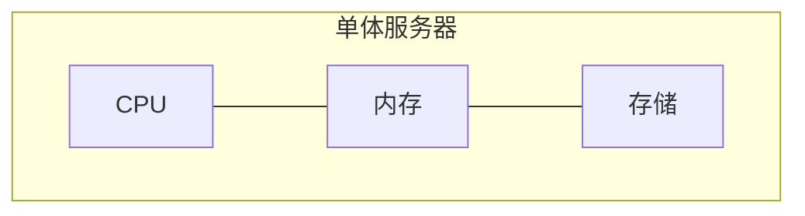
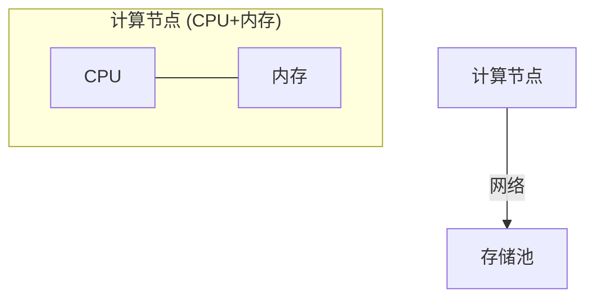
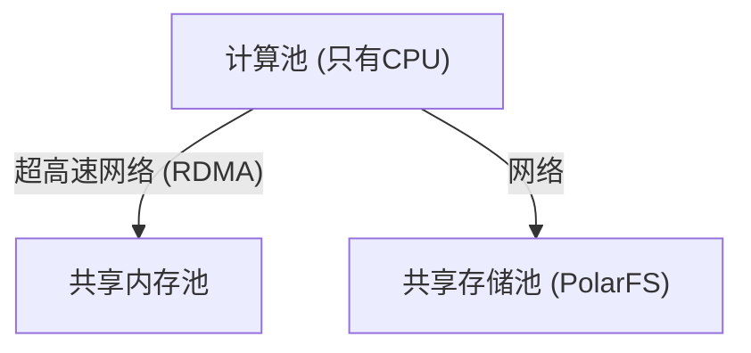
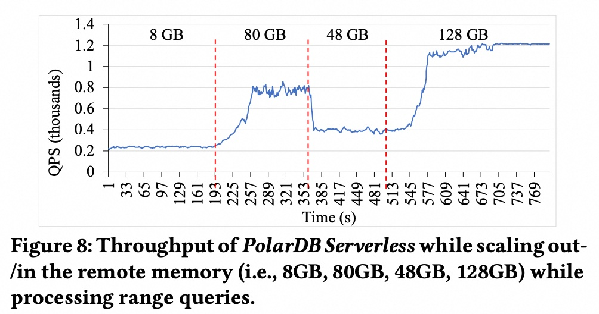
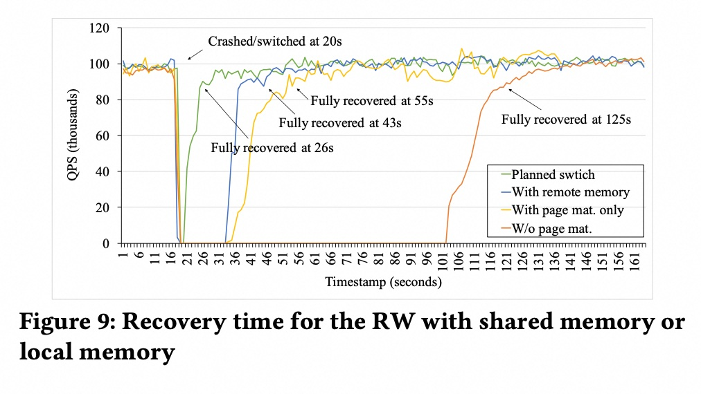

## AI论文解读 | PolarDB Serverless: A Cloud Native Database for Disaggregated Data Centers
        
### 作者        
digoal        
        
### 日期        
2025-07-18       
        
### 标签        
PostgreSQL , PolarDB , DuckDB , AI , 论文解读        
        
----        
        
## 背景  
      
https://users.cs.utah.edu/~lifeifei/papers/polardbserverless-sigmod21.pdf        
  
      
提示:        
```        
读懂《PolarDB Serverless: A Cloud Native Database for Disaggregated Data Centers》这篇论文需要提前掌握哪些基础知识, 请使用中文给我讲一下这些基础知识, 尽量通熟易懂, 可以使用markdown支持的图形增加解释性.        
        
使用中文通熟易懂的解读《PolarDB Serverless: A Cloud Native Database for Disaggregated Data Centers》这篇论文, 关键内容请深入讲解, 可以使用markdown支持的图形增加解释性.        
        
使用中文提取《PolarDB Serverless: A Cloud Native Database for Disaggregated Data Centers》论文中一些重要的术语并详细解释, 可以使用markdown支持的图形示增加解释性.        
```        
        
## 1 前置知识 
  
好的，为了完全理解《PolarDB Serverless: A Cloud Native Database for Disaggregated Data Centers》这篇技术论文，你需要对数据库架构、分布式系统、计算机网络和云计算等领域的一些核心概念有基本的认识。

这篇论文的精髓在于，它描述了一种全新的数据库系统设计范式，以适应数据中心硬件“分离化”的趋势。下面我将为你分解这些所需的背景知识，并尽量用通俗易懂的语言和图示来解释。

-----

### 核心基础知识概览

| 知识领域 | 关键概念 | 在 PolarDB Serverless 论文中的重要性 |
| :--- | :--- | :--- |
| **1. 数据库架构演进** | 单体架构 vs. 存算分离架构 vs. **资源分离架构** | 理解论文提出的新架构（资源分离）相比传统架构的优势和演进脉络。 |
| **2. 分布式系统** | 高可用、一致性协议 (Raft)、快照隔离 | 理解系统如何保证在多节点环境下不出错、数据不错乱，并处理并发事务。 |
| **3. 关键硬件与网络技术** | **RDMA** (远程直接内存访问)、分离式数据中心 (DDC) | 理解“资源分离”架构在物理上为何可行，RDMA 是实现低延迟远程内存访问的核心。 |
| **4. 数据库内核** | 事务与并发、B+树索引、缓冲池、日志与恢复 (ARIES) | 理解论文中讨论的性能优化（如锁机制）和可靠性设计（如故障恢复）的底层原理。 |
| **5. 云计算概念** | **Serverless (无服务器)**、弹性伸缩、按需付费 | 理解这款数据库产品的核心商业价值和用户体验目标。 |

-----

### 1\. 数据库架构的演进

要理解 PolarDB Serverless 的创新，首先要了解它之前的数据库长什么样。

#### a. 单体架构 (Monolithic Architecture)

这是最传统的架构，就像一台个人电脑，CPU、内存、硬盘都紧密地装在一个机箱里。



  *  **特点**: 资源（CPU、内存、存储）高度耦合。  
  * **缺点**:
      *  **弹性差**: 无法单独升级某一项资源。比如，你想加内存，很可能得买一台CPU、硬盘配置都更高的新服务器，造成浪费。  
      *  **命运共享 (Fate Sharing)**: 任何一个部件坏了（比如内存条故障），整个数据库服务就都挂了。  

#### b. 存算分离架构 (Compute-Storage Separation)

这是当前云数据库的主流架构，比如 Amazon Aurora 和常规版的 PolarDB。它好比把电脑的硬盘换成了一个网络云盘。



  *  **特点**: 计算资源（CPU和内存）和存储资源解耦。  
  * **优点**:
      *  存储可以独立扩展，非常灵活。  
      *  可以轻松创建只读节点共享同一份存储数据，降低成本。  
  *  **缺点**: CPU 和内存仍然是耦合的  ，无法单独为它们扩缩容，弹性不够极致。

#### c. 资源分离/解耦架构 (Disaggregated Architecture) - **论文的核心**

这是 PolarDB Serverless 提出的新架构，它把内存也从计算节点中“解放”出来，形成独立的资源池。



  *  **特点**: CPU、内存、存储三者完全解耦，各自形成独立的资源池，通过高速网络连接。  
  * **优点**:
      *  **极致弹性**: 可以按需、独立地为CPU、内存、存储扩缩容。   比如，一个分析任务需要巨大内存但CPU不多，就可以只扩容内存池。
      *  **消除命运共享**: 计算节点故障不影响内存池中的数据，恢复更快。  
      *  **资源共享**: 多个计算节点可以共享同一个内存池，减少内存冗余。  

-----

### 2\. 关键硬件与网络技术：RDMA

资源分离架构听起来很美好，但如果连接各个资源池的网络速度太慢，性能就会急剧下降。**RDMA (远程直接内存访问)** 技术是使其成为现实的关键。

  * **是什么**: 一种允许一台计算机的网卡直接读写另一台计算机内存的技术，整个过程几乎不需要两边计算机的CPU参与。
  * **为什么重要**:
      * **超低延迟**: 绕过了传统网络中繁琐的操作系统协议栈，延迟极低。
      *  **CPU 卸载**: 数据传输由硬件（网卡）完成，释放了宝贵的CPU资源。  

可以理解为，传统网络访问像是寄快递，需要打包、填单、中转站、派送等多个步骤；而 RDMA 就像是拥有一个传送门，可以直接将物品从A地内存瞬间传送到B地内存。

 论文中提到的 **RoCEv2**   是在普通以太网上实现 RDMA 的一种主流技术。

-----

### 3\. 数据库内核知识

#### a. 事务与并发控制 (MVCC)

数据库允许多个用户同时操作，为了防止数据错乱，需要并发控制。

  *  **MVCC (多版本并发控制)** : 这是现代数据库的主流技术。当修改一行数据时，它不是直接在原地覆盖，而是创建一个新版本的数据。这样，读操作可以读取旧版本，写操作可以创建新版本，读和写之间不会互相阻塞。
  *  **快照隔离 (Snapshot Isolation)** : 借助 MVCC，每个事务启动时，就像给整个数据库拍了一张“快照”。该事务中所有的读操作都只能看到这张快照里的数据，不受其他并发事务修改的影响。

#### b. B+树索引与锁

  * **B+树**: 数据库中用于快速查找数据的核心数据结构，类似书的目录。
  *  **结构修改操作 (SMO - Structure Modification Operation)** : 当B+树索引因为插入或删除数据变得不平衡时，会发生节点分裂或合并，这就是SMO。
  *  **锁/闩 (Lock/Latch)**: 在多用户环境下，当一个用户正在对B+树进行SMO时，必须“锁住”相关部分，防止其他用户读到一半的、不一致的树结构。论文中提到的 **PL (Page Latch)**   就是为了解决在资源分离架构下，多个计算节点同时访问索引时的一致性问题。

#### c. 缓冲池 (Buffer Pool) & 日志 (Log)

  *  **缓冲池**: 数据库为了加速访问，会把最常用的数据页（Page）从慢速的硬盘（或存储池）加载到高速的内存中缓存起来，这块内存区域就是缓冲池。  
  * **预写日志 (Write-Ahead Logging, WAL)**: 数据库在修改数据页之前，会先将“要做什么修改”这个行为（称为日志记录, Redo Log）写到可靠的存储上。万一在修改数据页的过程中掉电，重启后可以通过重放日志来恢复数据，保证事务的持久性。
  *  **页面物化 (Page Materialization)**: 指的是将日志应用到旧的数据页上，生成新版本数据页的过程。论文中将这个耗时操作**下放 (Offloading)** 到存储层去异步完成，从而减轻计算节点的负担。  

-----

### 4\. “云原生”与“无服务器”计算

  * **云原生 (Cloud Native)**: 指应用在设计之初就充分考虑了云环境的特点（如弹性、分布式、高可用），以便能更好地在云上运行。
  * **Serverless (无服务器)**:
      *  **不是没有服务器**，而是开发者不再需要关心服务器的运维、配置和扩容。  
      * **核心特性**:
          *  **按需自动伸缩 (Auto-Scaling)**: 根据业务负载自动增加或减少资源。比如，电商大促时自动增加CPU和内存，过后自动缩减。  
          *  **自动暂停与恢复 (Auto-Pause/Resume)**: 当数据库长时间没有访问时，可以自动暂停计算资源，只收取极低的存储费用；当再次有访问请求时，能快速恢复服务。  

 PolarDB Serverless 的资源分离架构，天然地非常适合实现 Serverless 的这些特性。例如，自动暂停时可以只释放CPU资源，而保留内存池中的热数据，这样恢复起来就会非常快。  

-----

### 总结

要读懂这篇论文，你可以这样构建你的知识体系：

1.  **看懂架构演进**：明白从“单体”到“存算分离”再到论文提出的“资源分离”架构，解决了什么问题，带来了什么好处。
2.  **理解技术基石**：认识到 **RDMA** 是实现“资源分离”架构高性能的关键。
3.  **掌握核心概念**：了解什么是 **Serverless**，它的自动伸缩和自动暂停特性是产品的核心价值。
4.   **深入内部细节**：带着对数据库内核（如MVCC、B+树、缓冲池、日志）的基本理解，去阅读论文中关于性能优化（如**乐观锁**   、**索引预取**  ）和故障恢复的章节。

掌握了这些基础知识后，你再阅读论文原文时，就能更好地理解作者们面临的挑战以及他们提出的解决方案的精妙之处。
  
## 2 解读论文 
  
好的，我们来一起深入解读这篇来自 SIGMOD '21 的重磅论文——《PolarDB Serverless: A Cloud Native Database for Disaggregated Data Centers》。

这篇论文的核心思想是：**为了在云时代实现极致的弹性、高可用和成本效益，我们应该彻底重构数据库的架构，将CPU、内存、存储完全“拆开”，让它们各自独立工作，再通过超高速网络连接起来。**

我将为你分步解析这篇论文的精髓，从“为什么”要这么做，到“是什么”新架构，再到“怎么做”到的技术细节。

-----

### 一、 动机：传统云数据库架构的“天花板”

在 PolarDB Serverless 之前，云数据库主流架构已经走过了两个阶段，但都遇到了瓶颈。

#### 阶段一：单体架构 (Monolithic)

 就像一台普通的服务器，CPU、内存、存储都封装在一起  。



  *  **痛点**：资源捆绑，缺乏弹性   。比如，你的业务只需要更多内存来缓存数据，但你不得不购买一台CPU、存储也更强的昂贵服务器。同时，“命运共享”问题严重，任何硬件损坏都可能导致整个数据库宕机  。

#### 阶段二：存算分离架构 (Compute-Storage Separation)

 这是 Amazon Aurora 和常规版 PolarDB 所采用的先进架构。它将存储独立出来，形成一个共享存储池  。



  *  **进步**：存储可以独立扩展，并且主节点（RW）和只读节点（RO）可以共享同一份数据，大大节约了存储成本  。
  * **天花板**：
    1.   **CPU和内存依然是耦合的**：你无法为一个内存密集型应用单独扩容内存  。
    2.   **内存冗余**：每个只读节点都需要维护自己的一份内存缓存（Buffer Pool），如果只读节点很多，会造成巨大的内存资源浪费  。
    3.  **恢复速度受限**：主节点故障后，新节点接管，它的内存缓存是空的（冷缓存），需要从慢速的共享存储中重新加载热点数据，导致业务恢复时间较长。

面对这些“天花板”，作者们提出了一个更彻底的解决方案。

-----

### 二、 核心架构：资源分离/解耦 (Disaggregation)

 PolarDB Serverless 的核心创新是**在“存算分离”的基础上，更进一步，把“内存”也分离出来**，形成独立的、可共享的“远程内存池”  。



这个架构带来了革命性的好处：

  *  **极致弹性**：CPU、内存、存储三者完全解耦，可以像乐高积木一样按需、独立地扩缩容  。
  *  **降本增效**：所有计算节点（包括主节点和只读节点）共享同一个远程内存池。增加一个只读节点几乎不增加额外的内存成本，因为它不再需要自己维护一个庞大的私有缓存  。
  *  **超快速恢复**：主节点（RW Node）崩溃后，新的节点可以立即接管，并直接连接到保留了所有热点数据的共享内存池。这避免了从慢速存储中加载数据的“冷启动”过程，恢复速度极快   。论文实测恢复速度提升了 **5.3倍**  。
  *  **Serverless 的完美搭档**：这种架构天然适合实现 Serverless（无服务器）数据库的“按需启停”功能   。例如，当数据库没有请求时，可以只释放昂贵的CPU计算资源，但保留内存池中的数据。当新请求到来时，可以秒级拉起一个计算节点，服务几乎无中断  。

-----

### 三、 技术内幕：如何实现这套复杂系统？

将资源拆分后，一系列世界级的技术难题也随之而来：如何管理远程内存？如何保证多个节点访问共享数据时的一致性？如何弥补远程访问带来的性能损失？论文给出了精巧的解答。

#### 1\. 核心部件：解耦式内存池 (Disaggregated Memory)

 系统通过一个名为 `librmem` 的库来访问远程内存  。整个内存池由两类节点组成：

  *  **Slab 节点**：实际存放数据页的普通内存服务器  。
  *  **Home 节点**：每个数据库实例对应一个 Home 节点，它是内存池的“大管家”，负责管理所有元数据，但不存储实际的数据页  。

Home 节点上维护着几个至关重要的元数据结构：

  *  **PAT (Page Address Table)**: 一个哈希表，记录了每个数据页存储在哪台 Slab 节点的哪个物理地址上，以及它的被引用次数  。
  *  **PRD (Page Reference Directory)**: 记录了每个数据页被哪些计算节点缓存在自己的本地缓存（Local Cache）中  。
  *  **PIB (Page Invalidation Bitmap)**: 一个位图，用于实现**缓存一致性**。当主节点修改了某个数据页后，会通过 PIB 标记远程内存池以及其他只读节点本地缓存中的对应数据为“已失效”  。
  *  **PLT (Page Latch Table)**: 管理全局的物理页锁（Page Latch），用于保证 B+ 树在并发修改时的结构一致性  。

> **深入讲解：缓存一致性如何工作？**
>
> 1.  主节点（RW）在自己的本地缓存里修改了页面 P。
> 2.  主节点通知 Home 节点：“页面 P 已被我修改”。
> 3.  Home 节点查询 PRD，发现只读节点 RO1 和 RO2 也缓存了页面 P 的旧版本。
> 4.  Home 节点在自己的 PIB 中将页面 P 对应的位置为1（表示内存池中的数据已过时）  。
> 5.  Home 节点同时通知 RO1 和 RO2：“你们缓存的页面 P 过时了，请在你们本地的 PIB 中也标记一下”  。
> 6.  当 RO1 或 RO2 下次要访问页面 P 时，会先检查自己的本地 PIB，发现已失效，就不会使用旧数据，而是去重新读取新版本。

#### 2\. 关键难题：并发与一致性

  * **B+树结构一致性**

      *  **问题**：当主节点（RW）在对 B+ 树索引进行分裂（SMO）时，一个只读节点（RO）可能正好在遍历这棵树，从而看到一个“半成品”的、不一致的树结构  。
      *  **解决方案**：使用**全局页锁（Page Latch, PL）**   。主节点在进行 SMO 操作前，必须先获得相关页面的独占（X）PL   。而只读节点在遍历时，需要获得共享（S）PL   。通过这种方式，保证了只读节点要么看到操作前的完整结构，要么看到操作后的完整结构，绝不会看到中间状态   。为了加速锁的获取，系统会优先尝试使用 **RDMA CAS** 原子操作，性能极高  。

  * **事务快照隔离 (Snapshot Isolation)**

      * **问题**：在多版本并发控制（MVCC）下，事务需要知道它应该能看到哪个版本的数据。
      *  **解决方案**：在主节点上维护一个**中心化的时间戳服务（CTS）和一个CTS日志**   。事务开始时从 CTS 获取一个`cts_read`时间戳   。读取数据时，只能读取 `commit` 时间戳小于自身 `cts_read` 的版本   。只读节点可以通过**单边 RDMA Read** 操作高效地访问 CTS 日志，判断某个事务是否已提交和可见，这个过程完全不消耗主节点的 CPU  。

#### 3\. 性能优化：弥补远程访问的延迟

  * **页面物化下放 (Page Materialization Offloading)**

      * **传统做法**：主节点需要定期将“脏页”（被修改过的内存页）刷回存储。
      *  **创新做法**：主节点**只写 Redo Log** 到存储层，而将“用 Redo Log 生成新页面”这个繁重的工作 **下放（Offload）** 给存储节点自己去异步完成  。这极大地减轻了主节点的负担和网络压力。

  * **乐观锁 (Optimistic Locking)**

      * **背景**：虽然有全局页锁（PL）保证 B+ 树一致性，但每次读取都去申请锁，开销不小。
      *  **做法**：只读节点乐观地假设“在我查询期间，不会发生 B+ 树结构修改”   。它在查询开始时记录一个全局的“结构修改计数器”的值   。在遍历 B+ 树时，检查每个页面的版本号。如果发现有页面的版本号比它开始时记录的还新，就说明有结构修改发生，这次查询可能看到了不一致的数据，于是放弃本次结果并重试（下次重试可能会使用悲观的锁模式） 。在大部分情况下，这种乐观策略能成功，从而避免了锁的开销。

  * **索引感知预取 (Index-Aware Prefetching, BKP)**

      *  **场景**：很多查询需要先扫描一个二级索引找到主键，再根据主键去主表里捞数据，后者通常是大量的随机读，性能很差  。
      *  **做法**：系统可以提前分析查询计划，当在二级索引中找到一批主键后， **提前（Prefetch）** 就去远程内存或存储中批量加载这些主键对应的主表数据页  。等真正需要这些数据时，它们大概率已经被加载到缓存中了，从而隐藏了远程访问的延迟。

-----

### 四、 实验效果：弹性和速度的飞跃

论文通过实验证明了新架构的巨大优势：

  *  **弹性**：如下图所示，当动态增加远程内存池的大小时，系统的吞吐量（QPS）也随之平滑提升；缩减内存时，性能也相应下降，证明了其按需分配资源的能力非常出色  。

     *图：PolarDB Serverless 在动态伸缩远程内存时的吞吐量变化*   

  *  **快速故障恢复**：下图清晰地展示了，在主节点崩溃时，拥有远程内存的 PolarDB Serverless（蓝线）恢复速度极快，仅用 **43秒** 就基本恢复了业务吞吐(相比计划切换的26秒稍高)   。而没有远程内存的架构（黄线、橙线）则需要漫长的时间来预热缓存，最差情况下耗时 **125秒**  。

     *图：不同架构下的故障恢复时间对比*   

### 总结

《PolarDB Serverless》这篇论文不仅仅是对现有数据库的改良，更是一次面向未来的、彻底的架构革新。它精准地抓住了云计算时代对**弹性**和**成本**的核心诉求，通过**资源分离（Disaggregation）** 这一核心思想，并借助 **RDMA** 等先进硬件技术，构建了一套理论上和实践上都极为先进的云原生数据库系统。它所展示的设计理念和技术细节，为下一代云数据库的发展指明了清晰的方向。
  
## 3 术语  
  
好的，这里是论文《PolarDB Serverless: A Cloud Native Database for Disaggregated Data Centers》中一些重要术语的中文解读，并配有详细解释和图示。

-----

### 1\. 资源分离/解耦架构 (Disaggregation Architecture)

  *  **核心定义**: 这是一种全新的数据库系统设计范式，它将传统服务器中耦合在一起的计算（CPU）、内存和存储资源彻底拆分，形成各自独立的资源池，并通过高速网络进行互联  。

  * **详细解释**:
     这是整篇论文的基石。传统的“存算分离”架构只分离了存储，而CPU和内存仍然绑定在一起   。资源分离架构更进一步，将内存也独立出来，形成一个可被多个计算节点共享的远程内存池  。

    ```mermaid
    graph TD
        subgraph "传统存算分离架构"
            A1["计算节点 (CPU + 内存)"] -- 网络 --> B1[存储池]
            A2["计算节点 (CPU + 内存)"] -- 网络 --> B1
        end

        subgraph "资源分离架构 (PolarDB Serverless)"
            C1["计算节点 (仅CPU)"] -- 高速网络 --> D[共享内存池]
            C2["计算节点 (仅CPU)"] -- 高速网络 --> D
            D -- 网络 --> E[共享存储池]
        end
    ```

     这种架构的最大优势是**极致的弹性**和**资源利用率**。CPU、内存、存储可以根据实际负载独立扩缩容，避免了资源浪费   。同时，由于内存池是共享的，增加只读计算节点几乎不带来额外的内存开销  。

### 2\. RDMA (Remote Direct Memory Access - 远程直接内存访问)

  *  **核心定义**: 一种网络通信技术，允许一台计算机的网卡直接读写另一台计算机的内存，而无需两端计算机操作系统的介入  。

  * **详细解释**:
     RDMA 是实现资源分离架构高性能的**关键使能技术**。在传统的网络通信中，数据传输需要经过发送方和接收方复杂的操作系统协议栈，延迟高且消耗CPU资源。RDMA 则通过硬件（RDMA网卡）创建了一个“绿色通道”，实现了超低延迟和极低的CPU占用率   。在 PolarDB Serverless 中，RDMA 被广泛用于计算节点和远程内存池之间的数据页读写、锁获取（使用RDMA CAS原子操作）以及元数据访问，从而弥补了因内存远程化带来的性能损失  。

### 3\. Home 节点 (Home Node) 与 Slab 节点 (Slab Node)

  *  **核心定义**: 这是构成远程内存池的两种角色。Slab 节点是普通的内存服务器，负责实际存储数据页；Home 节点是一个特殊的“大管家”节点，负责管理整个数据库实例在内存池中的所有元数据  。

  * **详细解释**:
     一个数据库实例的远程内存由多个1GB大小的内存块（Slab）组成，这些Slab分布在一个或多个Slab节点上   。其中，存放第一个Slab的节点被指定为Home节点  。Home节点上维护着一系列对保证系统正确性和一致性至关重要的元数据结构，例如：

      *  **PAT (Page Address Table)**: 页面地址表，一个哈希表，记录每个数据页的位置和引用计数  。
      *  **PIB (Page Invalidation Bitmap)**: 页面失效位图，用于缓存一致性  。
      *  **PRD (Page Reference Directory)**: 页面引用目录，追踪哪些节点缓存了某个页面  。
      *  **PLT (Page Latch Table)**: 全局页锁表，管理用于并发控制的物理锁  。

    这种设计将元数据管理和数据存储分离，使得系统管理更加清晰高效。

### 4\. PIB (Page Invalidation Bitmap) 与 PRD (Page Reference Directory)

  *  **核心定义**: 这是实现远程内存与计算节点本地缓存之间**缓存一致性**的两个核心数据结构，均位于Home节点上  。

      *  **PIB**: 一个位图，标记远程内存池中的某个数据页版本是否已过时（因为主节点已在本地修改但未写回） 。
      *  **PRD**: 一个目录，记录了每个数据页当前被哪些计算节点（如只读节点）缓存在它们的本地内存中  。

  * **详细解释**:
     当主节点（RW Node）在本地修改了一个页面后，必须确保其他只读节点（RO Node）不会读到远程内存池或它们自己本地缓存中的旧数据。这个过程被称为“缓存失效”  。

    ```mermaid
    sequenceDiagram
        participant RW as RW Node
        participant Home as Home Node
        participant RO as RO Node

        RW->>Home: 我修改了页面P，请执行 page_invalidate
        Home->>Home: 在我的PIB中标记P为失效
        Home->>Home: 查询PRD，发现RO节点也缓存了P
        Home-->>RO: 通知：你缓存的页面P已失效
        RO->>RO: 在我的本地PIB中标记P为失效
        Home-->>RW: 失效操作完成
    ```

     通过 PIB 和 PRD 的联动，系统能精确地通知所有相关的节点，确保它们不会使用到脏数据，从而维护了数据的一致性  。

### 5\. PL (Page Latch - 全局页锁)

  *  **核心定义**: 一种**全局物理锁**，用于在多节点环境下，保护共享数据页（特别是B+树索引页）的物理结构在并发访问时的一致性  。

  * **详细解释**:
     当主节点需要对B+树进行结构修改（如页面分裂，称为**SMO**）时，它会同时修改多个页面   。如果没有保护，只读节点在此时遍历索引可能会看到一个被“改了一半”的、不完整的树，导致查询出错  。
    PL就是用来解决这个问题的。

      *  主节点在进行SMO前，必须对所有涉及的页面加上**排他（X）模式的PL**  。
      *  只读节点在遍历索引时，需要对它访问的页面加上**共享（S）模式的PL**  。
         X锁和S锁是互斥的，这确保了只读节点要么看到SMO操作开始前的完整B+树，要么看到操作完成后的完整B+树，绝不会看到中间状态  。

### 6\. 页面物化下放 (Page Materialization Offloading)

  *  **核心定义**: 一项核心性能优化技术，指将“应用Redo日志生成新版本数据页”这个过程（即页面物化）从计算节点（RW Node）**下放**到存储节点（PolarFS）去异步完成  。

  * **详细解释**:
     在传统数据库中，计算节点需要将修改后的“脏页”定期刷回存储，这会产生大量的网络I/O  。在PolarDB Serverless中，计算节点的工作被大大简化：

    1.   **计算节点 (RW)**: 只负责将事务产生的 **Redo Log** 写入到存储层的日志块（Log Chunk）中  。
    2.   **存储节点 (PolarFS)**: 存储节点内部的页面块（Page Chunk）会异步地拉取这些日志，并负责将日志应用到旧的数据页上，从而“物化”出新的数据页版本  。

     这个设计的好处是，它极大地减轻了计算节点的负担和网络压力，让计算节点可以专注于处理用户的事务请求  。

### 7\. BKP (Batched Key Prepare)

  *  **核心定义**: “批量主键预取”，一种**索引感知预取 (Index-Aware Prefetching)** 技术，用于隐藏远程I/O延迟，提升查询性能  。

  * **详细解释**:
    很多SQL查询的执行过程是两步：

    1.  通过二级索引（例如，按`age > 17`查找）扫描，得到一批符合条件记录的**主键**。
    2.   根据这些主键，逐个去主键索引（聚簇索引）中查找完整的行数据（如`name`, `address`） 。
        第二步通常会产生大量的随机I/O，在远程内存/存储架构下性能会很差。
         BKP的作用就是优化这个过程。当数据库通过第1步获得一批主键后，它不会立即逐个去查找，而是将这些主键作为一个**批次（Batch）**，启动一个后台任务， **预先（Prefetch）** 从远程内存或存储中加载这些主键对应的数据页   。当查询执行到第2步时，所需要的数据页很大概率已经被预取到本地缓存中了，从而大大减少了等待时间  。
  
## 参考        
         
https://users.cs.utah.edu/~lifeifei/papers/polardbserverless-sigmod21.pdf  
        
        
<b> 以上内容基于DeepSeek、Qwen、Gemini及诸多AI生成, 轻微人工调整, 感谢杭州深度求索人工智能、阿里云、Google等公司. </b>        
        
<b> AI 生成的内容请自行辨别正确性, 当然也多了些许踩坑的乐趣, 毕竟冒险是每个男人的天性.  </b>        
    
  
  
#### [期望 PostgreSQL|开源PolarDB 增加什么功能?](https://github.com/digoal/blog/issues/76 "269ac3d1c492e938c0191101c7238216")
  
  
#### [PolarDB 开源数据库](https://openpolardb.com/home "57258f76c37864c6e6d23383d05714ea")
  
  
#### [PolarDB 学习图谱](https://www.aliyun.com/database/openpolardb/activity "8642f60e04ed0c814bf9cb9677976bd4")
  
  
#### [PostgreSQL 解决方案集合](../201706/20170601_02.md "40cff096e9ed7122c512b35d8561d9c8")
  
  
#### [德哥 / digoal's Github - 公益是一辈子的事.](https://github.com/digoal/blog/blob/master/README.md "22709685feb7cab07d30f30387f0a9ae")
  
  
#### [About 德哥](https://github.com/digoal/blog/blob/master/me/readme.md "a37735981e7704886ffd590565582dd0")
  
  

  
