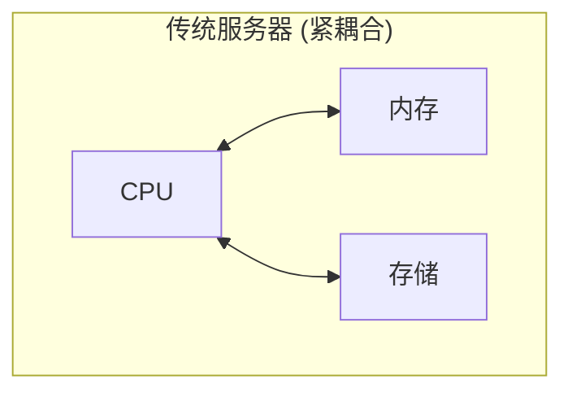
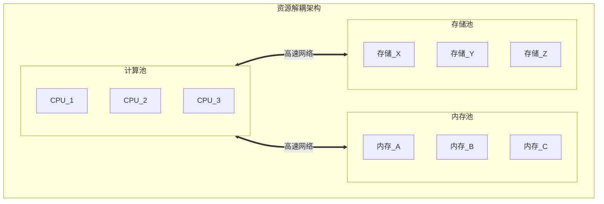
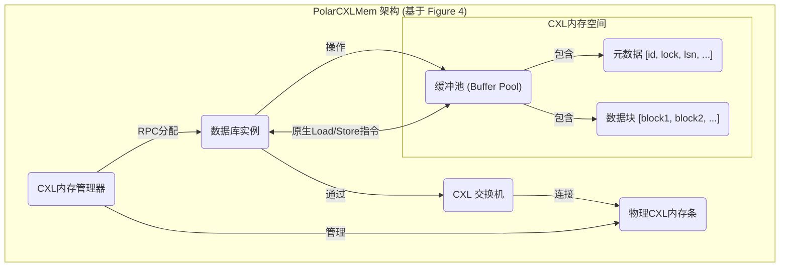
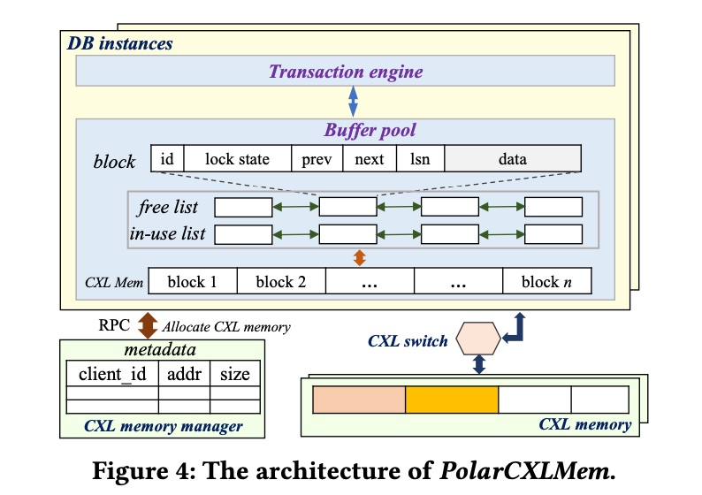
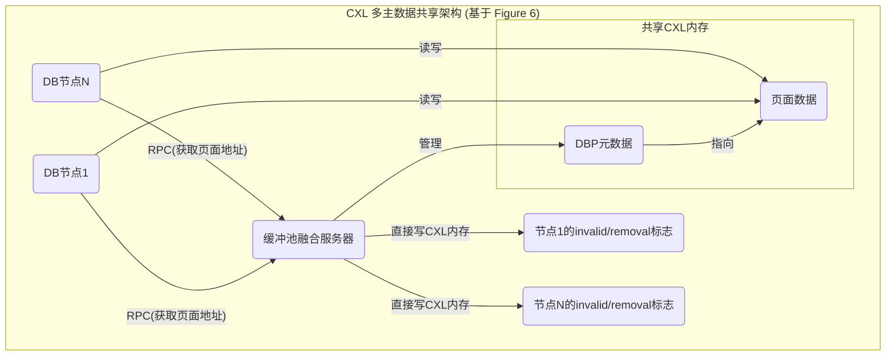
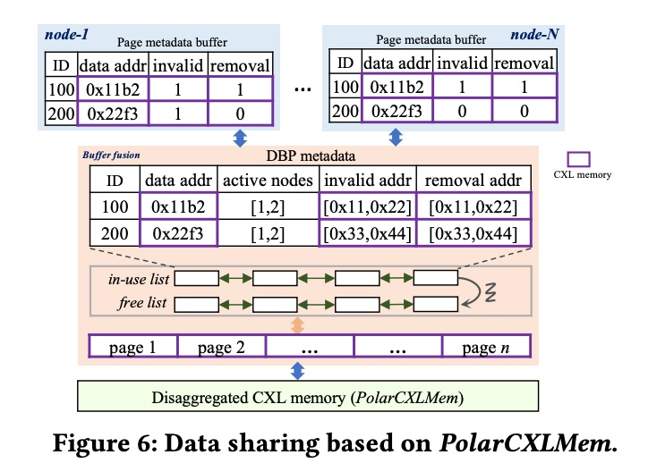
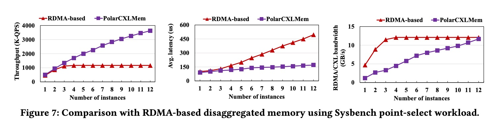
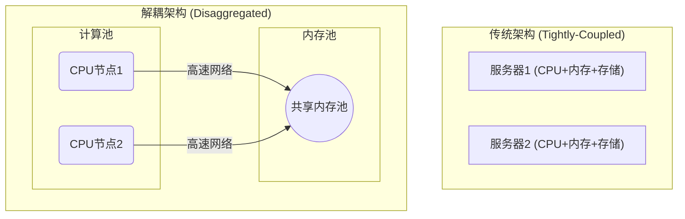
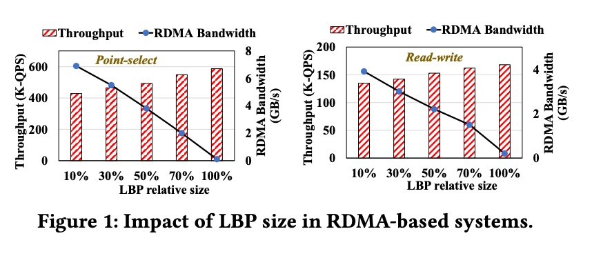

## AI论文解读 | Unlocking the Potential of CXL for Disaggregated Memory in Cloud-Native Databases
        
### 作者        
digoal        
        
### 日期        
2025-07-19       
        
### 标签        
PostgreSQL , PolarDB , DuckDB , AI , 论文解读        
        
----        
        
## 背景  
      
https://dl.acm.org/doi/pdf/10.1145/3722212.3724460        
  
      
提示:        
```        
读懂《Unlocking the Potential of CXL for Disaggregated Memory in Cloud-Native Databases》这篇论文需要提前掌握哪些基础知识, 请使用中文给我讲一下这些基础知识, 尽量通熟易懂, 可以使用markdown支持的图形增加解释性.        
        
使用中文通熟易懂的解读《Unlocking the Potential of CXL for Disaggregated Memory in Cloud-Native Databases》这篇论文, 关键内容请深入讲解, 可以使用markdown支持的图形增加解释性.        
        
使用中文提取《Unlocking the Potential of CXL for Disaggregated Memory in Cloud-Native Databases》论文中一些重要的术语并详细解释, 可以使用markdown支持的图形示增加解释性.        
```        
        
## 1 前置知识 
  
好的，非常乐意为您解析这篇关于CXL在云原生数据库中应用的论文所需的基础知识。

想要完全读懂《Unlocking the Potential of CXL for Disaggregated Memory in Cloud-Native Databases》这篇技术论文，您需要对以下几个领域的知识有基本的了解：**大规模系统架构**、**高速互联技术** 和 **数据库核心原理**。

下面我将用通俗易懂的语言，结合图示，为您逐一讲解这些基础知识。

-----

### 一、 核心背景：为什么需要“内存解耦”？(Memory Disaggregation)

想象一下我们传统的服务器，它就像一个“乐高成品”：CPU、内存（DRAM）、硬盘（Storage）都紧紧地封装在一个机箱里。



这种模式有很多弊端：

  * **资源浪费**：有时一台服务器的CPU用满了，但内存还剩很多；另一台可能内存用完了，CPU却很空闲。这些“偏科”的资源无法共享，造成了浪费。
  * **扩展困难**：想给服务器加内存，但主板上的插槽已经插满了，怎么办？只能再买一台完整的服务器，成本很高。
  *  **成本高昂**：据论文中提到，DRAM（内存）在服务器成本中占比极高（高达40%-50%） 。

为了解决这些问题，“**资源解耦/分离 (Disaggregation)**” 的思想应运而生。它就像把“乐高成品”拆成一堆独立的“乐高积木块”：一个CPU资源池、一个内存资源池、一个存储资源池，然后用超高速的网络把它们连接起来。



这样，任何一个CPU节点都可以根据需要，从共享的内存池里“借用”一块内存来使用。这篇论文研究的核心，就是如何构建这个“内存池”，以及用什么“高速网络”来连接。

-----

### 二、 两种关键技术：RDMA vs. CXL

要实现内存解耦，连接CPU和远端内存池的“高速网络”至关重要。这篇论文主要对比了两种技术：RDMA（老方案）和CXL（新方案）。

#### 1\. RDMA (远程直接内存访问)

RDMA 是一种成熟的网络技术，它允许一台计算机的CPU直接读写另一台计算机的内存，而不需要对方CPU的干预。这比传统的网络通信（如TCP/IP）快得多。

**RDMA的问题 (也是论文要解决的痛点):**

  * **读写放大 (Read/Write Amplification)**  ：这是RDMA方案最大的问题。数据库操作通常很精细，可能只需要修改一个8字节的数据。但在RDMA架构下，系统必须将整个数据页（比如16KB）从远程内存池读到本地，修改完这8个字节后，再把整个16KB的页面写回去。

    ```mermaid
    graph TD
        subgraph RDMA 操作流程
            A[CPU: 我需要修改8个字节] --> B{读取整个16KB页面到本地内存}
            B --> C{在本地内存中修改8字节}
            C --> D{将修改后的整个16KB页面写回远程内存}
        end
    ```

    这个过程极大地浪费了网络带宽。

  * **分层内存 (Tiered Memory)**   ：因为RDMA的访问延迟虽然比硬盘快，但仍然比访问本地内存慢。所以，基于RDMA的系统不得不在本地服务器上保留一块内存作为“**本地缓冲池(Local Buffer Pool, LBP)**”   。这就形成了一个“本地内存 -\> 远程内存”的分层结构，增加了系统复杂度和硬件成本  。

  * **缺乏原生缓存一致性 (Cache Coherency)**  ：当多个CPU节点共享同一份远程内存数据时，如何保证大家看到的数据都是最新的？RDMA本身不提供这个保证，需要数据库应用自己实现复杂的同步机制，开销很大。

#### 2\. CXL (计算快速链接)

 CXL 是一个基于PCIe（就是插显卡的那个插槽标准）的、更新的、更快的互联协议   。它最革命性的一点是：**让CPU可以像访问本地内存一样，直接访问挂载在CXL总线上的外部内存**  。

**CXL的优势 (论文利用的优点):**

  * **原生 Load/Store 指令支持**  ：CPU可以直接对CXL内存上的数据执行读（load）和写（store）指令，完全消除了RDMA的“读回-修改-写回”的笨重流程，从根本上解决了读写放大问题。

    ```mermaid
    graph TD
        subgraph "RDMA 模式"
            direction LR
            CPU --> |1\. 读整页| 本地内存
            本地内存 --> |2\. 修改| CPU
            CPU --> |3\. 写回整页| 远程内存
        end
        subgraph "CXL 模式"
            direction LR
            CPU <--> |直接Load/Store| CXL内存
        end
    ```

  * **更低延迟**  ：CXL协议路径更短，转换更少，因此访问延迟比RDMA低得多。

  * **CXL交换机 (CXL Switch)**   ：类似于网络交换机，CXL交换机可以连接多个CPU主机和多个CXL内存设备，构建出一个真正可共享、可扩展的内存池。这篇论文就是基于全球首款CXL 2.0交换机做的研究  。

    ```mermaid
    graph TD
        subgraph CXL 交换机架构
            Host1(CPU) --> Switch
            Host2(CPU) --> Switch
            Host3(CPU) --> Switch
            Switch --> Mem1(CXL内存)
            Switch --> Mem2(CXL内存)
            Switch --> Mem_N(CXL内存)
        end
    ```

-----

### 三、 数据库核心原理

这篇论文将CXL技术应用在了云原生数据库上，所以理解几个数据库概念至关重要。

#### 1\. 缓冲池 (Buffer Pool)

 这是数据库性能的“心脏”   。数据库的数据主要存在慢速的硬盘（存储）上。为了加速访问，数据库会在内存中开辟一块巨大的空间，叫做“缓冲池”，用来缓存从硬盘读出来的、最常用的数据页  。后续的读写操作都直接在这个缓冲池里进行。

  * **传统做法**：缓冲池在服务器的本地内存里。
  * **RDMA方案**：缓冲池大部分在远程内存，但本地仍需保留一个小的二级缓冲池（LBP）  。
  * **论文的CXL方案 (PolarCXLMem)**：**完全取消本地缓冲池**，将整个缓冲池（包括数据和管理它的元数据）都直接放在CXL共享内存上  。这是一个核心的创新。

#### 2\. 崩溃恢复 (Crash Recovery)

 如果数据库运行中突然断电或崩溃，内存里的数据（缓冲池）会丢失。恢复时，数据库需要通过读取之前保存的“**重做日志 (Redo Log)**”  ，一步步地重放操作，把数据恢复到崩溃前的状态。这个过程通常非常漫长。

  *  **论文的恢复方案 (PolarRecv)**   ：因为CXL内存池有独立的电源，当计算节点（CPU主机）崩溃时，CXL内存里的数据（也就是整个缓冲池）是完好无损的   。所以恢复时，新的数据库实例可以直接挂载上这个“热乎”的缓冲池，只需要做少量一致性检查，就能几乎“瞬间”完成恢复和预热，极大地提升了可用性  。

#### 3\. 多主数据库和数据共享 (Multi-Primary & Data Sharing)

 为了提高写入性能和可用性，有些数据库允许多个节点（称为“主节点”）同时对外提供读写服务  。它们需要共享同一份底层数据。

  *  **RDMA方案下的共享**：多个节点通过RDMA网络访问共享内存中的数据，但需要复杂的软件逻辑来同步数据，保证一致性，性能开销大  。
  *  **论文的CXL共享方案**：虽然论文用的CXL 2.0还不支持硬件缓存一致性，但作者设计了一套更高效的软件同步协议   。它利用CXL的低延迟特性，同步消息非常快，并且只同步被修改的缓存行（64字节），而不是整个页面，效率远高于RDMA方案  。

### 总结

掌握了以上知识后，您就可以轻松理解这篇论文的脉络了：

1.  **背景**：传统服务器架构有资源浪费问题，内存解耦是未来趋势。
2.  **问题**：现有的RDMA内存解耦方案存在**读写放大**、**系统复杂**和**成本高**等痛点。
3.  **方案 (PolarCXLMem)**：利用新兴的**CXL**技术，特别是**CXL交换机**，构建了一个共享内存池。通过**直接Load/Store访问**，将数据库的**缓冲池**完整地放在CXL内存上，消除了读写放大和分层内存。
4.  **延伸贡献1 (PolarRecv)**：利用CXL内存掉电不丢数据的特性，实现了数据库的**即时崩溃恢复**。
5.  **延伸贡献2 (Data Sharing Protocol)**：为**多主数据库**设计了高效的**数据共享和同步协议**。
6.  **结论**：实验证明，与RDMA方案相比，CXL方案在性能、成本和可用性上都有巨大优势  。

希望这份解释能帮助您更好地理解这篇优秀的论文！
  
## 2 解读论文 
  
好的，我们来一起深入解读这篇非常具有前瞻性的数据库系统论文——《Unlocking the Potential of CXL for Disaggregated Memory in Cloud-Native Databases》。

这篇论文的核心思想是：**利用新兴的CXL（Compute Express Link）技术，彻底革新云原生数据库的内存管理方式，从而解决当前主流方案（基于RDMA）的诸多性能瓶颈，并在此基础上实现数据库的即时恢复和高效的数据共享。**

我将为您从以下几个方面进行层层剖析：

1.  **核心问题**：为什么现有的内存解耦方案（RDMA）不够好？
2.  **颠覆性技术**：CXL是什么，它好在哪里？
3.  **论文核心设计 (1)**：PolarCXLMem - 基于CXL的全新内存池化架构
4.  **论文核心设计 (2)**：PolarRecv - 基于PolarCXLMem的即时恢复方案
5.  **论文核心设计 (3)**：CXL下的多主数据共享新协议
6.  **实验与成果**：性能到底有多强？
7.  **总结**

-----

### 1\. 核心问题：为何现有内存解耦方案（RDMA）不够好？

 在云计算时代，为了节省成本和灵活扩缩容，我们希望将服务器的计算、内存、存储资源分开，按需组合，这就是“资源解耦”  。其中，内存解耦（Memory Disaggregation）是将内存集中成一个共享的“内存池”，供多个计算节点使用。

 目前，实现内存解耦的主流技术是 **RDMA (远程直接内存访问)**。但论文指出，RDMA方案在应用于云数据库时，存在四大痛点  ：

  *  **① 读写放大 (Read/Write Amplification)**：这是最致命的问题。数据库操作可能只是修改页面中的几个字节，但在RDMA架构下，计算节点必须先把整个数据页（通常是16KB）从远程内存池读到本地，修改后，再把整个16KB的页面写回去   。这一来一回造成了巨大的网络带宽浪费，在论文的测试中，读放大高达4倍  。

  *  **② 低效的恢复 (Inefficient Recovery)**：当数据库的计算节点崩溃后，虽然可以从远程内存池里读取部分数据页来加速恢复，但恢复逻辑本身没有优化   。系统仍然需要扫描大量的重做日志（Redo Log）来重建内存数据结构，整个过程耗时很长  。

  *  **③ RDMA自身瓶颈 (RDMA Bottleneck)**：在高并发下，RDMA网卡本身会成为瓶颈，例如其Doorbell寄存器的争用和缓存颠簸问题，这限制了应用在多核服务器上的扩展性  。

  *  **④ 复杂的缓存一致性 (Lack of Cache Coherency)**：当多个计算节点共享数据时（例如在多主数据库中），RDMA不提供硬件级别的缓存一致性保证   。数据库必须在软件层面自行实现一套复杂的同步机制来确保数据一致，这带来了额外的性能开销和实现复杂度  。

-----

### 2\. 颠覆性技术：CXL是什么，好在哪？

 CXL (Compute Express Link) 是一种建立在PCIe物理层之上的高速互联协议  。它为解决RDMA的痛点带来了曙光。相比RDMA，CXL有几大革命性优势：

  * **原生Load/Store访问**：这是CXL最核心的优势。CPU可以像访问本地内存一样，使用最基础的`load`（读）和`store`（写）指令直接操作CXL内存   。这彻底消除了RDMA“读回-修改-写回”的笨重流程和随之而来的读写放大问题  。

    ```mermaid
    graph TD
        subgraph "RDMA 模式"
            CPU --> |1\. 发起RDMA Read请求| RDMA网卡
            RDMA网卡 --> |2\. 读取整个Page| 远端内存
            远端内存 --> |3\. Page数据返回| RDMA网卡
            RDMA网卡 --> |4\. 写入本地内存| 本地内存(LBP)
            CPU --> |5\. 在本地修改数据| 本地内存(LBP)
            CPU --> |6\. 发起RDMA Write请求| RDMA网卡
            RDMA网卡 --> |7\. 写入整个Page| 远端内存
        end

        subgraph "CXL 模式"
            CPU <--> |直接执行Load/Store指令| CXL内存
        end
    ```

  * **极低延迟**：CXL通过PCIe直连，协议路径比“CPU -\> PCIe -\> RDMA网卡 -\> 网络 -\> RDMA网卡 -\> PCIe -\> 内存”的路径短得多，延迟也因此显著降低   。论文引用数据显示，对于64字节的读取，CXL比RDMA快8.3倍  。

  * **开发简单**：CXL对应用程序透明，应用开发者看到的CXL内存就像一块本地内存，无需像RDMA那样使用复杂的专用接口编程  。

  * **硬件缓存一致性**：CXL 3.0标准原生支持跨多个主机的硬件缓存一致性  。这意味着硬件会自动处理数据同步问题，将开发者从复杂的软件实现中解放出来（尽管本论文使用的是CXL 2.0，需要自行实现一致性协议）。

-----

### 3\. 论文核心设计 (1): PolarCXLMem - 基于CXL的全新内存池化架构

 针对上述问题和CXL的优势，论文提出了 **PolarCXLMem**，一个专为云原生数据库设计的、基于CXL交换机的内存解耦系统  。

 其核心设计思想是：**彻底抛弃RDMA方案中的“本地缓存(LBP) + 远程内存”的分层结构，将数据库的整个缓冲池（Buffer Pool），包括数据页和管理它们的元数据，全部直接放置在CXL内存上**  。


  
  
  
**关键设计解析**：

  *  **消除分层内存**：作者通过实验证明，虽然CXL内存比本地DRAM慢，但其速度已经“足够快”，直接在CXL上运行数据库缓冲池所带来的性能损失微乎其微（在某些场景下仅7%）   。这一大胆的设计选择，不仅从根本上消除了RDMA的读写放大问题   ，还省去了本地缓存的内存开销，降低了总成本   ，并大大简化了系统设计  。
  *  **内存管理**：系统设计了一个CXL内存管理器，通过RPC为各个数据库实例分配相互隔离的CXL内存空间，以支持多租户场景  。
  *  **透明访问**：数据库实例通过`mmap`将分配到的CXL内存映射到自己的地址空间，之后便可以像操作普通内存一样透明地使用它   。事务引擎无需关心数据指针指向的是本地DRAM还是CXL内存，极大地保证了系统稳定性和兼容性  。

-----

### 4\. 论文核心设计 (2): PolarRecv - 基于PolarCXLMem的即时恢复方案

 传统数据库崩溃后，内存中的缓冲池数据全部丢失，恢复过程漫长   。PolarCXLMem的CXL内存设备拥有独立供电，计算节点崩溃不会影响其中的数据   。利用这一特性，论文提出了 **PolarRecv** 即时恢复方案  。

**挑战与解决方案**：

  * **挑战**：简单地重用CXL内存中的数据会遇到问题，例如：B-Tree结构可能因分裂到一半而损坏、页面可能只写了一半处于“部分”状态、或者页面版本比持久化的日志还要新（“过新”页面问题）  。
  * **PolarRecv的解决之道**：
    1.   **在CXL内存中存储元数据**：每个数据页的元数据（如`lock_state`锁状态、`lsn`日志序列号）也存储在CXL内存中  。
    2.   **基于元数据的恢复决策**：恢复时，系统会检查每个页面的状态。如果页面处于“写锁定”状态，说明它可能已损坏，此时系统会放弃使用CXL中的这个页面，转而通过重做日志来恢复它  。
    3.   **避免“过新”页面**：系统会比较页面元数据中的`lsn`和持久化存储中最新的日志`lsn`。如果页面的`lsn`更大，说明这是一个没有对应日志的“过新”页面，同样会通过日志来重建，以保证一致性  。

 通过这种方式，PolarRecv可以安全地重用CXL内存中绝大部分完好的数据页，只需对少量有问题的数据页进行恢复，从而实现了近乎“即时”的恢复和快速的业务预热  。

-----

### 5\. 论文核心设计 (3): CXL下的多主数据共享新协议

 在多主数据库中，多个节点同时读写共享数据，必须保证缓存一致性   。由于CXL 2.0硬件不支持，论文设计了一套高效的软件协议  。


  

  
**一致性保证流程**：

1.   一个节点（如Node1）要更新页面P，它首先需要获得页面P的分布式写锁  。
2.  Node1在自己的CPU缓存中完成对页面P的修改。
3.   当Node1释放写锁时，它会执行`clflush`指令，将CPU缓存中的修改刷回CXL内存，确保CXL内存中的数据是最新版本  。
4.   同时，缓冲池融合服务器（Buffer Fusion Server）会向所有其他共享了页面P的节点（如NodeN）的`invalid`标志位（该标志位也存在于CXL内存中）写入“1”  。这个操作是一个极快的内存写操作。
5.   当NodeN下次要访问页面P时，它会先检查自己的`invalid`标志位。发现为“1”后，它就知道本地CPU缓存中的数据已失效，会执行`clflush`操作使其失效，然后从CXL内存中读取最新版本的数据，从而保证了数据一致性  。

 该协议利用CXL的低延迟特性传递失效消息，并且只同步被修改的缓存行，远比RDMA方案中传输整个页面的方式高效  。

-----

### 6\. 实验与成果：性能到底有多强？

 论文在真实的CXL 2.0交换机硬件上，将PolarCXLMem与基于RDMA的PolarDB进行了对比评估  。

  * **内存池化性能 (Pooling)**：在点查询（point-select）场景下，RDMA系统由于严重的读放大，在3个数据库实例时网络带宽就已饱和，性能无法再提升   。而PolarCXLMem的吞吐量则能随实例数线性增长，最多时**吞吐量是RDMA的2.1倍**  。

    *左图：吞吐量对比。PolarCXLMem(蓝色)线性增长，RDMA(红色)很快饱和。*
    *右图：带宽占用。RDMA(红色)迅速达到瓶颈，而PolarCXLMem(蓝色)占用低得多。*
    *(图片根据论文Figure 7意译)*    

  * **恢复性能 (Recovery)**：在读写负载下，PolarRecv的恢复速度极快。与从存储恢复的传统方案和从RDMA恢复的方案相比，PolarRecv分别取得了 **13.75倍** 和 **4.13倍** 的恢复速度提升   。并且恢复后能迅速达到奔溃前的性能水平，而另两种方案需要漫长的预热过程  。

  * **数据共享性能 (Sharing)**：在多主数据库的数据共享场景下，PolarCXLMem凭借其高效的同步协议，性能优势更加明显。在12节点的集群中，当60%的数据为共享数据时，其**吞吐量是RDMA方案的154.4%**（即2.54倍）   。即使在数据冲突最严重的100%共享场景，依然有126%的提升  。

-----

### 7\. 总结

 这篇论文是业界首次在真实的CXL 2.0交换机硬件上，对CXL技术在商业级云原生数据库中的应用潜力进行的系统性研究和评测  。

 它不仅提出了一个创新的、高性能、低成本的CXL内存池化架构 **PolarCXLMem**   ，还基于此架构设计了 **PolarRecv** 即时恢复方案和高效的**数据共享协议**  ，解决了当前RDMA方案在数据库场景下的核心痛点。翔实的实验数据雄辩地证明了CXL技术将为下一代云原生数据库带来革命性的性能飞跃。
  
## 3 术语  
  
好的，我们来从这篇论文中提取并详细解释其中最重要的技术术语。

### 1\. CXL (Compute Express Link / 计算快速链接)

 CXL是一种用于连接主机处理器和外围设备（如加速器、内存扩展器）的高速、低延迟互联技术  。它是这篇论文技术方案的基石。

  *  **核心协议**：CXL标准包含三个关键协议  ：

      *  **CXL.io**：用于设备发现和配置，基于PCIe I/O协议  。
      *  **CXL.cache**：允许连接的设备（如加速器）与主机处理器的缓存空间进行一致性交互  。
      *  **CXL.mem**：允许主机处理器像访问本地DRAM一样，访问连接在CXL设备上的内存  。

  * **版本演进**：

      *  **CXL 1.0/1.1**：奠定了基础，实现了主机与设备间的缓存一致性内存访问  。
      *  **CXL 2.0**：引入了 **交换（Switching）** 功能，允许多个主机连接到一个或多个CXL设备，实现了 **内存池化（Memory Pooling）**   。这篇论文使用的就是CXL 2.0交换机  。
      *  **CXL 3.0**：进一步增强了功能，支持多级交换、Fabric（网络）拓扑和 **硬件原生的缓存一致性（Cache Coherency）**，实现了更灵活的内存共享和解耦  。

  * **与RDMA的对比优势**：

      *  **低延迟**：CXL通过PCIe直连，而RDMA需要经过InfiniBand和PCIe之间的协议转换，因此CXL延迟更低  。
      *  **Load/Store支持**：CPU可以直接用内存读写指令访问CXL内存，而RDMA需要先将数据读入本地内存，处理完再写回，步骤繁琐  。
      *  **简单性**：CXL对应用透明，编程简单；而RDMA需要专用接口和驱动，开发复杂  。

### 2\. Memory Disaggregation (内存解耦/内存分离)

 内存解耦是一种系统架构思想，指将内存资源从单个服务器节点中分离出来，形成一个独立的、可被多个计算节点共享的资源池   。这是云数据中心为了提高资源利用率和扩展灵活性的一个主要趋势  。



 在数据库领域，内存解耦通常意味着将数据库的**缓冲池（Buffer Pool）** 扩展到这个远程内存池中，以缓存更多数据，减少昂贵的存储I/O  。

### 3\. Read/Write Amplification (读写放大)

 读写放大是指在数据操作中，实际读写的数据量远大于请求需要的数据量  。这是论文着力解决的基于RDMA方案的核心弊病。

  *  **发生原因**：在RDMA架构中，数据在本地和远程内存之间以“页”（Page，通常为4-16KB）为单位进行传输  。
  * **具体表现**：
      *  **读放大**：当数据库只需要读取页面中的一条小记录（几十个字节）时，系统必须将整个16KB的页面从远程内存读到本地  。
      *  **写放大**：当修改了页面中的几个字节后，系统必须将修改后的整个16KB页面再写回远程内存  。
  *  **后果**：这种放大效应极大地消耗了宝贵的RDMA网络带宽，成为系统性能瓶颈   。论文中的Figure 1和Figure 7直观地展示了这个问题  。    

### 4\. PolarCXLMem

 PolarCXLMem是论文提出的核心方案，是一个基于CXL交换机的、为云原生数据库优化的内存解耦系统  。

  *  **核心设计**：其最关键的设计是 **避免了分层内存结构（Avoiding Tiered Memory）**   。它没有在本地保留一个缓存（LBP），而是将数据库的整个 **缓冲池（Buffer Pool）**，包括数据和元数据，都直接放在CXL共享内存上  。

  * **架构图示**：

    ```mermaid
    graph TD
        subgraph "PolarCXLMem 架构"
            DB_Instance("数据库实例") -- "直接Load/Store" --> CXL_Mem_Space
            
            subgraph CXL_Mem_Space [CXL内存空间]
                BufferPool("缓冲池(数据+元数据)")
            end

            DB_Instance -- 通过 --> CXL_Switch("CXL 交换机")
            CXL_Switch -- 连接 --> Physical_CXL_Mem("物理CXL内存设备")
        end
    ```

  *  **优势**：这种设计彻底消除了因页面拷贝导致的读写放大问题，节省了带宽资源，同时避免了本地缓存的内存开销，降低了成本  。

### 5\. PolarRecv

 PolarRecv是论文基于PolarCXLMem提出的一个创新的数据库 **即时恢复（Instant Recovery）** 方案  。

  *  **实现基础**：CXL内存设备拥有独立供电，当数据库所在的计算节点崩溃时，CXL内存中的数据（即整个缓冲池）不会丢失  。
  * **恢复逻辑**：
    1.   数据库重启后，可以直接重用CXL内存中完好的缓冲池数据和元数据  。
    2.   为了保证数据一致性（例如避免使用只写了一半的“脏页”），PolarRecv会检查存储在CXL内存中的页面元数据，如 **锁状态（lock state）** 和 **日志序列号（LSN）**  。
    3.   如果一个页面被标记为“写锁定”或其LSN比持久化日志还新，系统就会放弃使用这个CXL页面，转而通过读取重做日志（Redo Log）来恢复该页面，确保数据正确  。
  *  **效果**：该方案极大地缩短了数据库崩溃后的恢复时间和业务预热时间，实现了近乎“即时”的恢复  。

### 6\. Cache Coherency (缓存一致性)

 缓存一致性是指在多处理器或多节点共享内存的系统中，如何确保所有节点在任何时刻读取到的都是同一份数据的最新版本  。

  *  **RDMA的问题**：RDMA本身不提供硬件级别的缓存一致性，需要数据库在应用层自行实现同步机制，例如在修改完一个共享页面后，需要向其他节点发送消息，让它们把本地缓存的旧版本页面失效，这个过程开销大  。
  *  **CXL 3.0的未来**：CXL 3.0标准原生支持硬件缓存一致性，可以从根本上解决这个问题  。
  *  **论文的CXL 2.0方案**：由于CXL 2.0硬件尚不具备此功能，论文设计了一套高效的软件同步协议  ：
    1.   节点更新页面后，使用`clflush`指令将修改从CPU缓存刷到CXL内存  。
    2.   同时，通过一个中央服务（Buffer Fusion Server）修改一个位于CXL内存中的`invalid`（失效）标志位  。
    3.   其他节点在访问该页面前，检查这个标志位。如果发现被置位，就在本地使CPU缓存中的对应数据失效，然后从CXL内存重新加载最新数据  。

 这个协议利用了CXL的低延迟特性，并且同步粒度是缓存行（64B），远比RDMA的页面（16KB）粒度同步要高效  。
  
## 参考        
         
https://dl.acm.org/doi/pdf/10.1145/3722212.3724460  
        
        
<b> 以上内容基于DeepSeek、Qwen、Gemini及诸多AI生成, 轻微人工调整, 感谢杭州深度求索人工智能、阿里云、Google等公司. </b>        
        
<b> AI 生成的内容请自行辨别正确性, 当然也多了些许踩坑的乐趣, 毕竟冒险是每个男人的天性.  </b>        
    
  
