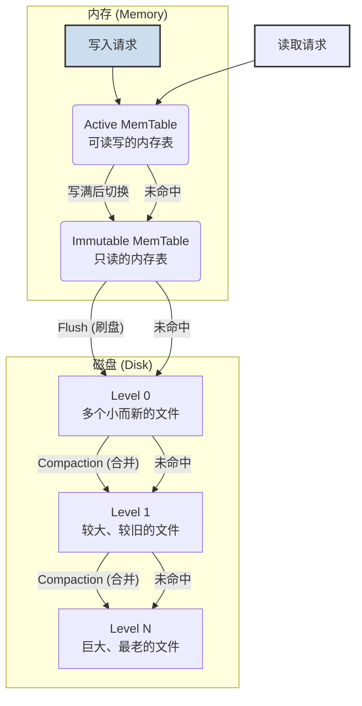
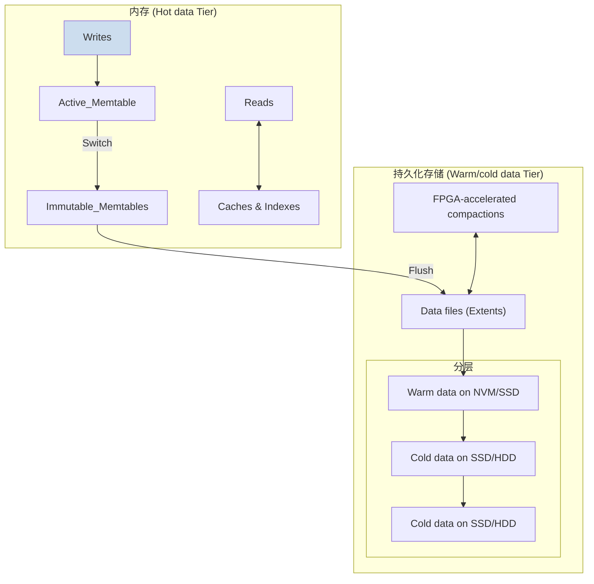
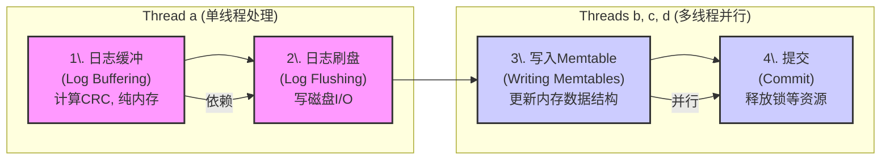
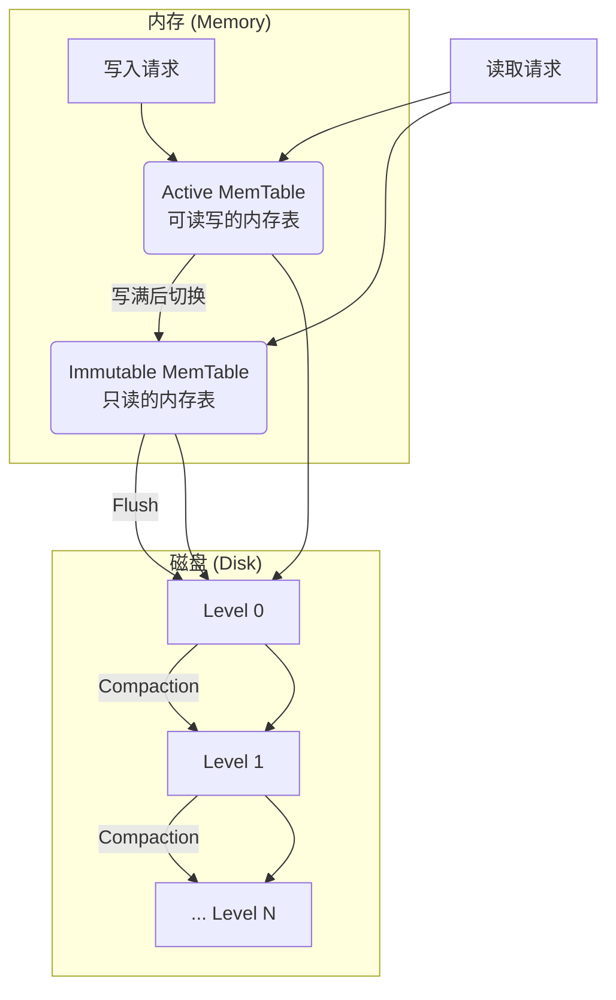
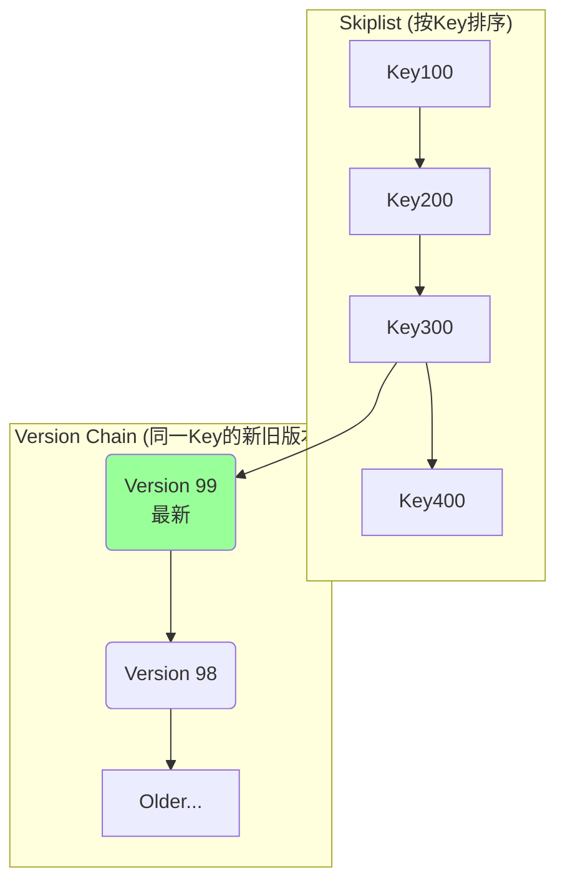
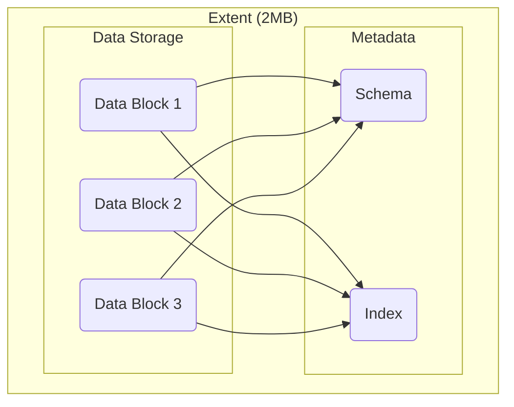

## AI论文解读 | X-Engine: An Optimized Storage Engine for Large-scale E-commerce Transaction Processing
        
### 作者        
digoal        
        
### 日期        
2025-07-19       
        
### 标签        
PostgreSQL , PolarDB , DuckDB , AI , 论文解读        
        
----        
        
## 背景  
      
https://users.cs.utah.edu/~lifeifei/papers/sigmod-xengine.pdf        
  
      
提示:        
```        
读懂《X-Engine: An Optimized Storage Engine for Large-scale E-commerce Transaction Processing》这篇论文需要提前掌握哪些基础知识, 请使用中文给我讲一下这些基础知识, 尽量通熟易懂, 可以使用markdown支持的图形增加解释性.        
        
使用中文通熟易懂的解读《X-Engine: An Optimized Storage Engine for Large-scale E-commerce Transaction Processing》这篇论文, 关键内容请深入讲解, 可以使用markdown支持的图形增加解释性.        
        
使用中文提取《X-Engine: An Optimized Storage Engine for Large-scale E-commerce Transaction Processing》论文中一些重要的术语并详细解释, 可以使用markdown支持的图形示增加解释性.        
```        
        
## 1 前置知识 
  
好的，为了完全理解《X-Engine》这篇论文，你需要了解一些数据库和计算机系统领域的核心基础知识。我会用通俗易懂的语言，并辅以图表来解释这些概念。

这篇论文的核心是介绍阿里巴巴为应对大规模电子商务交易而设计的一款名为 **X-Engine** 的**存储引擎**。所以，我们的知识体系将围绕“存储引擎”这个核心展开。

-----

### 1\. 什么是数据库存储引擎 (Storage Engine)？

想象一下数据库是一个巨大的、管理有序的图书馆，而存储引擎就是这个图书馆的**图书管理员和仓库管理系统**。

  * **数据库管理系统 (DBMS)**，比如我们熟知的 MySQL，它更像图书馆的馆长。馆长负责对外接待读者（接收SQL查询）、理解读者的需求（解析SQL）、规划去哪里找书（查询优化）。
  * **存储引擎 (Storage Engine)** 则是负责具体工作的图书管理员。它决定了：
      * **书（数据）如何摆放在书架（磁盘）上**：是按字母顺序、按类别，还是按最新上架的顺序？（数据物理存储结构）
      * **如何快速找到一本书**：是通过索引卡片，还是逐个书架寻找？（索引机制）
      * **有人借书和还书时如何登记**：如何确保多个人同时借阅不会出错？（事务和并发控制）
      * **如何把新书上架**：新数据如何写入，旧数据如何更新？（写入和更新机制）
      * **如何整理仓库**：定期清理不再需要的旧书。（数据整理和回收）

MySQL 本身是一个框架，它允许替换不同的存储引擎。这篇论文中提到的 **InnoDB** 和 **RocksDB** 都是 MySQL 可以使用的著名存储引擎，而 **X-Engine** 则是阿里巴巴自研的、与它们对标的新选择。

### 2\. 核心数据结构：LSM-Tree (日志结构合并树)

这是理解 X-Engine 的**最最核心**的基础知识。传统的数据库存储引擎如 InnoDB 主要使用 B+树，它非常适合读操作，但在高并发写入场景下性能会遇到瓶颈。为了优化写入性能，很多现代存储引擎（包括 RocksDB 和 X-Engine）都采用了 LSM-Tree。

LSM-Tree 的核心思想是：**“写入快，读取慢一点没关系，我们有办法优化读取”**。

它的工作流程可以简化为以下几步：

1.  **写入内存 (MemTable)**：所有新的数据写入和更新操作，都首先被快速写入到内存中的一个数据结构里，我们称之为 **MemTable** (通常是跳表或红黑树)。因为写内存非常快，所以系统的写入吞吐量很高。
2.  **刷盘到L0 (Flush)**：当 MemTable 写满后，它会被“冻结”成一个只读的 **Immutable MemTable**，然后被完整地、顺序地写入到磁盘上，成为一个文件（通常称为 SSTable）。这些最新的文件位于磁盘的 **Level 0 (L0层)**。
3.  **分层合并 (Compaction)**：磁盘上的数据被组织成多层（Level 0, Level 1, Level 2, ...）。当某一层（比如L0）的文件数量或大小达到阈值时，存储引擎会启动一个后台任务，将这一层的数据与下一层（L1）的数据进行**合并 (Compaction)**。这个过程会：
      * 将多个文件合并成一个或多个更大的、有序的文件。
      * 清除掉被覆盖的旧数据或被标记为删除的数据。
      * 将合并后的结果写入下一层。

下面是一个LSM-Tree工作原理的简化图：



**关键优缺点:**

  * **优点**:
      * **极高的写入性能**：将随机写转换为了内存中的操作和磁盘上的顺序写，效率极高。
  * **缺点**:
      * **读放大 (Read Amplification)**：一次读取可能需要查询内存中的 MemTable，以及磁盘上从 L0 到 LN 的每一层，直到找到数据为止，这会放大读取的成本。
      * **写放大 (Write Amplification)**：一份数据在从内存写入L0，再到L1、L2...的合并过程中，会被反复读取和重写多次。
      * **空间放大 (Space Amplification)**：因为旧版本数据需要等合并时才清理，所以磁盘上会同时存在多个版本的数据，占用更多空间。

X-Engine 的很多优化，比如多版本元数据索引、数据复用等，都是为了缓解 LSM-Tree 的这些缺点。

### 3\. 事务与并发控制 (Transaction & Concurrency)

  * **OLTP (联机事务处理)**：论文标题中提到的 "Transaction Processing" 指的就是这个。它描述了一种典型应用场景：大量用户同时在线，进行高频率的、短小的读写操作。例如，电商网站上的下单、查询库存、支付等。
  * **ACID**: 这是对事务的基本要求，保证数据库的可靠性。
      * **原子性 (Atomicity)**：事务要么全部成功，要么全部失败。比如转账，不能钱扣了但对方没收到。
      * **一致性 (Consistency)**：事务使数据库从一个有效的状态转变到另一个有效的状态。
      * **隔离性 (Isolation)**：多个并发事务之间互不干扰，感觉就像只有自己在操作数据库一样。
      * **持久性 (Durability)**：一旦事务提交，其结果就是永久性的，即使系统崩溃也不会丢失。
  * **MVCC (多版本并发控制)**：为了实现高效率的“隔离性”，X-Engine 采用了 MVCC。简单来说，就是不给数据上读锁。当修改数据时，它不是直接在原地修改，而是创建一个**新版本**的数据。这样，不同的事务可以根据它们开始的时间，去读取不同版本的数据，从而实现“读不阻塞写，写不阻塞读”的高并发效果。你在论文中看到的 `version`、`metasnapshot` 等概念都与此相关。

### 4\. 论文中提到的三大挑战 (Key Challenges)

理解了以上基础知识后，你就能明白论文中提出的三大挑战到底是什么了：

1.  **海啸问题 (The Tsunami Problem)**：指电商大促（如双十一）零点时，瞬间涌入海啸般的写入请求。这要求存储引擎具备极高的写入吞吐能力。LSM-Tree 的设计正是为了应对此问题，而 X-Engine 的**异步写入**、**多级流水线**等优化是进一步提升这种能力。
2.  **泄洪问题 (The Flood Discharge Problem)**：海量写入导致内存 (MemTable) 迅速塞满，数据必须高效地“泄洪”到磁盘中。这考验的是 LSM-Tree 的 `Flush` 和 `Compaction` 效率。如果泄洪不及时，内存就会被写爆。X-Engine 通过**FPGA加速合并**、**数据复用**等技术来优化这个过程。
3.  **激流问题 (The Fast-moving Current Problem)**：热点数据变化极快。上一分钟大家在抢购手机，下一分钟可能就在抢购化妆品。这意味着“热数据”会迅速变“冷”，而“冷数据”会迅速变“热”。这对**缓存系统**提出了巨大挑战，要求能快速地将冷数据（可能在磁盘深层）加载到缓存中。X-Engine 的**分层缓存**、**增量缓存替换**等设计就是为了解决这个问题。

### 5\. 其他相关概念

  * **分层存储 (Tiered Storage)**：将数据根据“热度”（访问频率）存放在不同性能和成本的硬件上。最热的数据在最快的内存里，温数据在SSD（固态硬盘），冷数据在HDD（机械硬盘）。这与 LSM-Tree 的分层结构天然契合。
  * **FPGA (现场可编程门阵列)**：一种可以被编程来执行特定任务的硬件芯片。它不像CPU那样通用，但执行特定任务（如论文中提到的数据合并`Compaction`）时，效率远超CPU。这是一种用硬件加速软件的思路。
  * **流水线 (Pipeline)**：将一个复杂的任务（如一次写入操作）分解成多个独立的阶段，让不同的硬件单元或线程可以并行处理不同任务的不同阶段，就像工厂的流水线一样，从而提高整体吞吐率。

-----

**总结一下，在阅读论文前，你需要重点掌握：**

1.  **存储引擎的基本职责**。
2.  **LSM-Tree 的核心工作原理**：写入内存、刷盘、分层合并，以及它的优缺点（特别是读写放大）。
3.  **OLTP 场景的特点**和**事务 (ACID, MVCC)** 的基本概念。

带着这些基础知识，你再去看论文中 X-Engine 的各种优化设计，比如异步写入、多级流水线、数据复用、FPGA加速、多版本元数据索引等，就会明白它们分别是为了解决 LSM-Tree 的哪个固有短板，以及应对哪个具体的业务挑战。祝你阅读顺利！
  
## 2 解读论文 
  
好的，我们来一起深入解读这篇重量级的数据库论文——《X-Engine: An Optimized Storage Engine for Large-scale E-commerce Transaction Processing》。

本文介绍了阿里巴巴为应对其全球最大规模电子商务平台的极端交易压力而设计的存储引擎——X-Engine 。这个平台服务着超过6亿用户，在2018财年的交易总额（GMV）就已超过7680亿美元 。

-----

### **核心背景：电商交易的三大挑战**

要理解X-Engine的设计精髓，首先必须理解它要解决的问题。论文作者将阿里巴巴电商平台面临的数据库挑战归纳为三个生动的比喻 ：

1.  **海啸问题 (The Tsunami Problem)**：

      * **现象**：在类似“双十一”这样的大型促销活动开始的瞬间（例如，零点整），交易请求量会发生“海啸般”的垂直飙升 。例如，在2018年双十一，数据库集群在活动开始的第一秒就承受了比前一秒高出122倍的交易量，峰值达到每秒49.1万笔销售交易，换算成数据库事务更是高达每秒7000多万次 。
      * **技术挑战**：存储引擎必须拥有极高的写入吞吐能力，以应对这种瞬时的、巨大的写请求洪峰，同时保持稳定的响应时间 。

2.  **泄洪问题 (The Flood Discharge Problem)**：

      * **现象**：大促期间会产生海量的订单、库存更新、支付记录等写入操作 。这些数据首先进入内存，但内存容量终究有限，很快就会被填满 。数据必须被高效、快速地从内存“泄洪”到永久性存储（如SSD/HDD）中 。
      * **技术挑战**：存储引擎需要高效地将数据从内存刷到磁盘，并进行整理（这个过程在LSM-tree中称为`Flush`和`Compaction`），以避免内存溢出。这个“泄洪”过程本身不能消耗过多的CPU和I/O资源，否则会反过来影响正常的交易处理 。

3.  **激流问题 (The Fast-moving Current Problem)**：

      * **现象**：电商场景中的“热点数据”变化极快 。比如，零点的“秒杀”活动让某些商品在几分钟内成为绝对热点，但活动一结束，它们立刻变“冷”；而下一个时段的促销又会催生新的热点商品 。
      * **技术挑战**：数据库的缓存系统必须能快速响应这种热点变化 。当一个“冷”数据（存储在磁盘深处）突然变“热”时，系统需要能以最快的速度将其检索出来并放入缓存；当热点过去后，又要能有效地将其替换出去，为新的热点数据腾出空间 。

### **X-Engine 的核心架构与设计**

为了应对上述三大挑战，X-Engine基于一种经过优化的 **LSM-tree (Log-Structured Merge Tree)** 结构，并采用了**分层存储**的理念 。

LSM-tree天然适合写密集型负载，因为它将随机写入转换为内存中的高速操作和磁盘上的顺序写入，这正是解决“海啸问题”和“泄洪问题”的理想起点 。

X-Engine的架构如下图所示，主要分为两大层：



  * **热数据层 (Hot data Tier)**：位于主内存中，包含一个活跃的`memtable`（接收实时写入）和多个不可变的`memtable`（等待刷盘），以及用于加速读取的各种缓存 。
  * **温/冷数据层 (Warm/cold data Tier)**：位于持久化存储（如NVM/SSD/HDD）上，数据被组织成多个层级（Level），以一种称为`Extent`的结构化单位存储 。

### **针对三大挑战的优化方案**

X-Engine的创新之处在于其一系列深度优化的设计。下表总结了各项优化所针对解决的问题 ：

| 优化措施                             | 核心思想                                               | 解决的挑战         |
| ------------------------------------ | ------------------------------------------------------ | ------------------ |
| **异步写入**与**多级流水线** | 将事务提交与实际写入解耦，并把写入过程分解为流水线阶段。 | **海啸问题** |
| **数据复用**与**FPGA加速合并** | 在数据整理时尽可能复用已有数据块，并将计算密集型任务卸载到硬件。 | **泄洪问题** |
| **多版本元数据索引**与**增量缓存替换** | 快速定位任意版本数据，并在数据整理时智能更新缓存，而非粗暴清空。 | **激流问题** |

-----

#### **深入讲解1：应对“海啸”的利器 —— 异步写入与多级流水线**

传统数据库处理事务时，通常是一个线程从头到尾负责一个事务，当需要写日志到磁盘时，线程必须等待I/O完成，这在高并发下效率低下 。

X-Engine采用了截然不同的方法：

1.  **异步写入 (Asynchronous Writes)**：一个处理事务的用户线程在完成逻辑操作后，不直接等待数据写入磁盘。它把写任务丢进一个任务队列中，然后就可以立即返回去处理下一个事务，大大提高了并发处理能力 。
2.  **多级流水线 (Multi-staged Pipeline)**：后台的写入任务被分解成一个四阶段的流水线，由专门的线程池来处理，实现了高度的并行和资源利用率 。

其流水线如下图所示：



  * **阶段1 & 3** 是计算密集型或内存访问密集型操作 。
  * **阶段2** 是I/O密集型操作 。
    通过将这些不同类型的操作分解到流水线的不同阶段，并为每个阶段分配合适数量的线程（例如，有依赖的前两步用单线程，可并行的后两步用多线程），X-Engine最大化了CPU和磁盘的利用率，实现了惊人的写入吞吐量 。实验表明，仅此一项优化就带来了11倍的写入性能提升 。

-----

#### **深入讲解2：疏导“泄洪”的智慧 —— 数据复用与硬件加速**

`Compaction`（合并）是LSM-tree的“阿喀琉斯之踵”，它会消耗大量CPU和I/O，导致性能抖动，是“泄洪”过程中的主要瓶颈 。

X-Engine通过以下方式巧妙地缓解了这个问题：

1.  **数据复用 (Data Reuse)**：传统的合并操作会读取两个层级中所有键范围重叠的数据，合并后全部重写 。X-Engine则做得更精细。它将数据组织成较小的`Extent`（论文中为2MB），在合并时，如果一个`Extent`的键范围没有与其它`Extent`重叠，那么系统**只需修改元数据指针指向它，而无需真正移动或重写它** 。

    下图展示了数据复用的一个例子 ：

    ```mermaid
    graph TD
        subgraph "合并前"
            L1["Level 1 Extents: [1,35], [80,200], [210,280]"]
            L2["Level 2 Extents: [1,30], [50,70], [100,130], [150,170], [190,205]"]
        end
        subgraph "合并后 (新 Level 2)"
            Merge1["Merge([1,35] & [1,30]) -> [1,35]"]
            Reuse1["Reuse -> [50,70]"]
            Merge2["Merge([80,200] & [100,130] etc.) -> [80,135], [180,205]"]
            Reuse2["Reuse -> [150,170]"]
            Reuse3["Reuse -> [210,280]"]
        end
        L1 --> Merge1;
        L1 --> Merge2;
        L1 --> Reuse3;
        L2 --> Merge1;
        L2 --> Reuse1;
        L2 --> Merge2;
        L2 --> Reuse2;

        style Reuse1 fill:#9f9
        style Reuse2 fill:#9f9
        style Reuse3 fill:#9f9
    ```

    在这个例子中，来自Level 2的 `[50,70]` 和 `[150,170]`，以及来自Level 1的 `[210,280]`，因为它们的键范围没有重叠，所以被直接“复用”，大大减少了不必要的I/O操作 。

2.  **FPGA加速合并 (FPGA-accelerated Compactions)**：对于那些无法避免的、计算密集的合并操作，X-Engine将其从宝贵的CPU资源中卸载到专门的FPGA硬件上执行 。这释放了CPU，使其能够专注于处理用户的前台事务，最终使整体吞吐量提升了27% 。

-----

#### **深入讲解3：驾驭“激流”的策略 —— 智能缓存与索引**

为了快速响应热点数据的剧烈变化，X-Engine优化了数据的索引和缓存机制。

1.  **多版本元数据索引 (Multi-version Metadata Index)**：X-Engine为整个数据库维护了一个带版本的元数据索引 。当`Flush`或`Compaction`发生时，它不修改旧的索引，而是通过“写时复制”（Copy-on-Write）技术创建一个指向新数据布局的**新版本**元数据快照 。这使得正在进行的读事务可以继续安全地访问旧版本的数据视图，而不会被后台操作干扰，保证了读取的稳定性和一致性 。

2.  **增量缓存替换 (Incremental Cache Replacement)**：传统的`Compaction`会使被合并数据的所有缓存失效，导致后续访问这些数据时出现大量缓存未命中，性能骤降 。X-Engine则采用增量替换策略：在合并过程中，如果一个数据块被更新了，系统会用新数据块**在原位置替换旧的缓存块**，而不是简单地将旧缓存全部删除 。这尽可能地保留了缓存的有效性，避免了性能的剧烈抖动 。

### **评估效果**

论文通过基准测试和模拟真实的电商负载，将X-Engine与业界主流的InnoDB和RocksDB进行了对比 。

  * 在模拟“双十一”的、读写混合且写操作比例非常高的场景下 (42%点查, 10%范围查, 32%更新, 16%插入)，**X-Engine的性能比InnoDB高出44%，比RocksDB高出31%**，并且表现出极高的稳定性 。
  * 在纯写入（Put）的键值（KV）测试中，X-Engine的吞吐量是RocksDB的**23倍** 。
  * 这些结果有力地证明了X-Engine的设计在应对极端电商交易负载方面的巨大优势 。

### **结论**

X-Engine是一项杰出的系统工程杰作。它深刻洞察了大规模电子商务交易的独特挑战，并基于LSM-tree架构，通过一系列软硬件协同的创新优化（如异步流水线、数据复用、FPGA卸载、智能缓存策略等），成功地打造了一款能够从容应对“海啸”、“泄洪”和“激流”三大挑战的高性能存储引擎，为阿里巴巴万亿级电商业务的稳定运行提供了坚实的基石 。
  
## 3 术语  
  
好的，这里是《X-Engine》论文中一些重要术语的中文解读，并配有详细解释和图示。

-----

### 1\. LSM-tree (Log-Structured Merge-Tree, 日志结构合并树)

LSM-tree是X-Engine架构的基石 。它是一种特殊的数据结构，旨在为写密集型应用提供极高的写入性能 。

  * **核心思想**: 将所有离散的、随机的写入操作（update, insert, delete）首先快速写入内存，然后将内存中的数据批量地、顺序地刷写到磁盘上。这种设计将昂贵的磁盘随机写转换为了高效的顺序写。
  * **工作流程**:
    1.  **写内存**: 新数据首先被写入内存中的 `Memtable` 。
    2.  **刷盘 (Flush)**: `Memtable`写满后，变为不可变的 `Immutable Memtable`，然后被作为一个完整的、有序的文件刷写到磁盘的第0层（Level-0）。
    3.  **合并 (Compaction)**: 当某一层（如Level-i）的数据达到一定规模时，后台线程会将其与下一层（Level-i+1）的数据进行归并排序，生成新的文件并写入下一层，同时清理掉旧版本或已删除的数据 。




-----

### 2\. Memtable (内存表)

`Memtable`是LSM-tree在内存中的核心组件，用于缓存最近的写入数据 。

  * **Active Memtable (活跃内存表)**: 正在接收新写入数据的内存表 。所有`insert`、`update`操作都直接写入这里。
  * **Immutable Memtable (不可变内存表)**: 当`Active Memtable`写满后，它会切换成`Immutable Memtable`，不再接收新的写入，并等待被`Flush`操作刷写到磁盘 。
  * **Multi-version Memtable (多版本内存表)**: X-Engine对`Memtable`进行了优化，对于同一个键（Key）的多次更新，会将多个版本的数据组织成一个垂直的链表。这样做的好处是，查询最新版本的数据时可以快速定位，无需遍历大量旧版本，这对于电商场景中热点商品的频繁更新尤为重要 。




-----

### 3\. Compaction (合并) 和 Flush (刷盘)

这两个是LSM-tree维持其结构和性能的两个关键后台操作。

  * **Flush (刷盘)**: 指的是将内存中的`Immutable Memtable`写入到磁盘`Level-0`的过程 。这是一个相对轻量的操作。
  * **Compaction (合并)**: 指的是将磁盘上一层的数据与下一层中键范围重叠的数据进行合并的过程 。这是一个非常消耗资源的操作，会占用大量CPU进行归并排序，并产生大量磁盘I/O 。它是LSM-tree性能抖动（Jitter）的主要来源，也是X-Engine重点优化的对象。

-----

### 4\. Extent (数据区)

`Extent`是X-Engine在磁盘上组织数据的基本物理单位，取代了传统LSM-tree中的SSTable概念 。

  * **结构**: 一个`Extent`通常大小为2MB ，内部包含了多个数据块（Data Blocks）、数据模式信息（Schema）和块索引（Block Index）。
  * **意义**: 采用固定大小且相对较小的`Extent`作为管理单元，极大地提高了在`Compaction`过程中\*\*数据复用(Data Reuse)\*\*的可能性 。如果一个`Extent`的数据范围与其他待合并的数据不重叠，就可以直接复用，只需修改元数据指针，而无需重写整个文件，从而显著降低`Compaction`的开销 。




-----

### 5\. 三大问题 (The Three Problems)

这是论文定义的核心业务挑战，驱动了X-Engine的设计。

  * **海啸问题 (The Tsunami Problem)**: 指的是在电商大促（如双十一）零点时，交易请求量瞬间出现上百倍的垂直增长 。这要求存储引擎具备极高的峰值写入吞吐能力。
  * **泄洪问题 (The Flood Discharge Problem)**: 指的是在大促期间，海量写入数据迅速填满内存，系统必须能高效地将数据从内存“泄洪”到持久化存储中，考验的是`Flush`和`Compaction`的效率 。
  * **激流问题 (The Fast-moving Current Problem)**: 指的是电商热点商品变化极快，导致数据库中的数据“温度”（访问频率）在冷、暖、热之间迅速切换 。这要求存储引擎的缓存和索引机制能够快速适应这种变化。

-----

### 6\. 核心优化技术

  * **异步写入与多级流水线 (Asynchronous Writes & Multi-staged Pipeline)**:

      * **异步写入**: 事务提交时，处理线程只需将写任务放入队列即可返回，无需等待磁盘I/O完成，从而与物理写入过程解耦 。
      * **多级流水线**: 后台的写入任务被分解为**日志缓冲、日志刷盘、写入Memtable、提交**四个阶段 。不同阶段可以由不同线程并行处理，像工厂流水线一样最大化吞吐率 。

  * **数据复用 (Data Reuse)**: 在`Compaction`时，对键范围不重叠的`Extent`或`Data Block`进行元数据层面的重用，避免不必要的物理读写，是降低写放大的关键技术 。

  * **FPGA卸载 (FPGA Offloading)**: 将计算密集型的`Compaction`任务从通用CPU卸载到专用的FPGA硬件上执行 。这可以释放宝贵的CPU资源去处理前台用户事务，实现软硬件协同优化 。
  
## 参考        
         
https://users.cs.utah.edu/~lifeifei/papers/sigmod-xengine.pdf  
        
        
<b> 以上内容基于DeepSeek、Qwen、Gemini及诸多AI生成, 轻微人工调整, 感谢杭州深度求索人工智能、阿里云、Google等公司. </b>        
        
<b> AI 生成的内容请自行辨别正确性, 当然也多了些许踩坑的乐趣, 毕竟冒险是每个男人的天性.  </b>        
    
  
