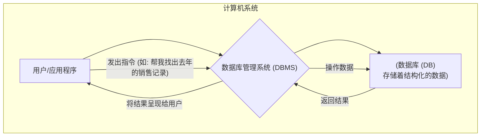
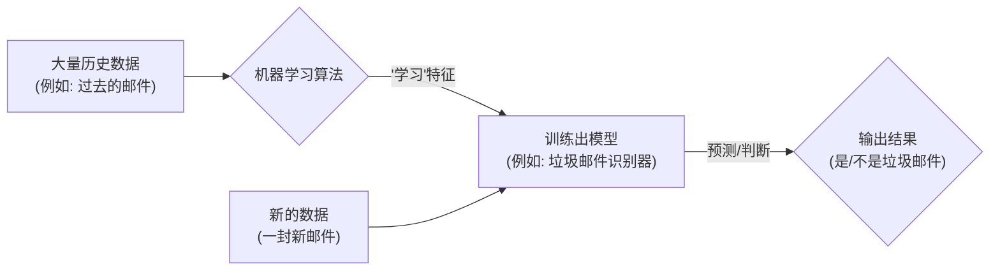
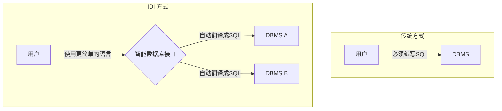
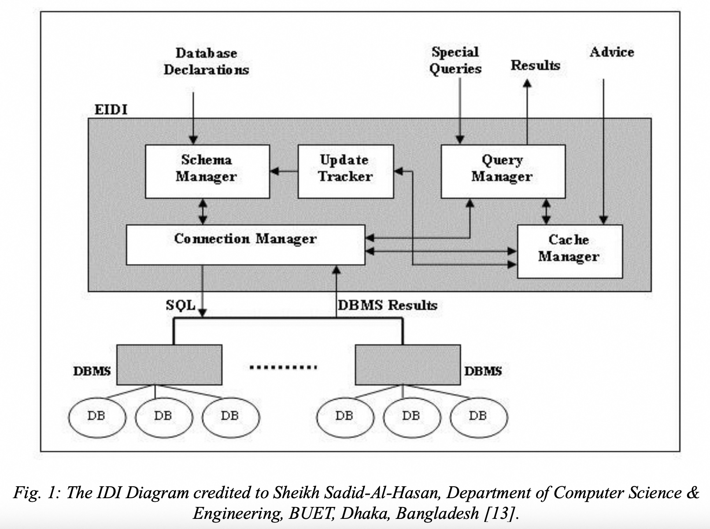
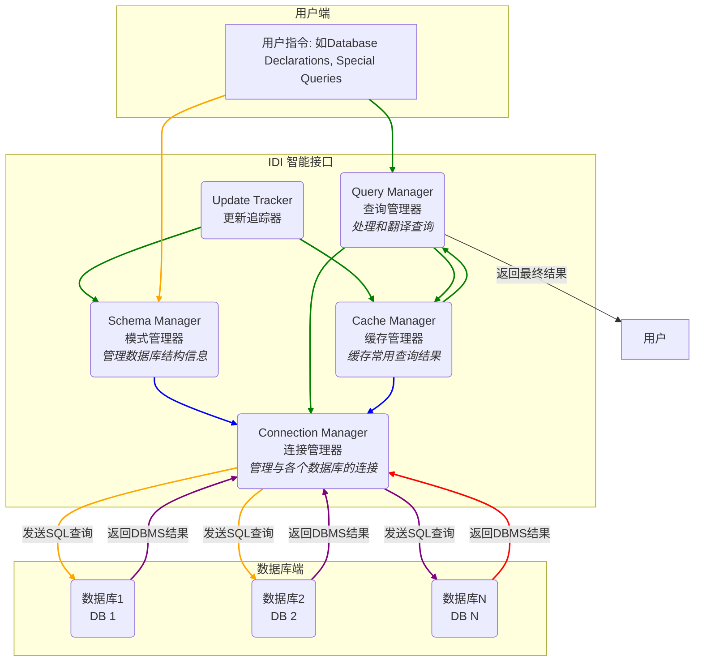
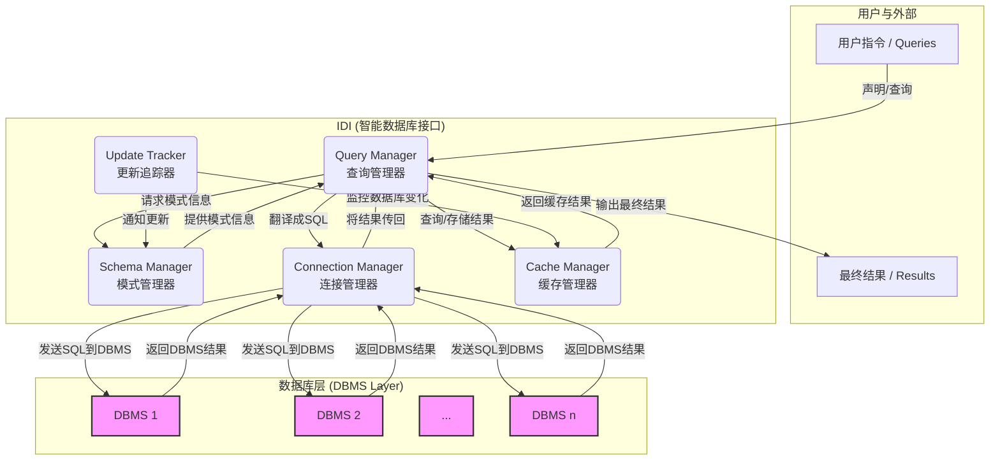
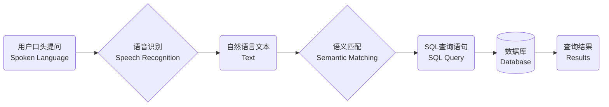

## AI论文解读 | THE INTEGRATION OF ARTIFICIAL INTELLIGENCE INTO DATABASE SYSTEMS (AI-DB INTEGRATION REVIEW)
        
### 作者        
digoal        
        
### 日期        
2025-07-19       
        
### 标签        
PostgreSQL , PolarDB , DuckDB , AI , 论文解读        
        
----        
        
## 背景  
      
https://ijcionline.com/paper/12/12623ijci12.pdf        
  
      
提示:        
```        
读懂《THE INTEGRATION OF ARTIFICIAL INTELLIGENCE INTO DATABASE SYSTEMS (AI-DB INTEGRATION REVIEW)》这篇论文需要提前掌握哪些基础知识, 请使用中文给我讲一下这些基础知识, 尽量通熟易懂, 可以使用markdown支持的图形增加解释性.        
        
使用中文通熟易懂的解读《THE INTEGRATION OF ARTIFICIAL INTELLIGENCE INTO DATABASE SYSTEMS (AI-DB INTEGRATION REVIEW)》这篇论文, 关键内容请深入讲解, 可以使用markdown支持的图形增加解释性.        
        
使用中文提取《THE INTEGRATION OF ARTIFICIAL INTELLIGENCE INTO DATABASE SYSTEMS (AI-DB INTEGRATION REVIEW)》论文中一些重要的术语并详细解释, 可以使用markdown支持的图形示增加解释性.        
```        
        
## 1 前置知识 
  
好的，为了完全理解这篇关于人工智能（AI）与数据库系统集成的论文，您需要对几个核心领域有一个基本的认识。这些知识可以分为三大块：**数据库基础**、**人工智能基础**，以及两者**交叉领域**的特定概念。

下面我将用通俗易懂的语言，并配合图表来解释这些基础知识。

### 1\. 数据库基础知识 (Database Fundamentals)

想象一个巨大的、管理有序的电子化仓库，这个仓库就是“数据库”。它的工作是安全、高效地存储和管理海量数据。

#### 什么是数据库 (Database) 和数据库管理系统 (DBMS)?

  * **数据库 (DB)**: 就是存放数据的仓库。数据在里面不是随意堆放的，而是按照一定的规则（比如按类型、按时间）整齐地排列好 。
  * **数据库管理系统 (DBMS)**: 是管理这个仓库的软件系统 。它负责处理所有指令，比如你要存入新数据、取出旧数据、修改数据或删除数据，DBMS 都会帮你完成，并确保数据的安全和准确 。常见的 DBMS 有 MySQL, Oracle, SQL Server 等。

它们的关系可以用下图表示：



#### 什么是查询 (Query) 和 SQL？

  * **查询 (Query)**: 就是你向数据库“提问”或下达指令的过程 。例如，“找出所有价格高于100元的商品”。
  * **SQL (Structured Query Language, 结构化查询语言)**: 是我们与数据库沟通时使用的“标准语言” 。DBMS 能听懂 SQL，所以我们需要把我们的问题翻译成 SQL 语句，DBMS 才能执行操作 。

**例子**:

  * **你的想法**: "从‘员工’表中，找出所有‘销售部’的员工姓名"
  * **SQL 语句**: `SELECT 姓名 FROM 员工 WHERE 部门 = '销售部';`

#### 什么是数据库模式 (Schema)？

  * **模式 (Schema)**: 是数据库的“蓝图”或“结构设计图” 。它定义了数据是如何组织的，包括有哪些表、每个表里有哪些列（字段）、每个列存储什么类型的数据（如文字、数字、日期）等 。这就像是仓库的设计图纸，规定了哪个区域放哪类货物。

### 2\. 人工智能基础知识 (Artificial Intelligence - AI)

人工智能的目标是让机器像人一样思考和学习 。它包含了很多分支技术，论文中主要提到了以下几种：

#### 什么是机器学习 (Machine Learning - ML)？

  * **机器学习**: 是 AI 的一个核心分支，它不是让机器遵循死板的编程指令，而是让机器从大量数据中“学习”出规律和模式 。就像人可以通过做很多练习题来学会解题一样，机器通过“看”海量数据来提升完成任务的能力 。

一个典型的学习流程如下：



  * **强化学习 (Reinforcement Learning)**: 是机器学习的一种。想象一下训练宠物：当它做对一个动作（比如“坐下”），你就给它奖励（零食）；做错了就没有奖励。久而久之，它就知道如何做出能获得最大奖励的行为了 。强化学习就是让机器在不断地“尝试”与“获得反馈（奖励或惩罚）”中，学会如何做出最佳决策 。

#### 什么是自然语言处理 (Natural Language Processing - NLP)？

  * **NLP**: 专注于让计算机能够理解和处理人类的日常语言（如中文、英文）。它的目标是打破人与机器之间的语言障碍，让你能用说话或打字的方式，轻松地与机器交流 。Siri、小爱同学等语音助手就是 NLP 技术的典型应用。

#### 什么是神经网络 (Neural Networks) 和深度学习 (Deep Learning)？

  * **神经网络**: 是模仿人类大脑神经元网络结构的一种算法模型 。它由许多相互连接的“节点”（神经元）组成，用于识别复杂数据中的模式，比如图像识别和语音识别 。
  * **深度学习**: 就是使用非常复杂、层次非常“深”的神经网络进行学习 。层次越深，它能学习到的模式就越抽象、越高级。

### 3\. AI 与数据库交叉领域的核心概念

理解了以上基础后，就能看懂论文中提到的AI与数据库如何“联姻”了。

#### 智能数据库接口 (Intelligent Database Interface - IDI)

  * 这是一个更聪明的“中间人” 。传统的你必须用 SQL 跟数据库打交道，而 IDI 允许你用更自然的方式（比如它自己的一套语言，甚至是自然语言）提问，然后由它在后台负责翻译成 SQL，并发送给正确的数据库去执行 。它还能同时连接和管理多个不同的数据库 。




#### 可学习数据库 (Learnable Database)

  * 这是一种能“自我进化”的数据库 。它利用机器学习技术，分析过去执行过的查询任务和数据使用情况，然后自动调整自己的内部设置（如参数配置、数据存储方式等），从而让未来的查询变得更快、更高效 。它不是一个死板的系统，而是一个能从经验中学习并不断优化的智能系统 。

#### 智能查询 (Smart Query)

  * 这是指利用 AI 技术（尤其是 NLP）来改进查询过程 。最终目标是让不了解 SQL 的普通用户，可以直接用日常说话的方式（比如“帮我查一下上个季度哪个产品的销量最高？”）来查询数据库 。系统会自动将这句话“听懂”，并转换成精确的 SQL 语句去执行 。

#### 自主数据库 (Autonomous Database)

  * 这是集大成的终极形态。一个“无人驾驶”的数据库 。它利用 AI 全面自动化所有管理任务，包括：
      * **自我修复和更新**: 自动安装补丁、升级版本，无需人工干预 。
      * **自我安全防护**: 自动检测并防御黑客攻击 。
      * **自我性能调优**: 自动调整配置，永远保持最佳运行性能，无需数据库管理员（DBA）手动优化 。

总之，要读懂这篇论文，您需要先了解数据库是如何工作的（DBMS、SQL），再了解 AI 的基本能力（机器学习、NLP），最后将两者结合，理解论文中探讨的各种“智能化”数据库技术是如何利用 AI 来让传统数据库变得更强大、更易用、更无需人工维护的。
  
## 2 解读论文 
  
好的，我们来一起用通俗易懂的方式，深入解读这篇关于人工智能（AI）与数据库（DB）集成的学术论文。

### **一文读懂：AI如何让数据库变得更聪明？**

**——深度解读《人工智能与数据库系统集成评论》**

简单来说，这篇论文探讨的是一个核心话题：**如何将人工智能（AI）技术融入传统的数据库系统，让数据库从一个只会死板存储数据的“仓库”，进化成一个能理解、会学习、懂优化的“智能管家”** 。这种结合不仅能提升现有技术，更是未来智能信息系统和高效工作的基石 。

-----

### **核心思想：为何要让AI与数据库“联姻”？**

想象一下，数据库里存着海量数据，比如“0, 20, 46, 09” 。这串数字本身毫无意义。只有通过分析和处理，它才能变成有价值的信息，比如一个电话号码或日期 。传统数据库就像一个巨大的文件柜，你必须使用一种非常精确、死板的语言（比如SQL）才能找到你想要的东西。

而AI的加入，就是要彻底改变这种状况。AI，特别是其包含的**机器学习 (Machine Learning)**、**自然语言处理 (NLP)** 和**神经网络 (Neural Networks)** 等技术，能够赋予数据库思考和学习的能力 。

  * **机器学习 (ML)**：让数据库能从历史操作数据中学习，自动优化性能 。
  * **自然语言处理 (NLP)**：让用户可以用日常说话的方式（比如“帮我找找上个月销售额最高的产品”）来查询数据，而不需要懂复杂的编程语言 。
  * **神经网络 (Neural Networks)**：模仿人脑结构，让数据库能够识别复杂的数据模式，进行预测和异常检测 。

最终目标是：**让数据管理和分析变得更强大、更智能、更自动化** 。

-----

### **四大关键技术方向**

论文重点介绍了AI赋能数据库的四个核心技术方向，我们可以把它们理解为实现“智能数据库”的四条主要路径。

#### **1. 智能数据库接口 (Intelligent Database Interface - IDI) 🗣️**

**这是什么？**
IDI可以被理解为一个**聪明的“中间层”或“总调度员”** 。它位于用户和多个远程、异构的数据库（DBMS）之间，帮助用户用一种统一、简单的方式访问这些复杂的数据库 。

**它如何工作？**
用户通过IDI的专用语言下达指令，IDI会智能地将其**翻译成标准SQL语言**，然后发送给正确的数据库进行处理，最后将来自不同数据库的结果汇总返回给用户 。

为了更好地理解，我们可以看一下它的内部结构图（根据论文Fig. 1简化解释）：   



  * **核心优势**：让用户无需关心底层数据库的差异，实现对多个数据库的无缝、高效访问 。

-----

#### **2. 可学习数据库 (Learnable Database) 🧠**

**这是什么？**
这是一种能够**自我进化和优化**的数据库 。它利用机器学习技术，从过去的查询记录和数据模式中学习，从而自动调整自己，以达到更高的效率 。

**它如何学习和优化？**

  * **自动参数配置 (Configuration of Database Parameter)**：传统的数据库有大量复杂的配置参数，需要专家手动调整。可学习数据库能分析工作负载，自动找到最优的参数组合，就像一个经验丰富的技师在不断地微调发动机，让它时刻保持最佳状态 。
  * **智能查询优化 (Database Query Optimization)**：当收到一个查询请求时，传统数据库会按照固定的规则去执行。而可学习数据库会分析历史记录，学习哪种执行路径最快，从而动态地选择最佳查询方案 。IBM的内部测试甚至发现，这种优化能让某些查询速度提升10倍 。
  * **SQL重写 (SQL rewriter)**：AI可以分析用户的SQL查询语句，自动重写成一个逻辑上等价但执行效率更高的版本，比如移除不必要的操作 。

-----

#### **3. 智能查询 (Smart Query) 💬**

**这是什么？**
智能查询的核心目标是**让数据库“听懂人话”** 。它利用自然语言处理（NLP）技术，允许非技术用户直接用自然语言（如中文、英文）进行查询，而无需学习复杂的SQL语法 。

**它如何工作？**

1.  **语音转文本**：首先通过语音识别技术，将用户的口头提问转换成文字 。
2.  **语义匹配**：然后，系统会运用语义匹配技术，将这些自然语言文字“翻译”成数据库能理解的SQL查询语句 。这个过程通常会借助一个包含大量语义规则和词汇的字典来完成 。

**挑战**：尽管前景美好，但这项技术目前仍处于实验阶段，在处理复杂或模糊的查询时，系统还很容易“犯晕” 。

-----

#### **4. 自治数据库 (Autonomous Database) 🤖**

**这是什么？**
这是AI与数据库集成的**终极形态**——一个完全**无需人工干预**，能够自我管理、自我修复、自我保障安全的“全自动数据库” 。

**以Oracle 18c为例**：
论文提到了Oracle公司的自治数据库作为例子。它宣称可以实现：

  * **无人工劳动 (No Human Labor)**：数据库能自动完成打补丁、升级和性能调优等所有维护工作 。
  * **无人工错误 (No Human Error)**：通过自动化减少人为失误，保证99.995%的极高可用性 。
  * **无手动性能调优 (No Manual Performance Tuning)**：利用机器学习自动进行压缩和调优，从而降低成本 。

**局限性**：论文也指出了这种模式的挑战，比如它目前主要在云端环境实现 。对于部署在企业内部（on-premises）的数据库，由于硬件和网络环境复杂，且存在数据安全和隐私的顾虑，实现完全自治仍有很长的路要走 。

-----

### **AI数据库 vs. 传统数据库：一图看懂差异**

论文提供了一个清晰的对比表格，总结了AI赋能数据库的核心优势：

| **方面 (Aspect)** | **传统数据库 (Traditional DB)** | **AI赋能数据库 (AI-Powered DB)** |
| :--- | :--- | :--- |
| **数据存储与检索** | 基于固定的结构和查询语言（SQL） | 支持非结构化数据，并使用自然语言(NLP)进行查询  |
| **查询优化** | 使用传统的、基于规则的优化技术 | 利用机器学习进行动态优化，持续提升性能  |
| **实时洞察** | 实时数据处理能力有限 | 能够进行实时数据处理，即时提供洞察  |
| **可伸缩性** | 扩展复杂，可能需要手动干预 | 提供自动伸缩能力，高效应对数据增长  |
| **自然语言接口** | 通常不具备 | 集成了NLP，允许使用日常语言进行直观查询  |

-----

### **结论与未来展望 🚀**

**总结**：
这篇论文系统地回顾了AI与数据库集成的几个关键领域，特别是**智能数据库接口（IDIs）、可学习数据库和智能查询** 。这些技术的融合，正在彻底改变我们与数据交互的方式，潜力巨大。

**未来**：

  * **更友好的接口**：AI驱动的界面将变得更加直观，让非技术人员也能轻松地操作数据 。
  * **更强的自适应能力**：数据库将能根据用户行为自我调整，变得越来越“懂你” 。
  * **完全自治**：最终将实现能够自我监控、调优和修复的全自治数据库，大大降低运维成本和停机时间 。

**挑战**：
当然，这条路也伴随着挑战，比如如何保障**数据隐私**、解决**算法伦理**问题，以及培养能够驾驭这些高级系统的**专业人才** 。

总而言之，AI与数据库的结合是一场深刻的技术革命，它将解锁数据的无限潜能，引领我们进入一个更加智能、高效的数据驱动世界 。
  
## 3 术语  
  
好的，这是从《THE INTEGRATION OF ARTIFICIAL INTELLIGENCE INTO DATABASE SYSTEMS (AI-DB INTEGRATION REVIEW)》这篇论文中提取的关键术语及其详细解释，并配有图形化说明。

-----

### **论文核心术语详解**

本文深入探讨了多个旨在将人工智能与数据库系统融合的关键技术和概念。

#### **1. 人工智能与数据库集成 (AI-DB Integration)**

  * **定义**: 指的是将人工智能（AI）技术与传统数据库系统相结合的过程 。
  * **目的**: 其核心目标是增强数据处理、分析和决策的能力 。通过这种集成，可以实现高级数据分析、实时处理和预测功能，从而提升数据库系统的价值和效率 。这种协同作用使组织能够从其数据中提取有价值的见解，最终在各个领域推动创新和竞争力 。

#### **2. 智能数据库接口 (Intelligent Database Interface - IDI)**

  * **定义**: 一个交互式的、兼容性强的用户界面，旨在为用户提供访问多个远程数据库管理系统（DBMS）的高效途径 。
  * **核心功能**: IDI拥有自己独特的查询语言IDIL，它能将IDIL查询翻译成标准的SQL语言，然后将这些SQL查询导向正确的DBMS 。
  * **系统架构**: IDI主要由以下几个协同工作的组件构成 ：




  * **组件详解**:
      * **模式管理器 (Schema Manager - SM)**: 负责处理数据库的声明，存储已声明数据库的模式（结构）信息，并管理可能存在的表名冲突问题 。
      * **DBMS连接管理器 (DBMS Connection Manager - DCM)**: 管理与所有远程数据库的连接，包括处理打开和关闭连接的请求 。
      * **查询管理器 (Query Manager - QM)**: 负责处理IDIL查询，通过连接管理器的协助将其翻译成SQL，并在DBMS成功执行后返回结果 。
      * **缓存管理器 (Cache Manager - CM)**: 负责管理查询结果的缓存 。它能识别哪些查询的结果已经存在于缓存中，从而加速响应 。它与更新追踪器（Update Tracker）协同工作，以确保缓存数据的有效性 。

#### **3. 可学习数据库 (Learnable Database)**

  * **定义**: 一种能够利用人工智能技术，特别是机器学习（ML），使自身变得更加智能和自适应的数据库 。
  * **核心能力**: 它能够根据历史数据或当前的查询工作负载，本能地进行自我改进 。它可以通过机器学习来描绘数据的各种特征，并选择最有效的模型来改进DBMS 。
  * **关键应用领域**:
      * **数据库查询优化 (Database Query Optimization)**: 将机器学习应用于查询优化，可以学习历史数据，从而改变传统的查询优化方法，并为查询推荐最佳路径 。
      * **数据库参数配置 (Database Parameter Configuration)**: 旨在利用AI技术来自动化数据库的配置和功能，以提高性能和效率 。

#### **4. 智能查询 (Smart Query)**

  * **定义**: 一种新兴技术，旨在让非专业用户能以更自然的方式查询传统的关系型数据库 。其核心是让机器能够“听懂人话”并与之交互 。
  * **核心技术**: 智能查询的实现严重依赖于**自然语言处理（NLP）的一个分支，即数据库的自然语言接口（NLIDB）** 。这使得用户可以用自然语言来提出查询，而无需具备编程知识 。
  * **工作流程**:




  
*这个过程具体包括：*
1.  *采用语音识别技术将口语输入转换为文本 。*
2.  *然后，采用语义匹配技术将自然语言查询转换为SQL词汇 。*
3.  *这个过程通常由一个字典和一套生产规则来辅助完成 。*
  

#### **5. 自治数据库 (Autonomous Databases)**

  * **定义**: 指已安装和运行的数据库的维护、更新、升级和安全都将自动完成的理念 。甚至更复杂的性能调优也将实现自动化 。
  * **产生背景**: 随着社会和工业的数字化，已安装的数据库实例数量急剧增加，导致管理变得异常复杂且昂贵 。在云环境中，数据库实例太多而经验丰富的人员太少，自治数据库因此成为解决这一问题的方向 。
  * **核心特征 (以Oracle 18c为例)**:
      * **无人工劳动 (No Human Labor)**: 数据库在运行时能自动升级、打补丁和调优 。
      * **无人工错误 (No Human Error)**: 服务等级协议（SLA）保证99.995%的可靠性和可用性，将停机时间降至最低 。
      * **无手动性能调优 (No Manual Performance Tuning)**: 由于机器学习和自动压缩，数据库消耗更少的计算和存储资源 。
  
## 参考        
         
https://ijcionline.com/paper/12/12623ijci12.pdf  
        
        
<b> 以上内容基于DeepSeek、Qwen、Gemini及诸多AI生成, 轻微人工调整, 感谢杭州深度求索人工智能、阿里云、Google等公司. </b>        
        
<b> AI 生成的内容请自行辨别正确性, 当然也多了些许踩坑的乐趣, 毕竟冒险是每个男人的天性.  </b>        
    
  
  
  
#### [期望 PostgreSQL|开源PolarDB 增加什么功能?](https://github.com/digoal/blog/issues/76 "269ac3d1c492e938c0191101c7238216")
  
  
#### [PolarDB 开源数据库](https://openpolardb.com/home "57258f76c37864c6e6d23383d05714ea")
  
  
#### [PolarDB 学习图谱](https://www.aliyun.com/database/openpolardb/activity "8642f60e04ed0c814bf9cb9677976bd4")
  
  
#### [PostgreSQL 解决方案集合](../201706/20170601_02.md "40cff096e9ed7122c512b35d8561d9c8")
  
  
#### [德哥 / digoal's Github - 公益是一辈子的事.](https://github.com/digoal/blog/blob/master/README.md "22709685feb7cab07d30f30387f0a9ae")
  
  
#### [About 德哥](https://github.com/digoal/blog/blob/master/me/readme.md "a37735981e7704886ffd590565582dd0")
  
  

  
