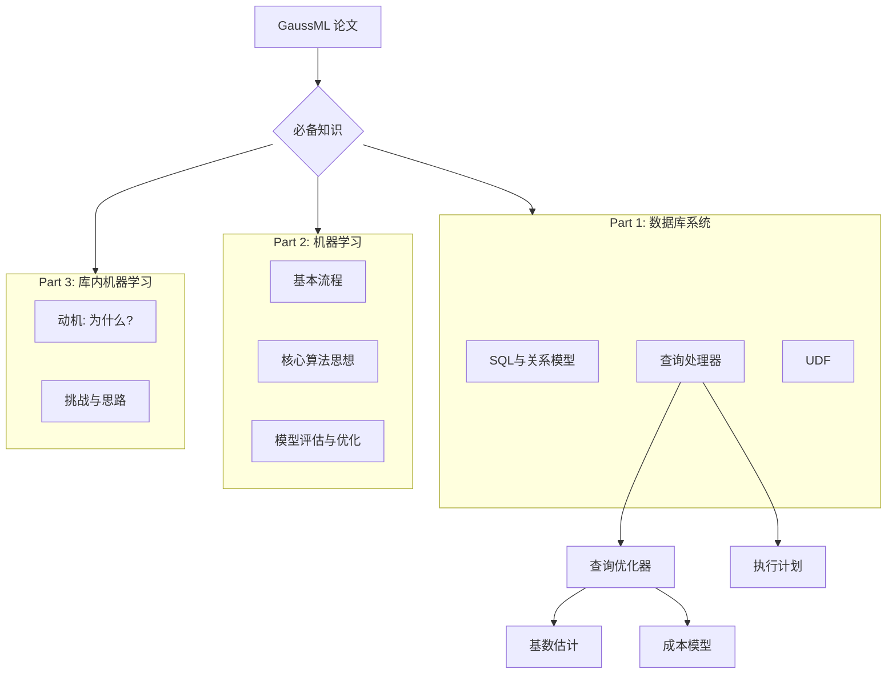
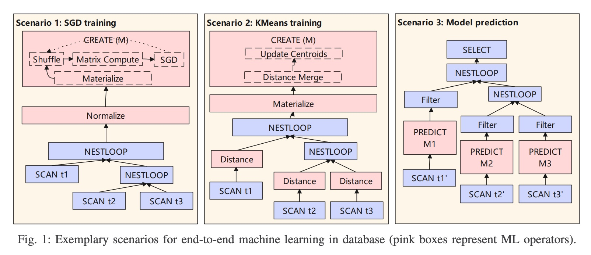
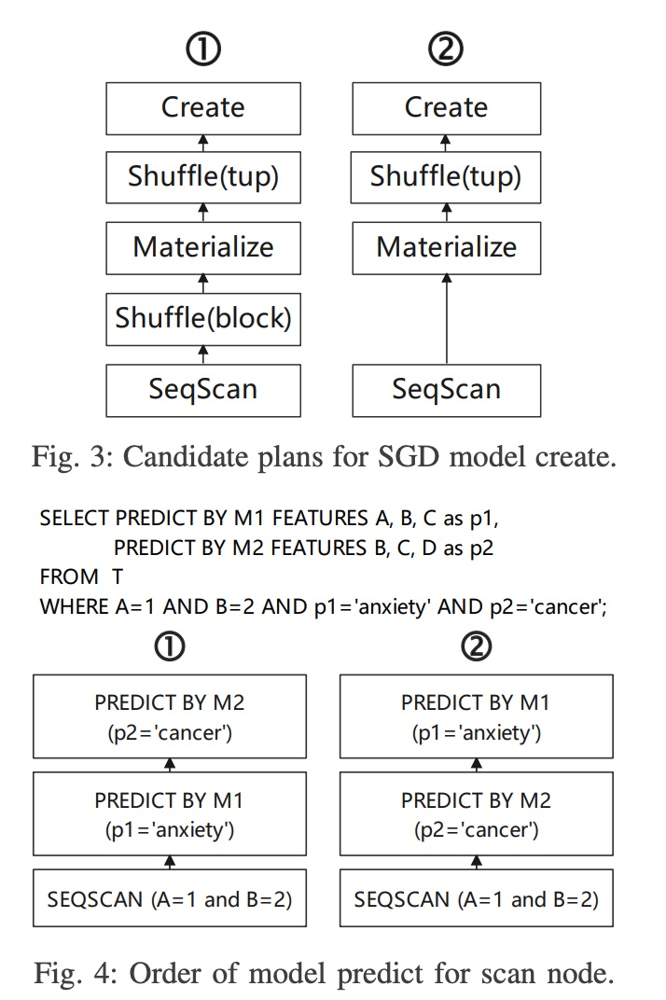
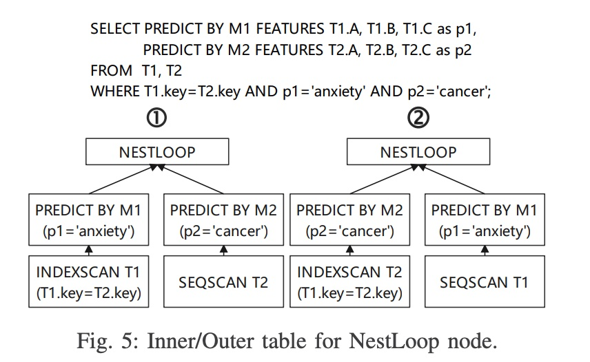
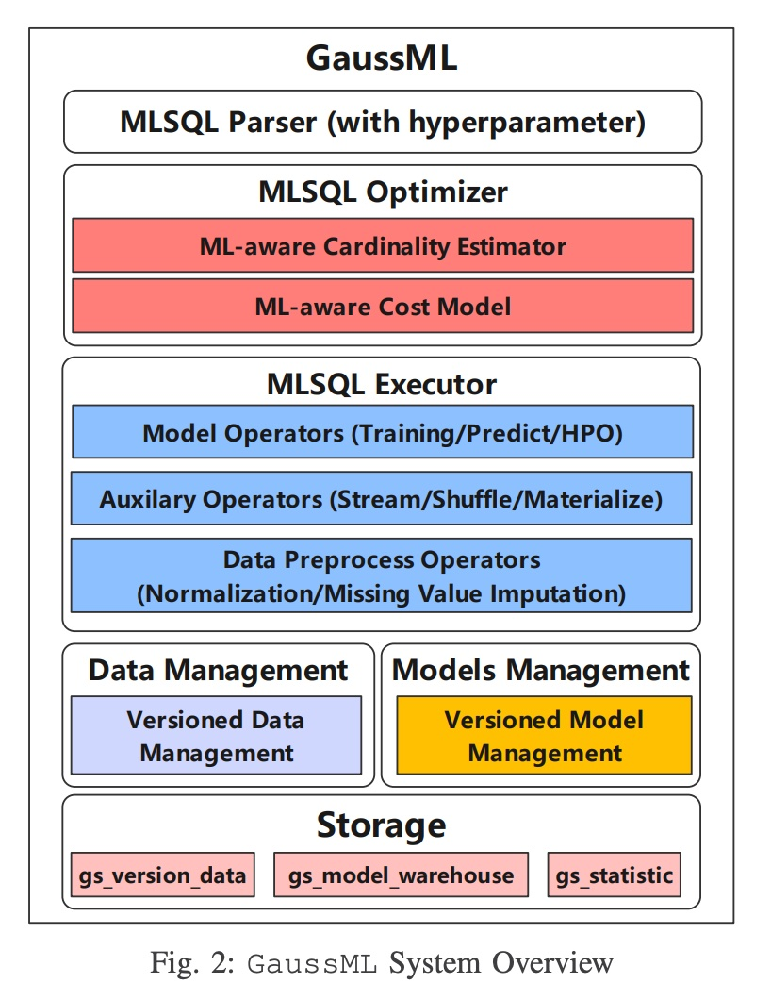
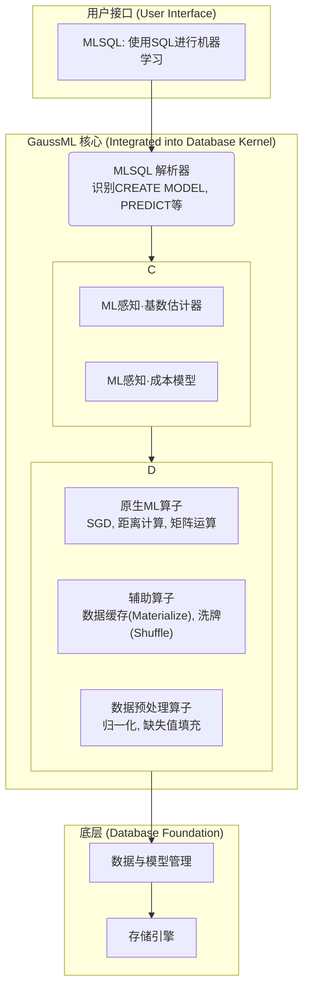
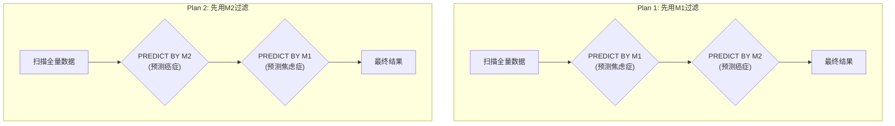

## AI论文解读 | GaussML: An End-to-End In-Database Machine Learning System
        
### 作者        
digoal        
        
### 日期        
2025-07-19       
        
### 标签        
PostgreSQL , PolarDB , DuckDB , AI , 论文解读        
        
----        
        
## 背景  
      
https://dbgroup.cs.tsinghua.edu.cn/ligl/papers/GaussML_ICDE.pdf        
  
      
提示:        
```        
读懂《GaussML: An End-to-End In-Database Machine Learning System》这篇论文需要提前掌握哪些基础知识, 请使用中文给我讲一下这些基础知识, 尽量通熟易懂, 可以使用markdown支持的图形增加解释性.        
        
使用中文通熟易懂的解读《GaussML: An End-to-End In-Database Machine Learning System》这篇论文, 关键内容请深入讲解, 可以使用markdown支持的图形增加解释性.        
        
使用中文提取《GaussML: An End-to-End In-Database Machine Learning System》论文中一些重要的术语并详细解释, 可以使用markdown支持的图形示增加解释性.        
```        
        
## 1 前置知识 
  
好的，为了完全理解《GaussML: An End-to-End In-Database Machine Learning System》这篇论文，你需要具备三个领域的交叉知识：**数据库系统**、**机器学习**，以及二者结合产生的**库内机器学习**。

下面我将用通俗易懂的语言，为你讲解这些必备的基础知识。

-----

### 核心知识地图

为了读懂这篇论文，你需要了解的知识可以分为三个部分：

1.  **数据库系统基础**：理解数据是如何存储、管理和查询的。这是GaussML的“地基”。
2.  **机器学习基础**：理解模型是如何训练和使用的。这是GaussML要实现的功能。
3.  **交叉领域：库内机器学习**：理解为什么要把机器学习“搬”到数据库里，以及这样做的挑战。这是论文要解决的核心问题。




-----

### Part 1: 数据库系统 (Database Systems) 基础

这部分是理解GaussML如何与数据库“无缝集成”的关键。

#### 1.1 SQL与关系型数据库

  * **基本概念**：你需要知道关系型数据库（如PostgreSQL, MySQL）是以**表 (Table)** 的形式组织数据的。每张表由**行 (Row)** 和**列 (Column)** 构成。
  * **SQL (Structured Query Language)**：这是与数据库交互的语言。你至少需要熟悉最核心的查询语句 `SELECT ... FROM ... WHERE ... JOIN ...`。这篇论文中提出的`MLSQL`就是对标准SQL的扩展。

#### 1.2 数据库的“大脑”：查询处理器 (Query Processor)

当你向数据库发送一条SQL语句时，它并不是马上就执行。它会经过一个复杂的“思考”过程，这个过程由查询处理器完成。这恰恰是GaussML改造的核心。


  * **解析器 (Parser)**：将你写的SQL文本转换成数据库内部能理解的数据结构。
  * **优化器 (Optimizer)**：这是最重要的部分！对于同一条SQL，可能有成百上千种执行方式。优化器的任务就是**找出成本最低、效率最高**的那一种。
      * **执行计划 (Execution Plan)**：优化器产出的最终成果。它是一个由多个**算子 (Operator)** 组成的树状结构，描述了获取数据的具体步骤。常见的算子有 `SeqScan` (全表扫描), `IndexScan` (索引扫描), `NestLoop Join` (嵌套循环连接)等。论文中的图1和图3-5就展示了各种执行计划。    
      * **成本模型 (Cost Model)**：优化器如何判断哪个计划更好？它会根据一个成本模型来估算每个算子的“开销”（比如CPU和I/O消耗）。
      * **基数估计 (Cardinality Estimation)**：这是成本模型的基础。它负责估算一个操作（如`WHERE`过滤）后，会返回多少行数据。这个估算越准，优化器选择的执行计划就越好。论文的III-C节专门讨论了如何为ML预测做基数估计。
  * **执行器 (Executor)**：严格按照优化器给出的“执行计划”去操作数据，并返回最终结果。

#### 1.3 用户自定义函数 (UDF - User-Defined Function)

这是传统的在数据库里做机器学习的方式。你可以把它理解为允许你在SQL中调用一段外部代码（比如用Python写的函数）。

  * **优点**：灵活，可以快速实现复杂功能。
  * **论文指出的缺点**：
    1.  **性能瓶颈**：UDF对数据库优化器来说是个“黑盒子”。优化器不知道U.DF内部会做什么，也无法对其进行优化。
    2.  **安全风险**：UDF代码可能存在漏洞。
    3.  **数据移动开销**：数据需要在数据库和UDF执行环境（如Python进程）之间来回传递。

理解了UDF的局限性，你就能明白为什么GaussML要抛弃它，转而采用**原生算子 (Native Operator)** 的方式。

-----

### Part 2: 机器学习 (Machine Learning) 基础

这部分是理解GaussML实现了哪些功能，以及这些功能是如何工作的。

#### 2.1 机器学习基本流程

一个典型的机器学习任务包含以下几个步骤，论文中称之为`End-to-End Machine Learning`。


#### 2.2 核心算法思想

你不需要精通所有算法的数学细节，但需要了解它们的基本思想和分类。

  * **监督学习 (Supervised Learning)**：用带有“正确答案”（标签 Label）的数据进行训练。

      * **回归 (Regression)**：预测一个连续的数值。例如，根据房屋面积、位置等特征预测**房价**。论文中提到的算法有：线性回归 (Linear Regression)、支持向量机 (SVM)。
      * **分类 (Classification)**：预测一个离散的类别。例如，根据邮件内容判断是不是**垃圾邮件**。论文中提到的算法有：逻辑回归 (Logistic Regression)、XGBoost。

  * **无监督学习 (Unsupervised Learning)**：用没有“正确答案”的数据进行训练，让模型自己发现数据中的结构。

      * **聚类 (Clustering)**：将相似的数据点分到同一个“簇”里。例如，根据用户的购买行为，将他们分成不同的**客户群体**。论文中主要提到了K-Means算法。

  * **核心训练方法：梯度下降 (Gradient Descent)**
    这是一个非常核心的优化算法，很多模型的训练都依赖它。你可以把它想象成一个“下山”的过程：

    > 假设你站在一座山的山坡上，想尽快走到山谷的最低点。你的策略是：环顾四周，找到最陡的下坡方向，然后朝着这个方向走一小步。不断重复这个过程，最终你就能到达谷底。

    在机器学习中，“山坡”就是模型的误差函数，“位置”就是模型的参数，“谷底”就是让模型误差最小的最佳参数。论文中提到的**SGD (Stochastic Gradient Descent)** 是它的一种高效变体。

#### 2.3 模型评估与超参数优化 (HPO)

  * **模型评估**：如何判断一个模型的好坏？需要用一些指标来衡量，比如分类任务的**准确率 (Accuracy)**，回归任务的**均方误差 (MSE)**。
  * **超参数优化 (Hyperparameter Optimization, HPO)**：在训练模型之前，需要手动设置一些参数（比如学习率），这些被称为“超参数”。HPO就是自动寻找最佳超参数组合的过程，让模型效果最好。GaussML将其作为一个重要功能内置。

-----

### Part 3: 交叉领域: 库内机器学习 (In-Database Machine Learning)

这是连接前两部分知识的桥梁，也是论文的出发点和核心贡献所在。

#### 3.1 动机：为什么要在数据库里搞机器学习？

论文的引言部分详细阐述了这一点：

1.  **数据安全与隐私**：很多企业（如金融、政府）的核心数据极其敏感，不允许被复制出数据库。在数据库内部完成训练，可以避免数据泄露的风险。
2.  **减少数据移动开销**：将海量数据从数据库导出到专门的ML平台（如Python环境）进行训练，网络传输和数据格式转换都非常耗时。
3.  **统一的技术栈**：数据分析师通常更熟悉SQL。如果能用SQL完成从数据准备到模型训练的全过程，将大大降低使用门槛。

#### 3.2 挑战与GaussML的思路

  * **挑战**：如何让“精于数据管理”的数据库，高效地执行“精于计算”的机器学习任务？传统的UDF方式显然不够理想。
  * **GaussML的思路**：**深度融合**，而不是简单嫁接。
    1.  **原生ML算子**：将`SGD`、`Distance Compute`（距离计算）等ML核心计算步骤，实现为数据库原生的执行算子，就像`Join`和`Scan`一样。
    2.  **ML感知的查询优化**：因为ML操作变成了原生算子，数据库的优化器就能“理解”它们了。它可以估算一个`PREDICT`操作的成本和它能过滤掉多少数据（选择性），从而生成一个包含数据查询和模型预测的、全局最优的执行计划。这就是论文中“ML-aware cardinality and cost estimator”的意义所在。

### 总结

要读懂《GaussML》这篇论文，你可以按以下路径构建你的知识体系：

1.  首先，回顾一下**SQL**和**关系型数据库**的基本操作。
2.  然后，重点理解数据库的**查询优化器**是如何工作的，特别是**执行计划**、**成本模型**和**基数估计**的概念。这是理解GaussML技术创新的关键。
3.  接着，了解机器学习的**基本流程**（预处理、训练、推理）和几种核心算法的**基本思想**（如回归、分类、聚类和梯度下降）。
4.  最后，将这两部分知识结合起来，思考“**在数据库里做机器学习**”这个场景的**动机和挑战**。

当你掌握了这些基础后，再去看论文中具体的系统架构（图2）、执行计划示例（图3-5）以及各种优化技术（如SIMD、预取、shuffle），就会感到豁然开朗，能够真正欣赏其设计的精妙之处。    
  
## 2 解读论文 
  
好的，这篇《GaussML: An End-to-End In-Database Machine Learning System》论文介绍了一个名为GaussML的、深度集成在数据库内部的机器学习系统。下面我将为您进行通俗易懂的深入解读。

### 核心思想一句话总结

传统方法是把数据从“仓库”（数据库）搬到“工厂”（ML框架，如Python）去加工（训练模型），费时费力还不安全。GaussML则是直接在“仓库”里建了一个“智能工厂”，让数据足不出户就能完成从加工到分析的全过程，既快又安全。

-----

### 1\. 问题所在：为什么需要GaussML？

传统的机器学习流程通常是这样的：

1.  **数据导出**：数据科学家编写脚本，将海量数据从公司的核心数据库中导出。
2.  **数据转换**：将数据转换成Python等环境可以处理的格式（如CSV文件或Pandas DataFrame）。
3.  **模型训练**：在独立的机器学习框架（如Scikit-learn, TensorFlow）中进行模型训练。

这个流程存在三大痛点，也是GaussML要解决的核心问题：

  * **数据安全风险**：核心业务数据（如金融、政务数据）非常敏感，一旦被复制出数据库，就增加了数据泄露的风险 。
  * **性能与效率低下**：海量数据的导出、网络传输和格式转换本身就消耗大量时间和资源 。对于需要反复迭代数据进行训练的算法，这个开销会成倍增加。
  * **技术栈割裂**：数据分析师（DBA）通常精通SQL，而算法工程师精通Python。两者之间的协作需要跨越不同的技术体系，沟通成本高 。

现有的库内机器学习方案，如Apache MADlib，大多采用 **UDF（User-Defined Function，用户自定义函数）** 的方式实现 。你可以把它理解成在SQL里调用一个外部的Python函数。但UDF对数据库来说是个“黑盒子”，数据库优化器不知道它内部的计算逻辑和开销，因此无法进行有效的性能优化，同时也存在安全隐患 。

### 2\. GaussML的破局之道：深度融合架构

为了解决上述问题，GaussML没有采用UDF的“嫁接”模式，而是选择了 **“原生、深度融合”** 的道路。它将机器学习的各个组件作为数据库的原生部分，无缝集成到数据库内核中 。

下面是GaussML的系统架构图，可以清晰地看到它的核心组件：



  * **MLSQL接口**：GaussML扩展了SQL语法，让用户可以用熟悉的SQL语言完成模型训练 (`CREATE MODEL`) 和预测 (`PREDICT BY`) 等任务 。
  * **MLSQL优化器**：这是GaussML的“大脑”。它能理解机器学习操作的特性，并将其与传统SQL查询一起进行**协同优化**，生成一个全局最优的执行计划 。
  * **MLSQL执行器**：这是GaussML的“肌肉”。它包含一系列用C语言等高性能语言实现的原生机器学习**算子（Operators）**，而不是外部的UDF 。同时，它还利用了 **SIMD（单指令多数据流）** 等硬件加速技术来提升计算性能 。

-----

### 3\. 深入讲解：GaussML的两大创新法宝

#### 法宝一：ML感知的查询优化器（智慧的“大脑”）

这是GaussML相比其他系统最大的优势所在。传统的数据库优化器在遇到机器学习时，会束手无策 。而GaussML的优化器非常“聪明”，因为它解决了两个关键问题：

**1. 它知道如何为ML预测排最优顺序**

想象一个场景：你需要从海量病历中筛选出同时患有“焦虑症”和“癌症”的病人。你有两个预测模型M1（预测焦虑症）和M2（预测癌症）。传统数据库可能会随机选择一个顺序执行。

但GaussML的优化器会进行智能决策，如下图所示：



GaussML的优化器会问自己两个问题：

  * **成本 (Cost)**：运行M1和M2哪个更耗时？（比如M1是简单的逻辑回归，M2是复杂的XGBoost，那么M2成本更高） 。
  * **选择性 (Selectivity)**：哪个病的患病率更低？（比如癌症的患病率远低于焦虑症，那么M2的“过滤效果”更好，能让后续操作处理的数据量急剧减少） 。

通过**ML感知的成本模型和基数估计器**，GaussML可以估算出两种执行计划的总成本 。它会选择**先执行成本低、过滤效果好的那个模型**，从而大幅提升查询效率 。

**2. 它能精准估算ML预测的“过滤效果”**

精准估算选择性（即过滤效果）非常困难，因为模型的输入特征之间可能存在复杂的相关性 。GaussML为此设计了一套创新的估算方法 ：

1.  **离线建模**：首先，GaussML在原始数据上学习一个轻量级的生成模型（如贝叶斯网络），用来捕捉数据列之间的相关性 。
2.  **在线采样**：当一个查询到来时，它利用这个生成模型，快速生成一批满足普通`WHERE`条件的“伪数据” 。
3.  **预测估计**：然后，它将ML预测模型应用在这批伪数据上，统计满足ML条件的样本比例，从而精准地估算出真实的选择性 。

#### 法宝二：高效的原生查询执行器（强壮的“肌肉”）

GaussML的执行器通过一系列原生设计，确保机器学习任务的高效执行。

  * **原生ML算子**：论文将复杂的机器学习算法归纳为四种计算模式：基于梯度、基于统计、基于距离和基于解析 。并为这些模式的核心计算（如SGD、矩阵运算）开发了原生的、可被数据库调度的算子 。
  * **Materialize算子（数据迭代缓存）**：对于梯度下降这类需要反复迭代全量数据的算法，反复从磁盘读取数据是巨大的性能瓶颈。GaussML引入了`Materialize`算子，在第一次迭代时，智能地将后续需要用到的数据**缓存到内存**中 。后续迭代直接从内存读取，避免了大量的磁盘I/O，性能提升显著 。
  * **Shuffle算子（数据洗牌）**：随机打乱数据顺序（Shuffle）对于SGD等算法的快速收敛至关重要 。GaussML在数据库内部实现了高效的数据块洗牌和元组洗牌机制，比在外部Python中处理要快得多 。
  * **并行与分布式训练**：GaussML充分利用了数据库的并行架构。它不仅支持在单台服务器上利用多核并行训练，还支持在多台服务器组成的集群上进行**分布式训练** 。其参数交换直接在数据节点间进行，避免了中心节点的瓶颈 。

### 4\. 实验效果与结论

实验结果表明，GaussML的性能非常出色。在多种机器学习任务上，相比于Apache MADlib等先进的库内ML系统，GaussML取得了**2到6倍的性能提升** 。

  * 在训练阶段，由于原生算子、内存缓存(Materialize)和内部洗牌(Shuffle)等优化，GaussML的速度远超其他系统 。
  * 在涉及复杂查询的端到端场景中，ML感知的查询优化器能够生成更优的执行计划，性能优势更加明显 。

**结论**
《GaussML》这篇论文提出了一个创新的、端到端的库内机器学习系统。它通过将机器学习能力**深度融合**到数据库内核中，用**原生算子**替代了传统的UDF，并设计了**ML感知的查询优化器**，成功解决了库内机器学习长期面临的安全、性能和易用性挑战。GaussML为数据分析提供了一个安全、高效且统一的平台，让用户可以使用熟悉的SQL语言，在数据原地完成复杂的机器学习任务 。
  
## 3 术语  
  
GaussML论文中一些重要的术语及其详细解释如下：

### 1. 数据库内机器学习 (In-Database Machine Learning, In-DB ML) 

**解释**: 数据库内机器学习是指在数据库系统内部直接进行机器学习模型的训练和推理，而无需将数据从数据库中复制出来到单独的机器学习系统。这种方法主要解决了数据安全和隐私方面的顾虑，因为数据始终保留在数据库内部，避免了数据泄露的风险。同时，它也简化了工作流程，使用户能够通过SQL接口执行端到端（end-to-end）的机器学习任务。 

### 2. ML-as-UDF (Machine Learning as User-Defined Functions) 

**解释**: ML-as-UDF 是实现数据库内机器学习的常见方法，它利用SQL中的用户定义函数（UDFs）来执行机器学习的训练和预测计算。然而，这种方法存在一些局限性，包括：

  * **安全风险**: UDFs可能会引入易受攻击的代码，导致数据从数据库中读取到外部时产生安全问题。 
  * **效率限制**: UDFs的性能受限于SQL查询操作符的数据访问和执行模式，导致无法支持如mini-batch SGD等更高效的机器学习方法，也难以实现与查询计划的全面优化。 

### 3. GaussML 

**解释**: GaussML 是论文中提出的一种新型端到端数据库内机器学习系统。它旨在解决传统ML-as-UDF方法的局限性，通过将典型的机器学习操作符直接集成到查询引擎中，而无需使用UDFs，从而提供原生的SQL接口和全面的机器学习能力。GaussML的主要优势包括：

  * **避免数据传输**: 通过设计原生执行器来减少数据泄露风险并加速数据分析。 
  * **协同优化**: 对传统查询执行路径和机器学习操作符进行协同优化，提升端到端机器学习的性能。 
  * **特定优化**: 为机器学习操作符（如SIMD和数据预取）提供特定优化，进一步提高性能。 
  * GaussML已无缝集成到openGauss数据库中。 

**GaussML 系统架构图**:

```
+--------------------------+
|      GaussML System      |
+--------------------------+
|  MLSQL Parser (with HPO) |<--- 扩展SQL支持MLSQL查询 
+--------------------------+
|      MLSQL Optimizer     |<--- ML-aware基数与成本估算器, 查询计划优化 
|--------------------------|
| ML-aware Cardinality Est.|
| ML-aware Cost Model      |
+--------------------------+
|      MLSQL Executor      |<--- 原生ML操作符, 支持多种ML算法 
|--------------------------|
| Model Operators (Train/Predict/HPO) |
| Auxiliary Operators (Stream/Shuffle/Materialize) |
| Data Preprocess Operators (Normalization/Imputation) |
+--------------------------+
| Data Management          |  | Models Management        |
| Versioned Data Management|  | Versioned Model Management |<--- 模型存储与管理 
+--------------------------+--------------------------+
|           Storage (gs_version_data, gs_model_warehouse, gs_statistic) |<--- 数据与模型存储 
+-----------------------------------------------------------------------+
```


### 4. MLSQL 

**解释**: MLSQL是GaussML中扩展的SQL接口，用于支持机器学习操作。它将机器学习操作无缝集成到SQL中，允许用户直接使用SQL语句进行模型的训练（例如`CREATE MODEL...WITH...`）和推理（例如`PREDICT BY...`）。 

### 5. ML-aware Cardinality and Cost Estimator (ML感知基数与成本估算器) 

**解释**: 这是GaussML中一个关键的优化组件，它扩展了数据库优化器的能力，使其能够处理包含机器学习操作的复杂SQL查询。传统的查询优化器无法有效处理机器学习场景，因为它不能：

  * 在计划树上挂载ML操作符。 
  * 根据成本重新排序传统谓词的执行顺序。 
  * 估计包含普通条件和模型预测的复合谓词的选择性。 
  * 拥有机器学习预测表达式的成本模型。 

ML感知估算器能够估计机器学习操作的输入基数和预测成本，从而选择执行成本更低的查询计划。 

### 6. Native ML Operators (原生机器学习操作符) 

**解释**: GaussML通过设计和实现一套原生的机器学习操作符，将机器学习功能直接集成到数据库查询引擎中，而不再依赖外部的UDFs。这些操作符是GaussML高性能的关键，包括：

  * 矩阵计算操作符 
  * 统计操作符 
  * 梯度下降操作符 (SGD) 
  * 距离计算操作符 
  * 辅助操作符 (如shuffle、materialize) 
  * 数据预处理操作符 (如归一化、缺失值填充) 
    这些操作符可以通过SIMD（单指令多数据）和数据预取技术进行加速，并支持并行和分布式计算。 

### 7. Single Instruction Multiple Data (SIMD) 和 Data Prefetching (数据预取) 

**解释**: 这两种技术是GaussML用来加速机器学习操作符的关键性能优化手段：

  * **SIMD**: 允许处理器使用一个指令同时处理多个数据点。在GaussML中，SIMD被用于加速矩阵计算等操作，例如可以同时计算4个浮点数。 
  * **数据预取**: 是一种内存优化技术，通过预测处理器接下来需要的数据并提前将其从慢速存储（如磁盘）加载到快速存储（如缓存或内存）中，从而减少数据访问延迟。在迭代训练中，Materialize操作符可以触发异步数据预取任务以加速大规模数据训练。 

### 8. Hyperparameter Optimization (HPO, 超参数优化) 

**解释**: HPO是GaussML中一个重要的自动化功能，旨在自动寻找机器学习模型的最佳超参数组合（例如学习率、训练批量大小、核类型等），以实现最低的验证误差。GaussML实现了一种基于Hyperband的HPO引擎，它能够并行训练不同超参数的模型，并不断淘汰表现不佳的超参数组合，直到找到最优模型。这大大减少了手动调参的工作量。 

**训练工作流程与HPO**:

```
SQL Data Scanning --+
                   |
                   v
Hyperparameter Optimization (HPO Engine) --> Model Training --> Model Validation --> Model Selection
                   ^
                   |
Data Sampling -----+
```


### 9. Query Planner/Optimizer (查询规划器/优化器) 

**解释**: 查询规划器是GaussML中一个至关重要的组件，负责有效地调度机器学习和传统数据库操作。与传统数据库优化器不同，GaussML的查询规划器专门为端到端机器学习场景设计，能够：

  * 在查询计划树上挂载机器学习操作符，并优化模型训练性能。 
  * 重新排序模型预测表达式的执行顺序以降低总成本。 
  * 对MLSQL查询进行优化，处理复杂的数据访问和模型预测顺序。 
  * 整合基数估算器和成本模型，以选择最优的执行计划。 

### 10. Selectivity Estimation for ML Predicates (机器学习谓词的选择性估计) 

**解释**: 选择性估计在传统数据库优化器中至关重要，它决定了谓词筛选出的元组数量占总元组数量的比例。在GaussML中，由于特征属性通常是高维且相关的，并且模型预测结果不会物化在表中，因此估计机器学习谓词的选择性变得非常困难。GaussML通过一种渐进式采样普通谓词值的方法来精确估计选择性，并通过构建数据分布模型来处理特征之间的相关性。 

### 11. Model Persistence (模型持久化) 

**解释**: 模型持久化是指将训练好的机器学习模型存储在数据库系统中，以便后续进行预测或管理。在GaussML中，训练好的模型以结构化数据（包括模型名称、训练时间、超参数、验证指标和模型参数）的形式保存到系统表`gs_model_warehouse`中。为了安全和空间效率，模型参数存储为二进制序列。GaussML还为模型构建了索引，并使用内存上下文来缓存反序列化的模型，以避免重复且耗时的模型加载过程。 

### 12. End-to-End Machine Learning Pipeline (端到端机器学习管道) 

**解释**: 端到端机器学习管道指的是从数据准备到模型训练、推理和最终数据分析的完整机器学习过程。GaussML系统旨在提供一个无缝的端到端机器学习能力，使得用户可以在一个统一的SQL接口下完成整个流程。这个管道通常包括以下步骤：

  * **特征工程**: 从原始数据中创建训练视图，包括特征转换。 
  * **模型训练**: 基于训练视图训练机器学习模型。 
  * **模型推理**: 使用训练好的模型进行预测。 
  * **数据分析**: 对模型预测结果进行分析。 

GaussML通过将这些步骤原生集成到数据库中，解决了传统ML管道中数据复制和传输的开销及安全问题。 
  
## 参考        
         
https://dbgroup.cs.tsinghua.edu.cn/ligl/papers/GaussML_ICDE.pdf  
        
        
<b> 以上内容基于DeepSeek、Qwen、Gemini及诸多AI生成, 轻微人工调整, 感谢杭州深度求索人工智能、阿里云、Google等公司. </b>        
        
<b> AI 生成的内容请自行辨别正确性, 当然也多了些许踩坑的乐趣, 毕竟冒险是每个男人的天性.  </b>        
    
  
