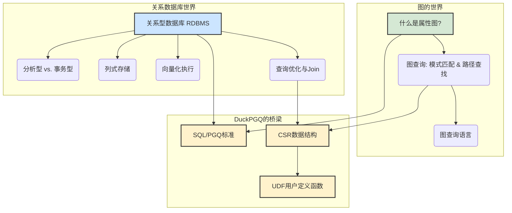
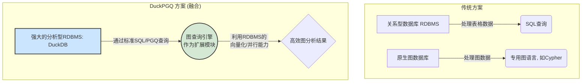
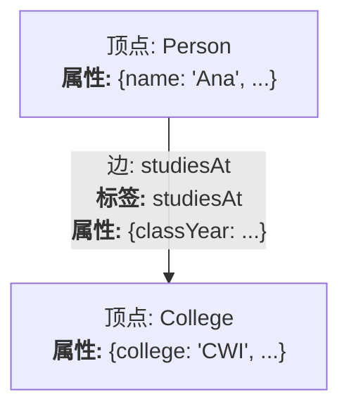
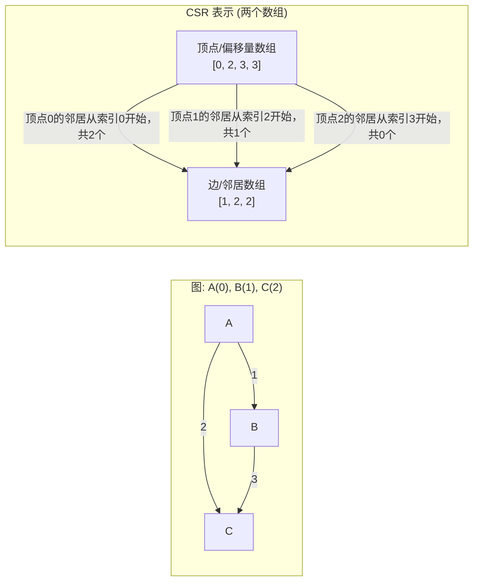

## AI论文解读 | DuckPGQ: Efficient Property Graph Queries in an analytical RDBMS
        
### 作者        
digoal        
        
### 日期        
2025-07-19       
        
### 标签        
PostgreSQL , PolarDB , DuckDB , AI , 论文解读        
        
----        
        
## 背景  
      
https://www.cidrdb.org/cidr2023/papers/p66-wolde.pdf        
  
      
提示:        
```        
读懂《DuckPGQ: Efficient Property Graph Queries in an analytical RDBMS》这篇论文需要提前掌握哪些基础知识, 请使用中文给我讲一下这些基础知识, 尽量通熟易懂, 可以使用markdown支持的图形增加解释性.        
        
使用中文通熟易懂的解读《DuckPGQ: Efficient Property Graph Queries in an analytical RDBMS》这篇论文, 关键内容请深入讲解, 可以使用markdown支持的图形增加解释性.        
        
使用中文提取《DuckPGQ: Efficient Property Graph Queries in an analytical RDBMS》论文中一些重要的术语并详细解释, 可以使用markdown支持的图形示增加解释性.        
```        
        
## 1 前置知识 
  
好的，为了完全理解《DuckPGQ: 高效处理分析型关系数据库中的属性图查询》这篇论文，你需要了解一些来自**数据库系统**和**图论**领域的基础知识。

这篇论文的核心思想是：我们能否不从头搭建一个全新的图数据库，而是利用现有成熟、高效的 **分析型关系数据库（Analytical RDBMS）** 技术，通过巧妙的扩展，让它也能高效地处理图查询？

下面我将为你分解这些必备的基础知识，并用通俗的语言和图示来解释。

-----

### 核心知识域

为了更好地理解，我们可以将所需知识分为两大块：

1.  **关系数据库世界 (The Relational World)**：论文中作为基础的系统（DuckDB）属于这个世界。
2.  **图的世界 (The Graph World)**：论文想要解决的问题（属性图查询）属于这个世界。

这篇论文就是在这两个世界之间搭建了一座桥梁。



-----

### 1\. 关系数据库世界 (The Relational World)

这是理解论文技术基础的关键。DuckDB 是一个顶尖的分析型关系数据库，论文充分利用了它的特性。

#### 1.1 关系型数据库 (RDBMS) 与 SQL

  * **是什么**：你可以把它想象成一堆由行和列组成的二维表格（比如 Excel）。每个表有严格定义的列（字段），每行是一条记录。SQL (Structured Query Language) 是我们用来操作这些表格（增、删、改、查）的语言。
  * **为什么重要**：论文的目标就是在一个基于这种模型的系统上执行图查询。它把图数据也存放在二维表中。

#### 1.2 分析型 (OLAP) vs. 事务型 (OLTP) 数据库

  * **是什么**：
      * **事务型 (OLTP - Online Transaction Processing)**：主要用于处理大量、短小的日常交易。比如银行转账、下订单。特点是：快速读写单条或少量几条记录。
      * **分析型 (OLAP - Online Analytical Processing)**：主要用于数据分析和商业智能。比如“统计上个季度所有商品的总销售额”。特点是：需要扫描大量数据（甚至整张表）进行复杂的聚合计算。
  * **为什么重要**：DuckDB 是一个**分析型**数据库。这意味着它天生就为快速扫描海量数据和复杂计算做了优化。这篇论文认为，许多图分析任务（比如找出所有符合某种模式的路径）本质上也是一种复杂的分析，因此分析型数据库是正确的起点 。

#### 1.3 列式存储 (Columnar Storage)

  * **是什么**：传统数据库按**行**存储数据，而列式存储按**列**存储。

    ```
    # 假设我们有一个学生表
    ID | Name  | Major
    ---|-------|-------
    1  | Alice | CS
    2  | Bob   | EE
    3  | Carol | CS

    # 行式存储 (磁盘上)
    [1, "Alice", "CS", 2, "Bob", "EE", 3, "Carol", "CS"]

    # 列式存储 (磁盘上)
    [1, 2, 3]  ["Alice", "Bob", "Carol"]  ["CS", "EE", "CS"]
    ```

  * **为什么重要**：对于分析查询（比如“统计有多少学生是CS专业的？”），列式存储只需要读取 `Major` 这一列的数据，而不需要加载 `ID` 和 `Name` 列，大大减少了 I/O 。这对于需要扫描节点或边某一特定属性的图查询非常有利。

#### 1.4 向量化执行 (Vectorized Execution)

  * **是什么**：传统数据库处理数据是“一次一条记录”（Tuple-at-a-time）。而向量化执行是“一次一批记录（一个向量）”。CPU 一次处理一个数据块（比如 1024 个值），而不是一个一个地处理。

    ```
    # 传统方式 (像零售)
    for each record in table:
      process(record)  // 每次处理一个

    # 向量化方式 (像批发)
    for each vector in table:
      process_vector(vector) // 每次处理一批
    ```

  * **为什么重要**：它极大地减少了函数调用的开销和 CPU 指令的分支预测错误，性能提升可达 10-100 倍 。论文中提到的路径查找算法就是以向量化的方式实现的，可以同时处理上百个查找任务 。

-----

### 2\. 图的世界 (The Graph World)

这是论文要解决的问题域。

#### 2.1 属性图 (Property Graph)

  * **是什么**：这是目前最流行的图数据模型 。它由以下部分组成：

      * **顶点 (Vertices)**：也叫节点，表示实体，如“人”、“公司”。
      * **边 (Edges)**：表示顶点之间的关系，如“认识”、“投资”。边是**有向的**。
      * **标签 (Labels)**：为顶点和边分类，如一个顶点可以有 `Person` 和 `Student` 两个标签。
      * **属性 (Properties)**：以键值对（Key-Value）形式存储在顶点和边上的详细信息，如一个 `Person` 顶点可以有属性 `{name: "Ana", birthDate: "..."}`。

    

    ```mermaid
    graph TD
        A["Ana: Person<br>{name: 'Ana', ...}"]
        B["Bo: Person<br>{name: 'Bo', ...}"]
        C["CWI: College<br>{name: 'CWI'}"]

        A -- "knows<br>{createDate: ...}" --> B
        A -- "studiesAt<br>{classYear: 2023}" --> C
    ```

  * **为什么重要**：这是论文要处理的数据模型。整个 SQL/PGQ 标准就是围绕着如何在 SQL 中描述和查询这种图 。

#### 2.2 图查询的核心任务

  * **模式匹配 (Pattern Matching)**：在一个大图中，寻找所有符合特定结构子图的实例。例如，“找到所有叫 Ana 的人，她认识另一个人，并且她还在某个大学学习” 。这在 SQL 中通常通过一系列的 `JOIN` 操作来实现。
  * **路径查找 (Path Finding)**：寻找两个或多组顶点之间的路径。例如，“找到从 Ana 到 Bo 的**最短**社交关系路径” 。这是传统 SQL 难以优雅、高效表达的任务，尤其是当路径长度不固定时（称为 Kleene-star 或递归查询）。

-----

### 3\. DuckPGQ 搭建的桥梁

了解了以上两个世界后，就可以理解 DuckPGQ 是如何将它们连接起来的。

#### 3.1 SQL/PGQ 标准

  * **是什么**：这是国际标准 SQL:2023 中新增的一个部分，它定义了一套标准的语法，让用户可以在 SQL 中进行图的模式匹配和路径查找 。论文中的 `MATCH` 语法就来源于此。
  * **为什么重要**：它为在关系数据库中进行图查询提供了“官方语言”，使得论文的工作不是一个孤立的、自定义的实现，而是遵循了一个未来的行业标准。

#### 3.2 CSR (Compressed Sparse Row)

  * **是什么**：这是一种非常紧凑、高效地存储图（特别是稀疏图，即节点很多但边相对较少）连接关系的数据结构。它主要用两个数组来表示整个图：

    1.  一个**边数组 (Edge Array)**：连续存放所有顶点的邻居。
    2.  一个**顶点/偏移量数组 (Vertex/Offset Array)**：记录每个顶点在边数组中的“邻居”开始的位置。

  * **为什么重要**：当进行路径查找（如广度优先搜索 BFS）时，需要在图上频繁地从一个节点跳转到它的邻居。CSR 结构将一个节点的所有邻居都存放在连续的内存空间中，这对于 CPU 缓存非常友好，遍历速度极快 。论文的核心创新之一就是能够**即时（on-the-fly）**、**并行地**将表数据快速转换成 CSR 格式来进行路径查找 。

#### 3.3 UDF (User-Defined Function)

  * **是什么**：用户定义函数。它允许开发者用 C++ 等语言编写自己的函数，然后在 SQL 查询中像内置函数（如 `SUM()`、`AVG()`）一样调用。
  * **为什么重要**：DuckPGQ 的巧妙之处在于，它没有去大改 DuckDB 的核心代码。而是将图特有的、复杂的操作（如创建 CSR、在 CSR 上执行多源最短路径算法）封装成几个高效的 UDF 。这样，一个复杂的图查询就被**翻译**成了一个包含这些特殊 UDF 的标准 SQL 查询，然后交由 DuckDB 的查询引擎去执行 。这大大降低了开发和维护成本。

### 总结

所以，要读懂这篇论文，你的知识储备应该像这样：

1.  你知道**关系数据库**用**表**来存数据，用 **SQL** 来查询。
2.  你明白**分析型数据库**擅长处理涉及海量数据的**复杂计算**，其背后的功臣是**列式存储**和**向量化执行**。
3.  你知道**属性图**是“点-线-标签-属性”的数据模型，常见的查询是**模式匹配**和**路径查找**。
4.  带着这些知识，你就能看懂论文是如何通过 **SQL/PGQ** 这个新标准，将图查询**翻译**成 SQL，并利用**UDF**调用一个在**CSR** 这种高效数据结构上运行的**并行路径查找算法**，最终在强大的**分析型数据库**（DuckDB）上实现了高性能的图查询。
  
## 2 解读论文 
  
好的，我们来一起深入解读这篇非常有趣的论文——《DuckPGQ: 在分析型关系数据库中实现高效的属性图查询》。

我会将解读分为四个部分：

1.  **核心思想**：用一句话和一张图讲明白这篇论文到底在做什么。
2.  **背景：为什么需要 DuckPGQ？** 了解当时数据库领域的“两大阵营”及其挑战。
3.  **技术核心：DuckPGQ 的三大法宝**：深入剖析论文提出的关键技术和实现细节。
4.  **成果与启示**：看看它的效果如何，以及它为我们带来了什么思考。

-----

### 1\. 核心思想：给跑车装上越野能力

如果用一句话来概括这篇论文的核心思想，那就是：

> **我们不需要从零开始建造一辆全新的“图数据库”越野车，而是可以为一辆性能顶尖的“分析型数据库”跑车（DuckDB）安装上高效的图查询引擎，让它也能在图数据的世界里飞驰。**

这篇论文认为，一个强大的图数据库系统，其基础必须是一个先进的关系数据库系统 。在此之上，只需要额外增加两样东西：一个紧凑的图表示结构，以及一个能同时处理多点路径查找的算法 。



-----

### 2\. 背景：为什么需要 DuckPGQ？

在 DuckPGQ 出现之前，数据世界主要有两个阵营，它们各自为政，各有优劣。

#### 阵营一：原生图数据库 (Native Graph Databases)

  * **代表**：Neo4j, TigerGraph 等 。
  * **擅长**：它们专门为存储和查询“属性图”而生 。属性图是一种由**顶点**（节点，如“人”）、**边**（关系，如“认识”）、**标签**（分类）和**属性**（键值对信息）构成的数据模型 。
  * **痛点**：
    1.  **语言不统一**：每个数据库都有自己的查询语言，如 Cypher、GSQL 等，学习和迁移成本高 。
    2.  **分析性能瓶颈**：在处理涉及全图扫描或复杂聚合的大规模分析查询时，性能常常不如顶尖的关系型数据库 。

#### 阵营二：分析型关系数据库 (Analytical RDBMS)

  * **代表**：DuckDB, Snowflake, ClickHouse 等 。
  * **擅长**：它们是为大数据分析而优化的“性能怪兽”。其核心优势包括：
      * **列式存储**：数据按列存储，分析查询时只需读取相关列，极大提升 I/O 效率 。
      * **向量化执行**：CPU 一次处理一批数据（一个向量），而非一条一条处理，性能提升数十上百倍 。
      * **并行计算**：采用“morsel-driven”等先进技术，能充分利用多核 CPU 的计算能力 。
  * **痛点**：
    1.  **图查询表达困难**：用传统 SQL 表达复杂的图路径查找（尤其是长度不固定的路径）非常困难和低效，通常需要编写复杂的递归查询 。

**历史机遇**：即将到来的 **SQL:2023** 标准带来了一个破局者——**SQL/PGQ**（Property Graph Queries） 。它首次在 SQL 标准中定义了图查询的语法，让关系数据库查询图数据变得有章可循 。DuckPGQ 正是抓住了这个机遇。

-----

### 3\. 技术核心：DuckPGQ 的三大法宝

DuckPGQ 的设计哲学是“最小化侵入”，它并非大改 DuckDB 内核，而是作为一个巧妙的**扩展模块** 。其核心技术可以归结为以下三点。

#### 法宝一：SQL/PGQ 的翻译器

DuckPGQ 首先实现了一个解析器，能读懂 SQL/PGQ 的新语法 。

  * **MATCH 子句**：这是图查询的核心，用于描述要查找的图模式 。例如：

    ```sql
    -- 查找名为'Ana'的Person，她在一个College里学习
    MATCH (a:Person WHERE a.name = 'Ana') -[:studiesAt]-> (c:College)
    ```

      * `()` 代表一个顶点，`[]` 代表一条边 。
      * `:Person` 是对顶点标签的筛选 。
      * `WHERE` 子句用于筛选顶点的属性 。
      * `-[:studiesAt]->` 描述了一条名为 `studiesAt` 的有向边 。

  * **翻译过程**：

      * 对于简单的模式匹配，DuckPGQ 会将其直接翻译成等价的、由多个 `JOIN` 和 `FILTER` 组成的标准 SQL 查询 。
      * 对于最复杂的**不定长路径查找**（如 `-[e:knows]->*`，表示经过任意多条 `knows` 边），它则会调用下面的秘密武器 。

#### 法宝二：即时（On-the-fly）创建 CSR

这是论文中最核心的创新之一，用于高效地执行路径查找。

  * **什么是 CSR (Compressed Sparse Row)？**
    它是一种在内存中紧凑表示图的数据结构，特别适合图的遍历算法 。它主要由两个大数组构成：

    1.  **顶点数组 (Vertex Array)**：记录每个顶点的出度（发出的边数），通过累加计算后，可以作为该顶点在“边数组”中的偏移量指针。
    2.  **边数组 (Edge Array)**：连续存储图中所有的边，通常只存每条边的“目标顶点ID”。

    

    ```mermaid
    graph LR
        subgraph 原始图
            0 --> 1
            0 --> 2
            1 --> 2
            2 --> 0
            2 --> 3
            3 --> 3
        end

        subgraph "CSR 表示 (两个数组)"
            V[顶点数组: 0, 2, 3, 6, 7]
            E[边数组: 1, 2, 2, 0, 3, 3]

            V -- "顶点0的邻居从位置0开始，有2个" --> E
            V -- "顶点1的邻居从位置2开始，有1个" --> E
            V -- "顶点2的邻居从位置3开始，有3个" --> E
        end
    ```

    上图中，要找顶点 `2` 的所有邻居，只需查看顶点数组：`V[2]` 是 `3`，`V[3]` 是 `6`。那么在边数组 `E` 中，从索引 `3` 到 `6` (不含6) 的所有元素 `[0, 3, 3]` 就是顶点 `2` 的邻居。这种连续内存访问对 CPU 缓存极其友好。

  * **为什么是“即时”创建？**
    DuckPGQ **在查询执行过程中**才动态创建 CSR 。这样做的好处是巨大的：它不需要在数据更新时去维护一个持久化的、难以修改的 CSR 结构，从而完美适应了关系数据库的动态性 。

  * **如何创建？**
    通过一系列并行的**用户定义函数 (UDFs)** 来完成 。

    1.  `udf_create_vertex`：并行扫描所有顶点，计算每个顶点的出度，并写入“顶点数组” 。
    2.  `udf_create_edge`：并行扫描所有边，根据源顶点的偏移量，将目标顶点的 ID 填入“边数组”的正确位置 。

#### 法宝三：基于 SIMD 的批量路径查找

创建好 CSR 后，路径查找就可以高效进行了。DuckPGQ 的另一个创举是实现了 **批量（Bulk）** 或 **多源（Multi-Source）** 的路径查找算法 。

  * **问题**：一个查询可能需要同时查找成千上万对 `(源点, 终点)` 之间的路径 。

  * **传统做法**：一个一个地查找，效率低下。

  * **DuckPGQ 的做法 (MS-BFS)**：使用“多源广度优先搜索” (Multi-Source BFS) 算法，并借助 **SIMD** (单指令多数据流) 指令集进行极致加速 。

  * **SIMD 加速的原理**：
    可以把 CPU 的一个 512 位寄存器想象成一个有 512 个“卡槽”的面板。算法同时处理 512 个不同的路径查找任务，每个任务占用一个卡槽（一个 bit 位）。当算法在图上遍历时，比如从节点 A 走到节点 B，CPU 只需一条指令，就能同时更新这 512 个任务的状态（比如，哪些任务也到达了节点 B）。这实现了计算和内存访问的巨大协同效应 。

    ```
    # 想象一下，我们同时查找 512 条路径
    # CPU 的一个 512位寄存器 `visit`
    # visit[v] 的第 i 位为 1，表示第 i 个查找任务已访问过顶点 v

    # 伪代码：当从顶点 u 访问到邻居 v 时
    # 传统方式
    for i in 1..512:
        if task_i_visited[u]:
            task_i_visited[v] = true

    # SIMD 方式 (一条指令完成)
    visit[v] = visit[v] OR visit[u]
    ```

-----

### 4\. 成果与启示

  * **性能惊人**：

      * 在图模式匹配任务上，DuckPGQ 的性能与另一款顶尖学术数据库 Umbra 相当，同时远超原生的 Neo4j 数据库 。
      * 在路径查找任务上，DuckPGQ 能够轻松处理大规模图和数万个查找请求，而基于传统递归SQL的 Umbra 则会因内存耗尽而崩溃 。DuckPGQ 的性能也总体上优于 Neo4j 。

  * **核心结论**：

    1.  **根基很重要**：在一个强大的分析型关系数据库上构建图功能，是一条正确且高效的技术路径 。其成熟的查询优化、列存和向量化执行引擎为上层图查询提供了坚实的基础。
    2.  **扩展而非重造**：通过“扩展模块 + UDF”的轻量级方式，可以在不牺牲可维护性的前提下，为现有系统赋予强大的新能力 。
    3.  **算法与硬件结合**：为多核并行和 SIMD 等现代硬件特性专门设计的算法（如 MS-BFS），是释放极致性能的关键 。

  * **未来展望**：
    论文也指出，这项工作还只是一个开始。未来，可以将更先进的连接算法（如最坏情况最优连接 WCOJ）和因子化查询处理技术整合到关系数据库内核中，让它处理图查询（乃至所有复杂查询）的能力再上一个台阶 。

总而言之，DuckPGQ 是一篇典型的系统性论文，它没有发明一个全新的理论，而是巧妙地将现有领域的顶尖技术（分析型RDBMS、图算法、现代硬件特性）和新标准（SQL/PGQ）捏合在一起，通过优雅的工程设计，解决了一个实际且重要的问题，为关系数据库的未来发展方向提供了宝贵的启示。
  
## 3 术语  
  
好的，这里从《DuckPGQ》这篇论文中提取了一些关键术语，并为您提供通俗易懂的中文解释和图示。

这些术语可以分为三大类：

1.  **图数据与查询相关术语**：描述问题域。
2.  **数据库系统架构术语**：解释其所依赖的底层技术。
3.  **DuckPGQ 核心实现技术**：论文提出的具体解决方案。

-----

### 1\. 图数据与查询相关术语

#### **属性图 (Property Graph)**

  * **解释**：这是当今流行的一种图数据模型 。它由以下几个部分组成：
      * **顶点 (Vertices)**：代表实体，比如“学生”、“大学” 。
      * **边 (Edges)**：代表顶点之间的有向关系，比如从“学生”指向“大学”的“enrol (注册)”关系 。
      * **标签 (Labels)**：用于对顶点和边进行分类，比如一个顶点可以有 `Person` 标签，一条边可以有 `studiesAt` 标签 。
      * **属性 (Properties)**：以“键/值”对的形式附着在顶点和边上，用于描述它们的详细信息，例如 `Person` 顶点可以有 `name='Ana'` 的属性 。
  * **在论文中的重要性**：这是 DuckPGQ 系统所要处理和查询的数据模型 。整个 SQL/PGQ 标准就是围绕着如何在关系数据库中表达和操作属性图而设计的 。




#### **SQL/PGQ (Property Graph Queries for SQL)**

  * **解释**：它是即将发布的 SQL:2023 标准中引入的一个图查询子语言 。它主要提供两大功能：
    1.  允许在现有的关系表之上定义“图视图” 。
    2.  提供了一套标准的 SQL 语法（主要是 `MATCH` 子句）来执行图的模式匹配和路径查找 。
  * **在论文中的重要性**：SQL/PGQ 是这篇论文工作的基石和目标 。它解决了图查询语言不统一的痛点，为在关系数据库中进行图查询提供了标准化的“通用语言” 。DuckPGQ 的核心就是高效实现 SQL/PGQ 的功能 。

#### **不定长路径 / Kleene Path**

  * **解释**：指在图中查找长度没有上限的路径 。在 SQL/PGQ 中，通常用量词 `*`（0次或多次）或 `+`（1次或多次）来表示 。例如 `(a)-[:knows*]->(b)` 表示查找 a 与 b 之间由任意多条 `knows` 边组成的路径。
  * **在论文中的重要性**：这是传统 SQL 的一大难题 。要实现这种查询，通常需要编写复杂、低效的递归 SQL 。DuckPGQ 认为这种方式难以优化，因此选择不将 Kleene 路径翻译成递归 SQL，而是采用专门的路径查找算法（如 MS-BFS）来高效处理 。

-----

### 2\. 数据库系统架构术语

#### **分析型关系数据库 (Analytical RDBMS)**

  * **解释**：这是一种专门为数据分析（OLAP）场景优化的关系数据库系统 。与处理日常交易的事务型数据库（OLTP）不同，它擅长在海量数据上执行复杂的聚合、扫描和连接查询 。其典型技术包括列式存储、向量化执行等 。
  * **在论文中的重要性**：论文的核心论点是，一个强大的图数据库必须建立在先进的分析型 RDBMS 技术之上 。DuckDB 就是一个典型的嵌入式分析型 RDBMS ，DuckPGQ 正是利用了它的高性能特性作为基础。

#### **向量化执行 (Vectorized Execution)**

  * **解释**：这是一种查询执行模型，它一次处理一批（一个向量，通常是 1024 个值）数据，而不是传统数据库那样一次处理一条记录 。这种批处理方式大幅减少了函数调用开销，能将性能提升 10 到 100 倍 。
  * **在论文中的重要性**：DuckPGQ 的核心功能（如 CSR 创建、路径查找）被实现为**向量化 UDF** 。这意味着它们能完全融入 DuckDB 的向量化执行引擎，从而天然地获得极高的执行效率和并行能力 。

#### **Morsel-driven Parallelism**

  * **解释**：这是一种先进的、适应 NUMA 架构的多核并行调度模型 。系统将要处理的数据切分成许多小块（morsels，通常是 10-100k 个数据项），多个工作线程会从一个公共队列中“偷”一个 morsel 来处理，处理完再去偷下一个 。这种方式能实现灵活的任务调度和良好的负载均衡 。
  * **在论文中的重要性**：这是 DuckDB 使用的并行执行框架 。由于 DuckPGQ 是作为 DuckDB 的扩展实现的，它的 UDF 调用可以自动地被这个框架并行化，从而充分利用多核 CPU 的处理能力 。

-----

### 3\. DuckPGQ 核心实现技术

#### **CSR (Compressed Sparse Row)**

  * **解释**：一种高效、紧凑地在内存中表示图（尤其是稀疏图）的数据结构 。它通常使用两个数组来表示全图的连接信息，非常适合需要频繁遍历邻居节点的图算法 。
  * **在论文中的重要性**：这是 DuckPGQ 进行高效路径查找的“秘密武器” 。论文的关键创新之一，就是能够在查询执行过程中 **即时（on-the-fly）** 地将表数据快速转换成 CSR 格式，而无需持久化存储和维护它 。




#### **UDF (User-Defined Function)**

  * **解释**：用户定义函数。它允许开发者用 C++ 等高性能语言编写自定义函数，并注册到数据库中，之后便可以在 SQL 查询里像调用内置函数（如 `SUM()`）一样调用它们 。
  * **在论文中的重要性**：DuckPGQ 的设计哲学是“最小化技术债” 。它没有大改 DuckDB 的内核，而是将所有图相关的特殊逻辑，如 CSR 的创建 (`udf_create_vertex`, `udf_create_edge`) 和路径查找 (`udf_ms_bfs`)，都封装在了几个高性能的向量化 UDF 中 。

#### **批量路径查找 (Bulk Path-finding) / MS-BFS**

  * **解释**：指的是一次性解决一个“多源-多目标”（multi-source multi-destination）的路径查找问题，而不是一次只找一对点之间的路径 。**MS-BFS** (Multi-Source Breadth-First Search) 是 DuckPGQ 用来实现批量查找“任意一条最短路径”的具体算法 。
  * **在论文中的重要性**：这种批量处理的方式能够在多个独立的查找任务间产生协同效应，并为并行化提供了机会 。这是 DuckPGQ 路径查找性能远超传统递归 SQL 方案的关键。

#### **SIMD (Single Instruction, Multiple Data)**

  * **解释**：一种并行计算技术，允许 CPU 用一条指令同时对多个数据点执行相同的操作 。例如，一条 AVX-512 指令可以同时对 512 个比特位进行逻辑运算（AND, OR 等） 。
  * **在论文中的重要性**：这是 DuckPGQ 实现 MS-BFS 算法极致加速的微观技术。算法使用一个大的整数数组来记录访问状态，其中每个整数都是一个位图（bitset），每一位（bit）代表一个独立的路径查找任务 。借助 SIMD 指令，算法只需一条 CPU 指令就能同时更新多达 512 个查找任务的状态，从而实现了惊人的计算效率 。
  
## 参考        
         
https://www.cidrdb.org/cidr2023/papers/p66-wolde.pdf  
        
        
<b> 以上内容基于DeepSeek、Qwen、Gemini及诸多AI生成, 轻微人工调整, 感谢杭州深度求索人工智能、阿里云、Google等公司. </b>        
        
<b> AI 生成的内容请自行辨别正确性, 当然也多了些许踩坑的乐趣, 毕竟冒险是每个男人的天性.  </b>        
    
  
