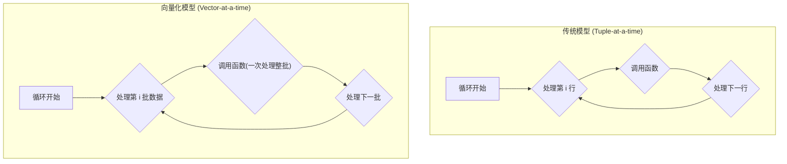
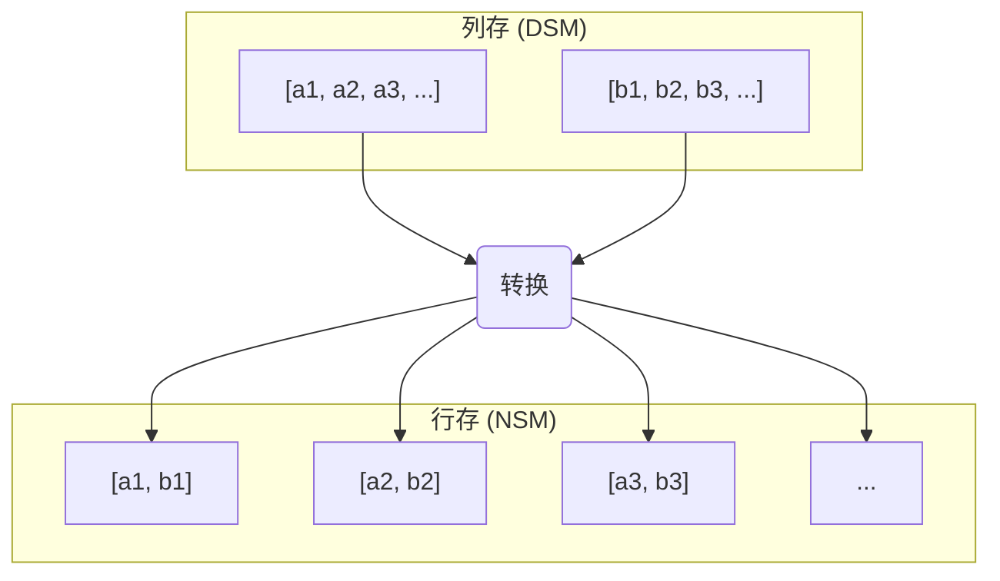
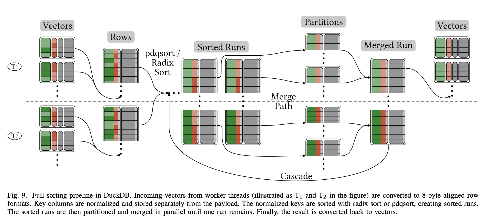

## AI论文解读 | These Rows Are Made for Sorting and That’s Just What We’ll Do
        
### 作者        
digoal        
        
### 日期        
2025-07-19       
        
### 标签        
PostgreSQL , PolarDB , DuckDB , AI , 论文解读        
        
----        
        
## 背景  
      
https://duckdb.org/pdf/ICDE2023-kuiper-muehleisen-sorting.pdf        
  
      
提示:        
```        
读懂《These Rows Are Made for Sorting and That’s Just What We’ll Do》这篇论文需要提前掌握哪些基础知识, 请使用中文给我讲一下这些基础知识, 尽量通熟易懂, 可以使用markdown支持的图形增加解释性.        
        
使用中文通熟易懂的解读《These Rows Are Made for Sorting and That’s Just What We’ll Do》这篇论文, 关键内容请深入讲解, 可以使用markdown支持的图形增加解释性.        
        
使用中文提取《These Rows Are Made for Sorting and That’s Just What We’ll Do》论文中一些重要的术语并详细解释, 可以使用markdown支持的图形示增加解释性.        
```        
        
## 1 前置知识 
  
好的，为了完全理解《These Rows Are Made for Sorting and That’s Just What We’ll Do》这篇论文，你需要掌握一些关于现代数据库系统、计算机体系结构和算法的基础知识。这篇论文的核心是探讨在分析型数据库（OLAP）中，如何最高效地实现排序（`ORDER BY`）操作。

下面我将用通俗易懂的语言，为你讲解这些必备的基础知识。

### 基础知识一：数据库的两种核心存储模型：行存与列存

数据库在物理上存储数据的方式，主要分为“行式存储”和“列式存储”两种。这个区别是理解这篇论文的基石。

#### 1\. 行式存储 (Row-based Storage / NSM)

行式存储是我们最熟悉的模式，就像一张Excel表格。它将**一行数据的所有字段连续地存储在一起**。

**示例：** 假设我们有一张用户表：

| ID (整数) | 姓名 (字符串) | 年龄 (整数) |
| :-------- | :------------ | :---------- |
| 1         | 张三          | 30          |
| 2         | 李四          | 25          |

在内存或磁盘上，它的存储布局会是这样的：

```
[ 1, "张三", 30 ] [ 2, "李四", 25 ] ...
```

  * **优点**：当你需要获取**一整行**数据时（例如，`SELECT * FROM users WHERE ID = 1`），效率非常高，因为所有信息都在一起，一次IO就能读取。
  * **缺点**：当你只需要分析**某一列**数据时（例如，`SELECT AVG(年龄) FROM users`），效率很低。因为它必须读取每一行的所有数据（包括你不需要的ID和姓名），造成了大量的无效IO。
  * **适用场景**：事务处理系统（OLTP），如订单系统、银行交易，这些场景频繁地对单条记录进行增删改查。

#### 2\. 列式存储 (Column-based Storage / DSM)

与行存相反，列式存储将**每一列的数据分别连续地存储在一起**。

**示例：** 对于同样的用户表，列存的布局是：

```
// ID 列
[ 1, 2, ... ]

// 姓名 列
[ "张三", "李四", ... ]

// 年龄 列
[ 30, 25, ... ]
```

  * **优点**：当进行数据分析，只关心**少数几列**时，效率极高。计算平均年龄时，只需读取“年龄”这一列的数据，大大减少了IO量。同时，同一列的数据类型相同，非常适合做数据压缩。
  * **缺点**：当你需要获取**一整行**数据时，效率较低。因为它需要分别从多个列存储区中读取数据，然后“拼接”成一行。
  * **适用场景**：分析型数据库（OLAP），如数据仓库、报表系统。这些场景通常需要对海量数据的特定列进行聚合计算（如求和、平均、计数）。

> **与论文的联系**：这篇论文探讨的核心问题是：现代分析型数据库普遍采用**列式存储**，但在执行排序（这是一个天然的“行”操作，因为比较总是在行与行之间进行）时，是直接在列存上操作，还是先把数据转换成**行存**格式，排完序再转回去更高效？论文的结论是，**即使有转换开销，后者也几乎总是更快**。

### 基础知识二：数据库的两种主流查询执行模型

当数据库收到一条SQL查询后，需要一个“执行引擎”去实际地处理数据。现代分析型数据库主要有两种高效的执行模型。

#### 1\. 向量化执行 (Vectorized Execution)

传统的执行引擎是“一次处理一条元组（一行）”，这种方式在循环中调用函数的开销非常大。向量化执行则**一次处理一批数据（一个向量/一个Column Chunk）**。

**打个比方**：

  * **传统模型**：你去食堂打饭，每次只打一粒米，来回跑很多趟。
  * **向量化模型**：你拿一个碗，一次性打一碗米回来。




这种模型通过批处理，极大地摊销了函数调用的开销，CPU利用率更高。DuckDB（论文作者的系统）、ClickHouse都采用了这种模型。

#### 2\. 编译执行 / JIT (Compiled Execution / Just-In-Time Compilation)

这种模型更为激进。它不通过一个通用的解释器去执行查询，而是针对**每一条具体的SQL查询，动态生成高度优化的、专门的机器码**，然后去执行这些机器码。

**打个比方**：

  * **向量化模型**：你有一套通用的乐高积木说明书，可以拼出各种模型。
  * **编译执行模型**：你为每个想拼的模型，都专门打印一张独一无二、步骤最简的说明书。

这种模型完全消除了“解释”带来的开销，理论上可以达到手写C++代码的性能。HyPer、Umbra是这种模型的代表。

> **与论文的联系**：论文分析了这两种执行引擎对排序实现的影响。特别是**向量化（解释型）引擎**，在进行行与行之间复杂的比较时，会产生函数调用和类型解释的开销，这正是论文试图解决的痛点。

### 基础知识三：重要的计算机体系结构概念

论文的性能分析深入到了硬件层面，因此理解以下两个概念至关重要。

#### 1\. CPU缓存 (CPU Cache) 和缓存命中/未命中

  * **CPU缓存**：是CPU内部的一小块速度极快的存储。CPU读取数据时，会先看缓存里有没有，有就直接用；没有才去访问慢得多的主内存（RAM）。
  * **缓存命中 (Cache Hit)**：要的数据在缓存里，速度快。
  * **缓存未命中 (Cache Miss)**：数据不在缓存里，必须去主内存拿，速度慢几个数量级。

**数据局部性 (Data Locality)** 是关键。如果CPU要访问的数据在内存中是连续存放的，那么当它读取第一个数据时，会顺便把后面的一块数据也加载到缓存里，这样后续的访问就会很快（缓存命中）。

> **与论文的联系**：这直接解释了为什么行存排序更快。
>
>   * **列存排序**：比较两行数据时，你需要先访问`列A`的第`i`个和第`j`个位置，如果相等，再跳到`列B`的第`i`个和第`j`个位置... 这种内存访问是**跳跃的、不连续的**，极易导致缓存未命中。
>   * **行存排序**：比较两行数据时，两行数据各自的字段是**连续存放的**，CPU访问内存的模式更加友好，缓存命中率高得多。

#### 2\. 分支预测 (Branch Prediction)

现代CPU为了提高效率，会采用流水线技术。当遇到`if-else`这样的条件分支时，CPU会“猜测”接下来会执行哪个分支，并提前开始处理。

  * **预测正确**：流水线继续，一切顺利。
  * **预测错误 (Branch Misprediction)**：CPU必须丢弃已经提前做的所有工作，返回去执行正确的分支，造成巨大的性能损失。

> **与论文的联系**：在排序中，比较函数充满了`if-else`。例如，`if (a.key1 < b.key1) return -1; else if (a.key1 > b.key1) return 1; else ...`。如果数据分布没有规律，CPU就很难预测比较结果，导致大量分支预测错误。论文中提到的 **“归一化键 (Normalized Keys)”** 技术，就是将多字段的比较逻辑，编码成一个单一的、可以用`memcmp`（内存直接比较）来处理的长字符串。`memcmp`内部的分支极少，从而避免了这个问题。

### 基础知识四：两种排序算法思想

#### 1\. 比较排序 (Comparison Sort)

如快速排序（Quicksort）、归并排序（Merge Sort）。它们通过元素之间的两两比较来确定顺序。其时间复杂度的理论下限是 $O(n \\log n)$。`pdqsort`是论文中提到的一个现代、高度优化的快速排序变种。

#### 2\. 基数排序 (Radix Sort)

这是一种非比较排序。它不比较元素大小，而是根据元素的“位”（比如整数的每一位，或字节）来分配到不同的“桶”里，然后收集。对于长度为 $k$ 的键，其时间复杂度是 $O(nk)$。当 $n$ 非常大时，这个速度可能快于 $O(n \\log n)$。

> **与论文的联系**：基数排序非常适合对“归一化键”进行排序，因为归一化键本质上就是一长串字节，可以逐个字节地进行基数排序，速度飞快且没有分支预测问题。

### 总结

掌握了以上四个方面的基础知识后，你就可以轻松地理解这篇论文的脉络了：

1.  **背景**：分析型数据库（OLAP）常用**列存**和**向量化/编译执行**引擎。
2.  **问题**：如何在这样的系统中高效实现排序？直接在**列存**上排序，会因为**缓存不友好**和**分支预测错误**而变慢。
3.  **核心论点**：不如先花点代价，把要排序的键（Key Columns）转成**行存**格式。
4.  **解决方案 (针对解释型引擎)**：为了解决行存比较的开销，使用 **归一化键 (Normalized Keys)** 技术，将复杂比较转为简单的内存比较 (`memcmp`)，并使用 **基数排序 (Radix Sort)** 来进一步加速。
5.  **验证**：通过一系列微基准测试和在DuckDB中的实现，证明了这一思路在真实世界中是正确且高效的。

希望这份讲解能帮助你顺利读懂这篇优秀的论文！
  
## 2 解读论文 
  
好的，这篇论文《These Rows Are Made for Sorting and That’s Just What We’ll Do》是数据库领域的一篇经典之作，它深入探讨了现代分析型数据库（OLAP）中一个最基本但至关重要的操作——排序（`ORDER BY`）——的最佳实现方式。

下面，我将为你提供一个通俗易懂且深入的解读。

### 引言：论文到底要解决什么问题？

排序无处不在，除了用户明确写的 `ORDER BY`，数据库内部的很多高级操作（如聚合、窗口函数、连接）也依赖于排序。因此，排序的效率直接决定了数据库的性能。

现代分析型数据库大多采用**列式存储**，因为它在进行聚合分析时能提供极高的I/O效率。然而，排序这个操作天然是 **“行式”** 的——我们需要比较 **一整行** 与另 **一整行** 的大小。这就产生了一个核心矛盾：

**在一个采用“列式存储”的数据库中，如何最高效地执行一个“行式”的排序操作？**

这篇论文通过一系列严谨的微基准测试和在真实系统（DuckDB）中的实现，给出了一个有些反直觉但非常有效的答案。

-----

### 核心发现一：行存 vs. 列存，谁是排序之王？

论文首先对比了两种根本不同的排序方式：直接在列存数据上排，还是先把数据转换成行存再排。

#### 1\. 列式排序 (Sorting on Columnar Data)

在列存格式下，一行数据的值分散在不同的内存区域。如果要比较两行数据的大小（例如，先按`a`列排，再按`b`列排），CPU的访问模式是这样的：

```
// 比较第i行和第j行
// 1. 先去'a'列的内存块
compare(col_a[i], col_a[j]);
// 2. 如果相等，再跳到'b'列的内存块
if (equal) {
  compare(col_b[i], col_b[j]);
}
// 3. ...
```

这种在不同内存块之间“反复横跳”的访问方式，是 **CPU缓存（CPU Cache）** 的噩梦。它会导致大量的**缓存未命中（Cache Miss）**，CPU不得不频繁地从慢速的主内存中读取数据，性能急剧下降 。

#### 2\. 行式排序 (Sorting on Row Data)

行式排序则要求先把需要排序的列（称为“键列”，Key Columns）聚合起来，形成连续的内存块。

**转换过程示意图:**



转换后，每一行的数据都是紧挨着的。比较两行时，CPU可以连续地访问内存，**缓存命中率**极高，从而大幅提升性能 。

#### 结论：行存完胜

论文的微基准测试明确显示：**尽管需要额外的转换开销，但将数据从列存转换到行存进行排序，几乎总是比直接在列存上排序要快得多** 。当数据量变大，无法完全装入CPU缓存时，行存的优势尤为明显 。

-----

### 核心发现二：查询引擎如何影响排序效率？

论文进一步指出，即使都采用行式排序，不同的查询执行引擎也会带来巨大的性能差异。

  * **编译执行引擎 (Compiled Engines)**：如HyPer和Umbra，它们可以为每一条排序查询动态生成专门的、高度优化的机器码 。比较两行数据的代码可以被编译器内联和优化，几乎没有额外开销，性能极高 。

  * **解释执行引擎 (Interpreted Engines)**：如DuckDB和ClickHouse，它们使用一个通用的执行框架。在排序时，比较两行数据需要调用通用的比较函数 。每一次比较都可能伴随着：

      * **函数调用开销 (Function Call Overhead)**：频繁的函数调用本身就有性能损耗 。
      * **分支预测错误 (Branch Misprediction)**：比较函数内部充满了`if-else`逻辑（比如先比第一列，再比第二列，还要处理`ASC`/`DESC`、`NULLS FIRST`/`LAST`），这会让CPU的分支预测器频繁出错，导致性能下降 。

这使得解释型引擎在实现高效行式排序时，面临着天然的劣势 。

-----

### 论文的“屠龙之技”：如何在解释型引擎中高效排序？

面对解释型引擎的困境，论文提出了一套组合拳，这正是其核心贡献所在。目标是：**消除比较函数中的“解释”开销，让其变得像编译引擎一样高效**。

#### 1\. 归一化键 (Normalized Keys)

这是最关键的技术。它的思想是，将一个多字段、多类型、有复杂排序规则的“键”，预处理（编码）成一个**定长的、保持原有顺序的字节序列**（可以理解成一个特殊的字符串） 。

完成编码后，原来复杂的比较逻辑：
`compare(rowA.key1, rowB.key1); if equal, compare(rowA.key2, rowB.key2)...`

就变成了一个极其简单的、与具体类型和排序规则无关的内存比较：
`memcmp(normalized_keyA, normalized_keyB);`

**归一化键如何工作？（以一个例子说明）**

假设排序规则为 `ORDER BY c_birth_country DESC, c_birth_year ASC`。

| 原始数据 (a) |
| :--- |
| `('NETHERLANDS', 1992)` |
| `('GERMANY', 1924)` |

**编码步骤：**

1.  **处理 `c_birth_country` (VARCHAR, DESC)**：
      * 字符串需要统一长度，短的用 `\0` 补齐（图中未完全展示，但原理如此）。
      * 因为是`DESC`（降序），需要对每个字节**按位取反**（flip the bits），这样字典序大的字符串取反后反而会变小 。
2.  **处理 `c_birth_year` (INTEGER, ASC)**：
      * 需要处理字节序（大端/小端），确保高位字节在前，才能正确比较 。
      * 需要处理符号位，确保负数排在正数前面 。
3.  **拼接**：将处理后的字节序列依次拼接起来。

**最终的归一化键 (c)：**

| 编码后的字节序列 |
| :--- |
| `[177, 186, ..., 255, 128, 0, 7, 200]` |
| `[184, 186, ..., 255, 128, 0, 7, 132]` |

现在，只需用`memcmp`比较这两串字节，就能得到与原始复杂规则完全一致的排序结果 。这个编码过程本身可以被向量化地高效执行，一次处理一批数据，均摊了开销 。

**这项技术的巨大优势**：它将排序的核心操作（比较）从一个充满分支和函数调用的复杂过程，变成了一个高度优化的、无分支的底层内存操作，彻底消除了解释开销 。

#### 2\. 基数排序 (Radix Sort)

既然键已经被“归一化”成了一串字节，那么我们就可以使用比传统比较排序（如快速排序）更快的算法。**基数排序**就是完美的选择。它不通过比较，而是通过逐个字节将键分配到不同的“桶”中来进行排序 。

  * **优点**：
      * 速度极快，时间复杂度为 $O(nk)$（n是行数，k是键长），当n很大时通常优于比较排序的 $O(n \\log n)$ 。
      * 几乎没有分支，完美避开了分支预测错误的问题 。
  * **缺点**：
      * 缓存效率不如一些现代的比较排序（如`pdqsort`）。
      * 对于某些特殊数据分布（如大量重复值），性能可能不如`pdqsort` 。

论文的结论是，根据数据类型和分布，可以灵活选择使用基数排序还是`pdqsort`等高度优化的比较排序算法 。

-----

### 实战为王：DuckDB 的实现与性能对比

论文作者将上述所有技术在 DuckDB（一个采用向量化解释引擎的分析型数据库）中进行了工程实现 。其完整的并行排序流水线如下图所示：

*图源：论文原文 Figure 9*  

1.  **并行收集与转换**：多个线程并行地将输入的列式数据（Vectors）转换为行存格式，并生成归一化键 。
2.  **线程内排序**：每个线程独立地对自己收集的数据进行排序（使用基数排序或pdqsort），产生多个有序的“数据块”（Sorted Runs）。
3.  **并行归并**：使用一种称为“Merge Path”的先进并行归并算法，将所有有序的数据块高效地合并成一个最终的有序结果 。
4.  **输出**：最后将排好序的行式数据转换回列式格式，交给后续算子处理 。

**性能结果**：
在与 ClickHouse（列存排序）、MonetDB（列存排序）、HyPer（编译行存排序）、Umbra（编译行存排序）等多个顶级分析型数据库的对比中，DuckDB 的排序性能**全面胜出或持平** 。

  * 它不仅远超同样是解释型引擎但坚持列存排序的 ClickHouse（尤其是在多列排序时）。
  * 甚至还战胜了理论上更有优势的、采用编译执行引擎的 HyPer 和 Umbra 。

这充分证明，通过 **“行式转换 + 归一化键 + 高效排序算法”** 这套组合拳，解释型引擎完全可以克服其先天劣势，实现世界顶级的排序性能 。

### 结论

这篇论文的核心贡献可以总结为：

1.  **证明了行式优越性**：通过严谨测试，证明了在排序操作上，行式数据布局因其优秀的缓存局部性而优于列式布局，即便算上转换开销 。
2.  **解决了引擎鸿沟**：为解释型查询引擎提供了一套行之有效的技术（特别是归一化键），使其能够消除比较操作中的解释开销，达到甚至超越编译引擎的性能 。
3.  **给出了工程实践**：在DuckDB中完整地实现了这套高性能并行排序框架，并开源了代码，为业界提供了宝贵的参考 。

一言以蔽之，这篇论文告诉我们，在数据库中实现一个操作时，不应拘泥于系统已有的数据格式，而是应该为其选择最适合的内存布局，并用创新的算法来抹平转换和执行模型带来的开销。
  
## 3 术语  
  
好的，这是从论文《These Rows Are Made for Sorting and That’s Just What We’ll Do》中提取的一些重要术语及其详细解释。

### 1\. 行式存储 (N-ary Storage Model - NSM) vs. 列式存储 (Decomposition Storage Model - DSM)

这是理解现代分析型数据库性能的基础。论文的核心论点之一就是围绕这两种存储格式在排序场景下的效率展开的。

  * **行式存储 (NSM)**：也称为N元存储模型。它将**一行数据的所有字段连续地存储在一起** 。这种方式在需要获取整行记录时效率很高 。
  * **列式存储 (DSM)**：也称为分解存储模型。它将**每一列的数据分别存储在独立的连续内存区域中** 。这是现代向量化分析型数据库（OLAP）常用的格式 。

**图示解释：**

假设有一张表包含 `ID`, `Name`, `Age` 三列。

  * **行式存储 (NSM) 内存布局:**

    ```
    [ID_1, Name_1, Age_1] [ID_2, Name_2, Age_2] [ID_3, Name_3, Age_3] ...
    ```

  * **列式存储 (DSM) 内存布局:**

    ```
    ID 列:   [ID_1, ID_2, ID_3, ...]
    Name 列: [Name_1, Name_2, Name_3, ...]
    Age 列:  [Age_1, Age_2, Age_3, ...]
    ```

论文通过实验证明，尽管列式存储在很多分析场景下有优势，但在排序时，将数据从DSM转换为NSM可以获得更好的缓存性能和整体效率 。

### 2\. 键列 (Key Columns) 和 载荷列 (Payload Columns)

在关系型排序中，这两个术语用来区分不同角色的列。

  * **键列 (Key Columns)**：指出现在 `ORDER BY` 子句中，用于决定排序顺序的列 。
  * **载荷列 (Payload Columns)**：指除了键列之外，所有其他被查询（`SELECT`）出来的列 。

**示例 SQL:**

```sql
SELECT c_name, c_phone, c_acctbal
FROM customer
ORDER BY c_acctbal DESC, c_name ASC;
```

在这个查询中：

  * **键列** 是 `c_acctbal` 和 `c_name`。
  * **载荷列** 是 `c_phone`。

论文指出，可以将键列和载荷列分开处理 。系统可以先只对键列进行排序，确定最终顺序后，再根据这个顺序去提取相应的载荷列数据 。

### 3\. 查询执行引擎 (Query Execution Engines)

论文对比了两种主流的高性能查询执行引擎，并分析了它们对排序实现的影响。

  * **向量化执行 (Vectorized Execution)**：这种引擎以“向量”（一批数据）为单位来处理数据，而不是一次一行 。这可以摊销解释执行带来的开销 。DuckDB 和 ClickHouse 使用这种模型 。
  * **编译执行 (Compiled Execution)**：这种引擎会为每条查询即时（JIT）生成专门的、高度优化的机器码，从而完全消除解释开销 。HyPer 和 Umbra 是这种模型的代表 。

论文的发现是，编译引擎可以非常高效地处理行式数据的排序，因为比较函数可以被编译和内联 。而向量化（解释型）引擎在处理行式数据比较时会遇到函数调用和类型解释的性能瓶颈，这也是论文着力解决的问题 。

### 4\. 元组一次比较 (Tuple-at-a-time) vs. 子排序 (Subsort)

这是论文中讨论的两种处理多键列排序的具体策略。

  * **元组一次比较 (Tuple-at-a-time)**：在每次比较两行数据时，迭代地检查 `ORDER BY` 子句中的所有键列，直到发现一个不相等的值或检查完所有列为止 。
      * **缺点**：对于列存数据，这会导致在多个列之间进行随机内存访问，缓存效率低下 。同时，比较函数中存在很多分支（是否需要比较下一列），容易导致分支预测错误 。
  * **子排序 (Subsort)**：先只根据第一个键列进行排序 。然后，找出在第一个键列上值相等的行（ties），再对这些行根据第二个键列进行排序 。重复此过程，直到处理完所有键列 。
      * **优点**：这种方法在任何时候都只访问一列，减少了随机访问，并且比较函数没有分支，性能更好 。

论文的结论是，对于列式数据排序，**子排序**方法显著优于**元组一次比较**方法，尤其是在数据存在较多重复值时 。

### 5\. 归一化键 (Normalized Keys)

这是论文为解决解释型引擎排序开销而提出的核心技术。

  * **定义**：一种编码技术，可以将一个由多个字段组成的、具有特定排序规则（如`ASC`/`DESC`, `NULLS FIRST`/`LAST`）的键，转换成一个**单一的、保持原有顺序的、定长的字节序列** 。
  * **工作原理**：它通过对不同类型的数据（如整数、字符串）进行字节序调整、按位取反（用于`DESC`）等操作，并将它们拼接起来，生成一个可以直接用 `memcmp`（内存比较）函数来比较的字节序列 。
  * **优势**：将一个复杂的、充满分支的比较逻辑，转换成了一个极其简单、高效且无分支的底层内存操作 。这完美地解决了了解释型引擎在排序比较中的性能瓶颈 。

**图示解释：**

`ORDER BY c_birth_country DESC, c_birth_year ASC`

| 原始数据 | 编码过程 | 归一化键（字节序列） |
| :--- | :--- | :--- |
| `('GERMANY', 1924)` | 1. 编码 'GERMANY' (DESC) \<br\> 2. 编码 1924 (ASC) \<br\> 3. 拼接 | `[184, 186, ..., 128, 0, 7, 132]` |
| `('NETHERLANDS', 1992)` | 1. 编码 'NETHERLANDS' (DESC) \<br\> 2. 编码 1992 (ASC) \<br\> 3. 拼接 | `[177, 186, ..., 128, 0, 7, 200]` |

比较时，只需 `memcmp(键1, 键2)` 即可得到正确结果。

### 6\. 基数排序 (Radix Sort)

一种非比较排序算法，它不通过元素间的两两比较来排序。

  * **工作原理**：它根据键的“位”（例如，字节）将元素分配到不同的“桶”中，然后按顺序收集 。其时间复杂度为 $O(nk)$，其中 n 是元素数量，k 是键的长度 。
  * **适用场景**：论文指出，基数排序非常适合对定长的**归一化键**进行排序，因为它几乎没有分支，可以避免分支预测错误的问题 。但它的缓存效率可能比一些现代的比较排序算法差 。当数据分布均匀时，基数排序表现优异；但在处理字符串或包含大量重复值的数据时，`pdqsort`（一种优化的快速排序）可能更有效 。

### 7\. 管道破坏者 (Pipeline Breaker)

  * **定义**：在查询处理流水线中，有一类算子（Operator）必须接收到所有输入数据后，才能开始产生任何输出数据。排序（Sort）就是一个典型的管道破坏者 。
  * **原因**：因为理论上，输入的最后一行数据，可能是排序后的第一行数据 。
  * **影响**：这意味着排序算子必须将所有输入数据**物化**（materialize）在内存中 。这也给了排序算子一个“自由”，即它可以选择最适合自己的内部数据格式（如从列存转换为行存），只要最终输出的格式符合查询引擎的要求即可 。
  
## 参考        
         
https://duckdb.org/pdf/ICDE2023-kuiper-muehleisen-sorting.pdf  
        
        
<b> 以上内容基于DeepSeek、Qwen、Gemini及诸多AI生成, 轻微人工调整, 感谢杭州深度求索人工智能、阿里云、Google等公司. </b>        
        
<b> AI 生成的内容请自行辨别正确性, 当然也多了些许踩坑的乐趣, 毕竟冒险是每个男人的天性.  </b>        
    
  
