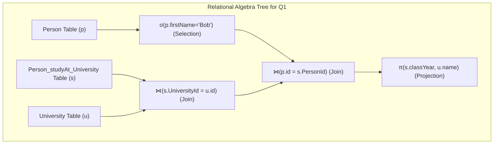
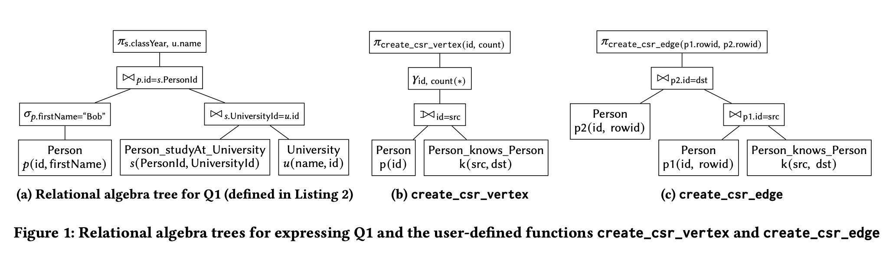
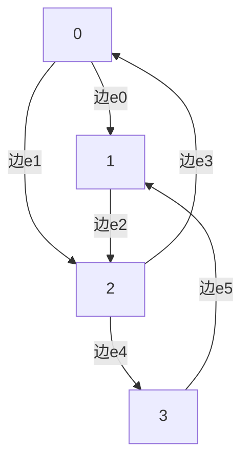

## AI论文解读 | DuckPGQ: Bringing SQL/PGQ to DuckDB
        
### 作者        
digoal        
        
### 日期        
2025-07-19       
        
### 标签        
PostgreSQL , PolarDB , DuckDB , AI , 论文解读        
        
----        
        
## 背景  
      
https://www.vldb.org/pvldb/vol16/p4034-wolde.pdf        
  
      
提示:        
```        
读懂《DuckPGQ: Bringing SQL/PGQ to DuckDB》这篇论文需要提前掌握哪些基础知识, 请使用中文给我讲一下这些基础知识, 尽量通熟易懂, 可以使用markdown支持的图形增加解释性.        
        
使用中文通熟易懂的解读《DuckPGQ: Bringing SQL/PGQ to DuckDB》这篇论文, 关键内容请深入讲解, 可以使用markdown支持的图形增加解释性.        
        
使用中文提取《DuckPGQ: Bringing SQL/PGQ to DuckDB》论文中一些重要的术语并详细解释, 可以使用markdown支持的图形示增加解释性.        
```        
        
## 1 前置知识 
  
好的，为了完全理解《DuckPGQ: Bringing SQL/PGQ to DuckDB》这篇论文，你需要掌握几个领域的交叉知识，主要涉及**数据库系统**、**图论**和**现代计算技术**。我会将这些知识点分门别类，用通俗易懂的语言和图示为你讲解。

-----

### 学习路径总览

要读懂这篇论文，你可以想象成爬一座山，需要分几步走：

1.  **山脚（基础知识）**：首先要懂最基本的“关系型数据库”和“图”是什么。
2.  **半山腰（核心概念）**：然后要理解论文试图解决的核心问题——如何用数据库的语言（SQL）去查询图。这就是 **SQL/PGQ**。
3.  **接近山顶（关键技术）**：接着，你需要了解他们选择的工具 **DuckDB** 是一个什么样的数据库，以及他们为了实现目标所使用的核心**数据结构 (CSR)** 和**算法 (MS-BFS)**。
4.  **登顶（融会贯通）**：最后，将这些知识组合起来，你就能明白论文的整体架构、创新点和价值所在。

下面我们一步步来讲解。

-----

### 基础一：关系型数据库 (RDBMS) 与 SQL

这是所有知识的基础。关系型数据库是目前世界上应用最广泛的数据库，它以一种非常结构化的方式存储数据。

  * **核心思想**：数据被存储在二维的“表”（Table）中，就像一张张 Excel 表格。

  * **表的构成**：

      * **行 (Row)**：代表一条具体的记录，比如“张三”这条员工记录。
      * **列 (Column)**：代表记录的一个属性，比如“姓名”、“年龄”、“部门ID”。
      * **主键 (Primary Key)**：每行中唯一标识这一行的列，比如“员工ID”，绝不重复。
      * **外键 (Foreign Key)**：一个表中的列，它的值指向另一个表的主键。这是表之间建立“关系”的桥梁。

  * **SQL (Structured Query Language)**：是用来和数据库沟通的语言。最核心的操作就是 `JOIN`（连接）。比如，你想知道“张三”在哪个部门，就需要把“员工表”和“部门表”通过“部门ID”连接起来。

    ```mermaid
    graph TD
        subgraph "员工表 (Vertex Table)"
            E1("1, 张三, 101")
            E2("2, 李四, 102")
        end
        subgraph 部门表
            D1("101, 销售部")
            D2("102, 技术部")
        end
        E1 -- "部门ID (外键) = 101" --> D1
        E2 -- "部门ID (外键) = 102" --> D2
        subgraph "SQL JOIN 查询"
            Result("张三, 销售部")
        end
        D1 --> Result
    ```

  * **列式存储 (Columnar Storage)**：这是理解 DuckDB 性能的关键。传统数据库（行式存储）将一行的数据连续存放在一起，而列式存储则是将一列的数据连续存放。

      * **行存储**: `[1, 张三, 101]`, `[2, 李四, 102]`
      * **列存储**: `[1, 2]`, `[张三, 李四]`, `[101, 102]`

    **行存 vs 列存** 

| 行式存储 (适合增删改查单条记录) | 列式存储 (适合分析计算) |
| :--- | :--- |
| `[记录1]` `[记录2]` `[记录3]` ... | `[列A所有值]` `[列B所有值]` `[列C所有值]` |
| 读取“张三”所有信息很快 | 计算所有员工的平均年龄很快 |

```
论文中的 DuckDB 就是一个典型的**列式存储**数据库，非常适合做数据分析。
```

-----

### 基础二：图论 (Graph Theory) 与图数据库

这是问题的另一个主角。图是用来表示“关系”的数学结构。

  * **核心思想**：世界由“实体”以及实体间的“关系”构成。

  * **图的构成**：

      * **顶点 (Vertex / Node)**：代表一个实体，比如一个人、一个商品、一篇文章。
      * **边 (Edge / Relationship)**：代表实体间的关系，比如“认识”、“购买”、“点赞”。边可以有方向。

  * **属性图 (Property Graph)**：这是现代图数据库（如 Neo4j）普遍使用的模型，也是 SQL/PGQ  的基础。它不仅有顶点和边，还允许它们拥有自己的“属性”（Properties），即键值对。

    ```mermaid
    graph LR
        A[("顶点: Person<br>id: 1<br>name: Alice")]
        B[("顶点: Person<br>id: 2<br>name: Bob")]
        C[("顶点: Movie<br>id: 101<br>name: 'The Matrix'")]

        A -- "边: LIKES<br>since: 2022" --> C
        B -- "边: LIKES<br>since: 2023" --> C
        A -- "边: KNOWS<br>weight: 0.8" --> B
    ```

    在这个模型里，“Alice”是一个顶点，它有一条指向“The Matrix”的边，这条边的类型是 `LIKES`，还有一个属性 `since: 2022`。

-----

### 核心概念：SQL/PGQ — 在 SQL 中查询图

这篇论文的核心就是实现 **SQL/PGQ** ，它是最新的 SQL:2023 标准  的一部分，目标就是**让你能在关系型数据库中，用类似图查询的语法来操作数据**。

  * **核心思想**：将数据库中的“表”看作图的“顶点集”和“边集” 。

      * `Person` 表可以看作是 `Person` 类型的顶点。
      * `Person_knows_Person` 这种关系表可以看作是连接 `Person` 顶点的边。这个表通常包含“源顶点ID”（`source`）和“目标顶点ID”（`destination`）两个外键 。

  * **关键语法 `MATCH`**：SQL/PGQ 借鉴了图查询语言 Cypher 的语法，引入了 `MATCH` 子句 ，用“ASCII 艺术”来描述图模式。

      * `(a:Person)`：表示寻找一个变量 `a`，它必须是 `Person` 类型的顶点。
      * `-[k:knows]->`：表示一条从左到右、名为 `k`、类型为 `knows` 的边。
      * **组合起来**：`MATCH (a:Person) -[k:knows]-> (b:Person)` 就表示“寻找一个 Person `a`，他认识另一个 Person `b`”。

    这比传统的 SQL `JOIN` 要直观得多，特别是当关系链很长时（比如寻找“朋友的朋友的朋友”）。

-----

### 关键技术一：DuckDB 数据库系统

论文选择在 DuckDB  上实现 SQL/PGQ 是有原因的，你需要了解 DuckDB 的几个特点：

1.  **嵌入式分析型数据库**：它不是一个需要独立运行的庞大服务器，而是可以像一个“库”一样被嵌入到其他程序中（比如 Python）。它为数据分析而生，速度极快。
2.  **列式存储与向量化执行 (Vectorized Execution)**：前面提到了列式存储。**向量化执行**是它的另一个法宝，意思是 CPU 一次不是处理一条数据，而是一整批（一个“向量”，比如 2048 条）数据 。这就像你用勺子吃饭（一次一勺）和用铲子铲米（一次一铲）的区别，后者效率极高。
3.  **强大的扩展性 (Extensibility)**：这是最关键的一点。DuckDB 允许开发者编写 C++ 扩展插件 ，来自定义功能，甚至可以替换掉它自己的 SQL 解析器 。这篇论文的作者正是利用了这一点，写了一个名为 **DuckPGQ** 的扩展，让 DuckDB 能“听懂”新的 SQL/PGQ 语法 。

-----

### 关键技术二：核心数据结构与算法

为了高效地执行图查询（尤其是路径查找），论文没有使用 SQL 自带的递归查询（`WITH RECURSIVE`），因为它性能不佳 。而是自己造了更快的轮子。

  * **数据结构：CSR (Compressed Sparse Row)**

      * **是什么**：这是一种非常紧凑和高效的格式，用来存储“稀疏矩阵”（一个大部分元素都为零的矩阵）。图的邻接关系天然就是稀疏的（一个人不可能认识所有人），所以非常适合用 CSR 存储。
      * **通俗理解**：想象一下你要记录公交车每站有哪些线路经过。
          * **普通方法**：给每个站都列出所有公交线路，然后标记“经过”或“不经过”（这太浪费空间了）。
          * **CSR 方法**：用两个列表。
            1.  `Edge Array`：把所有站“经过”的线路编号一个接一个地写下来。`[1路, 5路, 2路, 1路, 8路, ...]`
            2.  `Vertex Array`：记录每个站的线路信息在上面那个列表中的“起始位置”。`[第1站从0开始, 第2站从2开始, 第3站从3开始, ...]`
      * **优势**：通过这种方式，可以极快地定位到一个顶点（站）的所有邻居（线路），因为内存是连续访问的，对 CPU 缓存非常友好。论文中动态地为查询即时构建 CSR 结构 。

  * **算法：MS-BFS (Multi-Source Breadth-First Search)**

      * **BFS (广度优先搜索)**：是查找两个点之间**最短路径**（指经过的边数量最少）的标准算法。它像水波纹一样，从起点开始一层一层地向外探索。
      * **MS-BFS (多源广度优先搜索)**：是 BFS 的一个超级加强版。它不是从一个起点开始搜索，而是可以**同时从成百上千个起点开始搜索** 。它利用了现代 CPU 的 SIMD（单指令多数据流）技术，一条指令可以同时对多个数据进行操作，从而实现大规模并行搜索，速度极快 。

### 总结与学习建议

要读懂这篇论文，你需要：

1.  **懂 SQL**：理解 `SELECT`, `FROM`, `WHERE`, `JOIN` 的基本用法。
2.  **懂图**：知道什么是顶点、边和属性图。
3.  **连接两者**：理解 SQL/PGQ 的 `MATCH` 语法，明白它是如何用文本描述图模式的。
4.  **理解性能优化**：
      * 知道**列式存储**和**向量化执行**为什么快。
      * 理解 **CSR** 是一个紧凑表示图连接关系的数据结构。
      * 理解 **MS-BFS** 是一个可以并行处理大量路径搜索的高效算法。

如果你按照这个顺序去补充知识，再回头看论文原文，就会发现作者的思路非常清晰：他们利用 DuckDB 的**扩展性**，加入了一个能解析 **SQL/PGQ** 语法的模块；对于性能要求最高的路径查找，他们没有走传统 SQL 的老路，而是动态构建了高效的 **CSR** 数据结构，并在此之上运行了先进的 **MS-BFS** 算法，充分压榨了现代硬件的性能。
  
## 2 解读论文 
  
好的，我们来通俗易懂地解读一下《DuckPGQ: Bringing SQL/PGQ to DuckDB》这篇论文。

这篇论文的核心思想是：**在当前非常流行的嵌入式分析数据库 DuckDB 中，通过一个名为 DuckPGQ 的扩展插件，实现了对最新图查询标准 SQL/PGQ 的支持，从而让用户能用熟悉的 SQL 语法高效地查询和分析图数据。**

下面我们分几个关键部分来深入讲解。

-----

### 第一部分：什么是 SQL/PGQ？为什么它很重要？

想象一下，数据库世界里有很多“方言”，尤其是在图数据库领域，有 Neo4j 的 Cypher、Oracle 的 PGQL、W3C 的 SPARQL 等等 。这种语言不统一的状况，就像各国游客鸡同鸭讲，给开发者和企业的技术选型带来了很大麻烦 。

为了解决这个问题，国际标准化组织（ISO）推出了 **SQL:2023** 标准，其中最引人注目的新特性就是 **SQL/PGQ**（SQL/Property Graph Queries）。

**SQL/PGQ 的核心价值在于：**

1.  **标准化**：它是第一个由 ISO 官方支持的属性图查询语言 ，为混乱的图查询语言市场带来了统一的希望。
2.  **“让表格中看见图”**：它巧妙地将图结构映射到了传统的关系型数据表上 。你不需要一个全新的图数据库，在现有的关系型数据库（如 DuckDB、PostgreSQL）里，只要遵循约定，就能把普通的数据表当成图来查询。

它是如何做到的呢？很简单：

  * **节点 (Vertex)**：用一个普通的 SQL 表来表示，表里的每一行就是一个节点，并且有一个唯一的 ID 。例如，一个 `Person` 表。
  * **边 (Edge)**：用另一个 SQL 表来表示，表里的每一行就是一条边。这个表必须包含两个关键列，分别指向边的“起点”和“终点”所在的节点表 。例如，一个 `Person_knows_Person` 表，记录谁认识谁。
  * **属性 (Property)**：节点和边都可以有自己的属性，这些属性就是表里的其他列 。比如 `Person` 表可以有 `firstName`，`Person_knows_Person` 表可以有 `creationDate`。

通过这种方式，复杂的社交网络、金融交易网络等图关系，都可以用我们非常熟悉的二维表格来存储。

-----

### 第二部分：主角登场：DuckDB 与 DuckPGQ 扩展

#### 🦆 DuckDB：小巧精悍的分析利器

**DuckDB** 是一个近几年异军突起的嵌入式分析数据库 。你可以把它理解为一个“打了兴奋剂的 SQLite”。它不是用来做高并发在线交易的，而是专为数据分析（OLAP）场景设计。

**它的关键特点包括：**

  * **嵌入式**：像个库文件一样，可以直接集成到 Python、R 等程序里运行，与 Pandas、NumPy 等数据科学工具无缝衔接，实现零拷贝数据访问 。
  * **列式存储**：数据按列存放，非常适合分析查询时只读取部分列的场景，速度极快 。
  * **向量化执行引擎**：一次处理一批数据（一个向量），而不是一行行处理，极大提升了计算效率 。
  * **高度可扩展**：允许开发者通过 C++ 扩展模块，为其增加新的函数、数据类型，甚至全新的 SQL 解析器 。

#### 🧩 DuckPGQ：为 DuckDB 插上图查询的翅膀

**DuckPGQ** 就是利用了 DuckDB 强大的扩展机制，专门为其添加 SQL/PGQ 功能的插件 。它通过非常聪明的方式，将 SQL/PGQ 的新语法“翻译”成了 DuckDB 原本就能理解和高效执行的任务。

-----

### 第三部分：深入核心：DuckPGQ 是如何实现图查询的？

DuckPGQ 对不同类型的图查询采取了不同的策略。

#### 策略一：简单模式匹配 -\> SQL 重写

对于比较简单的图模式匹配查询，比如“查找 Bob 在哪所大学学习过以及学习年份”，DuckPGQ 会在解析阶段，直接将这个查询重写成一个标准的 SQL `JOIN` 查询。

**查询示例 (Q1):**

```sql
-- 原始 SQL/PGQ 查询
SELECT study.classYear, u.name
FROM GRAPH_TABLE (pg,
  MATCH (a:Person WHERE a.firstName = 'Bob')-[s:studyAt]->(u:University)
  COLUMNS (s.classYear, u.name)
) study;
```

**DuckPGQ 的翻译过程：**
它会把这个 `MATCH` 语句转换成一个等价的、由多个 `JOIN` 组成的传统 SQL 查询计划 。如下图所示，本质上就是：

1.  在 `Person` 表中筛选出 `firstName` 是 "Bob" 的记录。
2.  将结果与 `Person_studyAt_University`（边表）进行连接（JOIN），条件是 `Person.id` 等于 `Person_studyAt_University.personId`。
3.  再将结果与 `University` 表（节点表）进行连接，条件是 `University.id` 等于 `Person_studyAt_University.universityId`。
4.  最后从连接后的大表中选出需要的 `classYear` 和 `name` 字段。




*这个图简化展示了论文中 Figure 1a 的逻辑：通过一系列的筛选和连接操作，最终得到查询结果。*    

这种方式非常高效，因为它完全复用了 DuckDB 成熟的、高度优化的 `JOIN` 算法和执行引擎。

#### 策略二：复杂路径查找 -\> 动态构建 CSR 数据结构

对于更复杂的查询，比如“查找所有 Bob 能通过‘认识’关系触达的人”，如果也用 SQL 的递归查询（`WITH RECURSIVE`）来实现，性能会很差，因为每一步遍历都可能涉及到底层的哈希连接，非常耗时 。

为了解决这个问题，DuckPGQ 采用了更高级的玩法：**即时（On-the-fly）创建 CSR（Compressed Sparse Row）数据结构** 。

**什么是 CSR？**
你可以把 CSR 想象成一张“公交线路索引图”。它是一种非常紧凑、高效的数据结构，专门用来表示稀疏的图（即节点很多，但每个节点的连接相对较少）。它主要由两个数组构成：

  * **边数组 (Edge Array)**：连续存储所有边的终点节点 ID 。
  * **顶点数组 (Vertex Array)**：记录每个起点节点在“边数组”中的起始位置 。

有了 CSR，查找一个节点的所有邻居就变成了简单的数组访问，速度极快，远胜于在数据库表中反复查找。

**DuckPGQ 的实现步骤：**

1.  当遇到路径查找查询时，DuckPGQ 不会直接翻译成递归 SQL。
2.  相反，它会内部生成几个子查询，调用它自己实现的特殊函数（UDF），从节点表和边表中提取数据，在内存中动态地、并行地构建出这个查询所需的 CSR 结构 。它巧妙地利用了 DuckDB 表中自带的 `ROWID` 作为节点的内部 ID 。
3.  接着，它在构建好的 CSR 上运行高效的图遍历算法，比如 **MS-BFS（Multi-Source Breadth-First Search，多源广度优先搜索）** 。这个算法特别适合 DuckDB 的向量化引擎，可以同时从多个起点开始搜索，充分利用现代 CPU 的 SIMD（单指令多数据）能力，一次性处理成百上千条路径的查找任务 。
4.  最后返回查询结果。

这种“先花点时间建索引（CSR），再在索引上飞速查找”的策略，虽然前期有开销，但对于复杂的路径搜索任务，总体性能远超传统方法 ，甚至优于许多专门的图数据库系统 。

-----

### 第四部分：超越标准与未来展望

DuckPGQ 不仅实现了标准，还提供了一些增强功能和远大的目标。

**增强功能：**

  * **最便宜路径 (Cheapest Path)**：标准 SQL/PGQ 只定义了“最短路径”（跳数最少），而 DuckPGQ 扩展支持了“最便宜路径”，允许用户为边定义权重（COST），然后找到总权重最小的路径 。例如，在社交网络中寻找 Alice 和 Bob 之间“互动最频繁”（成本最低）的连接路径 。
  * **灵活的标签**：允许一个节点或边拥有多个动态的标签，这比标准更加灵活 。

**未来展望：**

  * **与机器学习结合**：论文的最大亮点之一是其未来规划。CSR 结构不仅是图查询的利器，也是图神经网络（GNN）库（如 PyTorch-Geometric）的核心数据结构 。DuckPGQ 的目标是实现 **“零拷贝”** 数据共享，让数据科学家可以直接在 DuckDB 中用 SQL/PGQ 清洗、准备和分析图数据，然后无缝地将这个图（以 CSR 形式）喂给机器学习框架去训练 GNN 模型，极大地简化数据科学工作流 。

### 总结

《DuckPGQ》这篇论文不仅仅是介绍了一个软件，它更展示了一种在现代分析数据库中优雅集成复杂图查询能力的范例。通过结合 **SQL 标准化**、**数据库自身的可扩展性** 和 **高效的图算法（CSR + MS-BFS）**，DuckPGQ 提供了一个轻量、高性能且与数据科学生态系统高度兼容的解决方案。它证明了我们不必在关系型数据库和图数据库之间做出非此即彼的选择，而是可以鱼与熊掌兼得。
  
## 3 术语  
  
好的，以下是从《DuckPGQ: Bringing SQL/PGQ to DuckDB》这篇论文中提取并详细解释的一些重要术语。

-----

### **SQL/PGQ (Property Graph Queries / 属性图查询)**

**SQL/PGQ** 是最新的国际标准 **SQL:2023** 中一个里程碑式的新功能 。它的核心理念是让用户能直接在传统的关系型数据库（RDBMS）中，使用 SQL 语法来查询“属性图” 。

  * **重要性**：在 SQL/PGQ 出现之前，图数据库的查询语言五花八门（如 Cypher, GSQL, Gremlin 等），标准非常混乱，阻碍了图数据库的普及 。SQL/PGQ 作为第一个由国际标准化组织（ISO）支持的属性图查询语言，旨在统一市场，降低开发者的学习和使用门槛 。
  * **工作原理**：它通过一种巧妙的映射关系，将图的 **节点（Vertex）** 和 **边（Edge）** 分别看作是数据库中的 **顶点表（Vertex Table）** 和 **边表（Edge Table）** 。
      * **顶点表**：一个普通的 SQL 表，其中每一行代表一个节点，且必须有一个唯一的键（ID）。
      * **边表**：也是一个 SQL 表，但它必须包含两个外键列，分别指向边的 **源节点（source）** 和 **目标节点（destination）** 。
      * **属性（Property）**：节点和边的附加信息（如姓名、年龄、关系创建日期等）就是这些表中的其他列 。

-----

### **CSR (Compressed Sparse Row / 压缩稀疏行)**

**CSR** 是一种在内存中高效存储稀疏图（即节点很多，但连接相对较少的图）的数据结构 。DuckPGQ 在处理复杂的路径查找查询时，会动态地在内存中构建 CSR 结构，而不是使用低效的 SQL 递归查询 。

  * **为什么用它**：传统的递归 SQL 查询在图上查找路径时，每走一步都可能需要进行一次哈希连接（hash-join），开销巨大 。而 CSR 将图的拓扑结构预先处理成两个紧凑的数组，使得查找一个节点的所有邻居变成了极快的数组索引操作，性能远超前者 。
  * **结构组成**：CSR 主要由两个数组构成 ：
    1.  **边数组 (Edge Array)**：连续存储所有边的 **目标节点 ID**。
    2.  **顶点数组 (Vertex Array)**：对于每个节点，存储其第一条出边在“边数组”中的 **起始索引位置** 。

**图示解释：**
假设有如下的图：



这个图可以用 CSR 结构表示如下：

  * **Vertex Array** (记录每个节点出边的开始位置): `[0, 2, 3, 5, 6]`
      * 节点0的出边从索引0开始。
      * 节点1的出边从索引2开始。
      * 节点2的出边从索引3开始。
      * 节点3的出边从索引5开始。
      * 最后的`6`表示数组总长度。
  * **Edge Array** (按节点顺序存放所有出边的目标节点): `[1, 2, 2, 0, 3, 1]`
      * **索引0, 1**: 节点0的出边指向 `1` 和 `2`。
      * **索引2**: 节点1的出边指向 `2`。
      * **索引3, 4**: 节点2的出边指向 `0` 和 `3`。
      * **索引5**: 节点3的出边指向 `1`。

通过这两个数组，我们可以快速找到任何节点的邻居。例如，要找节点2的邻居，只需查看 `Vertex Array` 在索引2和3的值（3和5），就知道它的邻居信息存储在 `Edge Array` 的索引3到5（不含5）的位置，即 `[0, 3]`。

-----

### **DuckDB**

**DuckDB** 是一个为 **数据分析（OLAP）** 设计的 **嵌入式** 数据库系统 。你可以把它理解为一个高性能的、面向分析的 SQLite。

  * **嵌入式**：它不是一个需要独立运行的服务，而是作为一个库（library）直接集成在 Python, R, Java 等应用程序内部运行 。这使得它能与 Pandas 等数据科学工具无缝集成，实现 **零拷贝（zero-copy）** 的数据交换 。
  * **向量化执行引擎 (Vectorized Execution)**：这是 DuckDB 高性能的核心。它不像传统数据库那样一行一行地处理数据，而是一次性处理一个数据块（称为“向量”，通常包含数千行数据）。这种批处理方式极大地减少了函数调用的开销，能充分利用 CPU 缓存，从而实现惊人的计算速度。
  * **可扩展性 (Extensibility)**：DuckDB 允许开发者通过 C++ 编写扩展模块，为其添加新功能，如新的函数（UDFs）、新的数据类型，甚至全新的 SQL 解析器 。DuckPGQ 正是利用这一特性开发的 。

-----

### **MS-BFS (Multi-Source Breadth-First Search / 多源广度优先搜索)**

**MS-BFS** 是一种高效的图遍历算法，也是 DuckPGQ 在 CSR 结构上执行路径查找的核心算法 。

  * **工作原理**：与一次只从一个源头开始搜索的传统 BFS 不同，MS-BFS 可以 **同时从多个源头开始进行广度优先搜索** 。
  * **优势**：这种“批量”搜索的特性与 DuckDB 的向量化执行引擎完美契合 。它能充分利用现代 CPU 的 **SIMD（单指令多数据流）** 指令，用一个 CPU 指令同时处理成百上千个搜索任务的状态 。例如，用一个 512 位的寄存器就可以同时记录 512 个不同搜索路径的“已访问”状态 。这大大减少了指令总数和内存访问，从而实现了极高的并行处理效率 。

-----

### **UDF (User Defined Functions / 用户自定义函数)**

**UDF** 是用户自己编写并添加到数据库系统中的函数。在 DuckPGQ 中，UDF 扮演了关键的“粘合剂”角色。

  * **应用场景**：DuckPGQ 将一些核心逻辑，例如 **构建 CSR 结构** 和 **执行路径查找**，都封装成了 UDF 。当 DuckPGQ 解析一条 SQL/PGQ 查询时，它会生成一个包含这些特殊 UDF 调用的内部查询计划 。
  * **好处**：将核心算法实现为 UDF，可以直接利用 DuckDB 强大的向量化执行引擎 。这意味着创建 CSR 和进行路径搜索的过程可以自动地在多个 CPU 核心上并行执行，无需复杂的额外编程，实现了“开箱即用”的并行化 。
  
## 参考        
         
https://www.vldb.org/pvldb/vol16/p4034-wolde.pdf  
        
        
<b> 以上内容基于DeepSeek、Qwen、Gemini及诸多AI生成, 轻微人工调整, 感谢杭州深度求索人工智能、阿里云、Google等公司. </b>        
        
<b> AI 生成的内容请自行辨别正确性, 当然也多了些许踩坑的乐趣, 毕竟冒险是每个男人的天性.  </b>        
    
  
  
