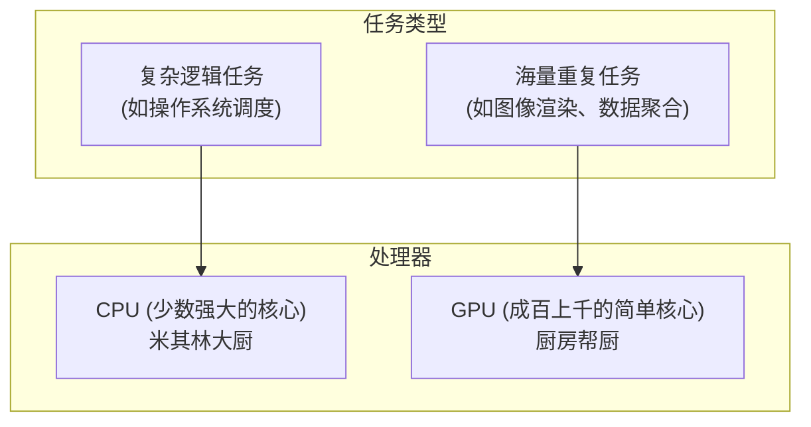
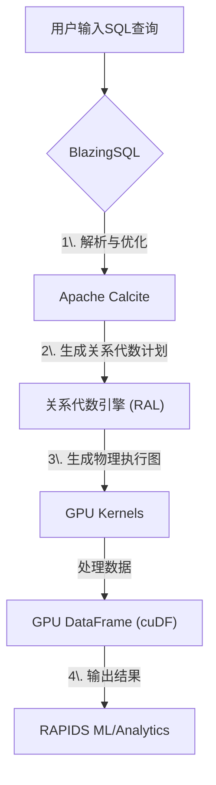
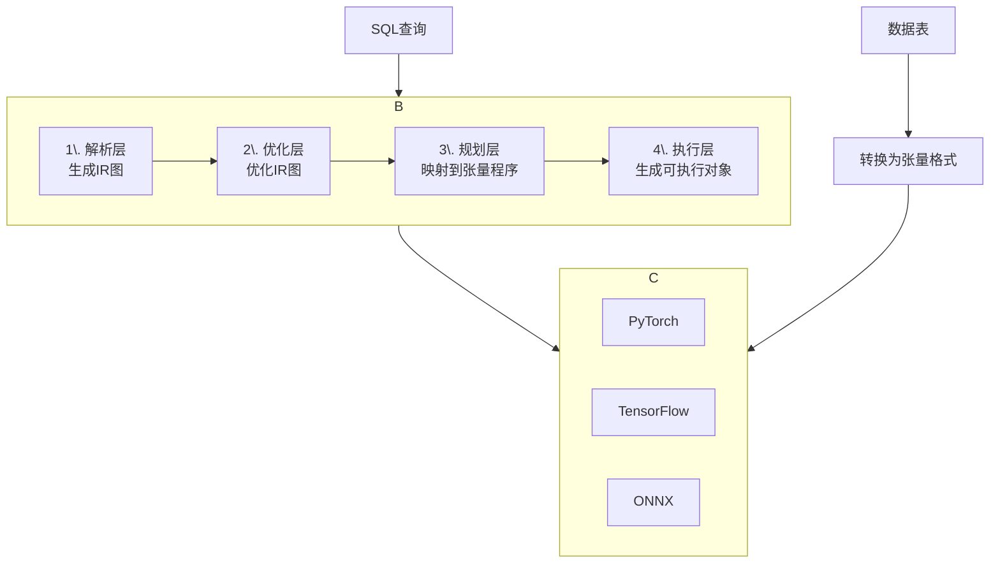
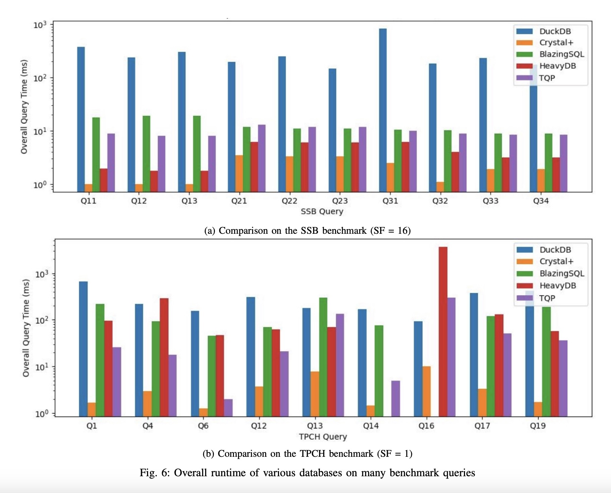

## AI论文解读 | A Comprehensive Overview of GPU Accelerated Databases
        
### 作者        
digoal        
        
### 日期        
2025-07-19       
        
### 标签        
PostgreSQL , PolarDB , DuckDB , AI , 论文解读        
        
----        
        
## 背景  
      
https://arxiv.org/pdf/2406.13831v1        
  
      
提示:        
```        
读懂《A Comprehensive Overview of GPU Accelerated Databases》这篇论文需要提前掌握哪些基础知识, 请使用中文给我讲一下这些基础知识, 尽量通熟易懂, 可以使用markdown支持的图形增加解释性.        
        
使用中文通熟易懂的解读《A Comprehensive Overview of GPU Accelerated Databases》这篇论文, 关键内容请深入讲解, 可以使用markdown支持的图形增加解释性.        
        
使用中文提取《A Comprehensive Overview of GPU Accelerated Databases》论文中一些重要的术语并详细解释, 可以使用markdown支持的图形示增加解释性.        
```        
        
## 1 前置知识 
  
好的，为了能让您轻松读懂《A Comprehensive Overview of GPU Accelerated Databases》这篇技术论文，我将为您梳理所需的核心基础知识，并用通俗易懂的语言和图表来解释。

-----

### 核心预备知识清单

要理解GPU如何为数据库“提速”，您需要先了解以下几个领域的基本概念：

1.  **硬件差异**：CPU 与 GPU 的根本区别是什么？
2.  **数据库类型**：什么是分析型数据库（OLAP）？
3.  **核心数据库技术**：什么是内存计算、列式存储和查询计划？
4.  **关键软件与框架**：论文中提到的 CUDA、RAPIDS 和张量（Tensor）是什么？
5.  **性能衡量标准**：TPC-H 和 SSB 是什么？

下面我们逐一讲解。

### 1\. 硬件差异：CPU vs. GPU —— “米其林大厨”与“厨房帮厨”

这是理解整篇论文的基石。您可以把计算机的处理器想象成一个厨房团队。

  * **CPU (中央处理器)**：就像厨房里的**米其林星级大厨**。

      * **特点**：他技艺高超，能力全面，可以处理任何复杂、精细的任务（比如做一道工序繁复的“佛跳墙”）。但这样的顶级大厨数量很少（核心数少，通常为几个到几十个）。
      * **擅长**：处理逻辑复杂的串行任务，即需要一步接着一步完成的工作。

  * **GPU (图形处理单元)**：则像厨房里的一大群**帮厨**。

      * **特点**：每个帮厨只会做一些简单、重复的工作（比如切菜、洗菜）。但他们人多势众（核心数多，成百上千），可以同时处理海量的食材。 
      * **擅长**：**大规模并行处理 (Massive Parallel Processing)**。即同时对海量数据执行相同的、简单的操作。 

**核心思想**：数据分析任务中，很多计算（如对上百万条销售记录求和）本质上是简单且重复的。这类任务交给CPU这个“大厨”来做，就像让他亲手切一百万个土豆，非常浪费他的才华且效率低下。而交给GPU这群“帮厨”同时开工，则能极快地完成。这篇论文就是研究如何高效地将数据库的计算任务分配给GPU。



### 2\. 数据库类型：OLAP —— 专为“商业洞察”而生

数据库主要分为两大类，而这篇论文聚焦于其中一种：

  * **OLTP (在线事务处理)**：用于处理日常交易，如银行转账、网购下单。特点是操作简单、高并发、要求快速响应。
  * **OLAP (在线分析处理)**：用于复杂的分析查询，帮助企业做决策。  例如，一位零售巨头的CEO可能会问：“过去一年，对比华北和华南地区，所有电子产品的销售总额、利润率和退货率分别是多少？”

这种OLAP查询需要扫描数百万甚至数十亿行数据，并进行聚合（求和、平均等）、连接（关联多个表）等复杂计算。这正是GPU并行计算能力的用武之地。论文中提到的**DuckDB**是一个经典的（基于CPU的）OLAP数据库，被用作性能比较的基线。 

### 3\. 核心数据库技术

#### 内存计算 (In-Memory Analytics)

传统数据库将数据存储在速度较慢的硬盘上。而内存计算则将数据尽可能多地加载到速度快几个数量级的内存（RAM）中进行处理。 

  * **瓶颈**：当数据量极大时，内存与处理器之间传输数据的速度，即**内存带宽 (Memory Bandwidth)**，成为新的瓶颈。 
  * **GPU的优势**：GPU为了处理海量图形数据，天生就配备了极高的内存带宽，远超CPU。  这使得GPU在内存计算场景下如鱼得水。

#### 列式存储 (Columnar Storage)

想象一张数据表，它有两种存储方式：

  * **行式存储**（传统）：`[1, '张三', '北京'], [2, '李四', '上海']`
  * **列式存储**（分析常用）：`[1, 2]`, `['张三', '李四']`, `['北京', '上海']`

当执行一个分析查询，如“计算所有用户的年龄总和”时，列式存储只需要读取“年龄”这一列的数据，而无需加载姓名、地址等无关列，从而极大地减少了I/O（数据读写）开销。  这对于需要扫描大量数据的OLAP查询至关重要。

#### 查询执行计划 (Query Execution Plan)

当您向数据库提交一条SQL查询语句时，数据库不会马上执行。它内部的 **“查询优化器”** 会先将SQL语句翻译成一个高效的执行步骤图，即“查询计划”。

例如，对于一个多表连接查询，是先过滤数据再连接，还是先连接再过滤，其执行效率可能相差巨大。论文中提到的**Apache Calcite**就是一个流行的SQL解析和优化工具，它负责生成这种查询计划，指导后续的计算。 

### 4\. 关键软件与框架

#### CUDA

由NVIDIA推出的并行计算平台和编程接口。它允许开发者直接使用C++等高级语言为GPU编写程序，是发挥GPU计算潜力的“官方工具包”。  论文中提到的GPU数据库，其底层加速能力都离不开CUDA。

#### RAPIDS 与 cuDF

  * **RAPIDS**：由NVIDIA牵头开发的一个开源软件库套件，目标是在GPU上执行端到端的数据科学流程。 
  * **cuDF**：RAPIDS的核心组件，你可以把它理解为**运行在GPU上的Pandas**（一个Python数据分析神器）。它提供了与Pandas几乎一样的接口，但其底层的数据结构和所有计算都在GPU上完成。  论文中的**BlazingSQL**就深度集成了RAPIDS和cuDF。 

#### 张量 (Tensor)

张量是数学中一个概念，可以看作是数字、向量、矩阵向更高维度的推广。

  * 0阶张量：一个单独的数字 (标量)
  * 1阶张量：一列数字 (向量)
  * 2阶张量：一个二维表格 (矩阵)

论文中提到的**Tensor Query Processor (TQP)系统，其创新之处在于将数据库的表和SQL操作，统一转换为张量以及对张量的计算。  然后，它利用PyTorch**、**TensorFlow**这些为深度学习而生、在GPU上执行张量运算效率极高的框架来完成数据库查询。 

### 5\. 性能衡量标准：TPC-H 与 SSB

为了公平地比较不同数据库系统的性能，业界制定了统一的“标准考卷”，即基准测试。

  * **TPC-H**：一个专门面向OLAP场景的决策支持基准测试。它包含一套复杂的商业分析查询和海量数据集，是衡量分析型数据库性能的“黄金标准”。 
  * **SSB (Star Schema Benchmark)**：可以看作是TPC-H的一个简化版本，同样用于测试分析查询性能。 

这篇论文正是利用这两个基准测试，在相同的硬件上对BlazingSQL、HeavyDB、Crystal+和TQP等系统进行了性能对比，从而得出结论。 

-----

**总结一下**，读懂这篇论文，您需要理解：GPU凭借其**大规模并行**和**高内存带宽**的特性，非常适合处理**OLAP**场景下的**海量、重复**计算；而现代GPU数据库正是利用**CUDA**、**RAPIDS**等技术，结合**列式存储**、**内存计算**等策略，将SQL**查询计划**高效地转化为GPU可以执行的任务，从而实现比传统CPU数据库快几个数量级的性能。论文中的不同系统（如TQP的张量化路径）则代表了实现这一目标的不同技术路线。
  
## 2 解读论文 
  
好的，这为您带来对论文《GPU加速数据库综合概述》（A Comprehensive Overview of GPU Accelerated Databases）的深度解读。本文将用通俗易懂的语言，结合图表，为您剖析其核心内容。

### **论文核心思想：数据库为何需要GPU？**

传统上，数据库运算由CPU（中央处理器）负责。您可以将CPU想象成一位能力超群的“米其林大厨”，他能处理各种复杂的任务，但分身乏术，效率有上限 。随着数据量爆炸式增长，尤其是在需要海量计算的数据分析（OLAP）场景下，CPU逐渐力不从心 。

这时，GPU（图形处理器）登场了。GPU就像成百上千名“厨房帮厨”，虽然每个人的技能单一，但他们可以同时处理海量的、重复性的工作（即**并行处理**）。此外，GPU拥有极高的**内存带宽**，这意味着它从内存中存取数据的速度非常快，这对于处理内存中的海量数据至关重要 。

这篇论文的核心，就是调研和比较了市面上几种利用GPU这两大优势来给数据库查询加速的系统，并分析了它们的架构、性能和适用场景。

### **四大GPU数据库系统深度剖析**

论文选取了四个各具特色的GPU数据库系统（BlazingSQL, OmniSciDB, Crystal+, TQP）和一个CPU基准（DuckDB）进行分析 。

#### 1\. BlazingSQL：深度融入RAPIDS生态的SQL引擎

  * **核心理念**：BlazingSQL不仅仅是一个独立的数据库，更是一个专为GPU数据科学生态系统RAPIDS打造的SQL接口 。它的目标是让数据从原始文件到最终的机器学习模型训练，整个流程都尽可能不离开GPU内存 。
  * **架构解读**：
    1.  **SQL解析**：用户输入SQL查询后，BlazingSQL通过一个名为JPype的工具，调用强大的**Apache Calcite**来解析和优化SQL，生成一个“关系代数”计划 。
    2.  **计划分发**：这个计划被分发给各个工作节点（Worker）。
    3.  **GPU执行**：在每个节点上，计划被翻译成具体的物理执行图（DAG），图中的每个节点是一个在GPU上运行的计算任务（Kernel），数据则以**GPU DataFrame (cuDF)** 的形式在这些任务间流转 。
    4.  **生态联动**：计算结果可以直接被RAPIDS生态中的其他库（如用于机器学习的cuML）调用，实现了GPU内数据处理的闭环 。




  * **特点**：与RAPIDS生态结合紧密，擅长大规模数据分析和机器学习整合（ETL）任务 。

#### 2\. OmniSciDB (现名 HeavyDB)：为实时分析与可视化而生

  * **核心理念**：一个功能完备的、以GPU为先的开源分析型数据库，特别强调对大规模数据集的实时查询和可视化能力 。

  * **架构解读**：

    1.  **统一接口**：系统通过**Apache Thrift**提供标准化的通信接口，无论是命令行工具还是外部应用，都通过它与数据库交互 。
    2.  **查询优化**：与BlazingSQL类似，它也使用**Apache Calcite**进行SQL的解析和优化 。
    3.  **数据管理**：一个中心化的**Catalog**模块负责管理所有数据库的元数据（如表结构、字典编码等）。
    4.  **GPU原生执行**：优化后的计划被送往执行器（Executor），该执行器利用**LLVM JIT（即时编译）技术**，为特定的查询和硬件动态生成高效的、可在GPU上运行的机器码 。
    5.  **内置可视化**：其一大亮点是拥有强大的后端渲染能力，能直接在服务器端将数十亿的数据点渲染成图像，再将图像传给前端，避免了传输海量数据点的瓶颈 。

  * **特点**：查询编译速度快，支持原生SQL，并提供强大的地理空间数据分析和内置可视化功能 。

#### 3\. Crystal+：追求极致性能的GPU原生库的演进

  * **核心理念**：Crystal+并非一个完整的数据库系统，而是源于一个名为Crystal的GPU原生查询库的改进版 。它的设计思想是：将工作数据集完全存储在GPU内存中，并通过高度优化的计算模块（device functions）来执行查询，最大限度地减少数据移动 。

  * **架构与改进**：

      * **Tile-based执行模型**：它将数据划分为一个个“瓦片”（Tile），每个GPU线程块负责处理一个瓦片，数据只需一次载入GPU共享内存，后续所有操作都在这块高速内存中完成，极大减少了I/O 。
      * **拥抱现代CUDA库**：与原始Crystal依赖内部数据结构不同，Crystal+ 使用了NVIDIA官方提供的高性能库，如**Thrust, Cub, 和 cuCollections**来重新实现核心操作（如Join和Group-by），这使其性能更佳且更具适应性 。例如，它利用`cuCollections`库实现了一个高效的哈希连接（Hash Join）操作 。
      * **查询计划来源**：它利用**Postgres**数据库的`EXPLAIN`功能来生成查询计划，然后根据计划手动组合其提供的GPU功能模块来执行查询 。

  * **特点**：性能极其出色，通过底层优化和利用最新NVIDIA库，在基准测试中大幅领先其他系统 。但它更像一个库的集合，而非一个开箱即用的完整数据库 。

#### 4\. Tensor Query Processor (TQP)：用AI框架处理SQL查询

  * **核心理念**：TQP提出了一种全新的范式：**将传统的关系型数据和SQL查询，统一转换成张量（Tensor）和对张量的计算** 。然后，它利用为人工智能（AI）和深度学习设计的、在GPU上效率极高的张量计算运行时（TCRs），如**PyTorch**或**TensorFlow**，来执行这些查询 。
  * **架构解读 (编译四部曲)** ：
    1.  **解析层 (Parsing Layer)**：将SQL查询转换成一个内部的IR图（中间表示）。
    2.  **优化层 (Optimization Layer)**：对IR图进行优化 。
    3.  **规划层 (Planning Layer)**：将优化后的IR图中的每个操作（如Join、Filter）映射到一个具体的张量计算程序 。
    4.  **执行层 (Execution Layer)**：生成最终的可执行对象，该对象能调用PyTorch等后端来执行张量计算 。




  * **特点**：设计理念新颖，目标是实现跨硬件和软件平台的**可移植性**，并统一关系型查询与机器学习（ML）工作流 。

### **性能评估：谁是真正的王者？**

论文通过两个标准的分析数据库基准测试（SSB和TPC-H）对这些系统进行了性能对比。

#### 定量比较（速度比拼）

*图片来源：*

从上方的图表（源自论文Figure 6）可以看出：   

  * **Crystal+一骑绝尘**：在几乎所有的测试中，Crystal+的执行时间都远低于其他系统，展现了其极致的性能优化 。例如，在TPC-H基准测试中，Crystal+的平均速度是TQP的17.66倍 。
  * **GPU并非万能**：在更复杂的TPC-H查询中（如Q16），一些GPU数据库（如HeavyDB）的性能甚至不如基于CPU的DuckDB 。这说明对于复杂的查询逻辑，CPU的强大单核能力依然有优势，而GPU数据库的优化尚未完全成熟。
  * **其他GPU系统表现**：BlazingSQL、HeavyDB和TQP在SSB基准测试中表现相近，且都明显优于CPU基准DuckDB 。

#### 定性比较（特性对比）

| 特性/方面 | BlazingSQL | HeavyDB (OmniSciDB) | CrystalDB\* | Tensor Query Processor (TQP) |
| :--- | :--- | :--- | :--- | :--- |
| **底层技术** | RAPIDS生态, Apache Calcite, cuDF  | GPU加速SQL引擎, 地理空间支持  | Serverless PostgreSQL  | 张量计算运行时 (如PyTorch, TVM)  |
| **数据处理** | 使用GPU DataFrames  | 高性能向量化, 高级内存管理  | 自动伸缩, 速度与可靠性优化  | 列式张量数据格式  |
| **核心优势** | 与RAPIDS库的互操作性, 外部数据源集成  | 服务器端渲染, Web可视化(需授权)  | 多租户管理, 安全合规  | 统一关系型和ML操作, 硬件无关  |
| **适用场景** | 大规模数据分析和机器学习  | 分析平台, 地理空间数据  | SaaS供应商, 多云部署  | 机器学习辅助的分析负载  |

*注：表格中的CrystalDB指的是一个商业化的、基于PostgreSQL的云数据库，其特性与论文中讨论的性能极佳的库Crystal+有所不同 。* 

### **结论与展望**

这篇论文全面地介绍了四种利用GPU加速数据库查询的前沿系统，并展示了它们在架构设计和性能上的差异。

  * **核心结论**：GPU数据库展现了巨大的性能潜力，特别是像Crystal+这样的系统，通过底层优化可以达到惊人的速度 。然而，该领域仍处于早期发展阶段 。在处理某些复杂查询时，GPU方案的性能可能不如成熟的CPU方案，且系统的易用性、稳定性和功能完整性仍有待提高。
  * **未来方向**：作者指出，为了进行更全面的比较，需要所有系统都开源 。未来的研究需要关注更多生产环境中的指标，如系统可靠性、安全性和真实工作负载下的成本等，以推动GPU数据库克服现有挑战，走向成熟和广泛部署 。
  
## 3 术语  
  
以下是论文《A Comprehensive Overview of GPU Accelerated Databases》中一些重要术语的中文解释：

  * **异构架构 (Heterogeneous Architectures)**: 指的是结合了不同类型处理器（如CPU和GPU）的计算系统，旨在利用各自的优势来提升整体性能。在数据分析领域，这种架构，尤其是GPU的整合，被证明能有效提升性能 。

  * **内存带宽 (Memory Bandwidth)**: 指的是数据在内存和处理器之间传输的速度。在内存分析中，由于GPU卓越的带宽能力，其应用在处理受内存带宽限制的工作负载时具有显著优势 。

  * **并行处理 (Parallel Processing)**: 指的是同时执行多个计算任务的能力。GPU因其强大的并行处理能力，在数据密集型工作负载中表现出卓越的效率，并且在数据处理速度上超越了传统的CPU 。

  * **SSB 基准 (SSB Benchmark)** 和 **TPC-H 基准 (TPC-H Benchmark)**:

      * **SSB (Star Schema Benchmark)**: 一个简化的基准测试模式，用于评估数据库系统在星型模型数据上的查询性能 。
      * **TPC-H (TPC Benchmark H)**: 一个更复杂、包含更多表格和更广泛查询操作的基准测试模式，通常用于评估决策支持系统 。

  * **OLAP (Online Analytical Processing)**: 在线分析处理。DuckDB就是一个进程内的SQL OLAP数据库管理系统，旨在高效支持分析查询工作负载 。

  * **cuDF**: 是RAPIDS项目的一部分，是一个基于CUDA的DataFrame库，为GPU上的数据操作提供类似Pandas的接口。BlazingSQL就作为一个为cuDF量身定制的强大SQL接口 。

  * **Apache Calcite**: 一个可插拔的SQL解析器和优化器框架。BlazingSQL和OmniSciDB都利用Apache Calcite将SQL查询转换为关系代数计划并进行优化 。

  * **关系代数引擎 (Relational Algebra Engine - RAL)**: 在BlazingSQL中，RAL负责生成分布式同构执行图，将SQL字符串转换为关系代数计划 。

  * **有向无环图 (Directed Acyclic Graph - DAG)**: 是一种数据结构，其中节点代表操作（如内核），边代表数据流（如缓存）。BlazingSQL将关系代数转换为物理关系代数计划，形成一个由内核和缓存组成的DAG 。

  * **缓存 (Cache)**: 在DAG中，缓存的目的是在计算阶段之间存储数据作为CacheData，从而允许数据在不同内存层之间移动，以扩展超越单层容量的限制 。

  * **Thrift 接口 (Thrift Interface)**: OmniSciDB使用Apache Thrift标准化外部客户端和内部进程的通信，促进与各种客户端工具的无缝交互 。

  * **目录 (Catalog)**: OmniSciDB中的目录组件通过集中式系统管理元数据。每个数据库都有自己的目录，所有这些都由一个系统目录协调，该系统目录通过SQLite数据库主动管理元数据存储库 。

  * **字典编码 (Dictionary Encoding)**: Crystal库使用字典编码将所有非数值数据转换为数值格式，以优化存储 。

  * **瓦片式执行模型 (Tile-based Execution Model)**: Crystal+的一个关键优势是其瓦片式执行模型。它将要操作的元素分解成瓦片，每个线程块负责一个瓦片，并将数据加载到GPU的共享内存中，从而限制了I/O带宽 。

  * **Thrust, Cub, cuCollections 库**: Crystal+通过使用NVIDIA的Thrust、Cub和cuCollections库重新实现原始的块操作，以利用GPU编程的最新进展，从而提高性能和模块化 。

  * **Tensor Query Processor (TQP)**: 一种新型的分析型数据库管理系统，旨在将关系数据库和张量计算的优势统一在一个框架中。TQP将传统的SQL查询转换为张量程序，并在PyTorch、TensorFlow、TVM、ONNX等张量计算运行时(TCRs)上执行 。

  * **张量计算运行时 (Tensor Computation Runtimes - TCRs)**: 指的是可以执行张量程序的框架，例如PyTorch、TensorFlow、TVM、ONNX等。TQP利用TCRs的计算能力，并提供TCR感知的查询优化器 。

TQP的编译阶段可以图示如下：

```
SQL Query
     |
     v
+--------------+
| Parsing Layer|  -> 构造内部中间表示(IR)图，描绘查询的物理计划 
+--------------+
     | IR Graph
     v
+-----------------------------+
| Canonicalization and        |
| Optimization Layer          |  -> 执行规范化并应用优化规则，生成优化后的IR图 
+-----------------------------+
     | Optimized IR Graph
     v
+---------------+
| Planning Layer|  -> 将优化后的IR图转换为操作符计划，包含每个操作符到张量程序实现的映射 
+---------------+
     | Operator Plan
     v
+----------------+
| Execution Layer|  -> 生成执行器对象，负责编排张量程序执行，支持动态编译到不同目标格式 
+----------------+
     |
     v
Target Formats (ONNX, TVM, PyTorch, Torch Script) 
```

  * **预测查询 (Prediction Queries)**: TQP提供与PyTorch模型和传统机器学习模型的无缝集成，支持预测能力。预测查询封装了训练好的机器学习模型，对输入数据进行预测，并可以结合机器学习操作和关系操作 。
  
## 参考        
         
https://arxiv.org/pdf/2406.13831v1  
        
        
<b> 以上内容基于DeepSeek、Qwen、Gemini及诸多AI生成, 轻微人工调整, 感谢杭州深度求索人工智能、阿里云、Google等公司. </b>        
        
<b> AI 生成的内容请自行辨别正确性, 当然也多了些许踩坑的乐趣, 毕竟冒险是每个男人的天性.  </b>        
    
  
