## AI论文解读 | Incremental Fusion: Unifying Compiled and Vectorized Query Execution
        
### 作者        
digoal        
        
### 日期        
2025-07-20       
        
### 标签        
PostgreSQL , PolarDB , DuckDB , AI , 论文解读        
        
----        
        
## 背景  
      
https://www.cs.cit.tum.de/fileadmin/w00cfj/dis/papers/inkfuse.pdf        
  
      
提示:        
```        
读懂《Incremental Fusion: Unifying Compiled and Vectorized Query Execution》这篇论文需要提前掌握哪些基础知识, 请使用中文给我讲一下这些基础知识, 尽量通熟易懂, 可以使用markdown支持的图形增加解释性.        
        
使用中文通熟易懂的解读《Incremental Fusion: Unifying Compiled and Vectorized Query Execution》这篇论文, 关键内容请深入讲解, 可以使用markdown支持的图形增加解释性.        
        
使用中文提取《Incremental Fusion: Unifying Compiled and Vectorized Query Execution》论文中一些重要的术语并详细解释, 可以使用markdown支持的图形示增加解释性.        
```        
        
## 1 前置知识 
  
好的，为了完全理解《Incremental Fusion》这篇论文，你需要先掌握一些数据库查询执行引擎领域的基础知识。这篇论文的核心在于提出一种新方法，以统一两种主流但相互对立的高性能查询执行技术。

我会将这些基础知识分为几个关键部分，并用通俗易懂的语言和图示来解释。

-----

### 核心背景：厨师如何准备一道复杂的菜肴？

想象一下，数据库执行一个查询（比如一条SQL语句），就像一个厨师要准备一道复杂的菜肴。菜谱就是 **查询计划 (Query Plan)**。厨师有两种不同的工作方式：

1.  **解释型厨师 (Interpreter)**：他有一套通用的厨房工具（比如刀、锅、勺子）。他严格按照菜谱的每一步，使用这些通用工具来操作。比如，菜谱说“切菜”，他就拿起刀来切；菜谱说“炒”，他就拿起锅来炒。
2.  **编译型厨师 (Compiler)**：他拿到菜谱后，不直接动手。他会先去设计和打造一台专门用于做这道菜的“全自动烹饪机”。这台机器把“切菜”、“放调料”、“翻炒”等步骤全部融合在一个流程里，原材料进去，成品菜肴直接出来。

这两种厨师（模型）各有优劣：

  * **解释型厨师** 上手快，拿到菜谱马上就能开工，但因为工具是通用的，来回切换工具会浪费一些时间，效率不是最优。
  * **编译型厨师** 打造机器需要时间，不能立刻出菜。但一旦机器造好，它的生产效率极高，因为所有步骤都无缝衔接。

《Incremental Fusion》这篇论文，就是要设计一种新的工作方式，让厨师既能像解释型厨师一样快速上手，又能享受到编译型厨师那种“定制机器”带来的极致效率。

-----

### 基础知识 1：解释执行模型 (The Interpreter Model)

这是数据库最传统和常见的工作方式。它又可以细分为两种。

#### a) 火山模型 (Volcano Model)

这是最经典的模型，也叫迭代器模型。你可以把它想象成一条流水线，每个操作员（算子，Operator）一次只处理 **一个** 数据项（元组，Tuple），然后把它传递给下一个操作员。

  * **工作方式**：上游算子调用下游算子的 `next()` 方法，下游算子就计算并返回一个结果。这个过程不断重复，就像火山喷发一样，一次冒一个“元组”。


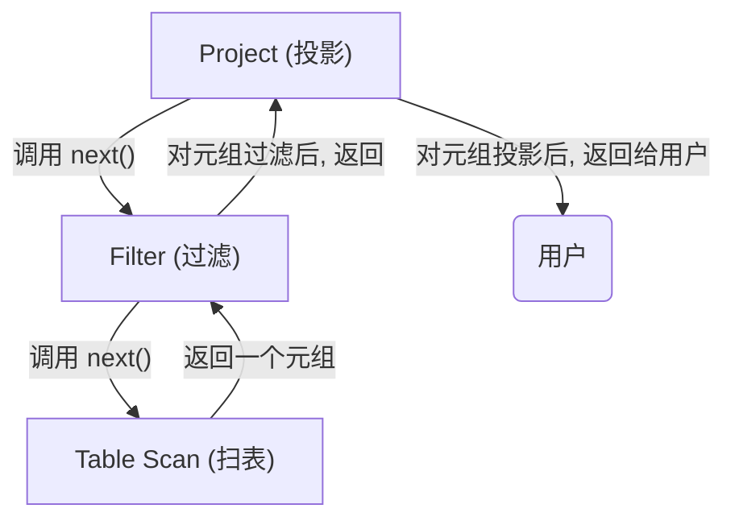

  * **缺点**：对于每一条数据，都有大量的函数调用开销，就像流水线工人每次只传递一个零件，大部分时间都花在交接上了，在现代CPU上性能很差。

#### b) 向量化执行模型 (Vectorized Execution Model)

为了解决火山模型的低效率问题，向量化模型应运而生。它不再一次处理一个元组，而是 **一次处理一批（一列）数据**，也就是一个向量 (Vector)。

  * **工作方式**：算子之间传递的是一个数据块（通常是按列存储的）。算子内部是一个优化的循环，对整个数据块进行计算。


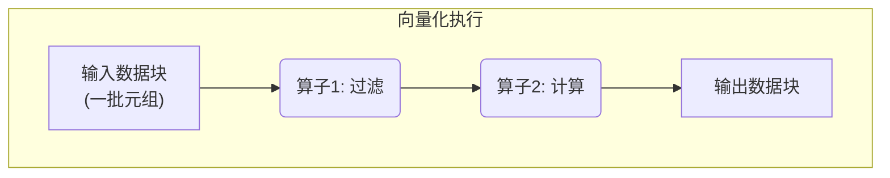

  * **优点**：
      * **分摊开销**：函数调用的成本被分摊到一批数据上，大大降低了单位数据的开销。
      * **CPU友好**：处理连续的列式数据块，能更好地利用CPU缓存和SIMD（单指令多数据流）指令，实现并行计算，性能极高。
  * **代表系统**：DuckDB, ClickHouse。这篇论文中主要拿 **DuckDB** 作为向量化引擎的代表进行比较。

-----

### 基础知识 2：编译执行模型 (The Compiler Model)

这种模型采取了更激进的方式来追求极致性能。

#### a) 即时编译 (Just-In-Time, JIT)

它不会使用预先写好的通用算子函数，而是针对 **每一个具体的查询**，在运行时动态地生成高度优化的、定制化的机器码。

#### b) 算子融合 (Operator Fusion)

这是编译执行的核心技术。它会将查询计划中可以连续执行的多个算子（比如“扫表 -\> 过滤 -\> 投影”）“融合”成一个紧凑的循环（tight loop）。

  * **工作方式**：
      * **传统方式**：扫表，结果存入内存 -\> 读取内存，过滤，结果存入内存 -\> 读取内存，投影，返回结果。
      * **融合后**：在一个大循环里，直接从表里读一条数据，立即判断是否满足过滤条件，如果满足，马上计算投影，然后处理下一条。


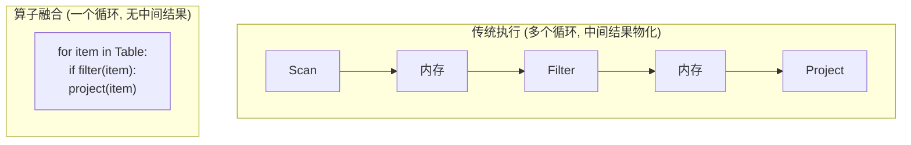

  * **优点**：
      * **消除中间数据**：数据在处理过程中一直保留在CPU寄存器中，无需写入和读出内存，极大减少了内存访问开销。
      * **消除虚函数调用**：生成的代码是直接的、具体的，没有间接调用开销。
      * **性能极高**：对于计算密集型的查询，这种方式通常能达到硬件的性能极限。
  * **缺点**：
      * **编译延迟 (Compilation Latency)**：生成和编译代码本身需要时间（从几十到几百毫秒不等）。如果查询本身很快就能执行完（比如处理小数据量），那么编译时间可能比执行时间还长，得不偿失。
  * **代表系统**：Umbra, Hyper。论文中主要拿 **Umbra** 作为编译引擎的代表。

-----

### 基础知识 3：论文的核心创新点：子算子中间表示 (Sub-operator IR)

理解了上述两种模型的对立和优劣后，就能明白这篇论文想解决什么问题了。它如何做到“鱼与熊掌兼得”？答案就是引入一个更底层的抽象：**子算子 (Sub-operator)**。

  * **传统算子的问题**：像 `Aggregate` (聚合) 或 `Filter` (过滤) 这样的传统算子，其具体实现会因为列的数量、类型、过滤条件等千变万化，导致它们的组合是“无限”的。你不可能为每一种可能都预先准备好一个向量化函数。

  * **子算子的思想**：将这些复杂的、“无限”的算子，拆解成一组有限的、更基础的“原子”操作。

      * 例如，一个 `Filter` 操作可以被拆解为：
        1.  一个 `Branch` (分支) 子算子：根据一个布尔列的值决定代码走哪个分支。
        2.  N个 `Copy` (复制) 子算子：在分支内部，将被保留的行从输入列复制到输出列。每个 `Copy` 只负责一种数据类型（如 `Copy Int`, `Copy String`）。


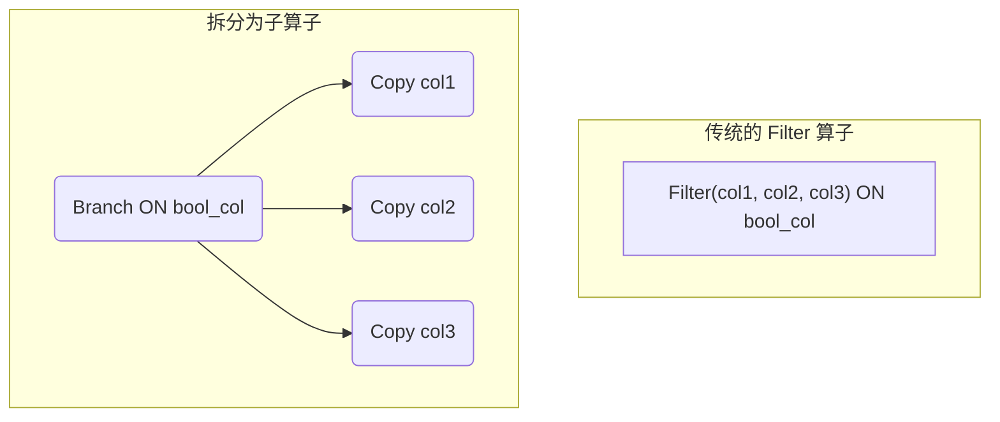

  * **神奇之处**：
    1.  **有限集合**：这些子算子（如 `Branch`, `Copy Int`, `Add Int`, `Hash` 等）的数量是**有限的**。
    2.  **“免费”获得向量化解释器**：因为子算子的集合是有限的，引擎可以在启动时，利用自身的**编译能力**，为**每一个**子算子生成一个高效的、预编译好的向量化函数（即论文中的 "primitive"）。这样就“免费”得到了一整套完整的向量化解释器！
    3.  **灵活融合**：当一个新查询到来时：
          * **追求低延迟**：可以立即使用预编译好的子算子函数（向量化解释器模式）来执行，没有编译延迟。
          * **追求高性能**：可以像传统编译引擎一样，将这些子算子在JIT过程中**重新融合**成一个大的、高效的循环（编译执行模式）。
          * **混合执行**：甚至可以在一个查询的不同阶段，动态地切换使用这两种模式。

### 总结你需要掌握的基础知识：

1.  **两种执行模型**：
      * **解释执行**：特别是其中的**向量化模型**，理解其“一次一批”和CPU友好的特性。
      * **编译执行**：理解其**JIT编译**和**算子融合**的思想，以及它在高性能和编译延迟之间的权衡。
2.  **核心概念**：
      * **查询计划 (Query Plan)**：SQL语句如何被解析成算子树。
      * **算子 (Operator)**：构成查询计划的基本单元，如`Scan`, `Filter`, `Join`, `Aggregate`。
      * **元组 (Tuple)**：数据库表中的一行数据。
      * **中间表示 (Intermediate Representation, IR)**：一种介于高级语言（如查询计划）和低级语言（如机器码）之间的表示，是编译过程的桥梁。

掌握了这些，你就能清晰地理解论文中这张图的含义了：

  * **横轴**：处理计算密集型查询的能力（从差到好）。
  * **纵轴**：实现低延迟的难度（从易到难）。
  * **Volcano**：两者都差。
  * **Vectorized (向量化)**：低延迟容易，但计算密集型查询性能有上限。
  * **Compiling (编译)**：计算密集型查询性能最好，但实现低延迟很难（因为有编译开销）。
  * **Incremental Fusion (本文方案)**：试图占据右上角的最佳位置，既能实现低延迟，又能获得最高的计算性能。

希望这个解释能帮助你更好地读懂这篇优秀的论文！
  
## 2 解读论文 
  
好的，我们来一起深入解读这篇非常精彩的论文——《Incremental Fusion: Unifying Compiled and Vectorized Query Execution》。

我会将解读分为几个部分：首先用一个通俗的比喻来建立核心概念，然后深入讲解两种主流技术及其矛盾，接着剖析论文提出的核心方案“增量融合”是如何巧妙地解决这些矛盾的，最后总结其架构和优势。

### 引子：两种不同的“造车”哲学

想象一下，你要为客户“按需造车”。客户的需求（SQL查询）千变万化。你有两种造车方式：

1.  **“模块化”造车厂 (Vectorized / 向量化执行)**：

      * **理念**：车厂预先生产了大量标准化的、高性能的“零件模块”（如发动机、底盘、车轮）。
      * **流程**：当订单（查询）来了，工人（解释器）就从仓库里拿出这些现成的模块，快速组装成一辆车 。整个过程非常快，车子可以立刻交付 。
      * **优劣**：**优点**是响应速度极快，没有等待时间。**缺点**是由于零件是通用的，模块之间组装的接口会产生一些性能开销，整车性能并非理论上的最优。

2.  **“一体化铸造”工厂 (Compiled / 编译执行)**：

      * **理念**：工厂不预生产任何零件。
      * **流程**：当订单（查询）来了，工程师会根据需求设计一张“一体化”的蓝图，然后用一整块金属，通过复杂的铸造和编译过程，直接造出一辆完整的、无缝衔接的“单体车” 。
      * **优劣**：**优点**是这辆单体车性能极致，因为没有任何组装接缝，能量传动效率最高 。**缺点**是“设计蓝图”和“铸造”（即时编译）的过程非常耗时 。客户需要等待很长时间才能拿到车。

这两种模式代表了现代分析型数据库（OLAP）查询引擎的两个极端。**向量化**追求低延迟和快速响应，而**编译执行**追求极致的计算性能。两者似乎不可兼得。

这篇论文的石破天惊之处在于，它提出了一种新的“造车”哲学，**它利用“一体化铸造”的能力，去“免费”生产出了一整套“模块化”的零件，从而将两种模式的优点完美统一起来** 。

-----

### 核心矛盾：两种主流查询执行范式

#### 1\. 向量化执行 (Vectorized Execution)

向量化执行通过批处理数据来摊销解释执行的开销 。数据以列存的形式，在不同的预编译“原语”（Primitives）之间流动，每个原语都是一个处理数据批次的优化函数 。

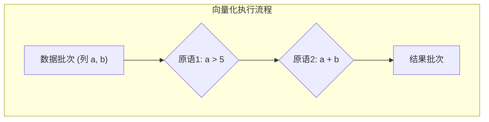

  * **优点**:
      * **即时执行**: 查询可以立即开始，因为所有“原语”都是预先编译好的，没有启动延迟 。
      * **易于构建**: 相比编译引擎，向量化引擎的构建、调试和维护更简单 。
  * **缺点**:
      * **解释开销**: 尽管被摊销，但函数调用和数据在原语之间移动的开销依然存在 。
      * **性能天花板**: 数据需要在不同原语之间经过内存或缓存，无法像编译执行那样一直将数据保留在CPU寄存器中，这限制了其在计算密集型任务上的峰值性能 。
      * **代表**: DuckDB 。

#### 2\. 编译执行 (Compiled Execution)

编译执行为每个查询生成定制化的机器码，其核心技术是 **算子融合（Operator Fusion）** 。它将查询计划中的多个算子（如扫表、过滤、计算）融合进一个单一的、紧凑的循环中 。

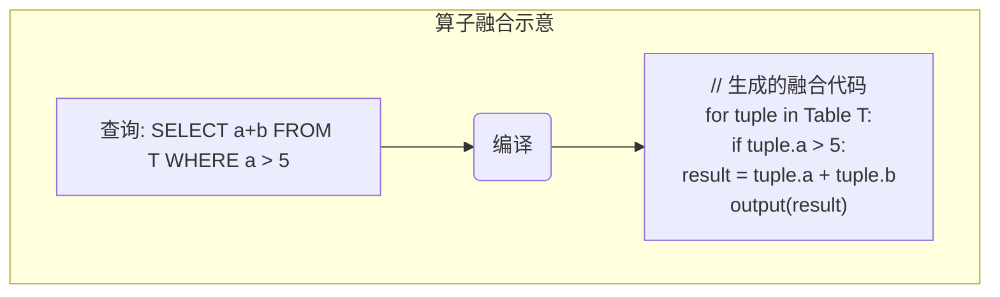

  * **优点**:
      * **极致性能**: 通过将数据保留在CPU寄存器中跨越多个逻辑算子，消除了大量的内存访问和函数调用开销，性能极高 。
  * **缺点**:
      * **编译延迟 (Compilation Latency)**: 在执行前，必须花费时间（可能数百毫秒）来生成和编译代码 。对于小数据量或短查询，这个延迟是致命的。
      * **系统复杂性**: 为了缓解编译延迟，高性能编译引擎通常需要构建极其复杂的、多层次的编译栈，开发难度极大 。
      * **代表**: Umbra 。

-----

### 论文的解决方案：增量融合 (Incremental Fusion)

“增量融合”提出了一种全新的架构，它是一个编译引擎，但通过一个巧妙的抽象，免费地生成了自己的向量化解释器，从而统一了上述两种模式。

#### 核心机制：子算子中间表示 (Sub-operator IR)

这是整篇论文的基石。传统的关系算子（如`Filter`, `Aggregate`）太过复杂，其具体行为参数组合近乎无限 。例如，一个`Filter`可以过滤任意数量、任意类型的列。这使得为所有可能的`Filter`都预编译一个向量化原语成为不可能。

增量融合通过将这些复杂算子分解为一组**有限的、更基础的“子算子”**来解决这个问题 。

**一个绝佳的例子：Filter算子的分解 **

一个在布尔列上过滤N个数据列的`Filter`操作，会被分解为：

  * **1个 `Branch` (分支) 子算子**: 它没有参数，只负责根据输入的布尔列产生一个执行分支 。
  * **N个 `Copy` (复制) 子算子**: 每个`Copy`子算子只依赖于`Branch`子算子，并在分支内部执行 。它的参数仅仅是它所复制的数据类型（如`Copy(Int8)`, `Copy(Float4)`) 。


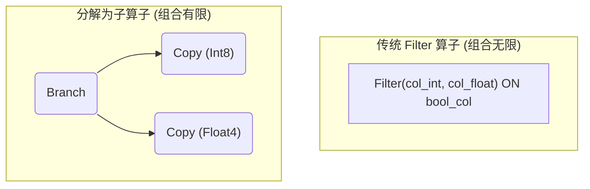

这个分解引出了论文的核心不变量：

#### 关键理论：枚举不变量 (Enumeration Invariant)

**定义**：一个算子如果能被分解，且其所有可能的参数化实例都属于一个**可枚举的有限集合**，那么它就满足枚举不变量 。

**为什么重要？**
因为一旦所有构建块（子算子）都满足这个不变量，引擎就可以在启动前，**枚举出所有可能的子算子实例** 。

**“免费”的解释器诞生了！**
对于每一个枚举出的子算子实例（例如 `Copy(Int8)`），引擎可以：

1.  用一个`Tuple Buffer Source`（从内存块读数据）作为其输入。
2.  用一个`Tuple Buffer Sink`（向内存块写数据）作为其输出。
3.  然后调用**自身的代码生成器**，将这“输入-处理-输出”的流程编译成一个独立的、高效的函数 。

这个编译好的函数，其功能与手动编写的**向量化原语完全相同**！通过为所有可能的子算子都执行此操作，引擎在启动时就拥有了一套完整的、高性能的向量化解释器，而这几乎是其编译能力的**免费副产品** 。

### InkFuse原型机的工作流程

论文通过其原型系统InkFuse展示了这套流程的实际运作（见论文图7）。 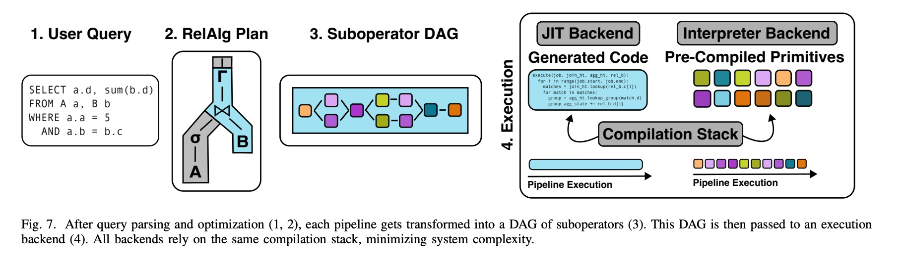  

1.  **查询解析与优化**: 用户查询被转换为优化的关系代数计划 。
2.  **生成子算子DAG**: 每个代数计划流水线被转换为一个由子算子组成的有向无环图（DAG） 。
3.  **执行后端选择**: 此时，引擎可以灵活选择如何执行这个DAG 。
      * **解释后端 (Interpreter Backend)**: 立即开始执行。它遍历DAG，对每个子算子，调用其预编译好的向量化原语函数 。**优点：无延迟**。
      * **JIT后端 (JIT Backend)**: 采用传统的编译模式。它将整个DAG作为输入，通过算子融合技术生成一段高度优化的定制代码 。**优点：高性能**。
      * **混合后端 (Hybrid Backend)**: 论文的终极形态，它结合了两者的优点 。
          * 查询到达后，**立即用解释后端开始处理数据**，同时在后台线程启动JIT后端的编译过程 。
          * 一旦JIT编译完成，引擎会根据每个数据块（morsel）的执行情况，动态监测并切换到当前吞吐量更高的后端（解释或编译） 。

这个混合模式完美地**用解释执行的即时性，掩盖了编译执行的延迟**，同时又能在查询足够长时，享受到编译执行的极致性能 。

### 结论与意义

《Incremental Fusion》不仅仅是一种技术优化，它为查询引擎的设计提供了一个全新的、更优雅的架构。

1.  **统一了两种对立范式**: 它首次提出了一个能将向量化解释器的即时可用性与算子融合编译器的峰值性能相结合的执行范式 。
2.  **显著降低系统复杂性**: 传统编译引擎为了实现低延迟，需要开发极其复杂的快速编译路径 。增量融合通过其“免费”的解释器，使得这个复杂路径变得多余，整个系统可以用一套统一的编译栈来构建，更易于开发和维护 。
3.  **实现全面的高性能**: 实验结果表明，InkFuse无论是在需要低延迟的小数据量场景，还是在需要高吞吐的计算密集型大数据场景，都能与业界顶尖的DuckDB和Umbra相媲美，甚至超越它们 。

总而言之，这篇论文通过“子算子”这一精妙的抽象，釜底抽薪地解决了查询执行领域长期存在的“低延迟”与“高性能”的矛盾，为下一代数据库系统的构建指明了一条清晰的道路。
  
## 3 术语  
  
好的，这篇论文《Incremental Fusion: Unifying Compiled and Vectorized Query Execution》引入了一些关键的术语来描述其创新的查询执行架构。以下是对其中一些重要术语的中文解读，并配有图示以帮助理解。

-----

### 1\. 向量化执行 (Vectorized Execution)

这是一种解释型查询执行模型 。它不是一次处理一行数据（元组），而是操作一个“向量”，即一批元组 。引擎会使用一系列预先编译好的、细粒度的“原语”（primitives）来组合完成复杂的算子操作 。例如，一个哈希连接操作会被分解为用于计算哈希、物化行、插入哈希表等多个原语 。

  * **优点**：通过批处理，极大地分摊了单次操作的解释开销，并且其可预测的数据访问模式对现代CPU的缓存和预取非常友好 。
  * **代表系统**：DuckDB, ClickHouse。


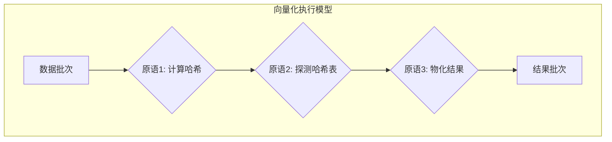

### 2\. 编译执行 (Compiled Execution)

这是一种与向量化执行相对的高性能查询处理方法 。它的核心思想是**即时编译 (Just-in-Time, JIT)**，即为每一条查询动态生成高度优化的、专门的机器码 。

其关键技术是 **算子融合 (Operator Fusing)**，它能将一个查询流水线中的多个关系算子（如扫表、过滤、投影）无缝地“融合”进一个单一的、紧凑的循环中 。

  * **优点**：数据可以长时间保留在CPU寄存器中，无需在算子之间反复读写内存，从而最大限度地减少内存访问开销，达到极高的计算性能 。
  * **缺点**：在查询执行前，代码生成和编译本身需要时间，这会带来显著的**编译延迟 (Compilation Latency)** 。


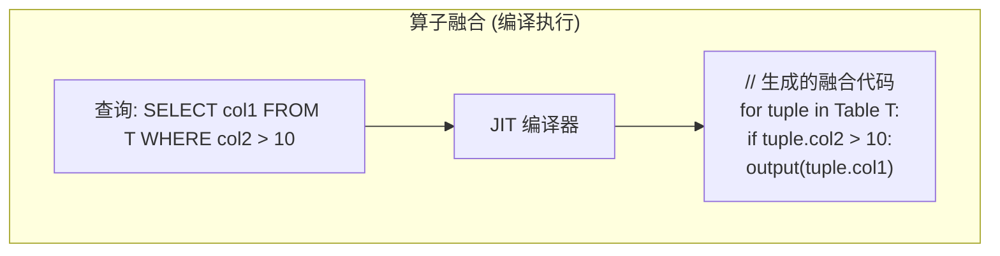

### 3\. 子算子 (Sub-operator)

这是“增量融合”范式中最重要的抽象概念 。它是一种比传统关系代数算子（如 `Filter`, `Join`）粒度更细的构建模块 。引擎不再对复杂的关系算子进行操作，而是对这些更简单、更基础的子算子进行代码生成和融合 。

例如，一个复杂的 `Filter` 算子可以被分解成一个 `Branch`（分支）子算子和多个 `Copy`（复制）子算子 。在InkFuse原型机中，仅用20个子算子便可表达任意的SQL查询 。

### 4\. 枚举不变量 (Enumeration Invariant)

这是增量融合引擎中所有算子都必须遵守的核心设计准则 。

  * **定义**：一个算子，如果其所有可能的参数化实例都来自于一个**可被枚举的有限集合**，那么它就满足“枚举不变量” 。
  * **重要性**：这个不变量是实现“增量融合”的理论基石。正因为子算子的可能实例是有限的，引擎才可以在启动前**枚举出所有可能的情况**，并为每一种情况预先生成一个向量化原语 。这确保了无论用户提交何种查询，系统中总有对应的预编译模块可以使用 。

### 5\. 增量融合 (Incremental Fusion)

这是论文提出的、统一了编译执行和向量化执行的新型查询执行范式 。其核心思想是：**一个编译引擎，通过精巧的抽象，生成了自己的向量化解释器** 。

它通过使用满足“枚举不变量”的子算子作为代码生成的基础 ，为每一个子算子实例包裹上数据输入/输出的逻辑，然后利用自身的编译能力生成对应的向量化原语。这样，一个完整的、高性能的向量化解释器就成了编译引擎的“免费副产品” 。

这使得引擎能够动态地在两种模式间切换：

  * **向量化解释**：用于低延迟、快速启动的场景 。
  * **算子融合代码生成**：用于计算密集的、长时运行查询的场景，以追求最高性能 。

### 6\. 执行后端 (Execution Backends)

在InkFuse中，一个子算子DAG（有向无环图）可以被分发给不同的后端执行 。

  * **解释器后端 (Interpreter Backend)**：此后端使用引擎启动时就已加载的预编译原语来执行查询 。它遍历DAG，为每个子算子调用对应的原语函数，实现即时查询响应 。
  * **JIT后端 (JIT Backend)**：此后端采用传统的编译模式，接收整个DAG并将其融合成单一的、高度优化的可执行代码块 。
  * **混合后端 (Hybrid Backend)**：这是一个自适应的后端，它结合了前两者的优点 。
      * 当查询到达时，它立即使用**解释器后端**开始处理数据，同时在后台启动**JIT后端**进行编译 。
      * 一旦编译完成，它会监测两种模式的实时性能（元组吞吐量），并为后续的数据块动态选择最快的一种执行方式 。
      * 这种方式巧妙地用解释执行掩盖了编译延迟，同时保留了在长查询中从编译执行中获益的能力 。


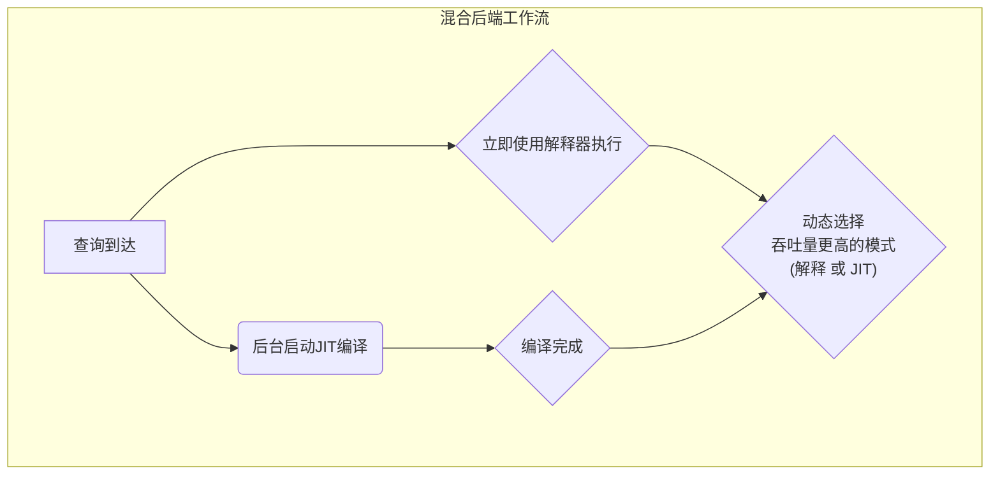
  
## 参考        
         
https://www.cs.cit.tum.de/fileadmin/w00cfj/dis/papers/inkfuse.pdf  
        
        
<b> 以上内容基于DeepSeek、Qwen、Gemini及诸多AI生成, 轻微人工调整, 感谢杭州深度求索人工智能、阿里云、Google等公司. </b>        
        
<b> AI 生成的内容请自行辨别正确性, 当然也多了些许踩坑的乐趣, 毕竟冒险是每个男人的天性.  </b>        
    
  
