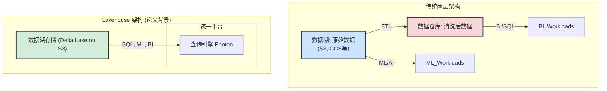
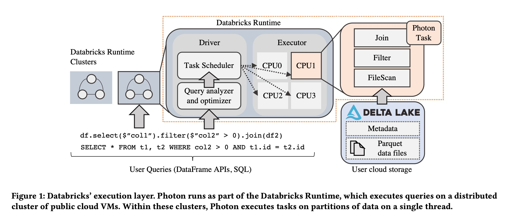
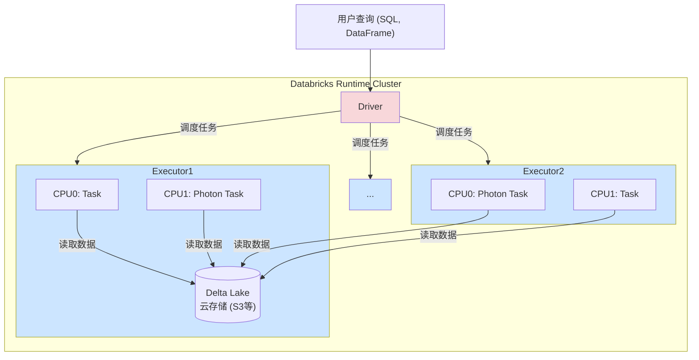
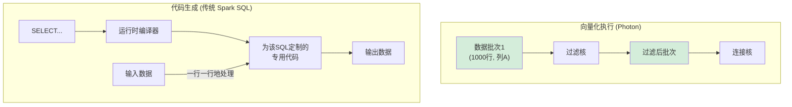
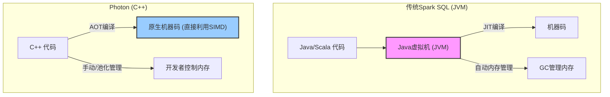
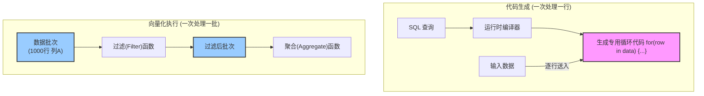
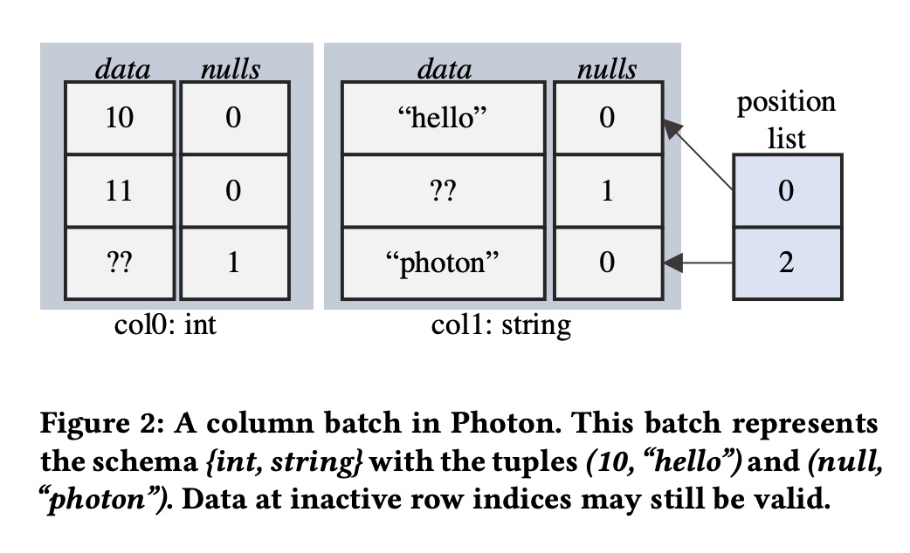

## AI论文解读 | Photon: A Fast Query Engine for Lakehouse Systems
        
### 作者        
digoal        
        
### 日期        
2025-07-20       
        
### 标签        
PostgreSQL , PolarDB , DuckDB , AI , 论文解读        
        
----        
        
## 背景  
      
https://people.eecs.berkeley.edu/~matei/papers/2022/sigmod_photon.pdf        
  
      
提示:        
```        
读懂《Photon: A Fast Query Engine for Lakehouse Systems》这篇论文需要提前掌握哪些基础知识, 请使用中文给我讲一下这些基础知识, 尽量通熟易懂, 可以使用markdown支持的图形增加解释性.        
        
使用中文通熟易懂的解读《Photon: A Fast Query Engine for Lakehouse Systems》这篇论文, 关键内容请深入讲解, 可以使用markdown支持的图形增加解释性.        
        
使用中文提取《Photon: A Fast Query Engine for Lakehouse Systems》论文中一些重要的术语并详细解释, 可以使用markdown支持的图形示增加解释性.        
```        
        
## 1 前置知识 
  
好的，为了完全理解《Photon: A Fast Query Engine for Lakehouse Systems》这篇论文，你需要对数据管理架构、分布式计算以及数据库内核实现等领域有一些基础知识。

下面我将为你梳理这些核心概念，并尽量用通俗易懂的语言和图示来解释。

### 1\. 数据管理架构的演进：从数仓到数据湖，再到湖仓一体 (Lakehouse)

这篇论文的背景就是所谓的 "湖仓一体" (Lakehouse) 架构 。要理解它，我们得先知道它解决了什么问题。

  * **数据仓库 (Data Warehouse)**

      * **是什么？** 一个高度结构化、经过清洗和整合的数据中央存储库。你可以把它想象成一个井井有条的图书馆，所有书籍（数据）都已分门别类，贴好标签，方便你快速查找和分析。
      * **优点：** 查询性能极高，支持复杂的 SQL 分析和商业智能 (BI) 报表 。
      * **缺点：** 只能处理结构化数据，存储和计算成本高昂，数据需要经过复杂的 ETL（抽取、转换、加载）过程才能入库，导致数据不够实时 。

  * **数据湖 (Data Lake)**

      * **是什么？** 一个可以存储海量、各种格式（结构化、半结构化、非结构化）原始数据的系统 。就像一个巨大的仓库，你可以把任何东西（原始日志、图片、文档、表格）都先扔进去，以后再想怎么用。
      * **优点：** 灵活性高，存储成本低，非常适合机器学习等需要原始数据的场景。
      * **缺点：** 缺乏管理，容易变成“数据沼泽”(Data Swamp)，没有事务保证 (ACID)，数据质量和可靠性难以保证 。

  * **湖仓一体 (Lakehouse)**

      * **是什么？** 这篇论文的核心背景。它试图将数据仓库的强大管理功能（如 ACID 事务、数据治理）和高性能 SQL 查询，直接应用在数据湖的低成本、开放格式的存储之上 。
      * **目标：** 鱼与熊掌兼得。既有数据湖的灵活性和低成本，又有数据仓库的高性能和可靠性，从而简化数据架构，避免数据冗余和同步问题 。Photon 就是为了在 Lakehouse 架构上实现极致查询性能而设计的引擎 。




### 2\. 分布式计算框架：Apache Spark

Photon 并不是一个独立的系统，它被深度集成在 Databricks 运行时 (DBR) 中，而 DBR 是基于 **Apache Spark** 的 。因此，了解 Spark 的基本工作模式至关重要。

  * **核心思想：** “分而治之”。将一个巨大的计算任务，拆分成很多个小任务 (Tasks)，分配到多个计算节点（机器）上并行处理 。
  * **基本架构 (Driver/Executor 模型)：**
      * **Driver (驱动节点):** 整个应用的“总司令”。它负责接收用户的查询请求（SQL 或 DataFrame API），将查询解析、优化成一个执行计划，然后将任务分配给 Executor 们 。
      * **Executor (执行节点):** “工兵”。它分布在不同的机器上，每个 Executor 包含多个 CPU 核心，负责执行 Driver 分配过来的具体任务，比如读取一部分数据文件、进行计算等 。Photon 主要就是在 Executor 内部，负责单线程上的具体数据处理任务 。

这篇论文的图1完美地展示了这个架构： 



*简化的 Spark Driver/Executor 模型，Photon 运行在 Executor 的任务中 。*

### 3\. 查询引擎的核心技术对决

这是理解 Photon 设计选择的重中之重。论文花了大量篇幅来论证为什么选择A而不是B。

  * **数据内存布局：行存 (Row-based) vs. 列存 (Columnar)**

      * **行存：** 数据按行连续存储。`[记录1], [记录2], ...`。适合一次性需要读取整条记录的场景。
      * **列存：** 数据按列连续存储。`[所有记录的列A], [所有记录的列B], ...` 。这非常适合分析查询，因为查询通常只关心少数几列。
      * **Photon 的选择：** **列存** 。因为它更利于压缩、更适合现代 CPU 的缓存机制，并且能更好地利用 SIMD 指令进行并行计算 。同时，底层数据源 (如 Parquet, Delta Lake) 本身就是列存格式，这样可以避免昂贵的数据转换 。

  * **执行模型：向量化执行 (Vectorized) vs. 代码生成 (Code Generation)**

      * **代码生成 (Spark SQL 的旧模型)：** 可以理解为一个“运行时编译器”。它针对每一条具体的 SQL 查询，动态生成高度优化的 Java 字节码并执行 。优点是消除了虚函数调用和解释开销，理论性能好。缺点是实现复杂、编译有开销、难以调试和观察 。
      * **向量化执行 (Photon 的选择)：** 不为每条查询生成新代码，而是拥有一套预先编译好的、高度优化的函数库（称为 Kernels）。数据不是一行一行地处理，而是一批一批（一个“向量”或“批次”）地流经这些函数 。
      * **为什么选择向量化？** 论文给出的理由是：
          * **开发和调试更简单** 。
          * **更容易实现运行时自适应** (Adaptive Execution)，即根据当前批次的数据特性（如有没有NULL值、字符串是否都是ASCII）动态选择最优的处理路径 。
          * **可观测性更好**，能清晰地知道每个算子花了多少时间 。




*向量化执行以“批”为单位，而代码生成为查询“量身定做”代码。*

### 4\. 底层实现技术

  * **C++ vs. JVM (Java 虚拟机)**

      * 传统 Spark SQL 运行在 JVM 上。Photon 则选择用 **C++** 重写了核心引擎 。
      * **原因：** 原始的 JVM 引擎遇到了性能瓶颈。C++ 提供了对内存更精细的控制、手动管理内存避免了 JVM 的垃圾回收 (GC) 停顿问题，并且能直接使用 SIMD 指令集来压榨硬件性能 。

  * **SIMD (Single Instruction, Multiple Data)**

      * “单指令，多数据流”。这是现代 CPU 的一种能力，可以用一条指令同时对多个数据执行相同的操作（例如，同时对4个整数做加法）。
      * 这与**向量化执行**是天作之合。因为数据在内存中是按列连续存储的，非常适合用 SIMD 来进行批量处理 。

  * **JNI (Java Native Interface)**

      * 既然 Photon 是 C++ 实现的，而它又运行在基于 JVM 的 Spark Executor 进程中，那么 C++ 代码和 Java 代码如何通信呢？答案就是 **JNI** 。它像一座桥梁，允许在 JVM 中调用本地（如C++）代码库。论文提到，通过批处理，JNI 的开销可以被有效分摊 。

### 总结

掌握了以上基础知识后，你再读这篇论文就会豁然开朗。你会明白：

1.  **论文的背景**：是在 Lakehouse 这个新兴架构下，对查询性能的极致追求。
2.  **Photon 的定位**：一个内嵌于 Spark、用 C++ 编写的高性能向量化查询执行引擎。
3.  **核心设计抉择**：它为什么选择 `C++`、`列存` 和 `向量化执行`，而不是沿用 Spark 已有的 `JVM`、`行存` 和 `代码生成` 模型。
4.  **关键实现细节**：它如何利用 `SIMD` 提升计算效率，如何通过 `JNI` 与现有的 Spark 生态集成，以及如何实现自适应执行等高级优化。
  
## 2 解读论文 
  
好的，我们来一起深入解读这篇在数据系统领域非常重要的论文——《Photon: A Fast Query Engine for Lakehouse Systems》。我会为你剖析其核心思想、设计抉择和技术实现，并用图表辅助解释。

### 论文速览：Photon是什么？它解决了什么问题？

想象一下，现代企业的数据管理面临一个两难的困境：

1.  **数据湖 (Data Lake)**：像一个巨大的、成本低廉的仓库，可以存储任何类型（结构化、非结构化）的原始数据 。它非常灵活，适合数据科学家做探索和机器学习。但缺点是缺乏管理，数据杂乱无章，难以保证查询性能和数据质量 。
2.  **数据仓库 (Data Warehouse)**：像一个精致的、昂贵的图书馆，只存放经过精心整理和编目的结构化数据 。它的查询速度飞快，非常适合商业智能(BI)分析。但缺点是僵化、昂贵，且数据与数据湖中的原始数据可能不同步 。

**“湖仓一体” (Lakehouse)** 架构应运而生，它的目标是在数据湖的低成本存储之上，直接提供数据仓库级别的数据管理能力和查询性能 。

然而，要实现这个宏伟目标，光有好的存储层（如Delta Lake）还不够，还必须有一个极其强大的**查询执行引擎**。**Photon** 就是 Databricks 公司为应对这一挑战而研发的新一代向量化查询引擎 。它不仅在标准的SQL基准测试中超越了传统云数据仓库，还创造了新的世界纪录 ，并已在生产环境中为客户带来了超过10倍的性能提升 。

-----

### 核心设计哲学：Photon的三大关键抉择

Photon的卓越性能源于其在设计之初做出的几个关键且“反传统”（相对于其前身Spark SQL）的决定。

#### 1\. 放弃JVM，拥抱C++：追求极致的硬件亲和性

传统Spark SQL运行在Java虚拟机（JVM）之上。而Photon选择了一条更“硬核”的路线——用C++重写核心引擎 。

  * **为什么这么做？**
      * **性能瓶颈的转移**：随着存储和网络速度的大幅提升，数据处理的瓶颈已经从I/O转移到了CPU和内存上 。JVM的一些特性，如垃圾回收(GC)暂停、JIT（即时编译）的限制，以及对底层硬件（如SIMD指令）的间接控制，都成为了性能天花板 。
      * **精细化控制**：C++ 允许开发者手动、精细地管理内存，避免GC带来的不可预测性 。更重要的是，它可以直接使用CPU的SIMD（单指令多数据流）指令集，用一条指令同时处理多个数据，实现真正的硬件级并行加速 。
      * **可预测性**：原生代码的性能表现更容易分析和预测，没有JVM那样的“黑盒”行为 。




*图1：JVM模型 vs. C++原生模型对比*   

#### 2\. 向量化执行 vs. 代码生成：选择灵活性与开发效率

这是查询引擎领域一个经典的技术路线之争。

  * **代码生成 (Code Generation)**：这是Photon前身Spark SQL采用的模型 。它像一个“微型编译器”，针对每一条SQL查询，在运行时动态生成高度优化的专用代码（Java字节码）来执行 。优点是消除了所有解释开销，理论性能极高。缺点是实现非常复杂、难以调试、并且在运行时引入了编译开销 。
  * **向量化执行 (Vectorized Execution)**：这是Photon采用的模型，源于MonetDB/X100等系统的思想 。它不为查询生成新代码，而是将数据以“批”(Batch)或“向量”(Vector)的形式，在预先编译好的、高度优化的函数库（称为Kernel）之间传递处理 。




*图2：代码生成 vs. 向量化执行的数据流*  

  * **Photon为什么选择向量化？**
      * **开发效率与可维护性**：向量化模型更易于构建、调试和扩展 。工程师可以专注于优化核心函数库，而不是和复杂的编译器打交道 。
      * **可观测性**：由于算子（Operator）之间的界限是清晰的，因此很容易收集每个算子的性能指标（如耗时、产出数据量），这对于诊断生产环境中的慢查询至关重要 。
      * **运行时自适应 (Runtime Adaptivity)**：这是向量化的一大杀手锏。Photon可以在运行时检查每个数据批次的特征，并动态选择最优的处理“核函数”(Kernel)。例如，如果一个批次的字符串数据全是ASCII码，就调用一个超快的SIMD优化版ASCII处理函数；如果是UTF-8，则调用通用函数 。这在数据质量参差不齐的数据湖环境中尤为重要。

#### 3\. 列式内存布局：与数据源和CPU的“双向奔赴”

Photon在内存中也采用列式（Columnar）格式来组织数据，而非传统的行式（Row-based）格式 。

  * **什么是列式布局？**
      * **行存**: `(id:1, name:'A', age:20), (id:2, name:'B', age:21), ...`
      * **列存**: `(id:1, 2, ...), (name:'A', 'B', ...), (age:20, 21, ...)`
  * **为什么选择列式？**
      * **分析友好**：分析型查询（OLAP）通常只关心少数几列，列存模式只需读取相关列的数据，大大减少了内存访问量。
      * **硬件友好**：同一列的数据类型相同且在内存中连续存放，这极大地提高了CPU缓存的命中率，并且完美契合了SIMD的并行处理能力 。
      * **格式一致**：数据湖中主流的文件格式（如Parquet、ORC）本身就是列式存储的 。内存中也使用列存，可以避免从文件读取数据时昂贵的行列转换开销 。

-----

### Photon 内部实现探秘

#### 数据在Photon中的表示：列批次 (Column Batch)

Photon中数据流动的基本单位是“列批次” 。它由几部分组成：

  * **列向量 (Column Vector)**：一个连续的内存块，存储着一批数据中某一列的所有值 。
  * **空值向量 (Nulls Vector)**：一个位图或字节向量，标记了对应位置的值是否为NULL 。
  * **位置列表 (Position List)**：这是个精妙的设计。它是一个整数数组，存储着当前批次中“有效”行的索引 。当一个过滤器（如 `WHERE col > 10`）作用于一个批次时，它不会移动或删除数据，而是生成一个新的、更短的位置列表，指向那些满足条件的行 。后续的算子只需要根据这个位置列表来处理数据即可。

*论文图2：Photon的列批次结构。右侧的“position list”只包含索引0和2，表示第1行(11, ??)已被过滤掉 。*  

#### 运行时自适应执行 (Adaptive Execution)

这是Photon在数据湖复杂环境下保持高性能的关键。它能在微批次（micro-batch）级别上发现并利用数据特征 。

  * **空值(NULL)优化**：如果一个批次的数据完全不包含NULL值，Photon会调用一个没有空值检查分支的、更快的Kernel版本 。
  * **全激活行优化**：如果一个批次没有行被过滤（即位置列表是满的），Photon可以省去通过位置列表间接寻址的开销，直接进行线性内存访问，这对SIMD尤其友好 。
  * **稀疏批次压缩**：在进行哈希连接（Hash Join）时，如果探测端（probe-side）的批次经过过滤后变得非常稀疏，直接进行随机内存访问效率很低 。Photon会动态决策是否要先对这个稀疏批次进行“压缩”（将有效行紧凑地排列到新内存中），以提高后续哈希表探测时的内存访问效率 。

#### 与Spark的无缝集成

Photon最了不起的工程实践之一，是它能与现有的Spark生态系统“和平共处”，实现渐进式替换和优雅降级 。

  * **计划转换**：通过Spark Catalyst优化器中的一个新规则，查询计划可以被部分或全部转换成Photon计划 。
  * **适配器与转换节点**：
      * `Adapter`节点：在计划的开端，它负责将Spark读取的数据（已是列式）零拷贝地“适配”给Photon 。
      * `Transition`节点：当Photon处理完一部分，需要将数据交还给不支持Photon的Spark算子时，`Transition`节点负责将Photon的列式数据转换回Spark的行式格式 。
  * **统一内存管理**：Photon并不独占内存，而是通过一个精巧的机制，接入了Spark的统一内存管理器 。它可以向Spark申请内存，也可能被Spark要求“溢出”(spill)部分内存给其他任务使用，从而保证了整个集群资源的统一调度和稳定性 。
  * **语义一致性**：为保证`1+1`在Spark和Photon中都等于`2`，团队投入了大量精力进行测试，包括单元测试、端到端结果对比测试和随机的模糊测试(fuzz testing)，以确保计算结果与Spark完全一致 。

### 性能表现：效果如何？

论文用一系列基准测试证明了Photon的强大：

  * **微基准测试**：在核心算子上，Photon相比原版Spark有巨大优势。例如，哈希连接快**3.5倍** ，聚合查询最高快**5.7倍** ，Parquet文件写入快**2倍** 。
  * **TPC-H端到端测试**：在3000比例因子（约3TB数据）的TPC-H测试中，Photon平均带来**4倍**的查询速度提升，其中Q1因为涉及大量高精度十进制数运算，速度提升高达**23倍** 。
  * **TPC-DS世界纪录**：Databricks使用Photon在100TB规模的TPC-DS基准测试上，创造了数据仓库性能的官方世界纪录 。这无可辩驳地证明了在开放的Lakehouse架构上，可以实现超越传统专有数仓的性能。

### 结论

《Photon》这篇论文不仅是关于一个高性能查询引擎的介绍，它更展示了一种在现代数据架构（Lakehouse）下，如何通过回归底层（C++）、拥抱现代硬件（SIMD、列存）和创新的执行模型（向量化、自适应），来解决复杂工程挑战的成功范例。

Photon的设计哲学——**优先考虑硬件效率、同时通过向量化模型兼顾开发效率与运行时灵活性**——对于所有大规模数据处理系统的设计者都具有深远的借鉴意义。它证明了，开放的生态系统与极致的性能并非不可兼得。
  
## 3 术语  
  
以下是《Photon: 一种适用于湖仓系统的快速查询引擎》论文中的一些重要术语及其详细解释：

### 1. 湖仓系统 (Lakehouse) 

**解释**: “湖仓系统”是一种数据管理范式，它在非结构化数据湖的基础上实现了结构化数据仓库的功能。这种架构旨在简化数据管理，允许用户以统一的方式管理和查询所有数据，并减少ETL（抽取、转换和加载）步骤和需要管理的查询引擎数量 。

**对比传统架构**:

  * **传统两层架构**: 将数据存储在可扩展的数据湖（如Amazon S3、Azure Data Lake Storage、Google Cloud Storage）中，但为了高性能SQL工作负载，会将一部分精选数据移动到数据仓库中。这种两层架构复杂且昂贵，且数据可能因ETL问题而不同步 。
  * **湖仓系统**: 直接在数据湖之上实现数据仓库的特性，例如数据治理、ACID事务和丰富的SQL支持，从而形成单层架构 。

**图形说明概念**:

```
+----------------+       +-------------------+       +--------------------+
|   数据湖       | ----> |   Delta Lake等存储层  | ----> |   数据仓库功能    |
| (原始/非结构化数据) |       | (ACID事务, 时间旅行, 索引) |       | (治理, SQL支持, 结构化) |
+----------------+       +-------------------+       +--------------------+
          |
          | (统一的查询接口，如Photon)
          V
+------------------------------------------------+
|          Lakehouse (湖仓系统)                  |
| (在数据湖上提供数据仓库能力，简化数据管理)     |
+------------------------------------------------+
```

### 2. Photon 

**解释**: Photon 是 Databricks 开发的一种针对湖仓环境的向量化查询引擎 。它的设计目标是在原始、非结构化数据上表现良好，并支持现有的 Apache Spark DataFrame API 。Photon 以C++语言实现，与Apache Spark的内存管理器无缝衔接，并包含针对原始、非精选数据的各种优化 。Photon 在SQL工作负载中可以超越现有的云数据仓库，并支持 Apache Spark API 。它已将部分客户工作负载加速了10倍以上，并帮助 Databricks 在100TB TPC-DS基准测试中创造了新的性能记录 。

**核心设计选择**:

  * **向量化执行 (Vectorized Execution)**: Photon 采用向量化解释模型而非代码生成 。它批量处理数据，以分摊函数调用开销，实现SIMD向量化，并更好地利用CPU流水线和内存层次结构 。这种方式使得运行时适应性更强，可以根据微批数据特性选择专门的代码路径 。
  * **原生执行 (Native Execution)**: Photon 使用 C++ 实现，而非基于 JVM 的现有 Databricks Runtime 引擎 。这解决了 JVM 引擎在性能瓶颈、JIT 编译器限制和内存管理控制方面的挑战，提供了更强的性能和更好的可预测性 。
  * **列式数据布局 (Column-Oriented Data Layout)**: Photon 默认采用列式内存数据表示 。在列式表示中，特定列的值在内存中连续存储 。这种布局更有利于SIMD（单指令多数据）操作，实现更高效的数据流水线和预取，并能更高效地进行数据序列化 。对于Parquet等列式文件格式，列式表示还可以避免昂贵的列到行转换步骤 。

### 3. 向量化执行 (Vectorized Execution) 

**解释**: 向量化执行是 Photon 的核心设计理念之一 。它指的是引擎批量处理数据，而不是逐行处理 。通过这种方式，可以平摊虚拟函数调用开销，有效利用SIMD（单指令多数据）指令集，并更好地利用CPU的流水线和内存层次结构 。

**与代码生成对比**:

  * **向量化-解释模型**: 使用动态调度机制（如虚函数调用）来选择要执行的代码，但通过批量处理数据来分摊开销 。
  * **代码生成模型**: 在运行时使用编译器生成专门针对特定查询的代码，从而消除虚函数调用 。

Photon 选择了向量化方法，因为它更易于开发、调试、扩展和适应数据变化 。

**图形说明概念**:

```
+---------------------+
| 输入数据 (批次)      |
| [值1, 值2, 值3, ...] |
+----------+----------+
           |
           V
+---------------------+
| 向量化操作符 (例如: 过滤) |  <- 对整个批次数据进行操作
| (一次处理多个数据项)  |
+---------------------+
           |
           V
+---------------------+
| 输出数据 (批次)      |
| [处理后的值1, 处理后的值2, ...] |
+---------------------+
```

### 4. 列式数据布局 (Columnar Data Layout) 

**解释**: 在 Photon 中，数据默认以列式格式在内存中表示 。这意味着同一列的所有值在内存中是连续存储的，而行则通过访问每列中的特定元素逻辑上组合而成 。

**优势**:

  * **SIMD 友好**: 更有利于 SIMD 指令的利用，提高并行处理能力 。
  * **高效的数据流水线和预取**: 允许操作符实现为紧密循环，从而实现更高效的数据流水线和预取 。
  * **高效数据序列化**: 有利于数据交换和溢出的高效数据序列化 。
  * **与列式文件格式的兼容性**: 由于执行引擎主要与 Parquet 等列式文件格式交互，列式表示可以跳过可能昂贵的列到行转换步骤 。
  * **内存优化**: 可以维护字典以减少内存使用，这对于字符串和其他可变长度数据尤其重要 。

**图示 (参考论文图2的简化概念)**:  

```
**传统行式存储**
Row 1: [ValA1, ValB1, ValC1]
Row 2: [ValA2, ValB2, ValC2]
Row 3: [ValA3, ValB3, ValC3]

**Photon 列式存储 (Column Batch)** 

|   Column 0 (int)   |   Column 1 (string)   |
|--------------------|-----------------------|
| data | nulls       | data     | nulls  |
|--------------------|-------------|----------|--------|
| 10   | 0           | "hello"  | 0      |
| 11   | 0           | ??       | 1      |  <- 表示 NULL
| "photon" | 0      |                      |
| (逻辑上，行通过索引组合)       |


**位置列表 (Position List)** 
这个列表存储了批次中“活跃”行（未被过滤掉的行）的索引。
例如，如果原始批次有3行，过滤后只剩下第0行和第2行，则位置列表可能为：
[ 0, 2 ]
```

### 5. Databricks Runtime (DBR) 

**解释**: Databricks Runtime (DBR) 是 Databricks 平台中处理所有查询执行的组件 。它是 Apache Spark 的一个分支，提供了相同的API，但在开源代码库的基础上包含了性能和健壮性方面的改进 。Photon 定位在 DBR 的最底层，在 DBR 的多线程共享-无模型执行模型的上下文中处理单线程任务执行 。Photon 作为一组新的物理操作符集成到 DBR 中，可以用于查询计划的一部分，并与 Spark 的内存管理器、监控和I/O系统集成 。

**图形说明概念 (简化自论文图1)**:  

```
+------------------------------------+
| Databricks Runtime 集群 (分布式VMs) |
+------------------------------------+
          |
          V
+-----------------------------------------------------+
|                 Databricks Runtime (DBR)            |
| +-----------------+   +---------------------------+ |
| |     Driver      |   |        Executor           | |
| | (任务调度, 查询分析器) |   | (CPU0, CPU1, CPU2, CPU3) | |
| +-------+---------+   +------------+--------------+ |
|         |                        |                  |
|         | (查询计划/任务)        |                  |
|         V                        V                  |
|  (与其他Spark API和现有引擎集成)                     |
| +-------------------------------------------------+ |
| |                 Photon Task                     | |
| | (Join, Filter, FileScan等操作符的C++实现)      | |
| +-------------------------------------------------+ |
+-----------------------------------------------------+
          |
          V
+-----------------+
|   Delta Lake    |
| (元数据, Parquet数据文件) |
+-----------------+
```

### 6. Delta Lake 

**解释**: Delta Lake 是一个开源的 ACID 表存储层，构建在云对象存储之上 。它使得数据湖能够具备数据仓库风格的特性，如 ACID 事务（原子性、一致性、隔离性、持久性）、时间旅行、审计日志以及对表格数据集的快速元数据操作 。Delta Lake 以 Parquet 格式存储数据和元数据 。它为数据湖上的数据管理提供了强大的工具，例如数据聚类和数据跳过索引，这些都有助于优化存储访问和提高查询性能 。
  
## 参考        
         
https://people.eecs.berkeley.edu/~matei/papers/2022/sigmod_photon.pdf  
        
        
<b> 以上内容基于DeepSeek、Qwen、Gemini及诸多AI生成, 轻微人工调整, 感谢杭州深度求索人工智能、阿里云、Google等公司. </b>        
        
<b> AI 生成的内容请自行辨别正确性, 当然也多了些许踩坑的乐趣, 毕竟冒险是每个男人的天性.  </b>        
    
  
