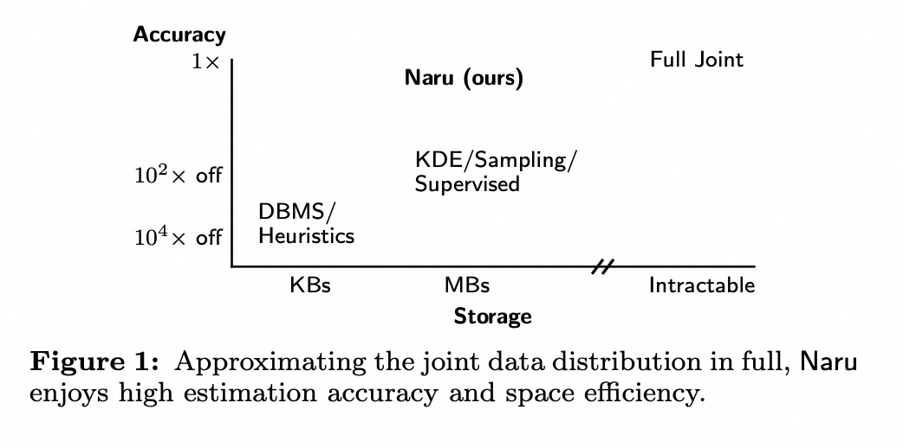
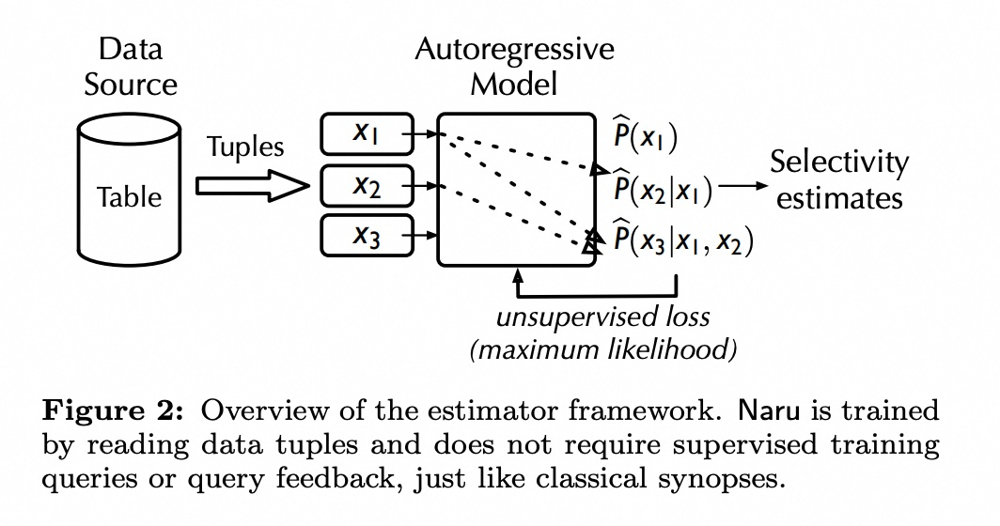
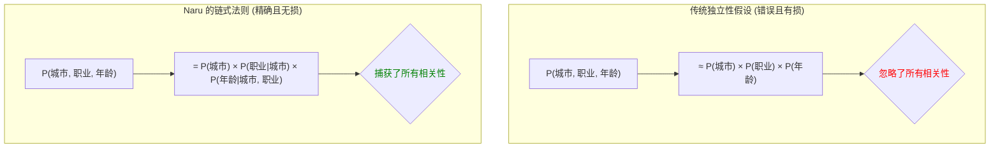
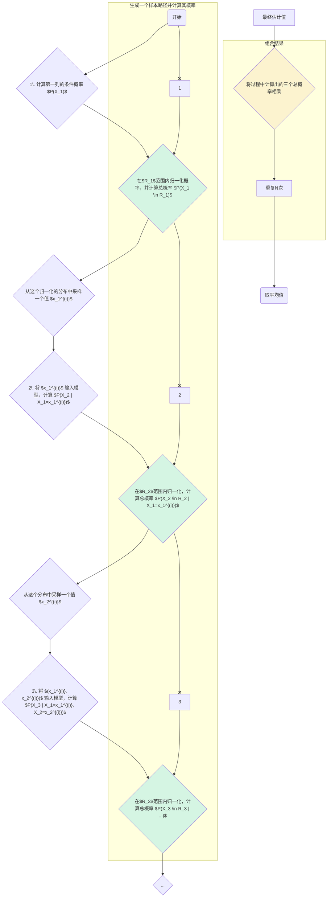

## AI论文解读 | Deep Unsupervised Cardinality Estimation
        
### 作者        
digoal        
        
### 日期        
2025-07-21       
        
### 标签        
PostgreSQL , PolarDB , DuckDB , AI , 论文解读        
        
----        
        
## 背景  
      
https://arxiv.org/pdf/1905.04278        
  
      
提示:        
```        
读懂《Deep Unsupervised Cardinality Estimation》这篇论文需要提前掌握哪些基础知识, 请使用中文给我讲一下这些基础知识, 尽量通熟易懂, 可以使用markdown支持的图形增加解释性.        
        
使用中文通熟易懂的解读《Deep Unsupervised Cardinality Estimation》这篇论文, 关键内容请深入讲解, 可以使用markdown支持的图形增加解释性.        
        
使用中文提取《Deep Unsupervised Cardinality Estimation》论文中一些重要的术语并详细解释, 可以使用markdown支持的图形示增加解释性.        
```        
        
## 1 前置知识 
  
好的，为了能透彻理解《Deep Unsupervised Cardinality Estimation》这篇论文，你需要提前掌握三个领域的交叉知识：**数据库**、**概率统计** 和 **深度学习**。这篇论文的核心思想，就是用深度学习的方法，更精确地解决一个经典的数据库问题。

下面我将用通俗易懂的语言，为你梳理这些必备的基础知识。

-----

### 核心脉络

在深入细节之前，我们先建立一个整体概念。想象一下：

1.  **问题 (来自数据库领域):** 当你向数据库发出一个复杂的查询请求时（比如，“筛选出2020年后，在北京，评分高于4.5星的餐馆”），数据库在真正开始查找数据前，会先做一个“计划”。为了制定最高效的计划，它必须**猜测**这个查询会返回多少条数据（即“基数”）。这个猜测如果错得离谱，查询计划就会很糟糕，导致查询速度极慢。传统数据库在这个“猜测”上做得并不好。

2.  **数学武器 (来自概率统计):** 作者认为，数据库猜不准的根本原因，是它错误地假设了数据列之间是相互独立的（比如错误地认为“城市”和“餐馆评分”没关系）。要想猜得准，就必须理解数据列之间复杂的相关性，也就是理解数据的“**联合概率分布**”。

3.  **解决方案 (来自深度学习):** 联合概率分布在多维度下极其复杂，难以直接计算和存储。作者提出，可以使用一种强大的深度学习模型——**自回归模型 (Autoregressive Model)**，来学习和逼近这个联合概率分布。这样，模型就学会了数据本身的“内在规律”，从而能做出非常精准的基数估计。

接下来，我们分模块拆解这些知识点。

-----

### 1\. 数据库基础 (The "Why")

这部分是理解论文要解决的问题和它的重要性。

#### 1.1 基数估计 (Cardinality Estimation)

  * **是什么？**
    基数（Cardinality）就是指一个查询结果包含的行的数量。基数估计（Cardinality Estimation）就是数据库在执行查询前，对这个数量的**预测**过程。这个预测值也常被称为“选择率 (Selectivity)”，即结果行数占总行数的比例。

  * **为什么重要？**
    数据库的查询优化器（Query Optimizer）会根据基数估计来选择最优的执行计划。例如，当连接两个表 A 和 B 时，是应该先扫描 A 再匹配 B，还是反过来？如果优化器估计 A 表的筛选结果只有10行，而 B 表有100万行，它会明智地选择先处理这10行数据，这样整体计算量就小得多。**错误的基数估计是导致数据库查询性能问题的“万恶之源”**。论文 Figure 1 中的 `DBMS/Heuristics` 动辄 `10^4 x off` 的误差，指的就是这个。   

    ```mermaid
    graph TD
        A[SQL查询] --> B{查询优化器};
        B --> C[基数估计: '这个查询会返回多少行?'];
        C --> D{生成多个执行计划};
        D --> E[选择成本最低的计划];
        E --> F[执行查询];
    ```

#### 1.2 独立性假设 (Independence Assumption)

  * **是什么？**
    为了简化计算，传统数据库在估计多条件查询（如 `WHERE city='北京' AND stars > 4.5`）的基数时，通常会做一个大胆的假设：**各个查询条件是相互独立的**。然后它会分别计算每个条件的基数，再把它们（的选择率）乘起来。

    > P(city='北京' AND stars \> 4.5) ≈ P(city='北京') × P(stars \> 4.5)

  * **为什么是问题？**
    现实世界的数据充满了相关性。例如，高科技岗位的分布和城市高度相关（北京、上海、深圳的概率远高于其他城市）。独立性假设在这些情况下会产生巨大的误差，而且条件越多，误差会以指数级累积。这篇论文的核心攻击点，就是**抛弃独立性假设**。

#### 1.3 直方图 (Histograms)

  * **是什么？**
    直方图是数据库用来近似描述某一列数据分布的传统工具。它将列中的值分成若干个“桶”，并记录每个“桶”中有多少行数据。

  * **为什么重要？**
    这是实现基数估计的经典方法。数据库通过查询直方图来快速估算单个条件的基数。但它的问题是，它通常只针对**单列**数据，无法捕捉**多列之间**的相关性，从而受限于独立性假设。

-----

### 2\. 概率统计基础 (The "How")

这部分是理解论文解决方案的数学原理。

#### 2.1 联合概率、条件概率与链式法则

  * **是什么？**

      * **联合概率** $P(A, B)$: 事件 A 和事件 B **同时发生**的概率。论文中，它指代一行数据中多个列同时取特定值的概率，如 $P(\\text{city}='北京', \\text{stars}=5)$。
      * **条件概率** $P(A|B)$: 在事件 B **已经发生**的条件下，事件 A 发生的概率。如 $P(\\text{stars}=5 | \\text{city}='北京')$。
      * **链式法则 (Product Rule)**: 这是核心中的核心。它允许我们将一个复杂的联合概率分解成一系列更简单的条件概率的乘积。
        $$P(x_1, x_2, ..., x_n) = P(x_1) \times P(x_2|x_1) \times P(x_3|x_1, x_2) \times ... \times P(x_n|x_1, ..., x_{n-1})$$
        这个公式是**精确的，没有任何假设**。

  * **为什么重要？**
    论文的整个模型（自回归模型）就是**对这个链式法则的直接建模**。它不直接学习庞大复杂的联合概率 $P(x\_1, ..., x\_n)$，而是学习链条上的每一个条件概率 $P(x\_i | x\_{\<i})$。

#### 2.2 最大似然估计 (Maximum Likelihood Estimation, MLE)

  * **是什么？**
    这是一种统计学中经典的参数估计方法。通俗地说，就是“**什么样的模型参数，最能解释我们现在观测到的这堆数据？**”。它的目标是调整模型参数，使得模型预测出我们已有数据的概率（似然）最大。

  * **为什么重要？**
    论文中提到，Naru 模型是通过“unsupervised maximum likelihood objective”来训练的（见 Figure 2）。这意味着模型的训练过程，就是不断调整神经网络的权重（参数），让它能给真实数据中的每一行（tuple）赋予尽可能高的概率。   

#### 2.3 蒙特卡洛方法 (Monte Carlo Methods)

  * **是什么？**
    当一个计算问题过于复杂，难以精确求解时（比如计算一个不规则图形的面积），蒙特卡洛方法提供了一个近似求解的思路：**通过大量随机抽样来估算结果**。就像为了估算一个湖的面积，你向整个区域随机撒下大量豆子，然后用“落在湖里的豆子数 / 总豆子数”来近似湖的面积比例。

  * **为什么重要？**
    论文中处理范围查询（`price > 100`）时面临一个难题：这个范围里可能包含天文数字般的点，不可能一一计算它们的概率再相加。因此，作者设计了一种特殊的蒙特卡洛方法，叫做**渐进式采样 (Progressive Sampling)**，通过从模型中智能地抽样来高效地估计整个范围的总概率。

-----

### 3\. 深度学习基础 (The "What")

这部分是理解论文解决方案的具体实现技术。

#### 3.1 无监督学习 (Unsupervised Learning)

  * **是什么？**
    机器学习的一类，指在没有“标准答案”（标签）的情况下，让模型自己从数据中学习模式和结构。聚类、降维、密度估计都是无监督学习。

  * **为什么重要？**
    Naru 是一个无监督模型。它的训练只需要原始的数据库表，而**不需要**任何查询历史或查询结果作为“标准答案”。这使得它非常灵活通用，不像监督学习方法那样需要大量的带标签的训练数据（即“查询-真实基数”对）。

#### 3.2 自回归模型 (Autoregressive Models, AR Models)

  * **是什么？**
    这是生成模型的一种。它的核心思想是**按顺序生成数据的各个部分，每一步的生成都依赖于之前已生成的所有部分**。最典型的例子就是手机输入法里的“下一个词预测”，它会根据你已经输入的词来预测下一个最可能的词。

  * **为什么重要？**
    这正是论文选择的核心模型。它完美地对应了概率的链式法则。一个 $n$ 列的表，模型会这样计算一行的联合概率：

    1.  预测第1列的概率 $P(x\_1)$。
    2.  基于第1列的真实值，预测第2列的概率 $P(x\_2|x\_1)$。
    3.  基于第1、2列的真实值，预测第3列的概率 $P(x\_3|x\_1,x\_2)$。
    4.  ...以此类推，最后将所有概率相乘。

    这个过程被封装在一个深度神经网络中，使其能够学习非常复杂的条件依赖关系。

    ```mermaid
    graph TD
        subgraph "自回归模型生成一行数据 (x1, x2, x3)"
            A(开始) --> B(生成 x1);
            B -->|基于 x1| C(生成 x2);
            C -->|基于 x1, x2| D(生成 x3);
        end
    ```

#### 3.3 神经网络与嵌入 (Neural Networks & Embeddings)

  * **是什么？**

      * **神经网络**: 一种受人脑启发的计算模型，由大量的“神经元”连接而成，能够通过训练学习到从输入到输出的复杂映射关系，是强大的“函数逼近器”。
      * **嵌入 (Embedding)**: 一种将离散的类别变量（如城市名“北京”、“上海”）转换成连续的、稠密的、低维的**数字向量**的技术。关键在于，**语义上相似的类别会被映射到向量空间中相近的位置**。

  * **为什么重要？**
    Naru 的核心是一个神经网络（论文中提到了 MADE, Transformer 等具体架构）。而为了让神经网络能处理非数字的列（如字符串类型的城市名），就需要先通过“嵌入”技术将它们向量化。论文在 4.2 节详细讨论了如何对不同类型的列进行编码（Encoding），嵌入是其中处理高基数列（large-domain columns）的关键技术。

### 总结

读懂这篇论文，你需要：

1.  **理解“痛点”**：认识到数据库中**基数估计**的重要性，以及**独立性假设**是导致其不准确的根源。
2.  **掌握“理论”**：明白**链式法则**是如何将复杂的联合概率分解为一系列条件概率的，这是 Naru 模型的数学基础。
3.  **了解“工具”**：知道**自回归模型**是如何通过一步步预测来建模数据的，以及它如何与链式法则完美契合。同时，明白**最大似然估计**是训练模型的指导思想，而**蒙特卡洛方法**是使用模型进行范围查询的利器。

带着这些基础知识再去阅读论文，你会发现它的脉络非常清晰：用一个强大的、无监督的自回归神经网络，去精准地学习数据的联合分布，从而彻底解决传统基数估计中因独立性假设带来的误差问题。
  
## 2 解读论文 
  
好的，这是一份对《Deep Unsupervised Cardinality Estimation》这篇论文的详细解读。

### 论文核心一览

这篇论文提出了一种名为 **Naru** 的新型数据库基数估计器。其核心创新在于，它利用了**深度无监督学习**，特别是**自回归模型（Autoregressive Models）**，来直接学习并逼近整张数据表的“联合概率分布”。这使得 Naru 能够摆脱传统方法中不切实际的“列独立性假设”，从而在复杂查询上实现前所未有的准确性，同时保持了高效的存储和查询速度 。

-----

### 核心问题：为什么基数估计如此重要且困难？

在深入 Naru 的技术细节之前，我们必须理解它要解决的问题。

**1. 什么是基数估计？**
基数估计是数据库查询优化的核心环节 。当你执行一条 SQL 查询时，数据库不会马上开始工作，而是会先制定一个“执行计划”。为了找到最高效的计划，优化器必须**预测**查询的每一步会返回多少行数据，这个预测值就是“基数” 。一个错误的预测可能导致优化器选择一个极其低效的计划，使查询时间从几秒变成几小时 。

**2. 传统方法的困境**
传统数据库系统（DBMS）主要依赖**直方图 (Histograms)** 等概要信息，并做出一个致命的简化假设：**数据表中的列是相互独立的** 。

  * **独立性假设的谬误**：它假设计算 `(城市='北京' AND 职业='程序员')` 的人数时，可以简单地将满足 `城市='北京'` 的比例和满足 `职业='程序员'` 的比例相乘。然而在现实中，这两个条件高度相关，这种估算方法会产生巨大误差，且查询的列越多，误差会以指数级累积 。

  * **准确性与成本的权衡**：如下图所示，数据库领域一直在准确性和成本（存储、计算）之间做艰难的权衡。

      * **DBMS/启发式方法**：存储开销小（KB级别），但因为独立性假设，准确度极低，误差可能高达 10,000 倍 。
      * **采样/监督学习方法**：准确性有所提升，但仍有 100 倍左右的误差，且需要大量样本或有标签的训练查询 。
      * **完美方案（Full Joint）**：直接存储完整的联合分布可以做到100%准确，但其空间和计算成本是“无法处理 (Intractable)”的，对于一个有十几列的表，其理论大小可能超过 $10^{20}$ 。

    *图解：不同基数估计方法的准确性-存储权衡空间。Naru 的目标是在可接受的存储成本（MB级别）下，达到接近完美联合分布的准确性 。*

Naru 的目标就是打破这个权衡，提供一种既准确又高效的方案 。

-----

### Naru 的核心思想：用深度学习逼近真实世界

Naru 的设计哲学是：**与其做错误的简化假设，不如直接学习数据的真实联合分布** 。

#### 1\. 抛弃独立性，拥抱链式法则

Naru 不再假设列是独立的，而是利用概率论中的 **链式法则（Product Rule）** 来精确地分解联合概率。这个法则是无损的，没有任何信息丢失 。

对于一个有 $n$ 列的表，一行数据 $(x\_1, x\_2, ..., x\_n)$ 的联合概率可以被精确分解为：
$$P(x_1, x_2, ..., x_n) = P(x_1) \times P(x_2|x_1) \times P(x_3|x_1, x_2) \times ... \times P(x_n|x_1, ..., x_{n-1})$$
这个公式的含义是：整行数据的概率，等于第一个值的概率，乘以在已知第一个值的条件下第二个值的概率，再乘以在已知前两个值的条件下第三个值的概率，以此类推 。



#### 2\. 自回归模型：链式法则的完美实现

链式法则虽然精确，但如何计算像 $P(x\_n|x\_1, ..., x\_{n-1})$ 这样复杂的条件概率呢？这正是**自回归模型**的用武之地。

自回归模型是一种强大的生成模型，其工作方式与链式法则天然契合。它按顺序处理每一列，在预测第 $i$ 列的概率分布时，会利用前面 $i-1$ 列的全部信息 。Naru 使用一个深度神经网络来充当这个自回归模型，这个网络被训练来逼近链式法则中的每一个条件概率因子 。

这个过程是**无监督的**，意味着它只需要原始数据表进行训练，通过**最大似然估计 (Maximum Likelihood)** 的原则，让模型给出的概率分布尽可能地贴近真实数据的分布，而不需要任何查询负载或人工标注 。

-----

### Naru 的技术实现：两大关键创新

仅仅能计算一个点的概率是不够的，Naru 还必须高效处理包含数万亿个点的复杂范围查询。

#### 1\. 自回归模型架构与编码

Naru 的框架可以接入任何自回归模型（如 MADE, ResMADE, Transformer）。其工作流程如下：

*图解：Naru 的训练流程。它直接从数据表中读取元组（Tuples），通过最大似然损失进行无监督训练，最终生成一个可以提供选择率估计的模型 。*

  * **智能编码**：为了让神经网络能处理不同类型的数据，Naru 采用了多种编码策略。例如，对于类别少（如“性别”）的列使用**独热编码 (one-hot)**，对于类别多（如“城市名”）的列使用**嵌入编码 (embedding)**，这极大地提高了模型的效率和表达能力 。
  * **嵌入重用**：针对类别数极多的列，作者提出了一种“嵌入重用”的优化，显著降低了模型输出层的计算和存储开销，使得模型可以轻松扩展 。

#### 2\. 渐进式采样 (Progressive Sampling)：高效处理范围查询

这是 Naru 最重要的创新之一，专门用于解决范围查询的难题（例如，`价格 < 100 AND 评分 > 4.5`）。

  * **难题**：这类查询覆盖的有效数据点组合可能是一个天文数字（例如 $10^{10}$ 个点），不可能通过枚举所有点并加总其概率的方式来计算 。简单的蒙特卡洛均匀采样（在查询范围内随机撒点）也行不通，因为它极大概率会采到概率密度极低的“无效”区域，导致结果方差巨大，极不准确 。

  * **Naru 的解法**：渐进式采样巧妙地利用了自回归模型已经学到的条件概率来“导航”，引导采样过程进入数据真正集中的高概率区域 。

    *图解：左图的均匀采样在查询区域内是“盲目”的，很容易错过高概率区域（深色部分）。右图的渐进式采样利用模型学到的分布信息，更智能地在高概率区域进行采样，从而更高效、更准确 。*

**渐进式采样工作流程 (Algorithm 1):** 
假设查询为 $P(X\_1 \\in R\_1, X\_2 \\in R\_2, X\_3 \\in R\_3)$



这个过程每一步都只在单列上进行采样和计算，非常高效 。通过重复多次并取平均值，Naru 就能以很小的计算代价得到一个对真实选择率的无偏估计 。

此外，论文还提出了**通配符跳过 (wildcard-skipping)** 和**启发式列排序 (column ordering)** 等优化来进一步降低估计的方差和延迟 。

-----

### 评估与结论：Naru 的表现如何？

论文通过在真实数据集上与包括商业数据库、统计方法和监督学习方法在内的 8 个基线进行对比，全面评估了 Naru 的性能。

  * **惊人的准确性**：Naru 在所有测试中都达到了最佳的准确性。特别是在最困难的低选择率、高维度查询上，它的**最差情况误差 (tail error) 也是个位数**，比次优方法准确**高达 90 倍** 。相比之下，Postgres 等真实数据库的误差动辄成千上万倍 。

  * **鲁棒性强**：作为一个无监督的数据驱动模型，Naru 不依赖特定的查询负载。它对分布外的未知查询（OOD queries）也表现出极强的鲁棒性，性能远超监督学习方法 MSCN 。

  * **高效实用**：

      * **训练快**：只需在数据上过一两遍（epochs）就能达到非常高的准确度，一个 epoch 的训练时间仅为几十秒 。
      * **查询快**：在 GPU 上的查询延迟通常在 **5-10 毫秒**，与现有数据库系统的速度相当，甚至更快 。
      * **存储小**：模型大小仅占原始数据的约 1% 。

#### 结论

《Deep Unsupervised Cardinality Estimation》成功地证明了深度自回归模型可以作为一个极其强大的“神经概要 (neural synopsis)” 。Naru 通过直接、无损地学习数据的联合分布，从根本上解决了传统基数估计器的难题。它不仅在准确性上实现了数量级的突破，而且在训练、存储和查询效率上也达到了实用水平，为现代查询优化器提供了一个极具前景的新方向 。
  
## 3 术语  
  
好的，以下是从《Deep Unsupervised Cardinality Estimation》论文中提取的关键术语及其详细解释。

-----

### 1\. 基数估计 (Cardinality Estimation)

  * **解释**：在数据库中，基数估计是指在真正执行一个查询（Query）之前，预测该查询将会返回多少行结果的过程 。这个预测对于查询优化器选择最高效的执行路径至关重要 。

  * **重要性**：这篇论文要解决的核心问题就是提升基数估计的准确性。传统数据库管理系统（DBMS）的估计器常常会产生高达数万倍甚至更大的误差 ，导致查询性能急剧下降。Naru 的目标就是成为一个高精度的基数估计器。

### 2\. 联合数据分布 (Joint Data Distribution)

  * **解释**：指一个关系表（Table）中，所有列的取值组合的概率分布 。理论上，如果拥有了完整、精确的联合数据分布，就可以通过对查询区域进行积分（或求和）来得到完全准确的基数“估计”值 。

  * **重要性**：这篇论文的根本思想就是，与其使用各种错误的简化假设，不如直接去近似这个完整的联合数据分布 。Naru 通过深度学习模型来学习这个分布，从而避免了传统方法的固有缺陷。然而，对于拥有多列的真实世界数据表，这个联合分布的规模是“无法处理的 (intractable)”，因为它的大小随列数呈指数级增长 。

### 3\. 自回归模型 (Autoregressive Models)

  * **解释**：这是一种深度学习生成模型，它通过对概率的链式法则进行建模来构建数据的联合分布 。其核心思想是按顺序生成数据的每一个部分（在这里是每一列的值），并且每一步的生成都依赖于所有已经生成的前序部分 。

  * **重要性**：这是 Naru 实现其核心思想所使用的关键技术。自回归模型能够以一种精确、无损的方式将复杂的联合概率 $P(x\_1, ..., x\_n)$ 分解为一系列易于处理的条件概率的乘积： $P(x\_1) \\times P(x\_2|x\_1) \\times ...$ 。Naru 使用一个神经网络来学习这些条件概率，从而捕获列与列之间复杂的相关性，而不做任何独立性假设 。

    ```mermaid
    graph TD
        subgraph "自回归模型计算一行的概率 P(x1, x2, x3)"
            A(输入: 空) --> B("模型输出 P(X1)");
            C(输入: x1) --> D("模型输出 P(X2 | x1)");
            E(输入: x1, x2) --> F("模型输出 P(X3 | x1, x2)");
            B --> G["值: P(x1)"];
            D --> H["值: P(x2|x1)"];
            F --> I["值: P(x3|x1,x2)"];
            J((联合概率))
            G --> J
            H --> J
            I --> J
        end
        J --> K["结果 = P(x1) × P(x2|x1) × P(x3|x1,x2)"];
    ```

### 4\. 渐进式采样 (Progressive Sampling)

  * **解释**：这是论文为解决范围查询（Range Queries）而提出的一种新颖的蒙特卡洛积分算法 。它利用自回归模型提供的条件概率来引导采样过程，使其能够智能地在查询区域内的高概率密度区进行探索，并最终通过重要性加权得到一个无偏的估计值 。

  * **重要性**：这是 Naru 从一个理论模型走向实用的关键。对于包含范围（如 `price > 100`）的查询，需要被加总的点的数量是天文数字 。简单的均匀采样在这种情况下会失效 。渐进式采样通过逐列采样的方式，每一步都利用前一列采样的值来“聚焦”到下一列更有意义的采样区域，从而可以用极少的样本（如一千次）高效且准确地估计出结果 。 Naru代码: https://github.com/naru-project/naru  

    ```mermaid
    graph TD
        direction LR
        subgraph "一次采样过程 (DRAW function)"
            A(开始) --"模型预测 P(X1)"--> B{在查询范围 R1 内采样 x1};
            B --"输入 x1, 模型预测 P(X2|x1)"--> C{在查询范围 R2 内采样 x2};
            C --"输入 x1,x2, 模型预测 P(X3|x2,x1)"--> D{在查询范围 R3 内采样 x3};
            B --"计算 P(X1 in R1)"--> E((概率部分1));
            C --"计算 P(X2 in R2|x1)"--> F((概率部分2));
            D --"计算 P(X3 in R3|x2,x1)"--> G((概率部分3));
        end
        subgraph "最终估计"
            H(组合)
            E --> H;
            F --> H;
            G --> H;
            H --> I{结果 = P1 × P2 × P3};
        end
        J((重复 S 次并取平均));
        I --> J
    ```

    *该图示简化了 Algorithm 1 的流程。*

### 5\. 最大似然估计 (Maximum Likelihood Estimation)

  * **解释**：一种训练统计模型的原则 。其目标是调整模型的参数，使得模型为训练数据中真实观测到的样本所赋予的概率总和（即“似然”）达到最大 。

  * **重要性**：这是 Naru 模型的训练方式 。Naru 是一个无监督模型，它不依赖任何带标签的查询结果 。它的训练过程就是读取数据表中的每一行，然后通过梯度下降法来优化神经网络的参数，以最大化这些真实数据行的对数似然概率 。

### 6\. 嵌入 (Embedding)

  * **解释**：一种将高维、离散的类别数据（例如，一个有数千个不同城市名的列）转换为低维、稠密的实数向量的技术 。这个转换过程是可学习的，语义相近的类别会被映射到向量空间中相近的位置 。

  * **重要性**：这是 Naru 处理真实世界数据，特别是具有大量唯一值（大基数）的列时的一项关键优化 。如果对一个有10000个城市的列使用传统的独热编码，会产生一个巨大的、稀疏的向量，这在计算和存储上都是低效的。而使用嵌入（例如，转换为一个64维的向量），则可以高效地表示这些信息，并作为神经网络的输入 。

### 7\. 通配符跳过 (Wildcard-Skipping)

  * **解释**：这是论文提出的一种优化技术，用于高效处理查询中未被筛选的“通配符”列（即查询条件不涉及的列） 。在渐进式采样过程中，与其在这些列的整个定义域上进行采样，不如直接跳过它们，从而减少模型前向传播的次数 。

  * **重要性**：该技术能显著降低估计的方差和延迟 。它使得 Naru 的查询延迟只与查询中实际被筛选的列数成正比，而不是表的总列数 ，这对于宽表（有很多列的表）查询尤其重要。
  
## 参考        
         
https://arxiv.org/pdf/1905.04278  
        
        
<b> 以上内容基于DeepSeek、Qwen、Gemini及诸多AI生成, 轻微人工调整, 感谢杭州深度求索人工智能、阿里云、Google等公司. </b>        
        
<b> AI 生成的内容请自行辨别正确性, 当然也多了些许踩坑的乐趣, 毕竟冒险是每个男人的天性.  </b>        
    
  
  
#### [期望 PostgreSQL|开源PolarDB 增加什么功能?](https://github.com/digoal/blog/issues/76 "269ac3d1c492e938c0191101c7238216")
  
  
#### [PolarDB 开源数据库](https://openpolardb.com/home "57258f76c37864c6e6d23383d05714ea")
  
  
#### [PolarDB 学习图谱](https://www.aliyun.com/database/openpolardb/activity "8642f60e04ed0c814bf9cb9677976bd4")
  
  
#### [PostgreSQL 解决方案集合](../201706/20170601_02.md "40cff096e9ed7122c512b35d8561d9c8")
  
  
#### [德哥 / digoal's Github - 公益是一辈子的事.](https://github.com/digoal/blog/blob/master/README.md "22709685feb7cab07d30f30387f0a9ae")
  
  
#### [About 德哥](https://github.com/digoal/blog/blob/master/me/readme.md "a37735981e7704886ffd590565582dd0")
  
  

  
