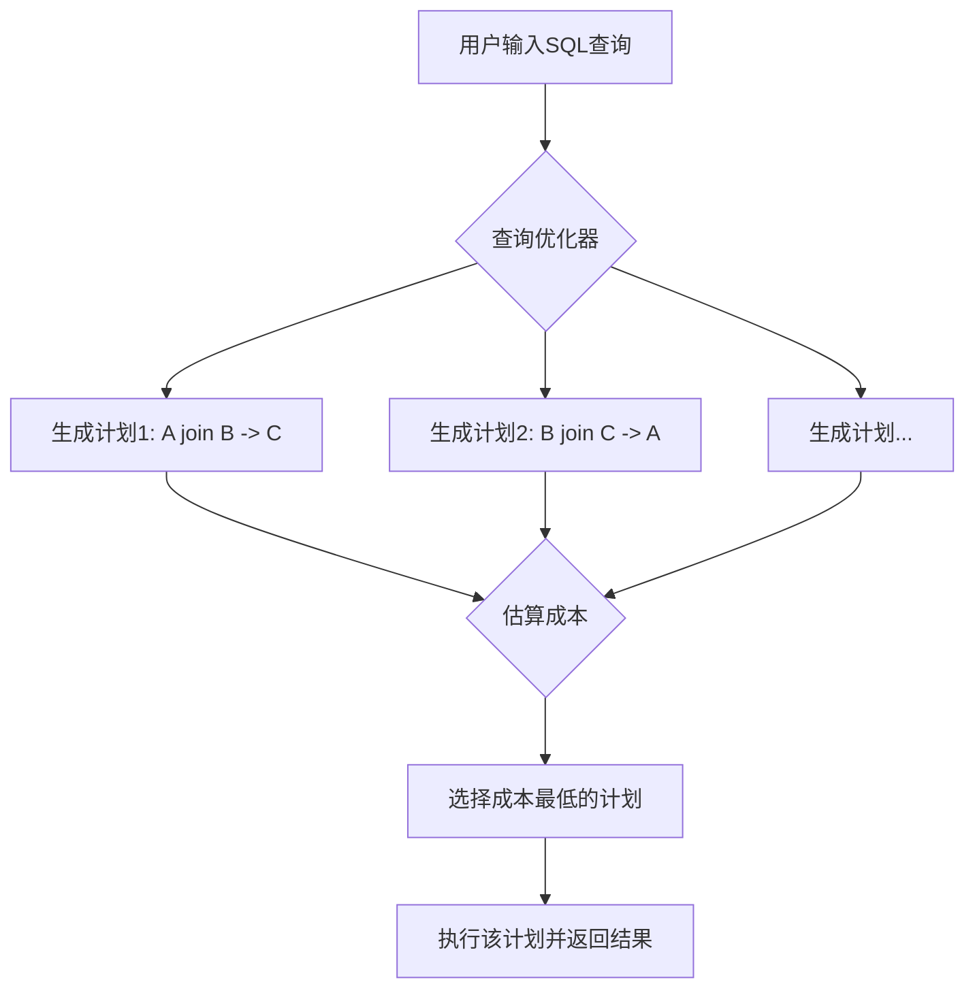
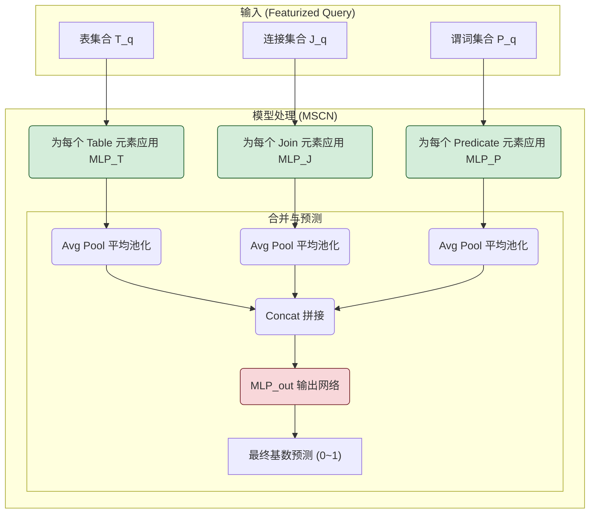
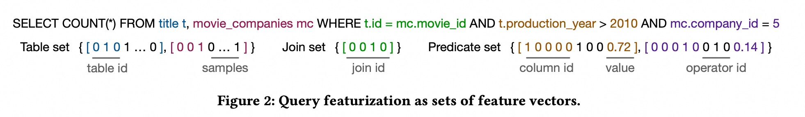
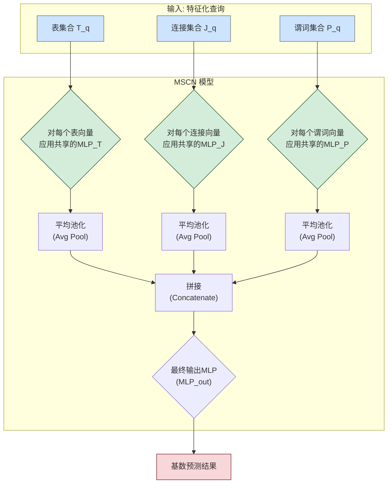
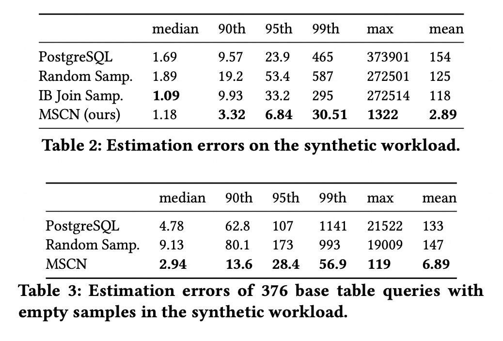

## AI论文解读 | Learned Cardinalities: Estimating Correlated Joins with Deep Learning
        
### 作者        
digoal        
        
### 日期        
2025-07-21       
        
### 标签        
PostgreSQL , PolarDB , DuckDB , AI , 论文解读        
        
----        
        
## 背景  
      
https://arxiv.org/pdf/1809.00677       
  
      
提示:        
```        
读懂《Learned Cardinalities: Estimating Correlated Joins with Deep Learning》这篇论文需要提前掌握哪些基础知识, 请使用中文给我讲一下这些基础知识, 尽量通熟易懂, 可以使用markdown支持的图形增加解释性.        
        
使用中文通熟易懂的解读《Learned Cardinalities: Estimating Correlated Joins with Deep Learning》这篇论文, 关键内容请深入讲解, 可以使用markdown支持的图形增加解释性.        
        
使用中文提取《Learned Cardinalities: Estimating Correlated Joins with Deep Learning》论文中一些重要的术语并详细解释, 可以使用markdown支持的图形示增加解释性.        
```        
        
## 1 前置知识 
  
好的，为了完全理解《Learned Cardinalities: Estimating Correlated Joins with Deep Learning》这篇论文，你需要掌握三大块的基础知识：**数据库基本原理**、**机器学习与深度学习核心概念**，以及**论文提出的特定模型思想**。

下面我将用通俗易懂的方式，为你逐一解析这些知识点。

-----

### 块一：数据库基础知识 (问题的“领域”)

这篇论文要解决的是数据库中的一个经典难题。所以，首先你得理解问题本身。

#### 1\. 什么是查询优化 (Query Optimization)？

想象一下，你用导航软件从家到公司，软件会给你推荐好几条路：最短的、最快的、不堵车的等等。数据库在执行一条SQL查询语句时，也面临同样的选择。它可以有多种执行“路径”（称为“查询计划”，Query Plan），比如先连接A表和B表，再连接C表；或者先连接B表和C表，再连接A表。不同的路径，执行效率可能天差地E别。

**查询优化器 (Query Optimizer)** 的工作，就是在众多可行的查询计划中，估算每一个的“成本”（主要是执行时间），然后选择成本最低的那个去执行。



#### 2\. 什么是基数估算 (Cardinality Estimation)？

这是查询优化的核心环节。**基数 (Cardinality)** 指的是一个查询（或其中间步骤）返回结果的**行数**。

优化器在估算查询计划的成本时，最重要的一个参数就是每一步操作会产生多少行数据。例如，估算 `A JOIN B` 的成本，就需要知道这个JOIN操作会返回多少行。如果估算得准，优化器就能做出明智的选择。反之，如果估算错得离谱（比如差了几个数量级），就可能选出一个性能极差的“天价”查询计划，导致查询变得极慢。这篇论文指出，主流数据库的基数估算经常错得离谱，是性能问题的“阿喀琉斯之踵” 。

#### 3\. 什么是关联（Correlation）和连接相关性 (Join-Crossing Correlations)？

这是基数估算中最难的问题。传统的估算方法常常假设数据是独立、均匀分布的。

  * **独立性假设**：比如，估算“国籍是法国”和“职业是演员”的人数时，会假设这两个条件是独立的，用 `总人数 * 法国人比例 * 演员比例` 来计算。
  * **现实情况**：数据往往是**相关的**。论文中举了一个例子：在电影数据库里，“法国演员”参演“浪漫电影”的概率，要远高于其他国籍的演员 。如果你无视这种相关性，直接用 `法国演员数量 * 浪漫电影比例` 来估算，结果就会严重偏低。这种跨越了多个表的属性之间的相关性，就是**连接相关性**。

#### 4\. 什么是采样 (Sampling)？

既然精确计算基数太慢，一个常见的估算方法就是**采样**。不对全量数据进行计算，而是抽取一小部分样本数据，在样本上执行查询，然后根据样本的结果来“放大”估算整体的结果。

  * **优点**：速度快。
  * **弱点 (0-Tuple Problem)**：如果你的查询条件非常苛刻（比如 `WHERE 订单金额 > 1000000`），很可能在你的小样本里一条也匹配不到（0-tuple / empty sample）。这时，采样方法就“失灵”了，只能回退到基于统计信息的猜测，导致巨大误差 。这正是本文想要重点解决的问题之一。

-----

### 块二：机器学习与深度学习基础 (解决问题的“工具”)

论文用深度学习作为工具来解决基数估算问题。

#### 1\. 监督学习 (Supervised Learning)

这是机器学习的一种范式。就像教一个孩子看图识字，你给他看一张猫的图片（输入），告诉他“这是猫”（输出/标签）。重复成千上万次后，他看到一张新的猫图片，也能认出来。

在本文中：

  * **输入 (Input)**：一条SQL查询的特征表示 (Query Features)。
  * **输出/标签 (Label)**：这条查询真实执行后返回的行数 (True Cardinality)。
  * **训练 (Training)**：把成千上万个 `(查询, 真实行数)` 的配对数据喂给一个模型去学习 。
  * **预测 (Prediction/Inference)**：当来了一条新的、从未见过的查询时，用训练好的模型来预测它的行数。

#### 2\. 特征工程/特征化 (Feature Engineering / Featurization)

机器学习模型不认识SQL语句，它只认识数字（向量）。**特征化**就是把一条查询语句，转换成一堆数字向量的过程 。

论文中是这样做的 ：

  * **表 (Tables)**：每个表用一个**独热编码 (One-Hot Vector)** 表示。比如有100个表，`Table_5` 就表示成一个长度为100、只有第5位是1、其余都是0的向量。
  * **连接 (Joins)**：用独热编码表示连接的列。
  * **谓词 (Predicates)**：`WHERE`后面的条件，比如 `t.production_year > 2010`。
      * `t.production_year` (列)：用独热编码表示是哪个列。
      * `>` (操作符)：用独热编码表示是 `>`、`<` 还是 `=`。
      * `2010` (值)：将这个值在列的最大最小值之间做**归一化 (Normalization)**，缩放到 `[0, 1]` 区间。
  * **采样信息 (Sample Information)**：这是一个关键特征！论文不仅用查询本身，还把查询条件在预先准备好的“样本”上跑一遍，把匹配到的样本数量，甚至匹配到的样本位置（用**位图 Bitmap** 表示）也作为特征喂给模型 。这能给模型提供非常强的信号。

#### 3\. 神经网络与深度学习 (Neural Networks & Deep Learning)

  * **神经网络**：一种模仿人脑神经元连接方式的计算模型。它由很多层“神经元”构成，包括输入层、若干隐藏层和输出层。数据从输入层进入，经过每一层的计算和转换，最后在输出层得到结果。
  * **深度学习**：通常指使用很多个隐藏层的“深”的神经网络。层数越深，理论上能学习的模式就越复杂。
  * **核心组件**：
      * **MLP (Multi-Layer Perceptron)**：多层感知机，最基础的全连接神经网络，是本文模型的基本构成单元 。
      * **激活函数 (Activation Function)**：给神经元增加非线性能力，让网络能学习更复杂的模式。
          * **ReLU** (`max(0, x)`): 在隐藏层中使用，计算简单、效果好 。
          * **Sigmoid** (`1/(1+e⁻ˣ)`): 在输出层使用，能把任意数值压缩到 `[0, 1]` 区间，正好和归一化后的基数对应 。
      * **损失函数 (Loss Function)**：衡量模型“预测值”和“真实值”差距的函数。训练的目标就是最小化这个函数。本文主要使用 **q-error** ，它衡量的是预测值和真实值的**比率**，比简单的差值（均方差）更适合基数估算这种数值跨度极大的场景。
      * **优化器 (Optimizer)**：如 **Adam** ，是一种在训练过程中，根据损失函数的结果，自动调整神经网络参数（权重），以使损失越来越小的算法。

-----

### 块三：论文核心模型思想 (MSCN)

这是论文最主要的创新点，理解它需要结合前面两部分知识。

#### 1\. 为什么不能用普通的神经网络？

一条查询可以写成 `A JOIN B JOIN C`，也可以写成 `B JOIN A JOIN C`。对于基数估算来说，这两者的结果是一样的。但如果把它们序列化成 `[A, B, C]` 和 `[B, A, C]` 输入给一个普通的MLP，在模型看来这是两个完全不同的输入。模型需要浪费大量的学习能力去搞明白“原来这个顺序不重要”，这叫做**排列不变性 (Permutation Invariance)**。

#### 2\. MSCN (Multi-Set Convolutional Network) 的设计思想

为了解决上述问题，作者设计了MSCN模型 ，其灵感来源于一篇叫《Deep Sets》的论文 。核心思想是：**一个对集合操作的函数，其结果不应该因为集合内元素的顺序而改变**。

MSCN的架构完美体现了这一思想：



  * **分而治之**：MSCN不把查询看成一个序列，而是三个**集合**：表的集合、连接的集合、谓词的集合 。
  * **独立处理**：对每个集合，它用一个共享的MLP去处理集合中的每一个元素（比如对每个表的特征向量都过一遍`MLP_T`）。
  * **聚合 (Aggregation)**：将每个集合处理后的所有元素向量做一个**平均 (Average Pooling)** 。这样无论集合里有1个、3个还是10个元素，最后都得到一个固定长度的代表向量，天然地实现了排列不变性。
  * **拼接与预测**：将三个集合的代表向量拼接(Concatenate)起来，再送入最后一个MLP网络，得出最终的预测值 。

### 总结

要读懂这篇论文，你需要：

1.  **懂数据库**：明白查询优化器为何需要**基数估算**，以及**连接相关性**和**采样法的0元组问题**是这个领域的痛点。
2.  **懂机器学习**：知道**监督学习**是基本框架，**特征化**是连接问题和模型的桥梁，而**神经网络**（MLP, ReLU, Sigmoid, Loss, Optimizer）是构建解决方案的具体零件。
3.  **懂模型设计**：理解MSCN的核心创新在于**把查询看作集合**，通过 **“独立处理+聚合”** 的方式优雅地解决了 **排列不变性** 问题，使其非常适合处理结构化的查询数据。

掌握了这些，你就能很好地理解作者的动机、方法的巧妙之处以及实验结果的意义了。
  
## 2 解读论文 
  
好的，这篇名为《Learned Cardinalities: Estimating Correlated Joins with Deep Learning》的论文开创性地提出了一种使用深度学习来解决数据库中一个核心难题——基数估算——的方法。下面我将用通俗的语言，结合图示，为您深入解读这篇论文。

### 一、问题的背景：为何需要“学习”基数？

在数据库中，当您执行一条复杂的SQL查询（尤其是包含多个`JOIN`连接的查询）时，数据库的**查询优化器**会先“排兵布阵”，制定一个执行计划。例如，是先连接A表和B表，还是先连接B表和C表，其执行效率可能相差成百上千倍 。

优化器做出选择的关键依据，就是**基数估算 (Cardinality Estimation)**，即预测查询的每一步会返回多少行数据 。如果估算准确，就能选出高效的计划；如果估算离谱（比如实际返回100万行，却估算成10行），就会导致灾难性的性能问题 。

**当前方法的痛点：**

1.  **连接相关性 (Join-Crossing Correlations)**：这是基数估算最大的挑战 。传统方法通常假设不同列的条件是相互独立的，但这在现实世界中常常不成立。论文中举例：在电影数据库（IMDb）中，法国演员参演浪漫电影的概率远高于其他国籍的演员 。这种跨表的“相关性”很难被传统模型捕捉，导致估算误差巨大。
2.  **采样法的“0元组问题” (0-Tuple Problem)**：一种先进的方法是基于采样（Sampling）来估算，即在数据的一小部分样本上运行查询来推断整体结果。但如果查询条件非常苛刻（如`价格 > 10000`），很可能在样本中一条数据都匹配不到，此时采样法就会失效，只能退回到不可靠的猜测，导致巨大误差 。

这篇论文的核心思想是：**基数估算本质上是一个可以被学习的回归问题**。我们能否构建一个深度学习模型，让它从海量的查询和其真实的返回行数中，自动学会数据间隐藏的复杂相关性，从而做出更精准的预测？

### 二、核心方法：多集卷积网络 (MSCN)

作者设计了一种名为**多集卷积网络 (Multi-Set Convolutional Network, MSCN)** 的专用深度学习模型来解决这个问题 。要理解MSCN，我们先要看它如何“读懂”一条SQL查询。

#### 1\. 查询的特征化：把SQL变成数字

模型不认识SQL文本，只认识数字向量。因此，第一步是将查询分解并转换成特征向量 。一条查询被看作三个**集合**的组合：**表的集合、连接的集合、谓词（WHERE条件）的集合** 。

  * **表 (Table)**：每个表用一个**独热编码 (One-hot vector)** 来唯一标识 。
  * **连接 (Join)**：同样用独热编码表示（例如，连接了哪些表的哪些列）。
  * **谓词 (Predicate)**：对于`列 op 值`（如 `production_year > 2010`）这样的条件，会被拆解：
      * `列` 和 `操作符(op)` 分别用独热编码表示 。
      * `值` (value) 则根据该列的最大最小值进行**归一化**，缩放到[0, 1]区间内的一个浮点数 。

一个关键的创新是，论文还把**采样信息**作为特征喂给模型 。即在样本数据上运行查询条件，并将匹配到的**样本数量**或更详细的**样本位图 (bitmap)** 也编码进去 。这给模型提供了强大的运行时信号，帮助它学习数据间的微妙关系 。

下图展示了一个查询是如何被特征化的 ：   

#### 2\. MSCN模型架构：为“集合”而生的网络

为什么不能用普通的神经网络（如CNN、RNN）？因为一条查询中的表和谓词是**无序**的 。`A JOIN B`和`B JOIN A`的基数相同，模型不应该因为输入顺序不同而困惑。MSCN正是为了解决这个 **“排列不变性”** 问题而设计的，其灵感来源于《Deep Sets》。

其工作流程可以分解为以下几步：



1.  **并行处理**：模型有三个独立的模块，分别对应表、连接和谓词这三个集合 。
2.  **共享映射**：在每个模块内部，一个小的神经网络（MLP）被**共享地**应用到集合中的每一个元素上 。例如，`MLP_T`会依次处理查询中所有表的特征向量。
3.  **聚合 (Aggregation)**：对每个模块处理后的所有向量进行**平均池化 (Average Pooling)** 。无论一个集合里有2个表还是5个表，经过平均后都会得到一个固定长度的“代表向量”。这一步是实现顺序无关性的关键。
4.  **合并与预测**：将三个模块产出的“代表向量”**拼接 (Concatenate)** 起来，形成一个总的特征向量，最后送入一个输出MLP，得到最终的基数预测值 。输出层使用`Sigmoid`激活函数，将结果归一化到[0, 1]之间 。

### 三、训练与评估：MSCN的效果如何？

#### 训练数据生成

为了解决机器学习的“冷启动”问题（即一开始没有训练数据），作者设计了一个查询生成器，通过分析数据库的模式信息，自动生成海量的、结构随机的查询 。然后执行这些查询，获得其真实的基数，从而构建起初始的训练数据集 。

#### 实验结果亮点

论文在IMDb数据集上进行了详尽的评估，并与PostgreSQL优化器、随机采样（Random Sampling）和当时最先进的基于索引的采样方法（IBJS）进行了对比 。

1.  **精度与鲁棒性**：MSCN在整体精度上与最强的对手IBJS不相上下，但在处理极端情况（即估算误差非常大时）表现得**明显更鲁棒** 。如下表所示，MSCN在99th和max q-error（衡量最大误差的指标）上比其他方法低了1-2个数量级 。

       
    
    图：在综合负载下，MSCN（最右）的误差分布更集中，离群点更少

2.  **完美解决“0元组问题”**：这是MSCN最大的优势之一。当采样法因为没有命中样本而“失灵”时，它们只能回退到简单的猜测，导致巨大误差 。而MSCN即使在没有样本信息的情况下（即所有样本位图都为0），依然能利用查询本身的结构特征（如具体是哪个表的哪个列做了什么样的比较）来做出有根据的预测，表现远超对手 。

3.  **强大的泛化能力**：实验证明，即使只用包含0-2个连接的查询进行训练，MSCN也能较好地**泛化**到包含3个甚至4个连接的、更复杂的未知查询上 。这证明了模型学到的是通用的数据相关性规律，而不是死记硬背训练样本。

4.  **特征的贡献**：实验还验证了不同特征的重要性。不带任何采样信息的纯模型已经能做出不错的估计。加入“样本数量”后，性能大幅提升。而使用最详细的“样本位图”时，性能达到最佳，证明模型确实能从位图的复杂模式中学习到更深层次的相关性 。

### 四、总结与讨论

《Learned Cardinalities》这篇论文做出了以下关键贡献：

  * **提出新范式**：首次成功地将深度学习应用于数据库核心的基数估算问题，并证明了其有效性。
  * **设计专用模型MSCN**：创造了一种巧妙处理集合数据、具备排列不变性的网络结构，非常适合对SQL查询进行建模 。
  * **解决核心痛点**：MSCN能有效学习数据间的连接相关性，并从根本上解决了传统采样方法在“0元组”场景下的脆弱性 。

论文也指出了未来的扩展方向，如支持更复杂的谓词（`LIKE`、`OR`）、模型更新、以及估算结果的不确定性等 。

总而言之，这项工作为“AI for Systems”领域树立了一个标杆，展示了用机器学习来革新和增强传统数据库系统组件的巨大潜力。
  
## 3 术语  
  
好的，我将从论文《Learned Cardinalities: Estimating Correlated Joins with Deep Learning》中提取重要术语并进行详细解释，同时利用Markdown支持的图形展示增加解释性。

### 重要术语及其解释

#### 1\. 基数估计 (Cardinality Estimation)

基数估计是查询优化的核心问题 。它指的是预测数据库查询中中间结果集大小的过程 。准确的基数估计对于查询优化器选择最佳查询执行计划至关重要，因为不同的计划替代方案的性能会受到中间结果大小的显著影响 。不准确的估计会导致查询速度慢且性能不可预测 。

#### 2\. 连接交叉相关性 (Join-Crossing Correlations)

连接交叉相关性是基数估计中最大的挑战之一 。这指的是在进行连接操作时，不同表之间数据存在的复杂关系，这些关系会影响连接结果的实际大小。例如，在IMDb（互联网电影数据库）中，法国演员更有可能参演浪漫电影，这种国籍和电影类型之间的关联就是连接交叉相关性 。传统方法难以准确捕捉这些复杂的相关性。

#### 3\. 0-元组问题 (0-Tuple Problem)

0-元组问题是基于采样（sampling-based）的估计技术面临的一个弱点 。当选择性谓词（selective predicates）导致初始样本中没有符合条件的元组时，采样方法就会失效 。在这种情况下，这些技术通常会回退到“有根据的猜测”，从而导致较大的估计误差 。MSCN（多集卷积网络）的优势之一就是能够较好地处理这些0-元组情况 。

#### 4\. 多集卷积网络 (Multi-Set Convolutional Network, MSCN)

MSCN是论文提出的一种新的深度学习方法，专门用于基数估计 。它是一种多集卷积网络，旨在表示关系查询计划，并利用集合语义来捕获查询特征和真实的基数 。MSCN通过学习数据中的连接交叉相关性，解决了采样基数估计在0-元组问题上的不足 。

**MSCN 架构图解：**

下图展示了MSCN的架构。
  *请注意，我无法直接生成图像。此处图片链接是一个示例，实际应替换为MSCN架构图的URL。*

MSCN模型将查询表示为表（Table set $T\_q$）、连接（Join set $J\_q$）和谓词（Predicate set $P\_q$）的集合 。每个集合都有一个对应的模块，包含一个带有共享参数的两层神经网络（MLP） 。这些模块的输出通过平均池化（Avg. pool）处理，然后连接（Concat）起来，并输入到最终的输出网络（Output Network）进行基数预测 。

$$\begin{aligned} \omega_{T} &= \frac{1}{|T_{q}|}\Sigma_{t\in T_{q}}MLP_{T}(v_{t}) \\ w_{J} &= \frac{1}{|J_{q}|}\Sigma_{j\in J_{q}}MLP_{J}(v_{j}) \\ w_{P} &= \frac{1}{|P_{q}|}\Sigma_{P\in P_{q}}MLP_{P}(v_{P}) \\ v_{out} &= MLP_{out}([w_{T},w_{J},w_{P}]) \end{aligned}$$

其中， $v\_t, v\_j, v\_p$ 分别是表、连接和谓词的特征向量 。

#### 5\. 查询特征化 (Featurization)

查询特征化是将查询转换为机器学习模型可以理解的数值表示的过程 。在MSCN中，查询被表示为一个包含表、连接和谓词的集合 。

  * **表 (Tables):** 每个表通过一个唯一的one-hot向量 $\\mathcal{U}\_t$ 表示 。
  * **连接 (Joins):** 连接也使用唯一的one-hot编码进行特征化 。
  * **谓词 (Predicates):** 对于形式为 (col, op, val) 的谓词，列 `col` 和操作符 `op` 使用one-hot向量表示，而 `val` 则表示为归一化后的值 [0, 1] 。
    此外，MSCN还通过包含物化样本（materialized samples）的信息来丰富训练数据，例如合格样本的数量或指示其位置的位图（bitmaps），这有助于模型学习连接模式 。

**查询特征化示例：**
例如，一个查询 `SELECT COUNT(*) FROM title t, movie_companies mc WHERE t.id = mc.movie_id AND t.production_year > 2010 AND mc.company_id = 5` 会被特征化为以下集合:

  * **Table set:** `{ [0101...0], [0010...1] }` (对应 `title` 和 `movie_companies` 表的one-hot向量) 
  * **Join set:** `{ 10010] }` (对应 `t.id = mc.movie_id` 连接的one-hot向量) 
  * **Predicate set:** `{ [10000100 0.72], [000100100.14] }` (对应 `t.production_year > 2010` 和 `mc.company_id = 5` 谓词的特征向量，包含列ID、操作符ID和归一化后的值) 

#### 6\. q-误差 (q-error)

q-误差是衡量估计准确性的一个指标，它表示估计值与真实基数之间的因子（或反之）。论文中，MSCN模型的目标是最小化平均q-误差 。低q-误差意味着估计值与真实值更接近，从而提供更准确的基数估计。

#### 7\. 冷启动问题 (Cold Start Problem)

冷启动问题是所有基于学习的算法面临的一个关键挑战，即在没有具体查询工作负载信息的情况下如何训练模型 。MSCN通过基于模式信息生成随机查询并从数据库中抽取实际值来获取初始训练语料库 。

#### 8\. 采样 (Sampling) 与 位图 (Bitmaps)

MSCN的性能提升得益于将采样信息纳入训练数据 。

  * **合格样本数量 (Number of qualifying samples):** 对于查询中的每个表，MSCN会评估物化样本上的相应谓词，并用合格样本的数量来标注查询 。
  * **位图 (Bitmaps):** 更进一步，MSCN会用合格样本的位置（以位图表示）来标注查询中的每个表 。这使得ML模型能够学习特定样本合格的含义（例如，某些样本通常有很多连接伙伴）。实验证明，添加位图特征对连接估计有积极影响，因为模型可以利用位图中的模式来预测输出基数 。

#### 9\. 过拟合 (Overfitting)

过拟合是机器学习模型中的一个现象，当模型在训练数据上表现良好，但在未见过的数据上表现不佳时发生 。在MSCN的超参数调优中，发现训练过多的epoch（例如200个）会导致过拟合，模型会捕捉训练数据中的噪声，从而对预测质量产生负面影响 。

以上是从论文中提取并详细解释的一些重要术语。
  
## 参考        
         
https://arxiv.org/pdf/1809.00677  
        
        
<b> 以上内容基于DeepSeek、Qwen、Gemini及诸多AI生成, 轻微人工调整, 感谢杭州深度求索人工智能、阿里云、Google等公司. </b>        
        
<b> AI 生成的内容请自行辨别正确性, 当然也多了些许踩坑的乐趣, 毕竟冒险是每个男人的天性.  </b>        
    
  

  
