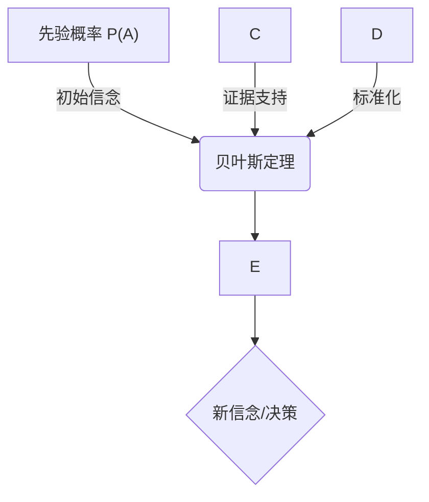
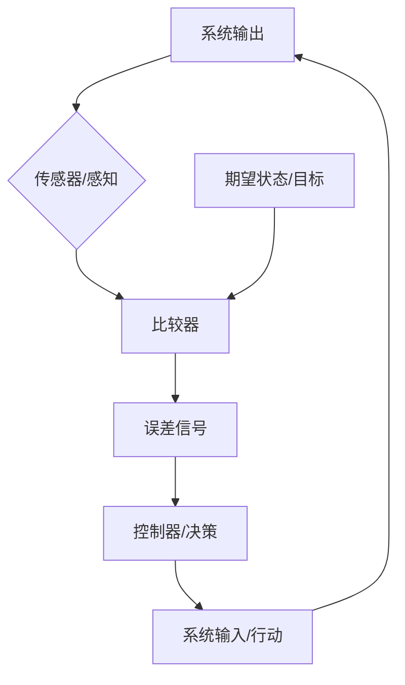
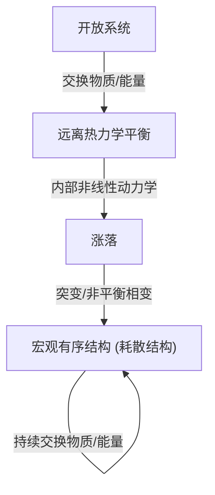
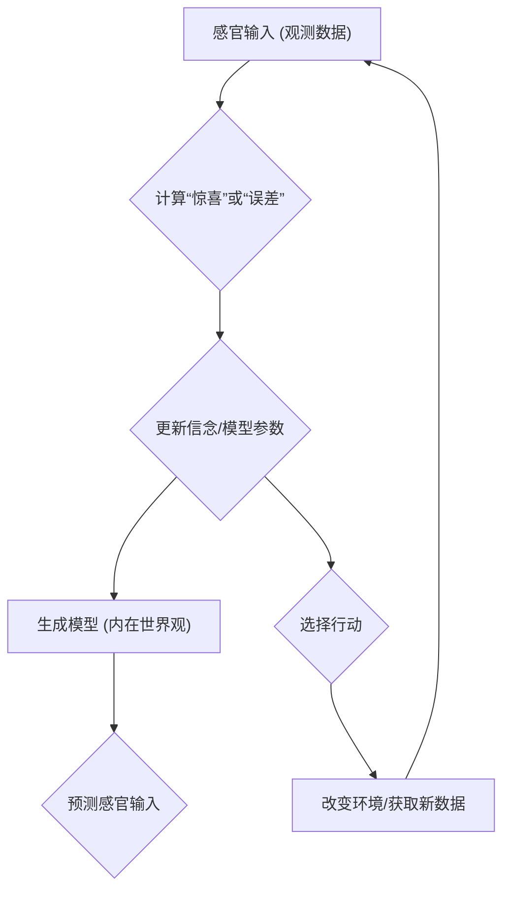
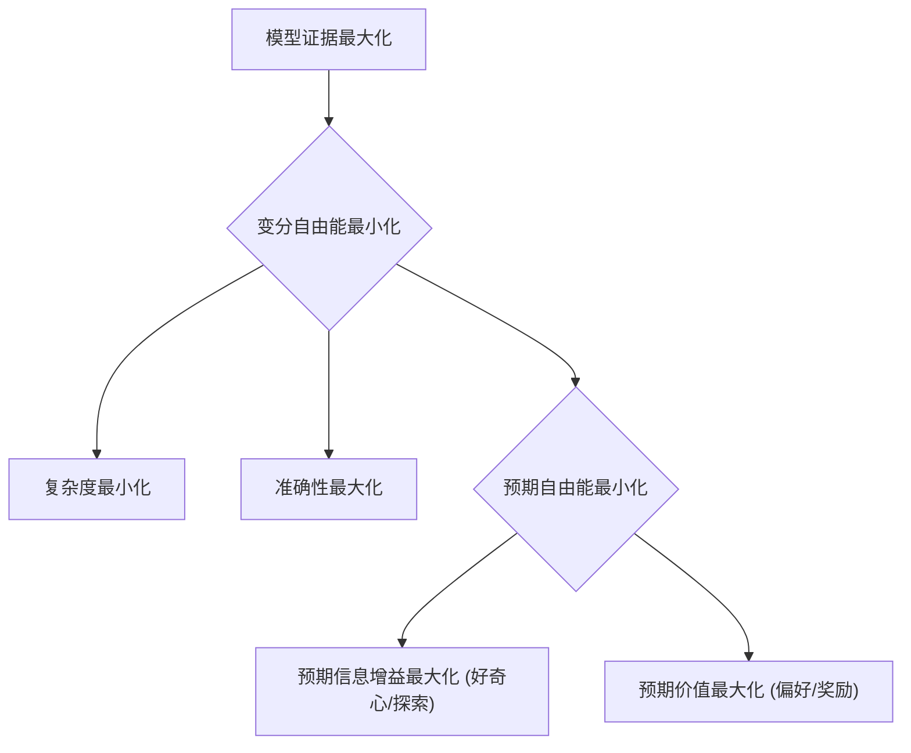
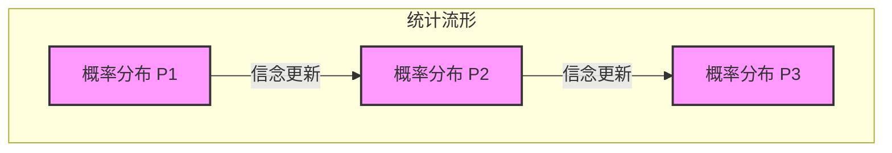

## AI论文解读 | 深入解读《从第一性原理设计智能生态系统》：主动推断与未来AI , Designing Ecosystems of Intelligence from First Principles  
          
### 作者          
digoal          
          
### 日期          
2025-07-21         
          
### 标签          
PostgreSQL , PolarDB , DuckDB , AI , 论文解读          
          
----          
          
## 背景    
        
https://arxiv.org/pdf/2212.01354          
        
“Google Gemini 2.5 Flash Deep Research”, 提示:          
```          
三个问题:  
  
1、读懂这篇论文需要提前掌握哪些基础知识, 请使用中文讲解这些基础知识, 尽量通熟易懂, 可以使用markdown支持的图形(text,mermaid等)增加解释性.  
  
2、使用中文通熟易懂的解读这篇论文, 关键内容请深入讲解, 可以使用markdown支持的图形(text,mermaid等)增加解释性.  
  
3、使用中文提取这篇论文中的重要术语并详细解释, 可以使用markdown支持的图形(text,mermaid等)增加解释性.      
```          
  
# 深入解读《从第一性原理设计智能生态系统》：主动推断与未来AI  
  
## 引言  
  
本报告旨在深入解读《从第一性原理设计智能生态系统》（arXiv:2212.01354v2）这篇白皮书。该论文提出了未来十年乃至更长时间内人工智能（AI）研究与发展的宏大愿景，其核心是构建一个由自然智能和合成智能组成的“赛博物理生态系统”，其中人类是不可或缺的参与者，作者称之为“共享智能” 。   
  
论文的核心主张是基于“主动推断”（Active Inference）这一理论框架。主动推断被视为一种“智能的物理学”，它继承了自组织物理学的思想，并重新定义了智能——即系统为其自身“生成模型”积累证据的能力，亦称“自我证明” 。本报告将首先铺垫理解论文所需的基础知识，然后深入剖析论文的关键内容，最后详细解释重要术语，旨在为读者构建一个清晰、全面的认知框架。  
  
## 第一部分：理解论文所需的基础知识  
理解《从第一性原理设计智能生态系统》这篇论文，需要读者对多个跨学科领域的基础概念有所掌握，包括概率论、控制论、统计力学以及机器学习的核心原理。这些基础构成了主动推断理论的基石，并为论文中提出的智能生态系统愿景提供了深刻的理论支撑。  
  
### 1.1 概率论与贝叶斯推断  
概率论是量化不确定性的数学框架，而贝叶斯推断则提供了一种根据新证据更新信念的机制。这些概念在主动推断中扮演着核心角色，因为智能本质上被视为一种信念更新的过程。  
  
**概率分布基础（离散与连续）**  
  
概率分布是概率论的基本概念之一，用于描述随机变量取值的概率规律，即一个随机变量所有可能的取值及其对应的概率或概率密度 。    
- **离散型随机变量**：这类变量只能取有限个或可列个实数值。例如，在100件产品中有10件次品的情况下，从中随意抽取5件，则其中的次品数就是一个离散型随机变量，它只能取0、1、2、3、4、5这些整数值。离散型随机变量的概率分布通常通过“分布列”来描述，即列出每个可能的取值及其对应的概率 。    
- **连续型随机变量**：这类变量的取值可以充满整个实数轴上的某个区间。例如，一个人的身高或环境温度。连续型随机变量的概率分布通常用“概率密度函数”来描述。该函数的曲线与X轴所围成的区域面积代表了变量落在某个区间内的概率，且总面积为1 。    
  
在主动推断框架中，“信念”本质上就是概率分布。AI系统通过概率分布来表示其对世界状态的不确定性。因此，理解不同类型的概率分布是掌握AI系统如何表示和更新其对世界信念的关键 。    
  
**条件概率与联合概率**  
  
在描述多个事件之间的关系时，条件概率和联合概率是不可或缺的工具。  
- **联合概率**：表示两个或多个事件共同发生的概率。例如，`P(A, B)`表示事件A和事件B同时发生的概率 。    
- **条件概率**：表示在已知某些条件（某个事件已经发生）下，另一个事件发生的概率。它通常表示为`P(A|B)`，读作“在B发生的条件下A发生的概率” 。    
  
在智能体对世界的建模过程中，许多事件并非孤立存在，而是相互关联的。条件概率和联合概率提供了量化这些关联性的基本方法。例如，智能体需要根据观察到的感官输入（B）来推断其潜在原因（A）发生的可能性，这正是条件概率的应用场景 。    
  
**边缘化（Marginalization）**  
  
边缘化是从包含多个随机变量的联合概率分布中，推导出其中某个或某几个变量的概率分布的过程。对于离散型随机变量，这通过对其他所有变量的所有可能取值进行求和来实现；对于连续型随机变量，则通过积分来实现 。    
  
论文中指出，在概率推理中，边缘化是主要的计算任务，但通常计算上是难以处理的。然而，变分推理等数学技巧能够将这种复杂的边缘化问题转化为可处理的优化问题 。边缘化允许智能体从复杂的联合模型中提取出某个特定变量的独立信息，这对于理解AI系统如何简化其信念并聚焦于相关信息至关重要。    
  
**贝叶斯定理（Bayes' Theorem）**  
  
贝叶斯定理是概率论中的一个核心定理，它描述了在已知一些条件下，某个事件发生概率的更新方式。其公式为：  
`P(A|B) = / P(B)`     
  
  
其中：  
- `P(A|B)` 是**后验概率**：在观察到事件B发生之后，事件A发生的概率。  
- `P(B|A)` 是**似然函数**：在事件A发生的假设下，观察到事件B的概率。  
- `P(A)` 是**先验概率**：在没有考虑事件B的情况下，事件A发生的初始概率。  
- `P(B)` 是**证据**（或边缘似然）：事件B发生的总概率，可以通过全概率公式（ `P(B) = Σ P(B|Ai)P(Ai)` ）计算得到 。    
  
贝叶斯定理的核心思想是解决“逆概率”问题，即根据新的观察信息（证据）来修正我们对某个事件的先验信念，从而得到更新后的后验信念。它体现了“观点随着事实而改变”的哲学思想 。通俗地讲，这就像侦探破案的过程：侦探首先根据初步线索对嫌疑人有一个初步判断（先验概率），然后每收集到一条新证据，就会根据这条证据对不同嫌疑人的支持程度（似然函数），不断修正对嫌疑人的判断，最终得出最可能的凶手（后验概率） 。    
  
在主动推断理论中，贝叶斯定理是进行“信念更新”的数学基础，也是其“智能物理学”表述的核心。论文明确指出，主动推断是“贝叶斯公式”的应用，并且智能被理解为最大化“贝叶斯模型证据” 。    
  

  
**图示解释**： 这个图示直观地展示了贝叶斯定理如何将先验概率（我们原有的信念）与似然函数（新证据在不同假设下的可能性）结合起来，通过证据P(B)进行标准化，最终得到后验概率（更新后的信念）。这是主动推断中智能体不断修正其世界模型的关键机制。  
  
### 1.2 控制论基础  
控制论是研究系统如何调节自身以维持特定状态或实现特定目标的跨学科领域。论文明确指出，其方法论起源于1940年代的控制论运动，并从中汲取了反馈、稳态等司空见惯的系统设计原则 。    
  
**反馈机制（Feedback）**  
  
反馈是控制论的核心主题，它是一个循环因果过程，其中系统行动的观察结果作为进一步行动的输入，以支持特定条件的追求、维持或中断 。    
- **负反馈**：这类过程通过减少（因此称为“负”）与期望状态的差异来维持特定条件。例如，恒温器通过感知房间温度与设定温度的差异来决定是否开启或关闭加热器，从而将温度维持在期望范围内 。    
- **正反馈**：这类过程通过增加（因此称为“正”）与期望状态的差异来放大变化。例如，麦克风拾取通过扬声器发出的声音，然后该声音又通过扬声器播放，如此循环，导致声音越来越大，直至产生啸叫 。    
  
论文强调了自然智能的“主动和嵌套特性”，以及反馈和稳态作为系统设计中普遍存在的原则 。在主动推断中，“行动-感知循环”本质上就是一个反馈循环：系统通过感知世界来更新其内部模型，然后通过行动来改变世界以获取更多信息或实现偏好，从而形成一个持续的闭环。    
  
**稳态（Homeostasis）**  
  
稳态是控制论中的一个关键概念，指的是系统调节自身以维持内部稳定状态的过程。这通常通过负反馈机制实现，使系统能够抵抗外部干扰并保持其内部环境的稳定 。    
  
论文指出，人类身体作为一个集成系统，能够实现多尺度稳态和异态（allostasis，指通过改变内部状态以适应外部变化，从而维持稳定），这得益于神经系统惊人的协调和沟通能力。这为AI系统设计提供了重要的仿生学灵感 。智能系统维持自身存在的能力，与生物体维持稳态的原理是相通的，两者都通过内部调节来适应外部环境并保持其完整性。    
  
**良好调节器定理（Good Regulator Theorem）**  
  
良好调节器定理是控制论中的一个核心定理，由Roger C. Conant和W. Ross Ashby提出。其核心思想是：“一个系统的每一个良好调节器都必须是该系统的一个模型” 。更准确地说，一个好的调节器必须包含或能够访问其所调节系统的模型 。    
  
这一定理的推论是，如果一个系统要成功地控制其环境，它必须对其环境有一个内部表征或模型。这在控制理论中被称为“内部模型原则” 。论文明确指出，主动推断正是基于“第一性原理”的方法，它要求智能系统具备显式的世界模型（即生成模型），这与良好调节器定理不谋而合 。这意味着智能系统通过构建和利用内部模型来预测和控制其环境，从而实现其“自我证明”的目标。    
  
**阿什比的必要多样性定律（Ashby's Law of Requisite Variety）**  
  
阿什比的必要多样性定律是控制论中的一个基本概念，它指出，一个调节器要有效地控制一个系统，其自身的“多样性”（可区分状态的数量）必须至少与它所要调节的系统所产生的干扰的多样性一样大 。其核心原则是“只有多样性才能消灭多样性” 。    
  
这一推论意味着，如果调节器无法构想被调节系统中的所有变量，就可能导致错误。因此，调节器需要足够的内部复杂性来匹配外部复杂性 。论文指出，主动推断通过最小化变分自由能，确保模型中只包含足以解释源熵（即生成分布在状态上的熵）的复杂性或不确定性，从而满足了阿什比的必要多样性定律 。这解释了主动推断如何自然地进行复杂性管理，避免不必要的复杂性，同时保持足够的“多样性”来应对环境的不确定性。    
  

  
图示解释： 这个图示展示了一个典型的负反馈循环。系统通过感知其输出，与期望目标进行比较，生成误差信号，然后控制器根据误差信号调整输入或行动，以使系统输出趋近于期望目标。这与主动推断中的“行动-感知循环”和“自我证明”过程高度契合，即智能体通过感知（B）、推断（F）和行动（G）来不断减少其与期望状态（D）之间的“误差”或“惊喜”。  
  
### 1.3 统计力学与自组织系统  
统计力学从微观层面解释宏观系统的行为，而自组织理论则关注系统如何在没有外部指令的情况下自发形成有序结构。这些物理学概念为理解智能的涌现和维持提供了深层框架。  
  
**平衡态与远离热力学平衡的系统**  
- **统计力学**：统计力学旨在从微观粒子的行为解释宏观系统的性质和行为，特别是热力学量。其基本假设是在平衡态下，所有微观状态出现的概率相等 。    
- **热力学平衡**：指系统与环境达到一种稳定状态，其中宏观性质（如温度、压强）不再随时间变化。  
- **远离热力学平衡的系统**：这类系统不断与环境交换物质和能量，因此无法达到传统意义上的热力学平衡。它们通过耗散能量来维持自身的有序结构，并表现出复杂的动态行为。生命系统是典型的远离热力学平衡的系统，例如对流、气旋、生物体等都属于耗散结构 。    
  
论文将智能本身视为“物理学的一个章节”，特别是“感知系统物理学”，其基础是当代统计力学在“远离热力学平衡系统”方面的进展 。这意味着智能的涌现和维持，可以从物理学第一性原理的角度来理解，即系统如何在持续的能量耗散中维持自身的有序和存在。    
  
**自组织现象与耗散结构**  
- **自组织现象**：指自然界中系统在没有外部明确指令或中心控制的情况下，自发形成宏观有序结构和模式的现象。常见的例子包括贝纳德对流花纹和化学振荡 。    
- **耗散结构**：是自组织现象中的一个重要组成部分。它是在开放的、远离热力学平衡的条件下，系统通过不断与外界交换物质和能量，并在内部非线性动力学机制的作用下，经过突变而形成并持久稳定的宏观有序结构。耗散结构理论由伊里亚·普里戈金提出 。    
  
论文指出，主动推断“继承了自组织物理学”，并强调“智能系统，就像自然界中的生命系统一样，能够自发地形成结构和模式，而无需外部的明确指令” 。这表明智能的本质是一种自组织过程：系统为了“自我证明”而不断调整其内部结构和行为，以适应并塑造其环境。这种观点为AI的设计提供了深刻的物理学基础，暗示了未来AI可能不再仅仅是工具，而是一个能够像生物体一样“自发存在”的实体。这对于AI的自主性、适应性和鲁棒性设计具有深远影响。    
  

  
**图示解释**： 这个图示描绘了耗散结构作为一种自组织现象的形成过程。一个开放系统通过与环境的持续物质和能量交换，维持在远离热力学平衡的状态。在内部非线性动力学的作用下，系统中的微小涨落可能被放大，导致突变，从而形成宏观有序的耗散结构。这种结构需要持续的能量耗散来维持。这与论文中智能系统通过不断“自我证明”来维持自身存在，并在多尺度上形成复杂结构的思想相呼应。  
  
### 1.4 机器学习核心概念  
机器学习是人工智能的一个分支，专注于让计算机从数据中学习。论文在主动推断的背景下，重新审视并扩展了传统的机器学习概念。  
  
**生成模型（Generative Model）基础**  
  
在机器学习中，生成模型是一种能够学习数据内在分布并生成新数据的模型。它通常通过学习数据点是如何产生的概率分布（即联合概率分布）来实现。这与判别模型（只学习如何区分数据类别）形成对比 。    
  
论文明确将“生成模型”作为主动推断的核心。智能被定义为“为自身感知世界的生成模型积累证据的能力” 。这意味着智能体通过建立一个内在的世界模型来预测感官输入，并据此进行感知、学习和行动。    
  
**优化（Optimization）**  
  
优化是指通过调整模型的参数或变量，使得某个目标函数（如损失函数、奖励函数）达到最小或最大值的过程。  
  
论文指出，传统AI系统通常是“通用优化机器”，专注于优化参数以解决特定任务 。然而，主动推断认为优化本身并非智能的本质，而是服务于“优化我们对数据原因的信念”这一更高目标 。在主动推断中，主要的优化目标是最大化“模型证据”或最小化“变分自由能” 。变分推理等数学技巧将难以处理的概率边缘化问题转化为可处理的优化问题，使得概率方法能够利用优化技术 。    
  
**过拟合（Overfitting）**  
  
过拟合是指机器学习模型在训练数据上表现良好，但在未见过的新数据上表现差的现象。这通常是由于模型过于复杂，学习到了训练数据中的噪声和特有模式，而非普遍规律 。    
  
论文强调，主动推断通过最小化变分自由能，自动平衡了模型的“预测准确性”和“复杂性”，从而实现了奥卡姆剃刀原则，有效限制了过拟合和泛化能力差的问题 。这种机制使得主动推断模型更具鲁棒性和泛化性。    
  
**强化学习（Reinforcement Learning）基础**  
  
强化学习是机器学习的一个分支，其中智能体通过与环境的交互学习如何采取行动以最大化累积奖励。它通常涉及状态、行动、奖励和策略等概念 。    
  
论文将主动推断与强化学习进行了详细比较。传统强化学习专注于最大化奖励，而主动推断则将好奇心和探索视为与最大化奖励同样重要的智能基本要素 。主动推断泛化了奖励的概念，并认为贝叶斯强化学习是主动推断的一个特例，即当对所有结果的偏好都非常不精确，除了一个特权奖励结果时 。这表明主动推断提供了一个更全面的智能框架，超越了单纯的奖励优化。    
  
## 第二部分：论文核心内容深入解读  
本部分将深入剖析《从第一性原理设计智能生态系统》论文的核心论点，揭示主动推断作为一种新型AI范式的内在机制、与现有方法的区别以及其对未来智能生态系统的宏大愿景。  
  
### 2.1 智能的“第一性原理”与主动推断  
论文提出了一种从根本上理解智能的新范式，将其置于物理学的基础之上，而非仅仅是计算机科学或认知科学的范畴。  
  
**智能的物理学：从自组织到智能**  
  
该论文的核心论点之一是，智能的研究应被视为“物理学的一个章节”，而非仅仅借用物理学工具来解决AI问题 。它从“第一性原理”出发，即从持久物理系统（如生命体）的根本特性来推导智能的本质 。    
  
这种观点认为，任何物理客体，包括智能体，之所以能够存在并保持其个体性，是因为它们能够预测并控制其自身的边界条件。这种能力依赖于一个隐式的统计模型，即“生成模型” 。因此，智能被理解为一种“感知系统物理学”，其中“感知”意味着对感官印象有反应 。这种方法继承了“自组织物理学”的思想，强调智能系统像自然界一样，能够自发地形成结构和模式，而无需外部的明确指令 。    
  
将智能提升到物理学层面，意味着它必然遵循物理定律。自组织系统（如耗散结构）在远离热力学平衡态时，通过耗散能量来维持其有序状态 。论文将主动推断与自组织物理学联系起来，这表明智能的“自我证明”过程，即最大化模型证据，可以被理解为系统在物理世界中维持其“存在”的一种基本策略。这种存在性驱动力，使得智能不仅仅是“解决问题”，更是“维持自身作为一个独立实体”的根本能力。这种观点为AI设计提供了一个统一的、跨尺度的理论基础，暗示了未来AI可能不再仅仅是工具，而是一个能够像生物体一样“自发存在”的实体。这对于AI的自主性、适应性和鲁棒性设计具有深远影响。    
  
**“模型证据是您所需要的一切”：智能的根本驱动力**  
  
论文的核心论点是，智能系统存在的根本目的就是不断收集和积累证据，以支持其对自身所感知世界的“生成模型”。这被称为“自我证明” 。    
  
“模型证据”是一个标量值，用于衡量观测结果与生成模型的符合程度。最大化模型证据被认为是智能体所有行为的唯一优化目标 。    
- **感知**：智能体通过更新其内部变量（即信念）来匹配感官数据，从而最大化模型证据 。    
- **学习**：智能体通过更新其生成模型的参数来适应新的数据模式，从而最大化模型证据 。    
- **行动**：智能体选择那些能够最大化“预期模型证据”的行动，即选择那些既能带来偏好结果又能减少不确定性的行动 。    
  
传统AI通常将感知、学习、行动视为独立或半独立的模块。然而，论文提出“模型证据是唯一需要优化的东西”，并将其与感知、学习、行动紧密关联。这意味着所有智能行为都收敛于一个单一的、统一的优化目标。此外，模型证据的近似——变分自由能，其最小化自动实现了“复杂度减去准确性”的平衡，从而自然地实现了奥卡姆剃刀原则 。这种方法不仅仅是技术上的统一，更是哲学上的统一。它暗示了自然界中智能的涌现可能源于一个非常简单的、普适的物理原则，即系统倾向于以最简洁、最准确的方式解释其所处的世界。这为通用人工智能（AGI）提供了一条可能的路径：不是通过堆叠复杂模块，而是通过一个普适的、自洽的优化原则。    
  

  
**图示解释**： 这个循环图展示了主动推断的核心机制：智能体（拥有一个生成模型）不断预测其感官输入，将预测与实际输入进行比较以计算“惊喜”（即模型证据的负对数），然后通过更新其信念和模型参数来减少这种惊喜。同时，智能体还会选择行动来改变环境，从而获取新的感官输入，进一步减少不确定性。这个循环构成了智能的“自我证明”过程。  
  
### 2.2 变分自由能与预期自由能：智能的内在机制  
主动推断通过变分自由能和预期自由能这两个核心概念，阐明了智能系统如何处理不确定性、管理复杂性并驱动其行为。  
  
**变分自由能的分解：复杂度与准确性**  
  
由于直接计算模型证据通常是计算上难以处理的，主动推断通过最小化其“变分自由能”来近似最大化模型证据。变分自由能是模型证据的下限，同时也是“惊喜”（即模型与观测不符的程度）的上限 。    
  
变分自由能可以分解为“复杂度减去准确性” 。最小化自由能意味着系统会自动在模型的“预测准确性”和“复杂度”之间取得平衡，从而自然地实现了“奥卡姆剃刀原则” 。这种机制有助于限制模型的“过拟合”问题，并提高其“泛化能力”，因为它鼓励模型寻找最简洁、最能解释数据的内在原因 。    
  
变分自由能的“复杂度”项意味着模型在学习过程中会倾向于选择更简单的解释。这与机器学习中常用的正则化技术（如L1/L2正则化）有异曲同工之妙，但主动推断的正则化是内生于其核心优化原则的，而非外部添加的。这种机制有助于限制过拟合和泛化能力差的问题 。此外，这种复杂性成本还伴随着热力学成本，这表明主动推断的信念更新可以以生物仿生效率实现，无需传统基于GPU的高性能计算及其伴随的成本 。这种内在的正则化和效率揭示了自然智能在进化过程中可能已经找到了一种极其高效的学习和表征世界的方式。将这种内生正则化机制应用于AI设计，有望开发出更节能、更鲁棒、泛化能力更强的AI系统，尤其是在资源受限的边缘计算场景下。    
  
**预期自由能：信息增益与价值的平衡**  
  
主动推断不仅关注当前惊喜的最小化，还关注行动后“预期惊喜”的最小化，这通过“预期自由能”来衡量 。    
  
预期自由能可以分解为“预期信息增益”和“预期价值” 。    
- **预期信息增益**：衡量行动能够减少多少不确定性。这驱动了“好奇心”和“探索”行为 。    
- **预期价值**：衡量行动能够带来多少偏好结果。这驱动了“偏好寻求”和“奖励最大化”行为 。    
  
这种分解捕捉了“贝叶斯最优性”的双重方面：最优贝叶斯实验设计（通过信息增益驱动探索）和决策理论（通过价值驱动偏好实现）。它表明智能系统会选择那些既能最大程度消除不确定性，又能实现其偏好结果的行动 。    
  
**好奇心与不确定性消除：智能的“存在性必然”**  
  
论文强调，由此产生的好奇心或新奇寻求行为是智能系统的一种“存在性必然”。智能（部分地）就是好奇，并以最优方式平衡好奇心与偏好或奖励 。    
  
这与传统强化学习形成对比，后者主要关注奖励最大化，而主动推断将好奇心和探索置于同等重要的地位 。将好奇心定义为“存在性必然”，超越了传统AI中将好奇心视为一种辅助探索策略的观点。它表明好奇心是智能体自我维持和自我完善的根本驱动力，而非仅仅为了获取外部奖励。论文还指出，贝叶斯强化学习是主动推断的一个特例 ，这进一步强调了主动推断的普适性。这种内驱力解释了为什么生物体在没有明确外部奖励的情况下也会进行探索和学习。对于AI而言，这意味着可以设计出无需大量人工标注奖励信号也能自主学习和适应的系统，从而为实现真正意义上的通用人工智能（AGI）提供了更自然的路径。这种内驱力也可能解释了生成式AI的创造力，它们“好奇”地生成与训练数据分布一致的新内容。    
  

  
**图示解释**： 这个图示展示了主动推断中核心优化目标——模型证据最大化——如何通过变分自由能的最小化来实现。变分自由能的分解揭示了模型在准确性和复杂度之间进行权衡，以及预期自由能如何驱动智能体同时追求信息（好奇心）和偏好（奖励）。  
  
### 2.3 主动推断与现有AI方法的比较  
主动推断作为一种通用的智能形式，与现有AI方法（特别是强化学习）存在显著的异同，并在复杂性管理、不确定性量化和多尺度架构方面展现出独特优势。  
  
**与强化学习的异同**  
  
主动推断和强化学习都能处理行动选择和学习问题，但它们在根本的优化目标和内在驱动力上存在差异。  
- **优化目标**：强化学习旨在最大化一系列行动下预期的奖励总和 。相比之下，主动推断的核心目标是最大化其生成模型的证据，即实现“自我证明” 。    
- **好奇心与探索**：主动推断将好奇心和探索视为与奖励最大化同等重要的基本智能方面，驱动系统主动减少不确定性 。而强化学习则倾向于将智能视为单一的奖励优化问题 。    
- **奖励概念**：主动推断泛化了奖励的概念，将所有遇到的结果（以及隐含的每个潜在状态）根据其“这会发生在我身上”的可能性进行评分，这基于先验偏好 。在这种观点下，贝叶斯强化学习被视为主动推断的一个特例，即当对所有结果的偏好都非常不精确，除了一个特权奖励结果时 。    
  
传统强化学习的“奖励”机制类似于外部的“胡萝卜和大棒”驱动 。主动推断通过“预期信息增益”引入了内生驱动力 ，并泛化了奖励概念 。这意味着智能体不仅被外部奖励驱动，更被内在的“理解世界”和“减少不确定性”的欲望所驱动。这种转变对于AI的自主性和泛化能力至关重要。一个仅仅追求外部奖励的AI可能容易被“欺骗”或陷入局部最优。而一个具有内在好奇心的AI能够更有效地探索未知环境，发现新的知识，从而在更广泛的场景中表现出真正的智能。这对于开发能够自主学习和适应复杂、动态世界的AI系统具有重要意义。    
  
**复杂性管理与不确定性量化优势**  
  
主动推断在处理复杂性和不确定性方面展现出显著优势。  
- **复杂性管理**：主动推断通过变分自由能的“复杂度”项，将预测准确性和复杂性置于同等重要的地位，从而自动解决了许多仅关注准确性的机器学习方案（如过拟合）的问题 。它还强调了降维和粗粒化在学习生成模型结构中的重要性，以获得压缩且高效的数据解释 。    
- **不确定性量化**：主动推断系统被设计为具备对世界状态的“显式信念”，并能“量化不确定性”（通过“精度”或逆方差） 。这使得AI系统能够评估其预测的置信度，并主动采取行动来解决不确定性。这与传统“黑箱”AI形成对比，传统AI通常不会明确表示不确定性 。    
  
传统AI系统常面临过拟合和“黑箱”问题 。主动推断通过内生的复杂性管理  和显式的不确定性量化  来解决这些问题。显式信念和不确定性量化意味着AI系统能够“知道自己不知道什么”，这对于其在不确定环境中的决策至关重要。这些优势直接关系到AI系统的鲁棒性、可靠性和可解释性。在现实世界的复杂应用中（如自动驾驶、医疗诊断），AI不仅需要做出决策，还需要解释其决策过程，并量化其置信度。主动推断为构建更值得信赖、更透明的AI系统提供了理论基础。    
  
**多尺度架构的独特视角**  
  
主动推断提供了一个独特的视角来理解和设计多尺度智能系统。  
- **时间尺度分离**：主动推断承诺“分离时间尺度”，将学习视为慢速推断，模型选择视为慢速学习，所有这些过程都在嵌套的时间尺度上运行以最大化模型证据 。    
- **自然智能的多尺度特性**：它预测并提供了一种形式主义来描述自然界中智能的“多尺度特性” 。自然智能是组合性的，简单和复杂的智能形式总是以组合方式相关联，形成递归的嵌套结构，其中相同的“行动-感知循环”在不同尺度上重复出现 。    
  
论文强调自然智能的“多尺度”和“嵌套”特性 。这意味着AI的扩展不应仅仅是增加数据或参数，而应像自然界一样，通过聚合个体智能及其局部知识库来“规模化”。这与传统的“大模型”路径形成对比，后者倾向于构建单一的、庞大的模型。这种多尺度、嵌套的架构理念，为未来AI系统的设计提供了仿生学上的指导。它暗示了AI可能以分布式、模块化的方式发展，每个模块在特定尺度上具备智能，并通过稀疏耦合和共享模型形成更高层次的智能。这可能导致更高效、更灵活、更具韧性的AI系统，能够更好地处理现实世界的复杂性和不确定性。    
  
### 2.4 智能生态系统愿景：从“巴别塔到二进制”  
论文提出了构建一个由自然智能和人工智能组成的“智能生态系统”的宏大愿景，并强调了实现这一愿景所需的通信协议和共享机制。  
  
**共享叙事与集体智能的涌现**  
  
论文认为，智能本质上是“透视性”的，并且智能并非单独产生，而是始终存在于概率边界的两侧，即世界通常由其他智能体组成 。    
  
主动推断自然地成为一种“集体智能理论”，其中“共享目标源于共享叙事”，而共享叙事则由“共享生成模型”提供 。例如，论文通过一个比喻说明：在黑暗房间中，如果你和朋友们通过集体报告各自感知到的信息，可以更快达成“房间里有大象”的共识。这依赖于对“象鼻”、“象腿”等概念的共同理解和共享语言 。这种“共享性”被认为是文化的基础，支撑着人类文明的存在。论文进一步认为，将文化领域扩展到包括人工智能体是实现ASI（人工超级智能）甚至AGI（人工通用智能）的必要步骤 。    
  
论文将“共享叙事”和“共享生成模型”视为集体智能的基础 。这不仅仅是信息共享，更是深层次的“共同理解世界的方式”。例如，人类社会通过共同的语言、文化、价值观来协调行动。这种共同理解世界的方式，是实现大规模协作和复杂社会行为的基石。这意味着未来的AI系统需要具备“心智理论”的能力，即理解他者意图、信念和视角的认知能力。只有当AI能够像人类一样进行“双向和共享的视角采择”时，才能实现真正的协作和集体智能。这对于AI在复杂社会环境中（如人机协作、多智能体系统）的应用至关重要。    
  
**信念传播、因子图与统计流形**  
  
在操作层面，共享智能的生态系统可以被描述为在“因子图”上进行“消息传递” 。    
- **因子图**：因子图是一种特殊的图或网络，其节点对应于贝叶斯信念或概率分布的“因子”（即构成生成模型的独立概率信念）。图的边代表消息传递 。    
- **消息内容**：在主动推断的实现中，这些消息必须包含概率分布的“充分统计量”或参数（即贝叶斯信念），并包含“不确定性度量”（通过“精度”表示） 。    
- **计算架构**：任何生成模型都有一个对偶的因子图，它精确地规定了所需的消息传递和隐含的计算架构。这种架构允许将一个大图的节点划分为多个子图，每个子图代表一个智能体。这些智能体通过内部消息更新其信念，并通过外部消息与其它智能体共享信念 。这种机制使得任何智能体原则上都可以通过其他智能体的视角，间接地看到世界上的每一个可观察量 。    
- **统计流形**：信念更新的数学表达是抽象的“统计流形”中的运动，其中每个点代表一个概率分布 。    
  
论文强调，这种通过因子图进行的消息传递和信念更新，是AI通信的数学与物理统一的基础。因子图提供了一种形式化的方法来分解和组合复杂的概率模型，使得分布式智能体能够有效地共享和整合信息。将信念更新描述为在统计流形上的运动，则提供了一个几何视角，揭示了信念空间本身的结构，以及智能体如何在这个空间中“导航”以减少不确定性。这种统一的数学框架为构建可扩展、可互操作的AI系统提供了理论基础，这些系统能够像自然界中的复杂系统一样，通过局部交互涌现出全局智能。  
  
**超空间建模语言的重要性**  
  
为了实现这种分布式、涌现的共享智能，论文强调了开发一种新的通信协议和建模语言的重要性，称之为“超空间建模语言” 。    
- **人类语言的启示**：人类智能和语言共同演化，语言促进了更复杂的交互和代理人之间共享习俗的出现，从而实现了多尺度的人类密集协作 。数字计算机虽然共享二进制这一通用机器语言，但目前缺乏一种高层次的通用语言，使得不同的人工智能系统难以有效地相互交流和共享知识 。    
- **优化可共享性**：论文认为，人工智能的未来发展将极大地受益于对“可共享性”的关注（即为内在社会生物的模型收集证据）。这可能采取共享的外部知识存储或结构化通信协议的形式，作为人工智能的通用语 。    
- **空间寻址**：在合成环境中，这种通信协议需要“空间寻址”，从而引出了“空间消息传递协议和建模语言”的概念 。这种语言和协议正在作为开放标准在电气和电子工程师协会（IEEE）P2874 空间网络工作组中开发 。    
- **关键一步**：建立这种通用的语言和协议被认为是实现分布式、涌现、共享智能的关键第一步。它将包含一个不可约的空间寻址系统，该系统适用于向量化，并允许基于向量共享人类大部分知识的表示 。    
  
### 2.5 伦理和道德考量  
论文在探讨大规模集体智能时，也简要讨论了相关的伦理和道德问题，强调了在AI发展中平衡技术进步与社会价值的重要性。  
  
**个体性与多样性**  
  
论文强调，所设想的集体智能网络不仅应该，而且出于架构原因，必须以积极重视和保障人类个体性（以及潜在的非人类个体）的方式来构建 。这种观点认为，知识是宝贵的，而知识与生命密不可分，每个人都有独特的生活经验，因此拥有别人所不具备的知识 。这与论文的核心思想——每个智能都实现其自身存在的生成模型——产生了深刻共鸣 。作者认为，所设想的集体智能形式只能从一个由本质上独特、认知和经验多样化的智能体组成的网络中涌现。这种有益的视角多样性是复杂系统组件之间功能专业化的一个特例 。    
  
**AI对齐与共情智能**  
  
AI伦理领域的大部分讨论集中在AI对齐问题上，即如何使我们的价值体系与假设的、可能表现出超级智能的意识AI智能体对齐 。论文将此归入更广泛的“同情智能”范畴，即智能体分享其生成模型的某些方面、采纳其他智能体的视角以及以足够相似的方式理解世界以实现协调行动的能力 。这可能需要避免不良的平衡，例如那些表现出对齐病理（如健康视角多样性的消除）以及类似于自然界中捕食者-猎物系统的平衡 。    
  
**透明度与可解释性**  
  
论文指出，当前最先进的AI系统大多是“黑箱”，这严重限制了它们的透明度、可解释性和可审计性 。此外，它们与人类和其他AI进行真正协作的能力也有限，因为它们缺乏采纳他人视角的能力 。转向多尺度主动推断提供了许多技术优势，可能有助于解决这些问题。其中一个优势是，利用明确的生成模型（将世界划分为离散的潜在状态）可能有助于识别和量化模型中的偏差 。这种架构具有更高的可审计性，因为它们可以明确查询，并且它们的推断可以进行法医检查，从而使我们能够直接解决这些偏差 。共享的生成模型还有效地赋予AI心智理论，促进视角采纳并允许真正的双向互动 。    
  
**权力滥用与社会偏见**  
  
论文还提出了关于权力和权威的问题，并指出这种AI设计方法必须考虑到个体视角的多元性和脆弱性，以及理解和制衡潜在权力滥用的必要性 。更广泛、更根本地说，论文指出，所提出的AI方法并不能消除AI技术中与偏见相关的危险，尤其是在商业环境中大规模部署时 。例如，数据中编码的歧视性偏见将导致不公平的偏见AI系统，无论用于构建该AI的具体技术如何 。论文认为，使用基于此类数据的AI技术很可能会维持有害的社会偏见和实践，或者可能代表未来的危害，其后果尚不完全可知，甚至可能无法得知，无论创作者的意图如何 。这些担忧是有充分根据的，无法通过狭隘的技术手段解决。因此，可能需要结合新的社会政策、政府法规和道德规范，以确保这些新技术能够利用和反映我们最基本和持久的价值观 。    
  
### 2.6 AI发展阶段路线图  
论文提出了基于主动推断的AI技术发展阶段路线图，灵感来源于技术成熟度等级（TRLs），将其分为S0到S4五个阶段，并提出了每个阶段的特点和目标 。    
  
**S0: 系统智能 (Systemic Intelligence)**  
- 描述：这是当前最先进的AI技术，主要表现为通用函数逼近，即将输入或感知状态映射到输出或行动状态 。    
- 目标：优化某个明确定义的值函数或（系统）状态的成本 。    
- 例子：深度学习、贝叶斯强化学习等 。    
  
**S1: 感知智能 (Sentient Intelligence)**  
- 描述：基于信念更新和传播的主动推理行为，其核心是优化关于状态的信念，而不是状态本身。“感知”在这里指的是“对感官印象有反应” 。    
- 目标：规划即推理，即推断能够最大化预期信息增益和预期价值的行动方案，其中价值是生成（即世界）模型的一部分，也就是先验偏好 。    
- 特点：这种智能既寻求信息也寻求偏好，本质上是好奇的 。    
  
**S2: 精密智能 (Sophisticated Intelligence)**  
- 描述：S1阶段的感知行为的进一步发展，其中计划是基于行动对世界状态信念的影响，而不是对状态本身的影响。换句话说，从“我这样做会发生什么？”转变为“我这样做会相信或知道什么？” 。    
- 目标：这种推理通常使用具有离散状态的生成模型，这些模型“将自然界划分为其关节”，即对粗粒度表示和随之而来的世界模型进行推理 。    
- 特点：这种智能适合用模态逻辑、量子计算和范畴论来表述。这个阶段大致对应于流行叙事中关于AI进展的“通用人工智能”（AGI） 。    
  
**S3: 共情（或智慧）智能 (Sympathetic (or Sapient) Intelligence)**  
- 描述：部署精密AI来识别用户和其他AI的性质和倾向，并因此识别（并实例化）自身的注意力和倾向状态，即一种最小的自我意识（这需要具备心智理论能力的生成模型） 。    
- 特点：这种智能能够采纳其用户和交互伙伴的视角，它具有鲁棒的透视能力，能够进行双向和共享的视角采纳 。    
  
**S4: 共享（或超级）智能 (Shared (or Super) Intelligence)**  
- 描述：由S3中定义的共情智能及其交互伙伴或用户（可能包括自然智能如我们自己，也可能包括其他智慧人工制品）协调而产生的集体智能 。    
- 特点：这个阶段大致对应于流行叙事中关于AI进展的“人工超级智能”（ASI），但有一个重要区别，即论文认为这种智能将从代理之间密集交互的网络中涌现，形成一个超空间网络。论文认为所概述的方法是实现这种假设的、行星规模的分布式超级智能的最可能途径 。    
  
这些阶段的实施还包括四个方面：  
- **A: 理论 (Theoretical)**：信念更新（即推理和学习）的基础由形式演算（例如，贝叶斯力学）支撑，并与远离平衡的开放系统的自组织物理学有明确的联系 。    
- **B: 原理证明 (Proof of principle)**：形式（数学）方案的软件实例，通常在经典（即冯·诺依曼）架构上 。    
- **C: 规模部署 (Deployment at scale)**：在真实世界环境中（例如，边缘计算、机器人技术、网络上的变分消息传递等）对理论原则（即方法）进行规模化和高效的应用 。    
- **D: 仿生硬件 (Biomimetic hardware)**：规避冯·诺依曼瓶颈的实现，在仿生或神经形态架构上。例如，光子学、软机器人技术和信念传播：即（贝叶斯）信念的充分统计量的消息传递 。    
  
论文还提供了一个表格，概述了每个阶段在这些实施方面的当前状态和预计时间框架 。    
  
阶段	| 理论	| 原理证明	| 规模部署	| 仿生硬件	| 时间框架  
---|---|---|---|---|---  
S1: 感知智能	| 已建立	| 已建立	| 暂定	| 暂定	| 6个月  
S2: 精密智能	| 已建立	| 已建立	| 暂定	| -	| 1年  
S3: 共情智能	| 已建立	| 暂定	| 暂定	| -	| 2年  
S4: 共享智能	| 已建立	| 期望	| 期望	| -	| 8年  
  
**表1：基于主动推断的AI发展阶段**     
  
## 第三部分：论文重要术语详细解释  
本部分将对论文中出现的关键术语进行详细解释，以确保读者对主动推断理论的核心概念有准确的理解。  
  
### 3.1 主动推断 (Active Inference)  
**定义**：主动推断是一种基于第一性原理或物理学方法的智能理论，旨在从系统自身的视角描述、研究和设计智能体 。它将适应性行为形式化，可以被视为一种智能的物理学，并继承了自组织物理学的思想 。    
  
**核心思想**：主动推断的核心在于，智能被理解为系统为其感知世界的“生成模型”积累证据的能力，即“自我证明” 。这种自我证明通过最大化（贝叶斯）模型证据来实现，并贯穿于感知、学习和行动的各个层面 。它强调智能系统的一种存在性需求，即好奇心或不确定性消除 。    
  
**与传统AI的区别**：与传统AI（如强化学习）主要关注奖励最大化不同，主动推断将好奇心和探索视为与奖励同样重要的智能基本要素 。它通过最小化变分自由能，自动平衡模型的预测准确性和复杂性，从而有效限制过拟合和提高泛化能力 。    
  
### 3.2 生成模型 (Generative Model)  
**定义**：生成模型是一个数学对象，它编码了事物如何相对于其他事物变化的方式。形式上，编码这种偶然性的结构被称为联合概率分布 。    
  
**作用**：在主动推断中，生成模型是智能体对世界的内在表征或世界观。智能体通过为自身的生成模型收集观测证据来维持其存在，即进行“自我证明” 。这意味着智能体通过建立一个内在的世界模型来预测感官输入，并据此进行感知、学习和行动 。    
  
**重要性**：生成模型是主动推断的核心，它提供了一个统一的框架来理解智能的各个方面，从感知和行动到学习和集体行为 。通过最大化模型证据（即验证生成模型的准确性），智能系统能够有效地处理不确定性、管理复杂性，并以一种与自然智能相符的方式进行自我组织和适应 。    
  
### 3.3 模型证据 (Model Evidence) / 自我证明 (Self-evidencing)  
**定义**：模型证据是一个标量值，它传达了观测结果与模型符合（即可以从模型中预测）的程度 。    
  
**核心思想**：论文提出，作为一个个体化的物理事物存在，就是为这样一个模型收集观测证据，这被称为“自我证明” 。因此，智能被理解为为自身感知世界的生成模型积累证据的能力，即自我证明 。    
  
**优化目标**：从主动推断的角度来看，模型证据是唯一需要优化的东西 。智能体通过感知（更新信念以匹配数据）、学习（更新模型参数以匹配数据）和行动（选择能够最大化预期模型证据的行动）来不断最大化模型证据 。    
  
### 3.4 变分自由能 (Variational Free Energy)  
**定义**：变分自由能是模型证据的下界，或者等价地，是“惊喜”（surprise）的上界 。    
  
**作用**：由于直接计算模型证据通常是难以处理的，主动推断通过最小化变分自由能来近似最大化模型证据 。变分自由能可以分解为“复杂度减去准确性” 。    
  
**奥卡姆剃刀原则**：当系统最小化自由能时，它会自动最大化其模型的预测准确性，同时最小化其复杂性，这体现了奥卡姆剃刀原则 。这种机制有助于限制模型的过拟合问题，并提高其泛化能力，因为它鼓励模型寻找最简洁、最能解释数据的内在原因 。    
  
### 3.5 预期自由能 (Expected Free Energy)  
**定义**：预期自由能是行动后“预期惊喜”的量度 。它扩展了变分自由能的概念，将未来的不确定性和偏好考虑在内。    
  
**分解**：预期自由能可以分解为“预期信息增益”和“预期价值” 。    
- **预期信息增益**：衡量行动能够减少多少不确定性，这驱动了“好奇心”和“探索”行为 。    
- **预期价值**：衡量行动能够带来多少偏好结果，这驱动了“偏好寻求”和“奖励最大化”行为 。    
  
**重要性**：这种分解捕捉了贝叶斯最优性的双重方面：最优贝叶斯实验设计（信息增益）和决策理论（价值） 。它表明智能系统会选择那些既能最大程度消除不确定性，又能实现其偏好结果的行动 。由此产生的好奇心或新奇寻求行为是智能系统的一种“存在性必然” 。    
  
### 3.6 贝叶斯力学 (Bayesian Mechanics)  
**定义**：贝叶斯力学是主动推断提供的一种信念空间中的运动演算或力学 。它为智能的正式理论提供了一个数学框架。    
  
**作用**：在贝叶斯力学中，信念更新可以被表达为在抽象空间（称为“统计流形”）中的运动，其中每个点对应一个概率分布 。这种数学表达对AI系统在物理或生物物理实现中的信息传递性质施加了约束 。    
  
**重要性**：它将智能本身的研究视为物理学的一个章节，而不是仅仅借用物理学技术或形式来解决智能系统设计问题 。贝叶斯力学提供了一个统一的理论基础，用于描述或模拟智能体的行为，强调信息及其在每个自组织尺度上的物理性在智能系统设计中的重要性 。    
  
### 3.7 统计流形 (Statistical Manifold)  
**定义**：统计流形是信念更新的抽象空间 。    
  
**作用**：在统计流形上，每一个点都对应着一个概率分布 。主动推断通过贝叶斯力学提供了在这个信念空间中运动的演算或力学 。    
  
**重要性**：这种数学表达对AI系统在物理或生物物理实现中的信息传递性质施加了约束 。信息传递必须是概率分布的充分统计量或参数（即贝叶斯信念），并且自然地包含了不确定性的度量 。因此，根据这些原则构建的智能人工制品将能够量化其不确定性，并采取行动解决这种不确定性 。    
  

  
**图示解释**： 这个图示描绘了信念更新在抽象的统计流形上进行。流形上的每个点代表一个特定的概率分布（即智能体对世界状态的信念），而信念更新则表现为从一个点“移动”到另一个点，反映了信念的演变。  
  
### 3.8 因子图 (Factor Graph)  
**定义**：因子图是一种特殊的图或网络，其节点对应于贝叶斯信念或概率分布的“因子” 。因子是概率信念，它们相乘可以得到联合分布（即生成模型） 。    
  
**作用**：在主动推断中，共享智能的生态系统在操作层面可以被描述为在因子图上进行“消息传递” 。因子图的边对应于在因子之间传递的消息，这些消息是信念更新的基础，并包含总结其他节点信念的必要充分统计量 。    
  
**重要性**：对于任何生成模型，都存在一个对偶或互补的因子图，它精确地规定了所需的消息传递和隐含的计算架构 。这种架构允许将一个大图的节点划分为多个子图，每个子图代表一个智能体，通过内部消息更新信念，并通过外部消息与其它智能体共享信念 。这意味着任何智能体原则上都可以通过其他智能体的视角，间接地看到世界上的每一个可观察量 。    
  
### 3.9 精度 (Precision) 与不确定性量化 (Uncertainty Quantification)  
**精度 (Precision)：**  
- **定义**：在主动推断中，精度被定义为“逆方差”（inverse variance） 。    
- **作用**：它衡量了与概率分布相关的置信度 。当一个系统根据主动推断的原则构建时，它会量化其不确定性，并采取行动来解决这种不确定性 。    
  
**不确定性量化 (Uncertainty Quantification)：**  
- **定义**：指识别、量化和解释在从数据中学习时存在的各种不确定性 。论文指出存在几种类型的不确定性：测量过程中的不可约噪声、隐藏变量值的模糊性以及学习函数模型中的噪声 。    
- **主动推断的处理方式**：与非概率性AI方法不同，主动推断明确地在其函数的结构或参数中表示不确定性 。它通过其核心原则来解决这个问题，即智能系统应该生成与其感知世界特征（即偏好）交换一致的观察或感官数据，从而与其自身持续存在一致，这反过来又涉及减少不确定性 。变分推断等数学技巧将棘手的边缘化问题转化为可处理的优化问题，使得概率方法能够利用丰富的优化技术，同时保留不确定性量化的优势 。    
  
### 3.10 共享智能 (Shared Intelligence)  
**定义**：论文的核心愿景是创建一个赛博物理智能生态系统，其中人类是不可或缺的参与者，这种智能被称为“共享智能” 。    
  
**核心思想**：论文认为，人工智能的未来发展不应仅仅停留在“人工通用智能 (AGI)”或“人工超级智能 (ASI)”的单一、整体系统上，而更可能是一个分布式、互联的智能系统网络，这些系统能够实时无摩擦地交互，并在更高层次上形成涌现的智能形式 。这个生态系统的节点将包括人类用户以及人类设计的人工智能产物 。    
  
**实现机制**：共享智能的实现依赖于主动推断的原理，特别是“共享生成模型”和“共享叙事” 。智能体通过共享其生成模型的某些方面，采纳其他智能体的视角，并以足够相似的方式理解世界，从而实现协调行动和集体智能的涌现 。    
  
### 3.11 超空间建模语言 (Hyper-spatial Modeling Language)  
**定义**：超空间建模语言是论文提出的一种新型通用通信协议和建模语言，旨在促进分布式、涌现的共享智能生态系统的实现 。    
  
**重要性**：当前人工智能系统之间缺乏共同的高级语言，使得它们难以有效地相互交流和共享知识 。这种语言将包含一个不可约的空间寻址系统，该系统适用于向量化，并允许基于向量共享人类大部分知识的表示 。它正在作为开放标准在电气和电子工程师协会（IEEE）P2874 空间网络工作组中开发 。建立这种通用的语言和协议被认为是实现分布式、涌现、共享智能的关键第一步 。    
  
### 3.12 AI发展阶段 (S0-S4)  
论文提出了基于主动推断的AI技术发展阶段路线图，灵感来源于技术成熟度等级（TRLs），将其分为S0到S4五个阶段 。    
- **S0: 系统智能 (Systemic Intelligence)**：当前最先进的AI，通用函数逼近，优化值函数或成本 。    
- **S1: 感知智能 (Sentient Intelligence)**：基于信念更新和传播的主动推理，优化关于状态的信念，本质上是好奇的 。    
- **S2: 精密智能 (Sophisticated Intelligence)**：S1的进一步发展，计划基于行动对世界状态信念的影响，对应AGI 。    
- **S3: 共情（或智慧）智能 (Sympathetic (or Sapient) Intelligence)**：部署精密AI识别用户和其他AI的性质和倾向，具备心智理论能力，进行双向视角采择 。    
- **S4: 共享（或超级）智能 (Shared (or Super) Intelligence)**：由S3共情智能及其交互伙伴协调产生的集体智能，对应ASI，强调从密集交互网络中涌现 。    
  
这些阶段描绘了从当前AI到未来行星规模分布式超级智能的演进路径，强调了主动推断在其中扮演的 foundational 角色 。    
  
## 结论  
《从第一性原理设计智能生态系统》这篇白皮书提供了一个关于未来人工智能发展的深刻而全面的愿景。它超越了传统AI的范畴，将智能视为一种普遍的物理现象，并从“第一性原理”出发，以主动推断为核心，构建了一个统一的理论框架。  
  
报告的分析表明，理解这篇论文需要扎实的跨学科基础，包括概率论与贝叶斯推断、控制论以及统计力学与自组织系统。这些基础概念共同支撑了主动推断的核心机制，即智能系统通过最大化其生成模型的证据（“自我证明”）来感知、学习和行动。变分自由能和预期自由能的分解，揭示了智能体如何在准确性、复杂性、信息增益和偏好价值之间进行权衡，并强调了好奇心和不确定性消除作为智能的“存在性必然”。  
  
与现有AI方法（特别是强化学习）相比，主动推断的优势在于其内生的复杂性管理、显式的不确定性量化以及对多尺度架构的独特理解。这种范式超越了单纯的奖励优化，引入了内在驱动力，有望构建更鲁棒、可解释且具有泛化能力的AI系统。论文提出的“智能生态系统”愿景，强调了共享叙事、共享生成模型以及超空间建模语言在实现集体智能和人机协作中的关键作用。这预示着未来AI将以分布式、网络化的形式出现，而非单一的超级智能。  
  
最终，论文所提出的AI发展阶段路线图（S0-S4）不仅描绘了技术演进的路径，也融入了深刻的伦理和道德考量，强调了在追求技术进步的同时，必须重视个体性、多样性、AI对齐、透明度以及避免权力滥用和社会偏见。这篇白皮书为人工智能的未来发展提供了一个负责任且富有启发性的理论框架，旨在构建一个能够与人类共存、共创的共享智能生态系统。  
  
## 参考  
```
zh.wikipedia.org 耗散系统- 维基百科，自由的百科全书  

zh.wikipedia.org 耗散系統- 維基百科，自由的百科全書  

zh.wikipedia.org 统计力学- 维基百科，自由的百科全书  

wuli.ac.cn 关于统计力学的基本原理 - 物理  

sass.usst.edu.cn 自组织与耗散结构 - 上海系统科学研究院  

sass.usst.edu.cn 生命，是有目的地生长和演化《系统科学与自组织理论》  

zh.wikipedia.org 条件概率- 维基百科，自由的百科全书  

zh.wikipedia.org 边缘分布- 维基百科，自由的百科全书  

cnblogs.com [白话解析] 深入浅出贝叶斯定理- 罗西的思考 - 博客园  

zh.wikipedia.org 贝叶斯定理  

tjj.gz.gov.cn 什么是概率分布 - 广州市统计局

zh.wikipedia.org 概率分布- 维基百科，自由的百科全书

en.wikipedia.org Cybernetics - Wikipedia

en.wikipedia.org Good regulator theorem - Wikipedia

en.wikipedia.org Variety (cybernetics) - Wikipedia
```
  
