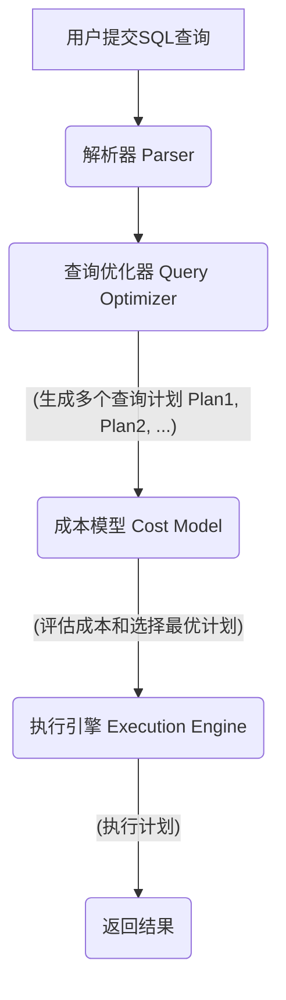
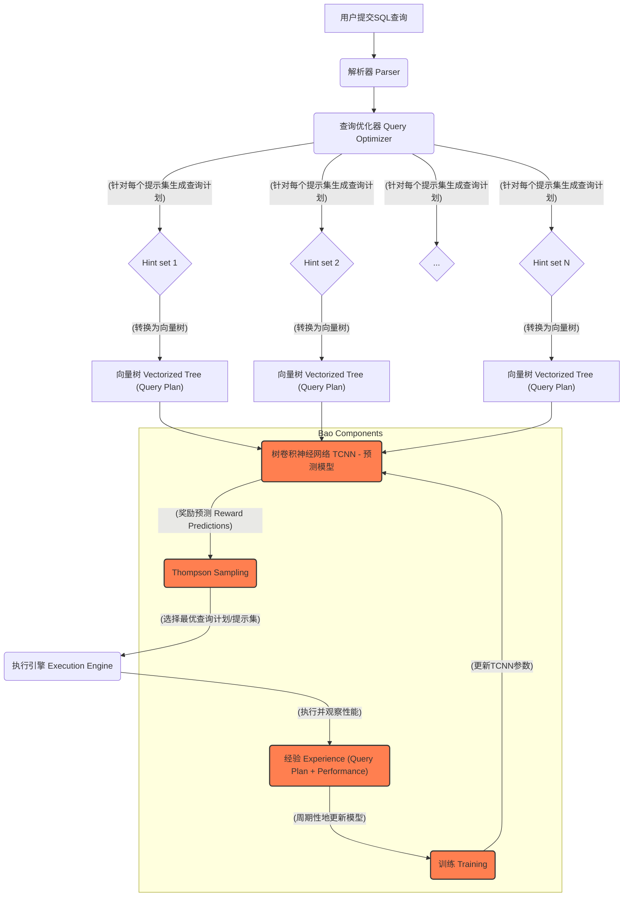

## AI论文解读 | Bao: Learning to Steer Query Optimizers  
          
### 作者          
digoal          
          
### 日期          
2025-07-21         
          
### 标签          
PostgreSQL , PolarDB , DuckDB , AI , 论文解读          
          
----          
          
## 背景    
        
https://arxiv.org/pdf/2004.03814          
        
“Google Gemini 2.5 Flash Deep Research”, 提示:          
```          
三个问题:  
  
1、读懂这篇论文需要提前掌握哪些基础知识, 请使用中文讲解这些基础知识, 尽量通熟易懂, 可以使用markdown支持的图形(text,mermaid等)增加解释性.  
  
2、使用中文通熟易懂的解读这篇论文, 关键内容请深入讲解, 可以使用markdown支持的图形(text,mermaid等)增加解释性.  
  
3、使用中文提取这篇论文中的重要术语并详细解释, 可以使用markdown支持的图形(text,mermaid等)增加解释性.        
```          
  
这篇论文《Bao: Learning to Steer Query Optimizers》探讨了如何利用机器学习来改进数据库查询优化器。以下是对您三个问题的详细解答。

### 1、读懂这篇论文需要提前掌握的基础知识

要理解这篇论文，您需要具备以下几个领域的基础知识，我将尽量用通俗易懂的方式为您讲解：

#### 1.1 数据库基础 (Database Fundamentals)

  * **数据库管理系统 (DBMS)**：管理和组织数据的软件系统，如PostgreSQL, MySQL, SQL Server。
  * **SQL (Structured Query Language)**：用于与数据库交互的语言，您提交的查询通常是SQL语句。
  * **查询优化 (Query Optimization)**：DBMS中一个非常重要的环节。当您提交一个SQL查询时，数据库不会直接执行它，而是会先通过“查询优化器”分析这个查询，找出执行它的最佳方式（即生成一个“查询计划”）。目标是让查询执行得又快又省资源。
      * **查询计划 (Query Plan)**：想象一下，执行一个复杂的查询就像修建一座房子。有多种方法可以完成，但有的方法更快、更省材料。查询计划就是执行查询的“施工图”，它描述了数据如何被读取、连接、排序和聚合等一系列操作的顺序和方式。
      * **查询操作符 (Query Operators)**：查询计划中的基本“步骤”或“组件”，比如：
          * **扫描 (Scan)**：读取表中的数据。可以是全表扫描（Sequential Scan）或通过索引扫描（Index Scan）。
          * **连接 (Join)**：将来自两个或更多表的数据组合起来。常见的连接类型有：
              * **嵌套循环连接 (Nested Loop Join)**：最简单，对于小表连接大表可能高效。
              * **哈希连接 (Hash Join)**：将一个表的数据构建成哈希表，然后用另一个表的数据去探测。适合大数据量连接。
              * **合并连接 (Merge Join)**：需要两个输入都是有序的，然后进行合并。
          * **聚合 (Aggregate)**：如COUNT, SUM, AVG等，对数据进行汇总。
          * **排序 (Sort)**：对数据进行排序。
      * **基数估计 (Cardinality Estimation)**：在生成查询计划时，优化器需要预测每个操作会产生多少行数据。这个预测的准确性直接影响到它选择的计划好坏。如果预测不准，可能会选错低效的计划。
      * **成本模型 (Cost Modeling)**：优化器会根据查询计划中每个操作的“成本”（如CPU时间、磁盘I/O次数、内存使用等）来评估整个计划的“总成本”，从而选择成本最低的计划。




#### 1.2 机器学习基础 (Machine Learning Fundamentals)

  * **监督学习 (Supervised Learning)**：从带有标签的数据中学习，目标是预测新数据的标签（如分类或回归）。

  * **强化学习 (Reinforcement Learning - RL)**：一种机器学习范式，代理（Agent）通过与环境互动来学习如何做出决策以最大化累积奖励。它不依赖于预先标记的数据，而是通过试错来学习。

      * **代理 (Agent)**：学习并做出决策的实体（在这里是Bao）。
      * **环境 (Environment)**：代理所处的系统（在这里是数据库和查询执行）。
      * **动作 (Action)**：代理在环境中执行的操作（在这里是选择一组查询提示）。
      * **奖励 (Reward)**：环境根据代理的动作给予的反馈（在这里是查询执行的性能，比如查询延迟）。
      * **状态 (State)**：环境在某一时刻的描述（在这里可能是查询本身、查询计划或数据库的缓存状态）。

  * **神经网络 (Neural Networks)**：受人脑启发的计算模型，用于模式识别和预测。

      * **卷积神经网络 (Convolutional Neural Networks - CNN)**：特别擅长处理图像数据，通过卷积层提取特征。
      * **树卷积神经网络 (Tree Convolutional Neural Networks - TCNN)** ：CNN的一种变体，专门用于处理树形结构数据。论文中用它来处理查询计划树，以识别计划中的模式。

#### 1.3 多臂老虎机问题 (Multi-Armed Bandit Problem - MAB)

  * **概念**：想象你面前有一排老虎机（“多臂”），每台老虎机的出奖概率不同且未知。你每次只能拉一台老虎机的摇臂。你的目标是在尽可能少的尝试次数下，找出哪台老虎机最能让你赚钱，并主要拉那台。

  * **探索与利用 (Exploration and Exploitation)**：这是MAB问题的核心矛盾。

      * **探索 (Exploration)**：尝试那些你不太了解的老虎机，以获取新的信息，看看它们是否可能带来更高的奖励。
      * **利用 (Exploitation)**：拉动那些你已经知道能带来较高奖励的老虎机，以最大化当前收益。
      * MAB算法的目标就是找到一个平衡点，既能充分探索，又能高效利用。

  * **上下文多臂老虎机 (Contextual Multi-Armed Bandit - CMAB)** ：比MAB更复杂一些。在每次选择摇臂之前，你会获得一些“上下文信息”（例如，老虎机旁边的天气、一天中的时间等）。你的目标是根据这些上下文信息，选择最可能带来高奖励的摇臂。

      * 在Bao中，每个“摇臂”是一个“查询提示集” ，而“上下文”是优化器为每个提示集生成的“查询计划” 。

#### 1.4 汤普森采样 (Thompson Sampling)

  * **概念** ：一种经典的CMAB算法，用于平衡探索与利用。它不是直接选择预测奖励最高的摇臂，而是根据每个摇臂的奖励分布概率进行采样，然后选择采样值最高的摇臂。
  * **直观理解**：想象你对每台老虎机的出奖概率都有一个信念（一个概率分布）。汤普森采样不是选你目前认为最好的那台，而是根据你的信念随机抽一台，然后去拉。如果你对某台老虎机的了解还不够（信念分布很宽），它被抽到的概率就可能更高，促使你去“探索”它。随着你收集更多数据，你的信念会变得更精确，你就会倾向于更多地“利用”那些你认为最好的老虎机。这种方式能自然地平衡探索与利用 。

### 2、使用中文通俗易懂地解读这篇论文

#### 2.1 论文核心问题：数据库查询优化器的痛点

数据库查询优化是数据管理系统中最具挑战性的问题之一 。尽管经过了几十年的研究 ，传统的查询优化器仍然面临一些难题，例如：

  * **基数估计和成本模型的挑战**：优化器需要准确预测中间结果集的大小和操作的成本，但这非常困难 。
  * **机器学习方法的局限性** ：
      * **样本效率低下 (Sample efficiency)** ：现有的机器学习优化器通常需要海量的训练数据，收集这些数据耗时且昂贵（比如获取精确的基数）。强化学习方法甚至需要处理数千次查询才能超越传统优化器，这可能需要数天时间 。
      * **脆弱性 (Brittleness)** ：当查询负载、数据或模式发生变化时，这些学习模型需要重新训练，否则性能会迅速下降 。
      * **尾部性能灾难 (Tail catastrophe)** ：虽然平均性能可能提升，但在少数查询上可能出现灾难性的性能回退（例如，慢100倍），这在实际应用中是不可接受的 。

#### 2.2 Bao 的核心思想：智能“引导”而非完全“取代”

传统机器学习方法试图完全取代或大部分取代现有查询优化器 ，但论文认为这“可能连婴儿带洗澡水一起倒掉了”（thrown the baby out with the bathwater） 。现有的查询优化器凝聚了几十年精心编码的智慧 ，不应该被完全抛弃。

**Bao 的核心思想是**：它不是要取代现有查询优化器，而是在其之上构建一个学习组件，通过提供\*\*粗粒度的“查询提示”\*\*来“引导”或“转向”现有优化器，使其朝着正确的方向发展 。Bao 旨在“增强”查询优化，而不是“替换”它 。

例如，PostgreSQL 在基数估计不准确时，可能会错误地选择低效的“嵌套循环连接”（Loop Join） 。有时禁用嵌套循环连接可以带来3倍的性能提升（如查询16b），但有时禁用它却会导致50倍的性能下降（如查询24b）。这说明，简单的提示可能有利有弊，Bao 的任务就是学习在不同查询下如何智能地提供这些提示。

#### 2.3 Bao 的工作原理深入解读

Bao 将查询优化问题建模为一个**上下文多臂老虎机 (CMAB) 问题** 。

**Bao 的系统模型 (System Model)**:



上图是Bao的系统模型简化图。具体流程如下：

1.  **查询解析与提示集生成**：用户提交SQL查询后，首先经过解析器 。然后，Bao 会与底层查询优化器互动，为每个预定义的“查询提示集”生成一个查询计划 。

      * **查询提示 (Query Hint)**：类似于给优化器的一个“开关”或“建议”，来改变其行为 。例如，“禁用嵌套循环连接”、“强制使用索引”等 。Bao 关注的是布尔型（开/关）提示。
      * **提示集 (Hint Set)**：是多个有效查询提示的组合 。Bao 在每次查询时选择一个最合适的提示集 。

2.  **查询计划向量化 (Vectorizing Query Plan Trees)** ：

      * **二值化 (Binarization)** ：许多机器学习模型，特别是TCNN，处理严格的二叉树结构更方便。然而，实际的查询计划树可能包含多子节点（如聚合、排序）。Bao 通过插入“空节点”（null nodes）将非二叉查询计划树转换为二叉树 。
        ```
        Original Query Plan:
              Aggregate
                  |
              Merge Join
              /        \
            Sort        Seq Scan
            /
        Loop Join
        /        \
        Seq Scan   Idx Scan

        Binarized Query Plan (示意):
              Aggregate
              /       \
          Merge Join   null
          /       \
        Sort       Seq Scan
        /     \
        Loop Join null
        /       \
        Seq Scan  Idx Scan
        ```
      * **特征向量编码 (Vectorization)** ：二值化后的查询计划树的每个节点（即每个操作符）被编码成一个低维的特征向量，包含三部分 ：
          * **操作符类型的一热编码 (One-hot encoding of operator type)** ：表示该节点是什么类型的操作符（如合并连接、排序）。
          * **基数和成本模型信息 (Cardinality and cost model information)** ：优化器对该操作符的基数（估计行数）和成本估计。这些信息能帮助Bao识别潜在的问题操作（例如，对大型关系进行嵌套循环连接） 。
          * **(可选) 缓存信息 (Cache information)** ：数据库磁盘缓存的当前状态信息，例如，扫描节点对应的文件有多少百分比的数据在缓存中 。这使得Bao能够选择与当前缓存状态更兼容的计划。
      * **优点**：这种向量化方案与底层数据库模式无关 ，并且数据变化可以通过现有的基数估计更新反映出来 ，提高了适应性。

3.  **预测模型：树卷积神经网络 (Tree Convolutional Neural Networks - TCNN)** ：

      * TCNN 是 Bao 的核心预测模型，它接收向量化的查询计划树作为输入 。
      * **原理**：TCNN 能够识别查询计划树中的“模式”或“子结构” 。就像人类专家通过经验识别好的或坏的查询计划模式一样（例如，没有中间排序的合并连接管道可能表现良好，而哈希连接上方的合并连接可能导致冗余排序），TCNN 自动从数据中学习这些模式。
      * **输出**：TCNN 预测每个查询计划的执行结果（例如，查询执行的挂钟时间） 。

4.  **决策与学习：汤普森采样 (Thompson Sampling)** ：

      * Bao 使用汤普森采样算法在探索新计划和利用已知快速计划之间取得平衡 。
      * **流程**：
        1.  TCNN 预测每个查询计划的性能 。
        2.  汤普森采样根据 TCNN 的预测和当前模型的“不确定性”，从模型参数的后验分布中采样一组参数 。
        3.  使用这组采样的参数，Bao 选择一个提示集，这个提示集对应的查询计划被预测为最佳性能 。
        4.  所选的查询计划被发送到执行引擎执行 。
        5.  查询执行完成后，实际观察到的性能数据（奖励）与查询计划一起被添加到 Bao 的“经验”数据集中 。
        6.  Bao 周期性地使用这些“经验”来重新训练 TCNN 预测模型，形成一个反馈循环，使模型不断改进，Bao 学习选择越来越好的查询提示 。

#### 2.4 Bao 的主要优势

  * **高效学习 (Sample Efficiency)** ：Bao 能够在短时间内（约1小时）学习策略，显著优于需要数天训练的前沿方法 。
  * **适应性强 (Adaptability)** ：Bao 能够自动适应查询负载、数据和模式的变化，而无需像其他方法那样进行全面重新训练 。
  * **改善尾部性能 (Tail Performance Improvement)** ：Bao 能够显著降低查询的尾部延迟（最慢的少数查询的性能），解决了其他学习方法的“尾部灾难”问题。
  * **可解释性与调试 (Debuggability)** ：相比其他黑盒深度学习方法，Bao 的决策更容易调试。如果查询表现不佳，工程师可以检查 Bao 选择的查询提示，并根据需要编写排除规则 。
  * **可扩展性 (Extensibility)** ：可以随时添加或移除查询提示，这使得测试新的优化器策略变得容易 。
  * **缓存感知 (Cache Awareness)** ：Bao 可以利用数据库缓存状态信息来选择更优的查询计划，而这在传统成本模型中很难集成 。

#### 2.5 实验结果总结

论文通过在Google Cloud Platform上的PostgreSQL和商业数据库系统上进行实验，验证了 Bao 的有效性 。

  * **成本与延迟降低**：Bao 能够降低总成本和工作负载延迟 。例如，在N1-16机器上，Bao 相较于 PostgreSQL 优化器实现了近50%的成本和延迟降低 。
  * **尾部延迟显著改善** ：Bao 在 IMDb 工作负载下，无论在哪种虚拟机类型上，都能显著改善查询的95%、99%、99.5%百分位延迟，远超 PostgreSQL 和商业系统。这表明 Bao 有效解决了“尾部灾难”问题。
  * **对动态变化的适应性** ：Bao 在动态工作负载、数据和模式变化的情况下，表现出比现有学习优化方法（如Neo）更好的适应性。
  * **对劣质提示的鲁棒性** ：即使引入了会生成非常差的查询计划的提示集，Bao 也能在极少的尝试后迅速学会避免使用它 。

### 3、论文中重要的术语及其解释

#### 3.1 查询优化相关术语

  * **查询优化器 (Query Optimizer)** ：数据库管理系统（DBMS）的一个核心组件，负责分析用户提交的SQL查询，并找到执行该查询的最有效（通常是成本最低）的“查询计划”。
  * **查询计划 (Query Plan)** ：由查询优化器生成的一系列操作步骤，描述了如何从数据库中检索、处理和组合数据以满足特定查询的详细过程。它通常以树形结构表示。
  * **查询提示 (Query Hint / Hints)** ：提供给查询优化器的指令或建议，用于影响其选择查询计划的行为。例如，强制使用特定索引、禁用某种连接类型等。Bao 主要使用布尔型（开关）提示 。
  * **提示集 (Hint Set)** ：一组查询提示的集合。Bao 为每个传入的查询选择一个最佳的提示集。
  * **基数估计 (Cardinality Estimation)** ：预测数据库查询中每个中间操作会产生多少行结果的数值。准确的基数估计对查询优化器选择高效的查询计划至关重要。
  * **成本模型 (Cost Modeling)** ：用于评估不同查询计划执行成本的数学模型。成本通常以CPU时间、磁盘I/O次数、内存使用等为衡量标准，优化器会选择总成本最低的计划。
  * **查询操作符 (Query Operator)** ：查询计划树中的基本操作单元，如扫描（Scan）、连接（Join）、聚合（Aggregate）、排序（Sort）等。

#### 3.2 机器学习与强化学习术语

  * **强化学习 (Reinforcement Learning, RL)**：一种机器学习范式，代理（Agent）通过与环境的交互学习最优决策策略，目标是最大化累积奖励。它通过“试错”来学习。
  * **多臂老虎机问题 (Multi-Armed Bandit Problem, MAB)** ：一个经典的强化学习问题，代理需要在有限的选项（“臂”）中选择，每个选项的收益分布未知。目标是在长期内最大化总收益，需要平衡“探索”（尝试新的选项）和“利用”（选择已知收益高的选项）。
  * **上下文多臂老虎机 (Contextual Multi-Armed Bandit, CMAB)** ：MAB问题的一种变体，在每次选择“臂”之前，代理会获得一些关于当前决策环境的“上下文信息”。代理需要根据这些上下文信息来选择最佳的“臂”。在Bao中，查询计划就是上下文 。
  * **汤普森采样 (Thompson Sampling)** ：一种解决多臂老虎机问题的贝叶斯算法，通过从每个“臂”的收益分布的后验概率中采样来决定选择哪个“臂”。它能有效地平衡探索与利用。
  * **探索与利用 (Exploration and Exploitation)** ：强化学习中的核心矛盾。
      * **探索 (Exploration)**：指代理尝试不熟悉的动作或状态，以发现潜在的更高奖励。
      * **利用 (Exploitation)**：指代理选择已知的、当前看来能带来最大奖励的动作。
      * 好的强化学习算法必须有效地平衡两者。
  * **树卷积神经网络 (Tree Convolutional Neural Network, TCNN)** ：一种专门设计用于处理树形结构数据的神经网络。它通过在树结构上执行卷积操作来学习节点及其子树的特征和模式。在Bao中，TCNN 用于学习查询计划树的特征并预测其性能 。
  * **查询计划二值化 (Query Plan Binarization)** ：将非二叉的查询计划树（即某些节点有超过两个子节点）转换为严格的二叉树的过程。这通常通过插入“空节点”（null nodes）来完成，以便更方便地应用于某些神经网络模型（如TCNN）。
  * **向量化 (Vectorization)** ：将非数值数据（如查询计划中的操作符）转换为数值向量的过程，以便机器学习模型可以处理。在Bao中，每个查询计划操作符被编码为一个包含操作符类型、基数估计、成本信息和可选缓存信息的向量 。
  * **后悔 (Regret)** ：在强化学习和多臂老虎机问题中，用来衡量一个学习算法性能的指标。它表示算法在学习过程中所获得的累积奖励与如果每次都做出最优决策所能获得的理论最大累积奖励之间的差距。Bao 的目标是最小化后悔值 。
  * **样本效率 (Sample Efficiency)** ：衡量一个机器学习模型需要多少训练数据才能达到良好性能的指标。样本效率高的模型在数据量较少的情况下也能表现良好。

#### 3.3 性能衡量术语

  * **查询延迟 (Query Latency)** ：指一个查询从开始执行到返回结果所需的时间。越低越好。
  * **尾部延迟 (Tail Latency)** ：指查询性能分布中处于“尾部”的查询的延迟，例如95百分位、99百分位甚至99.5百分位的延迟。这些代表了最慢的那部分查询的性能，在实际系统中通常非常关键，因为它们可能影响用户体验。
  * **成本 (Cost)** ：通常指在云环境中执行工作负载（包括训练开销）所产生的费用。Bao 旨在降低云环境下的总成本。
  * **缓存 (Cache)** ：计算机系统中用于临时存储数据的高速存储区域，以便更快地访问常用数据。数据库管理系统通常有自己的缓存（如缓冲池），存储从磁盘读取的数据页。Bao 可以感知缓存状态，从而选择对缓存更友好的查询计划 。

  
  
#### [期望 PostgreSQL|开源PolarDB 增加什么功能?](https://github.com/digoal/blog/issues/76 "269ac3d1c492e938c0191101c7238216")
  
  
#### [PolarDB 开源数据库](https://openpolardb.com/home "57258f76c37864c6e6d23383d05714ea")
  
  
#### [PolarDB 学习图谱](https://www.aliyun.com/database/openpolardb/activity "8642f60e04ed0c814bf9cb9677976bd4")
  
  
#### [PostgreSQL 解决方案集合](../201706/20170601_02.md "40cff096e9ed7122c512b35d8561d9c8")
  
  
#### [德哥 / digoal's Github - 公益是一辈子的事.](https://github.com/digoal/blog/blob/master/README.md "22709685feb7cab07d30f30387f0a9ae")
  
  
#### [About 德哥](https://github.com/digoal/blog/blob/master/me/readme.md "a37735981e7704886ffd590565582dd0")
  
  

  
