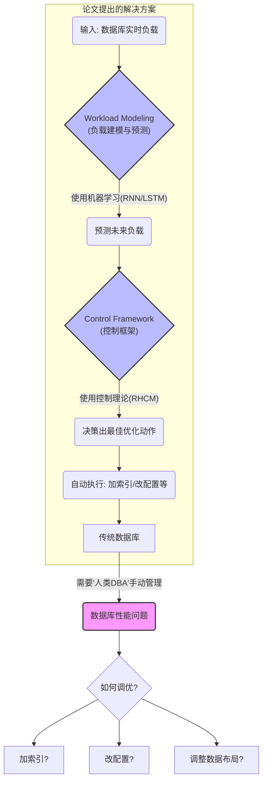
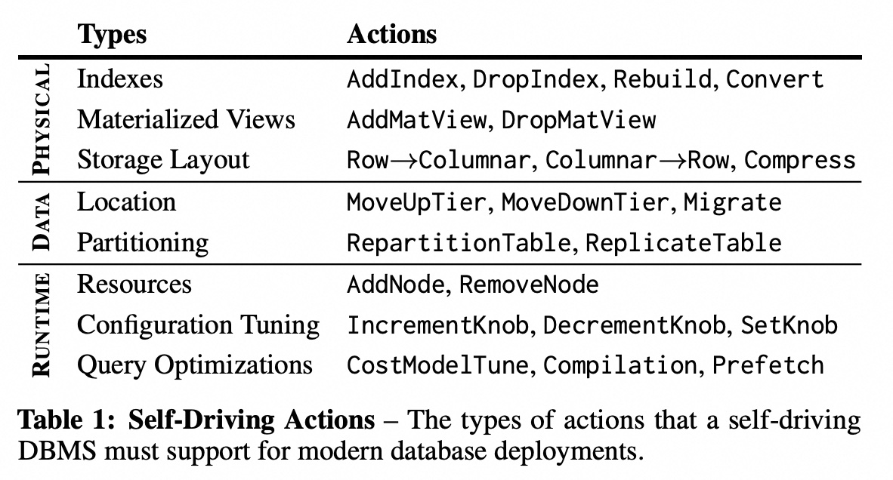
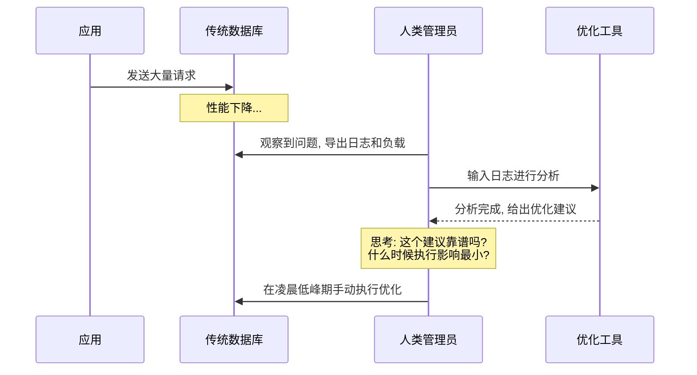
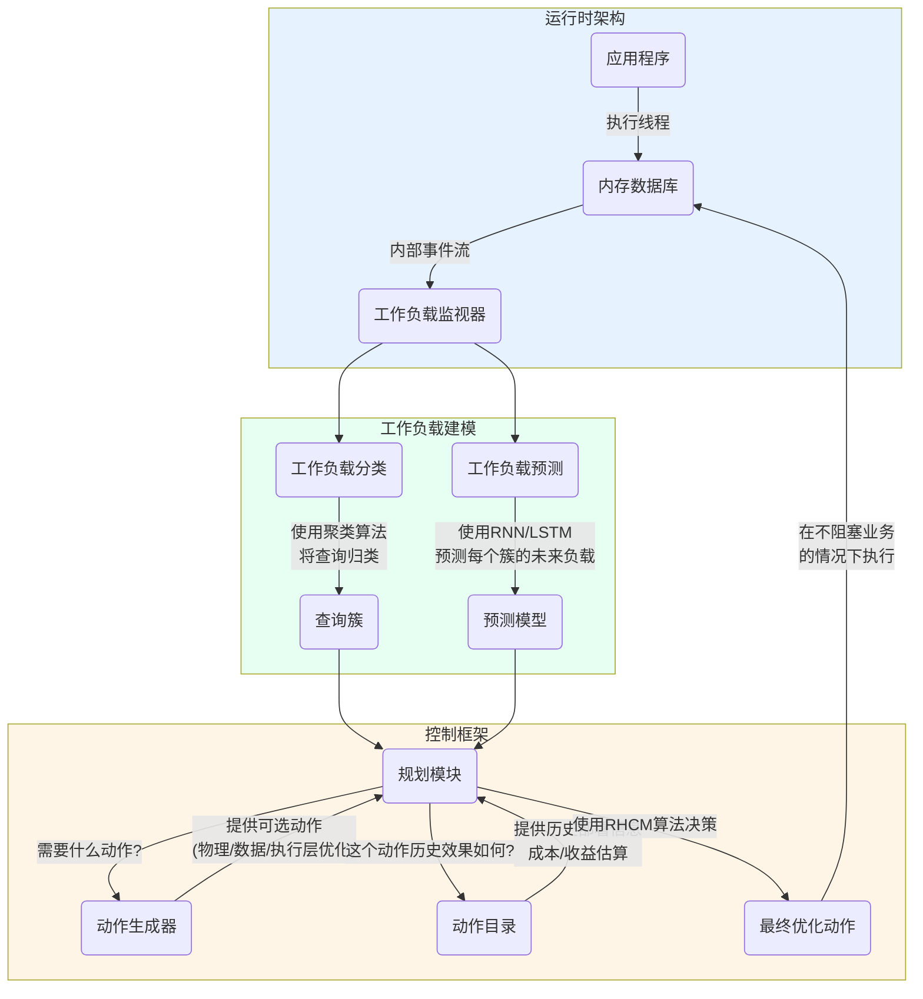
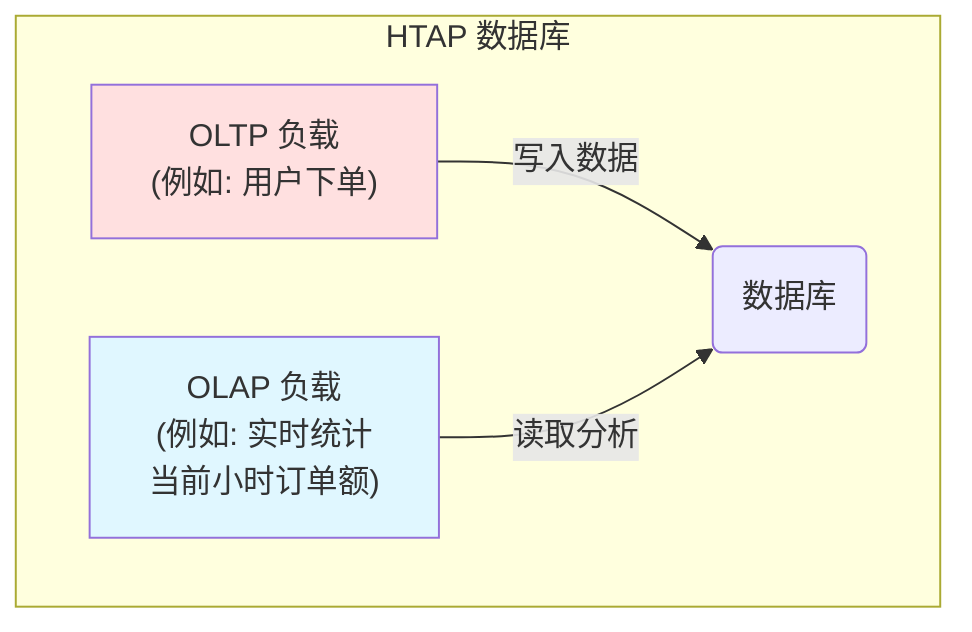
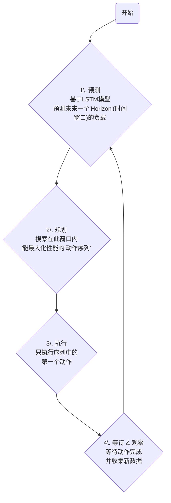

## AI论文解读 | Self-Driving Database Management Systems
        
### 作者        
digoal        
        
### 日期        
2025-07-22       
        
### 标签        
PostgreSQL , PolarDB , DuckDB , AI , 论文解读        
        
----        
        
## 背景  
      
https://db.cs.cmu.edu/papers/2017/p42-pavlo-cidr17.pdf        
  
      
提示:        
```        
读懂《Self-Driving Database Management Systems》这篇论文需要提前掌握哪些基础知识, 请使用中文讲解这些基础知识, 尽量通熟易懂, 可以使用markdown支持的图形(如text、mermaid等)增加解释性.        
        
使用中文通熟易懂的解读《Self-Driving Database Management Systems》这篇论文, 其中的关键内容请详细讲解, 可以使用markdown支持的图形(如text、mermaid等)增加解释性.        
        
使用中文提取《Self-Driving Database Management Systems》论文中的重要术语并详细解释, 可以使用markdown支持的图形(如text、mermaid等)增加解释性.        
```     

## 1 前置知识    
  
好的，为了能透彻理解《Self-Driving Database Management Systems》这篇开创性的论文，你需要掌握几个核心领域的基础知识。这篇论文的精髓在于，它将经典的数据库问题与现代的机器学习及控制理论相结合，创造出一个能自我管理的“智能”数据库。

下面我将用通俗易懂的语言，为你梳理这些必备的知识点，并辅以图表解释。

-----

### 核心脉络

在深入细节之前，我们先用一张图来理解这篇论文要解决的问题和它的方法论：



这张图清晰地展示了从“人类凭经验调优”到“系统自动预测并决策”的转变。要读懂这个过程，你需要了解以下四个方面的知识。

### 一、数据库管理系统 (DBMS) 基础

这是所有讨论的基石。你需要明白数据库不仅仅是一个存数据的大仓库。

1.  **查询处理 (Query Processing)**

      * **是什么**: 当你向数据库发送一条SQL查询语句时，数据库内部会经历一系列复杂的步骤来返回结果，主要包括：**解析 (Parsing)** -\> **优化 (Optimization)** -\> **执行 (Execution)**。
      * **为何重要**: 这篇论文的核心就是让数据库**自动**完成“优化”这一步，并且优化得更智能、更具前瞻性。传统的优化器是基于静态的成本模型，而自驾驶数据库则希望根据实时和预测的负载来动态做出更好的决策。

2.  **存储布局 (Storage Layout): 行存 vs. 列存**

      * **是什么**:
          * **行存储 (Row Store)**: 数据按行连续存储。适合一次性需要读/写一整行中多个列的场景。
          * **列存储 (Column Store)**: 数据按列连续存储。适合只关心少数几列，但要扫描大量数据的场景。
      * **为何重要**: 论文中反复提到的 **OLTP** 和 **OLAP** 两种负载，它们对存储布局有截然不同的偏好。
          * **OLTP (联机事务处理)**: 如网上购物、银行转账。特点是大量、简短、高并发的读写事务。它偏爱**行存**。
          * **OLAP (联机分析处理)**: 如季度销售分析、用户行为报告。特点是少量、复杂、耗时长的查询，通常只读。它偏爱**列存**。
          * 论文中的 **HTAP (混合事务/分析处理)** 场景，正是因为要同时应对这两种负载，所以才需要动态、智能地调整数据布局（比如，将“热”数据行存，“冷”数据列存）。

    

    ```text
    # 行存储 (适合OLTP)
    [ID_1, Name_1, Age_1, Dept_1] [ID_2, Name_2, Age_2, Dept_2] ...

    # 列存储 (适合OLAP)
    [ID_1, ID_2, ID_3, ...] [Name_1, Name_2, Name_3, ...] [Age_1, Age_2, Age_3, ...]
    ```

3.  **物理设计 (Physical Design)**

      * **是什么**: 指的是如何组织数据在物理层面的存储，以提升查询性能。这完全是数据库管理员 (DBA) 的核心工作。
      * **为何重要**: 论文中提到的系统可执行的“动作 (Actions)”（见论文Table 1 ），绝大部分都属于物理设计的范畴：   
          * **索引 (Indexes)**: 就像书的目录，能极大加速数据查找。建哪些索引、何时建、何时删，是经典的DBA难题。
          * **物化视图 (Materialized Views)**: 将复杂查询的结果预先计算并存储起来，下次查询时直接用，空间换时间。
          * **分区 (Partitioning)**: 将一个大表切分成多个小块，查询时只访问相关的小块，提高效率。

### 二、数据库管理与调优 (DBA 的工作)

你需要站在一个数据库管理员 (DBA) 的角度，理解他们日常面临的挑战。

1.  **工作负载 (Workload)**

      * **是什么**: 指的是应用程序在一段时间内对数据库发出的所有请求的集合。工作负载是有模式的，比如电商网站白天交易多，晚上报表多。
      * **为何重要**: 自驾驶数据库的第一步就是**理解和预测工作负载** 。如果连车要去哪、路上车多不多都不知道，自动驾驶就无从谈起。

2.  **性能调优 (Performance Tuning)**

      * **是什么**: 通过调整数据库的物理设计和配置参数，来提升其响应速度和吞吐量。这是一个非常依赖经验和反复试验的过程。
      * **为何重要**: 论文的目标就是将这个过程**自动化**。传统工具是“顾问”角色，它们分析后给出建议，由DBA来决策和执行 。而自驾驶系统希望成为“司机”，直接做出决策并执行 。

### 三、机器学习 (Machine Learning)

这是实现“智能预测”的核心技术。

1.  **无监督学习: 聚类 (Clustering)**

      * **是什么**: 一种自动将相似数据点归为一类的方法，事先不需要知道有哪些类别。
      * **为何重要**: 数据库的查询成千上万，但很多查询的行为是相似的。论文使用聚类算法 (如DBSCAN ) 将海量的查询自动聚合成有限的几个“查询模板”或“类别” 。这样做可以大大简化后续的预测任务，我们只需要为每个类别进行预测，而不用为每一条具体查询预测。

2.  **时间序列预测 (Time-Series Forecasting)**

      * **是什么**: 基于历史数据点来预测未来的数据点。比如根据过去一周的气温，预测明天的气温。
      * **为何重要**: 数据库的工作负载（比如每个查询类别的请求量）就是一个典型的时间序列，它会随着时间（小时、天、周）呈现周期性波动 。

3.  **循环神经网络 (RNN) 和 长短期记忆网络 (LSTM)**

      * **是什么**:
          * **RNN**: 一种特殊的神经网络，它带有“记忆”，能够处理序列数据。就像你读句子一样，你会记住前面的词来理解当前的词。
          * **LSTM**: RNN的一种变体，拥有更强大的“长期记忆”能力，能捕捉到时间序列中跨度很长的依赖关系和周期性 。
      * **为何重要**: 论文明确使用LSTM来构建预测模型 ，以预测未来每个查询类别的到达率。这个预测结果是后续所有决策的基础。模型的准确性直接决定了自驾驶系统的“预判”能力。

### 四、控制理论 (Control Theory)

这是实现“智能决策”的理论框架。

1.  **基本概念**

      * **是什么**: 一个工程和数学领域，研究如何控制一个动态系统，使其达到期望的状态。最经典的例子是空调的恒温器。
      * **为何重要**: 自驾驶数据库可以被看作一个动态系统。它的**当前状态**是当前的配置和性能，**期望状态**是低延迟、高吞吐，而**控制手段**就是执行各种优化动作（加索引等）。

2.  **衰退域控制模型 (Receding-Horizon Control Model, RHCM)**

      * **是什么**: 一种非常实用的控制策略，被用于自动驾驶汽车等复杂系统中 。它的核心思想是“向前看一小步，走一小步，然后不断重新规划”。
      * **为何重要**: 这正是论文中规划模块 (Planning Module) 的核心算法 。其工作流程可以简化为：

    

    ```mermaid
    graph TD
        A(Start) --> B{"1\. 预测<br>使用LSTM模型预测未来一段时间(Horizon)的负载"};
        B --> C{"2\. 规划<br>搜索在这段时间内, 哪一个'动作序列'<br>能使总体性能最好(如延迟最低)"};
        C --> D{3\. 执行<br>不执行整个序列, 只执行该序列中的<br><b>第一个动作</b>};
        D --> E{4\. 等待 & 观察<br>等待动作完成, 收集新的系统数据};
        E --> B;
        A ~~~ E;

        style C fill:#ccf,stroke:#333,stroke-width:2px
        style D fill:#f99,stroke:#333,stroke-width:2px
    ```

    RHCM的精妙之处在于它既有前瞻性（因为它规划了一个未来时间段），又非常灵活（因为它只执行第一步，然后立即根据最新的情况重新规划），能够应对突发变化。

-----

### 总结

要读懂《Self-Driving Database Management Systems》，你需要：

  * **懂数据库**: 明白查询如何执行、数据如何存储，以及OLTP和OLAP的区别。
  * **懂DBA**: 理解性能调优的痛点，比如索引、分区等物理设计的权衡。
  * **懂机器学习**: 知道如何用聚类分析负载，如何用RNN/LSTM做时间序列预测。
  * **懂控制论**: 了解RHCM的基本思想，即如何在一个动态变化的环境中做出最优的、渐进式的决策。

这篇论文的魅力就在于它将这四个看似独立的领域完美地融合在了一起，为数据库的未来发展方向描绘了一幅激动人心的蓝图。掌握了以上基础知识，你就能更好地欣赏其架构设计的前瞻性和巧妙之处了。
  
## 2 解读论文 
  
好的，这篇名为《Self-Driving Database Management Systems》（自驾驶数据库管理系统）的论文，描绘了一种革命性的数据库架构。它的核心思想是，让数据库像一辆自动驾驶汽车一样，能够自我感知、自我预测、自我决策并自我优化，从而摆脱对人类数据库管理员（DBA）的依赖 。

下面，我将为您深入浅出地解读这篇论文的关键内容。

### 一、问题所在：传统数据库的“手动挡”困境

传统的数据库管理系统（DBMS）功能虽然强大，但在“调优”这件事上，却非常依赖人类专家 。

  * **被动响应**: 现有的大多数优化工具都是“事后诸葛亮” 。它们在问题（比如系统变慢）发生后进行分析，然后给DBA提供优化建议，如“应该在这里创建一个索引”或“调整某个配置参数” 。
  * **依赖人类决策**: 最终是否执行这些建议，以及在何时执行（比如业务低峰期），都需要DBA来做最后决定 。
  * **知识门槛高**: 操作这些工具需要DBA对数据库内部原理有深入的理解，并且需要准备复杂的负载样本和测试环境 。
  * **各自为战**: 很多工具只专注于解决单一问题，比如只管索引优化，或者只管内存配置，缺乏一个全局的、统一的视角 。

我们可以用一个简单的图来描述这种困境：



这种“手动挡”模式在今天这个数据量和业务复杂度剧增的时代，已经越来越力不从心 。

### 二、核心架构：Peloton 的“自动驾驶”方案

为了解决上述问题，论文提出了一个全新的、为自主运行而设计的数据库架构——Peloton 。它的目标是，系统能够自动学习如何降低应用程序的查询延迟 。

Peloton的自驾驶工作流程可以分为三大模块：**工作负载建模 (Workload Modeling)**、**控制框架 (Control Framework)** 和 **运行时架构 (Runtime Architecture)** 。

下面是整个工作流程的示意图：



#### 1\. 工作负载建模 (Workload Modeling)

这是自驾驶的“眼睛”和“大脑”，负责理解过去并预测未来。

  * **工作负载分类 (Workload Classification)**:

      * **目标**: 将成千上万条SQL查询，根据它们的特征（如查询的结构、涉及的表和谓词等）自动聚合成有限的几个类别 。
      * **方法**: 采用像DBSCAN这样的无监督学习算法 。
      * **意义**: 分类后，系统就不需要为每一条独立的查询做预测，而是为每一“类”查询做预测，大大降低了复杂性，也更容易发现规律 。

  * **工作负载预测 (Workload Forecasting)**:

      * **目标**: 预测在未来某个时间点，每个类别的查询会有多少请求量 。这能让系统预见负载的高峰和低谷 。
      * **方法**: 论文放弃了传统的线性模型（如ARMA），因为它无法很好地处理数据库负载的非线性特征 。转而采用了**循环神经网络 (RNN)**，特别是它的变种**长短期记忆网络 (LSTM)** 。LSTM非常擅长从时间序列数据中学习周期性和重复出现的趋势（如人类活动的昼夜模式） 。
      * **实现**: Peloton会为不同的时间粒度（比如未来1小时和未来24小时）维护多个RNN模型，以兼顾短期精确性和长期规划 。

#### 2\. 控制框架 (Control Framework)

这是自驾驶的“方向盘”和“油门”，负责决策和执行。

  * **动作生成与规划 (Action Generation & Planning)**:
      * **动作库 (Action Catalog)**: 系统有一个目录，里面存放了所有可以执行的优化动作，例如：

          * **物理优化**: 创建/删除索引 。
          * **数据优化**: 改变表的存储方式（行存或列存）、数据分区 。
          * **运行时优化**: 调整配置参数、增删节点 。
            这个目录还记录了每个动作在过去被执行时的历史效果 。

      * **决策算法 (Planning)**: 这是最核心的部分。Peloton采用了一种源于控制理论的**衰退域控制模型 (Receding-Horizon Control Model, RHCM)** 。

          * **核心思想**: “向前看一小步，走一小步，然后不断重新规划” 。
          * **工作流程**:
            1.  **预测 (Forecast)**: 基于LSTM的预测结果，估算未来一个短暂时间窗口（“Horizon”）内的工作负载 。
            2.  **规划 (Plan)**: 在这个时间窗口内，搜索一系列能让性能最优（即延迟最低）的动作序列 。系统会评估每个动作的成本（执行所需资源和时间）和收益（查询延迟的降低） 。
            3.  **执行 (Act)**: **只执行这个最优序列中的第一个动作** 。
            4.  **重复 (Repeat)**: 等待第一个动作执行完毕，然后抛弃旧的规划，进入下一个时间点，重新预测、重新规划 。

        RHCM的优势在于，它既有前瞻性，又能快速响应变化。因为动作执行时间很短（分钟级），系统可以频繁地调整策略，而不必担心在一个漫长的优化任务中途工作负载发生变化 。

#### 3\. 运行时架构 (Runtime Architecture)

这是自驾驶的“车身”，提供了高效执行优化的能力。

  * **无阻塞操作**: Peloton的底层架构（如多版本并发控制MVCC和内存存储）允许它在不阻塞或极少影响应用查询的情况下，在线执行优化动作，如添加索引或改变数据布局 。这是实现敏捷、高频优化的前提。
  * **硬件加速**: 像模型训练这样的计算密集型任务，可以交给GPU或协处理器来完成，避免对数据库核心的CPU造成压力 。

### 三、初步成果：验证“自动驾驶”的可行性

论文通过实验初步验证了该方案的有效性。

  * **预测准确**: 使用真实网站一个月的流量数据进行训练，Peloton的LSTM模型能够以较高的准确率（1小时和24小时模型的错误率分别为11.3%和13.2%）预测未来的工作负载 。
  * **低开销**: 在GPU上训练模型耗时仅为11到18分钟，并且对CPU几乎没有造成开销 。每个模型本身很小（约2MB），预测和更新模型的速度也很快（毫秒级） 。
  * **有效优化**: 在一个模拟的混合负载（HTAP）场景中，Peloton能够根据负载变化（白天OLTP，晚上OLAP）自动调整表的存储布局，最终使得系统性能逐渐收敛，接近甚至达到在单一场景下使用静态最优布局的水平 。

### 总结

《Self-Driving Database Management Systems》这篇论文最大的贡献在于，它没有停留在对现有数据库进行修补，而是**设计了一套全新的、为自主运行而生的闭环架构** 。它将机器学习的预测能力和控制理论的决策能力深度集成到数据库内核中，让系统具备了前瞻性，能够从“被动响应”转变为“主动规划” 。

虽然论文也承认要实现完全的自驾驶还有很多挑战，比如如何赢得DBA的信任 ，但它清晰地指明了一条通往真正“智能”数据库的可行路径，对后续的数据库研究产生了深远的影响。
  
## 3 术语  
  
好的，以下是根据《Self-Driving Database Management Systems》这篇论文梳理出的重要术语及其详细解释。

### 核心目标术语

#### Self-Driving Database Management System (自驾驶数据库管理系统)

这是整篇论文的核心概念，指的是一种被设计用于**自主运行**的数据库管理系统 (DBMS) 。

  * **详细解释**: 与传统数据库需要人类管理员（DBA）进行监控、调优和决策不同 ，自驾驶数据库的目标是实现完全的自动化。它不仅仅是在问题发生后进行被动修复 ，而是通过一个集成的规划组件，主动**预测未来的工作负载趋势**，从而提前准备，在最合适的时间自动部署优化措施 。其最终目标通常是优化系统性能，尤其是**降低延迟** 。Peloton是论文中提出的第一个自驾驶数据库管理系统 。

-----

### 工作负载 (Workload) 相关术语

工作负载是指应用程序对数据库发出的所有请求的集合。理解和区分工作负载的类型，是自驾驶决策的第一步。

#### 1\. OLTP (Online Transaction Processing - 联机事务处理)

  * **详细解释**: 这是一种以**写操作优化**为特征的工作负载类型 。通常包含大量、高并发、简短的事务，例如在线购物下单、银行转账等。对于OLTP负载，论文指出将数据以**行式存储 (Row-oriented layout)** 的方式组织是更优的选择，因为这样可以一次性高效地写入或读取一整行数据 。

#### 2\. OLAP (Online Analytical Processing - 联机分析处理)

  * **详细解释**: 这是一种以**只读查询**为特征的工作负载类型，这些查询通常只访问表中所有列的一个子集 。例如，分析一个季度所有地区的销售总额。对于OLAP负载，**列式存储 (Column-oriented layout)** 更为高效，因为它只需要读取相关的列，避免了不必要的I/O 。

#### 3\. HTAP (Hybrid Transactional/Analytical Processing - 混合事务/分析处理)

  * **详细解释**: 这是一种新兴的应用类型，它需要在由OLTP事务写入数据后，**立即对这些新数据进行OLAP查询** 。这种混合需求导致传统的解决方案——即为OLTP和OLAP分别部署两套系统——不再适用 。自驾驶数据库需要在一个系统内同时支持这两种负载，例如，通过动态地为不同的数据段选择最合适的优化方式（如行存或列存）。




-----

### 机器学习 (Machine Learning) 相关术语

机器学习是实现“预测”和“分类”这两个自驾驶核心能力的基石。

#### 1\. Workload Classification (工作负载分类)

  * **详细解释**: 这是自驾驶系统的第一步，通过**无监督学习**方法，将具有相似特征的查询自动分组 。在Peloton中，它使用**DBSCAN**算法来实现这一目标 。这样做的目的是减少系统需要维护和预测的模型数量，从而使预测过程更简单、更准确 。

#### 2\. Workload Forecasting (工作负载预测)

  * **详细解释**: 在完成分类后，系统需要为每个查询类别训练预测模型，以**估算它们在未来的到达率** 。准确的预测能让系统提前预知负载高峰，并在影响最小的时间窗口部署优化动作 。

#### 3\. RNN (Recurrent Neural Networks - 循环神经网络) / LSTM (Long Short-Term Memory - 长短期记忆网络)

  * **详细解释**: 这是Peloton用于工作负载预测的具体技术。论文指出，传统的线性模型（如ARMA）不适用于数据库负载的非线性特征 。而RNN，特别是其变体LSTM，是一种能有效预测非线性系统时间序列模式的方法 。LSTM通过其特殊的内部结构，能够学习并记住时间序列数据中**长期的周期性和重复趋势**（例如一天或一周的规律），这超出了常规RNN的能力 。

-----

### 控制与规划 (Control & Planning) 术语

这是自驾驶系统的大脑，负责根据预测结果做出最优决策。

#### 1\. Receding-Horizon Control Model (RHCM - 衰退域控制模型)

  * **详细解释**: 这是一种源于控制理论的决策方法，被用于管理像自动驾驶汽车这样的复杂系统 。Peloton的规划模块正是基于此模型 。它的工作流程可以被概括为“**向前看一小步，走一小步，然后不断重新规划**”。




通过这种方式，系统既有前瞻性（因为它规划未来），又非常灵活，因为它在每个时间点都会根据最新情况重新规划，而不会被一个长期的计划束缚住 。

#### 2\. Action Planning & Execution (动作规划与执行)

  * **详细解释**: 这是RHCM的具体实现。系统会根据预测的负载，从**动作目录 (Action Catalog)** 中搜索可能提升性能的动作 。每个动作的**成本**（如部署时间和资源消耗）和**收益**（如查询延迟的降低）都会被估算 。这个收益估算会利用DBMS内部的**查询优化器成本模型**来获得更准确的结果 。最终，规划模块选择一个最优动作并执行它。

#### 3\. In-Memory Database (内存数据库)

  * **详细解释**: 指主要将数据存储在主内存中的数据库。Peloton是一个**内存数据库** 。这一架构至关重要，因为它使得系统能够以极低的延迟**增量地、在线地应用优化措施**，而不会对应用程序产生可察觉的影响 。如果每次优化都需要数小时甚至数天，那么高频的、基于RHCM的自适应调整就无从谈起。
  
## 参考        
         
https://db.cs.cmu.edu/papers/2017/p42-pavlo-cidr17.pdf  
        
        
<b> 以上内容基于DeepSeek、Qwen、Gemini及诸多AI生成, 轻微人工调整, 感谢杭州深度求索人工智能、阿里云、Google等公司. </b>        
        
<b> AI 生成的内容请自行辨别正确性, 当然也多了些许踩坑的乐趣, 毕竟冒险是每个男人的天性.  </b>        
    
  
#### [期望 PostgreSQL|开源PolarDB 增加什么功能?](https://github.com/digoal/blog/issues/76 "269ac3d1c492e938c0191101c7238216")
  
  
#### [PolarDB 开源数据库](https://openpolardb.com/home "57258f76c37864c6e6d23383d05714ea")
  
  
#### [PolarDB 学习图谱](https://www.aliyun.com/database/openpolardb/activity "8642f60e04ed0c814bf9cb9677976bd4")
  
  
#### [PostgreSQL 解决方案集合](../201706/20170601_02.md "40cff096e9ed7122c512b35d8561d9c8")
  
  
#### [德哥 / digoal's Github - 公益是一辈子的事.](https://github.com/digoal/blog/blob/master/README.md "22709685feb7cab07d30f30387f0a9ae")
  
  
#### [About 德哥](https://github.com/digoal/blog/blob/master/me/readme.md "a37735981e7704886ffd590565582dd0")
  
  

  
