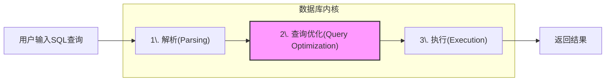
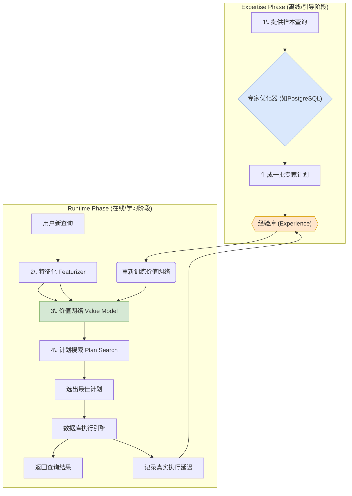
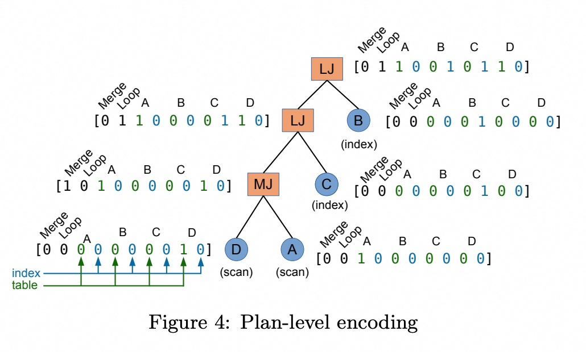
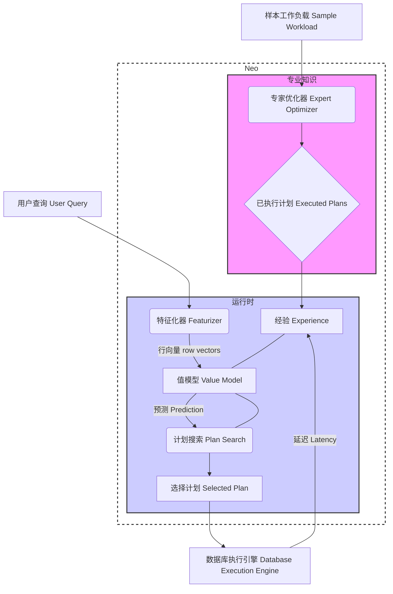

## AI论文解读 | Neo: A Learned Query Optimizer
        
### 作者        
digoal        
        
### 日期        
2025-07-22       
        
### 标签        
PostgreSQL , PolarDB , DuckDB , AI , 论文解读        
        
----        
        
## 背景  
      
https://arxiv.org/pdf/1904.03711        
  
      
提示:        
```        
读懂《Neo: A Learned Query Optimizer》这篇论文需要提前掌握哪些基础知识, 请使用中文通熟易懂的讲解这些基础知识, 可以使用markdown支持的图形(如text、mermaid等)增加解释性.        
        
使用中文通熟易懂的解读《Neo: A Learned Query Optimizer》这篇论文, 其中的关键内容请详细讲解, 可以使用markdown支持的图形(如text、mermaid等)增加解释性.        
        
提取《Neo: A Learned Query Optimizer》论文中的重要术语, 使用中文对这些术语进行通熟易懂的讲解, 可以使用markdown支持的图形(如text、mermaid等)增加解释性.        
```     

## 1 前置知识    
  
好的，为了完全理解《Neo: A Learned Query Optimizer》这篇开创性的论文，你需要对两大领域的知识有扎实的了解：**数据库系统** 和 **机器学习**。

下面我将用通俗易懂的语言，结合图表，为你分解这些必备的基础知识。

-----

### 领域一：数据库系统 (Database Systems)

这篇论文的核心是要用机器学习来解决数据库中的一个经典难题。所以，你必须先理解这个“难题”本身是什么。

#### 1\. SQL查询的生命周期 (The Lifecycle of a SQL Query)

当你向数据库提交一条SQL查询语句时，它并不是马上就被执行的。它会经历一个标准流程，其中“查询优化”是至关重要的一步。



  * **解析 (Parsing)**: 数据库首先会检查你的SQL语法是否正确，然后把它转换成一个内部能理解的逻辑结构，通常是一棵“逻辑查询树”。
  * **查询优化 (Query Optimization)**: 这是Neo论文要**革新**的核心环节。对于同一条SQL，可能有成百上千种执行方式。优化器的目标就是从中找出“成本”最低、速度最快的那一种。
  * **执行 (Execution)**: 执行引擎拿到优化器给出的“最佳方案”后，按部就班地去执行，并返回最终结果。

> **关键点**: Neo的目标就是用一个“会学习的”模型来代替上图中的第2步——查询优化器。

#### 2\. 查询执行计划 (Query Execution Plan, QEP)

优化器产出的“最佳方案”就是查询执行计划。它通常是一棵树形结构，精确地描述了数据处理的每一步。

  * **叶子节点 (Leaf Nodes)**: 代表数据的来源，比如全表扫描 (Table Scan) 或索引扫描 (Index Scan)。
  * **中间节点 (Internal Nodes)**: 代表对数据的操作，最常见的就是连接 (Join)。
  * **数据流 (Data Flow)**: 数据从叶子节点向上流动，经过中间节点的处理，最终在根节点产出结果。

**示例**: 假设我们有一个查询 `SELECT * FROM A, B, C WHERE A.id = B.id AND B.key = C.key;`
一个可能的执行计划如下所示：

```text
      (C.key = B.key)
          Hash Join
         /         \
(A.id = B.id)       \
  Merge Join         Table Scan(C)
   /      \
Index     Table Scan(B)
Scan(A)
```

> **关键点**: Neo需要理解这种树形结构。论文中提到的 **Tree Convolution (树卷积)** 就是专门为了处理这种树形数据而设计的。

#### 3\. 查询优化的核心挑战

为什么查询优化这么难？因为它需要做很多艰难的决定，其中最重要的两个是：

##### a. 连接顺序 (Join Ordering)

当查询涉及多个表连接时，连接的顺序会极大地影响性能。比如连接A、B、C三个表，你可以：

  * 先连接 A 和 B，再用结果连接 C `(A ⋈ B) ⋈ C`
  * 先连接 B 和 C，再用结果连接 A `A ⋈ (B ⋈ C)`

如果A和B连接后的结果集非常小，而B和C连接后的结果集非常大，那么第一种方案就会快得多。当表的数量增加时，可能的连接顺序呈指数级增长，想找到最优解非常困难。

##### b. 物理操作选择 (Physical Operator Selection)

对于同一个逻辑操作（比如Join），有多种物理实现方式，各有优劣：

  * **哈希连接 (Hash Join)**: 通常在处理大数据集时效率很高，但需要消耗内存来构建哈希表。
  * **归并连接 (Merge Join)**: 如果两个表已经按连接键排好序，那么效率极高。否则，需要先进行昂贵的排序操作。
  * **嵌套循环连接 (Nested Loop Join)**: 当其中一个表非常小时，这种方式很高效。但如果两个表都很大，它会变成性能灾难。

#### 4\. 基数估计 (Cardinality Estimation)

这是传统优化器**最大的痛点**，也是Neo试图通过学习来绕过的一个难题。

  * **定义**: 基数估计就是预测查询执行过程中，每一步操作会返回多少行数据。
  * **为什么重要**: 优化器做出的所有决策（连接顺序、物理操作选择）都严重依赖于基数估计的准确性。错误的估计会导致灾难性的性能。比如，优化器错误地认为一个中间结果集很小，从而选择了一个嵌套循环连接，可能导致查询运行数小时而不是数秒。
  * **为什么困难**: 现实世界的数据充满了各种相关性，而传统优化器通常基于“数据均匀分布”和“列独立”等不切实际的假设，导致估计频繁出错。

> **关键点**: Neo通过学习从查询到最终延迟的端到端关系，而不是依赖于不准确的基数估计，来生成计划。论文中提到的 **Row Vectors (行向量)** 是一种尝试捕捉数据深层相关性的高级特征工程方法，以辅助模型做出更准的判断。

-----

### 领域二：机器学习 (Machine Learning)

Neo将上述数据库问题转化为了一个机器学习问题。你需要了解以下概念：

#### 1\. 强化学习 (Reinforcement Learning, RL)

论文明确提到Neo的架构受到了AlphaGo的启发，并使用了强化学习的思想。

  * **基本思想**: 一个智能体 (Agent) 通过与环境 (Environment) 交互来学习。它在某个状态 (State) 下做出一个动作 (Action)，环境会反馈给它一个奖励 (Reward)，智能体的目标是最大化长期累积的奖励。

  * **与Neo的类比**:

      * **智能体 (Agent)**: Neo优化器。
      * **环境 (Environment)**: 数据库执行引擎。
      * **状态 (State)**: 一个不完整的“部分查询执行计划” (Partial Query Plan)。
      * **动作 (Action)**: 扩展这个计划的一步，比如选择下一个要连接的表，或者确定一个扫描方式（用索引还是全表扫描）。
      * **奖励 (Reward)**: **负的查询执行延迟**。执行时间越短，奖励越高。

#### 2\. 模仿学习 / 从演示中学习 (Imitation Learning / Learning from Demonstration)

纯粹的强化学习在初期会进行大量随机探索，这在数据库场景下是致命的——一个随机生成的坏计划可能跑上几天几夜。为了解决这个问题，Neo采用了模仿学习。

  * **思想**: 在自己探索之前，先向“专家”学习。
  * **Neo的做法**: 它首先使用一个现有的、虽然不完美但还不错的优化器（比如PostgreSQL的优化器）作为“专家”，生成一批初始的查询计划。Neo从这些“专家演示”中学习，建立一个初始模型。这个过程被称为**Bootstrapping (引导)**。这使得Neo从一个较高的起点开始，然后通过与环境的真实交互（自己生成计划并观察延迟）不断迭代和超越“专家”。

#### 3\. 核心模型与技术

##### a. 特征工程与嵌入 (Feature Engineering & Embeddings)

机器学习模型只能处理数字。因此，必须将查询和计划转换成向量（一长串数字）。这个过程叫特征工程。

  * **1-Hot Encoding**: 一种简单的编码方式，比如用一个很长的0/1向量来表示某个查询用到了哪些表的哪些列。
  * **词嵌入 (Word Embedding) / 行向量 (Row Vectors)**: 这是论文的一大亮点。它借鉴了自然语言处理 (NLP) 中的`word2vec`技术。
      * **NLP中的类比**: `word2vec`能学习到词语的语义关系，比如 `vector('国王') - vector('男人') + vector('女人') ≈ vector('王后')`。
      * **Neo中的应用**: Neo将数据库中的每一行看作一个“句子”，行中的每个值看作一个“词”。通过这种方式学习到的“行向量”，可以捕捉到数据值之间的潜在语义关系（比如，电影类型为`'科幻'`和`'太空'`很可能相关）。这为模型提供了比传统基数估计更丰富的信息。

##### b. 神经网络架构 (Neural Network Architecture)

  * **深度神经网络 (DNN)**: Neo的核心是一个深度神经网络，它被称为 **Value Model (价值模型)**。它的作用是输入一个（部分的）查询计划，输出对这个计划潜力的评估（即最终可能达到的最快执行时间）。
  * **树卷积网络 (Tree Convolutional Neural Network)**: 普通的CNN处理像图像一样的网格结构数据。但查询计划是树状的。树卷积网络是一种特殊的CNN，它可以在树形结构上移动“滤波器”，从而学习到计划中的局部模式。例如，它可以学会识别“一个归并连接下面跟着两个已排序的输入”这种高效模式，或者“一个哈希连接的构建端是一个巨大的事实表”这种低效模式。

-----

### 总结

掌握了以上知识后，你就可以轻松理解Neo论文的脉络了：

1.  **目标**: 打造一个能自我学习和进化的查询优化器，替代传统的手工调优、基于错误假设的优化器。
2.  **方法**: 将查询优化问题建模为一个**强化学习**任务。
3.  **加速**: 使用**模仿学习**的方法，从现有优化器（专家）处引导学习，避免冷启动的性能灾难。
4.  **表示**: 通过巧妙的**特征工程**，特别是**行向量 (Row Vectors)**，将查询和计划转化为能捕捉数据语义的数字向量。
5.  **核心**: 设计一个基于**树卷积网络**的**价值模型 (Value Model)**，来评估和指导查询计划的生成过程，最终找到执行时间（延迟）最低的计划。

有了这些“装备”，你就可以开始阅读这篇论文，并体会其精妙之处了。
  
## 2 解读论文 
  
好的，这篇名为《Neo: A Learned Query Optimizer》的论文确实是数据库与机器学习交叉领域的一项里程碑式的工作。下面我将为您通俗易懂地解读其核心思想与关键技术。

### 引言：为何需要一个新的查询优化器？

在数据库系统中，查询优化器扮演着“大脑”的角色 。它的任务是从成百上千种可能的执行方式中，为一条SQL查询找到最快的那一种，其性能差异可能有几个数量级 。

然而，传统的查询优化器存在几大痛点：

  * **开发成本极高**：构建一个高性能的优化器需要耗费数千个人时的工程量，是一门少数专家才能掌握的艺术 。
  * **依赖手工调优**：优化器内部充满了大量需要手工调整的启发式规则和成本估算模型 。
  * **估算不准**：其性能严重依赖于对数据量的“基数估计”，而这种估计在真实世界的复杂数据面前常常错得离谱，导致性能灾难 。

为了解决这些问题，研究者们提出了 **Neo**，一个新颖的、基于深度学习的查询优化器 。Neo的目标是创建一个能**从经验中持续学习、自动适应数据模式、并且能达到甚至超越顶级商业优化器性能**的智能系统 。

### Neo系统概览：一个会学习的优化器是如何工作的

Neo的独特之处在于，它用机器学习模型替换了传统优化器的每一个核心组件 。它的工作流程可以分为两个主要阶段：**专家经验收集 (Expertise)** 和 **在线运行与学习 (Runtime)** 。



1.  **专家经验收集 (Expertise Collection)**: Neo并非从零开始。它首先利用一个现有的、功能较弱的传统优化器（论文中使用PostgreSQL ）作为“专家” 。针对一批有代表性的样本查询，这个专家优化器会生成一批初始的查询执行计划（QEPs） 。这些计划及其真实的执行延迟被存储在Neo的“经验库”中，作为学习的起点 。这个过程被称为**从演示中学习 (Learning from Demonstration)** ，它能将训练时间从数天/数周缩短到几小时 ，避免了在学习初期因执行随机的糟糕计划而导致系统无法使用的问题 。

2.  **特征化 (Featurizer)**: 当一个新查询到来时，Neo首先通过“特征化”模块将其和可能的执行计划转换成机器学习模型能理解的数字向量 。

3.  **价值网络与计划搜索 (Value Model & Plan Search)**: 这是Neo的大脑。一个深度神经网络（称为“价值模型”）会评估每一个“部分”或“完整”查询计划的“价值”，即预测它能达到的最佳执行时间 。然后，Neo使用这个价值模型作为向导，在一个巨大的计划空间中进行高效的“最佳优先搜索”（best-first search） ，从而找到预测成本最低的完整计划。

4.  **模型迭代优化 (Model Refinement)**: Neo将选出的最佳计划交由数据库执行引擎去执行 。执行完毕后，Neo会记录下这个计划**真实**的执行延迟，并将这个新的（计划，延迟）数据点添加到经验库中 。之后，Neo会利用更新后的经验库重新训练价值模型 。这个过程形成了一个**持续的反馈闭环**：如果Neo做出了一个错误的预测（比如预测很快但实际很慢），它会从这个“错误”中学习，下次遇到类似的计划时会给出更准确的（更高的）成本预测，从而避免再犯同样的错误 。

-----

### 关键技术详解

#### 1\. 查询特征化：如何让机器读懂查询计划

为了让神经网络能够处理查询，Neo必须把它们转换成数字形式的向量。这个过程分为两个层面：

  * **查询层面编码 (Query Encoding)**: 这部分编码与具体执行计划无关的信息，主要包括 ：

      * **连接图 (Join Graph)**: 用邻接矩阵表示哪些表之间需要连接 。
      * **列谓词 (Column Predicates)**: 一个向量，表示查询中`WHERE`子句涉及了哪些列（例如`A.id < 5`） 。

  * **计划层面编码 (Plan Encoding)**: 这是Neo的一个创新。它不像之前的工作那样将计划树“压平”，而是**完整地保留了其树形结构** 。计划中的每个节点（代表一次扫描或连接操作）都被转换成一个固定长度的向量 。

      * 这个向量编码了节点类型（是哈希连接、归并连接还是循环连接）以及它所操作的数据源自哪些表 。

    **示例**: 一个简单的计划树 `(Scan(A) ⋈ Scan(B))` 会被转换成一棵由向量组成的树，这种表示法对于后续的树卷积操作至关重要。

#### 2\. 价值网络与树卷积：Neo的大脑是如何思考的

价值网络是Neo的核心，它是一个深度神经网络，用于预测一个（哪怕是部分的）查询计划最终能达到的最低延迟 。

**核心技术：树卷积 (Tree Convolution)**

人类专家在分析查询计划时，会识别一些局部“模式”，比如“一个归并连接（Merge Join）的两个输入正好是排好序的，这很好”或者“一个循环连接（Loop Join）的内层是一个巨大的表，这很糟糕”。

Neo的价值网络通过**树卷积**来自动学习这些模式 。

  * **类比图像卷积**: 传统的卷积网络（CNN）在图像上滑动一个小的“滤波器”来识别边缘、角点等局部特征。
  * **树卷积**: 类似地，树卷积在查询计划树上滑动一个“滤波器”，这个滤波器每次观察一个父节点和它的两个子节点 。通过这种方式，它可以学习到树中的局部结构关系 。

**示例**: 如下图所示，一个简单的滤波器可以被训练来“检测”连续的归并连接。当它看到一个`Merge Join`的子节点也是`Merge Join`时，会产生一个强烈的激活信号。多层树卷积叠加，就能学习到更复杂的、更大范围的模式，比如一条高效的“左深归并连接链” 。   

通过这种方式，价值网络能够“理解”查询计划的结构优劣，从而给出非常精准的成本预测。

#### 3\. 行向量嵌入 (Row Vector Embeddings): 深入理解数据内涵

传统优化器最大的难题是基数估计，其根本原因在于无法理解数据列之间的复杂相关性（比如，`国家='美国'`和`电影类型='好莱坞'`高度相关） 。

Neo提出了一种名为**行向量 (R-Vector)** 的高级特征来解决这个问题 。

  * **灵感来源**: 借鉴了自然语言处理中的`word2vec`技术 。`word2vec`能将单词映射到向量空间，使得语义相近的词（如“国王”和“王后”）在空间中的位置也相近 。
  * **Neo的做法**: Neo将数据库的**每一行看作一个句子**，行中的**每个值看作一个词** 。通过在整个数据库上训练`word2vec`模型，Neo可以为数据库中的每个值生成一个向量嵌入 。
  * **效果**: 这些向量能够捕捉到数据间的深层语义关系 。例如，在电影数据库中，“爱情片”和关键词“浪漫”的向量会非常接近 。当价值网络看到这些向量时，它就能“理解”这些谓词是高度相关的，从而对查询的真实成本做出更准确的判断，而无需依赖传统的、易出错的基数估计算法 。

### 实验与结论

论文通过在多种数据集和数据库系统（包括PostgreSQL, SQL Server, Oracle）上的大量实验，证明了Neo的有效性 。

  * **性能卓越**: 即使是从性能较弱的PostgreSQL优化器开始学习，Neo最终生成的查询计划在多个场景下都**达到甚至超越了**顶级商业优化器（如Oracle和SQL Server）的性能 。
  * **快速学习与泛化**: Neo能在数小时的训练后就超越其“专家老师” ，并且能够很好地**泛化到它从未见过的全新查询**上 。
  * **智能适应**: 实验表明，Neo能够智能地学习何时该“信任”基数估计（比如连接少的时候），何时该“忽略”它（比如连接多、估计很可能不准的时候），表现出高度的鲁棒性 。

总而言之，Neo是第一个被证实的、能够端到端学习并达到业界顶尖水平的查询优化器 。它用一个统一的、自适应的学习框架，替代了传统优化器中脆弱、复杂的启发式规则和成本模型，为未来数据库系统的发展方向描绘了一幅激动人心的蓝图 。
  
## 3 术语  
  
以下是《Neo: A Learned Query Optimizer》论文中的一些重要术语及其通俗易懂的中文讲解：

### 1. 查询优化器 (Query Optimizer) 

**解释:** 查询优化器是数据库管理系统（DBMS）中的核心组件，它的任务是接收用户编写的SQL查询语句，并找出执行该查询的最有效方式（即查询执行计划）。想象一下，你要从家里（数据库）去一个商店（查询结果），查询优化器就像一个导航系统，它会帮你规划出最短、最快的路线，而不是让你盲目地走一条可能会堵车或绕远的路。传统的查询优化器通常依赖于启发式规则、成本模型和基数估算来做出决策，这些往往需要大量的人工调整和维护 。

### 2. Neo (Neural Optimizer) 

**解释:** Neo是这篇论文提出的一个新型的、基于学习的查询优化器。它的名字是"Neural Optimizer"的缩写，意指它利用深度神经网络（DNN）来生成查询执行计划。与传统优化器不同，Neo能够从现有优化器（如PostgreSQL）中引导学习，并持续从新的查询中学习，不断改进其决策能力。它旨在取代传统优化器中许多需要人工设计的复杂组件 。

### 3. 深度神经网络 (Deep Neural Network, DNN) 

**解释:** DNN是一种机器学习模型，由多层人工神经元组成，能够学习数据中的复杂模式和关系。在Neo中，DNN被用来构建“值模型”（Value Model），用于预测给定查询执行计划的执行时间，从而取代了传统优化器中人工设计的成本模型 。

### 4. 查询执行计划 (Query Execution Plan, QEP) 

**解释:** 查询执行计划是数据库系统为执行一个查询而生成的一系列操作步骤。它包括数据访问路径（例如，是使用表扫描还是索引扫描）、连接顺序、连接操作符（例如，哈希连接、合并连接、嵌套循环连接）等。你可以把QEP想象成一个详细的操作手册，指导数据库如何一步一步地完成你的查询请求。

### 5. 连接顺序 (Join Ordering) 

**解释:** 当一个查询涉及多个表连接时，连接的顺序对查询的执行性能有显著影响。例如，连接A和B的结果再连接C，可能比连接B和C的结果再连接A要快得多。连接顺序选择是查询优化的关键挑战之一。Neo能够学习如何做出更好的连接顺序决策 。

### 6. 物理操作符选择 (Physical Operator Selection) 

**解释:** 数据库中有多种不同的算法可以执行相同的逻辑操作。例如，执行两个表之间的连接，可以选择哈希连接（Hash Join）、合并连接（Merge Join）或嵌套循环连接（Nested Loop Join）。选择哪种操作符会直接影响查询性能。Neo也能够学习选择最优的物理操作符 。

### 7. 索引选择 (Index Selection) 

**解释:** 索引是数据库中一种特殊的数据结构，可以大大加快数据检索的速度，但同时也会增加数据写入的开销。对于一个查询，选择是否使用索引以及使用哪个索引（如果存在多个）是优化器需要决定的重要环节。Neo同样能够学习如何进行有效的索引选择 。

### 8. 基数估算 (Cardinality Estimation) 

**解释:** 基数估算指的是预测某个操作（如过滤、连接）后返回的行数。准确的基数估算对选择高效的查询执行计划至关重要。如果估算不准，优化器可能会选择一个次优的计划，导致查询执行时间过长。传统优化器通常使用直方图或硬编码模型进行估算，而Neo可以利用学习到的向量嵌入（R-Vector）来改进基数估算，甚至无需人工调优 。

### 9. 值模型 (Value Model) 

**解释:** Neo中的“值模型”是一个深度神经网络，它的核心功能是预测一个给定的部分或完整查询执行计划的最终执行时间。这个模型是Neo学习过程中的关键组件，它通过预测计划的“价值”来指导计划的搜索 。

### 10. 从示范中学习 (Learning from Demonstration) 

**解释:** 这是一种机器学习技术，Neo通过观察“专家”（这里指的是一个传统的查询优化器，例如PostgreSQL优化器）如何生成查询计划来启动其学习过程。这种引导方式显著加快了Neo的训练过程，使其能够在短时间内达到与商业优化器相媲美的性能，避免了从零开始强化学习所需的漫长训练时间 。

### 11. 强化学习 (Reinforcement Learning, RL) 

**解释:** 强化学习是一种机器学习范式，代理（Agent，这里是Neo）通过与环境的交互来学习如何做出最佳决策，以最大化累积奖励。在Neo中，当它选择一个查询计划并执行后，它会收到执行时间的反馈（奖励），并根据这个反馈调整其内部模型，使其未来能够选择更优的计划。这形成了一个“纠正反馈循环”，使Neo能够从错误中学习 。

### 12. 查询特征化 (Query Featurization) 

**解释:** 为了让神经网络能够理解查询和查询计划，需要将它们转换成神经网络能够处理的数值形式，这个过程就是特征化。Neo有两种主要的编码方式：查询编码和计划编码 。

  * **查询编码 (Query Encoding):** 捕获与查询相关但与具体执行计划无关的信息，如涉及的表、谓词（过滤条件）等。这包括：
      * **连接图 (Join Graph):** 表示查询中表之间的连接关系，通常用邻接矩阵表示 。
      * **列谓词向量 (Column Predicate Vector):** 表示哪些列涉及了查询谓词。论文中提到了三种变体：
          * **1-Hot (独热编码):** 简单地表示哪些属性存在谓词 。
          * **Histogram (直方图):** 使用谓词的选择性（即满足条件的行占总行数的比例）来编码 。
          * **R-Vector (行向量):** 最先进的编码方案，受自然语言处理中的词向量启发，包含谓词的语义信息，有助于Neo理解数据中的关联性 。
  * **计划编码 (Plan Encoding):** 将查询执行计划的树状结构转换为向量。每个节点（如连接操作符、扫描操作）都被转换为一个向量，保留了计划的层次结构 。

### 13. DNN引导的计划搜索 (DNN-Guided Plan Search) 

**解释:** 传统查询优化器在庞大的计划空间中搜索最优计划时，通常依赖于启发式或动态规划。Neo则利用其训练好的“值模型”（DNN）作为启发式函数，进行最佳优先搜索（Best-First Search）来探索计划空间，找到预测执行时间最短的计划 。

以下是一个简化的Neo系统模型图，以Mermaid语法表示：



**图例说明：**

  * **样本工作负载 (Sample Workload):** 一组具有代表性的查询，用于引导Neo的初始学习 。
  * **专家优化器 (Expert Optimizer):** 一个传统的、简单的优化器（如PostgreSQL），用于为样本工作负载生成初始的查询执行计划 。
  * **已执行计划 (Executed Plans):** 专家优化器生成的计划及其执行延迟。
  * **经验 (Experience):** 存储Neo收集到的计划-延迟对，用于训练和改进值模型 。
  * **用户查询 (User Query):** 新的查询请求。
  * **特征化器 (Featurizer):** 将用户查询和部分/完整计划转换为神经网络可理解的特征向量 。
  * **值模型 (Value Model):** 训练好的深度神经网络，用于预测计划的执行时间 。
  * **计划搜索 (Plan Search):** 利用值模型的预测，在计划空间中搜索最优的查询执行计划 。
  * **选择计划 (Selected Plan):** 计划搜索模块选出的最佳执行计划。
  * **数据库执行引擎 (Database Execution Engine):** 实际执行查询计划的数据库组件，并返回执行延迟 。
  * **延迟 (Latency):** 查询执行的实际时间，被反馈给“经验”模块以进行模型改进 。

这个图展示了Neo系统在“专业知识收集”（Expertise Collection）和“运行时”（Runtime）两个阶段如何运作，以及各个组件之间的交互关系，尤其是学习和反馈循环机制 。
  
## 参考        
         
https://arxiv.org/pdf/1904.03711  
        
        
<b> 以上内容基于DeepSeek、Qwen、Gemini及诸多AI生成, 轻微人工调整, 感谢杭州深度求索人工智能、阿里云、Google等公司. </b>        
        
<b> AI 生成的内容请自行辨别正确性, 当然也多了些许踩坑的乐趣, 毕竟冒险是每个男人的天性.  </b>        
    
  
