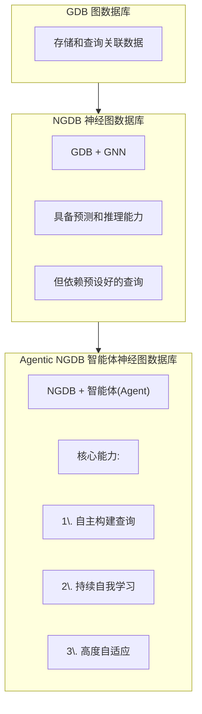
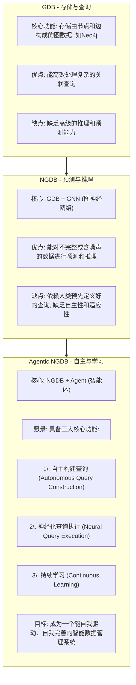
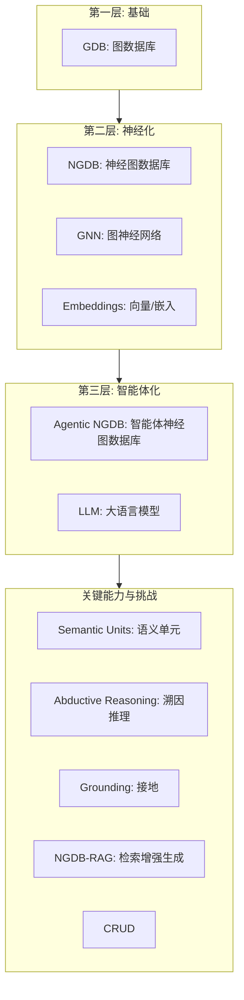

## AI论文解读 | Top Ten Challenges Towards Agentic Neural Graph Databases
        
### 作者        
digoal        
        
### 日期        
2025-07-23       
        
### 标签        
PostgreSQL , PolarDB , DuckDB , AI , 论文解读        
        
----        
        
## 背景  
      
https://arxiv.org/pdf/2501.14224        
  
      
提示:        
```        
读懂《Top Ten Challenges Towards Agentic Neural Graph Databases》这篇论文需要提前掌握哪些基础知识, 请使用中文通熟易懂的讲解这些基础知识, 可以使用markdown支持的图形(如text、mermaid等)增加解释性.        
        
使用中文通熟易懂的解读《Top Ten Challenges Towards Agentic Neural Graph Databases》这篇论文, 其中的关键内容请详细讲解, 可以使用markdown支持的图形(如text、mermaid等)增加解释性.        
        
提取《Top Ten Challenges Towards Agentic Neural Graph Databases》论文中的重要术语, 使用中文对这些术语进行通熟易懂的讲解, 可以使用markdown支持的图形(如text、mermaid等)增加解释性.        
```     

## 1 前置知识 
  
好的，为了完全理解《迈向智能体神经图数据库的十大挑战》这篇论文，您需要掌握一系列从基础到前沿的知识。下面我将用通俗易懂的中文，并辅以图示，为您讲解这些核心概念。

### 核心基础知识体系

要理解本文，您可以将所需知识看作一个层层递进的“金字塔”：

1.  **[基石] 图与数据库**: 最基础的数据结构和存储概念。
2.  **[核心] 神经网络与图的结合**: AI如何理解和处理图数据。
3.  **[前沿] 智能体与大模型**: 系统如何实现自主化和高级推理。
4.  **[贯穿] 系统与工程问题**: 如何将理论构建成真实、可用的系统。

-----

### 1\. (基石) 图数据库 (Graph Database, GDB) 与知识图谱 (Knowledge Graph, KG)

#### a. 什么是图 (Graph)？

想象一下你的社交网络：你和你的朋友们是**节点 (Node)**，你们之间的好友关系就是**边 (Edge)**。图就是由节点和边构成的，用来表示实体及其之间复杂关系的数据结构 。

```text
(你) --[是好友]--> (张三) --[是同事]--> (李四)
 |
 +--[是家人]--> (王五)
```

#### b. 什么是图数据库 (GDB)？

图数据库是专门用来存储和查询上述“图”结构数据的数据库 。它非常擅长处理复杂的关联关系，比如查询“我朋友的同事是谁？” 。论文中提到的 Neo4j 和 TigerGraph 就是著名的图数据库 。

#### c. 什么是知识图谱 (KG)？

知识图谱是一种特殊的、语义更丰富的图。它的边通常被赋予了明确的意义（如“出生于”、“工作于”），节点也代表着明确的实体（如人物、地点、公司）。这使得机器可以更好地“理解”数据背后的知识。

```text
(节点: 乔布斯) --[关系: 创办了]--> (节点: 苹果公司)
(节点: 苹果公司) --[关系: 总部位于]--> (节点: 库比蒂诺)
```

-----

### 2\. (核心) 神经网络与图的结合

#### a. 什么是神经网络 (Neural Network) 与词向量 (Embedding)？

  - **神经网络**: 一种模仿人脑神经元连接方式的计算模型，可以通过学习数据中的模式来进行预测和推理。
  - **词向量/嵌入 (Embedding)**: 这是将现实世界中的实体（如一个词、一个图节点）“翻译”成一串数字（即向量）的技术。这么做的好处是，我们可以在数学空间中计算它们之间的关系。例如，“国王”和“王后”的向量会很接近。


```text
    +----------------+      +-----------------------+
    |  图中的节点      |      |     一串数字 (向量)    |
    | (例如: 苹果公司) |  ->  | [0.1, -0.5, 0.9, ...] |
    +----------------+      +-----------------------+
```

#### b. 什么是图神经网络 (GNN)？

图神经网络 (GNN) 是一种专门为图结构数据设计的神经网络 。它的核心思想是：一个节点的向量表示（Embedding）应该由它自身的信息和它**邻居节点**的信息共同决定。通过层层传递，GNN 能够捕捉到图中的复杂结构和模式。

#### c. 什么是神经图数据库 (Neural Graph Database, NGDB)？

这是论文中的一个核心概念。NGDB 是**传统图数据库 (GDB) 和图神经网络 (GNN) 的结合体** 。

  - GDB 负责存储和管理图数据 。
  - GNN 负责在这些数据上进行**预测和推理**，比如预测两个节点间可能存在的缺失关系（链接预测），或者处理数据不完整的情况 。

简单说，NGDB 让数据库不仅能“存”，还能“思考”和“预测” 。

-----

### 3\. (前沿) 智能体与大模型

#### a. 什么是智能体 (Agent)？

在人工智能领域，智能体是一个能够感知环境、自主决策并采取行动以实现其目标的系统。它具有**自主性 (Autonomy)** 和 **适应性 (Adaptability)**。

#### b. 什么是大语言模型 (Large Language Model, LLM)？

像 ChatGPT 这样的模型就是大语言模型。它们经过海量文本数据的训练，具备强大的自然语言理解和生成能力 。

#### c. 什么是智能体神经图数据库 (Agentic NGDB)？

这是本文提出的**终极目标**。它是在 NGDB 的基础上，赋予其“智能体”的能力 。

我们可以通过下面的演进图来理解：



简单来说，Agentic NGDB 不再需要人来告诉它“该查什么”，而是能根据任务和上下文，**自己想出应该执行什么查询**，并能根据结果不断学习和进化 。

-----

### 4\. (贯穿) 系统与其他重要概念

要让 Agentic NGDB 成为现实，还需要解决一系列技术挑战中提到的概念：

  * **逻辑查询与推理 (Logical Query & Reasoning)**:

      * **复杂查询**: 不仅仅是“A和B是朋友吗？”，而是更复杂的，如“查询所有在A公司工作、且至少有一个朋友在B公司工作的人”。论文中提到了 `EFO-1` 、`cyclic queries`  等都是复杂查询的类型。
      * **溯因推理 (Abductive Reasoning)**: 一种“寻找最佳解释”的推理方式 。在本文中，它指的是为某个观测到的现象（比如用户的一系列行为）自动生成一个最可能的查询（假设）来解释它 。

  * **系统架构 (System Architecture)**:

      * **分布式系统 (Distributed System)**: 由于图数据和模型可能非常庞大，单台机器存不下也算不动，因此需要将数据和计算任务分散到多台机器上协同工作 。
      * **可扩展性 (Scalability)**: 系统处理数据和请求的能力，应能随着资源（如机器数量）的增加而平滑提升 。

  * **隐私与安全 (Privacy & Security)**:

      * 将数据“神经化”（变成向量）后，可能会引入新的隐私泄露风险 。例如，攻击者可能通过分析模型来推断出训练数据中的敏感信息（如模型反演攻击、成员推断攻击） 。

### 总结

要读懂这篇论文，您需要理解以下核心演进路线：

1.  从基础的**图数据库**（存数据）出发。
2.  到加入了GNN的**神经图数据库**（能预测）。
3.  最终到本文构想的**智能体神经图数据库**（能自主思考和学习）。

同时，您还需要对**神经网络、知识图谱、大语言模型**以及**分布式系统和隐私安全**等相关领域的知识有基本的了解。掌握了这些，您就能更好地理解论文中所提出的十大挑战为何如此重要和艰巨。
  
## 2 解读论文 
  
好的，我们来详细解读这篇前沿论文《Top Ten Challenges Towards Agentic Neural Graph Databases》。这篇论文描绘了一种未来智能数据库的蓝图，并指出了实现该蓝图所面临的十大核心挑战。

我将按照“从概念到挑战”的顺序，为您深入浅出地讲解。

### 核心概念：数据库的演进之路

要理解这篇论文的精髓，首先要明白它提出的“智能体神经图数据库 (Agentic NGDB)”是数据库技术演进的第三个阶段。



简单来说：

  * **GDB** 像一个仓库管理员，你让他拿什么，他就拿什么。
  * **NGDB** 像一个有经验的图书管理员，你问他一本不存在的书，他能根据经验推荐给你最相似的。
  * **Agentic NGDB** 像一个智慧的图书馆馆长，你只需告诉他你的研究方向，他就能主动帮你搜集、整理、推理并提供一整套所需资料，还会根据你的反馈不断优化服务。

-----

### 论文精髓：十大挑战详解

为了实现 Agentic NGDB 这个宏伟目标，论文作者从三个维度——**接口、学习与推理、系统**——剖析了所面临的十大挑战。

#### 维度一：接口 (Interface) - 如何与系统交互

这部分关注的是数据库如何理解任务并生成合适的查询。

##### **挑战 1: 语义单元 (Semantic Units)**

  * **核心问题**: 真实世界的数据是多种多样的，不只是简单的“实体”和“关系”。如何让数据库理解并处理这些复杂的“语义单元”？ 
  * **详细讲解**:
      * **数值 (Numbers)**: 如何处理年龄、价格等数值，并支持过滤、比较等代数运算 ？
      * **事件 (Events)**: 如何理解事件之间的时序和因果关系 ？例如，“购买”这个事件发生在“浏览”之后。
      * **信念、欲望与意图 (BDI)**: 这是更高层次的抽象语义单元，用于建模类人的推理 。例如，系统需要理解用户“想要买礼物给朋友”（意图），从而解释他“搜索附近的礼品店”（行为） 。这与理解他人心理状态的“心智理论 (Theory of Mind)”密切相关 。

##### **挑战 2: 溯因推理 (Abductive Reasoning)**

  * **核心问题**: 如何让数据库具备“寻找最佳解释”的能力？即，给定一个观测现象（如用户的行为），系统能否自动生成一个最合理的查询（假说）来解释它 ？
  * **详细讲解**:
      * **当前局限**: 现有的溯因推理模型生成的假说（查询）结构比较简单，通常是树状的连接查询 。同时，对“观测”的定义也局限于一组实体 。
      * **未来需求**:
          * 需要能生成更复杂的查询，例如包含循环结构的查询 。
          * 需要能处理更复杂的“观测”，例如一段对话历史或一次完整的购物会话记录 。
          * 需要利用 NGDB 的推理能力作为强化学习的奖励模型，以生成质量更高的假说 。

#### 维度二：学习与推理 (Learning and Inference) - 系统的“大脑”

这部分关注系统如何执行查询、学习知识并保障安全。

##### **挑战 3: 跨查询族的泛化能力 (Generalization across Query Families)**

  * **核心问题**: 当前的神经化查询模型往往是为特定类型的查询设计的，当遇到新的、结构不同的查询时，性能会下降 。如何让模型具备强大的泛化能力，通吃各类查询？
  * **详细讲解**:
      * 不同的查询“家族”需要不同的处理方法，例如树状查询、包含循环的 EFO-1 查询，以及带有聚合函数（如 `COUNT`, `AVG`）的更高级查询 。
      * 论文探讨了两种实现泛化的方向：
          * **神经-符号方法**: 将查询任务分解，利用GNN等模块进行链接预测评分，再结合传统的符号推理算法执行查询 。
          * **序列模型**: 利用大语言模型这种通用模型，将查询直接编码为序列进行处理，将泛化能力的挑战从模型设计转移到训练数据的构建上 。

##### **挑战 4: 隐私与安全 (Privacy and Security)**

  * **核心问题**: NGDB 强大的推理能力是一把双刃剑，它能推断出隐藏关系，这也带来了严重的数据隐私风险 。
  * **详细讲解**:
      * **新型攻击**:
          * **链接预测攻击 (Link Prediction Attacks)**: 攻击者可以利用模型预测出图中隐藏的敏感关系 。
          * **模型反演攻击 (Model Inversion Attacks)**: 攻击者可利用对模型的访问权限，反向推断出用于训练的图数据 。
          * **成员推断攻击 (Membership Inference Attacks)**: 判断某个特定的数据点（节点或边）是否在训练集中 。
          * **向量泄露 (Embedding Leakage)**: 节点或边的向量表示本身就可能泄露其结构或内容的敏感信息 。
      * **防御方向**: 差分隐私 (Differential Privacy)、向量混淆 (Embedding Obfuscation)、联邦学习 (Federated Learning) 等技术是潜在的解决方案 。

##### **挑战 5: 面向更高复杂度的扩展 (Scaling for Higher Complexity)**

  * **核心问题**: 当图的规模、查询的复杂度急剧增加时，系统如何保持高效？ 
  * **详细讲解**:
      * **训练扩展**: 对于需要大量查询样本的模型，当知识图谱变得巨大时，生成训练用的查询样本本身就变得极其困难和耗时 。
      * **推理扩展**: 查询的执行时间会随图的大小（数据复杂度）和查询语句的长度（查询复杂度）而变化 。对于某些复杂查询，时间复杂度可能是图规模的指数级，这在实际中是不可接受的 。

#### 维度三：系统 (System) - 实现蓝图的“躯干”

这部分关注如何构建一个健壮、兼容、可扩展的系统。

##### **挑战 6: 分布式 NGDB 系统 (Distributed NGDB System)**

  * **核心问题**: 面对海量的图数据和向量数据，单机系统无法承受，必须设计高效的分布式系统 。
  * **详细讲解**:
      * **混合存储**: 如何设计分区和索引策略来共同存储图数据和其对应的向量，以优化混合查询（既需要符号计算也需要神经计算）的性能 ？一个典型问题是：原始图数据和向量应该存储在一起吗 ？
      * **混合计算**: 如何设计查询计划，以最高效地调度和执行包含符号与神经两种操作的混合查询 ？
      * **弹性伸缩**: 如何构建云原生系统，使其能根据负载的动态变化自动增减资源，以实现成本效益 ？

##### **挑战 7: 与传统图数据库的兼容性 (Compatibility with Graph Database)**

  * **核心问题**: 如何确保 NGDB 能够平滑地与现有的图数据库生态系统集成，支持如 `CRUD` (创建、读取、更新、删除) 等标准操作 ？
  * **详细讲解**:
      * 挑战在于**性能与一致性的权衡** 。例如，当执行一次 `UPDATE` 操作时，不仅要修改原始数据，还需要更新相关的节点和边的向量表示，这会带来额外的计算开销和潜在的数据不一致问题 。

##### **挑战 8: 到 NGDB 向量的“接地”(Grounding to Vectors with NGDB)**

  * **核心问题**: 如何将自然语言查询或高层概念，准确地“映射”或“接地”到 NGDB 的向量空间中进行操作 ？
  * **详细讲解**:
      * **语义粒度与消歧**: 如何将一个模糊的自然语言查询（如“最近的热门电影”）转化为精确的向量操作 ？
      * **组合语义与推理**: 如何在向量空间中表示多跳的复杂逻辑关系，并找到正确的推理路径 ？
      * **解释性**: 如何将向量化的计算结果翻译回人类可理解的语言，并解释推理过程 ？

##### **挑战 9: 使 NGDB 适配大语言模型 (Adapting NGDB to LLM)**

  * **核心问题**: 如何将 NGDB 的结构化知识和推理能力与 LLM 强大的自然语言能力相结合，实现强强联合 ？
  * **详细讲解**:
      * **NGDB-RAG (检索增强生成)**: 论文提出了一个核心应用范式，即利用 NGDB 作为 LLM 的外部知识库 。相比于从普通文档中检索，从 NGDB 中检索能提供更精确、更符合逻辑、上下文更相关的结构化知识，从而显著提升 LLM 回答的准确性，减少“幻觉” 。
      * **联合学习**: 终极目标是设计一个统一的框架，让 NGDB 和 LLM 能够协同训练，互相促进，实现推理能力和语言能力的同步提升 。

##### **挑战 10: 智能 NGDB 应用 (Smart NGDB Application)**

  * **核心问题**: 实现了 Agentic NGDB 后，它能在哪些领域大放异彩 ？
  * **详细讲解**:
      * **自主数据管理**: 系统能自动优化查询、组织存储，无需人工干预 。
      * **个性化推荐**: 通过持续学习用户行为和图关系，提供实时的、高度个性化的推荐 。
      * **复杂事件处理**: 在金融反欺诈、网络安全等领域，系统能实时分析多个数据流，发现看似不相关的事件之间的深层联系 。

### 结论

这篇论文不仅是对现有技术的总结，更是对未来智能数据系统的一次系统性构想。它清晰地指出，从能“存”会“查”的传统数据库，到能“思考”会“预测”的神经数据库，再到最终能“自主学习”和“自我进化”的智能体数据库，是技术发展的必然趋势。而文中所列的十大挑战，则为整个学术界和工业界的研究人员指明了前行的方向。
  
## 3 术语  
  
好的，这里为您提取并解读《Top Ten Challenges Towards Agentic Neural Graph Databases》论文中的核心术语。

### 核心概念演进图

在深入了解具体术语前，最重要的是理解本文提出的三种数据库形态的演进关系。



这个图展示了从基础的图数据库（GDB）出发，通过融合神经网络技术（GNN、Embeddings）进化到神经图数据库（NGDB），再结合智能体（Agent）和大语言模型（LLM）等技术，最终迈向智能体神经图数据库（Agentic NGDB）的宏伟蓝图。而实现这一目标，需要解决语义单元、溯因推理等一系列关键挑战。

-----

### 一、 核心数据库概念

#### 1\. Graph Database (GDB) - 图数据库

  * **通俗理解**: 就像一个数字化的关系网络图。它专门存储实体（“点”）和它们之间的关系（“线”）。
  * **论文讲解**:
      * GDB，如 Neo4j 和 TigerGraph，擅长处理相互连接的数据 。
      * 它们使用节点和边来表示和查询数据，能高效地处理图结构数据中固有的复杂关系 。
      * 其主要缺点是缺乏高级的推理能力 。

#### 2\. Neural Graph Database (NGDB) - 神经图数据库

  * **通俗理解**: 在 GDB 的基础上，增加了一个具备预测能力的“大脑”。这个“大脑”就是图神经网络（GNN）。
  * **论文讲解**:
      * NGDB 是一种系统架构，它将图神经网络（GNN）的预测能力与图数据库（GDB）丰富的数据表示特性相结合 。
      * 它通过利用 GNN 来增强图数据库，以完成高级机器学习任务 。
      * 核心优势是能够对不完整或有噪声的数据进行预测性分析和推理 。
      * 但它的一个主要限制是依赖于预定义的查询，缺乏自主性和适应性 。

#### 3\. Agentic Neural Graph Database (Agentic NGDB) - 智能体神经图数据库

  * **通俗理解**: 这是 NGDB 的终极进化形态，一个能自我驱动、主动思考的“智能数据管家”。
  * **论文讲解**:
      * 这是本文提出的核心概念，它通过赋予 NGDB 三大核心功能来进行扩展：**自主构建查询**、**神经化查询执行**和**持续学习** 。
      * 它旨在通过将“神经化”扩展到数据和数据管理流程的自动化，从而超越传统 NGDB 。
      * 与被动依赖人类定义查询的 NGDB 不同，Agentic NGDB 能够根据特定任务和上下文自动构建查询，并主动学习更新其知识库 。

### 二、 核心AI与神经化术语

#### 4\. Graph Neural Networks (GNN) - 图神经网络

  * **通俗理解**: 一种专门为图结构数据设计的神经网络。它让每个节点可以“看一看”其邻居节点的信息，从而学习到整个网络的结构和模式。
  * **论文讲解**:
      * GNN 是 NGDB 的核心技术之一，用于进行预测性分析和处理不完整或含噪声的数据 。
      * NGDBs 利用 GNN 来增强其机器学习能力，同时保留图数据模型中嵌入的信息 。

#### 5\. Embeddings - 向量/嵌入

  * **通俗理解**: 一种“万物皆可数字化”的技术。它把图中的节点、关系等任何事物，都转换成一串具有数学意义的数字（即向量）。这样，计算机就可以通过计算向量间的距离或方向来理解它们之间的关系。
    ```text
    (实体: 苹果公司)  ---[Embedding]-->  [0.1, -0.8, 0.5, ...]
    (实体: 谷歌公司)  ---[Embedding]-->  [0.2, -0.7, 0.6, ...]
    ```
  * **论文讲解**:
      * NGDBs 利用神经嵌入（neural embeddings）来增强其进行复杂推理和推断隐藏关系的能力 。
      * 在 NGDB 中，结构信息和语义内容都被编码为向量 。

#### 6\. Large Language Models (LLM) - 大语言模型

  * **通俗理解**: 像 ChatGPT 一样，是能够理解和生成人类语言的强大AI模型。
  * **论文讲解**:
      * Agentic NGDB 的一个关键挑战是与基础模型（如 LLM）进行集成 。
      * 通过利用 LLM 先进的自然语言理解和推理能力，NGDB 可以为各种任务提供更可靠、上下文更准确的结果 。

### 三、 关键挑战与应用术语

#### 7\. Semantic Units - 语义单元

  * **通俗理解**: 指数据库需要处理的各种不同“类型”的数据，而不仅仅是简单的ID。
  * **论文讲解**:
      * 语义单元是指与节点和边相关的数据类型，如原子ID、文本字符串、数字和日期 。
      * 论文还扩展到了更高级、更抽象的语义单元，如信念（Beliefs）、欲望（Desires）和意图（Intentions），这些对于建模类人推理至关重要 。

#### 8\. Abductive Reasoning - 溯因推理

  * **通俗理解**: 像侦探破案一样，从结果反推最可能的原因。在本文中，就是根据一个现象（比如用户的点击行为），反向推断出最能解释这个现象的数据库查询是什么。
  * **论文讲解**:
      * 溯因推理是指识别出能够最好地解释或支持特定任务的“最优NGDB查询”的过程 。
      * 它是在知识图谱（KGs）的背景下，通过利用结构化的关系和实体来为观察到的现象生成假说（hypotheses） 。

#### 9\. Grounding - 接地

  * **通俗理解**: 将抽象的概念（如一句话）“钉”在具体的数据上。在这里，特指将自然语言查询准确地翻译成 NGDB 向量空间中的操作。
  * **论文讲解**:
      * 在 NGDB 的背景下，接地过程面临新的挑战和机遇，因为结构信息和语义内容被编码为向量 。
      * 这一过程必须将自然语言查询准确地翻译成合适的向量表示 。

#### 10\. NGDB-RAG (Retrieval-Augmented Generation)

  * **通俗理解**: 一种让 LLM“开卷考试”的超级模式。当 LLM 回答问题时，它不再只靠自己“背过”的知识，而是先去 NGDB 这个结构化的、知识精准的“图书馆”里检索最相关的信息，然后再结合这些信息生成答案。
  * **论文讲解**:
      * NGDB-RAG 是一个集成了 NGDB 和 LLM 的系统，旨在增强检索和生成任务 。
      * 它利用 NGDB 中的结构化关系来执行高级推理任务，以检索到比传统方法更准确、上下文更相关的信息 。
      * 这能有效提高生成文本的事实准确性和逻辑一致性，并减少幻觉 。

#### 11\. CRUD

  * **通俗理解**: 数据管理的四个基本动作：增、删、改、查。
  * **论文讲解**:
      * CRUD (CREATE, READ, UPDATE, DELETE) 是传统图数据库中用于管理和修改持久化数据元素的基本操作 。
      * 确保与这些操作的兼容性是 Agentic NGDB 面临的一个挑战 。
  
## 参考        
         
https://arxiv.org/pdf/2501.14224  
        
        
<b> 以上内容基于DeepSeek、Qwen、Gemini及诸多AI生成, 轻微人工调整, 感谢杭州深度求索人工智能、阿里云、Google等公司. </b>        
        
<b> AI 生成的内容请自行辨别正确性, 当然也多了些许踩坑的乐趣, 毕竟冒险是每个男人的天性.  </b>        
    
  
#### [期望 PostgreSQL|开源PolarDB 增加什么功能?](https://github.com/digoal/blog/issues/76 "269ac3d1c492e938c0191101c7238216")
  
  
#### [PolarDB 开源数据库](https://openpolardb.com/home "57258f76c37864c6e6d23383d05714ea")
  
  
#### [PolarDB 学习图谱](https://www.aliyun.com/database/openpolardb/activity "8642f60e04ed0c814bf9cb9677976bd4")
  
  
#### [PostgreSQL 解决方案集合](../201706/20170601_02.md "40cff096e9ed7122c512b35d8561d9c8")
  
  
#### [德哥 / digoal's Github - 公益是一辈子的事.](https://github.com/digoal/blog/blob/master/README.md "22709685feb7cab07d30f30387f0a9ae")
  
  
#### [About 德哥](https://github.com/digoal/blog/blob/master/me/readme.md "a37735981e7704886ffd590565582dd0")
  
  

  
