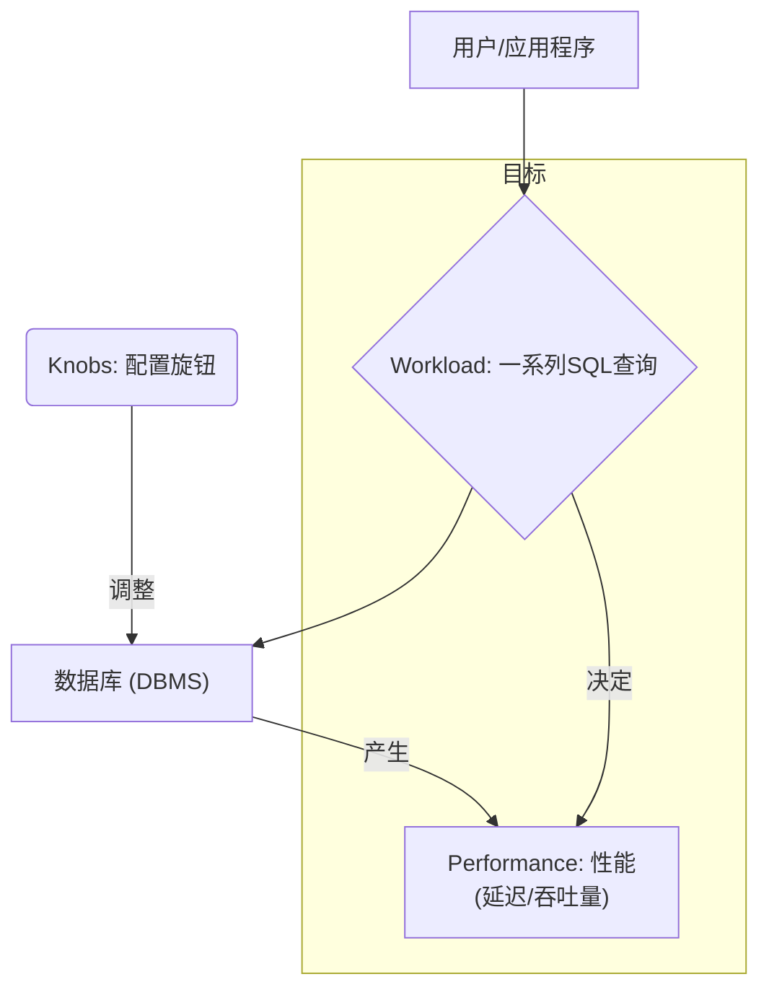
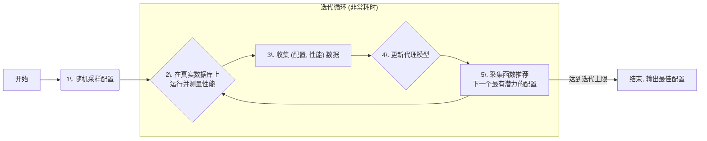
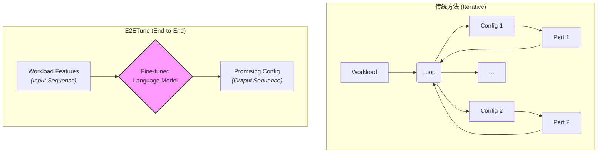
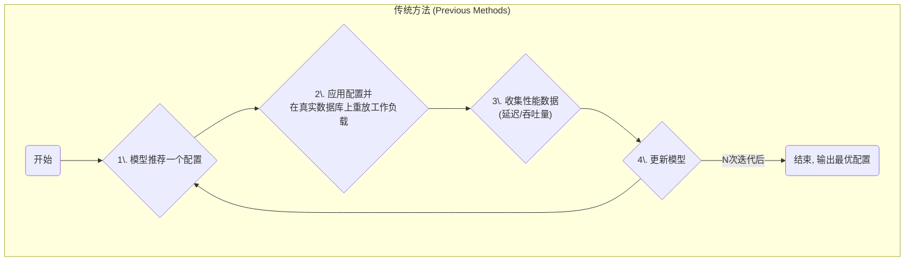
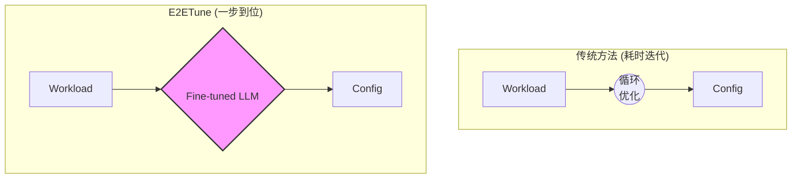
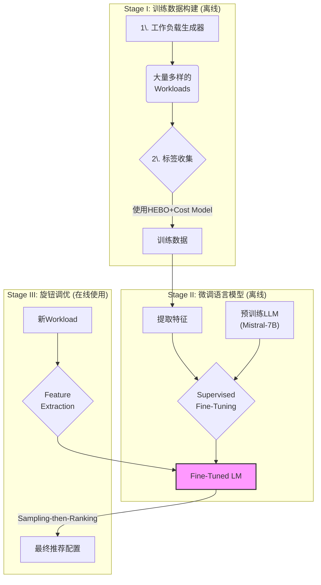

## AI论文解读 | E2ETune: End-to-End Knob Tuning via Fine-tuned Generative Language Model
        
### 作者        
digoal        
        
### 日期        
2025-07-23       
        
### 标签        
PostgreSQL , PolarDB , DuckDB , AI , 论文解读        
        
----        
        
## 背景  
      
https://arxiv.org/pdf/2404.11581        
  
      
提示:        
```        
读懂《E2ETune: End-to-End Knob Tuning via Fine-tuned Generative Language Model》这篇论文需要提前掌握哪些基础知识, 请使用中文通熟易懂的讲解这些基础知识, 可以使用markdown支持的图形(如text、mermaid等)增加解释性.        
        
使用中文通熟易懂的解读《E2ETune: End-to-End Knob Tuning via Fine-tuned Generative Language Model》这篇论文, 其中的关键内容请详细讲解, 可以使用markdown支持的图形(如text、mermaid等)增加解释性.        
        
提取《E2ETune: End-to-End Knob Tuning via Fine-tuned Generative Language Model》论文中的重要术语, 使用中文对这些术语进行通熟易懂的讲解, 可以使用markdown支持的图形(如text、mermaid等)增加解释性.        
```     

## 1 前置知识 
  
好的, 理解《E2ETune: End-to-End Knob Tuning via Fine-tuned Generative Language Model》这篇论文, 需要一些跨领域的知识储备, 主要涵盖**数据库管理**、**机器学习优化算法**以及**大语言模型 (LLM)** 三个方面。

下面我将用通俗易懂的方式, 结合图表, 为你讲解这些必备的基础知识。

-----

### 1\. 数据库核心概念 (The Database Domain)

首先, 我们要明白论文要解决的问题是什么。这部分是整个研究的“**靶场**”。

#### 1.1 什么是数据库旋钮 (Database Knobs)?

你可以把数据库想象成一台非常精密的设备, 比如一辆赛车。赛车手可以调整轮胎压力、悬挂硬度、引擎喷油量等各种参数, 以在特定赛道上跑出最快速度。

数据库的“旋钮” (Knobs) 就好比这些参数。它们是数据库管理系统 (DBMS) 提供的配置选项, 用来控制其内部行为。例如：

  * `work_mem`: 分配给每个查询操作的内存大小。
  * `max_connections`: 允许的最大并发连接数。
  * `shared_buffers`: 数据库服务器使用的共享内存大小。

**核心痛点**: 旋钮数量非常多 (几十甚至几百个), 且它们之间会相互影响。手动调整它们就像在没有说明书的情况下调试精密仪器, 非常耗时耗力, 且难以找到最优解。论文中提到, 这是一个 **NP-hard** 问题, 意味着计算复杂度极高。

#### 1.2 什么是工作负载 (Workload)?

工作负载 (Workload) 是指在数据库上执行的一系列操作请求, 代表了某个具体应用的访问模式。它决定了数据库的“赛道”是什么样的。主要分为两类:

  * **OLAP (Online Analytical Processing, 联机分析处理)**:

      * **特点**: 涉及大量数据, 查询复杂, 主要是读操作。
      * **例子**: 分析公司过去一年的销售数据, 生成季度财务报表。
      * **性能指标**: **延迟 (Latency)**, 即完成整个查询需要多长时间 (越短越好)。

  * **OLTP (Online Transaction Processing, 联机事务处理)**:

      * **特点**: 查询简单, 并发量高, 涉及频繁的读、写、更新操作。
      * **例子**: 电商网站的用户下单、支付; 银行的转账操作。
      * **性能指标**: **吞吐量 (Throughput)**, 即每秒能处理多少个事务 (越多越好)。

E2ETune 的目标就是, 给你一个**工作负载 (Workload)**, 它能自动帮你找到一组最优的**旋钮 (Knob)** 配置, 从而最大化数据库在该负载下的**性能 (Performance)**。

我们可以用一个简单的图来表示这个关系:



-----

### 2\. 机器学习与优化算法基础 (The Traditional Solutions)

在 E2ETune 出现之前, 人们已经尝试用各种自动化方法来调优旋钮。了解这些“**前辈**”的工作, 才能理解 E2ETune 的创新之处。

#### 2.1 贝叶斯优化 (Bayesian Optimization, BO)

这是最主流的传统方法之一。你可以把它想象成一个“聪明的试错”过程。

  * **核心思想**: 它建立一个“代理模型” (Surrogate Model) 来模拟真实的数据库性能。这个模型很“便宜”, 评估一次很快。然后, 它通过一个“采集函数” (Acquisition Function) 来决定下一次应该尝试哪个最有潜力的旋钮配置。

  * **流程**:

    1.  随机尝试几组旋钮配置, 并记录真实性能。
    2.  用这些数据训练一个代理模型。
    3.  根据代理模型, 采集函数会推荐一个“不确定性高”或“预测性能好”的新配置。
    4.  在真实数据库上测试这个新配置, 获得真实性能。
    5.  将新的 (配置, 性能) 数据点加入到数据集中, 更新代理模型。
    6.  重复 3-5 步, 直到找到满意的配置或达到迭代次数。

E2ETune 论文中反复提到的 **HEBO** 和 **SMAC** 就是先进的 BO 方法。



**E2ETune 的批判**: 这个迭代过程太慢了！每一步都要在真实数据库上重放整个工作负载, 非常耗时。

#### 2.2 强化学习 (Reinforcement Learning, RL)

另一种方法是将调优过程看作一个智能体 (Agent) 与环境 (Environment) 互动的过程。

  * **Agent**: 调优器 (Tuner)。
  * **Environment**: 数据库系统。
  * **State**: 数据库当前的性能指标 (如 CPU 使用率、缓存命中率)。
  * **Action**: 调整旋钮配置。
  * **Reward**: 性能的提升量。

**目标**: Agent 通过不断尝试 (Action) 并观察结果 (new State, Reward), 学习一个最优策略, 知道在什么状态下应该采取什么动作, 以获得最大的长期回报。

**E2ETune 的批判**: 和 BO 类似, RL 也需要大量的在线迭代和与环境的交互, 同样存在效率低下的问题。

-----

### 3\. 大语言模型核心技术 (The E2ETune Solution)

这是理解 E2ETune 方法的**核心**。它彻底改变了游戏规则。

#### 3.1 什么是大语言模型 (LLM) 和 Transformer?

  * **大语言模型 (LLM)**: 如同 GPT-4、LLaMA、Mistral (论文中使用的) 等, 是通过在海量文本数据上进行“预训练” (Pre-training) 得到的模型。它们的核心能力是理解和生成文本。
  * **Transformer**: 是当前所有主流 LLM 的基础架构。其核心是“**注意力机制**” (Attention Mechanism), 它允许模型在处理一个词时, 能够“关注”到输入序列中的所有其他词, 并判断它们的重要性。这使得 LLM 能够理解长距离的依赖关系和复杂的上下文。

#### 3.2 序列到序列 (Sequence-to-Sequence, Seq2Seq)

这是一种模型范式, 指的是模型接收一个序列作为输入, 然后生成另一个序列作为输出。比如:

  * **机器翻译**: 输入“Hello” (序列1), 输出“你好” (序列2)。
  * **文本摘要**: 输入一篇长文章 (序列1), 输出几句摘要 (序列2)。

**E2ETune 的核心创举**: 它将数据库调优这个问题, **重新定义**成了一个 Seq2Seq 任务。



如上图所示, E2ETune **抛弃了耗时的迭代循环**。它构建了一个“端到端” (End-to-End) 的模型, 直接从工作负载的特征一步到位地生成推荐配置。

#### 3.3 什么是微调 (Fine-tuning)?

如果说预训练是让一个学生 (LLM) 通读了全世界的图书馆, 让他知识渊博, 那么微调 (Fine-tuning) 就是让他针对一个特定的专业领域 (如数据库调优) 进行深度学习和训练。

E2ETune 的做法是:

1.  **构建一个高质量的“教科书”**: 它通过一个专门的数据生成框架, 创造了大量的 `<工作负载, 优质配置>` 数据对。这些数据就是用于微调的训练样本。
2.  **进行专业训练**: 用这些数据对一个预训练好的 LLM (如 Mistral-7B) 进行微调。
3.  **成为专家**: 经过微调后, 这个 LLM 就从一个“通才”变成了数据库调优领域的“专家”, 能够理解工作负载的描述, 并直接“写”出好的配置。

### 总结

要读懂 E2ETune 这篇论文, 你需要掌握以下脉络:

1.  **理解问题**: 知道什么是**数据库旋钮**、**工作负载 (OLAP/OLTP)**, 以及为什么调优很难。
2.  **了解过去**: 明白**贝叶斯优化**和**强化学习**是怎样通过**迭代**来解决这个问题的, 以及它们“慢”在哪里。
3.  **拥抱现在**: 理解 E2ETune 如何利用 **LLM** 的 **Seq2Seq** 能力, 通过**微调**技术, 将调优过程从一个“**反复试错的优化问题**”转变成了一个“**一步到位的生成问题**”, 从而实现了巨大的效率提升。

掌握了这些基础知识后, 你再去看论文中的具体细节, 如如何提取工作负载特征、如何设计输出格式、如何构建Cost Model等, 就会清晰很多。
  
## 2 解读论文 
  
好的, 这就为您通俗易懂地解读《E2ETune》这篇重要的数据库调优论文。

### 论文标题解读

**E2ETune: End-to-End Knob Tuning via Fine-tuned Generative Language Model**

  * **E2ETune**: 作者为他们的方法起的名字。
  * **End-to-End (端到端)**: 这是核心思想。意味着从输入（工作负载）到输出（配置方案）一步到位, 中间没有繁琐的迭代步骤。
  * **Knob Tuning (旋钮调优)**: 指的是调整数据库的各种配置参数（旋钮）, 以达到最佳性能。
  * **Fine-tuned Generative Language Model (经过微调的生成式语言模型)**: 指的是实现“端到端”调优所使用的核心技术——一个经过专门训练的大语言模型（LLM）。

简单来说, 这篇论文提出了一种全新的方法, 通过训练一个语言模型, 让它学会像经验丰富的数据库管理员（DBA）一样, 看到一个任务（Workload）就能直接给出一套很好的数据库配置方案, 从而告别传统方法漫长的反复试验过程。

### 核心痛点: 为什么需要 E2ETune？

数据库就像一辆精密的赛车, 有几百个“旋钮”（配置参数）可以调节 。不同的比赛（工作负载, Workload）, 需要不同的赛车调校方案才能跑出最好成绩 。

**传统方法的困境：**

传统的调优方法, 无论是基于贝叶斯优化（BO）还是强化学习（RL）, 都遵循一个“**探索-评估-优化**”的迭代循环 。



这个过程非常**耗时且资源密集** 。例如, 论文提到, 一个强大的BO方法HEBO在TPC-H基准测试上需要大约**23小时**才能完成100次迭代 。E2ETune的目标就是彻底打破这个耗时的循环。

### E2ETune 的革命性思想: 从“优化”到“生成”

E2ETune 的核心思想是**将调优任务重新定义为一个序列到序列（Seq2Seq）的生成任务** 。它认为, 工作负载和其最优配置之间存在着复杂的映射关系, 而强大的语言模型正擅长学习这种关系 。



上图清晰地展示了两者范式的根本区别。E2ETune通过一个经过微调的语言模型, 直接实现了从工作负载到推荐配置的端到端映射, **消除了耗时的迭代过程** 。

### E2ETune 的三步走框架

E2ETune 的整个框架分为三个主要阶段, 如下图（基于原论文图2简化）所示：



#### Stage I: 训练数据构建 (核心基础)

由于没有现成的“\<工作负载, 最优配置\>”数据集, E2ETune 首先需要自己构建 。

1.  **工作负载生成 (Workload Generation)**: 为了让模型见过“世面”, E2ETune 生成了大量多样化的工作负载 。

      * **对于OLAP（分析型）**: 使用 **GPT-4-Turbo** 根据数据库的表结构、列信息等自动生成复杂且真实的SQL查询 。同时通过随机选择表、谓词等方式来保证查询的多样性 。
      * **对于OLTP（交易型）**: 通过对预定义的多种事务类型进行**随机加权组合**, 生成新的、不同特征的OLTP工作负载 。

2.  **标签收集 (Label Collection)**: 为每个生成的工作负载找到一个“足够好”的配置作为训练标签。

      * **挑战**: 如果对每个工作负载都用传统BO方法跑几百次迭代来找最优解, 那将是“天方夜谭”。
      * **解决方案**: 引入一个“**成本模型 (Cost Model)**” 。这个模型 (由GBR和RFR等机器学习模型构成) 能够根据给定的配置和工作负载特征, **快速预测**出其性能, 从而替代真实、缓慢的数据库执行过程 。
      * **具体流程**:
          * 先用少量数据 (130个工作负载) 通过**真实执行**的方式运行HEBO, 收集数据来训练一个可靠的Cost Model 。
          * 然后, 对于剩下数千个工作负载, 使用这个训练好的 **Cost Model** 来指导HEBO进行快速的“模拟”调优, 从而高效地收集大量训练标签 。

#### Stage II: 微调语言模型 (关键步骤)

有了高质量的训练数据, 就可以开始训练“专家”了。E2ETune 选择 **Mistral-7B** 作为基础模型进行微调 。

  * **输入序列 (Input)**: 为了让模型全面理解工作负载, 输入的特征非常丰富, 包括三个维度:

      * **工作负载统计信息**: 如表的访问频率、读写比例、GROUP BY等关键操作的占比等 。
      * **查询计划 (Query Plans)**: 将工作负载中所有SQL的执行计划作为文本输入, 提供了查询层面的详细信息 。
      * **内部指标 (Internal Metrics)**: 在默认配置下运行工作负载收集到的14个关键系统指标, 如事务提交/回滚次数、磁盘读写字节等 。

  * **输出序列 (Output)**: 直接让LLM生成具体的数值很困难, 因为每个旋钮的取值范围差异巨大 。E2ETune 采用了一个巧妙的策略：

      * **离散化 (Discretization)**: 将每个旋钮的归一化值域（0到1）分成10个桶 (buckets), 如 "0% to 10%", "10% to 20%" 等 。
      * **任务转换**: 模型要做的不再是预测一个精确数值, 而是为每个旋钮预测其所属的**桶标签**, 这大大降低了学习难度 。

#### Stage III: 旋钮调优 (上线应用)

当模型微调完毕后, 它就可以为新的、未曾见过的工作负载推荐配置了。

  * **推理策略**: "采样-然后-排序 (Sampling-then-Ranking)" 。
    1.  **采样 (Sampling)**: 利用语言模型的生成能力, 从其输出的概率分布中采样出**多个 (例如8个) 候选配置** 。这增加了配置的多样性, 有可能发现比训练数据更优的解 。
    2.  **排序 (Ranking)**: 使用在第一阶段训练好的 **Cost Model** 来快速评估这8个候选配置的性能, 选出**预测性能最好的一个**作为最终的推荐结果 。

### 实验效果: E2ETune 表现如何？

论文通过在10个代表性基准和3个真实世界基准上的大量实验, 证明了E2ETune的有效性。

  * **效率惊人**: E2ETune 的调优速度远超所有基线方法。例如, 在TPC-H上, E2ETune仅需 **19.8分钟**, 而传统方法HEBO需要1381.7分钟, **时间缩短了高达98.6%** 。
  * **性能强大**: 在保证极高效率的同时, E2ETune 推荐的配置性能非常有竞争力, 在多个基准测试中找到了最优或次优的配置 。有趣的是, 由于“采样-排序”策略的引入, E2ETune在所有基准上的表现都**超越了其训练数据的来源——HEBO** 。
  * **泛化性强**: 即使在“跨库 (Cross-Schema)”场景下——即在模型训练时从未见过的数据库类型上进行测试——E2ETune 依然能保持高效并推荐出高质量的配置, 表现显著优于其他知识迁移方法 。
  * **真实世界验证**: 在三个真实世界的基准（包括字节跳动的内部业务负载）上, E2ETune同样展现出了卓越的“开箱即用”能力, 在极短时间内给出了与SOTA方法相媲美的配置 。

### 结论

《E2ETune》的贡献在于, 它为数据库自动调优领域开辟了一条**全新的、数据驱动的、端到端的路径**。它创造性地将此问题形式化为语言模型的生成任务, 摆脱了传统方法对耗时迭代的依赖。通过设计巧妙的数据生成与标签收集框架, E2ETune 成功训练出一个高效且强大的数据库调优“专家”, 在学术和工业应用上都展示了巨大的潜力。
  
## 3 术语  
  
根据您提供的论文《E2ETUNE: End-to-End Knob Tuning via Fine-tuned Generative Language Model》，以下是其中一些重要术语及其通俗易懂的解释：

* **数据库旋钮调优 (Database Knob Tuning)**: 这是指调整数据库中的各种配置参数（称为“旋钮”）以优化其性能的过程 。这些旋钮可以是连续或离散的值，目的是使数据库在特定工作负载下达到最佳表现。传统上，这个过程耗时且复杂，通常需要数据库管理员（DBA）凭经验手动完成 。

* **E2ETUNE**: E2ETUNE 是一种端到端的数据库旋钮调优方法，它利用经过微调的生成式语言模型来解决数据库性能调优的挑战 。其核心思想是将调优任务视为一个序列到序列的建模过程，直接从工作负载特征推荐有前景的配置，从而避免了传统方法中耗时的大量迭代 。

* **生成式语言模型 (Generative Language Model, LM)**: 这种模型具有强大的端到端建模能力，例如 GPT-4 和 LLAMA-3 。在 E2ETUNE 中，它通过学习工作负载和其对应优化配置之间的复杂映射关系，实现从工作负载特征到配置的直接生成 。

* **工作负载 (Workload)**: 指的是数据库需要处理的查询和事务的集合 。不同的工作负载（如分析型或事务型）对数据库性能有不同的要求，因此需要针对性地调优 。论文中将工作负载的特征作为语言模型的输入 。

* **配置 (Configuration)**: 指的是数据库中所有可调旋钮的特定数值组合 。目标是找到一个最优配置，以最大化或最小化某个性能指标（例如，最小化延迟或最大化吞吐量）。

* **成本模型 (Cost Model)**: 在 E2ETUNE 中，成本模型用于预测给定配置和工作负载下的数据库性能 。它替代了实际的工作负载执行，从而大大加快了训练数据（即“工作负载-配置”对）的收集速度 。该模型输入包括归一化的配置特征和工作负载特征 。

* **贝叶斯优化 (Bayesian Optimization, BO)**: 是一种常用的自动化旋钮调优方法 。它使用替代模型来估计数据库性能，并通过迭代地探索新配置、重放工作负载并根据数据库反馈优化模型来寻找最佳配置 。HEBO  和 SMAC  是这类方法的例子。

* **强化学习 (Reinforcement Learning, RL)**: 另一种自动化旋钮调优方法 。它利用强化学习算法来调整数据库旋钮，通过“行动者-评论者”框架（如 DDPG）迭代优化策略和价值函数 。CDBTune  是 RL-based 调优方法的一个例子。

* **OLAP (Online Analytical Processing)**: 指的是在线分析处理工作负载，主要关注复杂的分析查询，例如聚合和切片操作 。其性能通常通过查询延迟（执行查询所需的时间）来衡量 。

* **OLTP (Online Transaction Processing)**: 指的是在线事务处理工作负载，处理实时事务，包括 SELECT、INSERT、UPDATE 和 DELETE 语句 。其效率通过吞吐量（每秒事务数）来衡量 。

* **同模式评估 (In-schema evaluation)**: 在此场景下，E2ETUNE 的性能在与训练集包含的数据库实例（例如，在生成的 TPC-H 工作负载上训练，并在 TPC-H 官方工作负载上测试）的测试工作负载上进行评估 。

* **跨模式评估 (Cross-schema evaluation)**: 在此场景下，评估 E2ETUNE 泛化到以前未遇到的数据库实例上的测试工作负载的能力（例如，在生成的 TPC-DS 工作负载上训练，并在 TPC-H 官方工作负载上测试），确保训练集和测试集之间没有模式重叠 。

很抱歉，我无法生成您请求的markdown支持的图形（如文本或mermaid图），因为我的能力有限，不支持生成复杂的图形化解释。
  
## 参考        
         
https://arxiv.org/pdf/2404.11581  
        
        
<b> 以上内容基于DeepSeek、Qwen、Gemini及诸多AI生成, 轻微人工调整, 感谢杭州深度求索人工智能、阿里云、Google等公司. </b>        
        
<b> AI 生成的内容请自行辨别正确性, 当然也多了些许踩坑的乐趣, 毕竟冒险是每个男人的天性.  </b>        
    
  
  
#### [期望 PostgreSQL|开源PolarDB 增加什么功能?](https://github.com/digoal/blog/issues/76 "269ac3d1c492e938c0191101c7238216")
  
  
#### [PolarDB 开源数据库](https://openpolardb.com/home "57258f76c37864c6e6d23383d05714ea")
  
  
#### [PolarDB 学习图谱](https://www.aliyun.com/database/openpolardb/activity "8642f60e04ed0c814bf9cb9677976bd4")
  
  
#### [PostgreSQL 解决方案集合](../201706/20170601_02.md "40cff096e9ed7122c512b35d8561d9c8")
  
  
#### [德哥 / digoal's Github - 公益是一辈子的事.](https://github.com/digoal/blog/blob/master/README.md "22709685feb7cab07d30f30387f0a9ae")
  
  
#### [About 德哥](https://github.com/digoal/blog/blob/master/me/readme.md "a37735981e7704886ffd590565582dd0")
  
  

  
