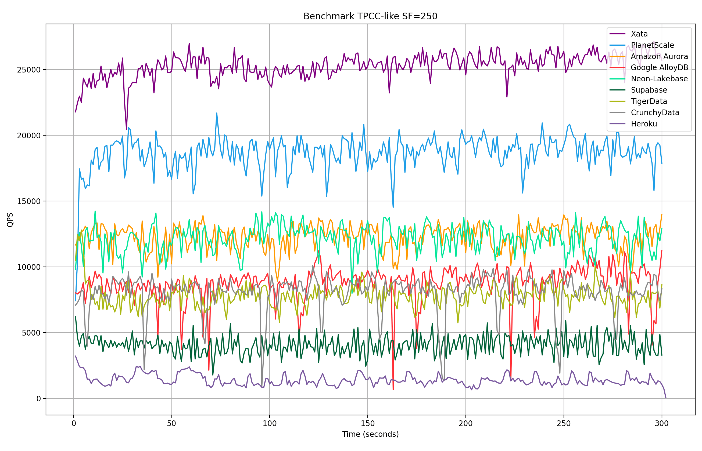

## PlanetScale 的注水测试引起海外PG厂商公愤了, 看别人怎么说   
              
### 作者              
digoal              
              
### 日期              
2025-07-23             
              
### 标签              
PostgreSQL , benchmark , IO , CPU , 云盘 , 本地盘 , Nvme , RDMA , SPDK , 延迟 , 吞吐 , 参数配置             
              
----              
              
## 背景  
还记得我前段时间发的这篇文章吗? 揭露PlanetScale评测数据注水, 胜之不武的细节.    
  
[《PlanetScale发布Postgres云服务, 吊打主流云厂商“胜之不武”》](../202507/20250713_04.md)    
  
PlanetScale 果然引起了公愤, 战火已蔓延到了另外几家PG知名厂商(OrioleDB, Neon, Xata):   
- https://www.orioledb.com/blog/orioledb-beta12-benchmarks   
- https://neon.com/blog/separation-of-storage-and-compute-perf   
- https://xata.io/blog/reaction-to-the-planetscale-postgresql-benchmarks   
  
国外的业内人士都觉得"PlanetScale评测数据欠妥". 都开始“秀肌肉”, 总之就是如何如何解决云盘IO带宽、延迟问题、把云盘瓶颈转移到CPU种种.  

要我说的话, PlanetScale还相对比较要节操, 这要是放在锅内的PoC场景都不能叫事, 那什么“关闭fsync,fpw,检查点拉老长,关闭垃圾回收,使用无日志表...”这类违规操作都属于基操, 还有裁剪代码的. 详见: [《教你几招性能PK的“作弊技巧”! 让你的数据库也能遥遥领先》](../202406/20240618_01.md)   
  
下面就来看看Xata是怎么说的.   
  
以下内容翻译自:  
- https://xata.io/blog/reaction-to-the-planetscale-postgresql-benchmarks  
  
# 跟PlanetScale评测数据“注水”说不  
几周前，随着 PostgreSQL 内测版的发布，PlanetScale 发布了一系列基准测试博客文章，将其“Metal”产品与其他几家 Postgres 服务提供商进行了比较。我们很好奇，我们的新平台 Xata（同样处于内测阶段）在这些基准测试中的表现如何，所以我们自己运行了这些基准测试。在测试过程中，我们记录了方法论、结果和结论，并在本篇博客文章中分享。  
  
本文包含一些对基准测试方法的<b>建设性批评</b>，并讨论了在运行高性能 PostgreSQL 时，本地存储与网络存储的优劣。我们将展示 Xata PostgreSQL 的配置方案，该方案使用NVMe over Fabrics 将存储与计算分离，能够以低成本提供极高的性能，同时仍保留解耦架构的灵活性以及快速写时复制分支等额外功能。  
  
<b> PS: 看样子Xata PostgreSQL和Aurora、Neon、PolarDB的方案有所相似.  </b>   
  
## 基准——可重复性和开放性  
当我看到 PlanetScale 的一系列比较基准测试博客文章时，我被深深地吸引了。我对数据库基准测试的默认反应通常是怀疑。很容易挑选用例、硬件设置和配置来描绘你想要的任何图景。  
  
话虽如此，我确实相信基准测试可以产生积极的净效应，并促进参与者之间的良性竞争。例如，我喜欢用于 OLAP 数据库的[ClickBench和用于向量搜索实现的人工神经网络基准测试](https://benchmark.clickhouse.com/)。我喜欢定期查看这些基准测试，因为看到竞争对手在一组通用的基准测试上互相超越是很有趣的。 <b>果然吃瓜才是所有人类的天性!</b>    
  
例如，我尤其欣赏的是，ClickHouse 目前在 ClickBench 上并没有名列前茅（目前只排在第五位），这表明这是一个公平的竞争环境。我们都明白，原始性能只是客户考虑的众多因素之一，其他方面往往更为重要。  
  
<b> PS: 这句说的最实在, 只有自己不能名列前茅的benchmark往往公平性上更具有信服力! </b>    
  
<b> 奉劝国内厂商好好学学吧, 别只会说自己的好话! 没人信的! </b>   
  
重要的是，这些项目附带 GitHub 存储库，其中包含运行测试的明确说明、下载原始结果的简便方法以及如何贡献自己的结果的指南。  
  
<b> 注意: 点名批评来了! </b>   
   
这正是我所期望的，但 PlanetScale 的基准测试并非如此，而且我认为他们并没有打算这样做，至少目前还没有。目前没有包含自动化测试和原始结果的仓库，只有运行 sysbench 的[简要说明](https://planetscale.com/benchmarks/instructions/tpcc500g)。  
  
值得称赞的是，PlanetScale 团队提供了一个用于解答基准测试相关问题的电子邮件地址。我联系了他们，他们很快就回复了我所要求的说明，并以 JSON 格式提供了原始结果。这在我们自行运行测试时节省了大量时间。  
  
## 基准——相关性和用例覆盖率  
PlanetScale 基准测试使用三种类型的测试：  
- 以 sysbench 脚本形式实现的“类似 Percona TPCC”基准。  
- “OLTP 只读”基准，也是由 sysbench 提供的。  
- `select 1;` 为了测量延迟，只需进行 200 次测试。  
  
TPCC 是 PlanetScale 总结文章中重点强调的主要测试（也是我们上文中使用的测试），它是一个经典的 OLTP 基准，也是衡量事务性能的合理选择。如果您想知道它是否反映了您的用例，很可能它并不适用。请记住以下几点：  
  
它模拟的用例有些过时（毕竟是1992年的），它是一家销售仓库库存的批发商。它的写入操作非常繁重（大约`88%`的事务都在执行写入操作）。它使用了许多`多步骤事务`，这意味着在同一个数据库事务中会进行多次读写操作。  
  
更重要的是，测试中使用了单一固定比例因子：`250`。这意味着数据库大小约为 `500GB`，而该数据库的创建过程不包含在测试中。TPCC 按照规定应该是一个开环基准测试，其中比例因子会逐步增加。这可以更好地模拟数据随时间增长时的真实场景。sysbench 的readme 文件确实提到了这一重要警告。  
  
“OLTP 只读”基准测试也是固定大小的。它会创建 10 个表，每个表包含 1.3 亿行数据，然后对它们运行大部分随机索引查询。这种方法能够有效地`迫使 Postgres 尽可能多地访问磁盘`，从而显示出存储实现方面的差异。然而，至于它与实际用例的相关性，同样存在争议。   
  
## 基准——方法论  
我们现在开始了解测试的具体执行过程。众所周知，这才是关键所在。  
  
在亲自进行测试后，我怀疑有两件事可能导致一些测试服务的结果不理想（但我没有直接验证这一点，我相信这些服务的工程师会尝试）。  
  
首先，据我了解，流程是先加载数据集，然后几乎立即执行基准测试。由于基准测试只运行了 5 分钟，因此 PostgreSQL 可能仍在执行后台活动，例如初始数据加载后的检查点或清理工作。此外，TPC-C 基准测试在一次运行中会进行大量更新，因此几次运行后，数据库可能会相对臃肿，从而影响性能。  
  
每次测试运行之前运行`CHECKPOINT;`和`VACUUM;`可以缓解这些问题。  
  
其次，还没有尝试调整 Postgres 配置：  
  
> 所有 Postgres 配置选项均保留各平台的默认设置。唯一的例外是连接限制和超时设置，这些设置可能会根据基准测试的需要进行修改。  
  
实际上，这意味着即使服务器有 32 GB 的 RAM，由于配置不够理想，PostgreSQL 也可能只会使用 2 到 3 GB。或者，如果服务器有 4 个或 8 个 CPU，基准测试可能只会使用其中的 1 个或 2 个。  
  
有人可能会说，服务提供商应该根据实例大小来优化其默认配置，这种说法也没错。然而，要有效地调优 PostgreSQL，需要同时了解实例大小和工作负载。正如上一节所述，虽然 TPCC 是一个经典的 OLTP 基准测试，但它并不能代表当今生产环境中的大多数工作负载。因此，服务提供商可能针对其他场景优化了其默认配置。  
  
对所有服务使用完全相同的 PostgreSQL 配置是否更公平？这也是值得怀疑的，因为根据存储层（本地与网络、SSD 与 NVMe 等）的不同，最佳配置也会有所不同。  
  
那么，怎样才算公平呢？在我看来，最好的办法是制定一些基本规则，例如，禁止更改会影响持久性的配置（例如`fsync`，`synchronous_commit`不应该允许更改）。除此之外，允许提供商根据自己的意愿调整设置。只要每个人都发布自己的配置，并且结果可复现，就能创造一个公平的竞争环境。  
  
## 基准——数字未显示的内容  
有些因素不会在基准测试中体现，但在解读结果时了解这些因素至关重要。就 PlanetScale Metal 而言，灵活性方面存在一些权衡。请参考以下[常见问题解答](https://planetscale.com/metal#since-storage-doesnt-autoscale-what-happens-if-i-max-out-my-storage)：  
  
> 由于存储无法自动扩展，如果我的存储空间达到最大容量会发生什么？  
> 使用传统的网络连接驱动器 (NAS)，您可以根据需要继续添加数据，我们会自动扩展您的存储空间。但 Metal 的情况并非如此 - 您必须预先选择一定容量的存储空间，如果需要更多空间，则必须选择更大的实例。  
>   
> 如果您的存储空间耗尽或即将耗尽，我们会将您的[数据库切换到只读模式](https://planetscale.com/docs/metal/create-a-metal-database#monitoring-metal-storage)，以防止完全中断。您的数据库将不再接受写入操作。这是我们希望确保您避免的紧急情况。[…] 由于我们必须将您的数据迁移到新驱动器，因此这不是一项立即操作。幸运的是，在迁移数据期间不会造成停机或对服务产生影响。由于迁移需要一些时间，我们建议您在存储空间耗尽之前就升级存储空间大小。  
  
  
实际上，这意味着您必须额外配置相当数量的磁盘，因为您肯定不希望数据库处于只读模式（这可能会导致数小时的停机时间）。而且可用的磁盘大小与实例大小相关，因此即使您实际上只需要更多磁盘空间，也可能需要升级实例大小。  
  
## Xata存储解决方案和结果  
在我们测试的`xata.2xlarge`实例设置中，我们使用了网络附加存储 (NAS)，但使用了基于 [Intel SPDK](https://spdk.io/) 的超快速 `NVMe over Fabrics` 实现。此设置可达到数百万的 IOPS（请参阅详细的[性能报告](https://spdk.io/doc/performance_reports.html)），可与本地 NVMe 硬盘相媲美。  
  
在这种设置下，Xata 在 64 个连接的 TPCC 测试中平均实现了约 25K QPS。  
  
  
  
本次测试中测得的 P99 延迟平均约为 250 毫秒，与测试中的最佳结果相当。  
  
  
  
基于 SPDK 的存储解释了我们如何实现非常高的 IOPS，从而达到与本地 NVMe 磁盘相当的性能。但为什么我们实际上获得了更好的结果呢？  
  
原因有二：  
  
首先，我们调整了 PostgreSQL 的配置，使其与基准测试和实例资源相匹配，如上所述。这使得瓶颈不再是存储，而是 CPU。  
  
其次，`xata.2xlarge`它有 8 个 CPU，而 M-320 只有 4 个。这是因为我们使用的是 `1:4` 的配比，而不是内存优化的 `1:8` 配比。我们选择这个配比是为了与 Neon、Supabase 和 TigerData 的原始测试设置保持一致，这些测试也运行在 8 核实例上。我们也认为这个配置合理，因为`xata.2xlarge`它的成本与 M-320 大致相当（详见下文）。  
  
然而，在测试中达到了约 25K QPS 后，我们很想知道一个限制为 4 个 CPU 的自定义 Xata 实例会如何表现。我们尝试了一些配置调整`shared_buffers`，但事实证明，在这种情况下，Postgres 的默认配置和少量 CPU 的性能表现良好。在这种配置下，我们平均实现了约 20K QPS。  
  
  
  
这些运行的原始结果以及配置参数可在此[github仓库](https://github.com/xataio/sysbench-benchmarks)中找到。  
  
在我们自己的测试中，我们仅测量了 Xata 服务。我们将在未来的工作中尝试使用类似的 Postgres 配置来复现其他结果。考虑到这一点，如果我们将 PlanetScale 测量的结果与 Xata `xata.2xlarge` 服务的结果放在一起，我们将得到以下图表：  
  
  
  
以上并非同类比较，因为不同服务的 Postgres 配置不同。我们展示它是为了证明即使在繁重的基准测试中，网络附加存储也能足够快。在上述测试运行中，尤其是限制为 4 个 CPU 的测试，瓶颈在于 CPU，而不是 IOPS。  
  
成本方面，`axata.2xlarge`为每月 280 美元。乘以 3 得到两个副本，计算成本为 840 美元。在存储方面，我们目前使用 Postgres 复制，因此我们保留了数据的多个副本。另一方面，使用 Xata 您只需为实际使用的存储空间付费。因此，500 x 0.30 x 3 = 每月 450 美元。总计为 1290 美元，略低于 M-320 的成本。  
  
## 结论  
运行这些基准测试非常有趣，我也很感谢 PlanetScale 对所有提供商的测试工作（这当然很耗时）。我不认为它们完美无缺，但我确实认为它们可以成为一个开放、公平的竞争环境，从而促进竞争。我还看到`Oriole`和`Neon`的博客文章已经开始使用这些基准测试。  
  
Xata 团队非常乐意为基准测试的联合/中立努力做出贡献。我们已经开源了压力测试和基准测试工具[pgdistbench](https://github.com/xataio/pgdistbench) 。  
  
运行基准测试后，我自己的信念是：  
- 使用带有本地 NVMe 驱动器的云服务器确实可以在超大规模器上实现最佳性能。  
- 然而，这并不一定意味着将它们严格地与计算耦合。SPDK 框架在连接计算和存储集群方面速度非常快。  
  
我们优化全新 Xata PostgreSQL 平台的关键方面之一是部署灵活性。这使我们能够尝试不同的计算/存储配置，并在关键时刻（无论是在您的环境中还是我们的环境中）提供最佳的配置。  
  
在选择 Postgres 供应商时，性能和基准不应该是您唯一要考虑的因素，我对 Xata 功能集（写时复制分支、匿名化、零停机模式更改、缩放到零等）和我们的可靠性历史感到满意。  
  
    
  
#### [期望 PostgreSQL|开源PolarDB 增加什么功能?](https://github.com/digoal/blog/issues/76 "269ac3d1c492e938c0191101c7238216")
  
  
#### [PolarDB 开源数据库](https://openpolardb.com/home "57258f76c37864c6e6d23383d05714ea")
  
  
#### [PolarDB 学习图谱](https://www.aliyun.com/database/openpolardb/activity "8642f60e04ed0c814bf9cb9677976bd4")
  
  
#### [PostgreSQL 解决方案集合](../201706/20170601_02.md "40cff096e9ed7122c512b35d8561d9c8")
  
  
#### [德哥 / digoal's Github - 公益是一辈子的事.](https://github.com/digoal/blog/blob/master/README.md "22709685feb7cab07d30f30387f0a9ae")
  
  
#### [About 德哥](https://github.com/digoal/blog/blob/master/me/readme.md "a37735981e7704886ffd590565582dd0")
  
  

  
