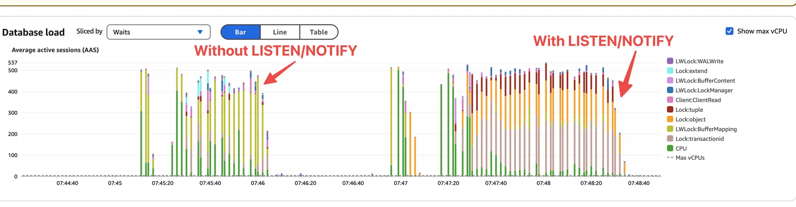
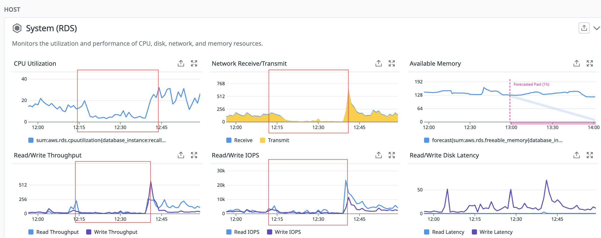
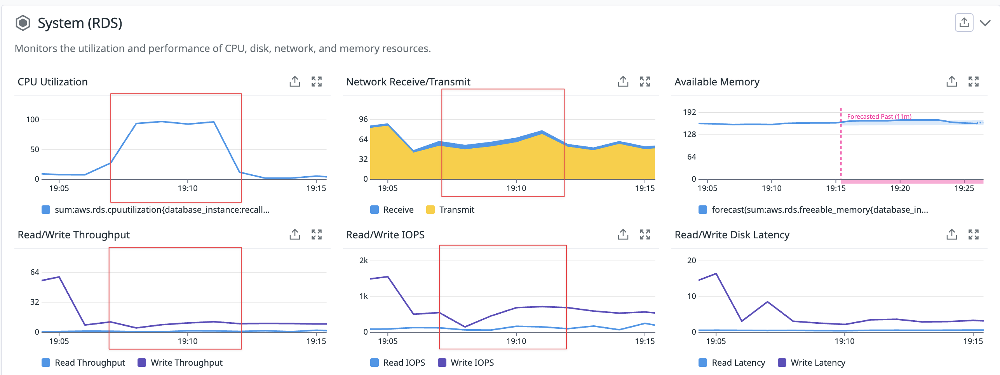

## 滥用`LISTEN/NOTIFY`导致PG数据库的CPU被“吃”了   
                
### 作者                
digoal                
                
### 日期                
2025-07-23               
                
### 标签                
PostgreSQL , LISTEN , NOTIFY , 全局锁 , 事务号            
                
----                
                
## 背景       
一篇关于滥用`LISTEN/NOTIFY`导致PG数据库的CPU被“吃”了的文章引起了我的关注.    
- https://www.recall.ai/blog/postgres-listen-notify-does-not-scale  
  
`LISTEN/NOTIFY`是PG的异步消息用法, 我之前也写过一些文章介绍其用法和应用场景. 现在想想有点心有余悸.    
- [《PostgreSQL 异步消息(LISTEN/NOTIFY)缓存多大？》](201807/20180716_01.md)    
- [《PostgreSQL 流式处理应用实践 - 二手商品实时归类(异步消息notify/listen、阅后即焚)》](201807/20180713_03.md)    
- [《PostgreSQL 事件触发器应用 - DDL审计记录 + 异步通知(notify)》](201709/20170925_02.md)    
- [《从电波表到数据库小程序之 - 数据库异步广播(notify/listen)》](201701/20170116_01.md)    
- [《PostgreSQL Notify/Listen Like ESB》](201111/20111122_01.md)    
  
<b> 文章的核心观点：</b>   
  
PostgreSQL 的 `LISTEN/NOTIFY` 功能在处理高并发写入操作时存在严重的扩展性问题。  
  
Recall.ai 公司在处理每月数百万小时的会议记录数据时发现，当在事务中发出 `NOTIFY` 查询时，在提交阶段会获取一个全局锁，导致所有提交操作串行化。这在大量并发写入的情况下会导致数据库负载急剧增加(实际上是锁等待, CPU完全没有消耗就像被吃了)，并造成严重的停机。  
  
因此，文章建议在需要高扩展性的多写入数据库场景中避免使用 `LISTEN/NOTIFY` 功能。Recall.ai 通过在应用程序层面实现逻辑来替代 `LISTEN/NOTIFY`，成功解决了这个问题。  
  
### 全局锁的范围  
  
在文章中提到的 `Postgres LISTEN/NOTIFY` 机制导致的**全局锁**，其作用范围是非常广的。具体来说，它是一个针对**整个数据库实例**的锁，而不是仅仅针对某个表、行或特定的数据库。  
  
当一个事务中包含了 `NOTIFY` 查询并尝试提交时，PostgreSQL 会在**提交阶段**获取一个 `AccessExclusiveLock`。文章中特别指出，这个锁是针对“`object 0 of class 1262 of database 0`”。这在 PostgreSQL 的内部表示中，`database 0` 实际上代表了**整个 PostgreSQL 实例中的所有数据库**。  
  
这意味着，一旦这个全局锁被某个正在提交的事务持有，**所有其他尝试提交的事务都将被阻塞，直到当前持有锁的事务提交完成并释放锁**。无论这些事务是针对哪个数据库、哪个表，或者执行的是什么类型的操作（无论是读还是写），只要它们涉及到提交操作，都会受到影响。  
  
因此，这个全局锁的范围可以理解为：  
  
* **跨所有数据库**：它不局限于特定的数据库，而是影响同一 PostgreSQL 实例下的所有数据库。  
* **跨所有表和对象**：任何表的任何操作的提交都会被阻塞。  
* **串行化所有提交**：它有效地将所有并发的事务提交操作变成了串行执行，极大地限制了数据库的并发写入能力。  
  
正因为其全局性的影响，在高并发写入场景下，这个锁会成为一个巨大的瓶颈，导致数据库性能急剧下降，甚至造成服务中断。  
    
---   
  
如果 `NOTIFY` **不是在事务中调用**，其实问题也一样存在, 因为Notyfy会包含**隐式事务**。  
  
验证如下  
```  
postgres=# select txid_current();  
 txid_current   
--------------  
         2033  
(1 row)  
  
postgres=# select txid_current();  
 txid_current   
--------------  
         2034  
(1 row)  
  
postgres=# select txid_current();  
 txid_current   
--------------  
         2035  
(1 row)  
  
postgres=# NOTIFY channel, 'message';    
NOTIFY  
-- 调用后事务号增加了, 说明这小子是自带事务啊.   
  
postgres=# select txid_current();  
 txid_current   
--------------  
         2037  
(1 row)  
```  
  
下面是全文翻译  
  
https://www.recall.ai/blog/postgres-listen-notify-does-not-scale  
  
# 滥用`LISTEN/NOTIFY`导致PG数据库的CPU被“吃”了  
  
在Recall.ai，我们的工作量异常巨大。我们每月要录制数百万小时的会议。每次会议都会产生大量数据，我们需要对其进行可靠的采集和分析。这些数据有些是视频，有些是音频，还有一些是结构化数据——转录、事件和元数据。  
  
结构化数据由数万名同时在线的写入者写入我们的 Postgres 数据库。每个写入者都是一个“会议机器人”，它们会加入视频通话并实时捕获数据。  
  
我们热爱 Postgres，它是我们服务的核心！然而，这种高并发、高写入负载的工作负载导致 Postgres 陷入停滞。本文将为您讲述当时的情形，我们如何最终发现 Postgres 的 `LISTEN/NOTIFY` 功能（当数据连续发生变化时，基于触发器运行的事件通知程序）存在瓶颈，以及我们最终采取的措施。  
  
## TL;DR  
在事务期间发出NOTIFY查询时，它会在事务提交阶段获取整个数据库的[全局锁](https://github.com/postgres/postgres/blob/a749c6f18fbacd05f432cd29f9e7294033bc666f/src/backend/commands/async.c#L956)，从而有效地序列化所有提交。在大量并发写入的情况下，这会导致巨大的负载和严重的停机时间。如果您希望数据库能够扩展到大量写入，请勿使用`LISTEN/NOTIFY`此选项。  
  
## 我们是如何发现它的  
在 2025 年 3 月 19 日至 2025 年 3 月 22 日期间，我们的核心 Postgres 数据库经历了三次宕机。每次宕机都有类似的症状：  
- 数据库负载和活动等待会话大幅增加  
- 数据库 query 吞吐量大幅下降  
- 数据库 CPU、磁盘 I/O 和网络流量均大幅下降  
  
就好像CPU被“吃”了  
  
为什么数据库负载增加会导致 CPU 和 I/O 急剧下降？这让我们非常惊讶，并引出了我们的第一个线索。我们怀疑是锁争用增加，但鉴于负载突然飙升，我们没有足够的信息来确认这是根本原因还是一个症状。我们的第一个改变是启用`log_lock_waits`，以便我们能够识别正在争用的查询、连接和锁。  
  
经过深入调查，我们发现负载增加与更新端点（特别是更新机器人端点）的请求增加有关。该端点触发了一条`NOTIFY`查询，通知正在运行的机器人其配置已更新。  
  
梳理了数 GB 的日志后，我们发现了大量有趣的日志行.   
  
特别`AccessExclusiveLock on object 0 of class 1262 of database 0`突出。这是什么？它不是表、行或任何我们熟悉的术语。我们在 Postgres 邮件列表一个 12 年前的帖子中发现了类似`object 0 of class 1262`的行为报告。Tom Lane在此帖子中的回复让我们在Postgres 源代码中发现了一个极其令人惊讶的发现：  
```  
    /*  
     * Serialize writers by acquiring a special lock that we hold till  
     * after commit.  This ensures that queue entries appear in commit  
     * order, and in particular that there are never uncommitted queue  
     * entries ahead of committed ones, so an uncommitted transaction  
     * can't block delivery of deliverable notifications.  
     *  
     * We use a heavyweight lock so that it'll automatically be released  
     * after either commit or abort.  This also allows deadlocks to be  
     * detected, though really a deadlock shouldn't be possible here.  
     *  
     * The lock is on "database 0", which is pretty ugly but it doesn't  
     * seem worth inventing a special locktag category just for this.  
     * (Historical note: before PG 9.0, a similar lock on "database 0" was  
     * used by the flatfiles mechanism.)  
     */  
    LockSharedObject(DatabaseRelationId, InvalidOid, 0,  
                     AccessExclusiveLock);  
```  
  
在阅读了相关代码和调用点之后，我们发现，当事务先前发出了NOTIFY时，COMMIT期间会获取此锁。通知仅在事务提交后发送，这很合理，因此触发通知的代码位于`PreCommit_Notify`中。这是对整个数据库的全局锁（或者更确切地说，是针对 Postgres 实例中所有数据库的全局锁）。此锁有效地确保了一次只能处理一个COMMIT查询。在多写入器负载较重的情况下，这无疑是个坏消息。  
  
## 重现问题  
为了验证全局数据库锁确实是问题根源的假设，我们在 Postgres 上模拟了包含和不包含`LISTEN/NOTIFY`该代码的负载测试。结果证实，全局数据库锁会大幅增加数据库中的锁争用，并经常导致数据库停滞。  
  
  
  
### 有NOTIFY  
在 LISTEN/NOTIFY 代码“高负载”期间，数据库的 CPU 和 I/O 负载实际上会急剧下降，这表明数据库确实受到全局独占互斥锁的瓶颈影响。  
  
  
  
### 没有NOTIFY  
消除 LISTEN/NOTIFY 意味着数据库能够充分利用所有分配的 CPU 核心。这意味着它可以快速应对负载高峰，并在无需干预的情况下恢复。  
  
  
  
## 补救措施  
我们得出结论，在COMMIT查询中使用单个全局互斥锁是不可接受的。我们决定迁移LISTEN/NOTIFY到应用层，并在应用层跟踪此逻辑。由于我们只有一个（但至关重要的）代码路径依赖于它，迁移过程不到一天就完成了。从那以后，我们的 Postgres 一直运行顺畅。  
  
