## 还在为age图插件的停更惋惜? Postgres用GraphBLAS每秒处理数十亿条边  
                  
### 作者                  
digoal                  
                  
### 日期                  
2025-07-23                 
                  
### 标签                  
PostgreSQL , 图 , graph , age , GraphBLAS , DuckDB , 递归查询 , CTE , 广度优先 , 深度优先 , 点 , 边 , 权重 , 出度 , 入度 , pagerank , 图谱 , 串行处理 , 并行 , CUDA , GPU , 向量 , 稀疏矩阵           
                  
----                  
                  
## 背景         
老司机肯定知道AGE是PostgreSQL的图数据库插件, 但是因为裁员, 它停更了. 详见下文:  
- [《裁员导致AGE开源图数据库项目面临死亡! 我们还能相信企业开源产品吗?》](../202503/20250320_01.md)    
  
不过别担心, 其实PG不依赖AGE插件也能玩转图, 我早前就写过类似的文章, 有详细的使用方法介绍, 详见下文:  
- [《PostgreSQL 递归查询 - 深度优先、广度优先 搜索举例 - BREADTH DEPTH》](../202109/20210917_01.md)    
- [《PostgreSQL 图式搜索(graph search)实践 - 百亿级图谱，毫秒响应》](../201801/20180102_04.md)    
  
如果你不用PG, 还有DuckDB可选, 它的图能力也非常强, 除了插件之外, 还在cte递归层面进行了优化, 大幅度降低广度优先搜索时的内存消耗. 详见下文:  
- [《DuckDB 1.3.0 CTE递归增强(支持USING KEY、循环表访问) - 大型图查询`结果集爆减、性能飙升、内存爆省`》](../202505/20250526_01.md)    
  
但是我今天想说的都不是以上解决方案, 有个全新的玩法浮出水面. 基于线性代数, 受到图论数学根源的启发, 节点集是稀疏向量, 节点图是稀疏矩阵. 没错, GraphBLAS插件, 每秒可处理数十亿条边.  
  
GraphBLAS插件也是开源的, 已经在如下镜像中集成  
- [《2023-PostgreSQL Docker镜像学习环境 AMD64版, 已集成热门插件和工具》](../202307/20230710_03.md)      
  
GraphBLAS到底如何使用? 下面的内容来自一篇文章的翻译.  
- https://onesparse.com/blog/2025/07/01/billions-of-edges-per-second-with-postgres.html  
  
更多可参考:  
- https://onesparse.com/docs.html  
- https://people.engr.tamu.edu/davis/GraphBLAS.html  
- https://github.com/OneSparse/OneSparse/  
- https://onesparse.com/docker.html  
  
<b> 虽然目前OneSparse 是一款非常早期的产品, 但是我看完这篇文章的介绍后, 个人认为非常值得关注. </b>   
  
# Postgres用GraphBLAS每秒处理数十亿条边  
  
您阅读本文很可能是因为像我一样，您是 Postgres 的忠实粉丝。它是一个功能强大且功能丰富的数据框架，非常适合事务性工作负载和分析任务。虽然我一直认为 Postgres 是一款相当不错的工具，可以使用外键来表示边关系来存储小型图，但它对于遍历数十亿条非常大的稀疏图并不太优化。  
  
SQL 长期以来一直缺乏图分析功能，而近期 SQL 图语法的标准化也侧重于简单的节点和边关系，而非大规模算法性能。此前，需要将数据复制到进程外才能同步图状态的繁重外部图数据库已成为常态。借助 OneSparse，可以轻松地将 SQL 数据转换为高性能图，并可将其转换回，无需任何外部工具，只需使用世界上最好的数据库 Postgres 即可。  
  
多年来，[GraphBLAS 论坛](https://onesparse.com/blog/2025/07/01/graphblas.org)的各位成员一直致力于为所有可能的架构提供标准化、最先进的并行图遍历 API。这项 API 工作促成了[德克萨斯农工大学](https://engineering.tamu.edu/cse/index.html) Timothy [Davis 博士](https://engineering.tamu.edu/cse/profiles/davis-tim.html)等人开发 的高性能图线性代数库[SuiteSparse GraphBLAS](https://people.engr.tamu.edu/davis/GraphBLAS.html)。  
  
OneSparse 使用 SuiteSparse 及其针对稀疏图计算优化的内核，支持自定义边类型和运算符，并内置 JIT 编译器，该编译器可支持包括[NVIDIA CUDA](https://developer.nvidia.com/cuda-toolkit)在内的多种计算架构，从而为 Postgres 提供图分析功能。OneSparse 不仅仅是快速图计算，其图算法使用[线性代数](https://en.wikipedia.org/wiki/Linear_algebra)运算来表示，以遍历和处理以矩阵表示的图。这种方法受到[图论数学根源](https://en.wikipedia.org/wiki/Adjacency_matrix)的启发，节点集是稀疏向量，节点图是稀疏矩阵。  
  
这与大多数专注于单个节点和边的图处理库有很大不同，因为这些节点和边本质上是串行概念。在如此低的级别上编写高效的批量并行决策非常复杂，而且由于所有新兴和即将推出的并行处理器系列都具有近乎金属的复杂性，因此很难将其重新定位到新的架构上。  
  
其他库使用 Actor 模型，其中算法定义节点在接收或向其相邻 Actor 发送消息时的行为。这种方法具有良好的并行性，但推理复杂算法及其数据风险可能很困难。从全树的角度来看，很难只见树木不见森林。  
  
[通过以线性代数](https://en.wikipedia.org/wiki/Linear_algebra)（特别是[稀疏矩阵乘法](https://en.wikipedia.org/wiki/Matrix_multiplication)）为基础，在[半环](https://en.wikipedia.org/wiki/Semiring)上，OneSparse 可以跨多个核心或特定架构所采用的任何其他处理单元高效地批量调度图形操作。  
  
## 图是矩阵，矩阵是图  
其核心思想是，图和矩阵在概念上互为映照，这一概念已被人们理解数百年。在 OneSparse 中创建图与创建矩阵相同。  
  
就像数组一样，矩阵在 SQL 中也可以直接用文本表示：  
```  
create extension if not exists onesparse;  
create materialized view example as  
    select 'bool(7:7)[0:1:t 0:3:t 1:4:t 1:6:t 2:5:t 3:0:t 3:2:t 4:5:t 5:2:t 6:2:t 6:3:t 6:4:t]'::matrix  
    as graph;  
select draw(graph, label:='Graph') as twocol_a_source, print(graph) as twocol_b_source from example \gset  
```  
  
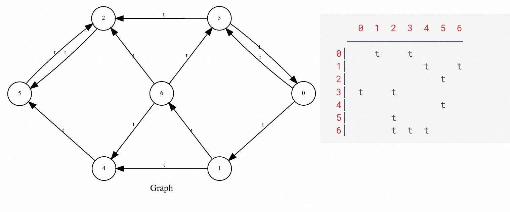         
  
左边是矩阵的图形表示，右边是图的矩阵表示。这是 GraphBLAS 的核心概念。通过统一这两个概念，我们既可以通过边节点的图运算，也可以通过代数运算来分析图。  
  
## 存储图表  
OneSparse 可以将图序列化和反序列化为 Postgres 对象，并将其与磁盘状态进行转换。此状态可以来自各种来源，但最简单的方法是将大型可变长度数据数组按行[“TOAST”存储](https://www.postgresql.org/docs/current/storage-toast.html) 。然而，这种方法的一个主要限制是 Postgres 的设计限制其最大 TOAST 大小约为 1GB，这通常将 TOAST 后的图最多限制为几亿条边。TOAST 存储对于小型图或大型图的子图非常有用，但包含数十亿条边的图会超出此大小限制，因此 OneSparse 还提供了从 SQL 查询、大型对象存储或（最理想的情况）服务器文件系统本身的压缩文件加载更大图的功能。  
  
对于小型图，将其存储为 varlena 对象完全没问题。对于符合 TOAST 限制的小型图，一种简单的方法是创建一个物化视图，使用[标准Matrix Market格式](https://math.nist.gov/MatrixMarket/formats.html)从磁盘加载图数据：  
```  
create materialized view if not exists karate as  
    select mmread('/home/postgres/onesparse/demo/karate.mtx') as graph;  
```  
  
现在可以使用 OneSparse 公开的 GraphBLAS API 从 SQL 访问此图。  
  
## 高性能并行广度优先搜索（BFS）  
广度优先遍历 (BFS) 是图分析的核心操作。就像把一颗鹅卵石扔进池塘，你从图中的一个点开始，遍历所有找到的边。遍历图的过程中会积累一些有趣的信息，例如距离起点有多少条边，“层级”以及你从哪个节点（即“父节点”）来的行索引。在 GraphBLAS 中，这些信息被积累在向量中，向量的图类比是一组映射到其上的节点集合。  
  
几乎任何语言都可以很容易地编写一个函数来执行跨图的 BFS 操作，但随着图的规模越来越大，这些方法就难以扩展了。为了高效地执行 BFS，必须使用多个核心，并协调它们在不同处理器架构（CPU、GPU、FPGA 等）之间的并行工作。GraphBLAS API 的主要目标是以硬件可移植的方式达到数百甚至数千个不同核心架构的规模。  
  
### 层级 BFS  
层级广度优先搜索 (Level BFS) 使用广度优先搜索算法，从给定源顶点开始，揭示每个顶点的深度。详情 请参阅 https://en.wikipedia.org/wiki/Breadth-first_search 。  
```  
select draw(triu(graph),  
            (select level from bfs(graph, 1)),  
            false,  
            false,  
            true,  
            0.5,  
            label:='Level BFS') as draw_source from karate \gset  
```  
  
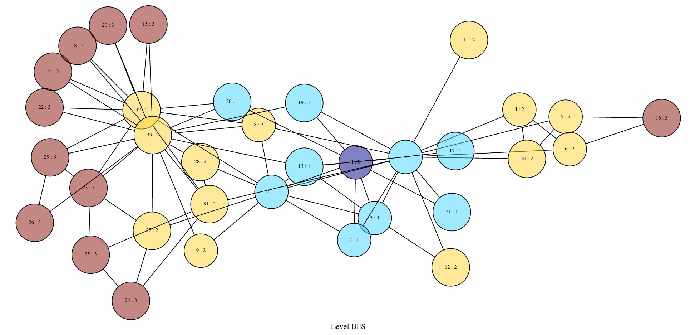      
  
### 父级 BFS  
父级 BFS 返回以所选源为根的 BFS 树中每个顶点的前驱。它也基于 https://en.wikipedia.org/wiki/Breadth-first_search。  
```  
select draw(triu(graph),  
            (select parent from bfs(graph, 1)),  
            false,  
            false,  
            true,  
            0.5) as draw_source from karate \gset  
```  
  
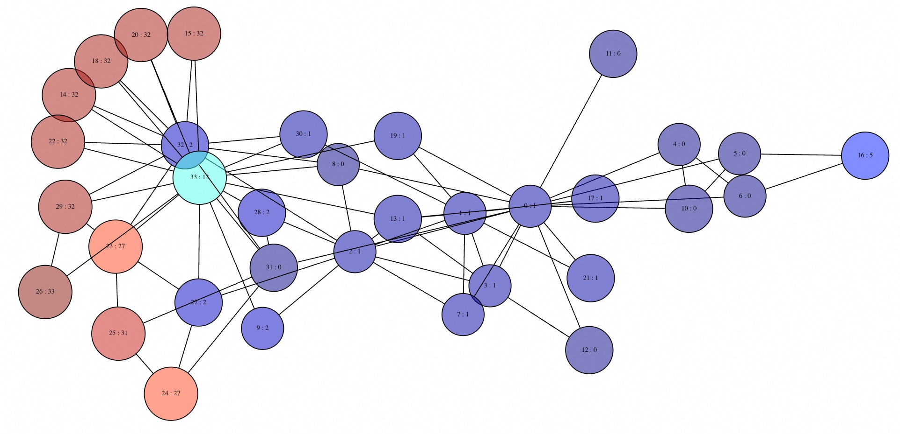      
  
例如，我们使用行业标准[GAP Benchmark Suite](https://github.com/sbeamer/gapbs)对 OneSparse 进行了基准测试。GAP 是一组公开可用的[图形数据集](https://sparse.tamu.edu/)和算法，图库可以使用它来对自身性能进行基准测试。  
  
### 基准测试  
使用 OneSparse 进行 BFS GAP 基准测试  
  
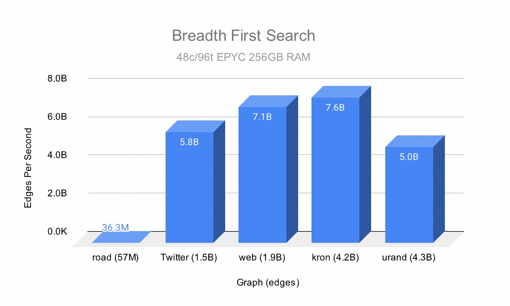      
  
此图表展示了多个 GAP 图上的 BFS 性能。最小的图road有 5700 万条边。最大的图urand 有 43 亿条边。这些值通过将图中的边数除以运行时间，显示了 OneSparse 使用 BFS 可以遍历的“每秒边数”。  
  
这里我们可以看到 OneSparse 在所有图遍历上的速度有多么惊人，在某些图上每秒可处理超过 70 亿条边。SuiteSparse 使用巧妙的稀疏矩阵压缩技术和高度优化的 JIT 内核进行稀疏乘法运算，从而实现了这些结果。  
  
有趣的是，[道路图](https://sparse.tamu.edu/GAP/GAP-road)起初表现并不理想。一个问题是，该图太“小”，只有 5700 万条边，无法充分利用所有核心。极端稀疏性带来的一些问题加剧了这一问题。道路图非常稀疏，度分布相对均匀，几乎没有机会进行批量操作，而且它的直径非常大，这意味着存在多个工作层级。这是一种相对常见但棘手的图类型，使用任何语言或技术进行并行遍历都存在困难，这也表明了图的复杂性！  
  
## 度中心性  
乍一看，矩阵存储图似乎有点奇怪，但它却能发挥线性代数的威力。例如，假设你想知道图中每个节点的“度”，即有多少条边连接到该节点。  
  
这可以通过将矩阵简化为向量来实现，即将矩阵的所有列向量相加，得到一个包含每个节点度数的向量。由于空手道图是布尔值（权重为真或假），因此将此矩阵转换为整数会将每条边的权重设置为 1，然后进行简化操作，将所有边的权重相加，最终等于该节点的出度。  
```  
select reduce_cols(cast_to(graph, 'int32')) as "Karate Degree" from karate;  
┌────────────────────────────────────────────────────────────────────────────────────────────────────────────────────────────────────────────────────────────────────────────────┐  
│                                                                                 Karate Degree                                                                                  │  
├────────────────────────────────────────────────────────────────────────────────────────────────────────────────────────────────────────────────────────────────────────────────┤  
│ int32(34)[0:16 1:9 2:10 3:6 4:3 5:4 6:4 7:4 8:5 9:2 10:3 11:1 12:2 13:5 14:2 15:2 16:2 17:2 18:2 19:3 20:2 21:2 22:2 23:5 24:3 25:3 26:2 27:4 28:3 29:4 30:4 31:6 32:12 33:17] │  
└────────────────────────────────────────────────────────────────────────────────────────────────────────────────────────────────────────────────────────────────────────────────┘  
(1 row)  
```  
  
向量将节点的行索引映射到一个值。现在看一下图，其中节点被标记，并根据每个节点的度数映射颜色：  
```  
select draw(triu(graph),  
            reduce_cols(cast_to(graph, 'int32')),  
            false,  
            false,  
            true,  
            0.5,  
            'Degree of Karate Graph')  
    as draw_source from karate \gset  
```  
  
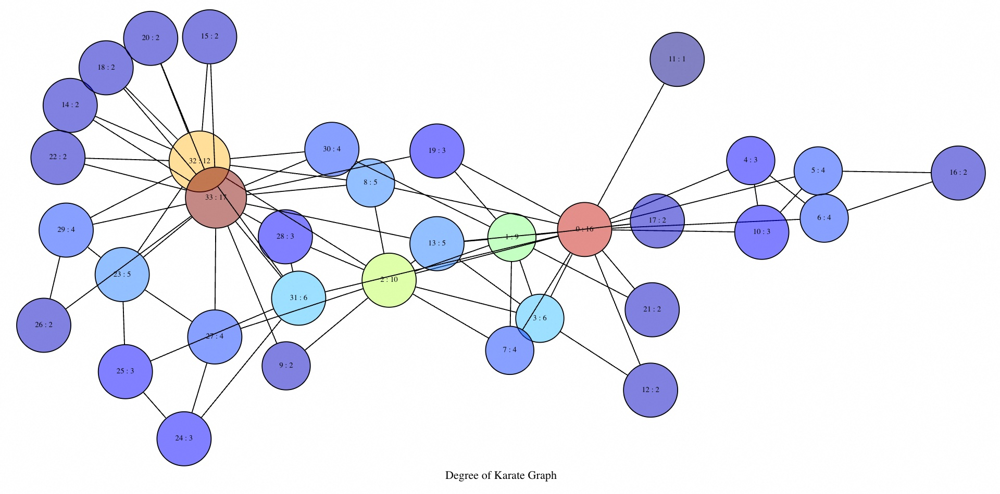    
  
我们了解了图和矩阵如何合二为一的核心思想，现在我们来看一下向量和图之间的关系。向量表示图中节点的集合。它们将节点映射到一些有用的信息，例如节点的度数。向量约简是线性代数的核心运算，GraphBLAS 完全支持这一点。向量通常最终是代数图算法的结果。  
  
## PageRank  
Degree 很简单，但更高级的算法呢？GraphBLAS 社区正是通过 [LAGraph库](https://github.com/GraphBLAS/LAGraph)，真正展现了深度图研究的强大力量。LAGraph 是使用 GraphBLAS API 优化的图算法集合。OneSparse 还包装了 LAgraph 函数并将其公开给 SQL。例如，让我们对 空手道图 进行 [PageRank 排序](https://en.wikipedia.org/wiki/PageRank)：  
```  
select draw(triu(graph),  
            pagerank(graph),  
            false,  
            false,  
            true,  
            0.5,  
            'PageRank Karate Graph')  
    as draw_source from karate \gset  
```  
  
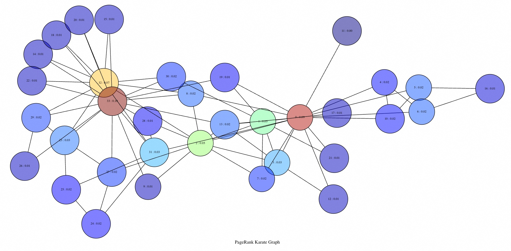    
  
等等，这和度图不一样吗？不一样，但它们看起来确实很像！这是因为在这种小规模下，PageRank 本质上退化成了度。这两种算法都被称为中心性，而 LAGraph 有几种中心性算法。  
  
## 三角中心性  
[三角形中心性](https://arxiv.org/abs/2105.00110)使用节点所连接的三角形数量来计算其中心性得分。这基于一个假设：三角形之间的连接比单个边之间的连接更牢固。  
```  
select draw(triu(graph),  
            triangle_centrality(graph),  
            false,  
            false,  
            true,  
            0.5,  
            'Triangle Centrality Karate Graph')  
    as draw_source from karate \gset  
```  
  
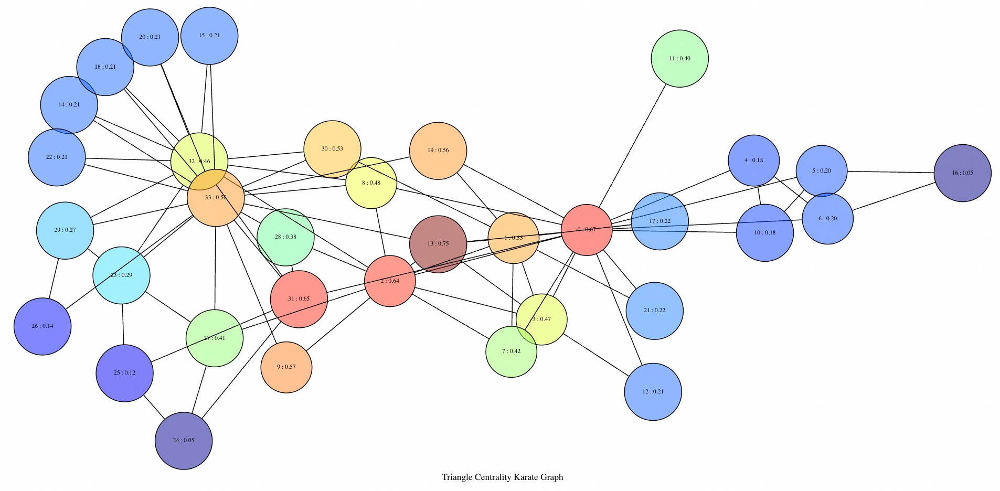    
  
哪种中心性才是“最佳”的？这个问题没有答案，它们都是分析师工具箱里的工具。  
  
## 超图代数  
正如我们所见，OneSparse 非常适合处理简单的节点和边图，但许多更高级的用例需要超图，其中边可以有多个源或目标。这些图类型对于建模复杂的交互和金融场景（其中关系不仅仅是一对一）非常重要。一个常见的研究示例是多方金融交易网络，其中交易代表具有多个输入和输出的超边。  
  
这种类型的图可以很容易地用 OneSparse 建模，使用二分表示法，使用两个称为关联矩阵的矩阵，一个将输出地址节点映射到交易超边，另一个将交易映射到输入地址节点。  
  
让我们通过制作两个随机关联矩阵来伪造一些数据，一个用于地址输出节点到交易超边，另一个用于交易边到输入节点。  
```  
create materialized view txn_graph as  
        select triu(random_matrix(12,15,60,sym:=false,min:=1,max:=9,seed:=0.43)) as addr_to_txn,  
               triu(random_matrix(15,12,50,sym:=false,min:=1,max:=9,seed:=0.42)) as txn_to_addr;  
```  
  
当我们打印这两个矩阵时，我们可以看到一个是 `12x15`，另一个是 `15x12`。  
```  
select print(addr_to_txn) as "Address to Transaction", print(txn_to_addr) as "Transaction to Address" from txn_graph;  
┌─────────────────────────────────────────────────────┬────────────────────────────────────────────┐  
│               Address to Transaction                │           Transaction to Address           │  
├─────────────────────────────────────────────────────┼────────────────────────────────────────────┤  
│      0  1  2  3  4  5  6  7  8  9 10 11 12 13 14    │      0  1  2  3  4  5  6  7  8  9 10 11    │  
│    ─────────────────────────────────────────────    │    ────────────────────────────────────    │  
│  0│     7                    6  6                   │  0│              2  8                      │  
│  1│        6              6           1     7       │  1│        4        7                      │  
│  2│           3           8  9  7                   │  2│              5     2           1  1    │  
│  3│                    1     4  4     8             │  3│                 6     1                │  
│  4│                    6  9     2  4  1             │  4│                    5                   │  
│  5│                    4     2  4     6             │  5│                          9     8       │  
│  6│                          6  5  2        6       │  6│                          4  5  3       │  
│  7│                             2        9          │  7│                          7             │  
│  8│                                      9          │  8│                             3          │  
│  9│                                      9     1    │  9│                                        │  
│ 10│                                      8     5    │ 10│                                        │  
│ 11│                                                 │ 11│                                        │  
│                                                     │ 12│                                        │  
│                                                     │ 13│                                        │  
│                                                     │ 14│                                        │  
│                                                     │                                            │  
└─────────────────────────────────────────────────────┴────────────────────────────────────────────┘  
(1 row)  
  
select hyperdraw(addr_to_txn, txn_to_addr, 'A', 'T') as draw_source from txn_graph \gset  
```  
  
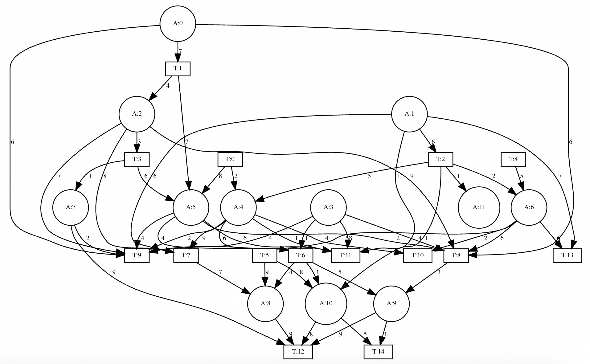    
  
关联矩阵构成了超图，但是我们如何将这两个矩阵折叠在一起以进行地址到地址或交易到交易的分析呢？这将我们带到了线性代数的魔力，特别是矩阵乘法。您可能会注意到两个矩阵符合，一个`m`乘以`n`，另一个`n`乘以`m`。这意味着它们可以相乘，这会导致两个关联矩阵沿其公共维度折叠。让我们看一个例子。如果左边的矩阵乘以右边的矩阵，那么得到的矩阵将是一个将地址映射到地址的方阵邻接矩阵。如果翻转矩阵的顺序，它们仍然符合，但这次是从交易到交易的映射：  
```  
with addr_to_addr as  
        (select addr_to_txn @++ txn_to_addr as ata from txn_graph),  
     txn_to_txn as  
        (select txn_to_addr @++ addr_to_txn as ttt from txn_graph)  
select (select draw(ata,  
                    reduce_rows(ata),  
                    true,  
                    true,  
                    true,  
                    0.5,  
                    label:='Address to Address') from addr_to_addr) as twocol_a_source,  
       (select draw(ttt,  
                    reduce_rows(ttt),  
                    true,  
                    true,  
                    true,  
                    0.5,  
                    label:='Transaction to Transaction', shape:='box') from txn_to_txn) as twocol_b_source \gset  
```  
  
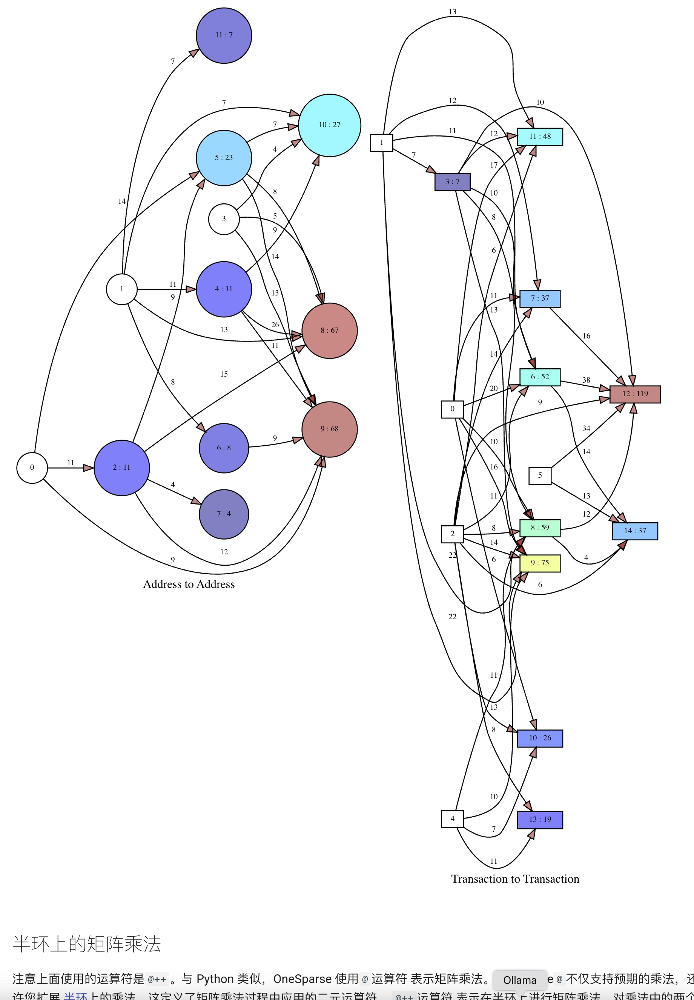    
  
## 半环上的矩阵乘法  
注意上面使用的运算符是`@++`。与 Python 类似，OneSparse 使用运算符`@`表示矩阵乘法。OneSparse不仅支持预期的`@`乘法，还允许您扩展 [半环](https://en.wikipedia.org/wiki/Semiring)上的乘法，这定义了矩阵乘法过程中应用的二元运算符。 `@++`运算符 表示在半环上进行矩阵乘法，对乘法中的两个二元运算执行加法运算。  
  
如果你没有接触过半环，乍一看可能有点奇怪，但其核心思想是矩阵乘法是一种由两个二元运算符组成的运算模式。“乘法”运算符用于映射行向量和列向量中的匹配元素。“加法”运算符，严格来说是一个 [Monoid](https://en.wikipedia.org/wiki/Monoid)，用于将乘积约化为结果。半环允许你自定义矩阵乘法中使用的运算符。  
  
由于上图显示了价值在图中流动，我们不需要传统的“乘法”运算符，而是需要“加法”来添加路径值，因此，我们使用“plus_plus” `@` 半环，而不是大家已经熟悉的标准“plus_times” 半环（运算符 `@++` ）。  
  
GraphBLAS 附带数千个可用于图操作的实用半环。OneSparse 中大多数半环没有快捷运算符，只有最常用的半环。要访问不太常见的半环，可以将名称传递给 [mxm](https://onesparse.com/test_matrix_header.html#matrix-matrix-multiplication) 函数。您甚至可以创建自定义半环和自定义元素类型以供它们操作。更多详情，请参阅后续博客文章。  
  
## OneSparse Alpha  
OneSparse 仍在开发中，目前已包含 SuiteSparse 中几乎所有 GraphBLAS 功能。虽然仍有一些工作要做，但我们正在快速推进这些剩余功能的实现。  
  
OneSparse 可从[Github](https://github.com/OneSparse/OneSparse/)下载 ，需要 Postgres 18 Beta 版本。由于 OneSparse 性能所依赖的 Postgres 核心最近发生了一些变化，因此无法支持低于 18 版本的 Postgres。现在，您可以使用我们的一个[演示 Docker 镜像](https://onesparse.com/docker.html)来尝试 OneSparse 和 Postgres 18 的结合使用！  
  
## 即将推出：自定义类型和运算符  
SuiteSparse 附带大量实用的类型、运算符和半环，但真正强大的是它能够自定义元素类型和运算符。由于这意味着需要用户使用 SuiteSparse JIT，我们仍在研究如何以最佳方式使其简洁实用，同时又不让 SQL 安全地使用自定义 JIT 代码。请持续关注我们的博客，了解更多更新。  
  
## 即将推出：表访问方法  
OneSparse 对于扩展的部署有很多计划，最终支持原生集成到新的标准 SQL 图形语法中，我们的下一个版本将包含一个主要的新功能，可以进一步统一 SQL 和 OneSparse。  
  
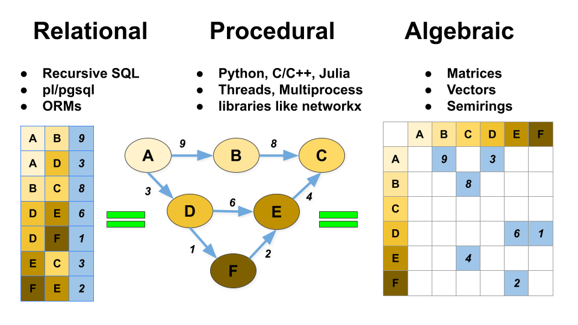    
  
*表格、图形和矩阵*  
  
我们可以看到，图分析有三种不同的形式：关系型、过程型和代数型。OneSparse 旨在统一这三种模型，以便您在处理图数据时拥有最大的灵活性。我们鼓励并支持组合工作流程，例如使用 SQL 进行 ETL 处理、使用 Python 进行传统的按边遍历以及使用代数进行高性能图分析。  
  
我们正在利用PostgreSQL相对较新的[表访问方法 (TAM) API](https://www.postgresql.org/docs/current/tableam.html)，实现完全在后台自动进行图形更新，无需矩阵或向量，只需边表和超高速算法。虽然您可以根据需要随时“深入代数运算”，但这将为已掌握算法和数据的用户提供更简洁的界面。  
  
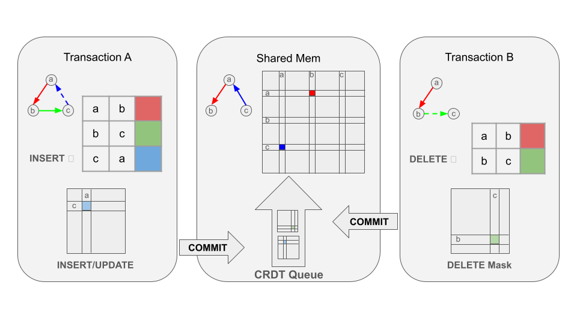    
  
*OneSparse CRDT 图*  
  
在下一个版本中，我们将把基于 TAM 的图存储在共享内存中，从而避免加载成本，从而实现极高的查询吞吐量和极高的性能遍历。矩阵的插入、更新和其他修改操作将使用 CRDT 图语义异步执行，以实现接近零延迟的提交，并最终与图保持一致，同时仍确保表级别的强 ACID 一致性。  
  
OneSparse 是一款非常早期的产品，我们鼓励您尝试并向我们发送反馈，但预计在接下来的几个月里会有一些快速的变化和进步。  
   
