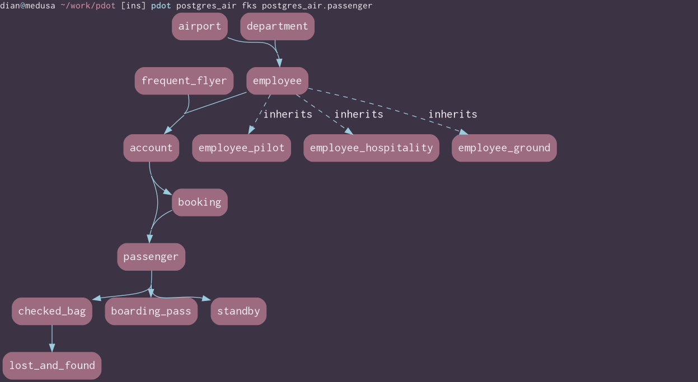
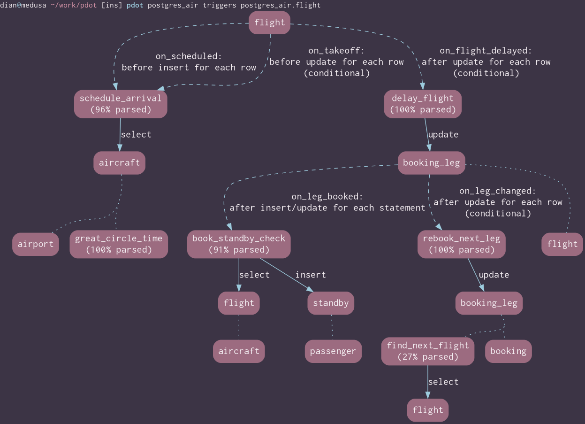
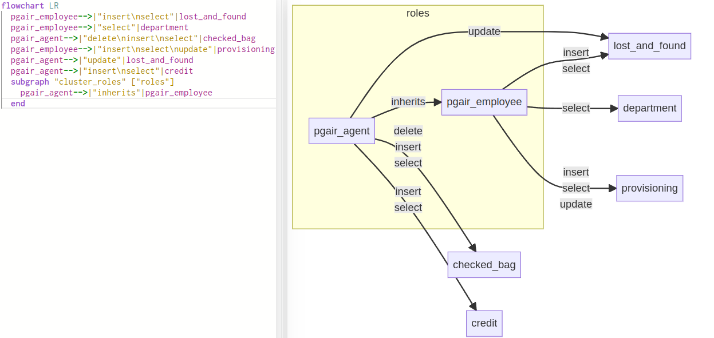

## 生成PG内部元数据对象关系图的小工具   
                    
### 作者                    
digoal                    
                    
### 日期                    
2025-07-23                   
                    
### 标签                    
PostgreSQL , ER , 对象关系图 , mermaid , GraphViz    
                    
----                    
                    
## 背景           
pdot 这个开源的小工具有点意思, 可以用来生成PostgreSQL元数据(例如表、视图、索引、触发器等)的关系图. 格式支持mermaid、GraphViz dot.  
  
https://gitlab.com/dmfay/pdot  
  
如果能将这个功能整合到开发者的IDE工具(如pgAdmin), 或者DBA的日常维护工具(例如云数据库服务的类似DMS的产品)中, 使用起来就更方便, 价值就更大了.  
  
下面是几个截图, 你可以感受一下  
  
  
  
  
  
  
      
