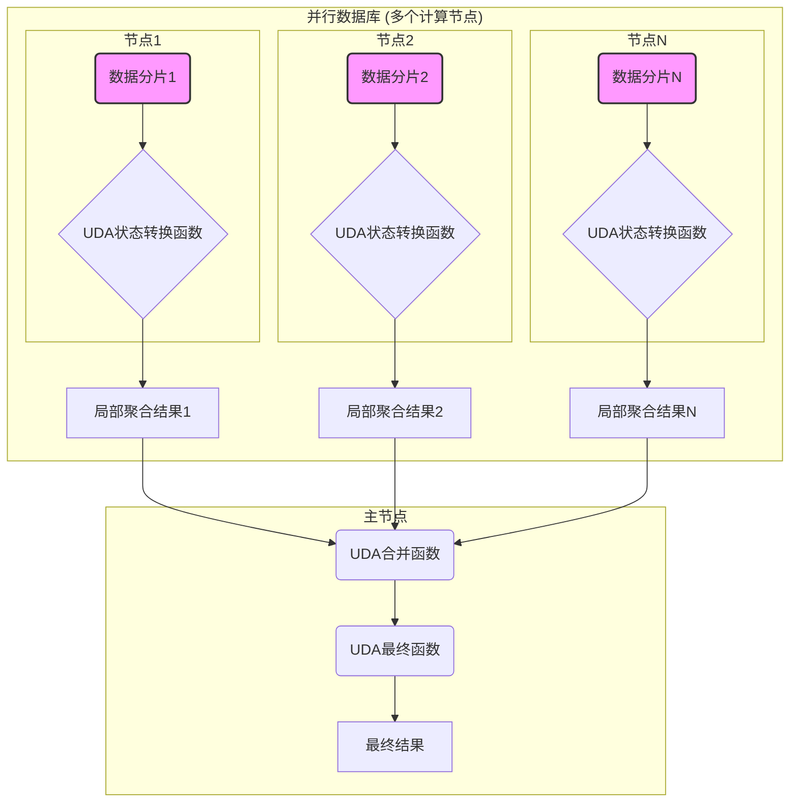
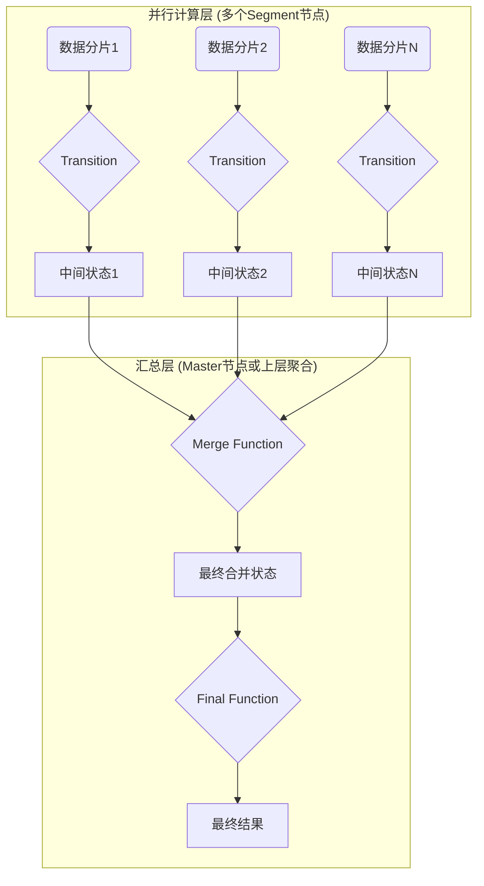
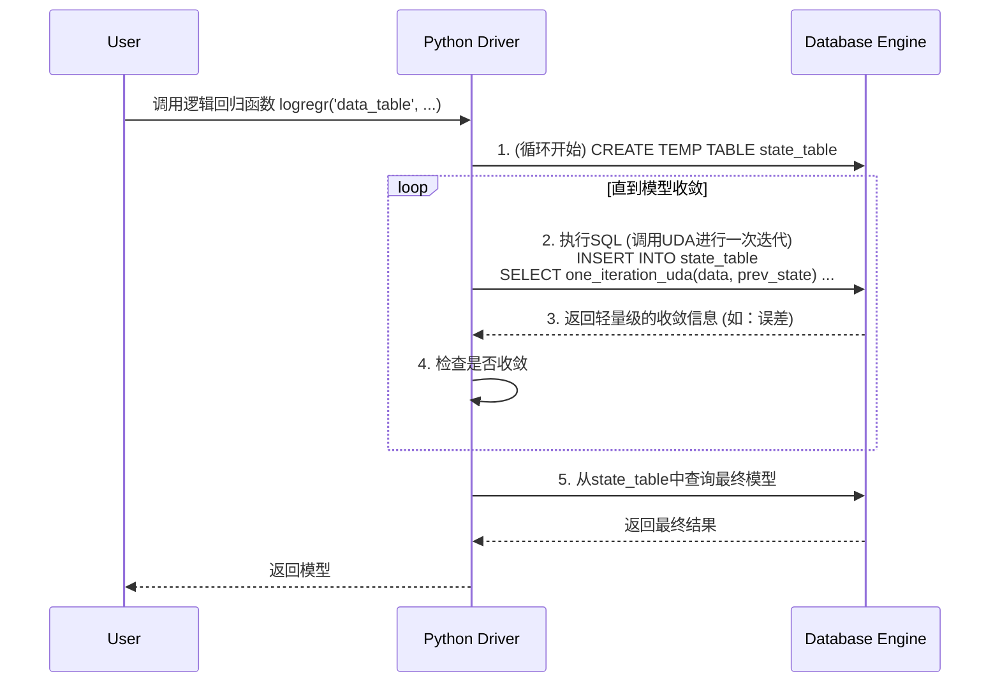
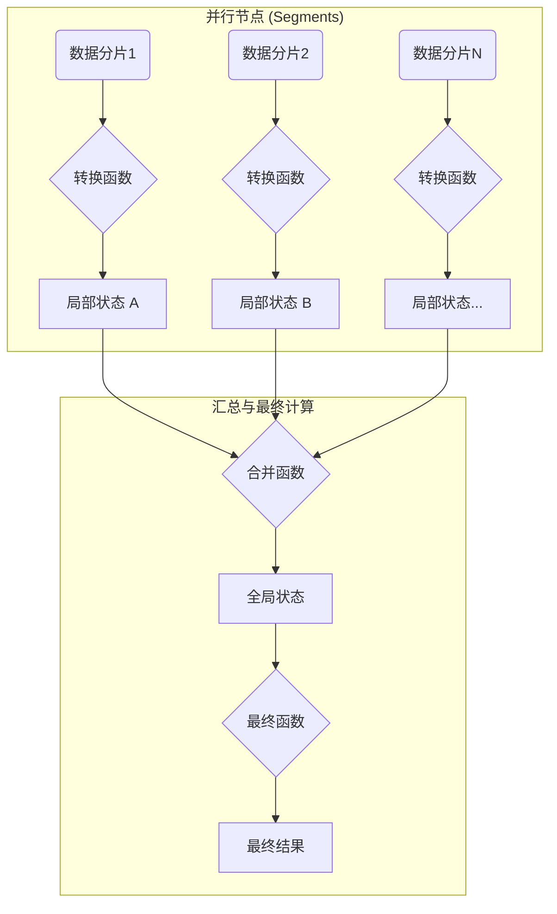
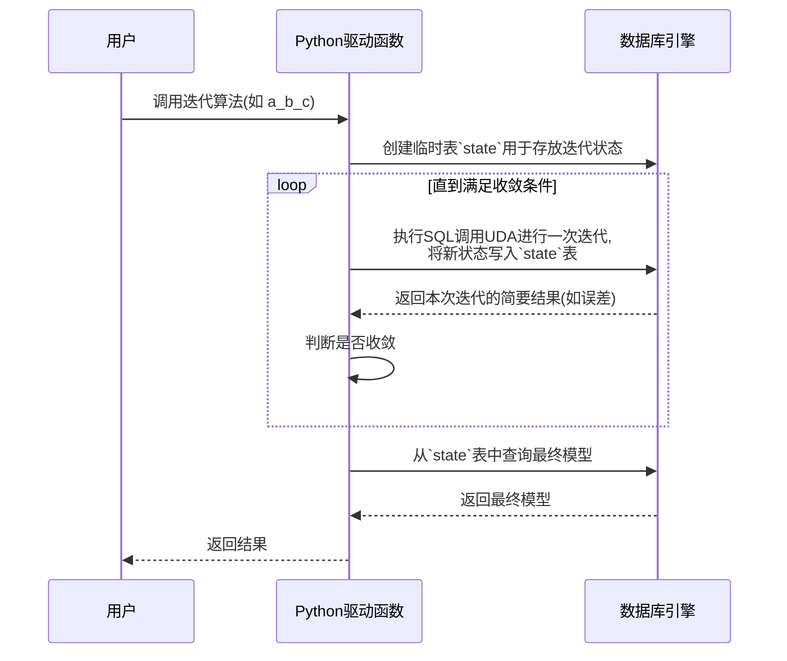

## AI论文解读 | The MADlib Analytics Library or MAD Skills, the SQL
        
### 作者        
digoal        
        
### 日期        
2025-07-24       
        
### 标签        
PostgreSQL , PolarDB , DuckDB , AI , 论文解读        
        
----        
        
## 背景  
      
https://arxiv.org/pdf/1208.4165        
  
      
提示:        
```        
读懂《The MADlib Analytics Library or MAD Skills, the SQL》这篇论文需要提前掌握哪些基础知识, 请使用中文通熟易懂的讲解这些基础知识, 可以使用markdown支持的图形(如text、mermaid等)增加解释性.        
        
使用中文通熟易懂的解读《The MADlib Analytics Library or MAD Skills, the SQL》这篇论文, 其中的关键内容请详细讲解, 可以使用markdown支持的图形(如text、mermaid等)增加解释性.        
        
提取《The MADlib Analytics Library or MAD Skills, the SQL》论文中的重要术语, 使用中文对这些术语进行通熟易懂的讲解, 可以使用markdown支持的图形(如text、mermaid等)增加解释性.        
```     
  
## 1 前置知识 
  
好的，为了完全理解《The MADlib Analytics Library》这篇论文，你需要对数据库、机器学习和一些系统架构有基础的了解。这篇论文的核心思想是：**为什么不直接在数据存储的地方（数据库内部）进行大规模的数据分析和机器学习，从而避免传统方法中“数据提取 -\> 分析 -\> 加载”的繁琐和低效流程？**

下面我将用通俗易懂的中文，为你分解需要掌握的基础知识，并使用Markdown图表辅助说明。

-----

### 1\. 数据库核心概念 (Core Database Concepts)

这是理解论文的基石，因为MADlib的一切都构建在数据库之上。

#### 1.1 关系型数据库和SQL

你首先需要知道什么是关系型数据库（RDBMS）。简单来说，它就像一个由多个结构化的二维表（类似Excel表格）组成的集合，表与表之间可以建立关联。

  * **SQL (Structured Query Language)**：是与数据库沟通的语言。你至少需要熟悉最基本的`SELECT`语句，特别是 **聚合（Aggregation）** 和`GROUP BY`子句。

    例如，计算每个部门的平均工资：

    ```sql
    SELECT
        department,
        AVG(salary) AS average_salary
    FROM
        employees
    GROUP BY
        department;
    ```

    MADlib的大量算法都巧妙地利用了数据库内核执行这种聚合操作的能力，因为聚合天然适合并行计算。

#### 1.2 用户定义函数 (UDF) 和用户定义聚合 (UDA)

标准的SQL函数（如`SUM`, `AVG`）是有限的。为了实现复杂的数学和统计逻辑，数据库允许用户使用C++或Python等语言编写自己的函数，这就是**用户定义函数 (User-Defined Function, UDF)**。

当一个UDF可以像`SUM`一样，处理一组数据并返回一个结果时，它就升级成了**用户定义聚合 (User-Defined Aggregate, UDA)**。这是MADlib实现其算法的**核心魔法** 。论文中反复强调，一个复杂的机器学习算法可以被分解成数据库内可执行的UDA。

下面是UDA在并行数据库中的工作流程示意图：



  * **状态转换 (Transition)**：在每个并行节点上，UDA独立处理一部分数据，更新一个中间状态 。
  * **合并 (Merge)**：将所有并行节点计算出的中间状态合并成一个总状态 。
  * **最终处理 (Final)**：对最终的合并状态进行计算，得出最后的结果 。

理解了这个流程，你就明白了MADlib如何利用数据库的并行能力来加速计算。

#### 1.3 并行数据库 (MPP Architecture)

论文提到了Greenplum等并行数据库 。你需要理解其**无共享 (Shared-Nothing)** 架构。在这种架构中，数据被分散存储在多个独立的节点上，每个节点都有自己的CPU、内存和磁盘。当执行查询时，每个节点只计算自己那部分数据，最后再将结果汇总。

```text
+-----------------------+      +-------------------------+
|   传统单节点数据库      |      |   并行数据库 (MPP)        |
|                       |      |                         |
|  +-----------------+  |      | +-------+ +-------+ +-------+
|  |      CPU        |  |      | | Node1 | | Node2 | | NodeN |
|  +-----------------+  |      | | (CPU/ | | (CPU/ | | (CPU/ |
|  |      内存       |  |      | | Mem/  | | Mem/  | | Mem/  |
|  +-----------------+  |      | | Disk) | | Disk) | | Disk) |
|  |      磁盘       |  |      | +-------+ +-------+ +-------+
|  +-----------------+  |      |           |         |       |
|                       |      |           +---------+-------+-- 高速网络
+-----------------------+      +-------------------------+
```

MADlib正是为这种能够**横向扩展 (scale-out)** 的架构设计的，数据量再大，增加机器节点即可应对 。

-----

### 2\. 机器学习与统计学基础 (Fundamentals of ML & Statistics)

你不需要成为机器学习专家，但需要了解一些基本概念和算法，因为它们是论文中讨论和实现的具体例子。

#### 2.1 监督学习 vs. 无监督学习

  * **监督学习 (Supervised Learning)**：用带有“标签”或“答案”的数据进行训练。论文中的**线性回归 (Linear Regression)** 和 **逻辑回归 (Logistic Regression)** 都是典型例子 。
  * **无监督学习 (Unsupervised Learning)**：从未经“标签”的数据中发现隐藏的结构。论文中的 **K-Means聚类 (k-Means Clustering)** 就是一个例子 。

#### 2.2 核心算法思想

  * **线性回归 (Linear Regression)**：寻找一条直线（或高维平面），最好地拟合数据点。它的计算可以被完美地表达为一个单次扫描数据的聚合操作（UDA），是MADlib的理想应用场景 。
  * **逻辑回归 (Logistic Regression)**：通常用于分类问题（比如判断一封邮件是否为垃圾邮件）。与线性回归不同，它通常需要**迭代计算**，即多次扫描数据，每次都让模型更接近最优解 。
  * **K-Means聚类**：将数据点分成K个簇。它也是一个迭代算法：先随机确定K个中心点，然后将每个数据点分配给最近的中心点，再重新计算每个簇的中心点，如此反复直到中心点不再变化 。

#### 2.3 迭代算法 (Iterative Algorithms)

这是理解论文后半部分的关键。很多复杂的机器学习算法无法一次性算出结果，需要反复迭代。SQL本身不擅长处理迭代。MADlib为此设计了一种 **“驱动函数 (Driver Function)”** 模式 。

这个模式通常用Python实现，其工作流程如下：

```text
Python Driver Function
 |
 +-- 1. (循环开始) 创建一个临时表来存储状态
 |
 +-- 2. 调用SQL查询 (内置MADlib UDA), 基于当前状态处理数据
 |      并将新状态写入临时表
 |      SELECT madlib_uda(data, current_state) FROM ...
 |
 +-- 3. 检查是否满足收敛条件 (比如模型误差足够小)
 |      |
 |      +-- 如果不满足，回到第2步，进行下一次迭代
 |      |
 |      +-- 如果满足，循环结束
 |
 +-- 4. 从临时表中读取最终结果，返回给用户
```

这种模式的精髓在于，**大数据始终在数据库内部流动，Python驱动函数只传递轻量级的控制指令和状态信息**，从而避免了性能瓶瓶颈 。

-----

### 3\. 编程与系统架构知识 (Programming & System Architecture)

这部分帮助你理解MADlib是如何被“制造”出来的。

  * **双层编程模型**：MADlib采用了一种分层思想。

      * **宏观编程 (Macro-Programming)**：使用Python和SQL来编排整个计算流程，尤其是处理迭代和并行任务 。这就是上面提到的驱动函数模式。
      * **微观编程 (Micro-Programming)**：对于计算密集型的核心部分（如矩阵运算），使用高性能的C++和专门的数学库（如Eigen）来实现，并包装成UDF/UDA 。

  * **抽象层 (Abstraction Layer)**：为了让算法开发者不必关心底层数据库的复杂接口（如内存管理、类型转换），MADlib提供了一个C++抽象层 。开发者可以在一个更友好、更接近数学公式的环境中编写代码，而由这个抽象层负责与数据库“脏活累活”的交互。

-----

### 总结

要读懂这篇论文，你需要戴上三副“眼镜”：

1.  **数据库管理员的眼镜**：思考数据如何存储、如何通过SQL进行并行聚合、以及如何通过UDA扩展数据库功能。
2.  **数据科学家的眼镜**：理解线性回归、逻辑回归等算法的基本目标和计算特点（一次性完成还是需要迭代）。
3.  **软件工程师的眼镜**：欣赏其分层设计思想，即如何用Python做“总指挥”，用C++做“突击队”，将复杂的算法逻辑优雅地实现在数据库这个“战场”上。

有了这些基础，你就能深刻理解MADlib作为一个开源库，其在架构设计上的创新之处，以及它为什么能成为“数据库内分析”领域的开创性工作。
  
## 2 解读论文 
  
好的，这篇题为《The MADlib Analytics Library or MAD Skills, the SQL》的论文是“数据库内分析”领域的开创性作品之一。它探讨了如何将复杂的机器学习算法直接在数据库内部高效运行，从而避免传统分析流程中繁琐的数据迁移。

下面，我将为您详细解读这篇论文的关键内容。

### 核心思想：从“数据搬运工”到“就地分析师”

在MADlib出现之前，进行大规模数据分析的典型流程是：

1.  **抽取 (Extract)**：从大型数据库或数据仓库中将所需数据抽取出来。
2.  **分析 (Analyze)**：将数据加载到专门的统计软件（如R、SAS）或计算集群（如Hadoop）中进行模型训练和分析。
3.  **加载 (Load)**：将分析结果导回数据库中。

随着数据量越来越大（进入“大数据”时代），这个流程的瓶颈日益凸显：数据的抽取和加载过程不仅耗时，而且成本高昂。

MADlib的核心思想颠覆了这一传统模式，它主张：**将计算移动到数据所在之处，而不是将数据移动到计算发生的地方**。其目标是让数据库本身变成一个高性能、可并行化的数据科学计算引擎 。

-----

### 项目目标：为何要在数据库里做分析？为何要开源？

论文阐述了项目的两大动机。

#### 1\. 为什么选择数据库？

  * **分析完整数据集**：传统的统计方法论（如SEMMA）强调抽样(Sample)后再分析 。但在今天，商业竞争的胜负手往往在于“长尾效应”中的特殊群体（如精准广告投放） 。抽样会丢失这些“长尾”信息，而并行数据库有能力处理全量数据，从而获得更精细的洞察 。
  * **成熟的并行平台**：大规模并行处理（MPP）数据库（如Greenplum、Teradata）本身就是为处理海量数据而设计的，它们构成了执行复杂分析的绝佳平台 。

#### 2\. 为什么要开源？

  * **定制化需求**：数据科学家很少将算法当作“黑盒”使用，他们常常需要根据具体问题修改和调整模型 。开源使得这种定制化成为可能。
  * **促进产学研结合**：开源项目可以打破学术界、工业界和最终用户之间的壁垒 。学术界的新想法可以快速进入实践，而业界的真实需求也能直接反馈给研究人员，加速技术创新和落地 。
  * **建立开放标准**：通过提供一个高质量的开源算法库，可以为行业树立一个基准，避免各厂商封闭开发、标准不一的局面，共同推动社区创新 。

-----

### 关键架构设计：MADlib的“魔法”所在

为了在SQL这个不擅长迭代和复杂计算的语言体系里实现高级算法，MADlib设计了一套精巧的架构，可以分为“宏观”和“微观”两个层面。

#### 宏观编程 (Macro-Programming)：如何用SQL编排数据流

这是指如何组织大规模的数据处理流程。

**1. 核心武器：用户定义聚合 (UDA - User-Defined Aggregates)**

这是MADlib实现并行计算的基础。一个标准的聚合函数（如`SUM()`）可以天然地在并行数据库中高效执行。MADlib将许多机器学习算法的核心计算过程抽象为自定义的聚合函数（UDA） 。一个UDA通常由三个部分组成 ：

  * **状态转换函数 (Transition Function)**：处理每一行数据，并更新一个中间状态 。
  * **合并函数 (Merge Function)**：将来自不同并行节点计算出的多个中间状态合并为一个 。这仅在并行执行时需要 。
  * **最终函数 (Final Function)**：在所有数据处理完毕后，对最终的聚合状态进行计算，产出最后结果 。

下面是UDA在并行数据库中的工作流程图：



**2. 解决迭代问题：驱动函数 (Driver Functions)**

标准SQL不支持循环，但许多机器学习算法（如逻辑回归、K-Means）需要反复迭代才能收敛 。MADlib为此设计了“驱动函数”模式 。

该模式使用一种上层脚本语言（如Python）作为“指挥官”，来调用SQL查询执行每一次迭代。迭代之间的状态通过临时表在数据库内部传递 。

下面是这个模式的流程示意图：



这个设计的精髓在于，**海量数据始终在数据库内部高效流动，Python驱动程序只负责发送控制命令和传递轻量级的状态信息**，完美地扬长避避短 。

#### 微观编程 (Micro-Programming)：如何执行核心数学运算

这是指如何高效地处理单个数据块的内部计算 。

  * **高性能内核**：对于计算密集型的部分（如矩阵相乘），MADlib使用C++编写UDF，并可以调用高度优化的第三方数学库（如Eigen、LAPACK）来利用CPU的SIMD指令集，获得极致性能 。
  * **C++抽象层**：为了让算法开发者不必处理与数据库底层交互的繁琐细节（如内存管理、数据类型转换、错误处理等），MADlib提供了一个C++抽象层 。这使得开发者可以像编写普通C++程序一样编写UDF，极大地提高了开发效率和代码的可移植性 。

-----

### 算法实现案例：理论与实践的结合

论文通过三个经典算法，展示了上述架构如何应用于实践。

1.  **线性回归 (OLS)**：这是一个理想的“单次遍历”算法 。其核心公式求解过程中的 $X^{T}X$ 和 $X^{T}y$ 都是求和运算，可以完美地转化为一个UDA，在一次数据扫描中并行完成 。

2.  **逻辑回归**：这是一个典型的“多遍迭代”算法 。它的求解（如牛顿法）需要反复迭代计算 。因此，它的实现采用了“Python驱动函数 + UDA”的模式，驱动函数负责控制迭代次数和检查收敛，UDA负责在每次迭代中并行计算梯度等信息 。

3.  **K-Means聚类**：这是另一个迭代算法，但它的中间状态可能很大（每个数据点属于哪个簇） 。论文探讨了两种实现策略的权衡：

      * **策略一**：只在内存中保存K个中心点作为状态，每次迭代都重新计算每个点与这K个中心的距离。计算量大，但状态小。
      * **策略二**：用一个临时表显式存储每个点的归属。这样可以减少一半的距离计算，但需要对一个大表进行写操作，在某些数据库（如PostgreSQL）中，大量更新的开销可能很高 。

这个例子说明，将算法映射到数据库时，需要结合数据库自身的特性进行精巧的设计。

### 总结与意义

《The MADlib Analytics Library》不仅仅是关于一个开源软件库的介绍，更重要的是，它提出并验证了一套**在数据库内部进行可扩展、并行化、高级数据分析的完整思想和架构范式**。

  * **它证明了**：关系型数据库不只是一个数据存储和简单查询的工具，通过UDF/UDA和巧妙的设计模式，它可以变身为一个强大的并行计算平台 。
  * **它提供了一套行之有效的设计模式**：如基于UDA的并行化和基于驱动函数的迭代处理，为后续在数据库内实现更多复杂算法铺平了道路 。
  * **它促进了一个生态系统**：通过开源和与学术界的紧密合作 ，MADlib成功地将学术界的前沿研究（如凸优化、文本分析模型）带入了工业级应用 ，成为了连接研究与实践的重要桥梁。
  
## 3 术语 
  
好的，以下是《The MADlib Analytics Library》论文中一些重要术语的中文解读。

-----

### 一、 核心思想与背景术语

#### 1\. 数据库内分析 (In-database Analytics)

这是整篇论文的核心理念。传统的分析方法是把数据从数据库中“搬”出来，放到专门的分析工具（如R、Python）中计算。而数据库内分析则反其道而行之，主张**将计算任务“推”入数据库内部执行**，直接利用数据库的并行处理能力，避免数据来回迁移的开销 。

```text
传统模式：
[数据库] ---- (大量数据迁移) ----> [分析工具]

数据库内分析模式 (MADlib)：
[数据库 (数据 + 计算)] <---- (轻量级指令) ---- [用户]
```

#### 2\. MAD Skills

这个术语是催生MADlib项目的早期思想的缩写，描述了一种新的数据科学实践模式 。

  * **M (Magnetic / 磁性)**：指数据平台应该像磁铁一样吸引各种来源和格式的数据，而不是像传统数仓那样“排斥”不符合规范的数据 。
  * **A (Agile / 敏捷)**：指数据科学家采用敏捷的设计模式，快速地对数据进行建模、加载和迭代分析 。
  * **D (Deep / 深入)**：指使用的不再是简单的报表，而是深入的统计模型和复杂算法 。

#### 3\. SEMMA

这是传统数据挖掘领域一个著名的方法论，是“抽样(Sample)、探索(Explore)、修改(Modify)、建模(Model)、评估(Assess)”五个步骤的缩写 。论文特别指出了在“大数据”时代，第一步“抽样(S)”的局限性 。因为抽样可能会丢失“长尾”数据中的重要信息，而分析全量数据才能获得真正的竞争优势 。MADlib的目标就是让分析全量数据变得可行。

-----

### 二、 关键架构与设计模式术语

#### 1\. 用户定义聚合 (UDA - User-Defined Aggregate)

这是MADlib实现并行算法的**最核心的构件** 。我们知道SQL有`SUM()`、`AVG()`等聚合函数，UDA允许用户使用C++等语言自己定义一个聚合函数。一个UDA包含一套标准流程，使其可以自然地在并行数据库上运行 。

  * **转换函数 (Transition Function)**：处理输入的每一行数据，并更新一个内部的“状态” 。
  * **合并函数 (Merge Function)**：当并行计算时，此函数负责将多个并行节点上计算出的不同“状态”合并成一个 。
  * **最终函数 (Final Function)**：在所有数据处理完毕后，对最终的合并状态进行最后计算，产出结果 。

下面是UDA在并行环境下的工作流程图：



#### 2\. 宏观编程 (Macro-Programming) 与 微观编程 (Micro-Programming)

这是MADlib为了兼顾开发效率和运行性能而采用的分层设计思想。

  * **宏观编程**：指代高层次的、负责编排和协调整个并行数据流的编程 。这部分主要使用SQL和Python驱动函数来完成，开发者可以专注于算法的逻辑流程，而将数据移动、并行化等任务交给数据库引擎 。
  * **微观编程**：指代底层的、负责在单个节点上进行高效数值计算的编程 。这部分通常使用C/C++实现，可以直接调用优化过的数学库（如Eigen、LAPACK），以获得极致的计算性能 。

#### 3\. 驱动函数 (Driver Functions)

由于标准SQL不擅长表达迭代逻辑，MADlib采用“驱动函数”的设计模式来解决这个问题 。通常这是一个用Python编写的用户定义函数（UDF），它像一个“指挥官”，在循环中调用SQL来执行每次迭代 。

  * **作用**：控制迭代流程、检查收敛条件、管理迭代之间的状态 。
  * **关键优势**：迭代之间的状态被存放在数据库的**临时表**中，大数据始终不离开数据库引擎，Python驱动函数只传递轻量级的控制指令，从而避免了性能瓶颈 。




#### 4\. 抽象层 (C++ Abstraction Layer)

为了让算法开发者不必深陷于数据库底层的复杂接口，MADlib提供了一个C++抽象层 。它的目标是让UDF的开发变得简单、高效且可移植。其主要功能包括：

  * **类型桥接**：自动处理C++类型（如`vector`, `matrix`）和数据库内部类型（如`double[]`）之间的转换 。
  * **资源管理**：安全地封装数据库的内存分配/释放、异常处理等机制 。
  * **数学库集成**：轻松地集成高性能的第三方数学库（如Eigen），让开发者可以专注于算法逻辑本身 。

-----

### 三、 相关机器学习与系统术语

#### 1\. 迭代算法 (Iterative Algorithms)

指那些无法一次性计算出最优解，而需要通过重复执行某个计算步骤来逐步逼近最终结果的算法 。例如，梯度下降法（Gradient Descent）和K-Means聚类就是典型的迭代算法 。MADlib使用“驱动函数”模式来专门实现这类算法 。

#### 2\. 凸优化 (Convex Optimization)

这是一类数学优化问题，其目标函数是凸函数，定义域是凸集 。论文中将其描述为一个关键的抽象，因为它有一个非常好的特性：**任何局部最优解就是全局最优解** 。这就像在一个碗状的曲面上找最低点，无论从哪里开始往下走，最终都能到达同一个碗底。许多机器学习模型（如线性回归、逻辑回归、支持向量机）都可以被表述为凸优化问题 。

#### 3\. 随机梯度下降 (SGD - Stochastic Gradient Descent)

这是一种解决凸优化问题的常用迭代算法，尤其适用于目标函数可以表示为多个子项之和的情况 ( $f(x) = \\sum f\_i(x)$ ) 。与计算所有数据的总梯度再下降（计算量大）不同，SGD在每次迭代时，随机选取**单个**数据点来估计整体梯度并更新模型 。虽然每次的估计很“粗糙”，但总体上收敛速度很快，非常适合大规模数据集 。

#### 4\. 无共享架构 (Shared-Nothing Architecture)

这是大规模并行处理（MPP）数据库（如Greenplum）采用的一种分布式系统架构 。在这种架构中，每个计算节点（Segment）都有自己独立的CPU、内存和磁盘，节点之间不共享这些资源 。所有的数据交换和通信都通过网络进行。这种架构的优势在于易于横向扩展（scale-out），增加节点就能线性提升系统的处理能力。
  
## 参考        
         
https://arxiv.org/pdf/1208.4165  
        
        
<b> 以上内容基于DeepSeek、Qwen、Gemini及诸多AI生成, 轻微人工调整, 感谢杭州深度求索人工智能、阿里云、Google等公司. </b>        
        
<b> AI 生成的内容请自行辨别正确性, 当然也多了些许踩坑的乐趣, 毕竟冒险是每个男人的天性.  </b>        
    
  
#### [期望 PostgreSQL|开源PolarDB 增加什么功能?](https://github.com/digoal/blog/issues/76 "269ac3d1c492e938c0191101c7238216")
  
  
#### [PolarDB 开源数据库](https://openpolardb.com/home "57258f76c37864c6e6d23383d05714ea")
  
  
#### [PolarDB 学习图谱](https://www.aliyun.com/database/openpolardb/activity "8642f60e04ed0c814bf9cb9677976bd4")
  
  
#### [PostgreSQL 解决方案集合](../201706/20170601_02.md "40cff096e9ed7122c512b35d8561d9c8")
  
  
#### [德哥 / digoal's Github - 公益是一辈子的事.](https://github.com/digoal/blog/blob/master/README.md "22709685feb7cab07d30f30387f0a9ae")
  
  
#### [About 德哥](https://github.com/digoal/blog/blob/master/me/readme.md "a37735981e7704886ffd590565582dd0")
  
  

  
