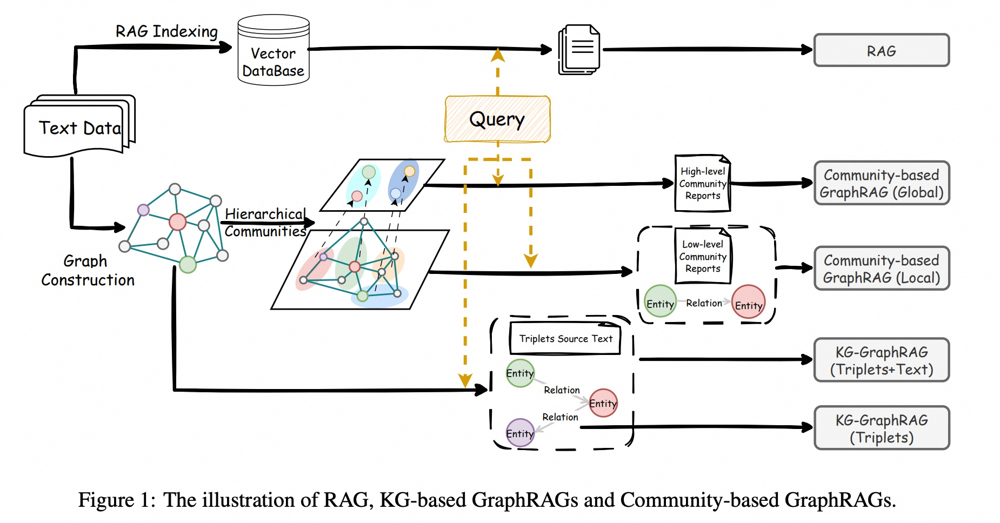

## AI论文解读 | RAG vs. GraphRAG: A Systematic Evaluation and Key Insights
        
### 作者        
digoal        
        
### 日期        
2025-07-24       
        
### 标签        
PostgreSQL , PolarDB , DuckDB , AI , 论文解读        
        
----        
        
## 背景  
      
https://arxiv.org/pdf/2502.11371        
  
      
提示:        
```        
读懂《RAG vs. GraphRAG: A Systematic Evaluation and Key Insights》这篇论文需要提前掌握哪些基础知识, 请使用中文通熟易懂的讲解这些基础知识, 可以使用markdown支持的图形(如text、mermaid等)增加解释性.        
        
使用中文通熟易懂的解读《RAG vs. GraphRAG: A Systematic Evaluation and Key Insights》这篇论文, 其中的关键内容请详细讲解, 可以使用markdown支持的图形(如text、mermaid等)增加解释性.        
        
提取《RAG vs. GraphRAG: A Systematic Evaluation and Key Insights》论文中的重要术语, 使用中文对这些术语进行通熟易懂的讲解, 可以使用markdown支持的图形(如text、mermaid等)增加解释性.        
```     
  
## 1 前置知识 
  
好的，为了完全理解《RAG vs. GraphRAG: A Systematic Evaluation and Key Insights》这篇论文，您需要先掌握几个核心的人工智能和自然语言处理概念。下面我将用通俗易懂的中文为您逐一讲解，并配合图示，让您轻松入门。

-----

### 核心知识点概览

要读懂这篇论文，我们需要了解以下几个关键概念，它们之间层层递进：

1.  **大语言模型 (Large Language Models, LLM)**：这是所有技术发挥作用的“大脑”。
2.  **检索增强生成 (Retrieval-Augmented Generation, RAG)**：一种让“大脑”更博学、更可靠的技术。
3.  **知识图谱 (Knowledge Graph, KG)**：一种结构化的数据形式，像一张巨大的“关系网”。
4.  **GraphRAG**：RAG的一种变体，它检索的不是普通文本，而是知识图谱这样的“关系网”。
5.  **评测任务 (Evaluation Tasks)**：用来衡量RAG和GraphRAG效果的“考题”，如问答和摘要。

接下来，我们一一分解。

### 1\. 大语言模型 (LLM)：一个聪明的“大脑”

您可以将LLM想象成一个非常聪明、博览群书的“大脑”，比如GPT-4。

  * **它能做什么？** 它能理解和生成人类语言，可以聊天、写文章、翻译、写代码。
  * **它的局限性？**
      * **知识截止**：它的知识是“冻结”的，只停留在训练它的那个时间点。比如，一个2023年训练的模型不知道2025年发生的新闻。
      * **容易“一本正经地胡说八道” (幻觉)**：当遇到它不知道或不确定的问题时，它可能会编造一个看起来很合理的答案 。
      * **无法访问私有数据**：它不知道你公司内部的知识库或你自己的笔记。

正是为了解决这些问题，RAG技术应运而生。

### 2\. 检索增强生成 (RAG)：给“大脑”一本可随时查阅的“参考书”

RAG是一种“开卷考试”策略，它允许LLM在回答问题前，先从一个外部知识库（比如公司的产品文档、最新的网络文章等）中查找相关资料，然后再结合查到的资料生成答案 。

**工作流程很简单：**

1.  **索引 (Indexing)**：预先将你的所有资料（如PDF、网页、文档）切分成小块，并存入一个“数据库”中 。
2.  **检索 (Retrieve)**：当用户提问时，系统会先去数据库里，把和问题最相关的几个文本块找出来 。
3.  **增强生成 (Augment & Generate)**：将用户的问题和找到的相关文本块一起发给LLM，让LLM基于这些信息来生成一个更准确、更可靠的答案 。

下面是RAG工作流程的示意图：


RAG技术极大地提升了LLM的性能，减少了幻觉，并能利用最新或私有的知识 。论文中讨论的RAG，就是指这种基于文本检索的经典方法 。

### 3\. 知识图谱 (Knowledge Graph, KG)：结构化的“思维导图”

现在，想象一下，如果我们的“参考书”不是零散的文本段落，而是一张巨大的、结构化的“思维导图”或“关系地图”，这就是知识图谱（KG） 。

  * **核心元素**：知识图谱由“实体”（Nodes/Entities）和“关系”（Edges/Relations）组成 。
      * **实体**：指现实世界中的事物，如“爱因斯坦”、“相对论”、“德国”。
      * **关系**：指实体之间的联系，如“出生于”、“提出”、“位于”。
  * **存储形式**：通常以“三元组”（Triplets）的形式存在，即 **(头实体, 关系, 尾实体)**，例如 `(爱因斯坦, 出生于, 德国)` 。

知识图谱的优势在于它能清晰地表达实体间的复杂关系，非常适合进行推理 。

### 4\. GraphRAG：让“大脑”查阅“关系地图”

GraphRAG是RAG的一种高级变体。它不再从散乱的文本中检索，而是从结构化的知识图谱中检索信息 。

**与RAG的主要区别在于：**

1.  **数据预处理**：GraphRAG需要先从原始文本中构建一个知识图谱 。这个过程叫做“图谱构建”（Graph Construction），通常也是用LLM来自动抽取文本中的实体和关系 。
2.  **检索方式**：当用户提问时，GraphRAG会在知识图谱上进行游走（Graph Traversal），寻找与问题相关的实体和它们的多跳（multi-hop）邻居关系，从而获得更具上下文和逻辑关联的信息 。

下面是GraphRAG工作流程的示意图：


论文中，作者比较了多种GraphRAG方法，例如：

  * **KG-GraphRAG**：直接检索知识图谱中的三元组 。
  * **Community-based GraphRAG**：将图谱划分成不同的“社区”，可以进行宏观（全局）或微观（局部）的检索 。

### 5\. 评测任务 (Evaluation Tasks)：RAG与GraphRAG的“考场”

为了客观地比较RAG和GraphRAG的优劣，研究人员需要给它们出一些“考题” 。这篇论文主要用了两种：

1.  **问答 (Question Answering, QA)** 

      * **单跳问答 (Single-hop QA)**：答案可以直接从一个信息点中找到。例如：“爱因斯坦出生在哪里？” 
      * **多跳问答 (Multi-hop QA)**：需要结合多个信息点进行推理才能得到答案。例如：“提出相对论的科学家出生在哪个国家？” 这就需要先知道“谁提出了相对论”，再知道“这个人出生在哪里” 。论文发现，GraphRAG在多跳问答上表现更好 。

2.  **基于查询的摘要 (Query-based Summarization)** 

      * 任务是根据一个特定的查询，为一篇或多篇长文档生成一个简洁的摘要。例如，对于一篇关于某公司财报的文章，查询可能是“总结一下该公司在新能源业务上的表现”。论文发现，RAG能捕捉更多细节，而GraphRAG生成的摘要更多元化 。

-----

### 总结

掌握了以上基础知识后，您就可以轻松理解这篇论文的核心了。论文的脉络其实就是：

  * **背景**：LLM很强大，但有局限性。RAG能解决这些局限。
  * **问题**：现在出现了一种新的RAG变体——GraphRAG，它声称通过将文本构建成图谱，效果可能更好 。但它和传统的RAG相比，到底谁更强？在什么场景下更强？
  * **方法**：作者在一个公平的环境下，使用标准的问答和摘要数据集，系统地测试了多种RAG和GraphRAG方法的性能 。
  * **结论**：研究发现RAG和GraphRAG各有千秋（例如，RAG擅长细节问题，GraphRAG擅长推理问题），它们是互补的。论文最后还提出了如何将两者结合起来以获得更好效果的策略 。

希望这份解读能帮助您顺利地阅读和理解这篇论文！
  
## 2 解读论文 
  
好的，我们来一起深入解读这篇非常重要的论文——《RAG vs. GraphRAG: A Systematic Evaluation and Key Insights》。这篇论文首次系统性地将两种主流的信息检索增强技术放在一起进行“比武”，并得出了富有洞见的结论。

我将为您详细拆解论文的核心内容，并使用图示辅助解释。

### 论文核心：解决了一个什么问题？

简单来说，这篇论文要回答一个核心问题：**当大语言模型（LLM）需要从外部资料中查找信息来回答问题时，是传统的RAG方法更好，还是新兴的GraphRAG方法更优？它们各自适用于什么场景？** 

  * **背景**：我们知道，LLM自身有知识截止和容易产生幻觉的缺点 。检索增强生成（RAG）技术就像是给LLM一个“开卷考试”的机会，让它先查资料再回答，从而提升准确性 。
  * **现状**：传统的RAG通常是从纯文本中检索信息 。而最近，一种叫GraphRAG的新方法出现了，它主张先把文本转换成结构化的知识图谱（可以理解为“关系地图”），然后再从这个图谱中检索信息 。
  * **空白**：虽然有一些研究各自使用了GraphRAG，但之前没有人把RAG和GraphRAG放在一起，用统一的标准和数据集进行公平、系统性的比较 。这篇论文填补了这一空白 。

-----

### 两大“选手”：RAG 和 GraphRAG 的方法论

论文主要评估了一个代表性的RAG系统和两类代表性的GraphRAG系统 。

#### 选手一：传统RAG (Semantic RAG)

这是我们最熟悉的RAG形式。它的工作流程如下：

1.  **准备阶段**：将所有文档切分成小文本块 。
2.  **检索阶段**：当用户提问时，通过计算语义相似度，找出与问题最相关的文本块 。
3.  **生成阶段**：将问题和找到的文本块一起喂给LLM，生成答案 。

#### 选手二：GraphRAG (两大流派)

GraphRAG的核心是“先建图，再检索”。论文主要评估了以下两种：

1.  **基于知识图谱的GraphRAG (KG-based GraphRAG)**

      * **工作流程**：首先，利用LLM从文本中抽取出“实体-关系-实体”这样的三元组，构建成一个知识图谱 。当用户提问时，系统会在图谱中找到与问题相关的实体，并沿着图的边进行“游走”，收集相关的三元组信息来生成答案 。
      * **两种变体**：
          * **KG-GraphRAG (Triplets)**：只检索三元组信息 。
          * **KG-GraphRAG (Triplets+Text)**：除了三元组，还一并检索三元组对应的原始文本 。

2.  **基于社区的GraphRAG (Community-based GraphRAG)**

      * **工作流程**：这种方法更进一步。它在构建知识图谱后，还会使用社区发现算法，将图谱划分成多个层级的“社区”或“群组” 。每个社区都会生成一个摘要报告，高层级的社区摘要更宏观，低层级的更具体 。
      * **两种检索模式**：
          * **本地搜索 (Local Search)**：检索与问题相关的实体、关系以及它们所属的**低层级**社区的详细报告 。
          * **全局搜索 (Global Search)**：只检索与问题语义相似的**高层级**社区的宏观摘要 。

#### 流程对比图

为了更直观地理解，我们可以用下面的图来展示它们的区别，这个图再现了论文中Figure 1的核心思想 ：   


-----

### “比武”结果：关键发现与深度解析

论文在两大“战场”——**问答 (QA)** 和 **基于查询的摘要**上进行了详细评测。

#### 战场一：问答 (Question Answering)

**1. RAG 和 GraphRAG 各有专长，是互补关系！** 

  * **RAG**：更擅长回答**单跳问题**和需要**关注细节**的问题 。因为它直接从原文检索，能获取最原始、最精确的信息。
  * **GraphRAG (特别是Community-Local模式)**：在需要推理的**多跳问题**上表现更出色 。因为它通过图谱的结构连接了不同的信息点，天然适合进行推理。

如下图所示，在多个数据集上，有相当一部分问题是只有RAG能答对，也有一部分是只有GraphRAG能答对，这证明了它们能力的互补性 。

```text
+------------------+------------------+
|                  | GraphRAG 正确    |
+------------------+------------------+
| RAG 正确         |      两者都对     |
|                  | (e.g., 45.4%)    |
+------------------+------------------+
| RAG 错误         |    仅GraphRAG对   |
|                  | (e.g., 9.8%)     |
+------------------+------------------+
(简化自论文Figure 2b Hotpot数据集 )
```
  
   
  
**2. 不是所有GraphRAG都表现优异**

  * **Community-GraphRAG (Global)**：由于只检索高层级摘要，丢失了大量细节，因此在QA任务中表现**最差**，甚至容易产生幻觉 。
  * **KG-based GraphRAG**：表现也普遍不佳 。论文通过分析发现，这是因为从文本构建的知识图谱本身是**不完整**的。例如，在Hotpot和NQ数据集中，只有约65%的答案实体存在于构建出的图谱中 。如果答案都不在图谱里，自然无法检索到。

#### 战场二：基于查询的摘要

**1. RAG在标准摘要任务中表现稳健**

  * 在需要根据具体查询生成摘要的任务中，RAG通常能捕捉更细粒度的细节，因此在与标准答案对比时（使用ROUGE等指标），表现通常很好或最好 。

**2. GraphRAG (Global) 生成的摘要更“宏观”和“多样”**

  * 虽然在传统指标上得分不高，但GraphRAG (Global) 的优势在于能生成更具全局视角和多样性的摘要 。它不拘泥于细枝末节，而是提供一个更高层次的概括。

**3. 惊人发现：用LLM当评委存在严重的“位置偏见”！**

  * 这是一个非常重要的洞察。之前的研究（如GraphRAG的原始论文）喜欢用LLM来判断两个模型哪个生成的摘要更好（即LLM-as-a-Judge）。
  * 这篇论文发现，这种方法并**不可靠** 。LLM的判断会受到答案呈现顺序的严重影响 。例如，把RAG的答案放在前面，LLM可能判RAG胜出；反过来，则可能判GraphRAG胜出 。
  * 尽管存在偏见，但一个趋势是稳定的：当评价 **“全面性/细节”** 时，LLM倾向于选择RAG；当评价 **“多样性/全局视角”** 时，LLM倾向于选择GraphRAG (Global) 。

-----

### 解决方案：如何融合RAG和GraphRAG的优势？

基于上述发现，特别是RAG和GraphRAG在QA任务上的互补性，论文提出了两种优化策略来提升整体性能 。

1.  **策略一：选择 (Selection)** 

      * **思路**：先用一个分类器（LLM）判断用户提问是“事实型”还是“推理型” 。
      * **执行**：事实型问题交给擅长细节的**RAG**处理，推理型问题则交给擅长推理的**GraphRAG**处理 。
      * **优点**：高效，因为每个问题只调用一个系统 。

2.  **策略二：集成 (Integration)** 

      * **思路**：不做选择，而是“我全都要”。
      * **执行**：对于每一个问题，同时运行RAG和GraphRAG，然后将两者检索到的所有信息拼接起来，一起交给LLM生成最终答案 。
      * **优点**：性能通常比“选择”策略更好，能最大化利用两种方法的优势 。
      * **缺点**：计算成本更高 。

实验结果表明，这两种策略都能有效提升问答任务的准确率，其中“集成”策略的性能提升更为显著 。

### 结论与启示

这篇论文的贡献是里程碑式的：

1.  **首次系统性评测**：它在统一的基准上对RAG和GraphRAG进行了全面的横向对比，揭示了它们的真实表现 。
2.  **揭示互补性**：明确指出RAG和GraphRAG并非简单的替代关系，而是在不同任务和查询类型上具有互补优势 。
3.  **提供实践指导**：通过“选择”和“集成”两种策略，为如何在实际应用中结合使用这两种技术提供了清晰的路径 。
4.  **指出未来方向**：论文也指出了当前GraphRAG的局限，如对图谱构建质量的严重依赖，为未来的研究指明了方向，例如需要开发更好的图谱构建方法 。

总而言之，这篇论文告诉我们，在选择使用RAG还是GraphRAG时，需要根据具体的任务需求来定。如果需要精确的细节检索，RAG是可靠的选择；如果任务涉及复杂的推理和关系发现，GraphRAG则更具潜力。而将两者结合，是通往更高性能的有效途径。
  
## 3 术语  
  
### 1. **检索增强生成 (Retrieval-Augmented Generation, RAG)** 

  * **定义**: RAG 是一种通过从外部数据源（特别是基于文本的数据）检索相关信息来增强大型语言模型 (LLMs) 性能的方法 。
  * **作用**: 它能有效缓解 LLMs 的“幻觉”问题，提高事实准确性，降低隐私风险，并增强模型的鲁棒性 。
  * **检索方式**: 大多数现有的 RAG 系统主要通过词法搜索或语义搜索从文本数据库中检索信息，将查询和文本块嵌入到共享的向量空间中以计算语义相似度 。
  * **图示**:
    ```mermaid
    graph LR
        A[文本数据] --> B(分块)
        B --> C[向量数据库]
        D[查询] --> C
        C --> E[检索相关文本块]
        E --> F["LLM (生成器)"]
        F --> G[增强后的生成结果]
    ```
      * **解释**: 文本数据首先被分割成小块并索引到向量数据库中。当接收到查询时，系统会检索与查询最相似的文本块，然后将这些检索到的信息与查询一同输入到大型语言模型中，从而生成更准确、更丰富的回答。

### 2. **图检索增强生成 (Graph Retrieval-Augmented Generation, GraphRAG)** 

  * **定义**: GraphRAG 旨在从图结构数据（如知识图谱、社交图谱、分子图谱）中检索信息，利用图的固有结构来捕获连接节点之间的丰富关系，从而增强检索效果 。
  * **应用场景**: 最初用于处理结构化数据，但最新研究也将其应用于文本数据，通过将文本中的隐式知识构建成图表示来提升文本任务的性能，例如全局摘要、规划和推理 。
  * **两种代表性方法**:
      * **基于知识图谱的 GraphRAG (KG-based GraphRAG)**: 从文本中提取知识图谱（包含三元组：实体、关系、实体），然后仅基于知识图谱进行信息检索。它可以选择只检索三元组，也可以检索三元组及其关联的原始文本 。
      * **基于社区的 GraphRAG (Community-based GraphRAG)**: 除了生成知识图谱外，还利用图社区检测算法构建层次化社区。每个社区都与一个对应的文本摘要或报告相关联，低层社区包含原始文本的详细信息，高层社区则提供低层社区的摘要 。根据查询，它支持两种检索方法：
          * **局部搜索 (Local Search)**: 基于查询中提取的实体与构建图中的实体匹配，检索实体、关系、描述和低层社区报告 。
          * **全局搜索 (Global Search)**: 仅基于与查询的语义相似性检索高层社区摘要 。
  * **图示**:
    ```mermaid
    graph TD
        A[文本数据] --> B(图谱构建)
        B --> C{图结构数据}
        C --> C1["知识图谱 (实体, 关系)"]
        C --> C2[层次化社区]
        D[查询] --> C
        C1 --> E1["KG-GraphRAG (三元组/三元组+文本)"]
        C2 --> E2["Community-GraphRAG (局部/全局)"]
        E1 & E2 --> F["LLM (生成器)"]
        F --> G[增强后的生成结果]
    ```
      * **解释**: 文本数据被用于构建图结构数据，包括知识图谱和层次化社区。查询进来后，会根据选择的 GraphRAG 方法（基于知识图谱或基于社区）从相应的图结构中检索信息，然后将检索到的信息传递给大型语言模型进行生成。

### 3. **知识图谱 (Knowledge Graph, KG)** 

  * **定义**: 知识图谱是一种结构化的数据表示，它以图形的形式组织信息，其中包含实体（节点）和它们之间的关系（边） 。
  * **作用**: KG-based GraphRAG 利用知识图谱来检索信息。知识图谱通过三元组（头实体、关系、尾实体）来表示知识，捕获了丰富的关系信息 。
  * **不足**: 从文本中提取的实体和关系可能不完整，导致检索到的信息存在缺失，这限制了 KG-based GraphRAG 在问答任务中的表现 。

### 4. **大语言模型 (Large Language Models, LLMs)** 

  * **定义**: LLMs 是具有大量参数的深度学习模型，能够在各种自然语言处理任务中表现出色 。
  * **在 RAG/GraphRAG 中的作用**: LLMs 在 RAG 和 GraphRAG 系统中扮演生成器的角色，它们根据检索到的相关信息生成最终的答案或摘要。同时，LLMs 也可以用于辅助知识图谱的构建和实体的提取 。

### 5. **问答 (Question Answering, QA)** 

  * **定义**: 问答任务旨在根据给定的问题从文本或知识库中检索并生成答案 。
  * **类型**: 论文中评估了多种问答任务，包括单跳问答 (single-hop QA) 和多跳问答 (multi-hop QA)，以及在单文档和多文档场景下的表现 。
  * **RAG 与 GraphRAG 的表现**:
      * **RAG**: 在单跳问题和需要详细信息的查询上表现更好 。
      * **GraphRAG (Community-GraphRAG (Local))**: 在多跳问题上更有效，这些问题通常需要链式推理 。

### 6. **基于查询的摘要 (Query-based Summarization)** 

  * **定义**: 基于查询的摘要任务是根据用户的特定查询，从一个或多个文档中生成相关且精炼的摘要 。
  * **RAG 与 GraphRAG 的表现**:
      * **RAG**: 倾向于捕捉细粒度的细节信息 。
      * **GraphRAG**: 生成的摘要更加多样和多面化 。

### 7. **混合检索策略 (Hybrid Retrieval Strategies)** 

  * **定义**: 论文提出了两种策略来结合 RAG 和 GraphRAG 的独特优势，以提高整体性能 。

  * **策略类型**:

      * **选择 (Selection)**: 根据查询的特性（例如，是事实性查询还是推理性查询），动态地选择使用 RAG 或 GraphRAG 来处理 。
      * **整合 (Integration)**: RAG 和 GraphRAG 同时检索信息，然后将检索到的结果进行拼接并输入到生成器中以产生最终输出 。

  * **图示**:

    ```mermaid
    graph TD
        A[用户查询] --> B{查询类型分类}
        B -- 事实性 --> C[RAG]
        B -- 推理性 --> D[GraphRAG]
        C -- 检索结果 --> E[LLM]
        D -- 检索结果 --> E
        E --> F[最终回答]
    ```

      * **解释 (选择策略)**: 查询首先通过分类器判断其类型（例如事实性或推理性），然后根据分类结果选择最适合的检索方法（RAG 或 GraphRAG），最后由 LLM 生成答案。

    

    ```mermaid
    graph TD
        A[用户查询] --> B[RAG]
        A --> C[GraphRAG]
        B -- 检索结果1 --> D[结果拼接]
        C -- 检索结果2 --> D
        D --> E[LLM]
        E --> F[最终回答]
    ```

      * **解释 (整合策略)**: 查询同时通过 RAG 和 GraphRAG 进行检索。两种方法的检索结果被合并（拼接）后，一同输入到 LLM 中，由 LLM 生成最终的答案。
  
## 参考        
         
https://arxiv.org/pdf/2502.11371  
        
        
<b> 以上内容基于DeepSeek、Qwen、Gemini及诸多AI生成, 轻微人工调整, 感谢杭州深度求索人工智能、阿里云、Google等公司. </b>        
        
<b> AI 生成的内容请自行辨别正确性, 当然也多了些许踩坑的乐趣, 毕竟冒险是每个男人的天性.  </b>        
  
  
