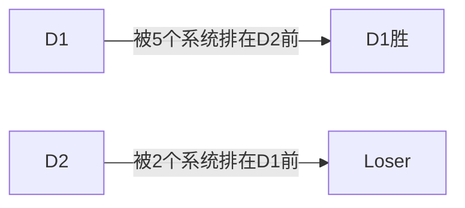
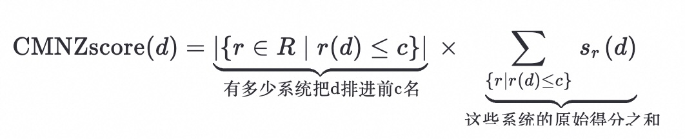
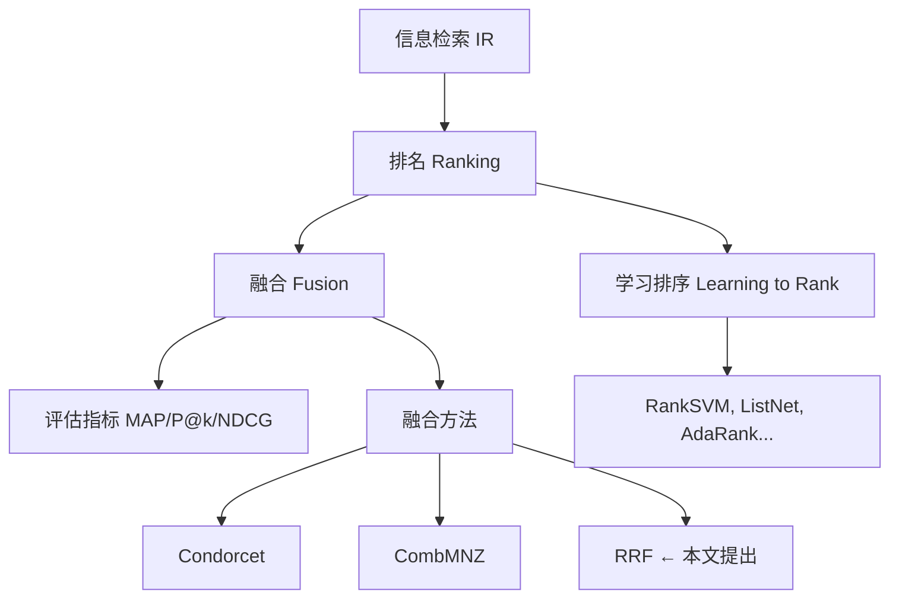
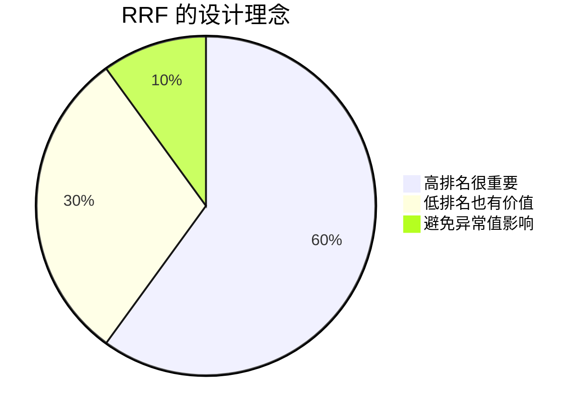
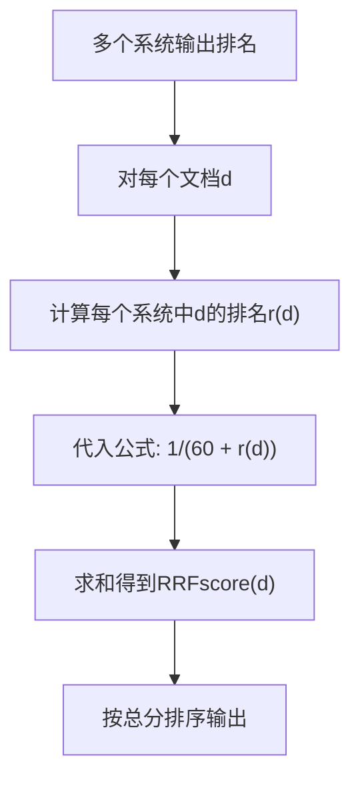
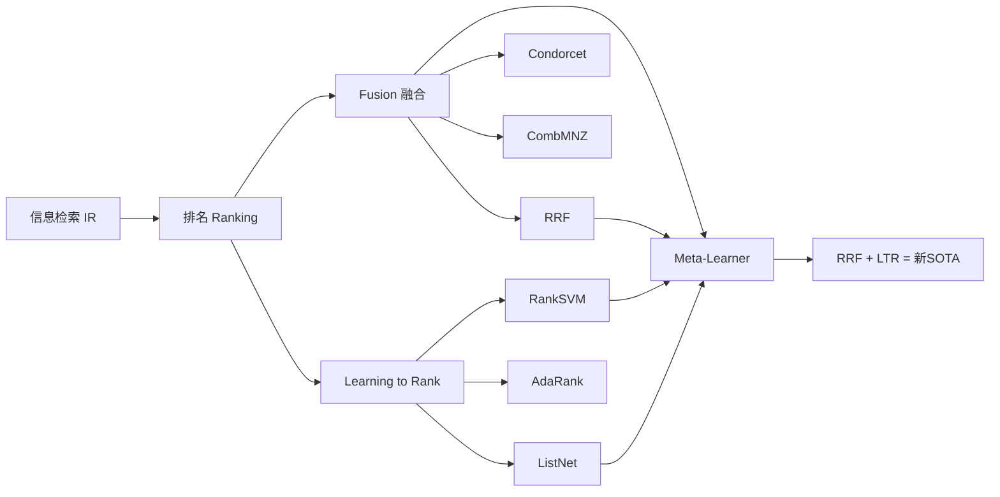

## AI论文解读 | Reciprocal Rank Fusion outperforms Condorcet and individual Rank Learning Methods
        
### 作者        
digoal        
        
### 日期        
2025-07-24       
        
### 标签        
PostgreSQL , PolarDB , DuckDB , AI , 论文解读        
        
----        
        
## 背景  
      
https://plg.uwaterloo.ca/~gvcormac/cormacksigir09-rrf.pdf        
  
提示:        
```        
三个问题:  
  
1、读懂这篇论文需要提前掌握哪些基础知识, 请使用中文通熟易懂的讲解这些基础知识, 可以引用论文中的图、表或使用Markdown支持的图形(text,mermaid等)增加解释性.  
  
2、使用中文通熟易懂的解读这篇论文, 关键内容请深入讲解, 可以引用论文中的图、表或使用Markdown支持的图形(text,mermaid等)增加解释性.  
  
3、使用中文提取这篇论文中的重要术语并详细解释, 可以引用论文中的图、表或使用Markdown支持的图形(text,mermaid等)增加解释性.      
```     

## 论文解读

### **1. 读懂这篇论文需要提前掌握哪些基础知识**

要理解这篇关于 **Reciprocal Rank Fusion (RRF)** 的论文，你需要掌握以下几个基础概念。我会用通俗易懂的方式解释，并结合论文内容帮助你理解。
  
PS: RRF的算法和模型对召回的“Context precision”评分算法有点异曲同工, 参考: [《为什么用了RAG, 我的AI还是笨得跟猪一样! RAG效果评测与优化》](../202504/20250414_04.md)  
  
#### **1.1 信息检索（Information Retrieval, IR）**
这是搜索引擎的核心技术。简单来说，就是：  
当你输入一个查询（比如“如何学习AI”），系统会从大量文档中找出最相关的那些，并按相关性排序返回给你。

- **目标**：让最相关的文档排在前面。
- **挑战**：不同系统对“相关”的判断可能不同。

📌 举例：Google、百度都是信息检索系统。


#### **1.2 排名（Ranking）与评分（Scoring）**
每个文档会被打分，然后根据分数从高到低排序。这个顺序就是“排名”。

| 文档 | 相关性分数 | 排名 |
|------|------------|------|
| D1   | 0.95       | 1    |
| D2   | 0.87       | 2    |
| D3   | 0.63       | 3    |

- 排名越靠前（数字越小），说明系统认为它越相关。
- 不同系统的打分方式不同（有的用TF-IDF，有的用神经网络），所以分数不能直接比较。

✅ 论文中的关键点：RRF 只看“排名”，不看“原始分数”，这样就能公平地融合多个系统的结果。


#### **1.3 融合（Fusion / Aggregation）**
多个搜索引擎对同一查询给出不同的结果列表。我们可以把它们“融合”起来，得到一个更好的综合排名。

🔍 为什么融合有用？
- A系统擅长找新闻
- B系统擅长找学术文章
- C系统擅长找图片

👉 把三者结果融合，可能比任何一个单独系统都好！

📌 论文目标：提出一种简单但强大的融合方法 —— RRF。


#### **1.4 评估指标：MAP、P@k、NDCG**
怎么判断哪个系统更好？需要用量化指标。

##### **MAP（Mean Average Precision，平均准确率均值）**
- 衡量整体排序质量。
- 对每个查询计算“平均精度”（AP），再取所有查询的平均值。
- 值越高越好，范围是 0～1。

📌 论文中所有表格（如 Table 2、3）都用 MAP 来比较性能。

##### **P@k（Precision at k）**
前 k 个结果中有多少是相关的？

例如 P@5 = 0.8 表示前5个结果中有4个是相关的。

##### **NDCG（Normalized Discounted Cumulative Gain）**
考虑了相关程度（比如“完全相关”、“部分相关”）和位置衰减（越靠后，权重越低）。

🧠 小知识：位置越靠前越重要。第1名的影响远大于第10名。


#### **1.5 学习排序（Learning to Rank, LTR）**
让机器学习模型自动学会如何给文档打分排序。

常见方法：
- **RankSVM**：用支持向量机做排序
- **ListNet**：用神经网络优化整个列表
- **AdaRank**：基于 boosting 的排序算法

📌 论文提到这些方法作为对比基准（见 Table 3）。


#### **1.6 Condorcet Fusion 与 CombMNZ（已有融合方法）**

##### **Condorcet Fusion**
思想来自投票理论：两两比较文档，谁被更多系统排在前面，谁就赢。



最终形成一个总排名。但它需要做 O(n²) 次比较，计算量大。

📌 论文指出 RRF 比它更简单有效。

##### **CombMNZ**
公式如下（来自论文）：

  `$$\text{CMNZscore}(d) = \underbrace{\left|\{r \in R \mid r(d) \leq c\}\right|}_{\text{有多少系统把d排进前c名}} \times \underbrace{\sum_{\{r \mid r(d)\leq c\}} s_r(d)}_{\text{这些系统的原始得分之和}}$$`

⚠️ 问题：依赖原始得分 $s_r(d)$，而不同系统的得分尺度不同，难以公平融合。


### **总结：基础知识图谱**



掌握以上知识后，就可以深入理解这篇论文了。


## **2. 使用中文通俗解读这篇论文**

我们来一步步拆解这篇论文的核心思想。


### **2.1 论文要解决什么问题？**

> 如何把多个信息检索系统的排名结果有效地融合在一起，得到一个比任何一个单独系统都强的“超级系统”？

🎯 目标：不依赖训练数据（无监督）、简单、高效、效果好。


### **2.2 作者提出了什么新方法？—— RRF（Reciprocal Rank Fusion）**

#### **核心思想：越靠前的文档越重要，但不能忽略后面的文档**

我们来看 RRF 的打分公式（论文第1节）：

$$\text{RRFscore}(d) = \sum_{r \in R} \frac{1}{k + r(d)}$$

其中：
- $d$ ：某个文档
- $r(d)$ ：在第 $r$ 个系统中的排名（1表示第1名）
- $k$ ：调节参数（论文中设为60）
- $R$ ：所有参与融合的系统集合


#### **举个例子 🌰**

假设我们有 3 个搜索引擎对文档 D 的排名如下：

| 系统 | 排名 $r(d)$ | $\frac{1}{60 + r(d)}$ |
|------|----------------|----------------------------|
| A    | 1              | 1/61 ≈ 0.0164             |
| B    | 3              | 1/63 ≈ 0.0159             |
| C    | 10             | 1/70 ≈ 0.0143             |
|      | **总分**       | **≈ 0.0466**               |

👉 总分越高，说明整体排名越靠前，应该排在最终结果的前面。


#### **为什么加个 k=60？**

如果不加 k，比如用 $\frac{1}{r(d)}$，会出现极端情况：

| 排名 | 分数（1/r） |
|------|------------|
| 1    | 1.0        |
| 2    | 0.5        |
| 3    | 0.33       |
| 10   | 0.1        |

➡️ 第1名得分是第2名的2倍！太敏感了！

加上 k=60 后：

| 排名 | 分数（1/(60+r)） |
|------|------------------|
| 1    | 0.0164           |
| 2    | 0.0161           |
| 3    | 0.0159           |
| 10   | 0.0143           |

➡️ 差异变小，更平滑，避免个别系统“刷榜”。


#### **直观理解 RRF 的优势**



- 不像指数函数那样“只关注前几名”
- 不像平均排名那样“忽视头部优势”
- 是一种“温和加权”的融合策略


### **2.3 实验验证：RRF 到底好不好？**

作者做了三类实验：

#### ✅ 实验1：Wumpus 系统在 TREC 数据集上的融合（Table 1）

| k 值 | MAP  |
|------|------|
| 0    | 0.2072 |
| 10   | 0.2123 |
| ...  | ...  |
| 60   | **0.2145** ✅ |
| 100  | 0.2142 |
| 500  | 0.2098 |

➡️ k=60 接近最优，且对结果影响不大 → 参数鲁棒！


#### ✅ 实验2：TREC 提交结果的融合（Table 2）—— 更真实场景

| 方法           | TREC Robust | TREC 3 | TREC 5 | TREC 9 |
|----------------|-------------|--------|--------|--------|
| RRF            | **0.3686**  | **0.4350** | **0.3394** | **0.2830** |
| Best Individual| 0.3586      | 0.4226 | 0.3165 | 0.3519\* |
| Condorcet      | 0.3652      | 0.4256 | 0.3213 | 0.2750 |
| CombMNZ        | 0.3575      | 0.4381 | 0.3237 | 0.2671 |

> 注：TREC 9 的“最佳个体”是人工参与的结果（\*），不算纯自动系统。

📌 **结论**：
- RRF 在 3/4 个任务中超过所有方法
- 即使在 TREC 3 输给 CombMNZ，在其他任务也赢了
- 平均提升 **4%~5%**


#### ✅ 实验3：LETOR 3 数据集上的学习排序融合（Table 3）—— 最强对比

| 方法           | MAP     | RRF 超出量 | 显著性（p值） |
|----------------|---------|-----------|---------------|
| RRF            | **0.6051** | —         | —             |
| Condorcet      | 0.5917  | +0.0134   | p=0.004 ✅     |
| CombMNZ        | 0.6107  | -0.0056   | p=0.2 ❌       |
| ListNet        | 0.5846  | +0.0205   | p=0.001 ✅     |
| RankSVM        | 0.5737  | +0.0314   | p=0.000 ✅     |

📌 **惊人发现**：
- RRF 融合多个学习排序模型，效果超过了任何一个单独模型！
- 这相当于构建了一个“元学习器”（meta-learner）
- 虽然 CombMNZ 略高，但差异不显著（p=0.2）

> 💡 作者说：“据我们所知，没有已发表的方法能超过这个融合结果。”


### **2.4 为什么 RRF 能赢？—— 深入分析**

论文在第2节讨论了原因：

#### 🔍 对比 Condorcet
- Condorcet 是“多数决”：只要多数系统认为 A > B，就成立。
- 但忽略了“强偏好” vs “弱偏好”。
- 举例：5个系统轻轻把A排前面，2个系统强烈认为A是第一名 → RRF 更能体现这种“亮点”。

#### 🔍 对比 CombMNZ
- CombMNZ 依赖原始得分，而不同系统的得分没有可比性。
- 有些系统天生打分高，容易“刷分”。
- RRF 只用排名，更公平、更稳定。


### **2.5 RRF 的优点总结**

| 特性 | 说明 |
|------|------|
| 🟢 无监督 | 不需要训练数据，直接融合排名 |
| 🟢 简单 | 一行公式搞定，易于实现 |
| 🟢 高效 | 可逐个系统累加，内存友好 |
| 🟢 鲁棒 | 参数 k 不敏感，结果稳定 |
| 🟢 通用 | 能融合任何排名系统（包括学习排序） |


## **3. 重要术语详解**

下面列出论文中的关键术语并详细解释。


### **3.1 Reciprocal Rank Fusion (RRF)**
> **中文**：倒数排名融合

#### **定义**
一种基于文档排名位置的融合方法，使用以下公式计算综合得分：

$$
\text{RRFscore}(d) = \sum_{r \in R} \frac{1}{k + r(d)}, \quad k=60
$$

#### **特点**
- “倒数”意味着排名越靠前（r越小），得分越高
- 加上 k 是为了防止头部排名过于主导
- 所有系统平等对待，无需校准得分

#### **流程图**




### **3.2 Condorcet Fusion**
> **中文**：孔多塞融合

#### **来源**
源自社会选择理论中的“孔多塞赢家”：能在两两对决中击败所有对手的候选人。

#### **在IR中的应用**
- 对每对文档 (d1, d2)，统计有多少系统认为 d1 比 d2 更相关
- 如果多数系统认为 d1 > d2，则 d1 排在前面
- 最终形成一个全局排序

#### **缺点**
- 计算复杂（O(n²) 比较）
- 忽视偏好强度
- 可能出现“投票悖论”（无稳定排序）


### **3.3 CombMNZ**
> **中文**：带归一化的组合得分法（Combination with Minimum Normalization and Zero）

#### **公式回顾**

$$
\text{CMNZscore}(d) = \text{count}(r(d) \leq c) \times \sum_{r(d) \leq c} s_r(d)
$$

#### **含义**
- 第一部分：有多少系统将 d 排进前 c 名（比如前10名）
- 第二部分：这些系统给 d 的原始得分之和
- 相当于“受欢迎程度 × 总体支持度”

#### **问题**
- 依赖原始得分 $s_r(d)$，而不同系统的得分不可比
- 某些系统得分偏高会“霸榜”
- 实验显示方差大，不稳定


### **3.4 Learning to Rank (LTR)**
> **中文**：学习排序

#### **定义**
使用机器学习模型，从标注数据中学习如何为文档打分排序。

#### **常见方法**
| 方法 | 原理简述 |
|------|---------|
| RankSVM | 将排序转化为分类问题，用SVM训练 |
| ListNet | 直接优化整个排序列表的概率分布 |
| AdaRank | 类似AdaBoost，迭代提升排序性能 |

#### **与RRF的关系**
- RRF 可以融合多个 LTR 模型的结果
- 实验表明：融合后的性能 > 任一单独模型


### **3.5 MAP（Mean Average Precision）**
> **中文**：平均准确率均值

#### **计算步骤**
1. 对每个查询计算 AP（Average Precision）：
   $$AP = \frac{\sum_{i=1}^n \text{rel}(i)/i}{\text{总相关文档数}}$$
   其中 rel(i)=1 表示第 i 个结果相关
2. 对所有查询取平均 → MAP

#### **意义**
- 综合反映排序质量和覆盖率
- 是 TREC 等评测的标准指标


### **3.6 Meta-Learner（元学习器）**
> **中文**：元学习器

#### **定义**
不是直接学习排序，而是通过融合多个基础学习器的结果，构建一个更强的整体模型。

#### **本文中的体现**
- 将多个 LTR 模型（如 RankSVM、ListNet）的结果用 RRF 融合
- 得到的新排序器性能超过所有基础模型
- 成为 LETOR 3 数据集上的新 SOTA（State-of-the-Art）


### **术语关系图**




### ✅ 总结

这篇论文的贡献可以概括为：

> **提出了一种极其简单但异常有效的融合方法 RRF，它无需训练、不依赖得分、计算高效，在多个任务上超越了复杂的学习排序模型和传统融合方法，成为新的“元学习”标杆。**

🎯 启示：
- 有时候，“简单”比“复杂”更强大
- 融合多样性是提升性能的关键
- 排名本身蕴含丰富信息，值得深入挖掘

 

如果你正在做搜索、推荐或排序系统，**RRF 是一个必须尝试的 baseline 方法**。
  
## 参考        
         
https://plg.uwaterloo.ca/~gvcormac/cormacksigir09-rrf.pdf  
    
<b> 以上内容基于DeepSeek、Qwen、Gemini及诸多AI生成, 轻微人工调整, 感谢杭州深度求索人工智能、阿里云、Google等公司. </b>        
        
<b> AI 生成的内容请自行辨别正确性, 当然也多了些许踩坑的乐趣, 毕竟冒险是每个男人的天性.  </b>        
    
  
  
#### [期望 PostgreSQL|开源PolarDB 增加什么功能?](https://github.com/digoal/blog/issues/76 "269ac3d1c492e938c0191101c7238216")
  
  
#### [PolarDB 开源数据库](https://openpolardb.com/home "57258f76c37864c6e6d23383d05714ea")
  
  
#### [PolarDB 学习图谱](https://www.aliyun.com/database/openpolardb/activity "8642f60e04ed0c814bf9cb9677976bd4")
  
  
#### [PostgreSQL 解决方案集合](../201706/20170601_02.md "40cff096e9ed7122c512b35d8561d9c8")
  
  
#### [德哥 / digoal's Github - 公益是一辈子的事.](https://github.com/digoal/blog/blob/master/README.md "22709685feb7cab07d30f30387f0a9ae")
  
  
#### [About 德哥](https://github.com/digoal/blog/blob/master/me/readme.md "a37735981e7704886ffd590565582dd0")
  
  

  
