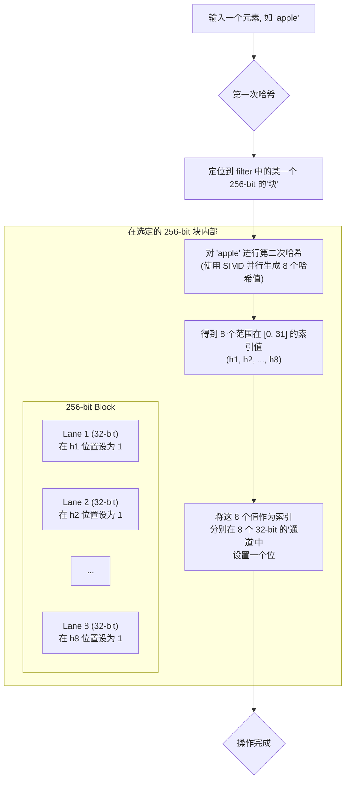

## AI论文解读 | Split block Bloom filters
        
### 作者        
digoal        
        
### 日期        
2025-07-25       
        
### 标签        
PostgreSQL , PolarDB , DuckDB , AI , 论文解读        
        
----        
        
## 背景  
      
https://arxiv.org/pdf/2101.01719        
  
提示:        
```        
三个问题:  
  
1、读懂这篇论文需要提前掌握哪些基础知识, 请使用中文通熟易懂的讲解这些基础知识, 可以引用论文中的图、表或使用Markdown支持的图形(text,mermaid等)增加解释性.  
  
2、使用中文通熟易懂的解读这篇论文, 关键内容需深入讲解, 可以引用论文中的图、表或使用Markdown支持的图形(text,mermaid等)增加解释性.  
  
3、使用中文提取这篇论文中的重要术语并详细解释, 可以引用论文中的图、表或使用Markdown支持的图形(text,mermaid等)增加解释性.      
```     

## 论文解读
  
好的，我们来分步解析这篇关于“分割块布隆过滤器”（Split Block Bloom filters）的论文。

### 1\. 读懂论文所需的基础知识

要完全理解这篇论文，您需要对以下几个核心概念有所了解。我会用通俗易懂的语言并结合图示来解释。

#### **基础知识一：布隆过滤器 (Bloom Filter)**

布隆过滤器是一种非常节省空间的数据结构，它用于判断一个元素**是否可能存在**于一个集合中。它的特点是：

  * 如果它判断某个元素**不存在**，那么该元素**一定不存在**。
  * 如果它判断某个元素**存在**，那么该元素**可能存在**，但也有小概率是误判（即“假阳性”）。
  * 它不支持删除元素 。

**工作原理：**
想象有一个很长的二进制数组（所有位都初始化为0）和几个不同的哈希函数。

1.  **添加元素 (Insertion):** 当你向过滤器中添加一个元素（例如，字符串 "apple"）时，你会用所有的哈希函数分别计算它的哈希值。每个哈希值都会对应数组中的一个位置，然后将这些位置的二进制位从 0 改为 1。

2.  **查询元素 (Query):** 当你查询一个元素（例如，字符串 "pear"）是否存在时，你同样用所有哈希函数计算它的哈希值，并查看数组中对应位置的二进制位。

      * 如果**所有**位置上的位都是 1，那么过滤器就认为 "pear" **可能存在**。
      * 如果**任何一个**位置上的位是 0，那么过滤器就断定 "pear" **一定不存在**。

**图示：**
下面是一个简单的文本图，展示了布隆过滤器的工作流程。

```text
假设我们有 3 个哈希函数 (h1, h2, h3) 和一个 12 位的数组。

初始状态:
数组: [0, 0, 0, 0, 0, 0, 0, 0, 0, 0, 0, 0]

1. 添加 "apple":
   h1("apple") -> 2
   h2("apple") -> 6
   h3("apple") -> 9
   将位置 2, 6, 9 的位设为 1。
数组: [0, 0, 1, 0, 0, 0, 1, 0, 0, 1, 0, 0]

2. 添加 "orange":
   h1("orange") -> 4
   h2("orange") -> 6  (与 "apple" 的 h2 冲突)
   h3("orange") -> 11
   将位置 4, 6, 11 的位设为 1。
数组: [0, 0, 1, 0, 1, 0, 1, 0, 0, 1, 0, 1]

3. 查询 "apple":
   h1("apple") -> 2 (位是 1)
   h2("apple") -> 6 (位是 1)
   h3("apple") -> 9 (位是 1)
   结论: "apple" 可能存在 (实际上也确实存在)。

4. 查询 "pear":
   h1("pear") -> 1
   h2("pear") -> 7
   h3("pear") -> 9
   检查位置 1, 7, 9 的位。发现位置 1 和 7 的位是 0。
   结论: "pear" 一定不存在。
```

#### **基础知识二：假阳性率 ( $\\epsilon$ ) (False Positive Probability)**

这是衡量布隆过滤器准确性的关键指标。它指的是：**当查询一个本不存在于集合中的元素时，过滤器错误地判断其存在的概率** 。在上面的例子中，如果有一个新元素 "grape" 的三个哈希值恰好都指向了已经被其他元素设置为 1 的位置，那么查询 "grape" 就会得到“可能存在”的错误结论，这就是一次假阳性。

在传统布隆过滤器中，为了降低假阳性率 $\\epsilon$，通常需要增加哈希函数的数量或者增加二进制数组的长度，这会导致计算成本（操作耗时）增加 。

#### **基础知识三：CPU 缓存行 (Cache Line)**

CPU 为了加快数据读取速度，并不会一个字节一个字节地从内存读取数据，而是一次性读取一小块连续的内存到自己的高速缓存（Cache）中。这一小块数据就被称为一个“缓存行”。访问已经加载到缓存行内的数据会非常快，而如果需要的数据不在当前缓存行内，CPU 就需要去访问主内存，速度会慢几个数量级。这篇论文中提到的“块布隆过滤器”就是为了优化缓存行利用率而设计的 。

#### **基础知识四：单指令多数据流 (SIMD - Single Instruction, Multiple Data)**

SIMD 是一种并行计算技术，允许 CPU 用**一条指令**同时对**多个数据**执行相同的操作 。想象一下，你需要给 8 个不同的数字分别加 1。普通 CPU 可能需要执行 8 次加法指令，而支持 SIMD 的 CPU 可以用一条指令同时完成这 8 次加法。这篇论文巧妙地利用了 SIMD 技术，通过一次性执行 8 个哈希计算，极大地提升了处理速度 。

### 2\. 论文核心内容解读

这篇论文提出了一种名为**分割块布隆过滤器 (Split Block Bloom Filter, SBBF)** 的新型过滤器。它的核心目标是：创建一个查询和插入操作都极快（专业术语叫 $O(1)$ 复杂度）的过滤器，即使这意味着要牺牲一点准确性（即假阳性率更高）。

#### **论文要解决的问题**

传统的布隆过滤器、Cuckoo Filter 等近似成员查询结构，其操作性能（耗时）会受到假阳性率 $\\epsilon$ 的影响 。简单来说，你追求的准确率越高（ $\\epsilon$ 越小），需要计算的哈希函数就越多，或者数据结构内部的查找就越复杂，从而导致速度变慢 。这对于需要极高性能的系统（如大数据查询引擎 Apache Impala）来说是个瓶颈 。

#### **SBBF 的三大核心思想**

论文作者巧妙地结合了三个技术点来解决上述问题 ：

1.  **使用“块”布隆过滤器 (Block Bloom filters):** 首先，它将整个过滤器内存空间划分为许多个固定大小的“块”（Block），例如每个块 256 比特 。当要处理一个元素时，先用一个哈希函数计算出该元素属于哪个块。之后的所有操作都只在**这一个块**内进行 。这样做的好处是，这个块通常可以被完整地加载到一个 CPU 缓存行中，避免了多次访问主内存，从而大大提升了速度 。

2.  **在块内进行“分割” (Split):** 这是最关键的创新。一个 256 比特的块被进一步“分割”成 8 个连续的 32 比特的小区域（论文中称为“通道”或“lane”）。传统的布隆过滤器是在整个块（256比特）中设置多个位，而 SBBF 则是用 8 个不同的哈希函数，在**每个** 32 比特的小区域内**各自设置一个位** 。

3.  **利用 SIMD 进行并行计算:** 选择将块分为 8 个区域并使用 8 个哈希函数并非偶然 。这是为了完美匹配现代 CPU 的 SIMD 指令集 。CPU 可以用一条 SIMD 指令，并行地计算出这 8 个哈希值，然后用另一条 SIMD 指令，并行地在 8 个区域中设置对应的位。这使得整个过程快如闪电。

#### **SBBF 工作流程图解**

下面这张图解释了 SBBF 的插入和查询过程：



  * **插入 (Insert):** 遵循上述流程，将 8 个通道中对应位置的位设为 1 。
  * **查询 (Lookup):** 过程完全一样，只不过最后一步是**检查**这 8 个位置的位是否**全部**为 1。如果是，则判断元素可能存在；只要有一个不为 1，则判断元素一定不存在 。

#### **性能与权衡 (Trade-offs)**

SBBF 并非完美，它是一种典型的用精度换速度的方案。

  * **优点：极高的速度。** 从论文提供的性能对比表中可以看到 ，在处理千万甚至上亿级别的数据时，SBBF 的插入和查询速度（以 M/s，即每秒百万次操作计）远超性能已经很优秀的 Cuckoo Filter。这是因为它 O(1) 的复杂度和对 CPU 缓存及 SIMD 的极致利用。

| 数据量 | SBBF 插入速度 (M/s) | Cuckoo 插入速度 (M/s) | SBBF 查询速度 (M/s) | Cuckoo 查询速度 (M/s) |
| :--- | :--- | :--- | :--- | :--- |
| 10万 | 416 | 71 | 400 | 281 |
| 100万 | 182 | 33 | 186 | 139 |
| 1亿 | 32 | 14 | 43 | 23 |

  * **缺点：更高的假阳性率和有限的适用范围。**
      * 为了获得速度，SBBF 的空间效率不如标准布隆过滤器。在占用相同内存空间的情况下，SBBF 的假阳性率比标准布隆过滤器要高，最高可能达到其两倍 。
      * 它只在一个特定的假阳性率区间内（大约 0.4% 到 19%）表现良好 。对于要求假阳性率低于 0.4% 的高精度场景，SBBF 并不适合 。

#### **结论与应用**

SBBF 是一种为特定场景设计的、高度优化的过滤器。它适用于那些**性能至上**、可以容忍一定假阳性率（例如在 1% 左右）的应用场景 。由于其出色的性能，它已经被 Apache Impala, StarRocks, Apache Arrow 等多个知名大数据项目中采用 。

### 3\. 论文重要术语解释

以下是论文中出现的几个关键术语的中文解释。

1.  **近似成员查询 (Approximate Membership Query - AMQ)**

      * **解释:** 这是一类数据结构的总称，用于快速判断一个元素是否属于一个集合，但允许有一定概率的错误 。布隆过滤器、Cuckoo Filter、Quotient Filter 以及本篇论文的 SBBF 都属于 AMQ 结构。它们的核心价值在于用远小于存储所有元素的空间，来提供高速的查询功能。

2.  **分割块布隆过滤器 (Split Block Bloom Filter - SBBF)**

      * **解释:** 这是本论文提出的核心数据结构 。其关键特征是结合了“分块”（Block）以优化缓存和“分割”（Split）以利用 SIMD 并行计算。
      * **图解:**
        ```text
        一个 SBBF 过滤器
        -----------------------------------------------------
        | Block 1 (256-bit) | Block 2 (256-bit) | ... | Block N |
        -----------------------------------------------------
             |
             V
        一个被选中的 Block (256-bit) 的内部结构
        -----------------------------------------------------------------
        | Lane 1 (32-bit) | Lane 2 (32-bit) | ... | Lane 8 (32-bit) |
        -----------------------------------------------------------------
        // 插入或查询时，在每个 Lane 中只操作一个 bit。
        ```

3.  **假阳性率 ($\\epsilon$, epsilon)**

      * **解释:** 指的是过滤器错误地将一个**不存在**的元素判断为**存在**的概率 。这是评估所有 AMQ 结构性能的核心指标之一。SBBF 的一个重要特点是，它的操作时间复杂度与 $\\epsilon$ 无关，这是一个与传统布隆过滤器的显著区别 。

4.  **$O(1)$ 复杂度**

      * **解释:** 在算法分析中，这表示一个操作的执行时间是**常数级别**的，不会随着数据总量的增加而增加。论文指出 SBBF 的所有操作（插入、查询）都实现了 $O(1)$ 的最坏情况复杂度 。这意味着无论过滤器里存了多少元素，处理一个新元素的速度都是一样快。这是通过单次哈希定位块，以及固定的 8 次 SIMD 哈希操作来实现的。

5.  **通用哈希 (Universal Hashing)**

      * **解释:** 这是一种从一个哈希函数集合中随机选择哈希函数的方法，目的是为了让不同键值之间发生哈希碰撞的概率尽可能小。论文中提到了它使用的一种具体实现，叫做“乘法-移位通用哈希” (multiply-shift universal hashing)，来高效地生成哈希值 。
  
## 参考        
         
https://arxiv.org/pdf/2101.01719  
    
<b> 以上内容基于DeepSeek、Qwen、Gemini及诸多AI生成, 轻微人工调整, 感谢杭州深度求索人工智能、阿里云、Google等公司. </b>        
        
<b> AI 生成的内容请自行辨别正确性, 当然也多了些许踩坑的乐趣, 毕竟冒险是每个男人的天性.  </b>        
    
  
  
#### [期望 PostgreSQL|开源PolarDB 增加什么功能?](https://github.com/digoal/blog/issues/76 "269ac3d1c492e938c0191101c7238216")
  
  
#### [PolarDB 开源数据库](https://openpolardb.com/home "57258f76c37864c6e6d23383d05714ea")
  
  
#### [PolarDB 学习图谱](https://www.aliyun.com/database/openpolardb/activity "8642f60e04ed0c814bf9cb9677976bd4")
  
  
#### [PostgreSQL 解决方案集合](../201706/20170601_02.md "40cff096e9ed7122c512b35d8561d9c8")
  
  
#### [德哥 / digoal's Github - 公益是一辈子的事.](https://github.com/digoal/blog/blob/master/README.md "22709685feb7cab07d30f30387f0a9ae")
  
  
#### [About 德哥](https://github.com/digoal/blog/blob/master/me/readme.md "a37735981e7704886ffd590565582dd0")
  
  

  
