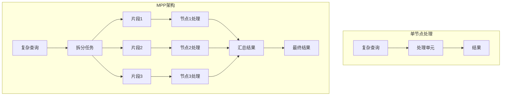
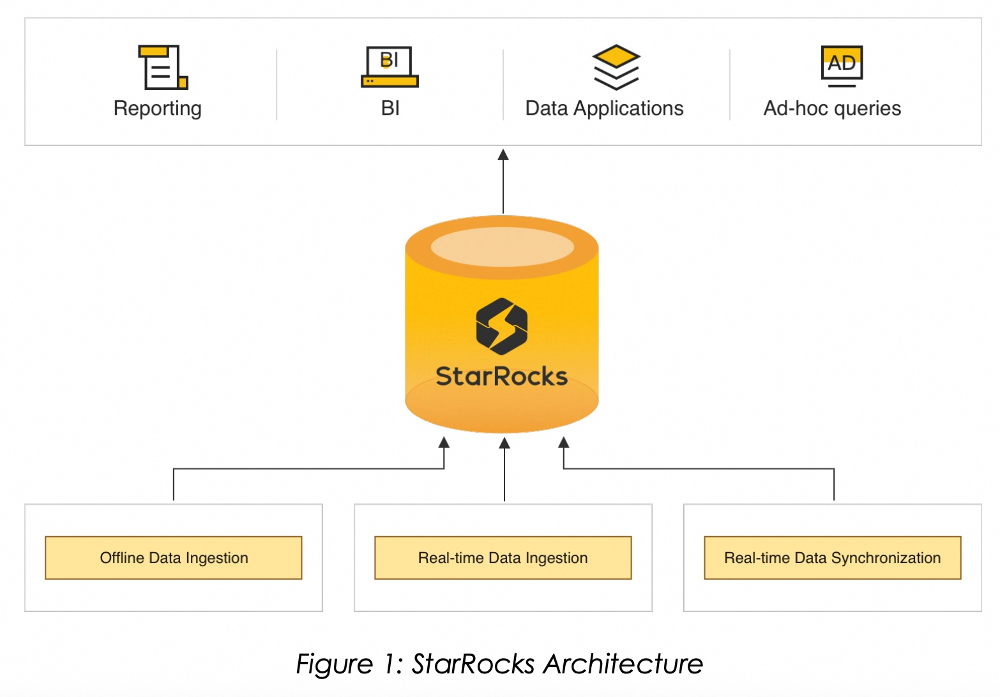

## AI论文解读 | StarRocks The new kid on the real-time analytical databases block
        
### 作者        
digoal        
        
### 日期        
2025-07-25       
        
### 标签        
PostgreSQL , PolarDB , DuckDB , AI , 论文解读        
        
----        
        
## 背景  
      
https://celerdata.com/hubfs/StarRocks_May2022/StarRocks%20-%20The%20New%20Kid%20on%20the%20Real%20Time%20Analytical%20Databases%20Block.pdf?hsLang=en        
  
提示:        
```        
三个问题:  
  
1、读懂这篇论文需要提前掌握哪些基础知识, 请使用中文通熟易懂的讲解这些基础知识, 可以引用论文中的图、表或使用Markdown支持的图形(text,mermaid等)增加解释性.  
  
2、使用中文通熟易懂的解读这篇论文, 关键内容需深入讲解, 可以引用论文中的图、表或使用Markdown支持的图形(text,mermaid等)增加解释性.  
  
3、使用中文提取这篇论文中的重要术语并详细解释, 可以引用论文中的图、表或使用Markdown支持的图形(text,mermaid等)增加解释性.  
```   
  
注意, 这篇不是论文, 用了同样的提示词解读.  
  
## 论文解读
  
好的，我们来逐一解答您提出的三个问题。

### 1\. 读懂论文需要的基础知识

要完全理解这篇关于StarRocks的论文，您需要对现代数据分析领域的一些核心概念有所了解。以下将用通俗易懂的方式为您讲解这些基础知识。

#### **数据仓库 (Data Warehouse) 与数据库 (Database)**

  * **数据库 (Database):** 通常指的是**操作型数据库 (OLTP - On-Line Transactional Processing)**，比如您在购物网站下订单时，系统需要快速地记录这笔交易。它的特点是：快速的“增、删、改、查”单条或少量数据。
  * **数据仓库 (Data Warehouse):** 主要用于**分析型场景 (OLAP - On-Line Analytical Processing)**。它存储了海量的历史数据，用于回答复杂的商业问题，例如“本季度哪个产品的销量增长最快？”。它的特点是：一次性读取和分析大量数据，对复杂的查询（如聚合、分组）有很好的性能。 

StarRocks就是一个**分析型数据库**，专为OLAP场景设计。

#### **MPP (Massively Parallel Processing) - 大规模并行处理**

想象一下，一项巨大的工程（一个复杂的查询）如果只由一个人（一个CPU核心）来做会非常慢。MPP架构就像是把这个工程拆分成许多小任务，然后分发给成百上千个工人（多个服务器节点或CPU核心）同时进行，最后再把结果汇总起来。  这样一来，处理速度就大大加快了。StarRocks正是采用了MPP架构，使其能够并行处理查询，实现高性能。 



#### **列式存储 (Columnar Storage)**

传统的数据库（行式存储）将一行数据的所有字段连续存放在一起，像Excel表格一样。而列式存储则是将同一列的数据存放在一起。

  * **行式存储:**
    `张三, 25, 北京`
    `李四, 30, 上海`
  * **列式存储:**
    `张三, 李四` (姓名列)
    `25, 30` (年龄列)
    `北京, 上海` (城市列)

**优势:** 在数据分析时，我们往往只关心某些特定列（例如，只统计所有用户的年龄），列式存储只需要读取“年龄”这一列的数据，而无需加载姓名、城市等无关列，从而大大减少了磁盘I/O，提升了查询速度。  StarRocks就是一个列式数据库。 

#### **数据模型：星型模型 vs 反规范化**

数据分析时，如何组织数据表结构会极大影响查询性能。

  * **星型模型 (Star Schema):** 这是传统数据仓库的经典模型。它有一个中心的“事实表”（Fact Table），存储着要分析的核心数据（如销售额、数量）；周围环绕着多个“维度表”（Dimension Tables），存储着描述事实的背景信息（如时间、产品、地点）。  它们通过ID关联起来，查询时需要进行多表连接（Join）。

    ```mermaid
    graph TD
        Fact(事实表: 销售记录)
        Dim1(维度表: 时间)
        Dim2(维度表: 产品)
        Dim3(维度表: 地区)

        Fact -- 包含时间ID --> Dim1
        Fact -- 包含产品ID --> Dim2
        Fact -- 包含地区ID --> Dim3
    ```

  * **反规范化 / 大宽表 (Denormalized):** 为了避免星型模型中耗时的多表连接操作，一种常见的优化方法是把所有需要的信息都预先合并到一张巨大的“宽表”里。  这样查询时只需扫描一张表，速度很快。但缺点是数据冗余度高，更新其中任何一个维度的数据都很麻烦和复杂。 

这篇论文的一个关键点是，很多分析型数据库只对其中一种模型有较好的优化，而**StarRocks能够同时高效地支持星型模型和反规范化的大宽表**。 

#### **向量化执行引擎 (Vectorized Execution Engine)**

传统的数据库查询执行引擎是一次处理一行数据 (row-at-a-time)，就像一个一个地处理。而向量化执行引擎则是一次性处理一批数据 (batch-at-a-time)。  这极大地减少了函数调用开销，并能更好地利用现代CPU的SIMD（单指令多数据）特性，用一条指令同时对多个数据进行运算，从而大幅提升计算效率。  StarRocks的引擎是完全向量化的，这意味着从数据导入到计算的各个环节都采用了这种高效的处理方式。 

-----

### 2\. 论文核心内容解读

这篇由CelerData发布的白皮书，旨在介绍一款名为StarRocks的新兴实时分析型数据库。  它详细阐述了StarRocks的技术特性、优势以及它如何解决当前数据分析领域面临的挑战。

#### **核心问题与StarRocks的定位**

  * **面临的挑战:** 现代企业需要从传统的“批量报表”模式转向“实时决策”，要求能以极低的延迟（秒级甚至亚秒级）和在高并发（成千上万的用户同时查询）的情况下，对最新鲜的数据进行分析。  现有的很多解决方案，要么为了性能牺牲了数据更新的灵活性（如仅支持追加写入），要么在处理复杂查询时性能不佳。 

  * **StarRocks的定位:** StarRocks是一款采用MPP架构的列式分析数据库，它通过自研的查询引擎和优化器，旨在提供一个能够在PB级数据上实现亚秒级响应、支持高并发查询的统一分析平台。  如下图所示，它能够接入离线、实时等多种数据源，并支撑上层的报表、BI、数据应用等多种分析场景。    

    *图1: StarRocks架构图*

#### **StarRocks的关键特性与优势**

论文从多个维度深入分析了StarRocks的与众不同之处：

1.  **灵活的数据模型支持:** 这是StarRocks的一大亮点。传统数仓（如Teradata）擅长星型模型，而一些新兴的分析引擎（如ClickHouse, Druid）则通过反规范化大宽表来提速。  StarRocks打破了这种“二选一”的困境，它既能高效处理星型/雪花模型的多表Join查询，也支持大宽表模型，甚至还能通过数据虚拟化技术直接查询外部数据源（如HDFS, S3, MySQL, Elastic）中的数据，无需移动数据。 

2.  **强大的实时数据摄入与更新能力:**

      * **实时摄入:** StarRocks提供了多种数据导入工具（如Broker, Routine, Stream loader）来对接Kafka、HDFS等数据源，支持流式和批量数据的高效摄入。 
      * **主键模型与原地更新 (In-place Update):** 这是它与许多其他实时分析数据库（它们通常是不可变的，只能追加数据）的根本区别。  StarRocks支持主键模型，可以根据主键进行原地的“增、删、改”(CRUD)操作。  这样做的好处是，数据始终只有最新的一份，查询时优化器可以放心地将过滤条件（谓词）下推到底层执行，避免了在多个版本数据中查找最新值再进行计算的复杂过程，从而极大地优化了读取性能。 

3.  **极致的查询性能:** StarRocks的性能源于三大支柱：

      * **MPP架构:** 并行处理查询，充分利用集群资源。 
      * **全向量化引擎:** 从数据导入、计算到存储，所有算子都采用向量化实现，最大化CPU效率，避免了不同处理模式间的转换开销。 
      * **全新的基于成本的优化器 (CBO):** 这是查询的大脑。StarRocks的CBO是为其向量化引擎和多表关联查询场景专门定制和优化的，能够生成非常高效的查询执行计划。 

4.  **易用性和生态兼容性:**

      * **MySQL协议兼容:** StarRocks在网络协议和SQL语法层面都与MySQL兼容。  这意味着现有的BI工具（如Tableau）、数据应用和SQL脚本几乎无需修改就能直接连接StarRocks进行分析，极大地降低了迁移和使用成本。 
      * **简化数据管道:** 由于它能很好地支持星型模型，企业不再需要为了性能而强制将所有数据都预处理成一张大宽表，这大大简化了数据开发和维护的复杂性。 

#### **案例分析：爱彼迎 (Airbnb)**

论文以知名公司爱彼迎为例，展示了StarRocks的实际应用效果。  爱彼迎的内部指标平台Minerva最初使用Presto和Druid。  但随着业务发展，他们遇到了挑战：Druid无法很好地支持复杂的SQL查询，而Presto的查询延迟又太高。  在引入StarRocks后，得益于其强大的SQL支持能力和高性能，许多之前需要十分钟才能完成的查询，现在在几秒内就能返回结果。  爱彼迎还将其用于实时欺诈检测等场景。 

#### **总结**

StarRocks通过其独特的**MPP架构、可原地更新的主键模型、全向量化引擎以及对多种数据模型的统一支持**，成功地在一个平台上融合了**低延迟、高并发和实时数据分析**这三大核心能力，为需要进行实时决策的企业提供了一个极具竞争力的解决方案。 

-----

### 3\. 论文重要术语详解

以下是论文中出现的关键技术术语及其详细解释。

  * **MPP (Massively Parallel Processing / 大规模并行处理)**

      * **解释:** 一种计算架构，它将一个复杂的任务（如SQL查询）分解成多个子任务，并将这些子任务分配到多个独立的计算节点上并行执行，最后将结果汇总。 
      * **在文中的意义:** 这是StarRocks实现高性能和高可扩展性的基础。通过MPP架构，StarRocks可以将计算压力分散到整个集群，通过增加节点就能线性地提升处理能力。 

  * **Columnar Database (列式数据库)**

      * **解释:** 一种数据存储方式，它将数据按列而不是按行进行存储。 
      * **在文中的意义:** 对于分析类查询（通常只关心部分列），列式存储可以显著减少需要从磁盘读取的数据量，从而大幅提升查询性能。  StarRocks是一个列式数据库。 

  * **Vectorized Execution Engine (向量化执行引擎)**

      * **解释:** 一种查询处理技术，它以列式数据块（向量）为单位进行计算，而不是一次处理一行。  这种方式可以更好地利用CPU缓存和SIMD（单指令多数据流）指令集，用一条指令完成对多个数据的操作。 
      * **在文中的意义:** 这是StarRocks实现极致性能的核心技术之一。论文特别强调，StarRocks的引擎是“完全向量化”的，意味着从上到下的所有操作都经过了向量化优化，避免了性能瓶颈。 

  * **CBO (Cost-Based Optimizer / 基于成本的优化器)**

      * **解释:** 查询优化器是数据库的“大脑”，负责为一条SQL语句生成最佳的执行计划。CBO会估算不同执行路径（如表的连接顺序、使用何种连接算法等）的“成本”（如CPU、I/O消耗），并选择成本最低的一条路径来执行。
      * **在文中的意义:** StarRocks拥有一个自研的、全新的CBO。  这个CBO是为StarRocks自己的向量化引擎、列式存储和MPP架构量身定制的，尤其在处理复杂的多表连接查询时，能做出非常智能的优化，从而保证高性能。 

  * **Denormalization (反规范化)**

      * **解释:** 一种数据建模技术，为了提升读取性能，通过预先计算和数据冗余，将多个表的数据合并成一张“大宽表”。  这样做可以避免在查询时进行昂贵的Join操作。 
      * **在文中的意义:** 论文指出，像ClickHouse和Druid等数据库严重依赖反规范化来提速，但这会增加数据管道的复杂性和更新难度。  StarRocks的优势在于，它不强制要求反规范化，也能很好地处理规范化的星型模型，给了用户更多的选择。 

  * **CDC (Change Data Capture / 变更数据捕获)**

      * **解释:** 一种用于捕获源数据库中数据变更（增、删、改）的技术。通过CDC，可以将业务数据库的实时变化同步到下游系统（如数据仓库）。
      * **在文中的意义:** StarRocks支持CDC，这使得它能够实时地从MySQL、PostgreSQL等业务数据库中摄取增量数据，并结合其主键模型进行实时更新，从而实现对业务数据的低延迟分析。 

  * **Materialized View (物化视图)**

      * **解释:** 物化视图是一个存储了查询结果的特殊数据库对象。它与普通视图（只是一个存储的查询定义）不同，物化视图将结果“物化”或持久化存储起来。当基表数据发生变化时，物化视图也需要刷新。
      * **在文中的意义:** StarRocks可以根据查询行为推荐创建物化视图，以加速常用查询。  更重要的是，StarRocks的物化视图可以被自动和实时地刷新，这意味着即使在数据不断变化的实时场景下，查询也能命中预计算好的结果，从而实现亚秒级的响应。 
  
## 参考        
         
https://celerdata.com/hubfs/StarRocks_May2022/StarRocks%20-%20The%20New%20Kid%20on%20the%20Real%20Time%20Analytical%20Databases%20Block.pdf?hsLang=en  
    
<b> 以上内容基于DeepSeek、Qwen、Gemini及诸多AI生成, 轻微人工调整, 感谢杭州深度求索人工智能、阿里云、Google等公司. </b>        
        
<b> AI 生成的内容请自行辨别正确性, 当然也多了些许踩坑的乐趣, 毕竟冒险是每个男人的天性.  </b>        
    
  
#### [期望 PostgreSQL|开源PolarDB 增加什么功能?](https://github.com/digoal/blog/issues/76 "269ac3d1c492e938c0191101c7238216")
  
  
#### [PolarDB 开源数据库](https://openpolardb.com/home "57258f76c37864c6e6d23383d05714ea")
  
  
#### [PolarDB 学习图谱](https://www.aliyun.com/database/openpolardb/activity "8642f60e04ed0c814bf9cb9677976bd4")
  
  
#### [PostgreSQL 解决方案集合](../201706/20170601_02.md "40cff096e9ed7122c512b35d8561d9c8")
  
  
#### [德哥 / digoal's Github - 公益是一辈子的事.](https://github.com/digoal/blog/blob/master/README.md "22709685feb7cab07d30f30387f0a9ae")
  
  
#### [About 德哥](https://github.com/digoal/blog/blob/master/me/readme.md "a37735981e7704886ffd590565582dd0")
  
  

  
