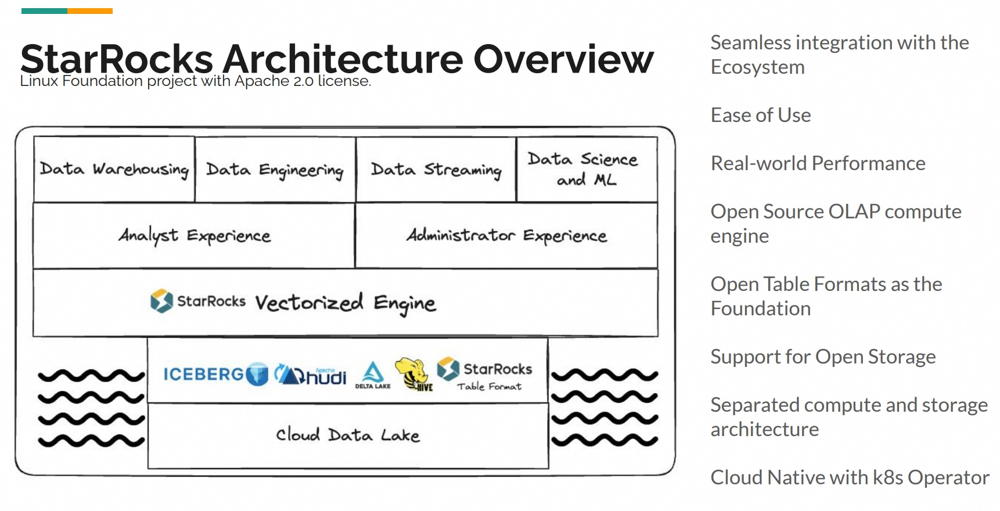
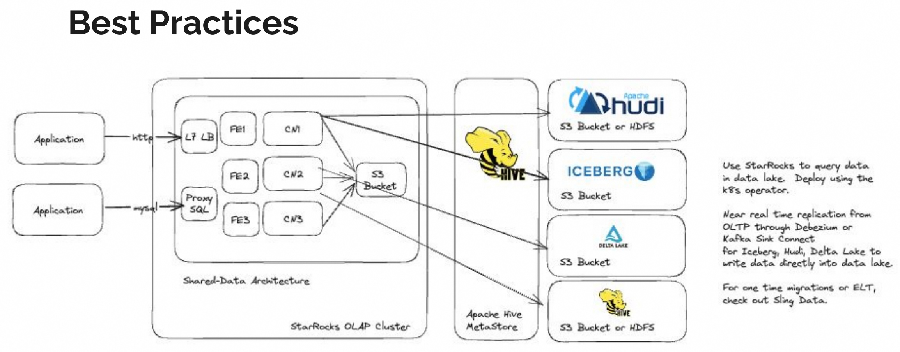
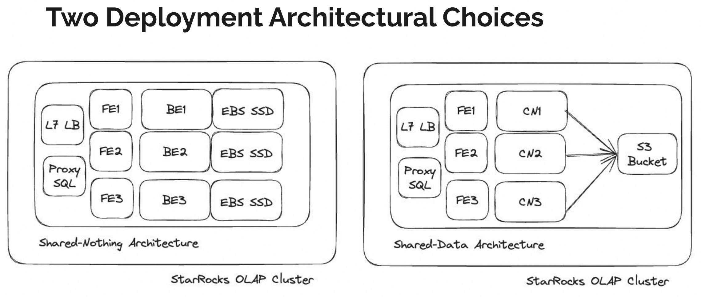
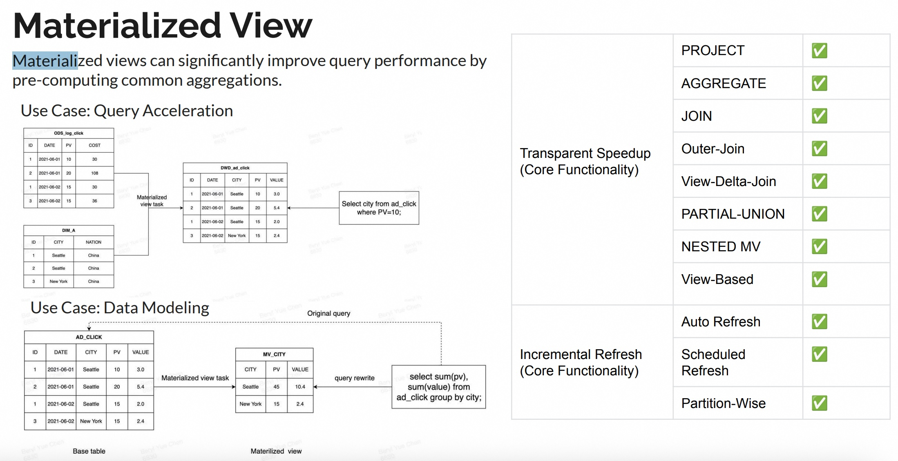
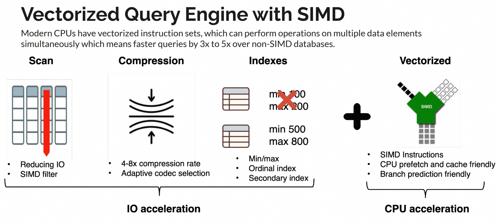

## AI论文解读 | StarRocks Technical Overview
        
### 作者        
digoal        
        
### 日期        
2025-07-25       
        
### 标签        
PostgreSQL , PolarDB , DuckDB , AI , 论文解读        
        
----        
        
## 背景  
      
https://forum.starrocks.io/t/starrocks-technical-overview-as-of-april-2024/72          
  
提示:        
```        
三个问题:  
  
1、读懂这篇论文需要提前掌握哪些基础知识, 请使用中文通熟易懂的讲解这些基础知识, 可以引用论文中的图、表或使用Markdown支持的图形(text,mermaid等)增加解释性.  
  
2、使用中文通熟易懂的解读这篇论文, 关键内容需深入讲解, 可以引用论文中的图、表或使用Markdown支持的图形(text,mermaid等)增加解释性.  
  
3、使用中文提取这篇论文中的重要术语并详细解释, 可以引用论文中的图、表或使用Markdown支持的图形(text,mermaid等)增加解释性.  
```  
  
注意, 这篇不是论文, 用了同样的提示词解读.  
  
## 论文解读
  
好的，我们来逐一解答这三个问题。

### 问题一：读懂这篇论文需要提前掌握哪些基础知识

要完全理解这篇关于 StarRocks 的技术概览，建议先掌握以下几个领域的基础知识。这篇文档本身就是一篇很好的入门介绍，但具备这些背景知识能让你理解得更深、更透彻。

-----

#### 1\. 数据处理架构 (Data Architecture)

首先需要理解不同数据平台的宏观设计理念，因为 StarRocks 的定位就是解决这些架构中的特定问题。

  * **数据仓库 (Data Warehouse)**:

      * **是什么**: 一个用于报告和数据分析的中央存储库。数据通常是结构化的、经过清洗和转换的，以支持商业智能 (BI) 查询。
      * **特点**: 读性能优化、数据结构化、支持复杂的分析查询。
      * **论文关联**: 论文提到 StarRocks 具备数据仓库的性能。

  * **数据湖 (Data Lake)**:

      * **是什么**: 一个集中式的存储库，可以以任意规模存储所有结构化和非结构化数据。数据通常是原始的、未经处理的。
      * **特点**: 灵活性高、成本低、可以存储任何类型的数据，但查询性能和数据管理相对复杂。
      * **论文关联**: StarRocks 能够直接查询数据湖中的数据 。

  * **数据湖仓 (Data Lakehouse)**:

      * **是什么**: 这是论文中的一个核心概念，它结合了数据仓库和数据湖的优点。它试图在数据湖的低成本、灵活的存储之上，提供类似数据仓库的数据管理和查询性能。

      * **论文关联**: 论文中明确展示了这个融合的概念，并指出 StarRocks 是一个能在数据湖上实现数据仓库性能的查询引擎，是构建数据湖仓的关键组件 。

          

        *图解: 数据湖仓结合了数据仓库和数据湖的特点 (引用自论文第4页)* 

#### 2\. OLAP (联机分析处理)

  * **是什么 (OLAP - Online Analytical Processing)**: 这是与传统数据库 (OLTP - 联机事务处理) 相对的概念。OLAP 专注于处理复杂的分析性查询，通常涉及大量数据的聚合、连接和计算，旨在为决策提供支持。
  * **特点**: 快速响应复杂的查询、支持多维度分析、高吞吐量。
  * **论文关联**: StarRocks 被明确定义为一个“MPP OLAP 数据库” ，整个文档都围绕着 OLAP 领域的趋势和挑战展开，例如对亚秒级查询响应时间的要求 。

#### 3\. 核心数据库技术 (Database Technologies)

  * **存算分离 (Separation of Compute and Storage)**:

      * **是什么**: 一种现代数据库架构，将负责计算（如查询处理）的资源和负责数据存储的资源分离开来，并可以独立扩展。

      * **特点**: 灵活性高、弹性好、成本优化。计算资源可以按需启停，存储资源可以独立扩容。

      * **论文关联**: 这是 StarRocks 3.x 版本的一个核心架构特性，被称为“Shared-Data Architecture” 。你可以只在需要运行查询时启动强大的计算集群，从而节省成本。

        ```mermaid
        graph TD
            subgraph "传统架构 (Shared-Nothing)"
                Node1[计算+存储]
                Node2[计算+存储]
                Node3[计算+存储]
            end

            subgraph "存算分离 (Shared-Data)"
                subgraph Compute["计算层 (可弹性伸缩)"]
                    C1[CN1]
                    C2[CN2]
                    C3[CN3]
                end
                subgraph Storage["存储层 (共享)"]
                    S3[S3 Bucket]
                end
                C1 --> S3
                C2 --> S3
                C3 --> S3
            end
        ```

        *图解: 传统架构与存算分离架构的对比 (概念源自论文第14页)*  
  
          
  
          

  * **列式存储 (Columnar Storage)**:

      * **是什么**: 一种数据存储方式。传统数据库按行存储数据，而列式存储将每一列的数据连续存放在一起。
      * **特点**: 在分析查询中性能极高。因为分析查询通常只关心少数几列，列式存储只需读取相关列的数据，大大减少了I/O。同时，同一列的数据类型相同，非常适合压缩。
      * **论文关联**: StarRocks 使用列式存储来提升性能，并支持多种开放的列式存储格式 。

  * **开放表格式 (Open Table Formats)**:

      * **是什么**: 定义数据湖中的数据集如何组织、管理和追踪的规范。它们为数据湖带来了类似数据库表的事务、版本管理和元数据管理能力。
      * **代表**: Apache Iceberg, Apache Hudi, Delta Lake。
      * **论文关联**: StarRocks 的一个关键能力是能够直接查询和写入这些开放表格式，从而无缝融入开放的数据湖生态系统 。

#### 4\. 云原生与 DevOps (Cloud Native & DevOps)

  * **云原生 (Cloud Native)**: 指的是在云环境中构建和运行应用程序的方法论。它充分利用了云的弹性、分布式和自动化能力。
  * **关键元素**:
      * **容器 (Containers)**: 如 Docker，将应用及其依赖打包，实现环境一致性。
      * **Kubernetes (k8s)**: 容器编排系统，用于自动化部署、扩展和管理容器化应用。
  * **论文关联**: StarRocks 是一个云原生数据库，支持通过 k8s Operator 进行部署和管理，其存算分离架构也是云原生理念的体现 。

-----

### 问题二：使用中文通熟易懂的解读这篇论文

这篇技术概览的核心思想是：**StarRocks 是一款开源、高性能的查询引擎，它解决了现代企业在进行大规模数据分析，特别是实时分析时遇到的速度、并发和架构复杂性等痛点，其最终目标是让用户可以在数据湖上获得数据仓库级别的极速分析体验。**

我们可以按照文档的结构来深入解读：

#### 1. 背景：当今 OLAP（分析数据库）面临的挑战 

文档首先描绘了当前数据分析领域的几个核心趋势和矛盾 ：

  * **查询速度**: 业务要求从过去的“分钟/秒级”响应提升到“亚秒级” 。
  * **数据架构**: 从独立的数据仓库和数据湖，走向融合的“数据湖仓” 。
  * **数据时效性**: 从传统的“批量处理”走向“流式实时处理” 。
  * **架构模式**: 从计算和存储绑定的传统架构，走向“存算分离”的云原生架构 。

这些趋势对传统的 OLAP 系统提出了巨大挑战。StarRocks 的诞生正是为了应对这些挑战。

#### 2. StarRocks 是什么？—— “数据湖上的数仓” 

StarRocks 的自我定位非常清晰：“一个开源查询引擎，能在数据湖上提供数据仓库的性能” 。

这意味着它具备以下几个关键能力：

  * **极速性能**:
      * 能在数十亿行的数据上实现亚秒级的连接和聚合查询 。
      * 能支持数十万用户的同时在线查询请求 。
  * **架构灵活**:
      * 可以直接查询数据湖中的数据，无需进行繁琐的数据迁移和ETL（数据抽取、转换、加载） 。
      * 采用云原生的存算分离架构，实现资源的弹性伸缩和成本优化 。
  * **简化数据处理**:
      * 拥有强大的 JOIN 性能，使得开发者不再需要为了性能而刻意将多张表打平成一张大宽表（反规范化），大大简化了数据处理流程 。

#### 3. StarRocks 的历史和发展 

StarRocks 并非凭空出现，它的发展路径体现了其技术的演进：

  * **诞生 (2020)**: 源于 Apache Doris 数据库的一个商业化分支，但随后超过 90% 的代码被重写，性能和功能有了质的飞跃 。
  * **开源 (2023)**: CelerData 公司（StarRocks 背后的商业公司）将其贡献给Linux基金会，采用 Apache 2.0 许可，成为一个完全的开源项目 。
  * **性能卓越**: 多项基准测试显示，其性能数倍于 Trino, Clickhouse, Apache Druid 等同类产品 。

#### 4. StarRocks 的核心架构与关键技术 

这是论文的技术核心部分，解释了 StarRocks 为何如此之快。

  * **两种部署架构 (Two Deployment Architectures)** 

      * **Shared-Nothing**: 传统的MPP（大规模并行处理）架构，每个节点都有自己的计算和存储资源。性能强劲，但弹性稍差。
      * **Shared-Data**: 3.x 版本引入的存算分离架构。计算节点（CN）和存储（如 S3）分离，可以独立扩展，更适应云环境。这是未来的主流方向。

    *图解：左为 Shared-Nothing，右为 Shared-Data (存算分离) 架构 (引用自论文第14页)*   

  * **向量化查询引擎 (Vectorized Query Engine)** 

      * 这是 StarRocks 实现极致性能的“核武器”。传统数据库一次处理一行数据中的一列，而向量化引擎一次性处理一列中的一批数据（一个向量）。它利用了现代 CPU 的 SIMD（单指令多数据流）技术，好比以前用手一个个搬砖，现在直接用叉车一板一板地搬，执行效率提升了3到5倍 。

  * **强大的 JOIN 性能 (JOIN performance at scale)** 

      * 分析查询中，多表连接（JOIN）是常见的性能瓶颈。StarRocks 的 CBO（基于成本的优化器）会自动选择最高效的 JOIN 策略（如 Broadcast Join, Shuffle Join 等）。这使得复杂的 JOIN 操作依然能飞快完成，用户无需再花费大量精力做“反规范化”来预先合并表 。

  * **物化视图 (Materialized View)** 

      * 这是一个强大的查询加速工具。对于一些固定且频繁的查询模式（例如，每天统计各个城市的广告点击总数），可以创建一个物化视图预先计算并存储好结果。当用户的查询符合这个模式时，StarRocks 会智能地、透明地从物化视图中读取结果，而不是重新计算，从而实现数量级的性能提升 。
      * 如下图所示，原始查询需要对 `ad_click` 表进行分组聚合，而优化器会自动改写查询，直接从预先计算好的物化视图 `mv_city` 中获取结果。

    *图解: 物化视图进行查询加速的原理 (引用自论文第23页)* 
  
      

#### 5\. 实践应用：StarRocks 如何解决真实世界的问题

文档最后通过几个知名公司的案例，展示了 StarRocks 的实际价值：

  * **LeetCode (用户分析)**: 查询速度提升100倍，成本节省80% 。
  * **Airbnb (Tableau报表 & 欺诈检测)**: 将分钟级的报表查询缩短到3.6秒 ，并支持了对实时更新数据的即席查询需求 。
  * **Tencent (游戏数据分析)**: 统一了原有的 ClickHouse 和 Trino 两套系统，并利用存算分离架构实现了弹性伸缩，降低了成本 。

#### 结论

总的来说，这篇论文描绘了 StarRocks 作为一个现代、高性能 OLAP 引擎的全貌。它不仅在技术上通过向量化、强大的JOIN优化、智能物化视图等实现了业界领先的性能，更在架构上拥抱云原生和存算分离，使其能够灵活、经济地解决从实时分析到数据湖仓等多种复杂场景下的数据挑战。

-----

### 问题三：使用中文提取这篇论文中的重要术语并详细解释

以下是这篇论文中出现的关键技术术语及其详细解释。

-----

#### 1\. OLAP (Online Analytical Processing)

  * **中文**: 联机分析处理
  * **解释**: 一种专门用于支持复杂分析查询（例如聚合、分组、多维分析）的计算类型。它的目标不是像传统数据库（OLTP）那样处理高频的增删改事务，而是快速地从海量数据中挖掘商业洞见。
  * **论文中的意义**: StarRocks 的核心定位就是一个 OLAP 数据库 。整个文档讨论的查询性能、数据架构等都是围绕 OLAP 场景展开的。它致力于解决 OLAP 领域对“亚秒级”查询响应、高并发和实时性的新要求 。

#### 2\. 数据湖仓 (Data Lakehouse)

  * **解释**: 一种新兴的数据平台架构，旨在将数据仓库的强大性能、数据管理能力与数据湖的低成本、高灵活性相结合。它允许在存储于开放格式（如 Parquet）的数据湖之上直接运行高性能的BI和SQL分析。

  * **论文中的意义**: 这是 StarRocks 的核心战场。StarRocks 被设计为数据湖仓架构中的高性能查询引擎 。它通过直接查询数据湖中的开放表格式（Iceberg, Hudi, Delta Lake），并提供数仓级的性能，实现了“湖仓一体”的理念 。

    *图解: 数据仓库 + 数据湖 = 数据湖仓 (引用自论文第4页)*   

#### 3\. 存算分离 (Separated compute and storage architecture)

  * **解释**: 一种将计算资源（CPU、内存）与存储资源（磁盘、对象存储）解耦的系统架构 。计算和存储可以根据需求独立地进行扩展或缩减。例如，在夜间没有分析任务时，可以关闭昂贵的计算集群，但数据依然安全地存储在低成本的存储介质上。
  * **论文中的意义**: 这是 StarRocks 3.x 系列的核心架构，也称为 **Shared-Data Architecture** 。它赋予了 StarRocks 极大的弹性，使其非常适合部署在云上，能够帮助用户在满足性能需求的同时显著降低成本 。
  
#### 4\. 向量化引擎 (Vectorized Engine)

  * **解释**: 一种查询执行模型。它不是按行、按元组（tuple-at-a-time）来处理数据，而是按列、按批次（batch-at-a-time）来处理。它充分利用现代CPU的 SIMD (Single Instruction, Multiple Data) 指令，用一条指令同时对多个数据进行运算，极大地提升了计算效率。
  * **论文中的意义**: 这是 StarRocks 实现极致查询性能的根本原因之一 。论文指出，向量化可以带来 3x 到 5x 的性能提升 。
  
    

#### 5\. 物化视图 (Materialized View)

  * **解释**: 一种数据库对象，它存储了某个查询的预计算结果。当有新的查询能够匹配到物化视图的计算逻辑时，系统可以直接从物化视图中获取数据，而不是重新扫描和计算基表，从而实现查询的透明加速 。
  * **论文中的意义**: 这是 StarRocks 的一个王牌功能，用于查询加速和数据建模 。StarRocks 的物化视图非常强大，支持自动、增量刷新，并且能够智能地进行查询改写，对用户完全透明 。

#### 6\. 开放表格式 (Open Table Formats)

  * **解释**: 为数据湖中的数据提供类似数据库中“表”的管理能力的一系列开放标准。它们解决了数据湖中“数据组织混乱”的问题，带来了事务支持（ACID）、数据版本控制（Time Travel）和模式演进（Schema Evolution）等高级功能。
  * **代表**: Apache Iceberg, Apache Hudi, Delta Lake。
  * **论文中的意义**: StarRocks 对主流开放表格式提供了良好的读写支持 [cite: 267, 269, 270, 271, 272, 273, 274]。这使它能够作为一个开放的计算引擎，无缝集成到现有的数据湖生态中，而不是创建一个封闭的数据孤岛。

#### 7\. 主键模型 (Primary Key Table)

  * **解释**: 一种支持基于主键进行快速“增、删、改（CRUD）”操作的表类型。它与传统的分析型数据库中常见的“仅追加（Append-Only）”模型不同，能够高效地处理实时的数据更新。
  * **论文中的意义**: 主键模型是 StarRocks 支持实时分析场景的关键 。它使得 StarRocks 可以轻松对接来自上游业务数据库（如 MySQL）的实时变更数据流（CDC - Change Data Capture），并保持数据在分析系统中的最终一致性，非常适用于需要实时更新数据的场景，如欺诈检测 。

#### 8\. CBO (Cost-Based Optimizer)

  * **中文**: 基于成本的优化器
  * **解释**: 查询优化的“大脑”。当接收到一条 SQL 查询时，CBO 会分析查询的特性，估算多种不同执行路径（例如，先做表A和表B的连接，还是先过滤表C）的成本（CPU、I/O等），并最终选择一个成本最低的执行计划 。
  * **论文中的意义**: StarRocks 拥有一个先进的CBO 。这是它即使在面对包含多个复杂 JOIN 的查询时，依然能保持高性能的关键。CBO 的智能决策使得SQL的执行效率大大提高。
  
## 参考        
         
https://forum.starrocks.io/t/starrocks-technical-overview-as-of-april-2024/72  
    
<b> 以上内容基于DeepSeek、Qwen、Gemini及诸多AI生成, 轻微人工调整, 感谢杭州深度求索人工智能、阿里云、Google等公司. </b>        
        
<b> AI 生成的内容请自行辨别正确性, 当然也多了些许踩坑的乐趣, 毕竟冒险是每个男人的天性.  </b>        
    
  
