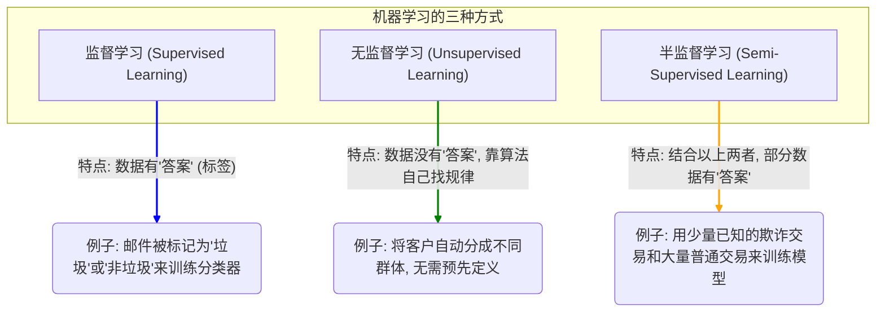

## AI论文解读 | AI-Driven Anomaly Detection: Strengthening Data Security and Quality in Large Databases
        
### 作者        
digoal        
        
### 日期        
2025-07-25       
        
### 标签        
PostgreSQL , PolarDB , DuckDB , AI , 论文解读        
        
----        
        
## 背景  
      
https://www.researchgate.net/publication/389429725_AI-Driven_Anomaly_Detection_Strengthening_Data_Security_and_Quality_in_Large_Databases        
  
提示:        
```        
三个问题:  
  
1、读懂这篇论文需要提前掌握哪些基础知识, 请使用中文通熟易懂的讲解这些基础知识, 可以引用论文中的图、表或使用Markdown支持的图形(text,mermaid等)增加解释性.  
  
2、使用中文通熟易懂的解读这篇论文, 关键内容需深入讲解, 可以引用论文中的图、表或使用Markdown支持的图形(text,mermaid等)增加解释性.  
  
3、使用中文提取这篇论文中的重要术语并详细解释, 可以引用论文中的图、表或使用Markdown支持的图形(text,mermaid等)增加解释性.      
```     

## 论文解读
  
好的，我们来逐一解答您基于这篇论文《AI-Driven Anomaly Detection: Strengthening Data Security and Quality in Large Databases》的三个问题。

### 1\. 读懂这篇论文需要提前掌握的基础知识

要完全理解这篇论文，您需要对以下几个核心概念有基本的认识。下面将用通俗易懂的方式为您讲解。

**基础知识 1：大数据 (Big Data)**

您可以将“大数据”想象成一个信息的海啸。它不仅仅是数据“多”，还具有三个显著特点，常被称为“3V” ：

  * **海量 (Volume)**：数据量巨大，比如一个大型电商平台每天产生的交易记录。
  * **高速 (Velocity)**：数据产生和需要处理的速度非常快，比如社交媒体上实时更新的信息流 。
  * **多样 (Variety)**：数据类型五花八门，既有像数据库表格一样整齐的“结构化数据”，也有像邮件、视频、音频这样的“非结构化数据” 。

这篇论文的出发点是，传统的管理方法（比如人工审计或简单的规则）已经无法应对这种“信息海啸”了 。

**基础知识 2：机器学习 (Machine Learning, ML)**

机器学习的本质是让计算机像人一样“学习”。我们不是给计算机编写一套固定的、死板的规则，而是给它大量的数据（“学习材料”），让它自己从数据中找出规律和模式。论文中提到了三种主要的学习方式 ：



  * **监督学习**：就像带着答案做练习册。我们给机器的数据都已经被贴上了正确的“标签”（例如，这笔交易是“欺诈”或“正常”）。机器通过学习这些带标签的数据，学会如何去判断一个新数据属于哪个标签 。
  * **无监督学习**：就像把一堆混杂的乐高积木给一个孩子，让他自己分类。机器在没有标签的数据中寻找隐藏的结构或“异常”的个体 。论文中提到的“孤立森林 (Isolation Forests)”和“自编码器 (Autoencoders)”都属于这一类 。
  * **半监督学习**：介于两者之间，用少量有标签的数据和大量无标签的数据进行学习，性价比很高 。

**基础知识 3：深度学习 (Deep Learning, DL)**

深度学习是机器学习的一个更高级、更强大的分支 。它的核心是“人工神经网络”，特别是层数非常多的“深度”神经网络。您可以把它想象成一个模拟人脑的、非常复杂的决策网络。

  * **为什么需要深度学习？** 因为它能自动学习数据中非常复杂和抽象的特征。比如，对于一张图片，浅层网络可能只能识别边缘和颜色，而深层网络能识别出“眼睛”和“鼻子”，并最终判断出这是一张“人脸”。
  * **与论文的关系**：论文中提到的循环神经网络 (RNN) 和生成对抗网络 (GANs) 等都是强大的深度学习模型，它们能够处理更复杂的异常情况，比如随时间变化的数据中的异常 。

掌握了这三个概念，您就能更好地理解为何论文要强调使用AI（特别是ML和DL）来应对大数据时代的数据库安全与质量挑战。

-----

### 2\. 论文核心内容解读

这篇论文的核心思想可以概括为：**面对日益复杂的大数据环境，传统的“规则式”异常检测方法已经力不从心，而基于人工智能（AI）的方法，特别是机器学习和深度学习，是保障大型数据库安全和数据质量的强大武器 。**

我们可以从以下几个方面来深入解读这篇论文：

**第一部分：问题是什么？—— 传统方法的困境**

论文开篇就指出了问题的严重性：在数据量、种类和产生速度都爆炸式增长的今天，依赖人工设定规则来发现“不对劲”的数据（即“异常”）变得越来越困难 。

  * **想象一个场景**：一个银行的安保系统，如果规则是“单笔交易超过1万元就算异常”，那么骗子可以轻易通过多笔9999元的交易来绕过检测。传统方法就是这样一套僵化的规则，缺乏灵活性和学习能力。

**第二部分：解决方案是什么？—— AI驱动的异常检测**

论文提出的核心解决方案是使用AI技术。AI不像传统方法那样依赖固定的规则，而是从数据中“学习”什么是“正常”，从而能更智能地识别出各种偏离“正常”的“异常” 。

论文重点介绍了几种关键的AI技术，我们可以将其分为三大类：

1.  **机器学习方法**：

      * **监督学习**：用已知的欺诈案例训练模型，让它学会识别新的欺诈行为 。
      * **无监督学习**：在没有现成答案的情况下，让模型自己去发现行为模式可疑的用户或交易 。这是论文的重点之一，因为它能发现未知的新型威胁。
      * **半监督学习**：结合上述两者，提高效率和准确性 。

2.  **深度学习模型（更强大的武器）**：

      * **自编码器 (Autoencoders)**：可以理解为一个“数据修复”专家。它学习正常数据的“样子”，然后尝试重建输入的数据。如果一个数据是异常的，它就很难被完美地重建出来，两者之间的“修复误差”会很大，从而被识别为异常 。
      * **循环神经网络 (RNNs)**：专门处理“有顺序”的数据，比如股票价格走势或用户的连续操作记录。它能记住之前的信息，从而判断当前的行为是否符合历史规律 。例如，一个用户前后台登录IP地址在短时间内发生巨大跳跃，RNN就能轻易捕捉到这种时序上的异常 。
      * **生成对抗网络 (GANs)**：这是一个非常聪明的机制，好比一个“伪造者”和一个“鉴别者”的博弈 。伪造者（生成器）不断生成以假乱真的“假异常数据”，而鉴别者（判别器）则努力学习如何分辨真假。通过这种持续的对抗训练，鉴别者的能力会变得非常强大，能够识别出极其微小和罕见的真实异常 。

3.  **混合方法**：将传统统计学方法和AI模型结合起来，取长补短，进一步提升检测精度 。

**第三部分：AI用在哪里？—— 实际应用场景**

论文列举了AI异常检测在多个行业的广泛应用 ：

  * **网络安全与金融反欺诈**：实时分析网络流量，发现黑客入侵迹象；检测信用卡盗刷、洗钱等金融欺诈行为 。
  * **数据完整性与质量保证**：自动扫描大型数据库，发现其中的错误数据、重复数据或不一致条目，甚至能实现“自我修复” 。
  * **工业物联网 (IoT)**：通过分析工厂设备的传感器数据，提前预测机器故障，实现“预测性维护”，避免重大生产事故 。

**第四部分：挑战与未来 —— 理性的思考**

论文同样客观地分析了AI技术的挑战和未来的发展方向：

  * **挑战**：

      * **计算成本高**：训练复杂的深度学习模型需要强大的计算资源（如GPU）。
      * **“黑箱”问题**：复杂的AI模型（特别是深度学习）做出的判断有时难以解释，我们不知道它为什么会把某条数据标记为异常，这在金融、医疗等领域是合规的障碍 。
      * **隐私与伦理**：监控用户行为可能引发数据隐私问题 。
      * **对抗性攻击**：攻击者可能会特意制造一些“伪装”过的数据来欺骗AI模型 。

  * **未来趋势**：

      * **自学习系统**：未来的AI将能持续自主学习，自动适应新出现的威胁，无需人工干预 。
      * **联邦学习**：一种保护隐私的AI技术，可以在不共享原始数据的情况下，联合多个机构的数据进行模型训练，对医疗、金融等行业意义重大 。
      * **与区块链和量子计算的结合**：利用区块链的不可篡改性来增强数据安全，利用量子计算的超强算力来应对更复杂的检测任务 。

**总结**：这篇论文系统地描绘了AI技术如何从根本上变革数据库安全和质量管理的全景图。它不仅介绍了核心技术，还展示了广阔的应用前景，并对现实挑战和未来方向进行了冷静的思考。

-----

### 3\. 论文重要术语解释

以下是这篇论文中出现的关键术语，附上通俗的中文解释。

1.  **异常检测 (Anomaly Detection)**

      * **解释**：指在一个数据集中，识别出那些与大多数数据显著不同的数据点或模式的过程。这些“异常”的数据点也被称为离群点、新奇点、噪声或偏差 。例如，在一堆苹果中发现一个橘子，这个橘子就是异常。
      * **在文中的意义**：这是整篇论文的核心主题，旨在利用AI技术自动、高效地完成这一过程，以保障数据安全与质量。

2.  **自编码器 (Autoencoder)**

      * **解释**：一种无监督的深度学习神经网络模型 。它的工作原理可以看作“先压缩，再解压”。它学习如何将“正常”数据压缩成一个简化的编码，然后再从这个编码恢复成原始数据。当一个“异常”数据输入时，由于模型没“见过”它，所以在恢复数据时会产生很大的误差。这个误差大小就成了判断是否异常的依据 。
      * **图解**:
        ```
        正常数据 ---> [编码器] ---> 压缩代码 ---> [解码器] ---> 重建的数据 (与原始数据非常相似)
        异常数据 ---> [编码器] ---> 压缩代码 ---> [解码器] ---> 重建的数据 (与原始数据差异巨大) ==> 判定为异常！
        ```

3.  **孤立森林 (Isolation Forests)**

      * **解释**：一种高效的无监督异常检测算法 。它的核心思想是：异常点因为“稀少且不同”，所以更容易被“孤立”出来。该算法通过随机切割数据来构建多棵决策树。异常点通常在树的较浅位置就能被单独分开，而正常点则需要更多次切割才能被区分 。
      * **在文中的意义**：作为一种高效的机器学习方法被提及，适用于快速从海量数据中筛选异常。

4.  **生成对抗网络 (Generative Adversarial Networks, GANs)**

      * **解释**：一种巧妙的深度学习模型，由两个相互竞争的神经网络组成：一个“生成器”（Generator）和一个“判别器”（Discriminator） 。生成器的任务是制造假数据，力求以假乱真；判别器的任务是尽力分辨出哪个是真数据，哪个是假数据。二者在博弈中共同进步。
      * **在文中的意义**：论文提出，可以利用GANs来生成高度逼真的“异常数据样本”，用这些样本去训练检测模型，从而让模型对罕见和未知的异常类型有更强的抵抗力 。

5.  **循环神经网络 (Recurrent Neural Networks, RNNs)**

      * **解释**：一种特别擅长处理序列数据（如时间序列、文本）的神经网络 。与普通神经网络不同，RNN具有“记忆”功能，可以将前一时刻的信息传递到当前时刻，从而理解数据中的时间依赖关系 。论文中还提到了其更强大的变体LSTM和GRU 。
      * **在文中的意义**：非常适用于检测金融交易序列或网络日志中的异常模式 。

6.  **联邦学习 (Federated Learning)**

      * **解释**：一种分布式的、注重隐私保护的机器学习技术 。它允许在多个数据源上协同训练一个AI模型，而无需将各方的原始数据汇集到一起。每个参与方的数据都保留在本地，只交换模型的更新参数，从而在保护数据隐私的同时，集合了多方的数据优势 。
      * **在文中的意义**：作为解决AI监控中数据隐私和合规问题（如GDPR）的重要未来方向被提出 。

7.  **可解释人工智能 (Explainable AI, XAI)**

      * **解释**：一系列旨在使AI模型的决策过程透明化、可被人类理解的技术和方法 。它试图回答“AI为什么会做出这个判断？”这个问题，以解决AI的“黑箱”问题。
      * **在文中的意义**：被作为应对复杂AI模型（如深度学习）解释性差这一挑战的关键策略 。论文提到了LIME和SHAP等具体的XAI技术 。

8.  **对抗性攻击 (Adversarial Attacks)**

      * **解释**：指攻击者通过精心设计、对输入数据进行微小的修改，来故意“欺骗”AI模型，使其做出错误的判断 。论文中提到了两种具体攻击方式：
          * **逃逸攻击 (Evasion attacks)**：将恶意数据伪装成正常数据，从而绕过检测 。
          * **投毒攻击 (Poisoning attacks)**：在模型训练阶段注入恶意数据，污染模型，使其从一开始就“学坏” 。
      * **在文中的意义**：这是AI安全部署时必须考虑的一个重大风险。论文也提出了对抗性训练等缓解策略 。
  
## 参考        
         
https://www.researchgate.net/publication/389429725_AI-Driven_Anomaly_Detection_Strengthening_Data_Security_and_Quality_in_Large_Databases  
    
<b> 以上内容基于DeepSeek、Qwen、Gemini及诸多AI生成, 轻微人工调整, 感谢杭州深度求索人工智能、阿里云、Google等公司. </b>        
        
<b> AI 生成的内容请自行辨别正确性, 当然也多了些许踩坑的乐趣, 毕竟冒险是每个男人的天性.  </b>        
    
  
  
#### [期望 PostgreSQL|开源PolarDB 增加什么功能?](https://github.com/digoal/blog/issues/76 "269ac3d1c492e938c0191101c7238216")
  
  
#### [PolarDB 开源数据库](https://openpolardb.com/home "57258f76c37864c6e6d23383d05714ea")
  
  
#### [PolarDB 学习图谱](https://www.aliyun.com/database/openpolardb/activity "8642f60e04ed0c814bf9cb9677976bd4")
  
  
#### [PostgreSQL 解决方案集合](../201706/20170601_02.md "40cff096e9ed7122c512b35d8561d9c8")
  
  
#### [德哥 / digoal's Github - 公益是一辈子的事.](https://github.com/digoal/blog/blob/master/README.md "22709685feb7cab07d30f30387f0a9ae")
  
  
#### [About 德哥](https://github.com/digoal/blog/blob/master/me/readme.md "a37735981e7704886ffd590565582dd0")
  
  

  
