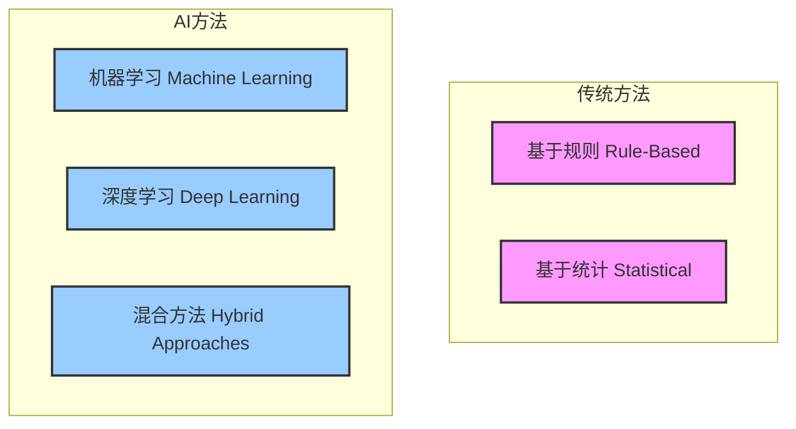
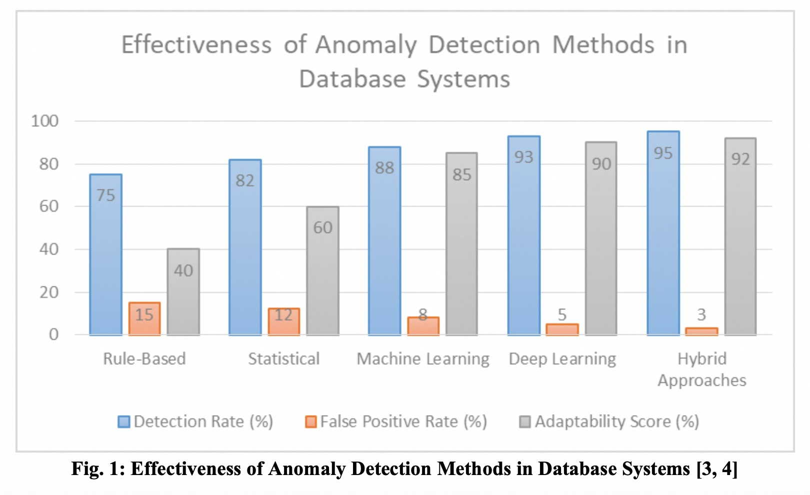

## AI论文解读 | Enhancing High-Availability Database Systems: An AI-Driven Approach to Anomaly Detection
        
### 作者        
digoal        
        
### 日期        
2025-07-25       
        
### 标签        
PostgreSQL , PolarDB , DuckDB , AI , 论文解读        
        
----        
        
## 背景  
      
https://www.ijfmr.com/papers/2024/6/30181.pdf        
  
提示:        
```        
三个问题:  
  
1、读懂这篇论文需要提前掌握哪些基础知识, 请使用中文通熟易懂的讲解这些基础知识, 可以引用论文中的图、表或使用Markdown支持的图形(text,mermaid等)增加解释性.  
  
2、使用中文通熟易懂的解读这篇论文, 关键内容需深入讲解, 可以引用论文中的图、表或使用Markdown支持的图形(text,mermaid等)增加解释性.  
  
3、使用中文提取这篇论文中的重要术语并详细解释, 可以引用论文中的图、表或使用Markdown支持的图形(text,mermaid等)增加解释性.  
```     

## 论文解读
  
好的，请看以下对这篇关于“通过AI驱动的异常检测增强高可用性数据库系统”论文的详细解读。

### 1、读懂这篇论文需要提前掌握哪些基础知识？

要完全理解这篇论文，需要对一些计算机科学和数据科学的基本概念有所了解。以下我将用通俗易懂的方式为您讲解这些核心基础知识。

**基础知识一：高可用性数据库系统 (High-Availability Database Systems)**

  * **是什么？** 想象一下银行的转账系统或电商平台的购物系统，它们能允许中断吗？答案是不能。高可用性数据库系统就是为了确保这些关键应用能够7x24小时不间-断运行而设计的 。即使部分服务器硬件出故障、网络有问题，整个系统也能继续提供服务 。
  * **如何实现？** 论文中以Cassandra数据库为例 ，它通过以下几个特点实现高可用：
      * **去中心化 (Decentralized):** 集群里没有哪个节点是“领导”，所有节点角色相同。坏掉一个，不影响整体 。
      * **数据复制 (Data Replication):** 一份数据会复制并存储在多个不同的机器上。一台机器坏了，数据还在别处 。
      * **可扩展性 (Scalability):** 当业务量增大时，可以随时向集群中增加新的机器来分担压力 。

**基础知识二：异常检测 (Anomaly Detection)**

  * **是什么？** 就是“找茬”或“找不同”。在一个系统中，识别出那些不正常的、异于平常的模式或行为 。这些“异常”可能预示着系统即将发生故障、性能下降，甚至是遭到了网络攻击 。

**基础知识三：两大类异常检测方法：传统 vs. 人工智能**

这篇论文的核心就是对比这两类方法。

  * **A. 传统方法 (Traditional Methods)**

      * **基于规则 (Rule-Based):** 最简单直接的方法。由专家预先设定好规则，例如“如果数据库的读取延迟超过2秒，就报警”。这种方法简单明了，但缺点是规则是死的，面对复杂多变的环境就显得很僵化 。
      * **基于统计 (Statistical):** 这种方法会先分析一段时间的历史数据，建立一个“正常”行为的数学模型（例如，计算出平时CPU使用率的平均值和标准差）。当新出现的数据偏离这个正常范围太远时，就被认为是异常 。这比规则法灵活，但对复杂的数据关系处理能力有限 。

  * **B. 人工智能方法 (AI-Powered Methods)**

      * **机器学习 (Machine Learning):** 不再依赖人去设定死规则，而是让机器自己从海量数据中“学习”什么是正常，什么是异常 。它分为：
          * **监督学习 (Supervised Learning):** 需要提前给数据打上“正常”或“异常”的标签，像老师教学生一样去训练模型 。
          * **无监督学习 (Unsupervised Learning):** 不需要人工打标签，机器自己对数据进行聚类，把那些“不合群”的数据点找出来，这些往往就是异常 。这种方法更适合发现未知的新型异常。
      * **深度学习 (Deep Learning):** 可以看作是机器学习的“高级版”，使用更复杂的神经网络结构，尤其擅长处理海量的、复杂的数据关系 。例如文中的循环神经网络（RNN），就特别适合分析像数据库日志这样的时间序列数据 。

为了更直观地理解这些方法的优劣，我们可以看一下论文中的这张图：

**图1：不同异常检测方法的效果对比**



论文中的 **图1 (Figure 1)**  通过三个指标清晰地展示了AI方法的优越性：

  * **检测率 (Detection Rate %):** 蓝色的柱子，越高越好。代表能成功找出多少异常。AI方法（机器学习88%、深度学习93%、混合方法95%）远高于传统方法（基于规则75%、统计82%） 。
  * **误报率 (False Positive Rate %):** 橙色的柱子，越低越好。代表把正常当成异常的错误概率。AI方法的误报率（8%、5%、3%）显著低于传统方法（15%、12%） 。
  * **适应性分数 (Adaptability Score %):** 灰色的柱子，越高越好。代表方法适应环境变化的能力。AI方法的适应性（85%、90%、92%）也远超传统方法（40%、60%） 。
  
  
  
掌握了这些基本概念，您就可以顺利地进入对这篇论文的深度解读了。  
  
-----

### 2、使用中文通熟易懂的解读这篇论文

这篇论文的核心思想可以概括为：**在维护数据库系统稳定性的战斗中，传统方法已经力不从心，而人工智能（AI）驱动的异常检测技术是更强大、更智能的新一代武器。**

下面我们来深入解读这篇论文的脉络和关键内容。

**第一部分：问题提出 —— 为什么需要新方法？**

论文开篇就指出现代IT基础设施的“心脏”——高可用性数据库系统——对稳定性的要求极高 。而传统的异常检测方法，如基于规则和统计的方法，存在明显缺陷：它们太“死板”，无法适应现代数据库环境的动态和复杂性 。比如，双十一期间的流量暴增，在统计模型看来可能是“异常”，但实际上是正常业务行为。传统方法很难处理这种情况。因此，论文提出引入AI技术来解决这些难题 。

**第二部分：方法详解 —— AI武器库里有什么？**

论文详细介绍了多种AI“武器”，并分析了它们的优劣。我们可以参考论文的 **表1 (Table 1)**  来进行一个直观的对比。

| 方法类型 | 优点 | 缺点 |
| :--- | :--- | :--- |
| **传统-基于规则** | 规则清晰易懂，对算力要求低 。 | 适应性差，难以应对复杂模式，维护成本高 。 |
| **传统-统计方法** | 对小数据集有效，能发现渐进式变化 。 | 难以处理非线性关系，对数据分布有假设 。 |
| **AI-机器学习** | 能处理高维数据，适应性强 。 | 需要大量训练数据，计算可能密集，可解释性较差 。 |
| **AI-深度学习** | **捕捉复杂关系能力极强**，能处理日志、指标等多种数据 。 | **“黑箱”问题**，可解释性差，需要海量数据和更高算力 。 |
| **AI-混合方法** | **集众家之长**，可以平衡准确性和可解释性 。 | 实现和维护更复杂 。 |

论文特别强调了以下几种先进的AI技术：

  * **无监督学习 (Unsupervised Learning):** 因为数据库中的“异常”事件通常是稀少且多样的，很难提前全部标记出来。无监督学习不需要标签，使其在真实场景中非常灵活实用 。
  * **深度学习模型 (Deep Learning Approaches):**
      * **自动编码器 (Autoencoders):** 通过学习如何“压缩再重建”正常数据，来发现异常。如果一个数据无法被很好地重建，说明它和正常数据差异很大，可能是个异常 。
      * **循环神经网络 (RNNs):** 专门处理带时间顺序的数据（如系统指标或日志），能发现随时间演变的异常模式 。
  * **混合方法 (Hybrid Approaches):** 论文认为这是非常有前景的方向。例如，可以用AI动态调整传统规则的阈值，或者将不同AI模型的预测结果结合起来，以达到最佳效果 。从**图1**中也可以看到，混合方法的综合评分是最高的 。

**第三部分：实战演练 —— AI在真实世界表现如何？**

为了证明AI不只是理论上的“花架子”，论文列举了两个行业的成功案例 。

  * **案例一：金融行业** 

      * **痛点：** 对交易安全性和合规性要求极高，欺诈手段层出不穷。
      * **AI方案：** 采用混合AI模型，结合了监督学习（识别已知欺诈模式）和无监督学习（发现新型攻击） 。
      * **成果：** 成功识别了多种传统规则系统遗漏的复杂欺诈行为，同时保障了交易的低延迟 。

  * **案例二：电商平台** 

      * **痛点：** 如何应对大促期间的流量洪峰，保证系统不崩溃，同时优化高昂的服务器成本。
      * **AI方案：** 使用了预测性分析模型来提前预测流量高峰，并结合分布式异常检测系统 。
      * **成果：** 在大型促销活动中实现了99.99%的系统正常运行时间，并通过AI动态调配资源，将云基础设施成本降低了30% 。

**第四部分：未来展望 —— 下一代技术是什么？**

论文最后探讨了未来的发展趋势，指出了几个重要的方向：

  * **边缘计算 (Edge Computing):** 将异常检测模型部署在靠近数据源的“边缘”设备上，而不是全传回中心服务器。这样做可以极大降低延迟，实现真正的实时检测和响应 。
  * **联邦学习 (Federated Learning):** 这是一种保护数据隐私的AI技术。模型在各地数据源上进行本地训练，只上传更新后的模型参数，原始敏感数据不出本地。这对于数据主权和隐私要求严格的行业（如金融、医疗）至关重要 。
  * **可解释性AI (Explainable AI - XAI):** 深度学习常被诟病为“黑箱”，我们不知道它为什么会做出某个判断。XAI的目标就是打开这个黑箱，让AI的决策过程透明化、可理解。这对于建立信任和满足监管要求至关重要 。

**论文结论**

作者总结道，AI驱动的异常检测无疑为高可用性数据库系统带来了革命性的潜力 。它比传统方法更准确、更智能、适应性更强。然而，要成功实施，必须综合考虑技术挑战（如可扩展性、实时性）、数据隐私和伦理问题，寻求一个技术创新与负责任部署之间的平衡点 。

-----

### 3、使用中文提取这篇论文中的重要术语并详细解释

以下是这篇论文中出现的关键术语及其详细解释。

1.  **高可用性数据库系统 (High-Availability Database Systems, HADS)**

      * **解释:** 指那些被设计用来提供持续、不间断数据服务的数据库系统，目标是最大限度地减少停机时间 。它们是许多关键业务（如在线交易、通信服务）的基石 。
      * **论文中的意义:** 这是AI异常检测技术应用的主要战场。因为这类系统对稳定性和可靠性的要求最高，任何微小的异常都可能导致严重后果，因此需要最先进的检测技术来保驾护航。

2.  **异常检测 (Anomaly Detection)**

      * **解释:** 在数据集中识别出与大多数数据显著不同的数据点的过程 。这些数据点被称为“异常”或“离群点”。
      * **论文中的意义:** 这是论文的核心议题。在数据库场景下，异常检测的目标是识别出可能导致系统故障、性能下降或安全漏洞的异常行为 。

3.  **监督学习 (Supervised Learning) vs. 无监督学习 (Unsupervised Learning)**

      * **解释:**
          * **监督学习:** 一种机器学习方法，模型从带有“正确答案”（即标签）的训练数据中学习 。例如，给模型一堆邮件，并告诉它哪些是垃圾邮件，哪些不是，让它学会如何分类。
          * **无监督学习:** 另一种机器学习方法，训练数据没有标签 。模型需要自己去发现数据中的结构和模式。例如，将新闻文章自动聚类成“体育”、“财经”、“科技”等不同类别。
      * **论文中的意义:** 论文指出，在异常检测领域，无监督学习通常更具优势，因为异常事件本身就是稀有和未知的，很难提前准备好所有类型的异常标签来进行监督训练 。

4.  **深度学习 (Deep Learning)**

      * **解释:** 机器学习的一个分支，它使用包含多个处理层的深度神经网络，能够从数据中学习非常复杂的模式 。
      * **论文中的意义:** 深度学习被认为是处理现代数据库复杂监控数据的有力工具。论文中提到了两种具体的深度学习模型：
          * **自动编码器 (Autoencoders):** 擅长学习数据的“正常”表示，从而识别异常 。
          * **循环神经网络 (RNNs):** 特别适合分析具有时间顺序的数据，如CPU使用率随时间的变化曲线或系统日志 。

5.  **混合方法 (Hybrid Approaches)**

      * **解释:** 指将两种或多种不同的技术结合起来，以期获得比单一技术更好的效果的策略 。
      * **论文中的意义:** 这是论文高度评价的一个方向。例如，可以将机器学习的自适应能力与传统规则的明确性相结合 ，或者将多个不同的AI模型组合成一个“委员会”进行投票决策，以提高准确率和鲁棒性 。**图1**中的数据显示，混合方法在检测率、误报率和适应性方面综合表现最佳 。

6.  **可解释性AI (Explainable AI, XAI)**

      * **解释:** 一个旨在使AI系统的决策过程能够被人类理解的AI研究领域 。它要回答的问题是：“AI为什么会做出这个决定？”
      * **论文中的意义:** 这是AI异常检测面临的一个关键挑战和未来趋势。当AI系统发出警报时，数据库管理员需要知道警报的原因才能有效处理。如果AI是一个无法解释的“黑箱”，会极大地影响系统的可信度和实用性，尤其是在需要审计和合规的金融等行业 。

7.  **联邦学习 (Federated Learning)**

      * **解释:** 一种分布式、保护隐私的机器学习技术。它允许多个设备在不共享其本地数据的情况下协同训练一个模型 。数据保留在本地，只交换模型的更新信息 。
      * **论文中的意义:** 这是应对未来数据隐私挑战的重要技术。对于跨国公司或有严格数据主权法规的地区，联邦学习可以在不违反隐私规定的前提下，利用全球数据来训练出更强大的异常检测模型 。
  
## 参考        
         
https://www.ijfmr.com/papers/2024/6/30181.pdf  
    
<b> 以上内容基于DeepSeek、Qwen、Gemini及诸多AI生成, 轻微人工调整, 感谢杭州深度求索人工智能、阿里云、Google等公司. </b>        
        
<b> AI 生成的内容请自行辨别正确性, 当然也多了些许踩坑的乐趣, 毕竟冒险是每个男人的天性.  </b>        
    
   
