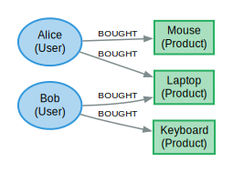

## AGE要复活了? PG将内置PGQ(SQL:2023 Property-Graph Queries)  
                    
### 作者                    
digoal                    
                    
### 日期                    
2025-07-25                   
                    
### 标签                    
PostgreSQL , 图 , graph , age , GraphBLAS , DuckDB , 递归查询 , CTE , 广度优先 , 深度优先 , 点 , 边 , 权重 , 出度 , 入度 , pagerank , 图谱 , 串行处理 , 并行 , CUDA , GPU , 向量 , 稀疏矩阵             
                    
----                    
                    
## 背景    
  
AGE是PG的图数据库插件, 但是 [《裁员导致AGE开源图数据库项目面临死亡! 我们还能相信企业开源产品吗?》](../202503/20250320_01.md)    
  
曲线救国的方法: [《还在为age图插件的停更惋惜? Postgres用GraphBLAS每秒处理数十亿条边》](../202507/20250723_08.md)    
  
或者也可以直接使用递归来实现图式搜索   
- [《PostgreSQL 递归查询 - 深度优先、广度优先 搜索举例 - BREADTH DEPTH》](../202109/20210917_01.md)      
- [《PostgreSQL 图式搜索(graph search)实践 - 百亿级图谱，毫秒响应》](../201801/20180102_04.md)      
    
以上你都觉得不够爽?   
  
好消息, PG将内置PGQ(SQL:2023 Property-Graph Queries)  
  
而且patch都已经有了, 有人在pg 18 beta2打上patch, 玩得贼拉六.  
  
下面内容翻译自: https://gavinray97.github.io/blog/postgres-sql-property-graphs  
  
## 在 Postgres 18 中尝试 SQL:2023 图查询  
  
**TL;DR**  
  
获取下面的 Docker 镜像，连接psql，然后尝试图查询。SQL/PGQ 的使用体验就像在家一样轻松使用 Cypher。  
  
### 简介  
`SQL:2023` 引入了一种用于图形查询的新语法。  
  
这种图查询语言被称为“SQL/PGQ”。您可以在下面阅读更多相关信息：  
- https://www.iso.org/standard/79473.html  
- https://www.postgresql.org/message-id/a855795d-e697-4fa5-8698-d20122126567%40eisentraut.org  
- https://blogs.oracle.com/database/post/property-graphs-in-oracle-database-23ai-the-sql-pgq-standard  
  
到目前为止，只有 Oracle 23 发布了对它的支持，但我想向您展示如何在 Postgres 中试验 SQL/PGQ。  
  
### `Postgres 18beta2` + `SQL/PGQ` 补丁的 `Docker` 镜像  
我发布了一个 Docker 镜像，其中包含 Postgres 的最新版本并应用了邮件列表中的 SQL/PGQ 补丁。  
```  
docker run -d \  
  --name postgres-pgq \  
  -p 5432:5432 \  
  -v postgres-data:/var/lib/postgresql/data \  
  -e PGDATA=/var/lib/postgresql/data \  
  -e POSTGRES_PASSWORD=postgres \  
  gavinray/postgres-18beta2-pgql:latest  
  
docker exec -it postgres-pgq psql -U postgres -d postgres  
```  
  
### 示例：电子商务产品推荐  
虽然这个例子已经被用烂了，但它是展示 PGQ 的好方法。  
  
假设我们有`users`，`products`，和`purchases`：  
```  
-- Node Table: Users  
CREATE TABLE users (  
    id INT GENERATED ALWAYS AS IDENTITY,  
    name TEXT NOT NULL  
);  
  
-- Node Table: Products  
CREATE TABLE products (  
    id INT GENERATED ALWAYS AS IDENTITY,  
    name TEXT NOT NULL,  
    price NUMERIC(10, 2)  
);  
  
-- Edge Table: Purchases linking users and products  
CREATE TABLE purchases (  
    user_id INT REFERENCES users(id),  
    product_id INT REFERENCES products(id),  
    purchase_date DATE DEFAULT CURRENT_DATE,  
    PRIMARY KEY (user_id, product_id)  
);  
```  
  
假设我们有`Alice`和`Bob`。`Alice`购买一台笔记本电脑和一个鼠标，`Bob`购买一台笔记本电脑和一个键盘：  
```  
INSERT INTO  
    users (name)  
VALUES  
    ('Alice'), -- id 1  
    ('Bob'); -- id 2  
  
INSERT INTO  
    products (name, price)  
VALUES  
    ('Laptop', 1200.00), -- id 1  
    ('Mouse', 25.00), -- id 2  
    ('Keyboard', 75.00); -- id 3  
  
-- Insert purchases (edges)  
INSERT INTO  
    purchases (user_id, product_id)  
VALUES  
    (1, 1), -- Alice bought a Laptop  
    (1, 2), -- Alice bought a Mouse  
    (2, 1), -- Bob bought a Laptop (the shared item)  
    (2, 3); -- Bob bought a Keyboard (the recommendation)  
```  
  
现在我们可以了解事情的本质：图定义和对它的查询。  
  
我们首先定义一个`PROPERTY GRAPH`，并为其声明`VERTEX`和`EDGE`表。此 DDL 语句的文档位于：  
- https://docs.oracle.com/en/database/oracle/oracle-database/23/sqlrf/create-property-graph.html  
  
```  
CREATE PROPERTY GRAPH recommender_graph  
VERTEX TABLES (  
    users LABEL users PROPERTIES (id, name),  
    products LABEL product PROPERTIES (id, name, price)  
)  
EDGE TABLES (  
    purchases  
    SOURCE KEY (user_id) REFERENCES users (id)  
    DESTINATION KEY (product_id) REFERENCES products (id)  
    LABEL BOUGHT  
);  
```  
  
  
  
我们可以问这样的问题：“Alice 还没有购买的类似产品有哪些？”  
  
PGQL 中该语句的语法（好吧，它的一种表示）是：  
```  
-- (Alice) -> (Shared Product) <- (Similar User) -> (Recommended Product)  
  
SELECT DISTINCT g.rec_id, g.rec_name  
FROM GRAPH_TABLE (  
       recommender_graph  
       MATCH   (me  IS users    WHERE me.name = 'Alice')  
               -[:BOUGHT]->(p   IS product)<-[:BOUGHT]-(sim IS users)  
               -[:BOUGHT]->(rec IS product)  
       COLUMNS (me.id  AS uid,  
                rec.id AS rec_id,  
                rec.name AS rec_name)  
) AS g  
WHERE NOT EXISTS (  
        SELECT 1  
        FROM   purchases p  
        WHERE  p.user_id    = g.uid  
          AND  p.product_id = g.rec_id  
);  
```  
  
这应该返回：  
```  
| Rec id | Rec name |  
| :----- | :------- |  
| 3      | Keyboard |  
```  
  
看来`Alice`买了笔记本电脑和鼠标后，可能会想要买个键盘！太棒了。  
  
### 补丁和构建详细信息  
https://www.postgresql.org/message-id/CAEG8a3L3uZZRT5Ra5%3D9G-SOCEYULejw5eqQE99VL0YfTeX3-BA%40mail.gmail.com  
```  
Attachment	Content-Type	Size  
v10-0011-do-not-use-default-COLLATE.patch	application/octet-stream	5.8 KB  
v10-0012-trivial-refactor-of-property-graph-object-addres.patch	application/octet-stream	17.1 KB  
v10-0010-adapt-property-graph-to-more-intuitive-titles.patch	application/octet-stream	2.6 KB  
v10-0008-Document-fixes.patch	application/octet-stream	5.1 KB  
v10-0009-WIP-Do-not-print-empty-columns-table-for-a-prope.patch	application/octet-stream	14.1 KB  
v10-0007-RLS-tests.patch	application/octet-stream	182.1 KB  
v10-0006-Property-collation-and-edge-vertex-link-support.patch	application/octet-stream	114.3 KB  
v10-0005-Access-permissions-on-property-graph.patch	application/octet-stream	11.9 KB  
v10-0004-Fixes-following-issues.patch	application/octet-stream	36.2 KB  
v10-0003-Support-cyclic-path-pattern.patch	application/octet-stream	37.4 KB  
v10-0002-support-WHERE-clause-in-graph-pattern.patch	application/octet-stream	7.2 KB  
v10-0001-WIP-SQL-Property-Graph-Queries-SQL-PGQ.patch	application/octet-stream	504.4 KB  
```  
  
此外，Dockerfile 中还有一些 hacky 补丁，它们删除了与塞尔维亚语语言环境和词干相关的大量功能，以修复编译错误。  
  
### 进一步阅读  
https://pgconf.in/conferences/pgconfin2025/program/proposals/895  
  
https://www.enterprisedb.com/blog/representing-graphs-postgresql-sqlpgq  
  
期待 Postgres 合并PGQ patch的那一天   
     
