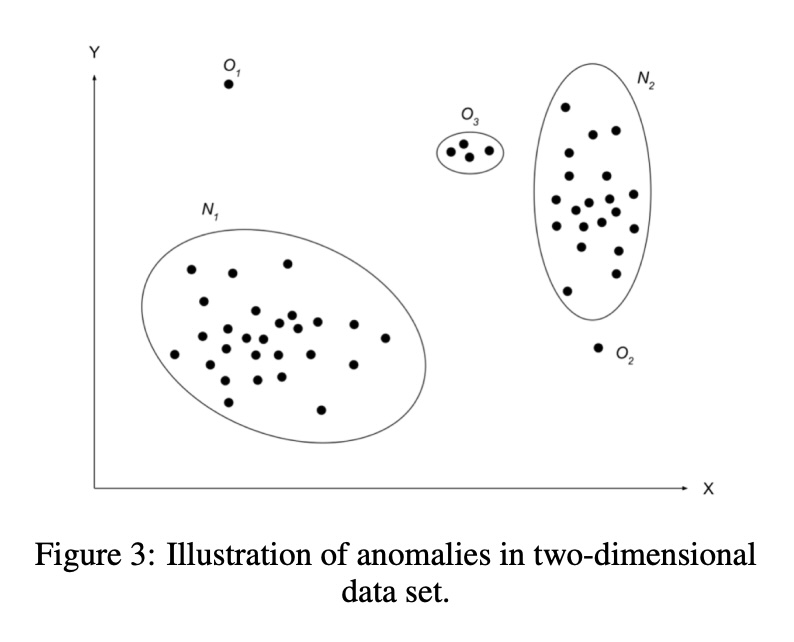
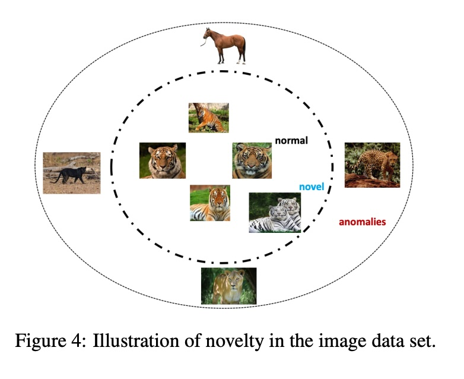
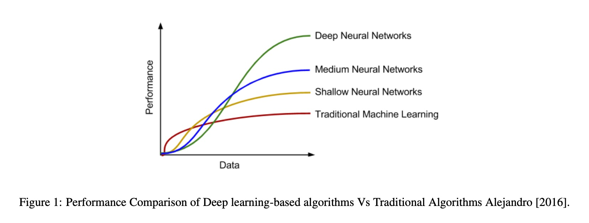
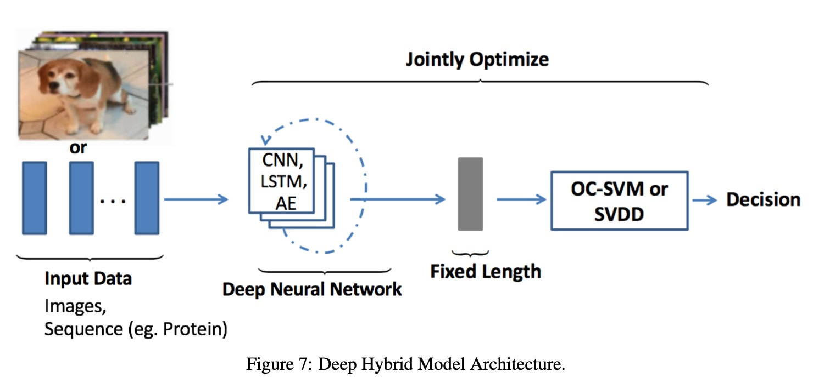
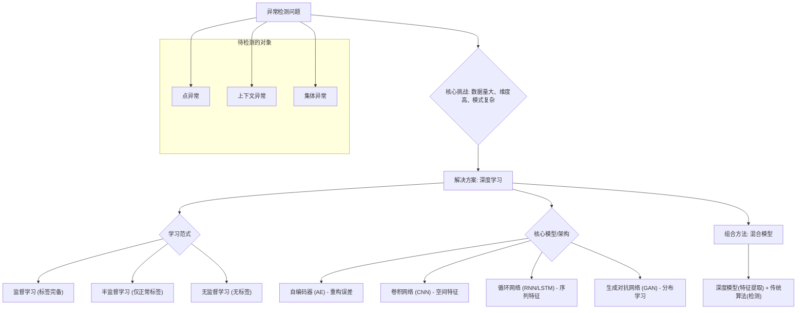
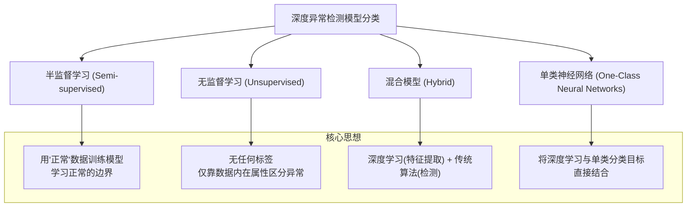
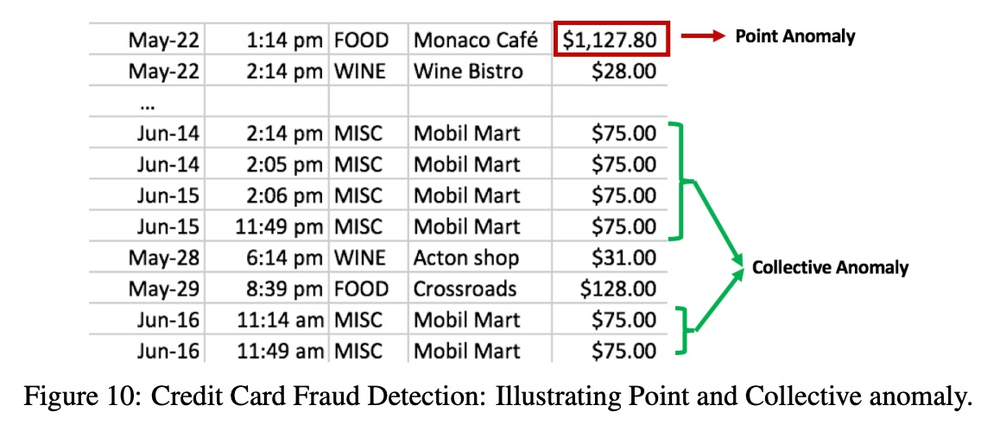
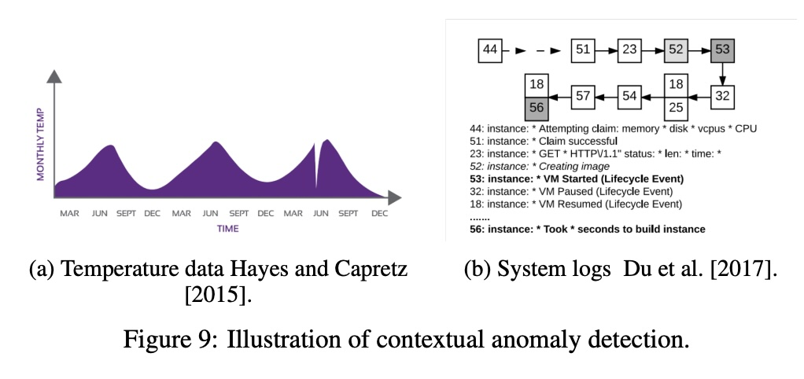
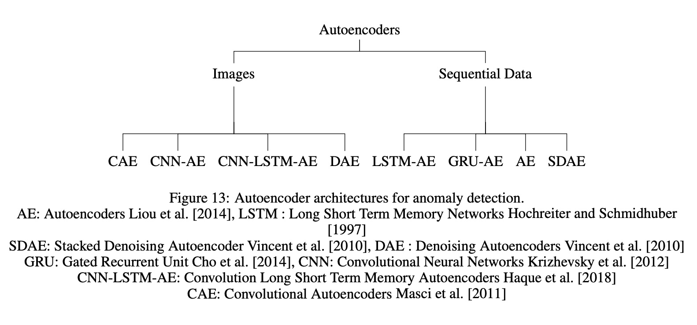
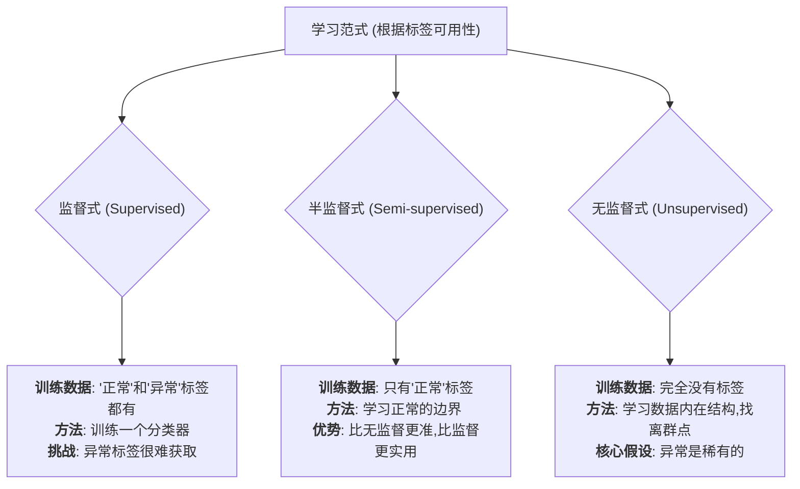

## AI论文解读 | DEEP LEARNING FOR ANOMALY DETECTION: A SURVEY
        
### 作者        
digoal        
        
### 日期        
2025-07-26       
        
### 标签        
PostgreSQL , PolarDB , DuckDB , AI , 论文解读        
        
----        
        
## 背景  
      
https://arxiv.org/pdf/1901.03407        
  
提示:          
```          
读懂《DEEP LEARNING FOR ANOMALY DETECTION: A SURVEY》这篇论文需要提前掌握哪些基础知识, 请使用中文通熟易懂的讲解这些基础知识, 可以引用论文中的图、表或使用Markdown支持的图形(text,mermaid等)增加解释性.   
    
使用中文通熟易懂的解读《DEEP LEARNING FOR ANOMALY DETECTION: A SURVEY》这篇论文, 其中的关键内容请着重讲解, 可以引用论文中的图、表或使用Markdown支持的图形(text,mermaid等)增加解释性.   
    
提取《DEEP LEARNING FOR ANOMALY DETECTION: A SURVEY》这篇论文中的重要术语, 使用中文对这些术语进行通熟易懂的讲解, 可以引用论文中的图、表或使用Markdown支持的图形(text,mermaid等)增加解释性.   
```     
  
## 1 前置知识 
  
好的，为了完全理解《DEEP LEARNING FOR ANOMALY DETECTION: A SURVEY》这篇深度学习异常检测的综述性论文，您需要掌握以下几个方面的基础知识。我会用通俗易懂的中文进行讲解，并引用论文中的图表来帮助理解。

这篇论文的核心可以概括为：**用什么技术（深度学习），解决什么问题（异常检测），并梳理这些技术在不同场景下的应用**。因此，需要的基础知识也分为三大块：

1.  **异常检测（Anomaly Detection）的基础知识**
2.  **机器学习与深度学习（Machine Learning & Deep Learning）的核心概念**
3.  **模型的组合与评估思路**

-----

### 1\. 异常检测 (Anomaly Detection) 的基础知识

在深入了解“如何检测”之前，必须先明白“检测的是什么”。

#### 1.1 什么是异常 (Anomaly)？

异常，也常被称为离群点 (Outlier)、偏差 (Deviant) 或新奇点 (Novelty) 。论文中引用了一个经典的定义：**“离群点是一个与其他观测值差异巨大，以至于让人怀疑它是由不同机制产生的观测”** 。

简单来说，异常就是“格格不入”的数据点。

  * **直观理解**：看论文中的 **图3**。
      *   
        *来源: 论文 Figure 3: Illustration of anomalies in two-dimensional data set.*
      * 在这个图中， $N\_1$ 和 $N\_2$ 是两个数据密集的区域，代表“正常”数据 。而 $O\_1$, $O\_2$ 和 $O\_3$ 这些点或小簇，离主要的数据群很远，它们就是“异常” 。

#### 1.2 异常 (Anomaly) vs. 新奇 (Novelty)

这是一个细微但重要的区别，论文在第3节专门做了说明 。

  * **异常 (Anomalies)**: 通常指不符合正常模式的、可能是错误或恶意的数据。例如，信用卡交易记录中突然出现一笔在国外的大额消费。
  * **新奇 (Novelties)**: 指的是一种“未曾见过但可能正常”的新模式。检测到新奇点后，模型可能会更新，将这种新模式也学习为“正常”的一部分 。

论文中的 **图4** 给出了一个绝佳的例子：

  *   
    *来源: 论文 Figure 4: Illustration of novelty in the image data set.*
  * 在一堆老虎（正常 normal）的图片中，突然出现一张白虎的图片，这可以被看作是“新奇” (novel) 。但如果出现的是马、黑豹、狮子，这些就属于“异常” (anomalies) 。

#### 1.3 异常的类型

根据异常点的表现形式，可以分为三类（论文第8.4节）：

  * **点异常 (Point Anomalies)**：单个数据点是异常的。
      * **例子 (图10)**: 在一堆几十美元的消费记录中，突然出现一笔“`$1,127.80`”的消费，这就是一个点异常 。
  * **上下文异常 (Contextual Anomalies)**：一个数据点在特定“上下文”中是异常的，但在其他情况下可能正常 。
      * **例子 (图9a)**: 在炎热的夏季，气温突然降到零下，这就是一个上下文异常。这个温度在冬季是正常的，但在夏季的“上下文”中就是异常 。
  * **集体异常 (Collective Anomalies)**：单个数据点看起来都正常，但它们“组合”在一起时就显得很异常 。
      * **例子 (图10)**: 信用卡在短时间内，在同一个加油站便利店 (Mobil Mart) 连续发生了多笔金额完全相同的消费 (`$75.00`) 。单看任何一笔`$75`的消费都正常，但这个“集体”行为就很可疑。

-----

### 2\. 机器学习与深度学习 (Machine Learning & Deep Learning) 的核心概念

这是理解“如何检测”的技术基础。

#### 2.1 为什么需要“深度”学习？

传统的机器学习方法在数据量较小、特征简单时表现不错。但当数据规模和复杂度急剧增加时，它们的性能会遇到瓶颈 。深度学习模型由于其层次化的结构，能从海量原始数据中自动学习复杂的特征，因此性能更优 。

  * **直观对比 (图1)**：
      *   
        *来源: 论文 Figure 1: Performance Comparison of Deep learning-based algorithms Vs Traditional Algorithms.*
      * 随着数据量 (Data) 的增加，深度神经网络 (Deep Neural Networks) 的性能 (Performance) 提升远超传统机器学习 (Traditional Machine Learning) 。

#### 2.2 核心学习范式 (根据标签的有无)

论文将很多方法按照这个标准来分类，所以理解这个至关重要 (论文第8.2节) 。

  * **监督学习 (Supervised Learning)**：训练数据同时包含“正常”和“异常”的标签。就像做带答案的练习题。
      * **优点**：准确率高 。
      * **挑战**：在现实世界中，异常数据的标签非常稀少且难以获取 ，而且存在严重的类别不平衡问题（正常样本远多于异常样本）。
  * **半监督学习 (Semi-supervised Learning)**：训练数据通常只包含“正常”样本的标签 。模型学习“什么是正常的”，然后把所有不符合“正常”模式的都识别为异常。
      * **适用场景**：这是异常检测中非常实用和常见的一种模式。
  * **无监督学习 (Unsupervised Learning)**：训练数据完全没有标签 。模型必须仅靠数据自身的内在属性（如密度、距离）来找出那些“特立独行”的异常点 。
      * **核心假设**：异常点是稀少的 ，并且与正常点在特征上是可区分的。

#### 2.3 必须了解的关键深度学习模型

这篇综述里反复提到了几种核心的神经网络架构，您需要对它们有基本的概念性理解。

  * **自编码器 (Autoencoder, AE)**

      * **核心思想**：这是一个“自我压缩再解压”的网络。它由一个编码器（Encoder）和一个解码器（Decoder）组成。编码器将输入数据压缩成一个低维的“潜在表示”（latent representation），解码器再尝试从这个压缩表示中完美地恢复出原始输入 。
      * **如何用于异常检测**：如果只用“正常”数据来训练自编码器，那么它会非常擅长重构正常数据（重构误差小）。当一个“异常”数据输入时，由于模型没见过这种模式，它很难重构这个数据，导致很高的**重构误差 (reconstruction error)** 。这个误差值就成了判断是否异常的关键分数 。**这是这篇论文中最重要的无监督模型之一** 。

  * **卷积神经网络 (Convolutional Neural Networks, CNN)**

      * **核心思想**：可以理解为“图像处理专家”。它通过卷积核（滤波器）来扫描输入数据，有效提取空间局部特征 。
      * **如何用于异常检测**：非常适合处理图像数据（如工业质检、医疗影像异常） 或可以被看作一维图像的序列数据（如时间序列）。

  * **循环神经网络 (Recurrent Neural Networks, RNN) / LSTM / GRU**

      * **核心思想**：可以理解为“序列数据专家”。它有“记忆”功能，能够处理具有时间顺序或逻辑顺序的数据，比如文本、系统日志、时间序列信号 。
      * **LSTM (长短期记忆网络)** 和 **GRU (门控循环单元)** 是RNN的高级版本，解决了RNN的长期依赖（记不住太久以前的事）问题 。
      * **如何用于异常检测**：用于预测序列的下一个值。如果预测值和实际值差别很大，就说明可能发生了异常。例如，在系统日志序列中检测到不符合正常逻辑顺序的日志条目 。

  * **生成对抗网络 (Generative Adversarial Networks, GAN)**

      * **核心思想**：一个非常有趣的模型，包含一个“生成器”（Generator）和一个“判别器”（Discriminator）。可以比作“伪钞制造者”和“警察”的游戏 。
          * 生成器：努力学习真实数据的分布，生成以假乱真的“假数据”。
          * 判别器：努力分辨哪个是真实数据，哪个是生成器造的假数据。
      * **如何用于异常检测**：让GAN学习“正常”数据的分布。训练好后，判别器就成了一个“正常数据鉴定专家”。当一个新的数据点输入时，如果判别器认为它“非常假”（即不符合正常数据分布），那么它很可能就是个异常点。

-----

### 3\. 模型的组合与评估思路

#### 3.1 混合模型 (Hybrid Models)

这不是单一的模型，而是一种“强强联合”的思路（论文第8.3.1节）。

  * **核心思想 (图7)**：
      *   
        *来源: 论文 Figure 7: Deep Hybrid Model Architecture.*
      * 第一步：使用一个深度模型（如自编码器AE、CNN）作为**特征提取器**，将高维、复杂的原始数据转换成更有信息量、维度更低的特征 。
      * 第二步：将提取出的特征，输入到一个**传统的、非深度学习**的异常检测算法中（如One-Class SVM）进行最终的判断 。
      * 这种方法结合了深度学习强大的特征表达能力和传统算法的稳定高效。

#### 3.2 总结：知识结构图

为了帮您更好地梳理这些概念，可以用下面的结构图来总结：



掌握了以上这些关于**异常检测的基本概念**和**深度学习的核心模型**后，您就具备了阅读和理解这篇综述论文所需要的基础知识。您将能够明白论文中为何如此划分章节、各种方法的核心思想是什么，以及它们分别适用于哪些应用场景。
  
## 2 解读论文 
  
好的，这是一份对《DEEP LEARNING FOR ANOMALY DETECTION: A SURVEY》这篇论文的通俗易懂的中文解读。

这篇论文是一篇**综述 (Survey)**，它的核心目标不是提出一个新算法，而是全面地梳理和总结当时（2019年）深度学习在异常检测领域的**所有主流方法、关键技术、应用场景以及挑战**，为后续的研究者和实践者提供一份清晰的“武功秘籍”或“地图”。

### **核心思想：为什么“深度学习”对“异常检测”很重要？**

传统的异常检测方法在处理**高维度、大规模、结构复杂**（如图像、文本、时间序列）的数据时，常常会遇到瓶颈 。深度学习最大的优势在于能够**自动从原始数据中学习有层次、有意义的特征** ，无需人工进行复杂的特征工程，并且其性能会随着数据量的增大而持续提升 ，这正好解决了传统方法的痛点。

论文中的 **图1** 直观地展示了这一点：随着数据量（X轴）的增加，深度神经网络（绿色曲线）的性能（Y轴）远超传统机器学习方法（红色曲线） 。
  
  
  
*来源: 论文 Figure 1*

-----

### **论文的关键内容解读**

这篇论文的精华在于其**系统性的分类方法**。作者将庞杂的深度异常检测技术，从不同维度进行了清晰的划分，我们可以顺着这个脉络来理解。

#### **1. 异常检测模型的分类框架 (Type of Model)**

这是论文的核心框架，作者根据 **“训练目标”**和**“数据标签的可用性”** ，将所有模型分为了四大类 。这个分类贯穿全文，是理解所有方法的关键。



  * **半监督 (Semi-supervised) 模型**

      * **假设**：我们拥有大量的“正常”数据标签，但没有或很少有“异常”数据标签 。
      * **核心逻辑**：用所有已知的正常数据训练一个模型，让这个模型深度理解“什么是正常的” 。在测试时，任何该模型无法很好理解或处理的数据，就会被认为是异常 。例如，用正常的自编码器（Autoencoder）在无异常数据上训练，正常样本的重构误差会很低，而异常样本的重构误差会很高 。

  * **无监督 (Unsupervised) 模型**

      * **假设**：我们没有任何标签，数据是“生的” 。但我们相信“正常”样本远多于“异常”样本 ，并且它们在特征上是可分的 。
      * **核心逻辑**：这类模型试图学习数据本身的内在结构、密度或分布 。最典型的方法仍然是**自编码器 (Autoencoders)** 。它假设大部分数据都是正常的，因此模型主要学习如何重构正常数据 。当异常数据输入时，由于其模式与大多数数据不同，模型无法有效重构它，从而产生高额的重构误差 。

  * **混合 (Hybrid) 模型**

      * **核心逻辑**：这是一种“分工合作”的模式，分为两步 。
        1.  **特征提取**：用一个深度学习模型（如自编码器、CNN）作为强大的特征提取器，将原始复杂数据转化为低维、高质量的特征向量 。
        2.  **异常检测**：将上一步提取的特征，喂给一个经典的、非深度学习的异常检测算法（如 One-Class SVM）来做最后的判断 。
      * **图7**清晰地展示了这个架构：输入数据先经过深度神经网络（CNN, LSTM, AE），然后输出的固定长度特征再被送入OC-SVM或SVDD进行决策 。
      * **优点**：结合了深度学习的表达能力和传统算法的成熟理论，具有很好的可扩展性 。
      * **缺点**：特征提取和异常检测是**分离**的，特征学习的目标（如最小化重构误差）并非为异常检测“量身定制”，因此是次优的 (suboptimal) 。

  * **单类神经网络 (One-Class Neural Networks, OC-NN)**

      * **核心逻辑**：这是对混合模型缺点的直接改进。它不再分两步走，而是**将“单类分类”的目标（如找到一个包裹所有正常数据的超平面或超球面）直接作为深度神经网络的最终优化目标** 。
      * **革命性之处**：这意味着网络中每一层特征的学习，都是由最终的“异常检测”这个单一目标驱动和优化的，实现了端到端的训练，理论上能学到对区分异常最有利的特征 。

#### **2. 必须了解的核心深度学习“零件”**

论文中反复提及几种基础模型架构，它们是构成上述各类复杂方法的“积木”或“零件”。

  * **自编码器 (Autoencoders, AE)**

      * **工作原理**：一个由编码器和解码器组成的神经网络，目标是让输出尽可能等于输入 。编码器将输入压缩，解码器将压缩后的信息解压重构 。
      * **在异常检测中的应用**：这是**最核心、最基础**的无监督异常检测工具 。通过在正常数据上训练，模型学会了正常模式的“压缩-解压”方式 。任何导致高“重构误差”的输入，都被视为异常 。
      * **变体 (图13)**：针对不同数据类型，有不同的变体。例如，处理图像用**卷积自编码器(CAE)**，处理序列数据用**LSTM自编码器(LSTM-AE)** 。

  * **生成对抗网络 (Generative Adversarial Networks, GAN)**

      * **工作原理**：包含一个生成器 (Generator) 和一个判别器 (Discriminator) 。生成器试图生成以假乱真的数据，判别器则努力分辨真伪 。
      * **在异常检测中的应用**：让GAN学习正常数据的分布。训练完成后，对于一个新的数据点，如果判别器认为它很“真”（即符合正常分布），或者生成器可以用一个潜在向量很好地生成它，那么它就是正常的。反之，则为异常 。

  * **卷积神经网络 (CNN)** 和 **循环神经网络 (RNN/LSTM)**

      * **CNN** 主要用于提取空间特征，非常适合处理图像和类图像数据 。
      * **RNN/LSTM** 主要用于捕捉序列数据中的时间依赖关系，适合处理时间序列、文本、日志等 。
      * 它们通常不直接作为异常检测器，而是作为**强大的特征提取器**，嵌入到上述的半监督、混合或OC-NN模型中 。**表2** 就很好地总结了不同数据类型对应的常用模型架构 。

#### **3. 丰富的应用场景**

这篇论文的另一大贡献是系统性地整理了深度异常检测在**九大领域**的应用，并对每个领域使用的具体技术和数据集进行了列表（见论文中的Table 3至Table 19）。这充分展示了该技术的广泛实用价值。

主要应用领域包括：

  * **网络入侵检测 (Intrusion Detection)** 
  * **欺诈检测 (Fraud Detection)**，如信用卡欺诈、保险欺诈 
  * **恶意软件检测 (Malware Detection)** 
  * **医疗异常检测 (Medical Anomaly Detection)**，如在医疗影像或EEG信号中发现病变 
  * **社交网络异常检测 (Social Networks)**，如发现垃圾邮件发送者、虚假用户 
  * **工业异常检测 (Industrial Anomalies Detection)**，如设备故障预警 
  * **时序数据异常检测 (Time Series)** 
  * **视频监控 (Video Surveillance)**，检测异常事件 
  * **物联网 (IoT) 大数据异常检测** 

-----

### **总结与启示**

这篇综述论文系统地构建了深度学习异常检测领域的知识图谱。通过阅读它，我们可以得到以下关键启示：

1.  **没有万能模型**：不同的方法有不同的假设和优缺点。选择哪种模型取决于你的**数据标签情况**、**数据类型**和**具体应用场景** 。
2.  **无监督是主流但挑战大**：由于现实世界中异常标签的稀缺性，无监督方法（尤其是基于自编码器的方法）应用最广 。但它对噪声敏感，且效果通常不如有标签数据的方法 。
3.  **模型融合是趋势**：无论是“深度学习+传统算法”的**混合模型**，还是将两者目标融合的**OC-NN**，都体现了融合不同技术优势的思想，这也是未来发展的方向。
4.  **从“能检测”到“可解释”**：论文也提到了深度学习的“黑盒”问题 。虽然模型效果好，但为什么它会认为某个点是异常？这方面的研究（即可解释性）在当时刚刚起步，是未来非常重要的研究方向。

总而言之，这篇论文为你提供了一个高屋建瓴的视角，让你能够快速了解深度异常检测的全貌，并根据论文提供的“地图”和“索引”，找到特定问题和场景下最相关的技术分支进行深入研究。
  
## 3 术语  
  
好的，我们来一起解读《DEEP LEARNING FOR ANOMALY DETECTION: A SURVEY》这篇论文中的核心术语。我会用通俗的语言、结合论文中的图表进行解释。

### **1. 基础概念术语**

这些术语定义了我们“要找的是什么”。

#### **Anomaly (异常) / Outlier (离群点)**

  * **讲解**：简单来说，就是数据集中“格格不入”的个体 。论文引用了一个经典定义：一个离群点是与其他观测值差异巨大，以至于让人怀疑它是由不同机制产生的观测 。
  * **图解 (Figure 3)**：   
    *来源: 论文 Figure 3*
    在这个图中，数据点密集的区域 $N\_1$ 和 $N\_2$ 是“正常”的，而那些孤立的、远离中心群体的点 $O\_1$, $O\_2$ 和小簇 $O\_3$ 就是异常 。

#### **Novelty Detection (新奇点检测)**

  * **讲解**：这是一个与“异常检测”紧密相关但有细微区别的概念。新奇点检测的目标是识别数据中 **“新的”、“未曾见过”** 的模式 。这些新模式不一定是有害或错误的，它们可能只是代表了一种系统需要学习和适应的新常态 。
  * **图解 (Figure 4)**：   
    *来源: 论文 Figure 4*
    论文用了一个很生动的例子：在一堆老虎（正常）图片中，一张**白虎**图片是“新奇点 (novel)”；而一张**马**或**狮子**的图片就是“异常点 (anomalies)” 。

#### **异常的类型 (Types of Anomaly)**

论文将异常细分为三类，这对于选择合适的检测模型至关重要 。

  * **Point Anomaly (点异常)**：指单个数据点本身就是异常的 。

      * **例子 (Figure 10)**：在一堆几十美元的信用卡消费记录中，突然出现一笔高达 **`$1,127.80`** 的消费，这个数据点本身就很突出，是一个点异常 。    

  * **Contextual Anomaly (上下文异常)**：指一个数据点在特定“上下文”中是异常的，但在其他情况下可能完全正常 。

      * **例子 (Figure 9a)**：在一个温度变化曲线图中，夏天（上下文）的气温突然骤降到接近冰点，这就是上下文异常 。这个温度值在冬天是正常的，但在夏天的背景下就是异常。    

  * **Collective Anomaly (集体异常)**：指一组数据点单独看都正常，但它们“组合”在一起时就构成了异常 。

      * **例子 (Figure 10)**：在信用卡的消费记录中，短时间内在同一个便利店连续发生了多笔金额完全相同的交易（例如，连续出现5次`$75.00`的消费）。单看任何一笔`$75.00`的消费都是正常的，但这种集体行为模式非常可疑。    

-----

### **2. 核心模型与架构术语**

这些术语是深度学习用于异常检测的“工具箱”。

#### **Autoencoder (AE, 自编码器)**

  * **讲解**：这是论文中**最核心、最基础**的无监督异常检测模型 。你可以把它理解为一个“信息压缩再解压”的神经网络。它由两部分组成：
    1.  **编码器 (Encoder)**：将输入数据压缩成一个低维的、浓缩的特征表示。
    2.  **解码器 (Decoder)**：尝试用这个浓缩的特征表示，完美地恢复（重构）出原始输入。
  * **检测原理**：我们只用**正常数据**来训练它 。训练好的自编码器会非常擅长重构它见过的正常数据模式。当一个**异常数据**输入时，由于模型没见过这种模式，它很难重构好这个数据，导致“输入”和“输出”之间产生巨大的**重构误差 (Reconstruction Error)** 。这个误差值的大小，就成了判断一个数据是否异常的关键分数 。
  * **图解 (Figure 13)**：论文总结了自编码器的多种变体，以适应不同数据类型，如用于图像的卷积自编码器(CAE)、用于序列数据的LSTM自编码器(LSTM-AE)等 。    

#### **Deep Hybrid Models (DHM, 深度混合模型)**

  * **讲解**：这是一种“强强联合”的策略，把任务分成两步 。
    1.  **第一步 (特征提取)**：利用深度神经网络（如自编码器AE、CNN）强大的学习能力，从原始数据中提取出高质量的特征 。
    2.  **第二步 (分类检测)**：将提取出的特征，喂给一个传统的、成熟的异常检测算法（如One-Class SVM）来做最终的判断 。
  * **图解 (Figure 7)**：这个流程图清晰地展示了该架构。输入数据先经过深度网络，其输出的特征再被送入OC-SVM等分类器 。    
  * **核心问题**：特征提取的目标（如最小化重构误差）和异常检测的目标不是完全一致的，导致这种两阶段方法是“次优 (suboptimal)”的 。

#### **One-Class Neural Networks (OC-NN, 单类神经网络)**

  * **讲解**：这是对混合模型缺点的改进，是一种更“原生”的深度异常检测方法 。它不再分两步走，而是**将“单类分类”的目标**（比如，学习一个能紧紧包裹住所有正常数据点的超球面）**直接作为整个深度神经网络的最终优化目标** 。
  * **优势**：这意味着网络中所有参数的学习，都是为了“更好地分离异常点”这一个最终目标服务的，实现了端到端的优化，理论上能学到更有区分性的特征 。

#### **Generative Adversarial Network (GAN, 生成对抗网络)**

  * **讲解**：一个由“生成器”和“判别器”组成的模型，通过相互博弈来学习 。可以比作“伪钞制造者”（生成器）和“警察”（判别器）的游戏。
  * **检测原理**：让GAN只学习“正常”数据的分布 。训练完成后，判别器就成了一个“正常数据鉴定专家”。当一个新数据点（可能是异常）输入时，如果判别器认为它非常“假”（即不符合正常数据分布），那么它就很可能是异常点。

-----

### **3. 学习范式术语 (Learning Paradigms)**

这描述了我们利用数据进行学习的“策略”。



  * **Supervised (监督式)**：训练数据中同时包含“正常”和“异常”的明确标签 。模型直接学习如何区分这两类。虽然准确，但在现实中，收集大量、多样的异常标签非常困难 。
  * **Semi-supervised (半监督式)**：通常指只使用“正常”数据进行训练 。模型学习正常数据的模式，然后将所有不符合该模式的数据识别为异常。这种方法在很多实际场景中非常受欢迎 。
  * **Unsupervised (无监督式)**：在完全没有标签的数据上进行训练 。这是最具挑战性但也是应用最广泛的模式，因为它不依赖于昂贵的标签。它基于“异常是稀有且与众不同的”这一核心假设 。
  
## 参考        
         
https://arxiv.org/pdf/1901.03407    
        
<b> 以上内容基于DeepSeek、Qwen、Gemini及诸多AI生成, 轻微人工调整, 感谢杭州深度求索人工智能、阿里云、Google等公司. </b>        
        
<b> AI 生成的内容请自行辨别正确性, 当然也多了些许踩坑的乐趣, 毕竟冒险是每个男人的天性.  </b>        
  
  
#### [期望 PostgreSQL|开源PolarDB 增加什么功能?](https://github.com/digoal/blog/issues/76 "269ac3d1c492e938c0191101c7238216")
  
  
#### [PolarDB 开源数据库](https://openpolardb.com/home "57258f76c37864c6e6d23383d05714ea")
  
  
#### [PolarDB 学习图谱](https://www.aliyun.com/database/openpolardb/activity "8642f60e04ed0c814bf9cb9677976bd4")
  
  
#### [PostgreSQL 解决方案集合](../201706/20170601_02.md "40cff096e9ed7122c512b35d8561d9c8")
  
  
#### [德哥 / digoal's Github - 公益是一辈子的事.](https://github.com/digoal/blog/blob/master/README.md "22709685feb7cab07d30f30387f0a9ae")
  
  
#### [About 德哥](https://github.com/digoal/blog/blob/master/me/readme.md "a37735981e7704886ffd590565582dd0")
  
  

  
