## AI论文解读 | Dive into Time-Series Anomaly Detection: A Decade Review
        
### 作者        
digoal        
        
### 日期        
2025-07-26       
        
### 标签        
PostgreSQL , PolarDB , DuckDB , AI , 论文解读        
        
----        
        
## 背景  
      
https://arxiv.org/pdf/2412.20512        
  
提示:          
```          
读懂《Dive into Time-Series Anomaly Detection: A Decade Review》这篇论文需要提前掌握哪些基础知识, 请使用中文通熟易懂的讲解这些基础知识, 可以引用论文中的图、表或使用Markdown支持的图形(text,mermaid等)增加解释性. 
  
使用中文通熟易懂的解读《Dive into Time-Series Anomaly Detection: A Decade Review》这篇论文, 其中的关键内容请着重讲解, 可以引用论文中的图、表或使用Markdown支持的图形(text,mermaid等)增加解释性. 
  
提取《Dive into Time-Series Anomaly Detection: A Decade Review》这篇论文中的重要术语, 使用中文对这些术语进行通熟易懂的讲解, 可以引用论文中的图、表或使用Markdown支持的图形(text,mermaid等)增加解释性. 
```     
  
## 1 前置知识 
  
好的，为了帮助您更好地理解《Dive into Time-Series Anomaly Detection: A Decade Review》这篇综述性论文，我将为您梳理阅读该论文所需的基础知识。我会用通俗易懂的中文进行讲解，并引用论文中的图表来增强解释性。

这篇论文是对过去十年时间序列异常检测领域的一次全面回顾、分类和总结。要读懂它，您需要掌握以下几个方面的基础知识：

1.  **时间序列基础 (The Data)**
2.  **异常的类型 (The Problem)**
3.  **核心检测思想与机器学习方法 (The Solutions)**
4.  **模型评估方法 (The Measurement)**

-----

### 1\. 时间序列基础 (The Data)

首先，我们需要理解论文研究的对象——时间序列。

  * **什么是时间序列 (Time Series)？**
    简单来说，时间序列就是 **按时间顺序排列的一系列数据点**。比如，每天的气温记录、每分钟的股票价格、每秒钟的心跳读数等。论文中将其形式化定义为 $T \\in \\mathbb{R}^{n}$，即一个包含n个实数值的有序序列。

  * **单变量 (Univariate) vs. 多变量 (Multivariate) 时间序列**
    这是论文中一个非常关键的区分，因为不同算法可能只支持其中一种。

      * **单变量**: 每一时刻只有一个观测值。例如，只记录某城市每日最高气温。
      * **多变量**: 每一时刻有多个观测值。例如，同时记录一个病人的心率、血压和血氧饱和度。

    论文中的 **图3** 极好地展示了两者的区别，无论是对于单个点的异常还是一个序列（子序列）的异常： 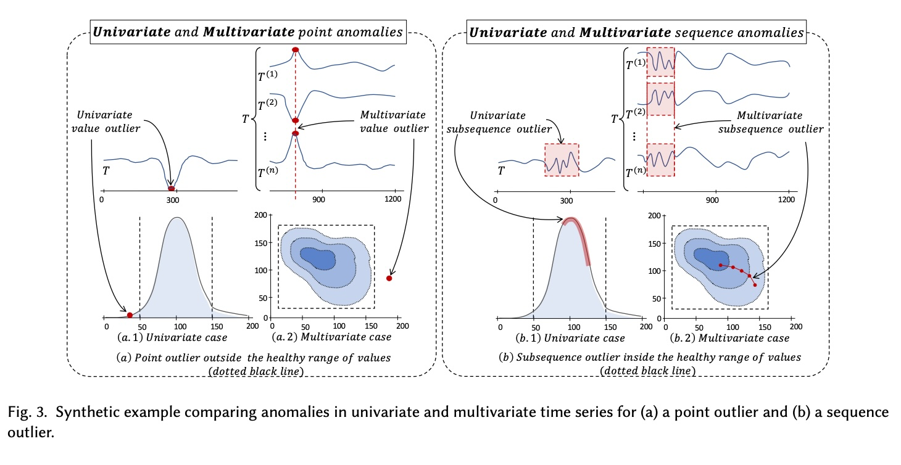  

    Fig. 3. Synthetic example comparing anomalies in univariate and multivariate time series for (a) a point outlier and (b) a sequence outlier.

      * **左侧 (a.1, b.1)** 是单变量情况，数据只有一条线。
      * **右侧 (a.2, b.2)** 是多变量情况，数据由多条线（多个维度）组成。一个多变量异常可能在任何单个维度上看都是正常的，但组合起来却是不正常的。

  * **子序列 (Subsequence)**
    这是许多算法的基本处理单元。它指的是从一个长的时间序列中截取出来的 **一小段连续的片段**，通常通过一个“滑动窗口”来获得。例如，从一整天的心电图数据中，取出任意连续5秒的数据就是一个子序列。

### 2\. 异常的类型 (The Problem)

理解了数据，我们再来看要解决的问题：什么是“异常”？论文将异常清晰地分为了三类，这对于理解不同算法的设计目标至关重要。

论文中的 **图2** 直观地展示了这三种类型： 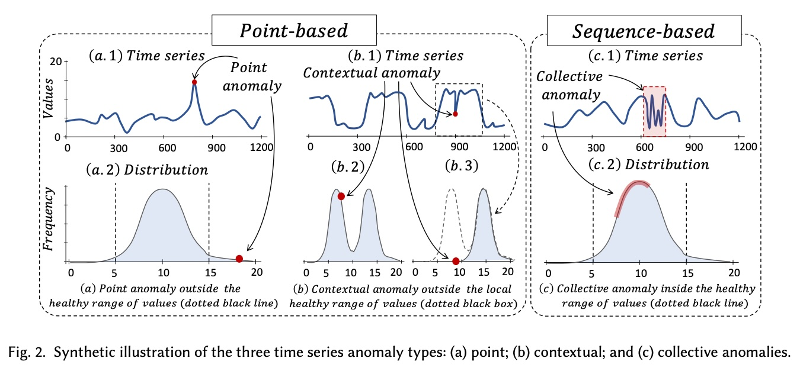   

Fig. 2. Synthetic illustration of the three time series anomaly types: (a) point; (b) contextual; and (c) collective anomalies.

  * **(a) 点异常 (Point Anomaly)**: 一个数据点的值远远偏离了正常范围 。如图(a)所示，那个突然的尖峰，其数值远超其他数据点。

  * **(b) 上下文异常 (Contextual Anomaly)**: 一个数据点在其自身局部环境（上下文）中显得不正常，但如果单独看它的数值，可能在全局范围内是正常的 。如图(b)所示，那个红点的值在整个序列的取值范围之内（看b.2的全局分布），但在它所处的那个“低谷”时期，这个值就显得异常地高（看b.3的局部自分布）。

  * **(c) 集体异常 (Collective Anomaly)**: 一连串的数据点作为一个整体，形成了一种罕见或从未出现过的模式，即使每个单独的点看起来都正常 。如图(c)所示，那段红色的快速振荡序列，虽然每个点的值都在正常范围内，但这种模式本身是异常的。

### 3\. 核心检测思想与机器学习方法 (The Solutions)

这是论文的核心部分。论文将海量的算法归纳为三大类，构成了一个清晰的分类体系（Taxonomy）。理解这三大类背后的基本思想，是读懂论文的关键。

论文的 **图5** 是这个分类体系的总览图： 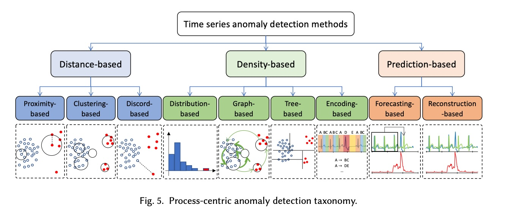   

Fig. 5. Process-centric anomaly detection taxonomy.
  

#### A. 基于距离 (Distance-based) 的方法

  * **核心思想**: “离群索居”就是异常。一个数据点（或子序列）如果离它的大多数邻居都非常远，那它很可能就是异常。
  * **需要的基础知识**:
      * **距离/相似度度量**: 最简单的是 **欧几里得距离**（两点间的直线距离）。对于时间序列，还有更高级的如 **动态时间规整 (DTW)**，它能处理序列间的拉伸和错位，在时间序列领域非常重要。
      * **K-近邻 (k-NN)**: 一个基础的机器学习概念。对于一个点，找到离它最近的K个邻居。基于距离的方法会计算这个点到它第K个邻居的距离，距离越大，越可能是异常 。
      * **聚类 (Clustering)**: 比如 **k-means** 算法。它的目标是把数据分成几个簇（cluster）。异常可以被定义为：不属于任何簇的点，或者离所属簇的中心非常远的点 。

#### B. 基于密度 (Density-based) 的方法

  * **核心思想**: “地广人稀”之处就是异常。异常点位于数据空间中密度非常低的区域。
  * **需要的基础知识**:
      * **数据分布/直方图**: 正常的点都集中在数据分布的高密度区域，而异常点则落在分布的“尾巴”上，即低概率区域 。
      * **树模型 (Tree-based)**: 以 **孤立森林 (Isolation Forest)** 为代表。它的直觉是：异常点因为“孤立”，所以很容易被“切分”出来。在一棵随机构建的树中，异常点通常只需要很少几次划分就能被独立出来，因此它在树中的路径很短 。
      * **编码/降维 (Encoding-based)**: 以 **主成分分析 (PCA)** 为代表。核心思想是，正常的数据通常具有内在的结构，可以用更低维度的信息来表示（编码）。如果一个数据点无法被很好地压缩和重构，说明它不符合这个正常结构，从而产生很大的“重构误差”，被认为是异常 。

#### C. 基于预测 (Prediction-based) 的方法

  * **核心思想**: “出乎意料”就是异常。如果一个模型根据历史数据无法准确预测到某个未来的值，那么这个实际发生的值就可能是异常。
  * **需要的基础知识**:
      * **时间序列预测模型**: 如传统的ARIMA模型，或更现代的深度学习模型。

      * **深度学习 - 循环神经网络 (RNN) / LSTM**: LSTM (长短期记忆网络) 特别擅长学习序列数据中的长期依赖关系，是时间序列预测的常用模型 。模型在正常的历史数据上进行训练，然后用它来预测下一个时间点的值。**预测值与真实值的差（即预测误差）** 就成了异常分数。误差越大，越可能是异常 。

      * **深度学习 - 自编码器 (Autoencoder)**: 这是一种无监督的神经网络。它由一个“编码器”和一个“解码器”组成。编码器将输入数据压缩成一个低维的“潜在表示”，解码器再尝试从这个潜在表示中恢复出原始数据 。模型在正常数据上训练后，它就学会了如何“优雅地”压缩和解压正常模式。当一个异常数据输入时，模型会“手忙脚乱”，无法很好地重构它，导致 **原始输入和重构输出之间存在巨大差异（重构误差）**，这个误差就作为异常分数 。

        **图18** 清晰地展示了自编码器的工作流程： 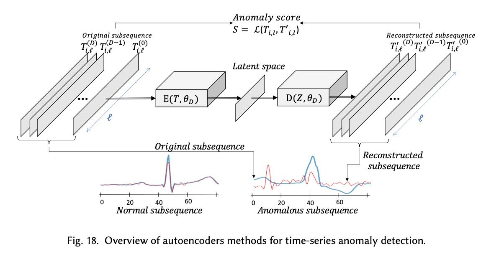   
          

      * **深度学习 - 生成对抗网络 (GAN)**: 由一个“生成器”和一个“判别器”组成，两者相互博弈 。在异常检测中，生成器学习生成“逼真的正常数据”，判别器学习区分“真实正常数据”和“生成的正常数据”。训练好后，当一个真实数据输入时，如果判别器觉得它“很假”（不像正常数据），或者生成器无法找到一个合适的潜在编码来重构它，那么这个数据就被认为是异常 。

### 4\. 模型评估方法 (The Measurement)

知道了如何检测，最后一步就是如何评价一个方法的好坏。

  * **监督、半监督、无监督 (Supervised, Semi-supervised, Unsupervised)**

      * **无监督**: 算法在没有任何标签（不知道哪些是异常）的数据上运行，完全靠自己发现异常 。这是最常见也最具挑战性的场景。
      * **半监督**: 算法只在“正常”数据上进行训练，学习什么是正常模式。任何不符合这个模式的都被认为是异常 。基于预测的方法大多属于此类。
      * **监督**: 算法同时在有标签的正常数据和异常数据上进行训练。这本质上是一个分类问题，但在异常检测中较少见，因为异常样本通常稀少且多样。

  * **评估指标 (Evaluation Metrics)**

      * **基础概念**: **真阳性 (TP)**-把异常正确判为异常, **假阳性 (FP)**-把正常错误判为异常, **真阴性 (TN)**-把正常正确判为正常, **假阴性 (FN)**-把异常错误判为正常。
      * **精确率 (Precision)**: `TP / (TP + FP)`，在你所有报警为“异常”的样本中，有多少是真的异常？
      * **召回率 (Recall)**: `TP / (TP + FN)`，在所有真正的异常中，你成功找出了多少？
      * **F1-Score**: 精确率和召回率的调和平均数，一个综合指标。
      * **AUC-ROC 曲线**: 这是一个非常重要的 **不依赖于阈值** 的评估指标。算法通常输出一个异常分数，我们需要设定一个阈值来判断是否为异常。但阈值不同，精确率和召回率也不同。ROC曲线通过绘制不同阈值下的“真阳性率 (TPR)” vs “假阳性率 (FPR)”来全面评估模型性能，而 **AUC (Area Under the Curve)** 就是这条曲线下的面积，面积越大，模型性能越好 。

    论文的 **图22** 对评估指标进行了可视化，特别是(b.1)展示了ROC曲线的样子： 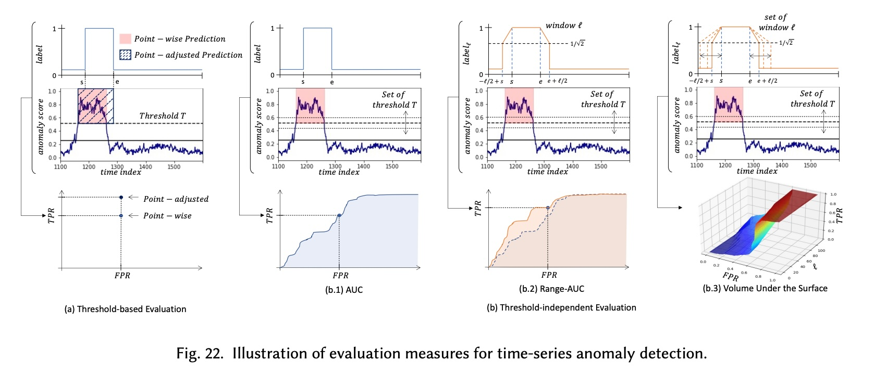   

-----

### 总结

在阅读这篇论文之前，您需要建立以下知识框架：

1.  **数据层面**: 能区分单变量和多变量时间序列，并理解子序列的概念。
2.  **问题层面**: 掌握点异常、上下文异常和集体异常这三种核心异常类型的定义。
3.  **方法层面**: 对机器学习有基本认知，特别是 **距离、密度、预测** 这三种解决异常检测问题的宏观思路。并对 **k-NN、聚类、孤立森林、PCA、LSTM、自编码器** 等具体技术有初步的、直觉性的了解。
4.  **评估层面**: 理解无监督/半监督的区别，并了解 **精确率、召回率、F1-Score和AUC-ROC** 等核心评估指标的含义。

掌握了这些基础知识后，您就可以轻松地跟随论文的脉络，理解其对各种算法的分类、介绍、比较和未来的展望了。祝您阅读愉快！
  
## 2 解读论文 
  
好的，這就為您通俗易懂地解讀《Dive into Time-Series Anomaly Detection: A Decade Review》這篇重要的綜述論文。

### 論文概述：我們為什麼需要這篇「十年回顧」？

想像一下，時間序列數據（Time-Series Data）就像是記錄我們世界心跳的節律，從你的心電圖、股票市場的波動，到伺服器的運行日誌，無處不在 。然而，這些「心跳」有時會出現異常的「顫動」，這就是「異常」（Anomaly）。檢測出這些異常至關重要，它可能意味著金融欺詐、設備即將故障或是網路攻擊 。

在過去的幾十年裡，無數的科學家和工程師提出了各種各樣的檢測方法 。然而，這些方法就像是來自不同門派的武功祕籍，門派林立、招式繁雜，卻又各自為戰，缺乏統一的評估標準和方法論 。

這篇論文的核心貢獻就在於，它像一位武林盟主，**系統性地整理了近十年來時間序列異常檢測領域的各種「武功祕籍」，並提出了一個清晰、以流程為核心的分類法（Taxonomy）**，幫助研究者們理解不同方法的內在邏輯、演進趨勢以及如何客觀地評價它們的優劣 。

-----

### 關鍵內容深度解析

#### 1\. 核心概念：什麼是時間序列中的「異常」？

在深入探討檢測方法之前，論文首先明確了幾個基本概念，這對於理解後續內容至關重要。

##### 異常的三種類型 (Types of Anomalies)

論文將異常分為三種主要類型，並用圖2進行了生動的展示 。     

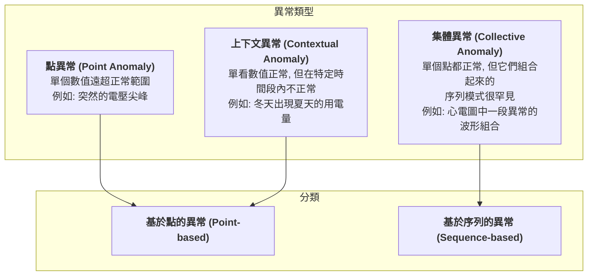

  * **點異常 (Point Anomalies)**: 指單個數據點的數值遠遠偏離了數據的正常範圍 。如圖2(a)所示，那個尖峰的值顯著高於其他所有點 。
  * **上下文異常 (Contextual Anomalies)**: 指數據點的數值本身在全局範圍內是正常的，但在其特定的「上下文」（例如，某個時間窗口）中卻是異常的 。如圖2(b)所示，那個紅點的值在整個數據分佈中不算離群，但在它所在的那段低谷中卻顯得格外出挑 。
  * **集體異常 (Collective Anomalies)**: 指一連串的數據點，雖然每個點單獨看可能都正常，但它們組合在一起形成的模式卻是異常的 。如圖2(c)所示，那段快速震盪的紅色序列，其數值範圍和正常數據重疊，但其「形狀」或「模式」是從未見過的 。

論文將前兩者歸為**基於點的異常 (point-based)**，將第三種歸為**基於序列的異常 (sequence-based)** 。

##### 其他重要區分

  * **單變量 vs. 多變量 (Univariate vs. Multivariate)**: 單變量時間序列只包含一個維度的觀測值（如單支股票的價格） 。多變量則包含多個維度（如一個系統的CPU、內存、磁盤I/O等多個指標） 。檢測多變量異常更複雜，因為單個維度可能看起來正常，但組合起來卻是異常的 。
  * **無監督、半監督 vs. 監督 (Unsupervised, Semi-supervised vs. Supervised)**:
      * **無監督**: 在完全沒有任何標籤（不知道哪些是異常）的情況下進行檢測 。
      * **半監督**: 只擁有「正常」數據的標籤，模型從中學習什麼是正常，然後將不符合正常模式的數據判斷為異常。這是最常見的情況 。
      * **監督**: 同時擁有「正常」和「異常」兩類數據的標籤，問題轉化為一個分類問題 。

#### 2\. 核心架構：以流程為中心的檢測方法分類法

這是本篇論文最核心的貢獻。作者提出，幾乎所有的異常檢測算法都可以被歸納到一個四步走的通用流程中，並以此為基礎，將方法分為三大類。

##### 通用檢測流程 (Anomaly Detection Pipeline)

如圖4所示，這個流程包含四個環節 ： 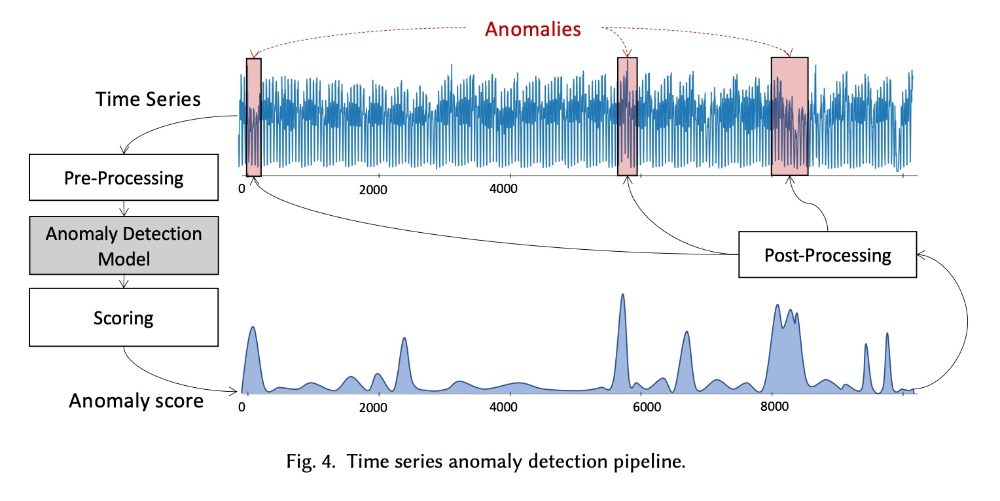   

1.  **預處理 (Pre-Processing)**: 將原始時間序列轉換為模型可以處理的形式，最常見的是使用滑動窗口將長序列切成許多等長的子序列 。
2.  **異常檢測模型 (Anomaly Detection Model)**: 這是核心步驟，應用具體的算法來分析預處理後的數據 。
3.  **評分 (Scoring)**: 模型為每個時間點或子序列生成一個「異常分數」 。分數越高，代表異常的可能性越大。
4.  **後處理 (Post-Processing)**: 根據異常分數，通過設定一個閾值來最終判定哪些點或區間是異常 。

##### 三大方法類別 (The Three Main Categories)

基於上述流程，論文將所有方法歸納為三大門派，如圖5所示 。    

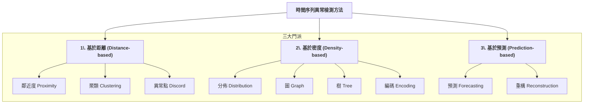

**1. 基於距離的方法 (Distance-based Methods)** 

  * **核心思想**: 「離群索居者，必有異。」 這類方法直接在原始數據上計算子序列之間的距離。如果一個子序列與它的大多數鄰居都相距甚遠，那它很可能就是異常 。
  * **子類別**:
      * **鄰近度 (Proximity-based)**: 如k-NN（K近鄰）和LOF（局部離群因子），計算一個點到其鄰居的距離來判斷其孤立程度 。
      * **聚類 (Clustering-based)**: 如k-Means和DBSCAN，先將子序列進行聚類，那些不屬於任何簇或離簇中心很遠的點被視為異常 。
      * **異常點 (Discord-based)**: 這是為時間序列量身定做的。它尋找一種被稱為「Discord」的特殊子序列，即與其最相似的鄰居的距離是所有子序列中最大的那個 。**Matrix Profile**是這個領域的代表性技術，它高效地計算了每個子序列到其最近鄰的距離，從而能快速發現Discord 。

**2. 基於密度的方法 (Density-based Methods)** 

  * **核心思想**: 「物以類聚，人以群分。」 這類方法不直接使用原始數值，而是先將數據轉換成一種能夠衡量「密度」的複雜表示，然後在低密度區域中尋找異常 。
  * **子類別**:
      * **分佈 (Distribution-based)**: 假設正常數據服從某種統計分佈（如高斯分佈），然後檢測不符合該分佈的點。OCSVM（單類支持向量機）是一個典型例子，它試圖找到一個超平面，將所有正常數據點包裹起來 。
      * **樹 (Tree-based)**: **Isolation Forest（孤立森林）** 是最著名的方法。它的邏輯很巧妙：異常點因為稀少且特徵值特殊，所以更容易被「孤立」出來。因此，在隨機構建的決策樹中，異常點通常處於較淺的層級 。
      * **圖 (Graph-based)**: 將時間序列中的模式和轉移關係轉換為圖結構，圖中的罕見路徑或孤立節點對應著異常 。
      * **編碼 (Encoding-based)**: 將時間序列壓縮或編碼成符號序列，然後利用信息論（如Kolmogorov複雜度）或馬爾可夫模型等方法來發現異常模式 。

**3. 基於預測的方法 (Prediction-based Methods)** 

  * **核心思想**: 「以史為鑑，可知興替。」 這類方法假設時間序列的行為是可預測的。它們用正常的歷史數據訓練一個模型，讓模型學會「預測未來」或「重構當前」。當模型遇到一個真實的、它無法準確預測或重構的數據點時，就認為這是一個異常 。這類方法在近年來隨著深度學習的興起而變得非常流行 。
  * **子類別**:
      * **預測 (Forecasting-based)**: 利用歷史數據預測下一個時間點的值。預測值與真實值之間的誤差（Prediction Error）大小，就是異常分數 。經典方法有ARIMA，現代方法則大量使用**LSTM、GRU**等遞歸神經網絡 。
      * **重構 (Reconstruction-based)**: 利用 **自編碼器（Autoencoder, AE）** 或 **生成對抗網絡（GAN）** 等模型，先將輸入的子序列壓縮到一個低維度的「潛在空間」，然後再從這個壓縮表示中將其還原（重構）。模型在大量正常數據上訓練後，善於重構正常模式。當輸入一個異常子序列時，重構效果會很差，導致重構值與原始值之間產生巨大誤差（Reconstruction Error），這個誤差就是異常分數 。

#### 3\. 趨勢分析：方法如何隨時間演進？

論文進行了元分析（Meta-analysis），揭示了一些有趣的趨勢 。 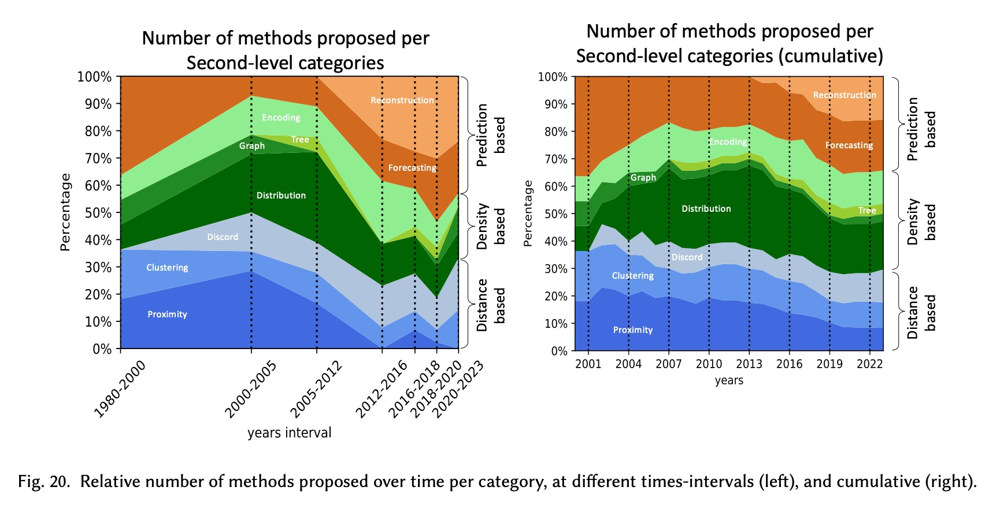   

  * **方法的井噴**: 如圖20所示，2016年之後，異常檢測論文的數量急劇增加，這主要由**基於預測的深度學習方法**（特別是LSTM和AE）所驅動 。 
  * **從多變量到單變量**: 一個令人驚訝的發現是，儘管現實世界中多變量數據很常見，但近年來新提出的方法更多是針對單變量時間序列的。作者認為這可能是因為子序列異常在多變量場景下的定義更為困難和複雜 。
  * **監督方法的演變**: 早期研究中無監督方法佔主導地位，而現在半監督方法（即假設有乾淨的正常數據用於訓練）變得越來越普遍 。

#### 4\. 評估與基準：如何客觀評價一種方法？

這是該領域的一個長期痛點。論文強調，沒有「銀彈」（即在所有場景下都最好的方法），且評估標準混亂 。

  * **基準數據集 (Benchmarks)**: 論文列舉了多個公開的基準數據集，如NAB、Yahoo，以及更新、更全面的TSB-UAD和TSB-AD等，呼籲研究者在這些公共平台上進行公平比較 。
  * **評估指標的陷阱**:
      * **傳統指標 (Precision, Recall, F-Score)**: 這些指標依賴於閾值的設定，且在處理連續的異常區段時存在問題。論文特別提到了「點調整 (point adjustment)」策略的弊端：只要檢測到異常區間中的任何一個點，就算整個區間都被成功檢測，這會嚴重高估算法的性能 。
      * **更優的指標**:
          * **AUC-ROC/AUC-PR**: 這些是與閾值無關的指標，能更全面地評估模型在所有可能閾值下的表現 。
          * **Range-AUC & VUS**: 這是論文作者自己提出的創新評估方法 。它們特別為時間序列設計，考慮到了標籤可能存在的模糊性（在異常區間邊界），並對檢測的連續性給予獎勵，從而能更準確、魯棒地評估算法性能，是作者**推薦的首選評估指標** 。

### 結論與啟示

這篇綜述清晰地描繪了時間序列異常檢測領域的全景圖。它不僅僅是方法的羅列，更重要的是提供了一個**結構化的視角**和一套**批判性的評估標準**。

對於任何想進入這個領域的研究者或實踐者來說，這篇論文都是一份極佳的「導航地圖」。它告訴我們：

1.  **理解問題是第一步**：先弄清你的數據是單變量還是多變量，異常是點狀、上下文還是集體性的。
2.  **方法選擇有章可循**：根據數據特點和是否有標籤，可以從三大類（距離、密度、預測）中尋找合適的候選方法。
3.  **評估比創新更重要**：在提出新方法之前，應使用魯棒的、為時間序列設計的評估指標（如VUS）在公認的基準上進行公平比較 。
4.  **未來方向**：該領域仍面臨挑戰，如缺乏統一的黃金標準基準、需要研究如何自動選擇模型（AutoML），以及如何更好地處理多變量、流式、有缺失值的複雜真實場景 。
  
## 3 术语  
  
好的，這就為您提取並講解《Dive into Time-Series Anomaly Detection: A Decade Review》論文中的核心術語。

### 基礎概念術語

#### 1\. 時間序列異常 (Time-Series Anomaly)

  * **英文**: Anomaly / Outlier / Discord
  * **中文講解**: 指的是時間序列中那些不符合正常或預期行為模式的數據點或數據段 。它們的出現可能暗示著系統故障、惡意攻擊、金融欺詐等重要事件，或者是單純的數據錯誤 。

#### 2\. 異常的類型 (Types of Anomalies)

論文將異常細分為三種類型，這對於選擇合適的檢測算法至關重要 。    

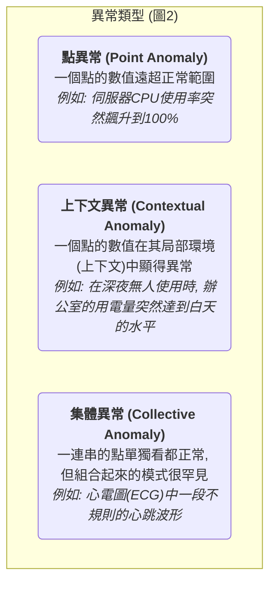

  * **點異常 (Point Anomaly)**: 單個數據點的數值顯著偏離了數據的整體分佈 。如上圖(a)，其數值遠高於正常波動範圍 。
  * **上下文異常 (Contextual Anomaly)**: 數據點的數值本身在全局來看可能不算異常，但在其特定的時間上下文（如某個季節、某天中的某個時段）中卻不正常 。如上圖(b)，雖然紅點的值在整個數據範圍內都出現過，但在那個特定的低谷區間卻是異常的 。
  * **集體異常 (Collective Anomaly)**: 指一組連續的數據點共同形成了一個異常的模式或形狀 。如上圖(c)，這段序列的每個點的值可能都在正常範圍內，但它們組合起來的快速震盪模式是異常的 。

#### 3\. 單變量與多變量時間序列 (Univariate vs. Multivariate Time Series)

  * **英文**: Univariate / Multivariate Time Series
  * **中文講解**:
      * **單變量 (Univariate)**: 在每個時間點只有一個觀測值的序列，例如單獨記錄一支股票的每日收盤價 。
      * **多變量 (Multivariate)**: 在每個時間點有多個觀測值的序列集合，例如同時記錄一個城市的溫度、濕度、風速等多個氣象指標 。檢測多變量異常更具挑戰性，因為有時單個變量看起來正常，但它們的組合卻是異常的 。

### 檢測方法分類術語

論文提出了一個以流程為核心的分類法，將現有方法分為三大類別 。

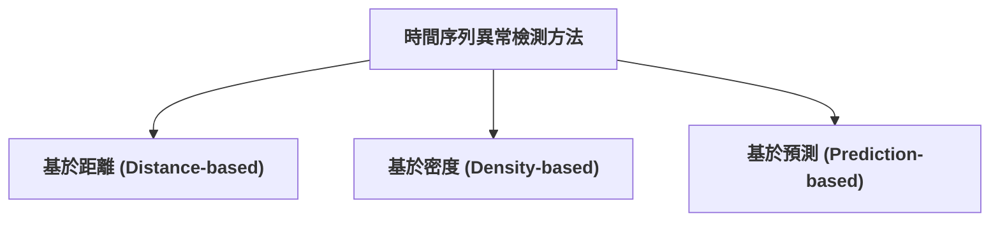

#### 4\. 基於距離的方法 (Distance-based Methods)

  * **核心思想**: 異常的子序列在特徵空間中是「孤立」的，即它與其他大多數子序列的距離都很大 。
  * **重要術語**:
      * **Discord**: 特指時間序列中的一種異常子序列。它的定義是：與其最相似的（即距離最近的）鄰居的距離，在所有子序列中是最大的 。可以理解為「最不合群」的子序列。
      * **Matrix Profile (矩陣輪廓)**: 一種高效計算時間序列中每個子序列與其最近鄰居之間距離的數據結構 。通過查找Matrix Profile中的最大值，可以快速、準確地定位到Discord 。

#### 5\. 基於密度的方法 (Density-based Methods)

  * **核心思想**: 異常點或子序列位於數據空間的低密度區域 。這類方法首先估計數據的密度分佈，然後將處於稀疏區域的樣本標記為異常。
  * **重要術語**:
      * **Isolation Forest (孤立森林)**: 一種高效的異常檢測算法 。其基本假設是：異常點因為數量稀少且特徵值特殊，所以比正常點更容易被「孤立」出來 。在隨機構建的決策樹（iTree）中，異常點通常只需要很少幾次分割就能被分離到一個葉子節點，因此它們的路徑長度通常很短 。

#### 6\. 基於預測的方法 (Prediction-based Methods)

  * **核心思想**: 正常的時間序列行為是可以學習和預測的 。如果一個模型在正常的歷史數據上訓練後，無法準確預測或重構某個時間點的數據，那麼該點就很可能是異常的 。
  * **重要術語**:
      * **Forecasting-based (基於預測)**: 這類方法訓練一個模型（如ARIMA、LSTM）來根據歷史數據預測未來的一個或多個值 。**預測誤差 (Prediction Error)**，即預測值與真實值之間的差異，被用作異常分數 。誤差越大，異常的可能性越高。
      * **Reconstruction-based (基於重構)**: 這類方法通常使用自編碼器（Autoencoder, AE）或生成對抗網絡（GAN）等深度學習模型 。模型學習將正常的輸入子序列壓縮（編碼）成一個低維表示，然後再將其解壓（解碼）以重構原始輸入 。由於模型只在正常數據上訓練，它不擅長重構異常模式，因此**重構誤差 (Reconstruction Error)** 會很大，這個誤差就成了異常分數 。

### 評估與基準術語

#### 7\. 評估指標的陷阱與改進

  * **Point Adjustment (點調整)**: 一種在評估時常用的技巧。在一個連續的真實異常區間內，只要檢測算法標記了其中任何一個點為異常，該策略就認為整個異常區間都被成功檢測了 。論文批評這種方法會極大地**高估**算法的真實性能，甚至一個隨機猜測的算法也可能得到看似不錯的分數 。

  * **Range-AUC (範圍AUC)**: 為了克服傳統AUC指標在時間序列上的局限性，論文作者提出的一種改進指標 。它通過在真實異常區間的邊界設置一個「緩衝區」，並將二元標籤（0或1）替換為連續值，來更好地處理標籤的模糊性以及檢測的延遲，從而更公平地評估對序列異常的檢測效果 。

  * **Volume Under the Surface (VUS, 曲面下體積)**: Range-AUC的一個無參數、更魯棒的擴展版本 。它通過計算在所有可能的緩衝區長度下的Range-AUC，形成一個三維曲面，並計算該曲面下的體積 。VUS被認為是評估時間序列異常檢測算法時非常可靠和推薦的指標，因為它同時具備閾值無關和參數無關的優點 。
  
## 参考        
         
https://arxiv.org/pdf/2412.20512    
        
<b> 以上内容基于DeepSeek、Qwen、Gemini及诸多AI生成, 轻微人工调整, 感谢杭州深度求索人工智能、阿里云、Google等公司. </b>        
        
<b> AI 生成的内容请自行辨别正确性, 当然也多了些许踩坑的乐趣, 毕竟冒险是每个男人的天性.  </b>        
  
  
