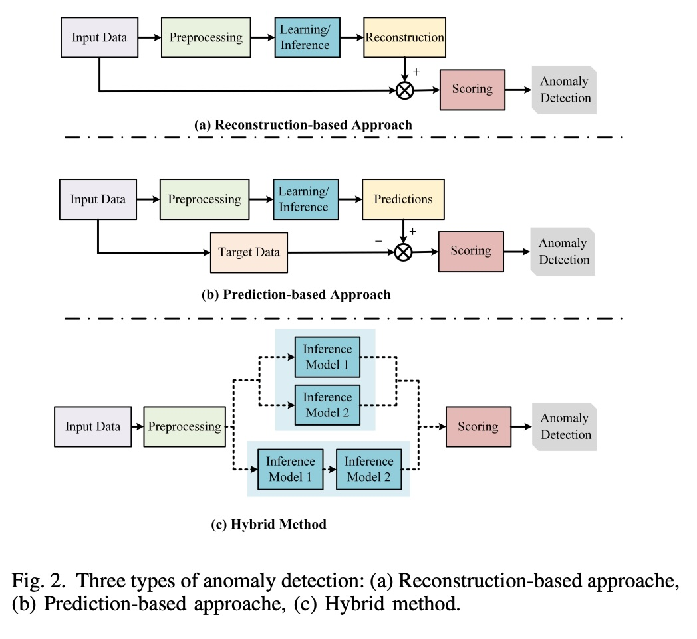
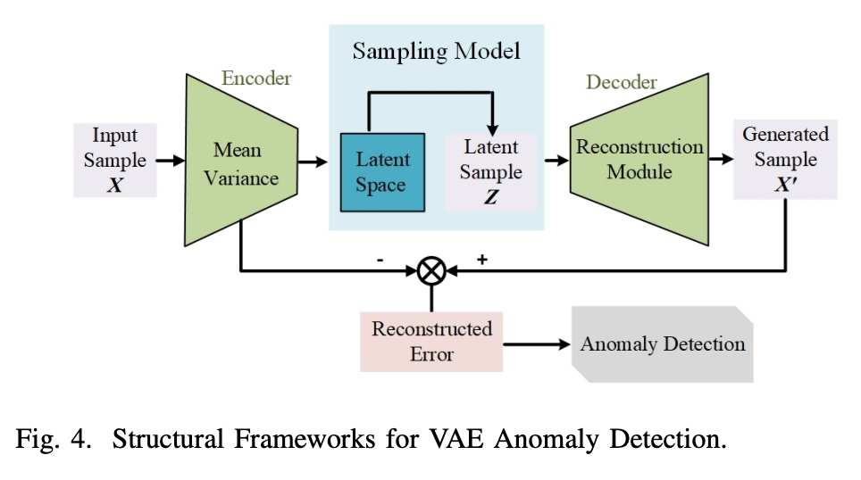
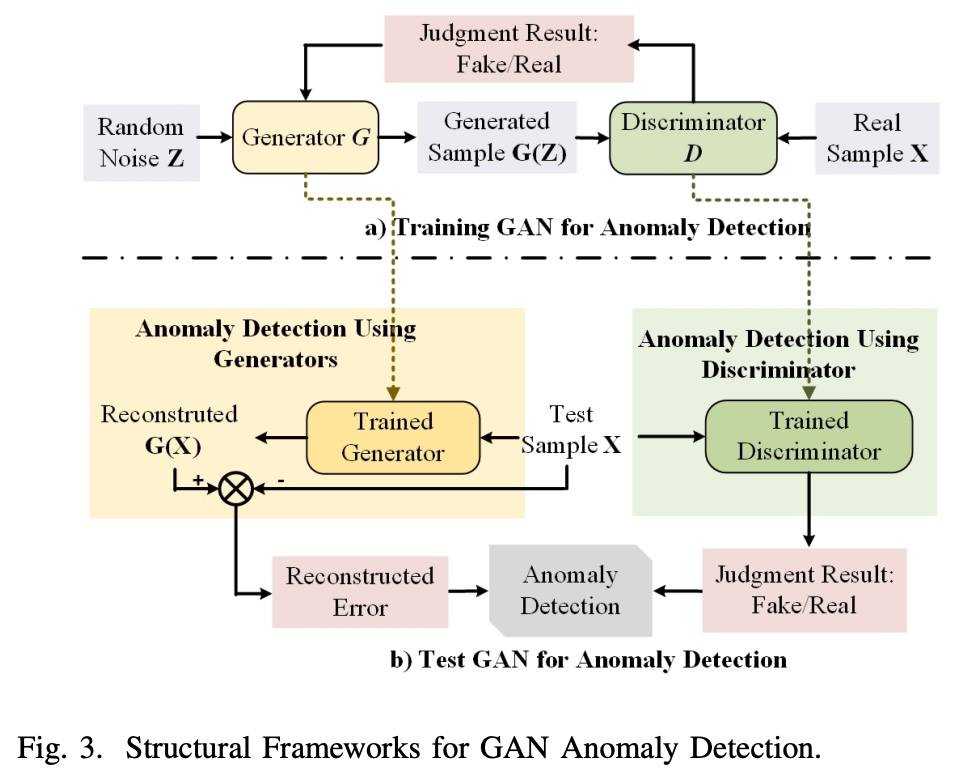
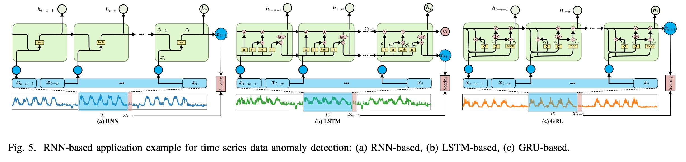
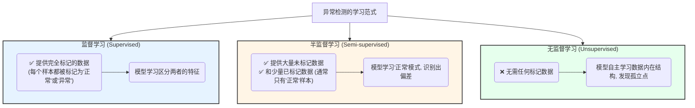
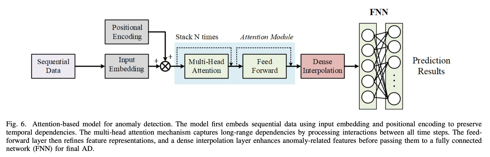
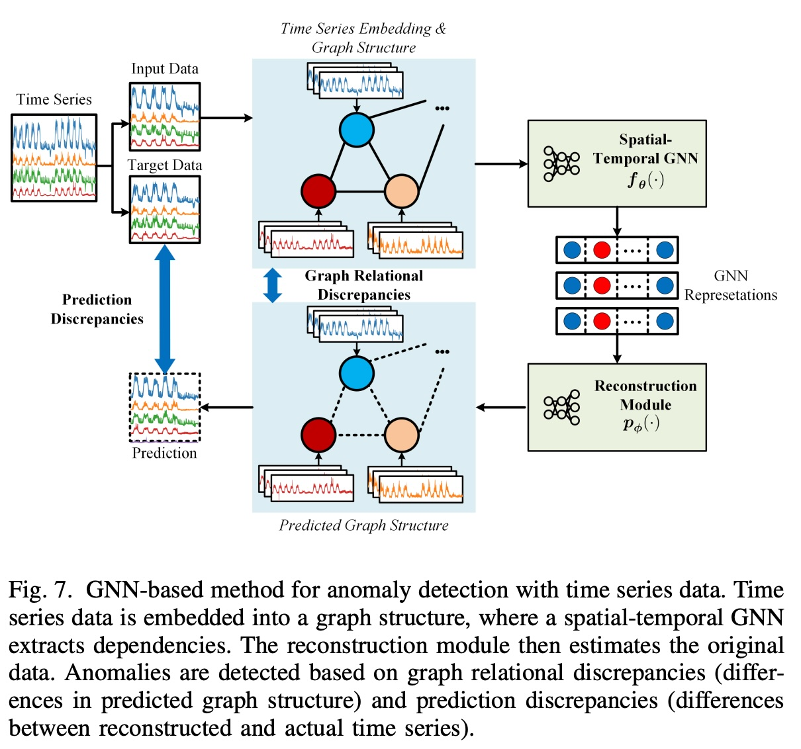

## AI论文解读 | Deep Learning Advancements in Anomaly Detection: A Comprehensive Survey
        
### 作者        
digoal        
        
### 日期        
2025-07-26       
        
### 标签        
PostgreSQL , PolarDB , DuckDB , AI , 论文解读        
        
----        
        
## 背景  
      
https://arxiv.org/pdf/2503.13195        
  
提示:          
```          
读懂《Deep Learning Advancements in Anomaly Detection: A Comprehensive Survey》这篇论文需要提前掌握哪些基础知识, 请使用中文通熟易懂的讲解这些基础知识, 可以引用论文中的图、表或使用Markdown支持的图形(text,mermaid等)增加解释性. 
  
使用中文通熟易懂的解读《Deep Learning Advancements in Anomaly Detection: A Comprehensive Survey》这篇论文, 其中的关键内容请着重讲解, 可以引用论文中的图、表或使用Markdown支持的图形(text,mermaid等)增加解释性. 
  
提取《Deep Learning Advancements in Anomaly Detection: A Comprehensive Survey》这篇论文中的重要术语, 使用中文对这些术语进行通熟易懂的讲解, 可以引用论文中的图、表或使用Markdown支持的图形(text,mermaid等)增加解释性. 
```     
  
## 1 前置知识 
  
好的，为了帮助您更好地理解《Deep Learning Advancements in Anomaly Detection: A Comprehensive Survey》这篇论文，我将为您梳理阅读前需要掌握的基础知识。我会用通俗易懂的中文进行讲解，并引用论文中的图表来增强解释性。

这篇论文是一篇综述性文章，全面回顾了基于深度学习的异常检测（Anomaly Detection, AD）技术。要读懂它，您需要具备以下几个方面的知识：

1.  **核心概念：什么是异常检测？**
2.  **机器学习基础：监督、半监督与无监督学习**
3.  **深度学习核心模型：论文中反复出现的“主角们”**
4.  **传统机器学习方法：作为对比和融合的对象**
5.  **数据类型与挑战：异常检测的应用场景**

-----

### 1\. 核心概念：什么是异常检测 (Anomaly Detection, AD)？

您可以将“异常”理解为数据中的“异类”或“不速之客”。

  * **定义**：一个异常指的是与系统中预期行为显著偏离的观测结果，它通常表现为不寻常、不一致或出乎意料 。简单说，就是在一大堆“正常”数据中找出那些“不正常”的少数派。
  * **重要性**：这些“少数派”虽然数量少，但往往携带关键信息，可能预示着系统故障、网络安全漏洞或金融欺诈等重要事件 。
  * **异常的种类**：
      * **点异常 (Point Anomalies)**：单个数据点就是个异类。比如，在一群走路的人中，突然有一个人飞起来了。
      * **上下文异常 (Contextual Anomalies)**：在特定情境下才算异常。比如，夏天穿羽绒服是异常，但冬天穿就是正常的。
      * **子序列异常 (Subsequence Anomalies)**：一连串的数据表现异常，常见于时间序列数据。比如，心电图突然出现一段不规律的剧烈波动。

-----

### 2\. 机器学习基础：三种“学习范式”

论文中根据“是否需要标签”将异常检测方法分为了三类 。标签就像是给数据贴上了“正常”或“异常”的答案。

  * **监督学习 (Supervised Learning)**

      * **原理**：需要一个“标准答案”完整的数据集，其中每个数据点都被明确标注为“正常”或“异常” 。模型通过学习这些带标签的样本，学会区分两者的差异。
      * **挑战**：在异常检测中，异常样本通常非常稀少且难以获取，导致数据类别极不平衡 ，这使得监督学习的应用受限。

  * **半监督学习 (Semi-supervised Learning)**

      * **原理**：使用大量未标记数据和一小部分有标记数据进行训练 。通常，我们只拥有标记好的“正常”数据。模型学习正常数据的模式，然后将不符合这个模式的数据识别为异常。

  * **无监督学习 (Unsupervised Learning)**

      * **原理**：完全不需要任何标签 。这是论文和现实应用中最主流的方法 。模型直接从数据本身出发，学习其内在结构和分布规律，然后找出那些与整体分布格格不入的数据点。
      * **优势**：完美避开了标注数据既昂贵又困难的问题 。

**小结**：由于异常的稀有性和标注难度，**无监督学习是异常检测领域的主流**，这也是为什么论文中大部分方法都属于这一类。

-----

### 3\. 深度学习核心模型：“主角们”

这篇论文的重点是深度学习方法，它们的核心优势在于能自动从复杂、高维度的数据中学习有用的特征，而无需繁琐的人工特征工程 。论文将这些方法分为三大类，如下图所示：
  
  
  
图引用自论文 Fig. 2 ：(a) 基于重构的方法, (b) 基于预测的方法, (c) 混合方法。

#### 3.1 基于重构 (Reconstruction-based) 的方法

这类方法是无监督学习的典型代表。

  * **核心思想**：用一个“编码-解码”模型，只学习“正常”数据的模式。在检测时，输入一个数据，让模型尝试“重构”（复原）它。

      * 如果输入是**正常**数据，模型能很好地复原它，重构误差（原数据与复原数据的差异）很小。
      * 如果输入是**异常**数据，模型因为它没见过，所以复原得很差，重构误差会很大。
      * 通过设定一个误差阈值，就能判断是否异常 。

  * **关键模型**：

      * **自编码器 (Autoencoder, AE) 和 变分自编码器 (Variational Autoencoder, VAE)**：

          * 这是最经典的重构模型。AE包含一个编码器（将数据压缩成低维度的“精华”特征）和一个解码器（将“精华”特征还原成原始数据）。VAE在此基础上增加了概率思想，使得生成的特征分布更规整，泛化能力更强 。
          * 下图展示了VAE的工作流程：输入样本X，经过编码器得到一个包含均值和方差的潜在空间（Latent Space），从中采样出Z，再由解码器重构出X'。通过计算X和X'的重构误差来检测异常。

          

        图引用自论文 Fig. 4 
        

      * **生成对抗网络 (Generative Adversarial Network, GAN)**：

          * GANs 由一个“生成器”（Generator）和一个“判别器”（Discriminator）组成 。可以通俗地理解为“伪造者”和“警察”的博弈。
          * **伪造者 (生成器)**：学习如何制造出以假乱真的“正常”数据。
          * **警察 (判别器)**：学习如何分辨出“真数据”和“假数据”。
          * 在异常检测中，训练好的GAN有两种用法：
            1.  **利用生成器**：类似AE，用只在正常数据上训练的生成器去重构测试数据，重构误差大的即为异常 。
            2.  **利用判别器**：判别器本身就是个“异常分类器”，它对不符合正常数据分布的输入会给出“假”的判断 。

          

        图引用自论文 Fig. 3 
        

      * **扩散模型 (Diffusion Model)**：

          * 这是一个较新的模型。它通过两个过程工作：1. **前向过程**：不断地对正常图片加噪声，直到完全变成随机噪声。2. **反向过程**：学习如何从噪声中一步步把原图还原回来 。
          * 检测时，它尝试从噪声中重构测试数据，如果数据是异常的，重构效果就会很差。这类模型生成样本的质量很高，但速度较慢 。

#### 3.2 基于预测 (Prediction-based) 的方法

这类方法主要用于处理有序列关系的数据，比如时间序列。

  * **核心思想**：模型学习数据随时间变化的规律，然后根据历史数据预测未来的数据。如果预测值和真实值差异巨大，就说明发生了异常 。

  * **关键模型**：

      * **循环神经网络 (RNN) / 长短期记忆网络 (LSTM) / 门控循环单元 (GRU)**：

          * 这些是专门为处理序列数据设计的网络 。它们有一个“记忆单元”，可以记住前面的信息来帮助预测后面的内容。LSTM和GRU是RNN的改进版，解决了RNN在处理长序列时容易“遗忘”的问题 。
          * 下图展示了这三种模型在时间序列数据上的应用，它们根据窗口`W`内的数据预测下一个时间点`xt+1`的值。

          

        图引用自论文 Fig. 5 
        

      * **图神经网络 (GNN)**：

          * 适用于可以表示为“图”结构的数据，图中每个点是一个节点（如一个传感器），点与点之间的连线是边（表示它们之间的关系） 。GNN能学习节点间的复杂依赖关系，从而检测出某个节点或整个图结构的异常 。

      * **注意力机制 (Attention Mechanism) / Transformer**：

          * 核心思想是让模型在做预测时，能“关注”到输入序列中最重要的部分，而不是对所有部分一视同仁 。这对于捕捉长距离依赖关系特别有效。Transformer是完全基于注意力机制构建的模型。

-----

### 4\. 传统机器学习方法：作为“前辈”和“搭档”

在深度学习流行之前，一些传统方法也被广泛使用。论文中提到了将它们与深度学习结合的“混合方法” 。

  * **聚类 (Clustering)**：把相似的数据点“聚”成一堆。那些离任何“堆”都很远、孤零零的点，就可能是异常 。
  * **支持向量数据描述 (SVDD)**：可以想象成是为“正常”数据画一个尽可能紧凑的“包围圈”（超球面）。所有掉在圈外的数据点都被视为异常 。

-----

### 5\. 数据类型与挑战

  * **数据类型**：

      * **时间序列数据**：按时间顺序排列的数据，如心电图、股票价格、传感器读数 。
      * **非时序数据**：数据点之间没有时间关系，如客户信息表、静态的图片 。
      * **视觉数据**：图片和视频，论文将其单独作为一个大类讨论，因为应用广泛且技术独特 。

  * **数据处理挑战**：

      * **高维度 (Dimensionality)**：“特征”太多，导致计算困难，这就是“维度灾难” 。
      * **稀疏性 (Sparsity)**：数据中有很多缺失值，影响模型判断 。
      * **类别不平衡 (Class Imbalance)**：正常样本远多于异常样本，模型容易“偏袒”多数类，忽略异常 。

### **总结：如何阅读这篇论文**

有了以上基础，您可以这样阅读这篇论文：

1.  **看引言 (Introduction)**：理解作者撰写这篇综述的动机，以及他们是如何对现有工作进行分类的。
2.  **看数据特征和挑战 (Data Characteristics and Challenges)**：了解异常检测面临的实际问题和数据类型。
3.  **重点阅读第四部分 (Deep Learning Methods)**：这是论文的核心。结合我上面介绍的模型基础，逐一理解基于重构和基于预测的各类方法的原理、优缺点和变体。可以参考论文中的表格（如Table I, II, III）来加深理解。
4.  **看第五部分 (Integrate Traditional Method)**：了解深度学习是如何与传统方法“强强联合”的。
5.  **看第六、七部分 (Open Issues and Conclusion)**：了解该领域目前尚未解决的难题和未来的研究方向。

希望这份基础知识梳理能帮助您顺利地读懂这篇论文！
  
## 2 解读论文 
  
好的，我们来一起通俗易懂地解读这篇关于深度学习在异常检测领域进展的综述论文。

这篇论文《Deep Learning Advancements in Anomaly Detection: A Comprehensive Survey》是对2019年至2024年间，利用深度学习进行异常检测（Anomaly Detection, AD）的近200篇研究的全面总结 。它系统地梳理了该领域的核心方法、应用、挑战和未来方向。

-----

### **核心思想：什么是异常检测？**

您可以将“异常”理解为数据中的“害群之马”或“异类”。论文指出，一个异常是指与系统预期行为显著偏离的观测结果 。这些异常虽然数量稀少，但往往预示着重要事件，如设备故障、网络攻击或金融欺诈 。

这篇论文的一个核心观点是：随着物联网（IoT）和大数据时代的发展，数据变得越来越复杂和高维，传统的统计方法已经难以胜任 。而深度学习（Deep Learning）因其强大的模式学习能力，已成为异常检测领域的主力军 。

-----

### **两大主流方法：重构与预测**

论文将深度学习异常检测方法分为两大主流：**基于重构（Reconstruction-based）** 和 **基于预测（Prediction-based）**，此外还有结合两者的**混合方法（Hybrid Method）**。

我们可以通过下面这张引自论文的流程图来直观理解：
  
  

图源：论文 Fig. 2 
  

  * **(a) 基于重构的方法**：模型学习“正常”数据的样子。当输入一个新数据时，它会尝试“重画”（重构）这个数据。如果新数据是正常的，模型能画得很像，**重构误差**就小；如果是异常的（模型没见过），就画不像，误差会很大。通过判断误差大小来发现异常 。
  * **(b) 基于预测的方法**：模型学习数据的演变规律（尤其是时间序列数据）。它根据过去的数据预测未来的值。如果预测值和实际值差很多，即**预测误差**很大，就说明可能发生了异常 。
  * **(c) 混合方法**：将多种模型组合起来，取长补短，以达到更好的检测效果 。

-----

### **重中之重：基于重构的核心模型**

这是当前无监督异常检测中最流行的一类方法，论文对此进行了重点介绍。

#### **1. 自编码器 (AE) / 变分自编码器 (VAE)**

这是最经典的重构模型。它像一个“数据压缩还原器”。

  * **工作原理**：它由一个**编码器**和一个**解码器**组成。编码器将输入数据压缩成一个低维度的“精华”（潜在表示），解码器再将这个“精华”还原成原始数据 。由于模型只在正常数据上训练，它只擅长压缩和还原正常数据。
  * **VAE的优势**：VAE (Variational Autoencoder) 是AE的升级版，它在压缩数据时加入的概率分布的约束（通过KL散度实现），使得潜在空间更加规整，能更好地区分正常与异常，泛化能力更强 。

  

图源：论文 Fig. 4 


#### **2. 生成对抗网络 (GAN)**

GAN可以被生动地比喻为“伪造者”和“警察”之间的博弈。

  * **核心组件**：
      * **生成器 (Generator)**：扮演“伪造者”，努力学习生成足以以假乱真的“正常”数据 。
      * **判别器 (Discriminator)**：扮演“警察”，努力学习分辨真实数据和生成器伪造的假数据 。
  * **如何用于异常检测**：
    1.  **利用生成器**：训练好的生成器是一个“正常数据制造专家”。当输入一个异常数据并让它重构时，它会“本能地”将其重构成更接近正常数据的样子，导致重构误差很大 。
    2.  **利用判别器**：训练好的判别器是一个“正常数据鉴定专家”。当给它一个异常数据时，它会大概率判定为“假”，从而识别出异常 。

  

图源：论文 Fig. 3 


#### **3. 扩散模型 (Diffusion Model)**

这是近年来非常火热的新模型，以其高质量的生成效果著称。

  * **工作原理**：
    1.  **前向过程**：不断地对一张正常图片加噪声，直到它变成完全的随机噪声 。
    2.  **反向过程**：训练一个模型，学习如何从一堆噪声中，一步步地把原始的正常图片“去噪”并还原出来 。
  * **如何用于异常检测**：它学习的是“正常”的去噪过程。对于异常数据，它的去噪和重构效果会很差，从而产生高额的重构误差 。

**模型对比小结** (信息来自论文 Table I )

| 模型 | 优点 | 缺点 |
| :--- | :--- | :--- |
| **GANs** | 能生成非常逼真的样本，对抗损失使其能学习复杂分布。 | 训练不稳定，容易模式崩溃（生成样本多样性低）。 |
| **VAEs** | 训练稳定简单，样本多样性高。 | 生成的样本通常比较模糊、保真度低。 |
| **Diffusion** | 生成样本的保真度和多样性都非常高。 | 生成速度慢，计算量巨大。 |

-----

### **另一大支柱：基于预测的核心模型**

这类方法在处理具有时间或序列关系的数据时表现出色。

#### **1. 循环神经网络 (RNN, LSTM, GRU)**

这些是为处理序列数据而生的模型。

  * **核心特点**：网络中有一个“记忆”单元（隐藏状态），可以记住前面的信息，以帮助理解和预测当前和未来的信息 。这使它们非常适合用于时间序列数据的异常检测。
  * **LSTM/GRU**：是RNN的改进版，通过引入“门控”机制，解决了RNN在处理长序列时容易“遗忘”早期信息的问题 。

  

图源：论文 Fig. 5 


#### **2. 图神经网络 (GNN)**

当数据点之间存在复杂的关联时（如传感器网络、社交网络），GNN就能大显身手。

  * **核心思想**：将每个数据实体看作图中的一个**节点**，它们之间的关系看作**边** 。GNN可以学习节点之间信息传递和聚合的模式，从而检测出某个节点或节点间关系的异常 。

-----

### **融合与创新：传统方法与深度学习的结合**

论文强调，传统方法（如聚类、SVDD）虽然在处理复杂数据上不如深度学习，但它们具有**简单、可解释性强、计算开销小**的优点 。因此，一个重要的研究方向是将两者结合：

  * **深度学习 + 聚类**：先用深度学习模型（如AE）从高维数据中提取出有效的低维特征，再对这些特征进行聚类，找出离群点 。
  * **深度学习 + SVDD**：SVDD旨在找到一个包裹住所有正常数据的最小“气泡”。深度学习可以帮助SVDD在更有效的特征空间里去画这个“气泡”，从而使边界更精确 。

-----

### **应用领域与未来挑战**

#### **主要应用场景**

  * **时间序列数据**：电力系统监控 、交通流量预测 、医疗健康（如心率监测）。
  * **非时序数据**：金融反欺诈 、网络安全入侵检测 。
  * **视觉数据**：医学影像（如X光片、CT扫描）中的病灶检测 、视频监控中的异常行为识别 。

#### **开放问题与未来方向**

论文在结尾指出了该领域仍面临的四大挑战：

1.  **数据收集**：异常数据稀少且难以标注，导致严重的类别不平衡问题 。未来的研究方向包括更先进的数据增强技术和自监督学习 。
2.  **计算复杂度**：强大的深度学习模型通常计算量巨大，难以在资源受限的设备上进行实时检测 。轻量化模型和分布式计算是未来的解决方向 。
3.  **可解释性**：深度学习模型常被称为“黑箱”，我们很难理解它为什么将某个点判断为异常 。这在医疗、金融等高风险领域是致命缺陷。提升模型的可解释性至关重要 。
4.  **处理多样化的异常**：现实世界中的异常类型多种多样（点异常、上下文异常等），而现有模型大多只能有效处理某一类。开发能够同时应对多种异常的通用模型是未来的一个重要目标 。

### **总结**

这篇论文为我们描绘了一幅深度学习赋能异常检测的全景图。它告诉我们，从经典的**自编码器**、**GAN**，到前沿的**扩散模型**，再到针对序列数据的**LSTM**和**GNN**，深度学习正以其强大的特征学习能力，不断推动异常检测技术的边界。然而，数据稀缺、计算开销、模型“黑箱”等问题依然是未来研究需要攻克的难关。将深度学习的强大能力与传统方法的可解释性相结合，是通向更稳健、更可信的异常检测系统的重要途径。
  
## 3 术语  
  
好的，这是从《Deep Learning Advancements in Anomaly Detection: A Comprehensive Survey》这篇论文中提取的重要术语及其通俗易懂的中文讲解。

### 核心概念 (Core Concepts)

#### 1\. 异常检测 (Anomaly Detection, AD)

异常检测，顾名思义，就是识别出那些与预期行为显著不符的数据、事件或观测值的过程 。这些被识别出的“异常”虽然罕见，但往往蕴含着至关重要的信息，可能预示着系统故障、网络攻击、金融欺诈等严重问题 。

可以将其理解为在一大堆苹果中找出那个“长得像梨的苹果”。这个“梨”就是异常。

#### 2\. 学习范式 (Learning Paradigms)

论文指出，根据训练数据中标签的可用性，异常检测方法可以分为三种主要范式 。



  * **监督学习 (Supervised Learning)**: 需要一个“标准答案”非常清晰的数据集，其中每个数据点都被明确标注为“正常”或“异常” 。
  * **半监督学习 (Semi-supervised Learning)**: 使用大量未标记数据和一小部分有标记的数据（通常只标记了正常样本）进行训练 。模型从已知的正常样本中学习“什么是正常的”，然后将在未标记数据中发现的、不符合这个“正常”模式的样本识别为异常。
  * **无监督学习 (Unsupervised Learning)**: 完全不需要人工标注，是目前实际应用中最主流的方法 。因为它能自主地从数据中学习固有的结构和模式，并识别出那些“格格不入”的异常点 。这在获取异常标签成本高昂或不切实际的场景中尤为重要 。

### 深度学习方法分类 (Deep Learning Approaches)

论文将深度学习异常检测方法分为三大类，其流程如论文中的图2所示 。    

  * **基于重构的方法 (Reconstruction-based)**:

      * **工作原理**: 这类方法的核心思想是训练一个模型来学习正常数据的样貌和分布 。当一个新的数据输入时，模型会尝试“重构”（或“复现”）它。如果输入是正常的，模型能很好地重构它，重构出的数据和原始数据差别很小（即“重构误差”低）。如果输入是异常的，模型由于没见过这类数据，会很难重构它，导致重构误差很高，从而被识别为异常 。
      * **比喻**: 就像一位只画过猫的画家，你让他画一只狗，他画出来的作品（重构结果）肯定和真实的狗（输入）有很大差距，这个“差距”就是重构误差。

  * **基于预测的方法 (Prediction-based)**:

      * **工作原理**: 这类方法通过学习数据中的模式来预测未来的值或缺失的属性 。如果实际观测到的值与模型的预测值有巨大差异，那么这个时间点的数据就很可能是异常的 。这在处理按时间排序的数据（如股票价格、心电图）时非常有效。
      * **比喻**: 就像天气预报预测明天晴天，结果却下起了暴雨，这个“出乎意料”的结果就是异常。

  * **混合方法 (Hybrid Method)**:

      * **工作原理**: 这种方法集两家之长，将基于重构和基于预测的技术结合在一个框架中，以期达到更强大、更全面的异常检测效果 。

### 关键模型与技术 (Key Models & Technologies)

#### 基于重构的模型

1.  **自编码器 (Autoencoder, AE) / 变分自编码器 (Variational Autoencoder, VAE)**
    AE是一种神经网络，由一个**编码器 (Encoder)** 和一个**解码器 (Decoder)** 组成 。编码器负责将输入数据压缩成一个低维的“精华”表示（潜在空间），解码器则负责从这个“精华”表示中恢复出原始数据。VAE是AE的升级版，它在潜在空间中学习数据的概率分布，而不仅仅是一个点，这使得它能更好地捕捉数据多样性，在异常检测中表现更出色 。论文中的**图4**清晰地展示了基于VAE的异常检测框架 。    

2.  **生成对抗网络 (Generative Adversarial Network, GAN)**
    GAN由两个相互竞争的神经网络组成：**生成器 (Generator)** 和**判别器 (Discriminator)** 。生成器的任务是“造假”，生成以假乱真的数据；判别器的任务是“打假”，尽力区分真实数据和生成器造的假数据。在异常检测中，GAN通常只用正常数据训练。训练完成后，如论文**图3**所示，可以通过两种方式检测异常 ：    

      * **利用生成器**: 由于生成器只会生成正常数据，当输入一个异常样本时，它的重构效果会很差，产生高额的重构误差 。
      * **利用判别器**: 判别器已经学会了识别“真”的正常数据，因此当它看到一个异常样本时，有很大概率会将其判断为“假”的 。

3.  **扩散模型 (Diffusion Models)**
    这是一种新兴且非常强大的生成模型。它的工作过程分为两步，如下图所示：

    ```mermaid
    sequenceDiagram
        participant A as 原始数据
        participant B as 逐步加噪过程 (Forward Process)
        participant C as 纯噪声
        participant D as 逐步去噪过程 (Reverse Process)
        participant E as 重构/生成数据

        A->>B: 原始正常数据
        B->>C: 逐步添加高斯噪声
        Note over B,C: 将数据完全破坏成噪声
        C->>D: 学习如何逆转加噪过程
        D->>E: 从噪声中逐步恢复数据
        Note over D,E: 学习正常数据的分布
    ```

    在异常检测中，模型在正常数据上训练这个去噪过程 。当测试一个新样本时，模型会评估其重构这个样本的能力，异常样本同样会导致较高的重构误差 。相比于GAN和VAE，扩散模型通常能生成质量更高、更多样的样本，避免了GAN的“模式崩溃”和VAE的“图像模糊”问题 。论文中的**表I**对这几类模型进行了详细的优缺点对比 。

#### 基于预测的模型

1.  **循环神经网络 (RNN) / LSTM / GRU**
    RNN是为处理序列数据（如时间序列）而设计的网络 。它拥有“记忆”，可以将前一步的信息传递到当前步 。但基础RNN在处理长序列时会遇到困难（梯度消失/爆炸）。为此，更高级的变体如**长短期记忆网络 (LSTM)**  和**门控循环单元 (GRU)**  被提出，它们通过内部精巧的“门”结构来更好地控制信息流动，从而捕捉长期依赖关系。论文中的**图5**直观地展示了它们在时序数据异常检测中的应用 。    

2.  **注意力机制 (Attention Mechanism) / Transformer**
    注意力机制允许模型在做决策时，对输入的不同部分赋予不同的“关注度”权重 。基于该机制构建的**Transformer**模型，能够并行处理整个序列，而不是像RNN那样按部就班地处理，这使其在捕捉序列中的长距离依赖关系时极为有效且高效 。论文**图6**展示了基于注意力机制的AD模型结构 。    

3.  **图神经网络 (Graph Neural Network, GNN)**
    GNN专为图结构数据（由节点和连接节点的边组成）而设计 。在很多场景下，数据可以自然地表示为图。例如，一个系统中的多个传感器可以看作是节点，它们之间的物理或逻辑关系可以看作是边 。GNN能够对这种复杂的关联关系进行建模，从而检测出涉及多个实体或数据结构变化的异常 。论文**图7**展示了GNN如何应用于时序数据的异常检测 。    

### 数据层面的挑战 (Data Challenges)

1.  **维度诅咒 (Curse of Dimensionality)**
    指当数据特征维度（变量数量）非常高时，出现的一系列问题 。在高维空间中，数据点会变得异常稀疏，使得算法很难发现有意义的模式，导致其性能下降 。使用自编码器等技术进行降维是应对此问题的重要手段 。

2.  **类别不平衡 (Class Imbalance)**
    在异常检测任务中，异常样本天生就远少于正常样本，这就造成了严重的类别不平衡问题 。这会导致模型在训练时过于关注占多数的正常样本，从而“忽视”了稀有的异常样本，导致漏报 。解决方法包括对少数类进行过采样，或使用GAN等生成模型来创造更多“以假乱真”的异常样本，以平衡数据分布 。
  
## 参考        
         
https://arxiv.org/pdf/2503.13195    
        
<b> 以上内容基于DeepSeek、Qwen、Gemini及诸多AI生成, 轻微人工调整, 感谢杭州深度求索人工智能、阿里云、Google等公司. </b>        
        
<b> AI 生成的内容请自行辨别正确性, 当然也多了些许踩坑的乐趣, 毕竟冒险是每个男人的天性.  </b>        
  
  
  
#### [期望 PostgreSQL|开源PolarDB 增加什么功能?](https://github.com/digoal/blog/issues/76 "269ac3d1c492e938c0191101c7238216")
  
  
#### [PolarDB 开源数据库](https://openpolardb.com/home "57258f76c37864c6e6d23383d05714ea")
  
  
#### [PolarDB 学习图谱](https://www.aliyun.com/database/openpolardb/activity "8642f60e04ed0c814bf9cb9677976bd4")
  
  
#### [PostgreSQL 解决方案集合](../201706/20170601_02.md "40cff096e9ed7122c512b35d8561d9c8")
  
  
#### [德哥 / digoal's Github - 公益是一辈子的事.](https://github.com/digoal/blog/blob/master/README.md "22709685feb7cab07d30f30387f0a9ae")
  
  
#### [About 德哥](https://github.com/digoal/blog/blob/master/me/readme.md "a37735981e7704886ffd590565582dd0")
  
  

  
