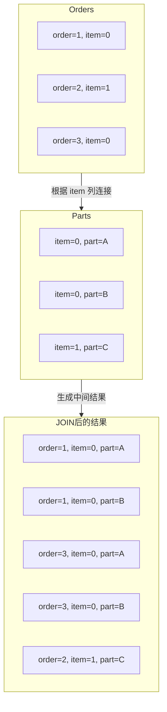
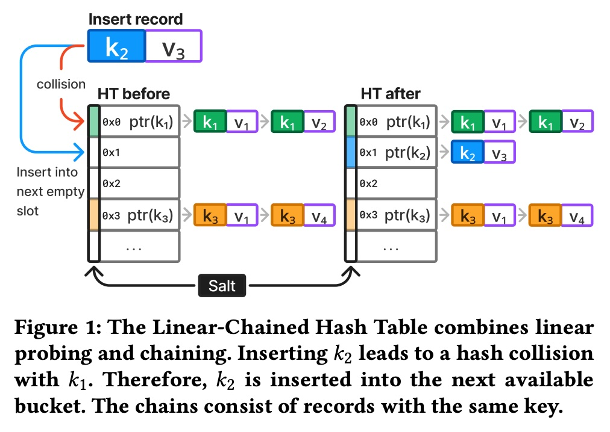
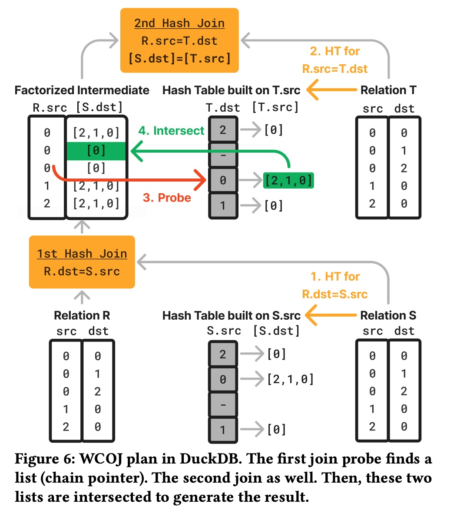
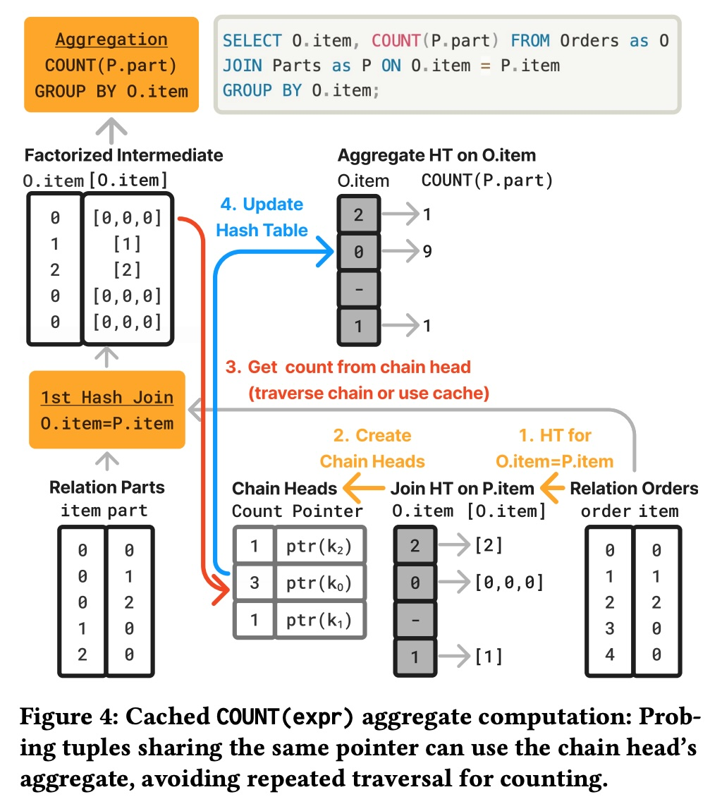
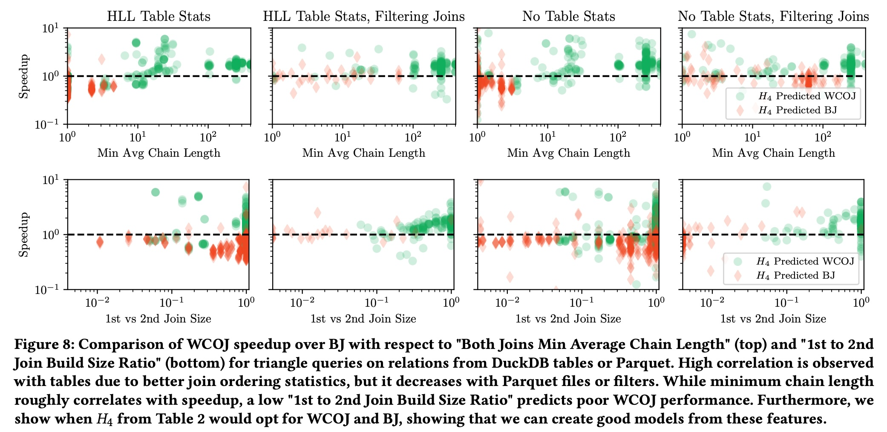

## AI论文解读 | Adaptive Factorization Using Linear-Chained Hash Tables
        
### 作者        
digoal        
        
### 日期        
2025-07-26       
        
### 标签        
PostgreSQL , PolarDB , DuckDB , AI , 论文解读        
        
----        
        
## 背景  
      
https://vldb.org/cidrdb/papers/2025/p21-gro.pdf        
  
提示:          
```          
读懂《Adaptive Factorization Using Linear-Chained Hash Tables》这篇论文需要提前掌握哪些基础知识, 请使用中文通熟易懂的讲解这些基础知识, 可以引用论文中的图、表或使用Markdown支持的图形(text,mermaid等)增加解释性. 
  
使用中文通熟易懂的解读《Adaptive Factorization Using Linear-Chained Hash Tables》这篇论文, 其中的关键内容请着重讲解, 可以引用论文中的图、表或使用Markdown支持的图形(text,mermaid等)增加解释性. 
  
提取《Adaptive Factorization Using Linear-Chained Hash Tables》这篇论文中的重要术语, 使用中文对这些术语进行通熟易懂的讲解, 可以引用论文中的图、表或使用Markdown支持的图形(text,mermaid等)增加解释性. 
```     
  
## 1 前置知识 
  
好的，为了完全理解《Adaptive Factorization Using Linear-Chained Hash Tables》这篇论文，你需要掌握一些数据库系统和算法领域的基础知识。这篇论文的核心在于提出了一种新的哈希表设计，并利用它来实现更高效、更智能（自适应）的JOIN和聚合（Aggregation）操作。

下面我将用通俗易懂的中文，为你逐一讲解这些必备的基础知识，并结合论文中的图表进行说明。

### 知识点一：关系型数据库与 JOIN 操作

这是最基础的背景知识。想象你有两张Excel表格：

1.  **订单表 (Orders)**：记录了谁（`item`）下了哪个订单（`order`）。
2.  **零件表 (Parts)**：记录了哪个零件（`part`）属于哪个产品（`item`）。

如果你想知道“每个产品（`item`）总共有多少个关联的零件（`part`）”，你就需要把这两张表通过共同的列 `item` 连接起来。这个连接操作在数据库里就叫做 **JOIN**。



这篇论文主要讨论的就是如何让这个JOIN过程，以及后续的计算（如`COUNT`计数）变得更快。

### 知识点二：哈希连接 (Hash Join) - 主流的 JOIN 实现方式

数据库执行JOIN操作有很多方法，其中**哈希连接 (Hash Join)** 是处理大数据量时最高效、最常用的一种。它分为两个阶段：

1.  **构建阶段 (Build Phase)**：选择较小的一张表（例如 `Parts` 表），遍历它的每一行。对连接键（`item`）计算一个哈希值（可以想象成一个指纹），然后把这一行的信息存入一个叫**哈希表 (Hash Table)** 的数据结构中。哈希表就像一个有很多“桶”的柜子，哈希值决定了数据该放进哪个桶。
2.  **探测阶段 (Probe Phase)**：遍历另一张大表（`Orders` 表）的每一行。同样对连接键（`item`）计算哈希值，去哈希表中对应的“桶”里查找。如果找到了匹配的记录，就说明这两行可以连接起来，生成一条结果。

### 知识点三：哈希冲突解决方法：论文核心数据结构的基础

哈希连接的关键是哈希表。但有时，两个不同的键（比如 `item=1` 和 `item=17`）可能会计算出相同的哈希值，导致它们想被放进同一个“桶”里。这就是**哈希冲突 (Hash Collision)**。解决冲突的经典方法主要有两种：

1.  **开放寻址法 (Open Addressing) - 尤其是线性探测 (Linear Probing)**：当一个桶被占了，就去检查下一个空的桶，把数据放进去。就像去电影院找座位，你的位置被人占了，你就坐到旁边的空位上。这种方法缓存友好，因为数据都连续存储。
2.  **拉链法 (Separate Chaining)**：每个桶里不直接存数据，而是存一个链表的头指针。所有哈希到这个桶的数据，都串在这个链表上。就像每个挂钩上都挂了一串钥匙。

**这篇论文的第一个核心贡献，就是提出了一种结合二者优点的数据结构：线性链式哈希表 (Linear-Chained Hash Table)。**

我们可以看一下论文中的**图1**：   

*论文图1：线性链式哈希表*

  * **处理哈希冲突 (Collision)**：当要插入的新记录 `k2` 的哈希值与 `k1` 相同（发生冲突），系统并没有在 `0x0` 位置形成一个链表。而是采用了**线性探测**，找到了下一个空闲的槽位 `0x1`，把 `k2` 放了进去 。
  * **处理重复键 (Duplicate Keys)**：注意看 `k1` 和 `k3`，它们的键值是相同的。`k1` 后面通过指针串联了多个拥有相同键值的记录。这利用了**拉链法**的思想来管理重复键 。

所以，这种新结构：**用线性探测解决不同键的哈希冲突，用拉链法管理相同键的重复记录**。这为后续的“分解执行”提供了天然的便利。

### 知识点四：更高级的JOIN算法与查询模式

#### 1\. 最坏情况最优连接 (Worst-Case Optimal Joins, WCOJ)

对于一些复杂的查询，比如“三角查询”（A认识B，B认识C，C又认识A），传统的哈希连接会产生巨大的中间结果，非常浪费资源。    

*论文图6：WCOJ 查询计划* 

看上图，一个三角查询 `R -> S -> T -> R`。

  * **传统方法**：先将 R 和 S 连接，可能生成一个非常非常大的中间表。然后再拿这个大表去和 T 连接。
  * **WCOJ 方法**：当 R 表的一行在 S 表中找到匹配时，它不立刻生成所有组合，而是得到一个“匹配列表”的指针（S.dst 的链表） 。同样，它在 T 表中也得到一个“匹配列表”的指针 。最后，它只需要**相交 (intersect)** 这两个列表，就能直接得到最终结果，避免了中间结果爆炸 。

这篇论文实现的WCOJ就是基于其`Linear-Chained Hash Table`天然形成的“链表”结构。

#### 2\. 分解执行 (Factorized Processing)

这是WCOJ思想的延伸。核心思想是**延迟物化 (Delayed Materialization)**，尽量用指针或引用来表示中间结果，而不是生成完整的、重复的记录。     

*论文图4：分解聚合计算*

看上图的查询，要计算每个`O.item`对应的`P.part`的数量。

  * **传统方法**：先做 JOIN，如果一个 `O.item` 对应100个 `P.part`，就会生成100条中间记录。然后对这100条记录进行 `GROUP BY` 和 `COUNT`。
  * **分解方法**：在 JOIN 之后，不生成100条记录，而是生成一个指向 `P.part` 链表的指针（这被称为**Factorized Intermediate**）。当需要计算 `COUNT` 时，只需要获取这个链表的长度即可 。如果这个长度被计算过一次，还可以缓存起来，后续探测到同一个 `item` 时直接使用缓存结果，速度极快 。

这篇论文展示了如何利用`Linear-Chained Hash Table`的链表结构，高效地实现分解聚合，在特定场景下获得几十倍的性能提升 。

### 知识点五：查询优化与运行时自适应 (Query Optimization & Runtime Adaptivity)

虽然WCOJ和分解执行在特定场景下很强大，但它们也有额外的开销，并非总是最优选择 。那么，数据库系统如何决定何时使用普通Hash Join，何时使用WCOJ呢？

  * **传统优化器 (Optimizer)**：在查询开始前，基于表的统计信息（如数据量、唯一值数量等）进行估算，然后制定一个固定的执行计划。但如果统计信息不准（例如，查询的是Parquet文件，没有预先计算好的统计信息），估算就可能错得离谱 。
  * **论文提出的自适应方法**：
    1.  优化器先不把计划定死，而是标记为“可能适合分解执行” 。
    2.  在执行Hash Join的**构建阶段**，系统会“顺便”收集一些关于真实数据分布的**运行时统计信息** 。
    3.  为了低成本地收集信息，它使用了一些叫做**数据摘要 (Sketches)** 的概率性数据结构。你不需要懂它们的复杂数学原理，只需要知道它们的作用：
          * **HyperLogLog (HLL)**: 用非常小的内存，估算出一个巨大集合中有多少个**不重复**的元素 。论文用它来估算链的平均长度。
          * **AMS Sketch**: 用来估算两个大表的JOIN结果会有多大，即“JOIN爆炸”的程度 。
    4.  在构建完哈希表之后，但在探测开始之前，系统利用这些新鲜、准确的运行时统计数据，通过一个简单的模型或规则（例如，`if 平均链长 > 5.5 then 使用WCOJ`）来做出最终决定：是继续执行WCOJ，还是切换回普通的二进制JOIN 。

这就是论文标题中“**自适应 (Adaptive)**”的含义——在运行时根据真实数据动态调整执行策略。

### 总结

要读懂这篇论文，你需要搭建如下的知识体系：

1.  **基础层**：了解数据库的 **JOIN** 是做什么的。
2.  **核心数据结构层**：理解 **Hash Join** 的原理，以及为了解决**哈希冲突**而生的**线性探测**和**拉链法**。这是理解论文`Linear-Chained Hash Table`创新的基础。
3.  **高级算法层**：了解 **WCOJ** 和 **分解执行 (Factorization)** 要解决的核心问题——**中间结果爆炸**，以及它们“用指针代替实体”的核心思想。
4.  **决策/智能层**：明白**查询优化器**的挑战，以及为什么需要“**自适应**”决策。了解 **Sketches (HLL, AMS)** 是实现低成本运行时决策的关键工具。

掌握了这些知识后，你就能清晰地理解这篇论文的两大贡献：

  * **贡献一**：设计了`Linear-Chained Hash Table`，一个巧妙的数据结构，为高效的WCOJ和分解执行铺平了道路 。
  * **贡献二**：提出了一套**自适应**框架，通过在运行时收集`Sketches`信息，智能地决定是否启用这些高级技术，从而在各种工况下都能获得接近最优的性能 。
  
## 2 解读论文 
  
好的，这篇名为《Adaptive Factorization Using Linear-Chained Hash Tables》（基于线性链式哈希表的自适应分解技术）的论文，核心思想是提出一种更智能、更高效的方法来处理数据库中的连接（JOIN）和聚合（Aggregation）操作。下面我将用通俗的语言，结合论文中的图表，为您深入解读其关键内容。

### 论文解决了什么问题？

在数据库执行查询时，尤其是复杂的JOIN操作（比如多表连接），经常会产生巨大的“中间结果”，这会消耗大量内存和计算资源，拖慢查询速度。虽然学术界早已提出“最坏情况最优连接（WCOJ）”和“分解执行（Factorization）”等高级技术来避免中间结果爆炸，但它们并非“万金油”，在某些场景下反而比传统方法更慢。

因此，核心的挑战是：**数据库系统如何知道何时该用这些高级技术，何时不该用？** 传统方法依赖查询优化器在执行前基于不一定准确的统计数据做“静态”决策，常常出错。

这篇论文的解决方案是：**不做静态决策，而是在运行时根据真实的数据情况做“自适应”决策**。为了实现这一点，它引入了两大创新。

### 创新一：线性链式哈希表 (Linear-Chained Hash Table)

这是整篇论文的技术基石。传统的哈希连接（Hash Join）在处理数据时，会遇到两种情况：

1.  **哈希冲突 (Collision)**：两个**不同**的键（Key）被计算出相同的哈希值。
2.  **键重复 (Duplicates)**：多个记录拥有**相同**的键。

论文提出的“线性链式哈希表”巧妙地结合了两种经典方法来分别处理这两种情况：

  * **用线性探测 (Linear Probing) 解决哈希冲突**：当要插入的记录发现它的“桶”被一个**不同键**的记录占了，它会寻找下一个空的“桶”存放 。
  * **用拉链法 (Chaining) 管理重复键**：当要插入的记录发现它的“桶”里已经有**相同键**的记录时，它会以链表的形式挂在后面 。

我们可以通过论文的**图1**来直观理解：   

*论文图1：线性链式哈希表示意图*

1.  **HT before (处理前)**：哈希表(HT)中，`0x0` 位置存着键为 `k1` 的记录链表，`0x3` 位置存着键为 `k3` 的记录链表。
2.  **插入 k2**：现在要插入一个新记录 `(k2, V3)`。它的哈希值计算后指向 `0x0` 位置，但该位置已被 `k1` 占用，且 `k2 != k1`，这就是**哈希冲突** 。
3.  **线性探测**：系统采用线性探测，找到了下一个空的槽位 `0x1`，并将 `(k2, V3)` 插入此处 。
4.  **HT after (处理后)**：最终，`k2` 被存放在 `0x1`。注意，`k1` 和 `k3` 后面都跟着由相同键值记录组成的“链条”，这就是**拉链法**的应用 。

这种设计的好处是，哈希表中每个“桶”的链表都只包含拥有**完全相同键**的记录，这为后续的高级操作提供了极大的便利。

### 关键应用：基于新哈希表的性能优化

有了这种“纯净”的键链表，论文实现了两种关键的高级应用：

#### 1\. 分解式聚合 (Factorized Aggregation)

当JOIN后的结果需要做聚合（如 `COUNT`, `SUM`）时，传统方法会先生成所有JOIN结果，再进行计算，非常浪费。分解式聚合则利用了新哈希表的链表结构。

参考论文的**图4**，它展示了一个计算每个商品(`O.item`)有多少个零件(`P.part`)的查询：     

*论文图4：分解式聚合计算流程*

执行流程如下：

1.  **第1步 (1st Hash Join)**：在 `Orders` 表和 `Parts` 表之间进行JOIN。
2.  **生成分解式中间结果 (Factorized Intermediate)**：对于 `Orders` 表中的每一个 `item`，JOIN操作不再生成完整的行，而是生成一个指向 `Parts` 表中匹配记录链表的“指针” 。例如，对于 `item = 0`，它对应一个包含多个 `part` 的链表。
3.  **聚合计算**：当需要计算 `COUNT(P.part)` 时，系统只需获取该链表的长度即可 。
4.  **缓存优化 (Caching)**：更妙的是，第一次计算完某个键（如 `item=0`）的链表长度后，这个结果可以被缓存。当后续再次遇到 `item=0` 时，可以直接使用缓存的计数值，无需重复遍历链表 。

实验表明，这种方法，尤其是在开启缓存后，性能提升巨大，可达**17.58倍** 。

#### 2\. 最坏情况最优连接 (WCOJ)

对于复杂的环形查询（如A-\>B-\>C-\>A的三角查询），WCOJ可以有效避免中间结果爆炸。

参考论文的**图6**，它展示了一个三角查询的WCOJ执行计划：    

*论文图6：WCOJ执行三角查询*

1.  **第一次JOIN (`R.dst = S.src`)**：查询R表时，在S表的哈希表中找到匹配项后，不生成实体结果，而是得到一个指向S表中相关记录链表的指针（代表一个 `S.dst` 的列表）。
2.  **第二次JOIN (`R.src = T.dst`)**：同样，在T表的哈希表中查找，得到一个指向T表中相关记录链表的指针（代表一个 `T.src` 的列表）。
3.  **列表相交 (Intersect)**：最后，系统只需计算这两个链表（列表）的交集，即可得到最终的三角关系，从而避免了先将R和S完全连接而产生的巨大中间表 。

### 创新二：运行时自适应决策 (Adaptive Factorization)

这是论文的另一大核心贡献。既然WCOJ和分解执行不总是最优的，那到底何时使用它们呢？

论文指出，依赖静态优化器是不可靠的，尤其是在处理没有预先统计信息的Parquet文件等情况时 。因此，它提出了一套**运行时自适应**框架：

1.  **延迟决策**：查询优化器在开始时不确定最终计划，而是将查询标记为“可能适合分解执行” 。
2.  **运行时数据收集**：在执行JOIN的**构建阶段（Build Phase）**，系统会“顺便”用极低的开销（平均仅增加0.35%的运行时开销）收集关于真实数据的统计特征 。这通过两种 **数据摘要（Sketch）** 技术实现：
      * **HLL (HyperLogLog)**：快速估算出一个集合中不重复元素的数量，用于预测平均链长 。
      * **AMS Sketch**：快速估算两个表JOIN后结果的大小，用于预测JOIN的“爆炸因子” 。
3.  **动态决策**：在构建阶段结束、探测阶段开始之前，系统利用这些新鲜、准确的运行时特征，通过一个简单的**启发式规则**或**机器学习模型**来做出最终决策——是继续执行WCOJ，还是切换回传统的二进制JOIN 。

论文通过大量实验证明，这种自适应方法非常有效。例如，一个简单的启发式规则`H4`（结合了最小平均链长、最小键偏斜度和JOIN大小比例等特征）在各种数据集上都表现优异，甚至超过了复杂的机器学习模型，在某些场景下带来了高达**1.42倍**的平均性能提升 。    

*论文图8：WCOJ的性能与运行时特征的关系*

上图直观地显示了WCOJ的加速比（Speedup）与运行时特征（如“最小平均链长”）之间的关系。绿色点代表模型预测使用WCOJ，红色点代表预测使用普通JOIN。可以看到，当链长较长时（\>10），WCOJ的优势明显（大部分点都在加速比\>1的区域），这印证了自适应决策的有效性。

### 总结

《Adaptive Factorization Using Linear-Chained Hash Tables》这篇论文通过两大创新，优雅地解决了高级JOIN技术在实际应用中的决策难题：

1.  **底层数据结构创新**：设计了**线性链式哈希表**，它为高效实现分解执行和WCOJ提供了完美的底层支持。
2.  **上层决策框架创新**：提出了一套**运行时自适应框架**，通过在执行中低成本地收集数据特征，智能地选择最优的执行路径，从而在各种复杂查询场景下都能获得稳定、高效的性能。
  
## 3 术语  
  
好的，以下是论文《Adaptive Factorization Using Linear-Chained Hash Tables》中的一些重要术语及其通俗易懂的中文讲解。

-----

### 1\. 线性链式哈希表 (Linear-Chained Hash Table)

这是论文提出的核心数据结构，是所有优化的基础。它巧妙地结合了两种经典的哈希冲突解决方法。

  * **通俗讲解**：
    想象一个有很多挂钩的墙（哈希表），你要挂很多串钥匙（数据记录）。

      * **哈希冲突 (不同钥匙，同一个挂钩)**：当你拿着一把新钥匙（比如“办公室钥匙”），发现它对应的挂钩已经被“大门钥匙”占了。这时，你不把两把钥匙挂在一起，而是遵循**线性探测 (Linear Probing)** 的规则，去旁边找一个空的挂钩，把它挂上去 。
      * **键重复 (相同的钥匙，有多把)**：如果你有好几把一模一样的“办公室钥匙”，你会把它们串在一个钥匙链上，然后把整个钥匙链挂在对应的挂钩上。这就是**拉链法 (Chaining)** 的思想 。

    **线性链式哈希表**就是这样一种结构：**用“找旁边空位”的方式处理不同键的冲突，用“串成一串”的方式管理相同的键** 。

  * **图文解释 (论文图1)**：    

    *论文图1：线性链式哈希表示意图*

    这张图清晰地展示了该过程：要插入的 `k₂` 与 `k₁` 发生了哈希冲突，于是 `k₂` 被线性探测到下一个空槽位 `0x1` 。而 `k₁` 和 `k₃` 后面则各自跟着由相同键值记录组成的链条 。

### 2\. 分解执行 (Factorized Processing)

这是一种高效处理查询的“懒人”思想，核心是尽可能地延迟和避免数据的完全展开。

  * **通俗讲解**：
    假设一个家庭住址簿，记录每个家庭成员的住址。

      * **传统方法**：为爸爸、妈妈、孩子每人单独写一条完整的家庭住址。如果家里有5口人，地址就要重复写5遍。
      * **分解方法**：只在爸爸名下写一次完整地址。妈妈和孩子的住址栏里只写：“同爸爸地址”。这样就避免了信息冗余。

    在数据库中，分解执行就是用一个指向数据集合的“指针”或“引用”来表示中间结果，而不是生成大量重复的、完整的记录 。

  * **图文解释 (论文图4)**：    

    *论文图4：分解式中间结果*

    图中的“Factorized Intermediate”就是分解执行的产物。它没有为每个匹配项生成一行完整的记录，而是用一个指针指向一个包含所有匹配项的集合（即链表）。当需要计算`COUNT`时，只需获取链表的长度，如果需要`SUM`，则可以将链表中的值求和再乘以探测次数 。

### 3\. 最坏情况最优连接 (Worst-Case Optimal Joins, WCOJ)

这是一种先进的JOIN算法，专门用于处理会产生巨大中间结果的复杂查询 。

  * **通俗讲解**：
    想象一个任务：找出社交网络中所有的“三人友谊环”（A认识B，B认识C，C又认识A）。

      * **传统方法**：先找出所有A认识B的组合，这可能会得到一个巨大的列表。然后再拿这个巨大列表去和C匹配，过程非常缓慢。
      * **WCOJ方法**：对于某个A，它不会立刻生成所有和B的组合。而是先拿到一个“A认识的人”的列表，再拿到一个“认识A的人”的列表，然后高效地在这两个列表之间找到共同的朋友C，从而直接构成“三人环”。它通过避免生成庞大的中间步骤来提升效率 。

  * **图文解释 (论文图6)**：    

    *论文图6：WCOJ执行三角查询*

    图中，第一次JOIN的结果不是一个展开的表，而是一个指向匹配列表的指针（`[S.dst]`）。第二次JOIN也同样生成一个列表指针（`[T.src]`）。最后，通过对这两个列表进行 **相交(Intersect)** 操作，直接得到最终结果，避免了中间结果爆炸 。

### 4\. 自适应分解 (Adaptive Factorization)

这是论文的核心思想，指数据库在“运行时”动态决定是否采用分解执行或WCOJ等高级技术。

  * **通俗讲解**：
    你是一名司机，要去一个目的地。

      * **静态决策**：出发前，你看了一眼地图（静态统计信息），决定全程走高速。但万一高速上临时堵车，你就惨了。
      * **自适应决策**：你边开车边听实时路况广播（运行时统计信息）。如果广播说高速畅通，你就上高速；如果说堵车，你就立刻切换到普通公路。

    “自适应分解”就是让数据库在查询执行过程中，根据刚刚处理的数据的真实情况（比如数据重复度高不高），来动态选择最高效的执行路径 。

### 5\. 数据摘要/草图 (Sketches)

这是一种轻量级的数据结构，用于在运行时低成本地估算数据特征，是实现“自适应”决策的关键工具。

  * **通俗讲解**：
    你想知道一个大广场上大概有多少人，但又不想一个个去数。

      * **HLL (HyperLogLog) Sketch**：你能用极小的代价，快速估算出广场上大概有多少**不同**的姓氏（估算唯一值的数量）。论文用它来估算哈希表中链的平均长度。
      * **AMS (Alon-Matias-Szegedy) Sketch**：你能快速估算出如果两个广场的人进行联谊，大概会产生多少对“老乡”（估算JOIN结果的大小）。论文用它来预测JOIN的“爆炸”程度。

    这些Sketches就像是侦察兵，用很小的代价探明了“敌情”（数据分布情况），为主力部队（执行引擎）选择最佳进攻路线（执行计划）提供了关键情报 。

### 6\. 环形连接 (Cyclic Joins)

指一种特殊的查询模式，其中表之间的连接关系形成了一个闭环，例如A-\>B, B-\>C, C-\>A。

  * **通俗讲解**：
    就是前面提到的“三人友谊环”查询，它在图中形成了一个三角形。这类查询是典型的环形连接，也是WCOJ最能发挥优势的场景，因为它们最容易产生巨大的中间结果 。

    ```mermaid
    graph TD
        R -- R.dst = S.src --> S
        S -- S.dst = T.src --> T
        T -- T.dst = R.src --> R
    ```

    *图：一个三角环形连接*
  
## 参考        
         
https://vldb.org/cidrdb/papers/2025/p21-gro.pdf    
        
<b> 以上内容基于DeepSeek、Qwen、Gemini及诸多AI生成, 轻微人工调整, 感谢杭州深度求索人工智能、阿里云、Google等公司. </b>        
        
<b> AI 生成的内容请自行辨别正确性, 当然也多了些许踩坑的乐趣, 毕竟冒险是每个男人的天性.  </b>        
  
