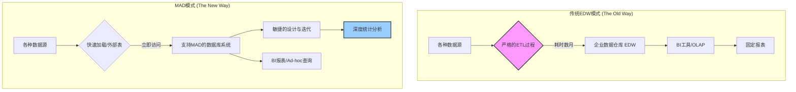
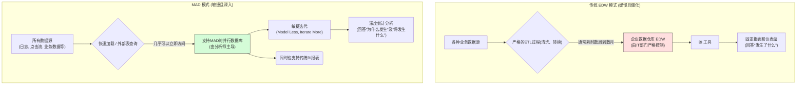
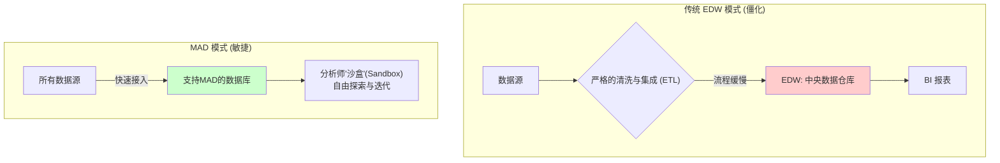

## AI论文解读 | MAD Skills: New Analysis Practices for Big Data
        
### 作者        
digoal        
        
### 日期        
2025-07-27       
        
### 标签        
PostgreSQL , PolarDB , DuckDB , AI , 论文解读        
        
----        
        
## 背景  
      
https://dsf.berkeley.edu/papers/vldb09-madskills.pdf        
  
提示:          
```          
读懂《MAD Skills: New Analysis Practices for Big Data》这篇论文需要提前掌握哪些基础知识, 请使用中文通熟易懂的讲解这些基础知识, 可以引用论文中的图、表或使用Markdown支持的图形(text,mermaid等)增加解释性. 
  
使用中文通熟易懂的解读《MAD Skills: New Analysis Practices for Big Data》这篇论文, 其中的关键内容请着重讲解, 可以引用论文中的图、表或使用Markdown支持的图形(text,mermaid等)增加解释性. 
  
提取《MAD Skills: New Analysis Practices for Big Data》这篇论文中的重要术语, 使用中文对这些术语进行通熟易懂的讲解, 可以引用论文中的图、表或使用Markdown支持的图形(text,mermaid等)增加解释性. 
```     
  
## 1 前置知识 
  
好的，为了完全理解《MAD Skills: New Analysis Practices for Big Data》这篇论文，你需要对三个主要领域的知识有所了解：**数据仓库与商业智能**、**数据库系统与大数据技术**，以及**统计学与机器学习**。

这篇论文的核心思想是，随着数据量的爆炸式增长，传统那种严谨、缓慢、由IT部门主导的数据分析方式已经过时了。我们需要一种全新的，被论文作者称为“MAD”的模式。 

  * **Magnetic (磁力型)**：像磁铁一样主动吸引所有类型的数据，而不是因为数据不“干净”就排斥它们。 
  * **Agile (敏捷型)**：分析师可以快速地引入、消化和处理数据，数据库的结构能够持续快速地演进。 
  * **Deep (深度型)**：分析不仅仅停留在简单的报表层面，而是要深入到复杂的统计模型和算法中。 

下面我将用通俗易懂的方式，为你讲解理解这篇论文所需的基础知识，并引用论文内容和图示来帮助解释。

### 知识领域一：数据仓库与商业智能 (论文中要颠覆的传统模式)

想象一下，一家大公司有很多部门（销售部、市场部、人事部），每个部门都有自己的数据记录方式。为了能让老板从全局视角看问题（比如“哪个地区的销售额和市场活动关联最大？”），就需要把所有数据统一起来。

1.  **企业数据仓库 (Enterprise Data Warehouse, EDW)**

      * **是什么**：它就像一个企业的“中央数据图书馆” 。这个图书馆的规矩非常严格，所有数据（书）在入库前，都必须经过仔细的清洗、整理和编目，确保格式完全统一 。这个过程通常由专门的IT人员（图书管理员）严格把控。
      * **论文的观点**：这种方式太慢了！  当分析师（读者）急着想看一本新数据（新书）时，IT部门（管理员）可能会花上几个月的时间去“编目”，这严重影响了分析的敏捷性。论文倡导的“磁力型”方法，就是先把书拿进来，让最需要的人先看，哪怕它有点乱 。

2.  **商业智能 (Business Intelligence, BI) 与 OLAP**

      * **是什么**：BI是基于数据仓库的一系列工具，主要用来制作报表和仪表盘 。它的核心技术之一是**OLAP (On-Line Analytical Processing)**，你可以把它理解为超级强大的Excel数据透视表。它可以对数据进行：
          * **上卷 (Roll-up)**：从详细数据汇总到高层级，比如从“每天的销售额”汇总成“每月的销售额”。 
          * **下钻 (Drill-down)**：从汇总数据深入到细节，比如从“每月销售额”下钻到“具体每个产品的销售额”。 
      * **论文的观点**：BI和OLAP做的只是“描述性统计” ，它能告诉你**发生了什么**（比如“上个月A产品的销量下降了10%”），但很难告诉你**为什么会发生**，或者**接下来会发生什么**。而MAD追求的“深度”分析，需要用到更复杂的“推断性统计”方法来做预测和因果分析 。

下图展示了传统模式与MAD模式的对比：



### 知识领域二：数据库系统与大数据技术 (支撑MAD模式的工具)

要实现MAD模式，光有理念不够，还需要强大的技术工具支持。

1.  **并行数据库 (Parallel Database)**

      * **是什么**：不同于单台服务器，并行数据库是将一个庞大的数据库系统运行在一个由多台计算机组成的集群上 。处理一个查询时，任务会被分解，交给所有机器同时处理，最后再把结果汇总。论文中使用的Greenplum就是一个典型的并行数据库系统 。
      * **为什么重要**：这是处理“大数据”的性能基础。就像一个人打扫一个体育场很慢，但100个人一起打扫就快多了。

2.  **SQL (Structured Query Language)**

      * **是什么**：操作关系型数据库（数据以表格形式存储）的标准语言。
      * **论文中的应用**：论文的一大亮点是展示了如何用SQL来实现复杂的数学和统计算法。它不是简单地用`SELECT * FROM ...`来查数据，而是通过**用户自定义函数 (UDF)** 和**用户自定义聚合 (UDA)**，把SQL变成了一个强大的并行计算框架 。比如，论文中定义了向量加法、矩阵乘法等操作，让分析师可以直接在数据库里用接近数学语言的方式写代码 。

3.  **MapReduce**

      * **是什么**：由Google推广的一种并行编程模型，也是处理大数据的利器 。它把一个大任务分为两个阶段：
          * **Map (映射)**：分而治之。把原始数据分成很多小块，交给不同的“工人”去处理，每个工人完成自己那一小部分任务。
          * **Reduce (规约)**：汇总结果。一个或多个“工头”把所有工人的处理结果收集起来，进行合并和最终计算。
      * **论文的观点**：MapReduce和现代SQL在并行处理的本质上是相似的 。一个好的MAD平台不应该让用户在两者之间做“宗教式”的选择，而应该同时支持这两种编程风格，让不同背景的分析师都能用自己熟悉的方式工作 。

### 知识领域三：统计学与机器学习 (MAD模式的“深度”所在)

这是论文最核心、技术性最强的部分。MAD分析的“深度”就体现在能直接在海量数据上运行这些复杂的算法，而不需要抽样到小机器上。

1.  **线性代数 (Vectors & Matrices)**

      * **是什么**：这是很多高级统计和机器学习算法的数学语言。你需要知道**向量**（可以理解为一列数字）和**矩阵**（一个数字构成的表格）是什么，以及它们的基本运算（如加法、乘法、转置） 。
      * **论文中的应用**：论文第5节花了大量篇幅展示如何将矩阵和向量表示为数据库中的表 ，并用SQL实现它们的运算 。这是后续所有复杂算法的基础。例如，`Ordinary Least Squares (OLS)`回归分析的解，可以用一个简洁的矩阵公式 $\\beta^{\*}=(X^{\\prime}X)^{-1}X^{\\prime}y$ 来表示 ，而论文则展示了如何用SQL并行计算这个公式 。

2.  **推断性统计方法**

      * **是什么**：不同于只描述数据的“描述性统计”，推断性统计旨在从样本数据中推断总体的特征，进行比较和预测。
      * **论文中的例子**：
          * **Mann-Whitney U Test**：一种“非参数”检验方法。当你比较两组数据（比如A广告和B广告的点击率分布），但这些数据的分布不符合正态分布（钟形曲线）时，这个方法特别有用 。它通过比较两组数据混合排序后的“秩”来判断它们是否有显著差异，而不是直接比较平均值 。
          * **Log-Likelihood Ratios (对数似然比)**：用于比较两个模型哪个更好地拟合了你的数据 。比如，你想知道“有小孩的用户”这个群体对咖啡的偏好，与“所有用户”对咖啡的偏好是否不同。通过这个方法，你可以量化地比较这两种情况（模型）的可能性 。

3.  **重采样技术 (Resampling Techniques)**

      * **是什么**：一种非常强大的统计思想，用于在不清楚数据具体分布的情况下，稳健地估计某个统计量（如平均值、中位数）及其置信区间。
      * **论文中的例子 (Bootstrap)**：要估计一个巨大数据集的真实平均值，直接用SQL的`AVG()`可能会被少数极端异常值带偏 。Bootstrap的做法是 ：
        1.  从N个数据的原始数据集中，有放回地随机抽取N个数据（这叫一个“自助样本”）。
        2.  计算这个自助样本的平均值。
        3.  重复上面两步成千上万次，你会得到成千上万个平均值。
        4.  这些平均值会形成一个近似正态分布，这个分布的平均值就是对真实平均值的一个非常稳健的估计。
      * **论文的贡献**：展示了如何通过一个巧妙的SQL查询，在一次全表扫描中，同时模拟成千上万次抽样过程，从而在并行数据库中高效地完成Bootstrap 。

-----

**总结一下**：要读懂这篇论文，你需要先理解它所**挑战的传统模式**（EDW+BI），然后掌握它所**依赖的技术工具**（并行数据库、SQL、MapReduce），最后，也是最重要的，理解它所**实现的“深度”分析方法**（基于线性代数的统计模型和重采样技术）。这篇论文的精髓在于，它不仅提出了一个先进的理念，还给出了将这个理念落地到并行数据库中的具体技术实现，展示了如何用SQL“秀出”复杂的统计操作，真正做到了“MAD Skills”。
  
## 2 解读论文 
  
好的，我们来一起深入解读《MAD Skills: New Analysis Practices for Big Data》这篇经典论文。

这篇论文的核心思想非常明确：在数据量爆炸的时代，传统的数据分析方法已经力不从心，我们需要一套全新的，被作者称为 **MAD** 的理念、技术和实践。

### 论文主旨：什么是 “MAD”？

首先，“MAD” 不是指“疯狂”，而是一个缩写，代表了新一代大数据分析实践的三个关键特征 ：

  * **Magnetic (磁力型)**: 传统的数据仓库像一个戒备森严的堡垒，对新数据源非常“排斥”，需要经过漫长而严格的清洗和集成才能进入 。而MAD方法则主张，数据平台应该像一块“磁铁”，主动吸引组织内出现的所有数据源，无论其格式或质量如何 。先让数据进来，让分析师能够快速接触到它。

  * **Agile (敏捷型)**: 传统的数据仓库建设是基于长期、审慎的规划 。而MAD方法强调“敏捷”，分析师必须能够快速地消化、处理和改造数据，整个数据库的逻辑和物理结构都应该能够持续、快速地演进以适应新的分析需求 。

  * **Deep (深度型)**: 传统的商业智能（BI）分析大多停留在简单的汇总（上卷）和明细查询（下钻） 。而MAD追求“深度”分析，这意味着要应用更复杂的统计方法（如概率密度、机器学习模型等），并且是在完整的、海量的数据集上进行，而不是依赖于抽样或数据提取 。

### 为什么要 “MAD”？—— 传统模式的困境

为了理解MAD的革命性，我们首先要看看它所要颠覆的传统模式。

传统的企业数据分析围绕着“企业数据仓库（EDW）”和“商业智能（BI）”构建。这个模式可以概括为：

1.  **数据仓库 (EDW)** 是一个高度结构化、集中式的“数据真理的唯一来源” 。
2.  **IT部门** 严格控制着EDW，确保其高质量和高可用性，主要服务于高管的决策报表 。
3.  **商业智能 (BI) 工具** 在EDW之上运行，提供标准化的报表和仪表盘 。

然而，随着时代发展，这个模式的弊端日益凸显：

  * **数据无处不在**：存储变得极其廉价，一个部门甚至个人都能轻易收集和存储海量数据（如点击流、日志、邮件等） 。
  * **分析需求井喷**：越来越多的公司意识到数据分析能直接带来收益，对分析的需求越来越复杂、越来越紧急 。

传统EDW的“慢”和“排外”特性，无法满足这种“快”和“多”的需求，导致了分析效率的瓶颈。

我们可以用一个流程图来清晰地对比这两种模式：



### 如何实现 “MAD”？—— 关键方法与技术

论文不仅提出了理念，更给出了具体的实现路径。

#### 1\. MAD 数据库设计：为敏捷和探索而生

这是MAD实践的组织方法论，核心是“**少建模，多迭代**” ，将数据的主导权从IT部门更多地交给分析师 。论文推荐了一种分层和“沙盒”的设计模式：

  * **分层设计**：将数据仓库内部划分为几个逻辑区域：
      * **Staging (暂存区)**: 用于加载原始的、未处理的数据。工程师和部分高级分析师可以在这里操作 。
      * **Production (生产区)**: 存放经过初步整合和计算的聚合数据，服务于更广泛的、熟悉SQL的分析用户 。
      * **Reporting (报表区)**: 存放为报表工具专门优化的、静态的聚合结果，供业务用户快速查询 。
  * **Sandbox (沙盒)**: 这是设计的点睛之笔。**为每一位分析师提供一个他们可以完全控制的个人数据库空间（Schema）** 。在这个“沙盒”里，分析师可以：
      * 自由创建和修改SQL视图来组织复杂的代码 。
      * 将中间结果物化成表，方便后续的迭代分析 。
      * 存储自己常用的“私房”数据集，用于测试和原型开发 。

“沙盒”极大地释放了分析师的创造力，让他们可以像在自己电脑上一样自由地进行大规模数据实验，是实现“敏捷”的关键。

#### 2\. 数据并行统计：让数据库变成统计分析引擎

这是实现“深度”分析的核心技术。论文展示了如何将数据库从一个简单的数据存储和检索系统，提升为一个**大规模并行的统计计算平台** 。其精髓在于**在数据库内部用SQL（或MapReduce）实现复杂的数学和统计算法**。

**关键实例 1：用SQL实现线性代数**

许多高级统计模型都基于线性代数。论文展示了如何将向量和矩阵这些数学对象在数据库中表示（例如，用一张表来存一个矩阵，每行代表矩阵的一行），然后用SQL查询来实现矩阵加法、矩阵乘法等运算 。这使得分析师能用更接近数学思维的方式在数据库中直接编程 。

**关键实例 2：普通最小二乘法 (OLS) 回归**

OLS是统计学中用于拟合数据、寻找变量关系的基础方法 。它的解有一个著名的矩阵公式： $\\beta^{\*}=(X^{\\prime}X)^{-1}X^{\\prime}y$ 。
传统做法需要将海量数据X和y导出到R或SAS等统计软件中计算，非常耗时。而论文展示了如何通过一系列用户自定义的SQL函数和聚合，在一次数据库扫描中并行地计算出 $X^{\\prime}X$ 和 $X^{\\prime}y$ ，并最终解出 $\\beta$ 。这极大地提升了效率，一个原本需要数小时的过程可以在几分钟内完成 。

**关键实例 3：重采样技术 (Bootstrapping)**

在分析大型真实数据集时，简单的求平均值（`AVG()`）等操作很容易受到异常值的影响，结果并不可靠 。Bootstrapping是一种更稳健的方法：通过对原始数据进行成千上万次有放回的随机抽样，计算每次抽样的统计量，最终形成一个该统计量的分布，从而得到更准确的估计和置信区间 。

这听起来需要进行成千上万次数据操作，但论文给出了一个极为巧妙的SQL实现，**它可以在一次数据表的并行扫描中，就完成所有上万次的“模拟实验”** 。这充分体现了MAD方法在海量数据上进行深度分析的能力。

#### 3\. MAD 数据库系统 (DBMS) 的特性

要支撑上述设计和算法，底层的数据库系统也必须具备“MAD”能力：

  * **超高速的数据加载/卸载**：这是“磁力型”和“敏捷型”的基础。系统需要支持并行的海量数据导入，并且最好支持“外部表”，即可以直接对存储在文件系统中的原始数据进行并行查询，无需预先加载 。
  * **灵活的存储和分区**：支持多种存储格式以适应数据生命周期的不同阶段（例如，对频繁更新的数据使用传统行存，对历史归档数据使用高压缩的列存） 。
  * **强大的可编程性与互操作性**：数据库必须是一个开放的编程环境 。
      * **支持多种语言的UDF**：允许分析师用他们熟悉的语言（如Python, R, Perl）编写函数，并在数据库内部并行执行 。
      * **原生集成MapReduce**：提供MapReduce编程接口，并让其与SQL在同一个数据库引擎上无缝协作 。这使得不同技术背景的开发者可以共存于一个平台，并自由组合使用最适合任务的工具 。

### 结论与启示

《MAD Skills》描绘了一幅大数据分析的未来蓝图。它主张从传统由IT主导的、僵化的数据仓库模式，转向由分析师主导的、敏捷、深入的探索模式。这不是要彻底抛弃结构和纪律，而是在一个统一、强大的并行计算平台上，实现多种分析风格的共存与协作 。其核心是**通过赋予分析师更好的工具、更大的自由度和更快的数据访问能力，来最大化数据的价值，并加速从数据到洞察再到商业决策的循环** 。
  
## 3 术语  
  
好的，这里是《MAD Skills: New Analysis Practices for Big Data》论文中关键术语的中文解读。

### 1\. MAD Skills (磁力、敏捷、深度分析技能)

这是贯穿全文的核心术语，代表了一种全新的大数据分析实践哲学 。

  * **通俗讲解**：把它想象成一个顶尖数据科学家的工作方式。他们需要像磁铁一样吸引所有数据，像短跑运动员一样敏捷地迭代分析，像地质学家一样深入挖掘数据背后的价值，而不是只看表面。

  * **在论文中的意义**：MAD是作者提出的，用以替代传统数据仓库实践的一整套新方法 。

      * **Magnetic (磁力型)**：指数据仓库应能轻松吸引和接入组织内的所有数据源，而不是因为数据不“干净”或格式不统一就将其“排斥”在外 。
      * **Agile (敏捷型)**：指分析过程应该是快速演进和迭代的 。分析师可以快速地引入数据、调整模型，数据库的结构也随之快速变化 。
      * **Deep (深度型)**：指分析不应止于传统的BI报表，而应深入到复杂的统计方法和机器学习模型中 ，并且是在完整的、未经抽样的数据集上进行 。

-----

### 2\. 企业数据仓库 (Enterprise Data Warehouse, EDW)

  * **通俗讲解**：可以把它比作一个国家级的中央图书馆。这里的每一本书（数据）都必须经过严格的审查、编目和归档，流程非常严谨和缓慢。图书馆的目的是为重要人物（企业高管）提供最权威、最准确的信息。

  * **在论文中的意义**：EDW是MAD方法所要颠覆的“传统”模式 。论文指出，传统的EDW是一个“精心构建的环境” ，它通过一个统一、全面的数据库模式来整合企业所有业务流程的数据 。但这种模式的缺点在于它非常僵化，引入新数据的过程漫长而困难，从而“排斥”了新数据源，阻碍了敏捷分析 。




-----

### 3\. 描述性统计 (Descriptive Statistics) vs. 推断性统计 (Inferential Statistics)

  * **通俗讲解**：

      * **描述性统计**：像是在做新闻报道，它告诉你**发生了什么**。例如：“上个月的平均销售额是100万。”
      * **推断性统计**：像是在做深度分析和预测，它试图告诉你**为什么会发生**以及**接下来可能发生什么**。例如：“广告投入每增加1万元，销售额可能会提升5万元，因为我们建立了一个回归模型。”

  * **在论文中的意义**：这个区分是为了强调“Deep”分析的必要性。传统的BI和OLAP主要做的是描述性统计 。而MAD分析则更进一步，致力于进行推断性统计 ，比如建立模型、进行因果分析和分布比较等 ，这些能为业务带来更大的价值。

-----

### 4\. 数据并行 (Data-Parallel)

  * **通俗讲解**：想象一下你要数一大堆豆子的总数。你自己一个人数很慢。数据并行就像是你把这堆豆子分成100份，找来100个人，每个人数自己那一小份，最后你把100个人的结果加起来。这样速度就快了100倍。

  * **在论文中的意义**：这是在大型集群上实现高性能计算的基本思想 。无论是论文中用SQL实现的复杂统计，还是提到的MapReduce，其本质都是数据并行的编程模型 。通过将数据和计算任务分散到集群的所有节点上并行处理，系统才能处理海量的“Big Data”。

-----

### 5\. 沙盒 (Sandbox)

  * **通俗讲解**：就像给每个孩子一个属于自己的沙坑让他们玩耍一样。在这个沙坑里，他们可以随意堆城堡、挖隧道，而不会影响到别人。

  * **在论文中的意义**：沙盒是实现“Agile”（敏捷）分析的一个具体设计方法 。它指的是在数据库中为每位分析师提供一个他们可以**完全控制**的个人工作空间（Schema） 。分析师可以在自己的“沙盒”里自由地创建视图、物化中间结果、存储实验数据，而无需经过DBA的批准 。这极大地鼓励了探索和创新，加快了分析的迭代速度。

-----

### 6\. 重采样技术 (Resampling Techniques - e.g., Bootstrap)

  * **通俗讲解**：假设你想知道一个城市所有居民的平均身高，但你不可能测量每一个人。直接随机找100个人测量的结果可能因为运气不好而有偏差。重采样技术（如Bootstrap）就是一种更聪明的方法：你先随机找100个人，然后对这100个人的数据进行“再抽样”（比如有放回地随机抽取100次，形成一个新的样本），重复这个过程几千次。最后，你会有几千个平均身高值，将它们再平均，得到的结果会比单次抽样可靠得多。

  * **在论文中的意义**：这是“Deep”（深度）分析的一个典型例子。论文指出，直接在大型真实数据集上计算简单的聚合统计（如`AVG()`）是不可靠的，因为容易受到异常值的影响 。Bootstrap等重采样技术可以提供更稳健的估计 。论文的贡献在于，它展示了如何用一个巧妙的SQL查询，在数据库的一次并行扫描中就完成数万次的模拟抽样，从而高效地在海量数据上应用这种高级统计技术 。

-----

### 7\. 外部表 (External Tables)

  * **通俗讲解**：你想要处理一批刚到的货物（数据），传统方法是先把所有货物搬进仓库（加载到数据库），然后再进行处理。而外部表技术就像是，你直接在货车上（文件系统）对货物进行扫描和处理，无需先把它们全部搬进仓库。

  * **在论文中的意义**：这是实现“Magnetic”（磁力型）和“Agile”（敏捷型）的一个重要数据库功能。通过外部表，分析师可以直接对存储在文件系统中的原始数据文件进行并行查询，而无需等待漫长的数据加载过程 。这大大缩短了从获得数据到开始分析的时间。

-----

### 8\. ETL vs. ELT

  * **通俗讲解**：这是两种处理数据的流水线顺序。

      * **ETL (Extract-Transform-Load)**：**先处理，后入库**。先把数据从源头取出（Extract），在专门的服务器上进行清洗和转换（Transform），最后再把处理好的干净数据加载（Load）到数据仓库。这是传统的方式。
      * **ELT (Extract-Load-Transform)**：**先入库，后处理**。先把原始数据原封不动地加载（Load）到强大的并行数据库中，然后利用数据库自身的强大计算能力来进行转换（Transform）。

  * **在论文中的意义**：MAD模式促使了从ETL到ELT的转变 。由于支持MAD的数据库本身就是强大的并行计算引擎，将转换（Transform）这一步放在数据库内部执行，可以获得更好的性能和灵活性，也更符合“先让数据进来”的磁力型和敏捷型理念 。
  
## 参考        
         
https://dsf.berkeley.edu/papers/vldb09-madskills.pdf    
        
<b> 以上内容基于DeepSeek、Qwen、Gemini及诸多AI生成, 轻微人工调整, 感谢杭州深度求索人工智能、阿里云、Google等公司. </b>        
        
<b> AI 生成的内容请自行辨别正确性, 当然也多了些许踩坑的乐趣, 毕竟冒险是每个男人的天性.  </b>        
  
