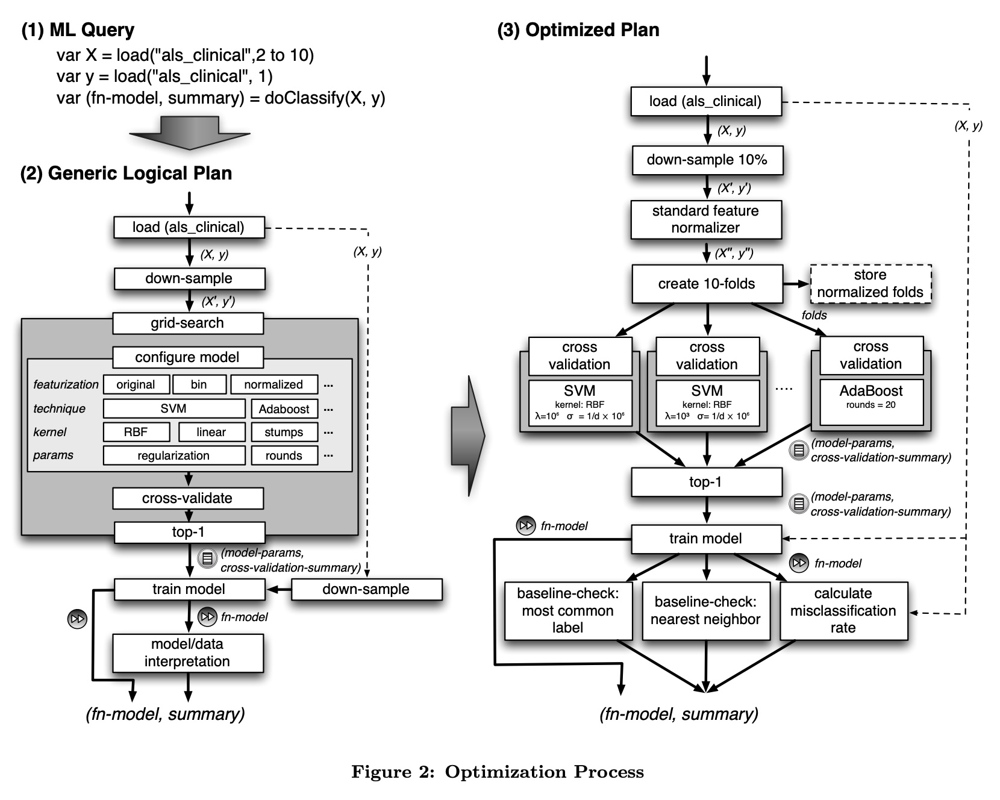
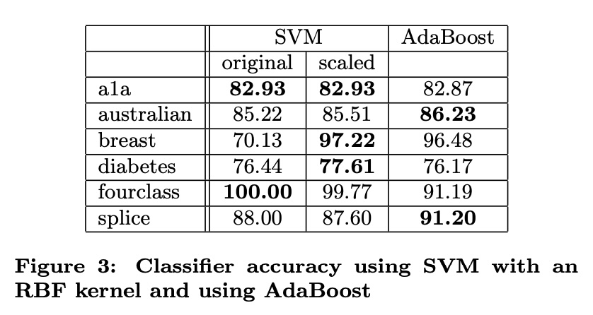
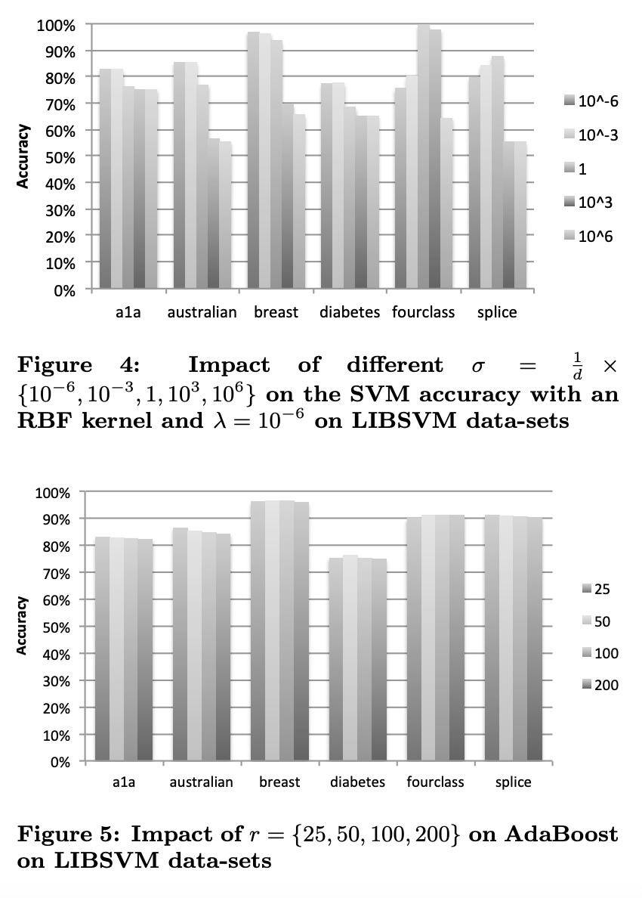
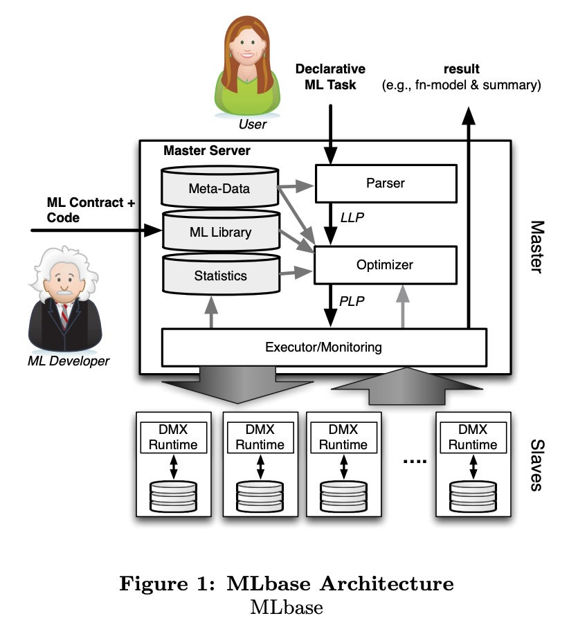
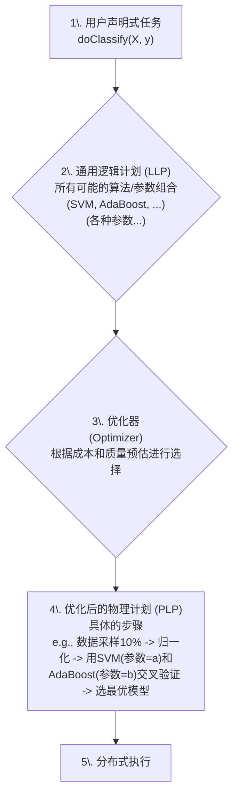
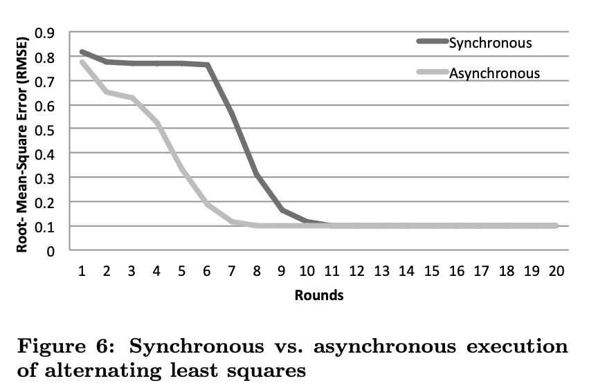
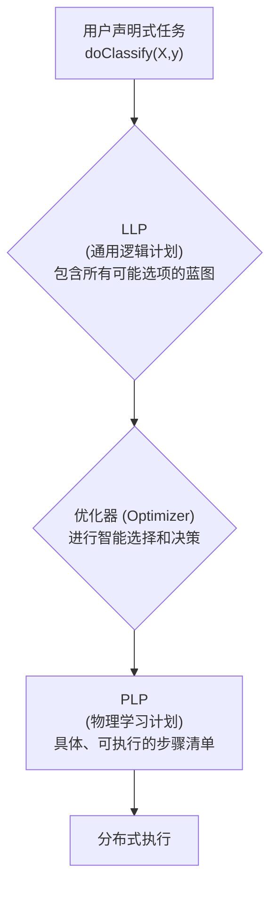

## AI论文解读 | MLbase: A Distributed Machine-learning System
        
### 作者        
digoal        
        
### 日期        
2025-07-27       
        
### 标签        
PostgreSQL , PolarDB , DuckDB , AI , 论文解读        
        
----        
        
## 背景  
      
https://www.cidrdb.org/cidr2013/Papers/CIDR13_Paper118.pdf        
  
提示:          
```          
读懂《MLbase: A Distributed Machine-learning System》这篇论文需要提前掌握哪些基础知识, 请使用中文通熟易懂的讲解这些基础知识, 可以引用论文中的图、表或使用Markdown支持的图形(text,mermaid等)增加解释性. 
  
使用中文通熟易懂的解读《MLbase: A Distributed Machine-learning System》这篇论文, 其中的关键内容请着重讲解, 可以引用论文中的图、表或使用Markdown支持的图形(text,mermaid等)增加解释性. 
  
提取《MLbase: A Distributed Machine-learning System》这篇论文中的重要术语, 使用中文对这些术语进行通熟易懂的讲解, 可以引用论文中的图、表或使用Markdown支持的图形(text,mermaid等)增加解释性. 
```     
  
## 1 前置知识 
  
好的，为了完全理解《MLbase: A Distributed Machine-learning System》这篇论文，您需要对以下几个领域有一个基本的认识。这篇论文的核心思想是：**让机器学习像使用数据库一样简单**，即使是非专家用户，也能够通过简单的指令，让系统自动地、高效地处理大规模数据并完成复杂的机器学习任务。

下面我将为您通俗地讲解所需的基础知识，并结合论文中的图表进行说明。

### 1\. 机器学习 (Machine Learning) 基础

这是最核心的背景知识。您可以将机器学习理解为“让计算机从数据中学习规律”的技术。论文中提到了几种常见的机器学习任务和算法，您需要了解它们的基本概念。

#### 1.1. 机器学习任务类型

  * **监督学习 (Supervised Learning)**：我们提供给机器的数据是带有“答案”或“标签”的。机器通过学习这些带标签的数据，来预测新数据的标签。

      * **分类 (Classification)**：预测一个类别。论文中提到的**ALS疾病预测**就是一个例子 。它的任务是根据病人的临床数据（特征），将病人分为“病程进展快的”或“病程进展慢的”两个类别 。论文中的`doClassify()`函数就是用来声明一个分类任务 。
      * **回归 (Regression)**：预测一个连续的数值，比如预测房价、股票价格等。

  * **无监督学习 (Unsupervised Learning)**：提供给机器的数据没有“答案”或“标签”。机器需要自己从数据中发现结构和模式。

      * **聚类 (Clustering)**：将相似的数据点分组。比如在**Twitter分析**的例子中，系统可以根据用户的行为特征将他们划分为不同的群体 。

  * **协同过滤 (Collaborative Filtering)**：这是一种常见的推荐技术。它的核心思想是“物以类聚，人以群分”。论文中的**音乐推荐**就是一个典型案例 ，系统通过分析大量用户的听歌历史，来预测某个用户可能喜欢哪些他还没听过的歌曲 。

#### 1.2. 核心概念

  * **特征 (Feature)**：指用来做预测的输入变量。在ALS预测的例子中，`load("als_clinical", 2 to 10)`  就是加载数据集的第2到10列作为特征。对原始数据进行处理，提取有效特征的过程，称为**特征工程(Featurization)** 。

  * **模型 (Model)**：机器学习算法从数据中学到的规律的数学表示。训练好的模型（论文中叫`fn-model` ）可以用来对新数据进行预测。

  * **训练 (Training)**：用已知数据和特定算法来生成模型的过程。

  * **参数 (Parameter)**：机器学习算法在训练时需要调整的一些“旋钮”。比如论文反复提到的SVM算法，它有**正则化参数λ**和**核函数参数σ** 。参数的选择对模型最终的效果至关重要。

  * **模型评估与选择 (Model Evaluation & Selection)**：如何判断一个模型是好是坏？不能只看它在训练数据上的表现，还要看它对未知数据的预测能力。

      * **交叉验证 (Cross-Validation)**：这是一种常用的评估方法。它会把数据集分成几份（比如10份），轮流将其中的1份作为测试集，另外9份作为训练集，最后取平均结果，以获得对模型性能更可靠的评估 。论文图2的(3) Optimized Plan中就清晰地展示了`create 10-folds`和`cross validation`的步骤 。   
      * **准确率 (Accuracy)**：评估分类模型好坏的指标之一。论文的图3、图4、图5中的纵坐标都是准确率 ，它们显示了不同算法和不同参数组合下的模型表现。从这些图可以看出，**不存在一个“万能”的算法或参数组合能在所有数据集上都表现最好** ，这也正是MLbase要做自动优化的原因。     

    *上图简化展示了论文图3  和图4  的核心思想：算法（SVM vs AdaBoost）和参数（如σ）的选择会极大地影响模型在不同数据集上的准确率。*

### 2\. 大数据与分布式系统 (Big Data & Distributed Systems) 基础

当数据量大到一台计算机处理不过来时，就需要用到分布式系统，让多台计算机协同工作。MLbase正是为这种场景设计的 。

#### 2.1. 主从架构 (Master-Slave Architecture)

这是最常见的分布式系统架构之一。系统有一个“大脑”节点（Master）和多个“工人”节点（Slave/Worker）。

  * **Master**：负责接收用户的任务，进行任务分解和规划，并将子任务分配给工人，最后汇总结果 。
  * **Slaves**：负责执行Master分配的具体计算任务 。

论文的图1清晰地展示了MLbase的主从架构 。用户将任务提交给Master，Master中的优化器（Optimizer）制定执行计划，然后交给下方的Slaves集群去运行 。   

*MLbase架构图（简化自论文图1 ）*

#### 2.2. 声明式语言 (Declarative Language)

这是MLbase与用户交互的核心方式。它与我们平时编程用的命令式语言（Imperative Language）相对。

  * **命令式**：告诉计算机“**如何做**”（How）。你需要写清楚一步一步的指令。
  * **声明式**：只告诉计算机“**做什么**”（What），而不需要关心具体的执行步骤。

最经典的声明式语言就是数据库的SQL。当你写`SELECT * FROM users WHERE age > 20`时，你只声明了你“想要什么数据”，而没有指定数据库应该先扫描全表还是先用索引。MLbase的语言也是如此，用户只需写出`doClassify(X, y)` ，声明“我想做一个分类任务”，而无需指定具体用SVM还是AdaBoost算法，参数怎么调，数据要不要采样等 。这些复杂的工作都交给了MLbase的优化器。

#### 2.3. 查询优化 (Query Optimization)

这是MLbase的精髓所在，也是它与传统数据库系统最相似的地方。
一个声明式的任务请求，背后有成千上万种可能的执行方式（比如，用哪个算法？参数组合是什么？数据要不要预处理？要不要采样？）。优化器的目标就是从中找到一个“最好”的执行计划。

论文的图2完美地诠释了这个过程 ：   

1.  **用户查询 (ML Query)**：用户提交一个简单的声明式任务 。
2.  **通用逻辑计划 (Generic Logical Plan)**：系统将任务展开成一个“充满可能性”的通用计划。这个计划包含了所有可能的算法（SVM、AdaBoost）、所有可能的特征处理方式（原始、归一化）、以及各种参数的可能取值范围 。这个搜索空间是巨大的 。
3.  **优化后的计划 (Optimized Plan)**：**优化器 (Optimizer)** 登场。它会根据数据的统计信息、算法的特性、以及对模型效果和运行时间的预估，从巨大的搜索空间中“剪枝”，挑选出几个最靠谱的候选方案（比如，它可能根据经验判断，对于这类数据，先做特征归一化再用SVM效果会比较好），并生成一个具体的、可执行的计划 。

我们可以用下面的流程图来理解这个核心思想：



#### 2.4. 同步 vs. 异步 (Synchronous vs. Asynchronous)

在分布式计算中，多个“工人”节点协同工作时，存在两种协作模式：

  * **同步**：所有工人都完成当前一轮的任务后，再把结果汇总，然后一起进入下一轮。这就像仪仗队，必须等待所有人动作都到位了才能走下一步。
  * **异步**：工人完成自己的任务后，不必等待其他人，可以直接把结果发给Master，并开始下一轮任务。这允许更快的工人持续工作，而不用被慢的“拖后腿” 。

对于很多机器学习算法（特别是迭代算法），它们对中间结果的微小延迟和不一致不敏感 。利用这个特性，采用异步执行可以在不牺牲（甚至有时能改善）最终模型质量的情况下，**大大加快训练速度** 。论文的图6就用实验数据证明了这一点：异步（Asynchronous）执行方式比同步（Synchronous）方式更快地达到了同样的误差水平 。    

### 总结

要读懂《MLbase》，您可以将它想象成一个“超级智能的数据库”：

  * 您使用的不再是SQL，而是一种简单的**声明式ML语言**。
  * 您查询的不再是数据，而是**机器学习模型**。
  * 系统背后强大的**优化器**，会像数据库的查询优化器一样，自动帮您选择最高效、最合适的算法和参数来“回答”您的“查询”。
  * 整个系统构建在**分布式架构**之上，能够处理海量数据，并通过**异步执行**等技术进一步提升效率。

掌握了以上这些基础知识，您就能更好地理解MLbase的创新之处——它不仅提供了一个可扩展的机器学习算法库，更重要的是，它通过一个强大的**优化器**，将复杂的算法选择、参数调优和分布式执行等问题自动化，从而极大地降低了机器学习的应用门槛 。
  
## 2 解读论文 
  
好的，这是一份对《MLbase: A Distributed Machine-learning System》这篇论文的通俗解读。

### 引言：机器学习的“两座大山”

在当今大数据时代，机器学习（ML）技术是从海量数据中挖掘价值的关键 。然而，对于许多希望利用这一技术的用户来说，他们面临着两座难以逾越的大山：

1.  **算法选择与参数调整的复杂性**：机器学习领域有众多算法，如SVM、AdaBoost等，每个算法又有一系列复杂的参数需要设置 。普通用户往往不清楚该如何选择，以及如何调整参数才能获得最佳效果 。
2.  **分布式系统编程的高门槛**：当数据量巨大，单台机器无法处理时，就需要使用分布式系统（如Hadoop） 。但为这些系统编写高效的机器学习程序，需要深厚的系统知识，这对算法研究者和普通用户来说都非常困难 。

**MLbase的核心目标就是铲平这两座大山**，让广大用户和研究者能轻松地应用机器学习技术，而无需关心背后复杂的算法选择和系统实现细节 。

### MLbase 是什么？一个智能的机器学习“数据库”

您可以将MLbase想象成一个专门用于机器学习的“智能数据库系统” 。与传统数据库类似，MLbase也有四大核心特点 ：

1.  **简单的“声明式”语言**：用户只需用简单的语言“声明”他们想做什么（比如“我要一个分类模型”），而无需说明“如何做” 。
2.  **强大的“优化器”**：这是MLbase的“大脑”。它能自动为用户的任务选择最合适的算法和参数，而不是像传统数据库那样选择关系算子 。
3.  **快速响应与持续优化**：MLbase致力于快速返回一个初步可用的模型，然后在后台持续对模型进行改进和优化 。
4.  **为ML优化的“运行时”**：它的底层执行引擎专门为机器学习算法的数据访问模式进行了优化，效率更高 。

-----

### 关键内容深度解析

#### 1\. 声明式语言：让机器学习变得简单

MLbase设计了一种类似`Pig Latin`的声明式语言 。用户可以用几行简单的代码来描述一个复杂的机器学习任务。

**以论文中的ALS疾病预测为例 ：**

```
// 1. 加载数据：X是特征 (第2-10列)，y是标签 (第1列)
var $X = load("als_clinical", 2 to 10) 
var $y = load("als_clinical", 1) 

// 2. 声明任务：告诉MLbase我想基于X和y构建一个分类模型
var (fn-model, summary) = doClassify(X, y) 
```

用户只需这三行代码，就完成了一个分类任务的定义 。用户完全不需要关心：

  * 应该用哪个分类算法（是SVM还是AdaBoost）？ 
  * 算法的参数（比如正则化强度、核函数等）该如何设置？ 
  * 代码应该如何在多台机器上分布式运行？ 

这些复杂的工作全部由MLbase的优化器自动完成 。最终，系统会返回一个训练好的模型`fn-model`和一个关于模型质量的总结报告`summary` 。

#### 2\. 优化器：MLbase的智能大脑

优化器是MLbase的灵魂，它将用户简单的声明式任务，转化为一个高效、具体的执行计划。这个过程可以参考论文中的图2，分为三个阶段：   

*对论文图2的简化和解读，展示了从用户查询到最终执行计划的转化过程。*

**阶段一：用户查询 (User Query)**
用户提交一个简单的声明式请求，如`doClassify(X,y)` 。

**阶段二：生成通用逻辑计划 (Generic Logical Plan)**
系统将用户的请求“展开”，形成一个包含所有可能选项的通用工作流 。这个计划就像一张巨大的“菜单”，上面列出了：

  * **所有可选算法**：比如SVM、AdaBoost等 。
  * **所有可选的特征处理方法**：比如使用原始数据、对数据进行归一化等 。
  * **所有可能的参数范围**：比如SVM的`regularization`（正则化）和`kernel`（核函数）类型 。

这个通用计划的搜索空间是极其庞大的，不可能全部尝试一遍 。

**阶段三：生成优化后的物理计划 (Optimized Plan)**
这时，**优化器**开始工作。它会像一个经验丰富的专家，根据以下信息，从巨大的“菜单”中挑选出最佳组合，形成一个具体的、可执行的计划 ：

  * **数据统计信息**：分析数据的特性 。
  * **算法特性和成本模型**：预估不同算法和参数组合的运行时间与预期质量 。
  * **机器学习“最佳实践”**：比如，优化器知道“对SVM分类器来说，提前将特征归一化到[-1, 1]区间通常能提升性能”，所以它会优先考虑这个操作 。

在论文图2的例子中，优化器最终决定：

  * 将数据 **下采样10%** 以加速处理 。
  * 进行**标准特征归一化** 。
  * 采用**10折交叉验证**来评估模型质量 。
  * 具体测试两种模型：带RBF核的SVM和AdaBoost，并为它们选择了具体的参数范围进行比较 。

我们可以用下面的流程图来更清晰地理解这个过程：

```mermaid
graph TD
    A[1. 用户查询<br/>`doClassify(X, y)`] --> B{2. 通用逻辑计划(LLP)<br/>巨大的搜索空间<br/>- 算法: SVM, AdaBoost...<br/>- 参数: λ, σ, rounds...<br/>- 特征: original, normalized...}
    B --> |由优化器(Optimizer)处理| C{3. 优化器决策<br/>- 评估成本/质量<br/>- 应用剪枝/启发式规则}
    C --> D[4. 优化后的物理计划(PLP)<br/>具体、可执行的步骤<br/>e.g., sample(10%) -> normalize -> cross_validate(SVM, AdaBoost)]
    D --> E[5. 分布式执行]
```

**为什么优化器如此重要？**
论文中的实验（图3、4、5）给出了答案。实验表明，**没有任何一种算法和参数组合能在所有数据集上都取得最好效果** 。例如，在`australian`数据集上，AdaBoost表现最好；但在`breast`数据集上，对特征进行缩放后的SVM模型表现最佳 。手动进行这些尝试费时费力，而MLbase的优化器则可以自动化这个“寻找最佳模型”的过程。     

#### 3\. 运行时：为机器学习“量身定做”的执行引擎

MLbase的运行时（Runtime）是实际执行计算任务的引擎 。与通用的分布式框架相比，它最大的特点是能够利用机器学习算法自身的“统计特性”来做优化 。

一个典型的例子是**同步（Synchronous） vs 异步（Asynchronous）执行**。

  * **同步**：在分布式训练中，Master节点必须等待所有Worker节点都完成当前一轮的计算，才能开始下一轮。这会导致速度被最慢的“拖后腿”的节点限制。
  * **异步**：Master节点不等待，任何Worker完成计算后都可以立刻提交结果并开始新任务 。

许多机器学习算法（如梯度下降）对参数的微小延迟和不一致具有很强的鲁棒性（robustness） 。这意味着，即使在异步模式下，各节点计算时使用的模型参数不是最新的，算法最终也能收敛到正确的结果 。

论文中的图6展示了这种优化的惊人效果：对于交替最小二乘（ALS）这个协同过滤算法，**异步执行（Asynchronous）比同步执行（Synchronous）能更快地降低误差，达到相同的模型质量，从而大幅缩短训练时间** 。   

*论文图6显示，异步执行（浅色线）比同步执行（深色线）能用更少的迭代次数（Rounds）达到相同的低误差（RMSE），这意味着训练速度更快 。*

### 结论

《MLbase》这篇论文提出了一个富有远见的分布式机器学习系统。它的核心贡献在于通过一个**智能优化器**，将复杂的算法选择、参数调优和分布式执行等难题从用户面前“隐藏”起来 。用户只需通过简单的**声明式语言**描述任务目标，MLbase就能自动地、高效地找到一个高质量的模型 。它不仅降低了机器学习的应用门槛，也为专家提供了一个可扩展、高效的实验平台 ，是连接大数据、机器学习和广大用户的桥梁。
  
## 3 术语  
  
好的，这里是《MLbase: A Distributed Machine-learning System》论文中一些重要术语的通俗解读。

### 1\. 声明式机器学习任务 (Declarative ML Task)

  * **通俗讲解**：这是一种告诉系统“**做什么**”而不是“**怎么做**”的指令方式 。用户只需要像点菜一样，说出自己的最终目的（比如“我需要一个分类模型”），而不需要关心后台复杂的“烹饪”过程（比如用什么算法、参数如何调整）。这极大地降低了使用门槛 。
  * **论文中的例子**：在论文的ALS疾病预测案例中，用户只需要写`doClassify(X, y)`来声明他们想要一个分类模型 。系统会自动处理后续所有复杂的步骤 。

### 2\. 优化器 (Optimizer)

  * **通俗讲解**：优化器是MLbase系统的“智能大脑” 。当它收到用户的“菜单”（声明式任务）后，它的工作是从成百上千种可能的“烹饪方法”（算法、参数、数据处理方式的组合）中，自动挑选出一种既快又好的方案 。它不仅考虑执行时间，还会预估最终模型的质量 。
  * **在论文中的体现**：论文的图2清晰地展示了优化器的核心作用。它接收一个宽泛的通用逻辑计划（Generic Logical Plan），然后通过权衡和选择，产出一个具体的、优化后的物理计划（Optimized Plan）来执行 。   

*对论文图2的解读：优化器是连接通用计划与具体执行计划的关键环节。*

### 3\. 逻辑学习计划 (LLP) 与 物理学习计划 (PLP)

  * **逻辑学习计划 (Logical Learning Plan, LLP)**：

      * **通俗讲解**：这是用户声明式任务转化后的第一步，是一个“充满可能性”的通用蓝图 。它描述了完成任务的宏观流程，但没有确定具体的算法或参数，包含了所有可能的选项 。
      * **论文中的例子**：图2中的“Generic Logical Plan”就是一个LLP 。它列出了多种算法（SVM, AdaBoost）和多种特征处理方式（original, bin, normalized）作为备选项 。

  * **物理学习计划 (Physical Learning Plan, PLP)**：

      * **通俗讲解**：这是由优化器在LLP基础上生成的、一个完全具体的、可立即执行的指令清单 。它明确了要用哪个算法、参数具体是多少、数据如何处理等所有细节 。
      * **论文中的例子**：图2中的“Optimized Plan”就是一个PLP 。它明确指出要对数据下采样10%，使用标准归一化器，并具体测试两种参数设定下的SVM模型和一种设定下的AdaBoost模型 。

我们可以用以下流程图来理解它们之间的关系：



### 4\. 交叉验证 (Cross-Validation)

  * **通俗讲解**：这是一种评估模型好坏的可靠方法，目的是为了避免模型“自欺欺人”。它会把数据分成几份（比如10份），轮流将一份作为“考卷”（测试集）来检验模型，用其余的作为“课本”（训练集）来训练模型，最后取所有考试成绩的平均分，这样得出的模型性能更具说服力。
  * **在论文中的体现**：在图2的优化计划中，优化器决定采用`create 10-folds`（创建10折）的方式进行交叉验证，以评估不同算法和参数的优劣 。   

### 5\. 同步 (Synchronous) vs. 异步 (Asynchronous) 执行

这是在分布式环境下，多个计算节点协同工作的两种模式。

  * **同步 (Synchronous)**：所有节点必须完成当前一轮计算，并“对好表”，才能一起进入下一轮。这种方式严谨，但整体速度受限于最慢的节点。

  * **异步 (Asynchronous)**：节点完成自己的任务后无需等待其他节点，可以马上开始下一轮。这种方式可以有效避免“拖后腿”现象，提升整体效率。

  * **在论文中的体现**：论文指出，许多机器学习算法具有统计鲁棒性，能够容忍异步执行带来的微小参数延迟 。图6的实验结果有力地证明，对于协同过滤算法，**异步执行（Asynchronous）** 能比同步执行（Synchronous）更快地使模型误差收敛到最低点，从而大幅提升训练效率 。   

### 6\. ML 合约 (ML Contract)

  * **通俗讲解**：这是一份由算法开发者提供的“使用说明书” 。当一个新的机器学习算法被添加到MLbase系统时，开发者需要通过这份“合约”告诉优化器该算法的特性。例如，算法的类型（分类还是聚类）、运行复杂度、以及它是否能容忍异步执行等宽松的一致性条件 。这份合约让优化器能够“认识”并合理地使用新算法。
  * **在论文中的体现**：在图1的架构图中，ML开发者（ML Developer）在提供代码的同时，也需要提供ML Contract，以便优化器和运行时能够理解和利用该算法的特性 。   

### 7\. 特征化 (Featurization)

  * **通俗讲解**：这是指从原始数据中提取或转换成能被机器学习算法使用的输入变量（即“特征”）的过程 。好的特征是模型成功的关键。
  * **在论文中的体现**：在Twitter分析的例子中，`textFeaturize()`函数就是一种特征化操作 。它将原始的推文内容，经过处理（如词干提取），转换成一个个可以被模型理解和分析的词特征 。
  
## 参考        
         
https://www.cidrdb.org/cidr2013/Papers/CIDR13_Paper118.pdf    
        
<b> 以上内容基于DeepSeek、Qwen、Gemini及诸多AI生成, 轻微人工调整, 感谢杭州深度求索人工智能、阿里云、Google等公司. </b>        
        
<b> AI 生成的内容请自行辨别正确性, 当然也多了些许踩坑的乐趣, 毕竟冒险是每个男人的天性.  </b>        
  
  
