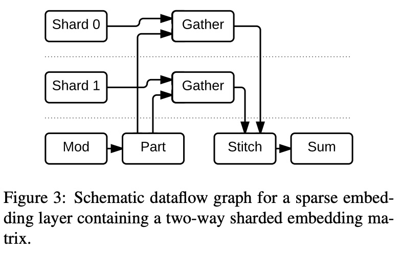
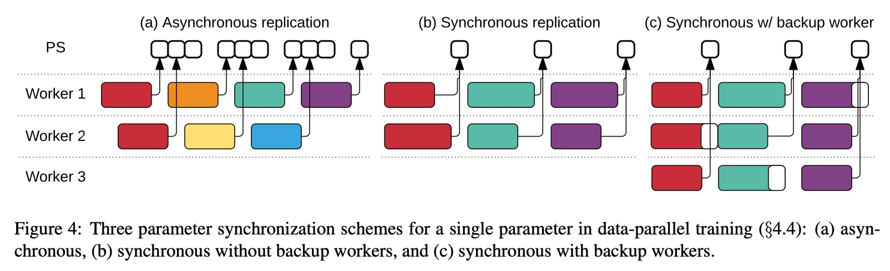
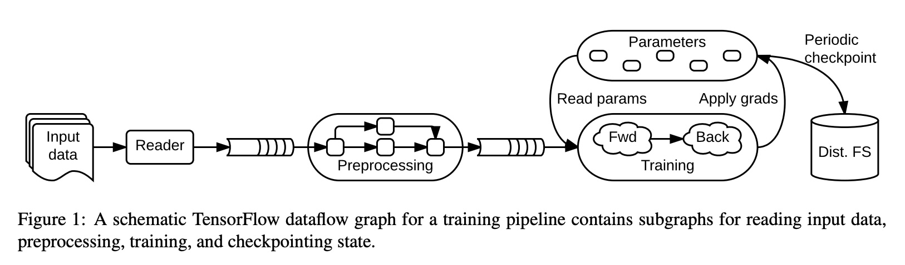
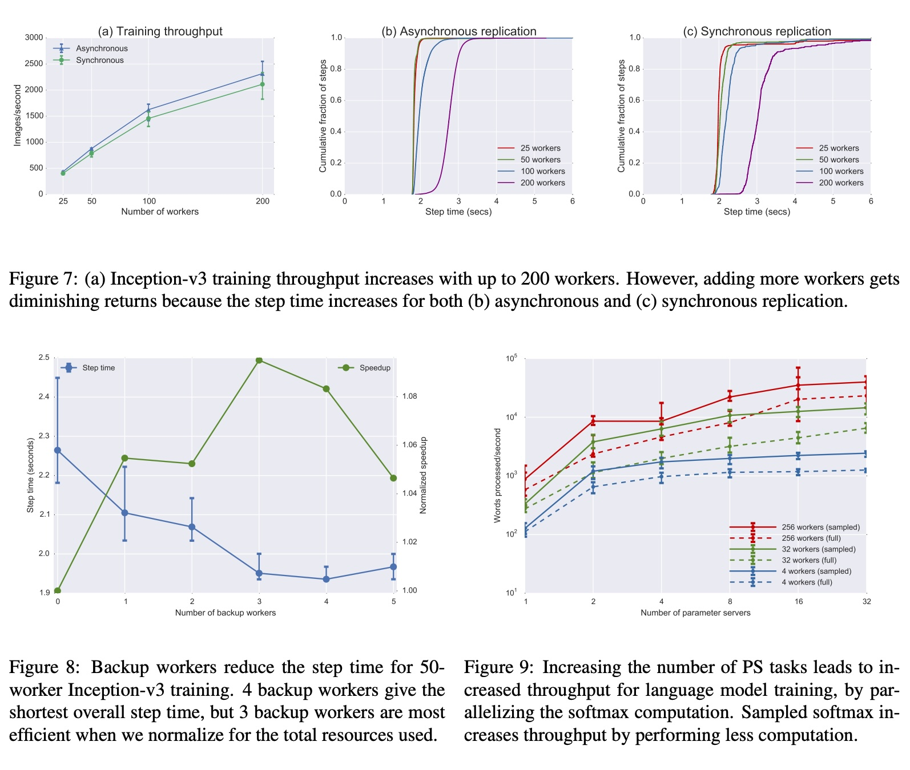

## AI论文解读 | TensorFlow: A system for large-scale machine learning
        
### 作者        
digoal        
        
### 日期        
2025-07-27       
        
### 标签        
PostgreSQL , PolarDB , DuckDB , AI , 论文解读        
        
----        
        
## 背景  
      
https://arxiv.org/pdf/1605.08695        
  
提示:          
```          
读懂《TensorFlow: A system for large-scale machine learning》这篇论文需要提前掌握哪些基础知识, 请使用中文通熟易懂的讲解这些基础知识, 可以引用论文中的图、表或使用Markdown支持的图形(text,mermaid等)增加解释性. 
  
使用中文通熟易懂的解读《TensorFlow: A system for large-scale machine learning》这篇论文, 其中的关键内容请着重讲解, 可以引用论文中的图、表或使用Markdown支持的图形(text,mermaid等)增加解释性. 
  
提取《TensorFlow: A system for large-scale machine learning》这篇论文中的重要术语, 使用中文对这些术语进行通熟易懂的讲解, 可以引用论文中的图、表或使用Markdown支持的图形(text,mermaid等)增加解释性. 
```     
  
## 1 前置知识 
  
好的，为了完全理解《TensorFlow: A system for large-scale machine learning》这篇开创性的论文，你需要对机器学习、分布式系统和计算机体系结构等领域有一些基础的了解。

下面我将这些基础知识分为几个关键部分，并结合论文中的图表，用通俗易懂的中文为你讲解。

### 1\. 机器学习基础 (The "Why")

这是理解论文动机的基石：我们为什么要构建 TensorFlow 这样一个系统？

  * **模型 (Model)、参数 (Parameters) 与训练 (Training)**

      * **简单来说**：机器学习模型就像一个有许多待定“旋钮”的函数。这些“旋钮”就是**参数** 。**训练**的过程，就是给模型看大量的例子（比如，很多猫的图片），然后不断地微调这些“旋钮”（参数），直到模型能做出正确的判断（比如，能准确识别新的猫图片）。
      * **论文关联**：论文提到，当时先进的图像模型有数百万个参数 ，而语言模型更是有上十亿的参数 。用一台机器来调整这么多“旋钮”，会非常缓慢，因此需要一个能调动很多机器一起工作的系统。

  * **随机梯度下降 (Stochastic Gradient Descent, SGD)**

      * **简单来说**：这是最核心的训练算法，好比一个“下山”的过程。你的目标是走到山谷最低点（模型误差最小）。每一步，你都环顾四周，找到最陡的下坡方向（这就是**梯度 (gradient)**），然后朝着这个方向走一小步。重复这个过程，最终就能到达谷底。在训练中，我们不是一次看所有数据（整个山的全貌），而是随机看一小批（a mini-batch）数据  来确定方向，所以叫“随机”梯度下降。
      * **论文关联**：论文明确指出，各种优化算法（如 Momentum, Adam 等）都是 SGD 的变体 。TensorFlow 的一个核心优势就是，它不像之前的系统把优化算法写死，而是允许用户用基本模块灵活地构建和试验新的优化算法 。

  * **训练 (Training) vs. 推理 (Inference)**

      * **训练**：就是上面说的“下山”过程，它计算量大，耗时长，目的是得到一个好模型。
      * **推理**：是模型训练好之后，拿来“使用”的过程。比如，你用手机 App 拍照识花，这个识别过程就是推理。推理要求速度快、延迟低 。
      * **论文关联**：TensorFlow 的一个重要设计目标就是同时支持大规模的训练和高性能的推理 ，并且可以在从数据中心到手机等不同设备上运行 。

### 2\. 深度学习与神经网络 (The "What")

这是 TensorFlow 主要服务的应用领域，理解了它，就能明白为什么 TensorFlow 要有那些特定的设计。

  * **神经网络 (Neural Network) 与反向传播 (Backpropagation)**

      * **简单来说**：神经网络是由很多层“神经元”连接而成的计算结构，特别擅长从复杂数据中学习特征。而**反向传播**是实现梯度下降“下山”过程的具体计算方法。它从模型的最终误差开始，一层一层地往回计算每个“旋钮”（参数）对总误差的“贡献”是多少，从而知道该如何调整它们 。
      * **论文关联**：TensorFlow 提供了一个自动求导（differentiation）的库，可以自动计算反向传播，大大简化了模型开发 。

  * **嵌入层 (Embedding Layer) 与大模型处理**

      * **简单来说**：在处理语言时，词汇量可能非常大（比如80万个词 ）。直接处理这些词很困难。**嵌入层**是一种聪明的技术，它把每个词映射成一个低维度的、稠密的数字向量（比如100维）。这样既能表达词的含义，又能大大减少计算量。
      * **论文关联**：论文的**图3**展示了如何处理一个巨大的嵌入矩阵。因为矩阵太大，一台机器存不下，就把它**切片 (Shard)** 后存到多个参数服务器上。当需要查找某些词的向量时，`Part` 操作会计算出要去哪个分片上查找，`Gather` 操作从对应分片上取出数据，最后 `Stitch` 操作把结果拼起来 。这体现了 TensorFlow 处理超大模型的灵活性 。   

    *图解：上图展示了一个被切成两片（Shard 0, Shard 1）的巨大参数矩阵。当需要查询数据时，系统会自动将请求分发到不同的分片上（Gather），然后将结果合并（Stitch），从而实现对单个机器无法容纳的超大模型的处理 。*

### 3\. 分布式系统概念 (The "How")

这是理解 TensorFlow 如何实现“大规模”的关键。

  * **数据并行 (Data Parallelism) vs. 模型并行 (Model Parallelism)**

      * **数据并行**：最常见的并行方式。你有多个“工人”（Worker），每个工人都拿到一份完整的模型副本，但只处理一小部分数据。他们各自算出对模型参数的修改建议（梯度），然后汇总起来更新模型 。
      * **模型并行**：当模型本身太大，一台机器的内存或显存都装不下时使用。就像上面**图3**展示的，把模型切成几块，分给不同的机器 。

  * **参数服务器 (Parameter Server) 架构**

      * **简单来说**：这是一种经典的分布式训练架构。系统里有两种角色：**参数服务器 (PS)**，专门负责存储和更新模型的全部参数；**工人 (Worker)**，负责拿取最新的参数，用自己的数据进行计算，然后把算出的更新量发回给参数服务器 。
      * **论文关联**：TensorFlow 的设计**吸收并超越**了参数服务器架构 。用户可以在 TensorFlow 中用`Variable`（变量）等基本模块，自己搭建出参数服务器的功能，甚至可以在参数服务器上执行更复杂的计算，而不仅仅是简单的读写 ，这带来了极大的灵活性。

  * **同步 (Synchronous) vs. 异步 (Asynchronous) 训练**

      * **简单来说**：想象一个团队（工人们）一起拧螺丝（更新参数）。
          * **异步 (Asynchronous)**：每个人干完自己的活就去更新，不等别人。优点是速度快，不会被慢的人拖累。缺点是大家用的可能是“过期”的参数，训练效率可能不高 。
          * **同步 (Synchronous)**：所有人必须都完成这一轮的工作后，大家一起更新。优点是每一步都基于最新的参数，训练更稳定。缺点是整体速度被最慢的那个人（straggler）拖累 。
      * **论文关联**：论文的**图4**生动地展示了这两种模式的区别，并提出了一种带“备胎工人”（backup worker）的同步模式来缓解短板效应 。   

    *图解：(a) 异步：每个工人各自为战，更新参数时版本可能不同 。 (b) 同步：所有工人等待最慢的一个完成后，一起更新 。 (c) 带备胎的同步：引入额外的工人，谁先算完就用谁的结果，只要凑够数量就进行更新，可以有效缓解慢工人带来的延迟 。*

  * **容错 (Fault Tolerance)**

      * **简单来说**：大规模训练可能要跑几天几夜，中间有机器宕机是常事 。为了不让训练成果付诸东流，系统需要一种机制，能在机器挂掉后从之前的状态恢复。
      * **论文关联**：TensorFlow 的容错是通过**检查点 (Checkpointing)** 实现的。系统会周期性地把所有参数（`Variable`）的状态保存（`Save`操作）到分布式文件系统里 。如果任务失败重启，可以从最新的检查点恢复（`Restore`操作）状态，继续训练 。

### 4\. 数据流编程模型 (The Core Abstraction)

这是 TensorFlow 最核心、最独特的思想。

  * **数据流图 (Dataflow Graph)**

      * **简单来说**：TensorFlow 把所有的计算都表示成一个有向图 。图中的**节点 (Node)** 代表一个**操作 (Operation)**，比如矩阵乘法(`MatMul`)或加法(`Add`) 。图中的**边 (Edge)** 代表在操作之间流动的数据，这些数据被称为**张量 (Tensor)**，也就是多维数组 。
      * **论文关联**：**图1** 就是一个典型的 TensorFlow 数据流图。它清晰地展示了从读取数据、预处理、训练，到参数更新和保存检查点的整个流程。这种用图来表示计算的方式，使得并行计算和分布式执行变得非常直观和容易 。 

    *图解：数据从左侧的“输入数据”开始，流经“读取器”、“预处理”队列，进入“训练”核心循环（包含前向 Fwd 和后向 Back 计算），训练结果（梯度）被用于更新“参数”，同时参数会被周期性地“保存检查点”到分布式文件系统（Dist. FS） 。*

  * **可变状态 (Mutable State)**

      * **简单来说**：传统的很多数据流系统（如 Spark）处理的数据都是不可变的。但 TensorFlow 的图节点可以拥有**可变的状态**，最典型的就是 `Variable` 操作，它持有的参数值可以在每次训练后被改变 。
      * **论文关联**：正是这种“数据流图 + 可变状态”的组合，让 TensorFlow 既有数据流模型的清晰性，又能灵活地实现参数服务器等需要状态管理的复杂架构 。

### 总结

要读懂这篇论文，你需要戴上三副眼镜：

1.  **机器学习研究者**的眼镜：理解训练、推理、SGD、神经网络等基本概念，明白这个系统要解决的核心问题是什么。
2.  **分布式系统工程师**的眼镜：思考数据/模型并行、同步/异步、容错等问题，理解系统是如何做到大规模、高可用的。
3.  **系统架构师**的眼镜：欣赏数据流图这一核心抽象的优雅之处，明白它是如何统一表示计算、状态和通信，并实现极致灵活性的。

有了以上基础，你就能更好地领会 TensorFlow 在当时为什么是一个突破性的系统，以及它如何为后来的深度学习框架奠定了坚实的基础。
  
## 2 解读论文 
  
好的，我们来通俗易懂地解读一下这篇开创性的论文——《TensorFlow: 一个用于大规模机器学习的系统》。

这篇论文由 Google Brain 团队在 2016 年发表 ，系统性地介绍了他们研发的第二代大规模机器学习框架 TensorFlow。可以把它看作是 TensorFlow 的“出生证明”和“设计白皮书”。

-----

### 引言：TensorFlow 是什么？为什么要造它？

简单来说，**TensorFlow 是一个为大规模和异构（即包含不同类型硬件）环境设计的机器学习系统** 。

在 TensorFlow 出现之前，机器学习领域已经有很多工具，但它们或多或少都有一些“偏科”：

  * 一些工具（如 Caffe、Theano、Torch）在单台计算机上表现出色，尤其擅长利用 GPU 加速，但难以扩展到多台机器的集群上 。
  * 另一些系统（如基于 MapReduce 或 Spark 的系统）擅长处理海量数据，但它们的设计哲学是处理不可变数据，这使得更新模型参数（机器学习训练的核心）变得非常笨重和缓慢 。
  * 还有一类是“参数服务器”（Parameter Server）架构，比如谷歌的第一代系统 DistBelief 。它专门为分布式训练设计，由一组服务器专门存储和更新模型参数，另一组“工人”服务器负责计算。这种架构很有效，但不够灵活 。如果你想尝试一个新的优化算法，就必须去修改底层的 C++ 核心代码，这对大多数研究者来说门槛太高了 。

因此，谷歌团队的目标是创造一个**集大成者**：既要有单机框架的**灵活性**，又要有分布式系统的**扩展性**，还要能轻松驾驭 CPU、GPU 甚至专门定制的芯片（如 TPU）。TensorFlow 就此诞生。

-----

### 核心思想：一切皆为“数据流图” (Dataflow Graph)

TensorFlow 最核心、最根本的设计思想是**使用数据流图来表示一切计算** 。这篇论文花了大量篇幅解释这个模型，因为它是理解 TensorFlow 的钥匙。

一个数据流图由两部分组成：

  * **节点 (Nodes)**：代表计算操作 (Operations)，比如一次矩阵乘法 (`MatMul`)、一个加法 (`Add`) 或者一个卷积 (`Conv2D`) 。
  * **边 (Edges)**：代表在节点间流动的数据。这些数据被统一称为 **张量 (Tensors)**，也就是多维数组 。

#### 关键创新：带“状态”的数据流

传统的数据流系统（如 Spark）处理的都是不可变数据。而 TensorFlow 的一大突破是**允许图中的节点拥有和更新可变的状态 (mutable state)** 。这主要通过两种特殊的操作实现：

1.  **变量 (Variable)**：这是一种特殊的操作，它持有一个可变的、持久化的张量 。在机器学习中，模型的参数（比如神经网络的权重）就存储在变量里。你可以通过 `Read` 操作读取它的值，并通过 `Assign` 或 `AssignAdd` 等操作来更新它 。
2.  **队列 (Queue)**：队列是另一种有状态的操作，可以用来实现复杂的协调和同步 。比如，可以用一个队列来缓冲预处理好的训练数据，供训练计算消费，实现输入流水线 。

将“状态管理”和“计算”统一在同一个数据流图中，赋予了 TensorFlow 巨大的灵活性。开发者不再受限于固定的“参数服务器”模式，而是可以用基础的模块（`Variable`、`Queue` 和各种计算操作）自由地搭建出各种新颖的分布式训练架构 。

#### 灵活执行：部分与并发

TensorFlow 并不需要一次性执行整个庞大的图。用户可以指定图中的任意一部分来运行，这被称为**部分执行 (Partial Execution)** 。你只需要告诉 TensorFlow：

  * 我要“喂”给图什么数据 (`feed`)
  * 我想要从图中“取”出什么结果 (`fetch`)

运行时会自动剪裁出从 `feed` 到 `fetch` 所需的最小子图来执行 。

更强大的是，**多个这样的子图执行（称为一个 `step`）可以并发进行** 。论文中的 **图 1** 极好地展示了这一点：   

*图 1: 一个典型的 TensorFlow 训练流程图*

在这个图中，至少有四组计算在并发运行：

  * **输入流水线**：从分布式文件系统 (Dist. FS) 读取数据 (`Reader`)，并进行预处理 (`Preprocessing`) 。
  * **训练核心**：多个并行的训练步骤 (`Training`) 从参数 (`Parameters`) 中读取权重，使用预处理好的数据计算梯度，然后将梯度应用 (`Apply grads`) 回去以更新参数 。
  * **参数**：这些是 `Variable`，持有模型的状态 。
  * **周期性检查点 (Checkpoint)**：一个独立的子图会定期将参数 `Save` 到分布式文件系统，用于容错和恢复 。

这些并发的计算通过共享的 `Variables`（参数）和 `Queues`（数据缓冲）进行协调 。

#### 分布式执行

数据流图天然适合分布式计算，因为它明确了计算之间的依赖和通信关系 。TensorFlow 的分布式执行分为几步：

1.  **设备放置 (Placement)**：运行时算法会决定图中的每个操作应该放在哪个设备上执行（例如，任务A的CPU，任务B的GPU）。
2.  **图分区 (Partitioning)**：一旦放置完成，整个图就被切割成多个子图，每个设备一个 。
3.  **通信插入 (Communication Insertion)**：如果一条边跨越了两个设备，TensorFlow 会自动在这两个子图之间插入一对 `Send` 和 `Recv` 操作，用于跨设备传输数据 。

这样一来，同一个程序代码，无需修改，就可以部署到各种环境中：从用于训练的 GPU 集群，到用于推理服务的 TPU 集群，再到手机本地运行 。

-----

### 可扩展性案例研究：用“积木”搭建高级功能

这篇论文最精彩的部分之一，就是展示了如何仅使用数据流图的基础“积木”，就能搭建出过去需要硬编码到系统核心里的高级功能。这充分证明了 TensorFlow 设计的灵活性。

#### 1\. 自动微分和自定义优化器

在 TensorFlow 中，你只需要定义模型的正向计算过程和损失函数，系统库就能**自动为你计算所有参数的梯度**（即反向传播）。更重要的是，你可以轻松地实现和实验各种高级优化算法，如 Momentum、Adam 等 。这在老系统中是不可想象的，因为那需要修改核心的 C++ 代码 。而在 TensorFlow 里，这些复杂的算法不过是 `Variable` 和基础数学操作的组合而已 。

#### 2\. 处理超大规模模型（如语言模型）

当模型参数大到一台机器的内存都放不下时（例如，拥有数十亿参数的语言模型 ），就需要将参数分片（Shard）存放在多个参数服务器上。TensorFlow 通过基础操作的组合优雅地实现了这一点。**图 3** 展示了一个被分成两片的嵌入层（Embedding Layer）的查找过程：
  
  
  
*图 3: 分片嵌入层的稀疏查找示意图*

这个过程是：

  * 输入的 ID (例如词的 ID) 首先通过 `Part` (Partition) 操作，被分发给持有对应数据分片 (`Shard 0`, `Shard 1`) 的服务器 。
  * 在每个分片上，`Gather` 操作负责从该分片的参数中精确地取出所需的那几行数据 。
  * 最后，`Stitch` 操作将从各个分片收集回来的结果重新拼接成一个完整的张量 。

整个过程，包括梯度回传时的稀疏更新，都是由用户层级的图定义完成的，这使得处理任意大模型和自定义分片策略成为可能 。

#### 3\. 同步训练与备份“工人”

传统的分布式训练大多采用**异步更新**，即每个“工人”算好梯度后不等别人，直接更新参数。这样做吞吐量高，但因为梯度是基于“过时”的参数计算的，所以训练效率不高 。

**同步训练**要求所有工人都计算完梯度后，汇总起来统一更新参数，这样虽然每一步训练更有效，但整体速度会被最慢的那个“拖后腿”的工人（straggler）拖慢 。

TensorFlow 的灵活性让研究者可以轻松实现和对比这些方案。**图 4** 生动地展示了三种不同的同步策略：
  
  
  
*图 4: 三种参数同步方案*

  * **(a) 异步复制 (Asynchronous)**：各自为战，算完就更新。参数的版本（方块内的颜色）在不同工人之间是不同步的 。
  * **(b) 同步复制 (Synchronous)**：使用队列作为屏障，所有工人必须等待彼此，然后应用一个统一的更新 。
  * **(c) 带备份工人的同步 (Synchronous w/ backup worker)**：这是对(b)的巧妙优化。假设需要 N 个工人的梯度，系统会启动 N+k 个工人（k是备份工人数）。一旦收到了最快的 N 个工人的梯度，就立刻进行更新，不必再等待那 k 个慢的 。

实验证明（见下文 **图 8**），这种带备份工人的同步方式能在保证同步训练有效性的同时，显著减少“拖后腿”现象，提升整体训练速度 。而这一切，都是通过在数据流图中巧妙地使用队列实现的 。

-----

### 性能评估：TensorFlow 到底快不快？

论文最后通过一系列实验证明，TensorFlow 不仅灵活，而且性能卓越。

  * **单机性能**：**表 1** 显示，在单个 GPU 上训练多个经典的卷积神经网络时，TensorFlow 的性能与当时以速度著称的 Torch 框架不相上下，远超 Caffe 。这得益于它对底层硬件库（如 NVIDIA 的 cuDNN）的充分利用 。

| Library | AlexNet | Overfeat | OxfordNet | GoogleNet |
| :--- | :--- | :--- | :--- | :--- |
| Caffe [36] | 324 | 823 | 1068 | 1935 |
| Neon [56] | **87** | **211** | **320** | **270** |
| Torch [17] | **81** | 268 | 529 | 470 |
| TensorFlow | **81** | 279 | 540 | 445 |

*表 1: 不同框架在单个 GPU 上的训练耗时(毫秒)，越小越好 。*

  * **分布式扩展性 (图像分类)**：在训练大型图像模型 Inception-v3 时，**图 7** 显示，随着 GPU 工人数量增加到 200 个，训练吞吐量（每秒处理的图片数）持续提升，证明了 TensorFlow 良好的扩展能力 。

    *图 7(a): Inception-v3 训练吞吐量随工人数量增加而提升*

    **图 8** 则量化了“备份工人”策略的效果。在一个 50 工人的同步训练任务中，增加 3-4 个备份工人，可以在只增加少量计算资源的情况下，将整体速度提升约 10% ，有效地缓解了“木桶短板”效应。

    *图 8: 备份工人对 50 工人同步训练的加速效果*

  * **大规模模型扩展性 (语言模型)**：在训练语言模型时，**图 9** 表明，通过将巨大的 Softmax 层参数分片到更多的参数服务器 (PS) 任务上，可以显著提升训练吞吐量（每秒处理的词数）。同时，采用“采样 Softmax”技术（一种计算量更小的近似算法）能进一步将性能提升数倍 。这证明了 TensorFlow 在模型并行和算法灵活性上的优势。

    *图 9: 增加 PS 任务和使用采样 Softmax 对语言模型训练的加速效果*
  
  
  
-----

### 结论与总结

这篇论文的核心贡献在于，它提出并验证了一个**基于数据流图的统一编程模型** 。这个模型足够**灵活**，让研究者可以像搭积木一样自由地构建和实验各种新奇的机器学习算法和系统架构 ；同时，它又足够**强大和可扩展**，能够驾驭由成百上千个 CPU、GPU 组成的异构集群，高效地完成大规模的训练和推理任务 。

TensorFlow 成功地将灵活性和规模化这两个看似矛盾的目标统一起来，为后来机器学习系统的发展树立了一个新的标杆。
  
## 3 术语  
  
好的，我们从论文《TensorFlow: A system for large-scale machine learning》中提取一些最重要的术语，并用通俗易懂的中文进行讲解。

### 1\. 数据流图 (Dataflow Graph)

这是 TensorFlow 最核心、最基本的概念。你可以把它想象成一个详细的计算流程蓝图 。这个蓝图描述了所有需要进行的计算、计算之间的依赖关系以及数据的流向 。

  * **节点 (Node)**: 代表一个**操作 (Operation)**，也就是一个具体的计算单元，比如矩阵乘法或加法 。
  * **边 (Edge)**: 代表在操作之间流动的数据，这些数据被称为**张量 (Tensor)** 。数据从一个操作的输出流向另一个操作的输入 。

一个关键点是，构建数据流图本身并不会进行任何实际的计算。它只是定义了一个静态的计算结构 。

**图解:**
  
  
  
论文中的 **图 1** 就是一个典型的数据流图，它展示了一个完整的训练流程，包括数据读取、预处理、训练和保存模型状态等多个并发执行的计算部分 。

### 2\. 张量 (Tensor)

张量是 TensorFlow 中数据的标准形式，你可以简单地理解为一个**多维数组** 。

  * 一个 0 维张量是一个标量（单个数字）。
  * 一个 1 维张量是一个向量（一维数组）。
  * 一个 2 维张量是一个矩阵（二维数组）。
  * 以此类推，可以是任意维度 。

系统中所有的数据，无论是输入数据、模型参数还是计算结果，都表示为张量 。这些张量沿着数据流图的“边”流动，从一个操作传递到另一个操作 。

### 3\. 操作 (Operation)

操作是数据流图中的计算节点 。每个操作接收零个或多个张量作为输入，并产生一个或多个张量作为输出 。

  * **简单操作**: 如 `Const` (常量) 操作，它没有输入，只产生一个固定的值 。`MatMul` (矩阵乘法) 操作接收两个 2 维张量，产生一个 2 维张量 。
  * **有状态的操作 (Stateful Operations)**: 这是 TensorFlow 的一个重要创新。这类操作拥有可以被多次执行修改的内部状态 。最重要的例子就是下面要讲的 `Variable` 和 `Queue`。

### 4\. 变量 (Variable)

`Variable` 是一种特殊的操作，它持有一个可变的、持久化的内存缓冲区，专门用来存储模型中可训练的参数，比如神经网络的权重和偏置 。

  * 它允许你在图的多次执行（`step`）之间共享和修改状态 。
  * 你可以通过 `Read` 操作读取 `Variable` 的当前值，并通过 `Assign` 或 `AssignAdd` (加法赋值) 等操作来更新它的值 。
  * 这个设计让 TensorFlow 能够灵活地实现参数服务器的功能，因为参数的存储和更新都变成了图中的普通操作 。

### 5\. 队列 (Queue)

`Queue` 是另一种重要的有状态操作，它实现了多种先进先出的队列逻辑，用于在图中并发执行的组件之间进行协调和数据传输 。

  * **数据缓冲**: 在输入流水线中，一个队列可以用来存储预处理好的数据批次，供训练操作消费。如果队列满了，数据预处理就会暂停；如果队列空了，训练操作就会等待。这起到了“背压”(backpressure) 的作用，自动协调了生产和消费的速度 。
  * **同步协调**: 队列的阻塞特性（空或满时会等待）可以被用来充当屏障（barrier），实现复杂的同步策略，例如在分布式同步训练中协调各个“工人”的进度 。

### 6\. 部分执行 (Partial Execution) 与 步骤 (Step)

TensorFlow 允许客户端只执行整个数据流图的一部分，这被称为“部分执行” 。

  * 用户通过指定 `feeds` (要喂入图的数据) 和 `fetches` (要从图中取出的结果) 来定义一个要执行的子图 。
  * 每一次这样的执行调用被称为一个 **`step`** (步骤) 。
  * TensorFlow 的运行时会根据 `feeds` 和 `fetches` 自动剪裁出运行所需的最小子图 。

这个机制非常灵活，例如，同一个大图中，一个 `step` 可以用来执行训练，另一个 `step` 可以用来执行模型评估，还有一个 `step` 可以用来保存检查点 。

### 7\. 分布式执行 (Distributed Execution)

这是 TensorFlow 的核心能力之一，指将一个数据流图的计算分配到一个由多台机器、多个设备（CPU、GPU等）组成的集群上执行 。

  * **设备 (Device)**: 指一个可以执行操作的计算单元，比如一台机器上的第 0 个 CPU (`/job:worker/task:0/cpu:0`) 或第 1 个 GPU (`/job:worker/task:1/gpu:0`) 。
  * **放置 (Placement)**: 运行时系统会负责将图中的每一个操作分配到一个具体的设备上 。
  * **Send/Recv 操作**: 当图的一条边跨越了两个不同的设备时，TensorFlow 会自动在这条边上插入一对 `Send` (发送) 和 `Recv` (接收) 操作，来处理跨设备的数据传输 。

### 8\. 同步训练 (Synchronous Training) 与 异步训练 (Asynchronous Training)

这是分布式训练中两种主流的参数更新策略，论文用 **图 4** 进行了生动的展示。
  
  
  
  * **(a) 异步训练 (Asynchronous Training)**: 每个“工人”各自为战。计算完梯度后，不等其他工人，直接去更新参数服务器 (PS) 上的参数 。这样做的好处是系统总利用率高，不会被慢的工人拖累。缺点是每个工人使用的参数版本可能已经“过时”，影响收敛效率 。
  * **(b) 同步训练 (Synchronous Training)**: 所有工人必须“步调一致”。大家一起从参数服务器获取相同版本的参数，计算完梯度后，等待所有人完成，然后将所有梯度聚合起来，进行一次统一的更新 。这样做训练的每一步都更有效，但整体速度会被最慢的那个工人（straggler）拖慢 。

### 9\. 备份工人 (Backup Workers)

这是论文中提出的一种非常巧妙的优化，用于缓解同步训练中的“拖后腿”问题 。

  * **思想**: 如果同步训练需要 N 个工人的结果，那么就启动 N+k 个工人（k \> 0）。参数服务器不必等待所有的 N+k 个工人都返回结果，而是只要收到了最快的 N 个工人的梯度，就立即进行聚合与更新 。
  * **效果**: 如上图 **(c)** 所示，Worker 3 是一个备份工人。当 Worker 1 和 Worker 2 完成后，系统无需等待可能很慢的 Worker 3（图中它没完成），直接进行更新。这大大降低了被单个慢速机器影响的概率，提升了同步训练的吞吐量 。
  
## 参考        
         
https://arxiv.org/pdf/1605.08695    
        
<b> 以上内容基于DeepSeek、Qwen、Gemini及诸多AI生成, 轻微人工调整, 感谢杭州深度求索人工智能、阿里云、Google等公司. </b>        
        
<b> AI 生成的内容请自行辨别正确性, 当然也多了些许踩坑的乐趣, 毕竟冒险是每个男人的天性.  </b>        
  
