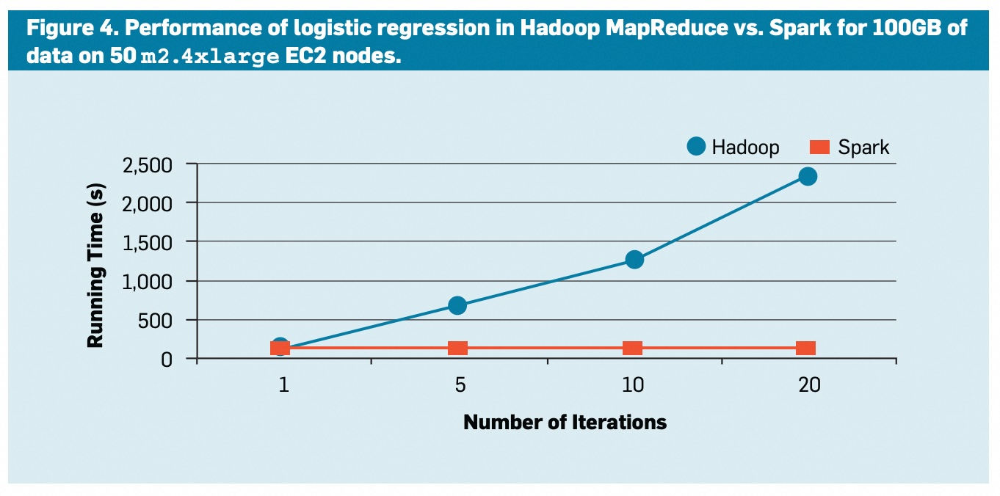

## AI论文解读 | Apache Spark: A Unified Engine for Big Data Processing
        
### 作者        
digoal        
        
### 日期        
2025-07-28       
        
### 标签        
PostgreSQL , PolarDB , DuckDB , AI , 论文解读        
        
----        
        
## 背景  
      
https://dl.acm.org/doi/pdf/10.1145/2934664        
  
提示:          
```          
读懂《Apache Spark: A Unified Engine for Big Data Processing》这篇论文需要提前掌握哪些基础知识, 请使用中文通熟易懂的讲解这些基础知识, 可以引用论文中的图、表或使用Markdown支持的图形(text,mermaid等)增加解释性. 
  
使用中文通熟易懂的解读《Apache Spark: A Unified Engine for Big Data Processing》这篇论文, 其中的关键内容请着重讲解, 可以引用论文中的图、表或使用Markdown支持的图形(text,mermaid等)增加解释性. 
  
提取《Apache Spark: A Unified Engine for Big Data Processing》这篇论文中的重要术语, 使用中文对这些术语进行通熟易懂的讲解, 可以引用论文中的图、表或使用Markdown支持的图形(text,mermaid等)增加解释性. 
```     
  
## 1 前置知识 
  
好的，为了完全理解《Apache Spark: A Unified Engine for Big Data Processing》这篇开创性的论文，你需要预先掌握一些关于大数据和分布式计算的基础概念。这篇论文的核心在于，它介绍了一种名为Spark的“统一”计算引擎，旨在解决此前需要用多种不同专用系统才能完成的复杂数据处理任务。

以下是读懂这篇论文所需的核心基础知识，我会用通俗易懂的方式并结合论文中的图表来解释。

### 基础知识一：什么是“大数据”与“分布式计算”？

想象一下，你要统计一个拥有上亿册藏书的图书馆里某个词语出现的总次数。一个人一台电脑，哪怕不吃不喝，也需要花费数年时间，这台电脑的硬盘也存不下所有书籍的内容。

这就是“大数据”挑战的核心：数据量已经大到超出了单台计算机的处理和存储能力 。

为了解决这个问题，人们想出了一个办法：不再依赖一台“超级计算机”，而是将成百上千台普通计算机连接起来，形成一个“集群”（Cluster），让它们分工协作，共同完成任务。这种让多台机器协同工作的思想，就是**分布式计算**。

这篇论文讨论的Spark，就是一个运行在计算机集群上的分布式计算框架 。

### 基础知识二：经典但略显笨拙的先行者——MapReduce

在Spark出现之前，分布式计算领域最著名的编程模型是Google提出的**MapReduce** 。你可以把它理解为一种分布式计算的“标准流程”。它将复杂的任务拆解为两个核心阶段：

1.  **Map（映射）**：分而治之。就像派1000个图书管理员（计算机节点），每人负责一个书架（一部分数据）。他们的任务是（Map），在自己负责的书籍里，找到目标词语，每找到一次，就记下一个“1”。
2.  **Reduce（规约）**：汇总结果。等所有管理员都完成后，一个总管理员（另一个计算阶段）把所有人的记录收集起来，把同一个词语下的所有“1”都加起来（Reduce），得到最终的总数。

MapReduce模型非常强大，解决了从无到有的问题。但它有一个巨大的性能瓶颈，这正是Spark要解决的关键痛点：**每完成一步计算（比如Map阶段），为了保证数据不丢失（即“容错”），所有中间结果都必须写入到缓慢的分布式文件系统（比如HDFS）中** 。

这就像每个图书管理员完成自己的统计后，不是直接告诉总管理员，而是把结果刻在石板上，运到一个中央仓库，总管理员再去仓库把石板取出来读取。如果任务需要多轮迭代计算（比如机器学习训练），这个来回搬运“石板”的过程会极其耗时。

论文中的**图4**非常直观地展示了这一点：   

*来源：论文 Figure 4 *

> 在这个图中，蓝线代表传统的Hadoop MapReduce。你可以看到，随着迭代次数（Number of Iterations）的增加，它的运行时间（Running Time）是线性增长的，因为每一次迭代都要从磁盘重新读取全部数据 。而红线代表的Spark，在首次加载数据后，后续迭代速度极快，几乎是水平的 。这是因为Spark可以将数据“持久化”在内存中，避免了重复的磁盘读写。

### 基础知识三：“群雄割据”——针对不同任务的专用系统

大数据处理并非只有MapReduce这一种批处理任务。随着应用场景的丰富，出现了各种各样的计算需求，也因此诞生了各种“专用”的计算引擎 ：

  * **批处理 (Batch Processing)**：处理海量的静态数据，对时效性要求不高。MapReduce是典型代表。
  * **交互式查询 (Interactive SQL)**：像使用数据库一样，对大数据进行快速的即席查询，要求在秒级或分钟级返回结果。例如Dremel、Impala 。
  * **流处理 (Streaming Processing)**：处理永不间断的实时数据流，例如实时欺诈检测、网站用户行为分析。例如Storm 。
  * **图计算 (Graph Processing)**：专门用于处理关系网络数据，如社交网络的好友关系、交通网络。例如Pregel 。

这里的核心问题是：一个真实的、复杂的大数据应用，往往需要**组合使用**上述多种处理能力 。比如，一个推荐系统可能需要：

1.  用**批处理**训练一个基础模型。
2.  用**流处理**实时更新这个模型。
3.  提供**交互式查询**接口供分析师探索数据。

在Spark出现之前，开发者必须学习并维护多个异构系统，在它们之间来回导入导出数据，这不仅开发复杂，而且效率低下 。

### 基础知识四：编程中的函数式思想（Map, Filter）

论文中提到了`map`、`filter`、`reduce`等操作 。这些是源自**函数式编程**的概念，理解它们有助于理解Spark的API。

  * `map(function)`：对一个数据集里的**每一个**元素应用同一个函数（操作），生成一个新的数据集。例如，`map(x => x * 2)`会把一个数字列表 `[1, 2, 3]` 变成 `[2, 4, 6]`。
  * `filter(function)`：对一个数据集里的**每一个**元素进行判断，只保留那些满足条件的元素，生成一个新的、更小的数据集。例如，`filter(x => x > 5)` 会把 `[1, 8, 3, 10]` 变成 `[8, 10]`。
  * `reduce(function)`：将一个数据集里的所有元素通过一个函数“聚合”成一个单一的值。例如，`reduce((a, b) => a + b)` 会把 `[1, 2, 3, 4]` 累加成 `10`。

Spark巧妙地将这些简洁的编程概念应用到了大规模的分布式数据上。

### 总结：带着这些知识，再看Spark的创新

当你掌握了以上四点基础知识后，就能深刻理解Spark的贡献了。Spark通过一个核心抽象——**弹性分布式数据集（Resilient Distributed Dataset, RDD）** ，实现了它的“统一”目标。

你可以将RDD理解为一个分布在整个集群、可被并行操作的、不可变的数据集合 。它有两大特性：

1.  **支持内存计算与数据共享**：RDD可以被显式地缓存在集群的内存中（使用`persist()`操作）。这直接解决了MapReduce的性能瓶颈，实现了图4所示的巨大性能提升 。   
2.  **通过“血统（Lineage）”实现容错**：RDD不需要通过在磁盘上存储多份数据来保证容错。它会记录下自己是如何通过一系列转换（如`map`, `filter`）从原始数据计算而来的 。这个记录就是它的“血统”。如果某个RDD的分区数据丢失，Spark可以通过血统关系，从原始数据重新计算出丢失的部分，高效地恢复数据 。论文的**图2**就清晰地展示了这种血统关系。   

*来源：论文 Figure 2 *

> `time fields`这个RDD是由`PHP errors`经过`map`操作得来的，而`PHP errors`又是从`errors`经过`filter`操作得来，以此类推。如果`PHP errors`的数据丢失，Spark可以追溯到`lines`，重新执行`filter`和`map`来恢复它。

最终，Spark在RDD这个核心引擎之上，构建了用于不同任务的库，如**Spark SQL**（交互式查询）、**Spark Streaming**（流处理）、**MLlib**（机器学习）和**GraphX**（图计算） 。

*来源：论文 Figure 1 *

如**图1**所示，所有这些高级库都运行在同一个底层引擎上，共享RDD这一数据抽象。这使得开发者可以在一个框架内无缝地组合各种计算任务 ，解决了“群雄割据”带来的复杂性和低效问题，从而实现了其作为“大数据处理统一引擎”的愿景。   
  
## 2 解读论文 
  
好的，这篇题为《Apache Spark：一个统一的大数据处理引擎》的论文，是大数据领域的里程碑式著作。它介绍了一种革命性的计算框架Spark，旨在解决当时大数据处理工具“各自为政”所带来的效率和易用性问题。

下面，我将为您通俗易懂地解读这篇论文的核心内容。

### 核心问题：为什么需要一个“统一”的引擎？

在Spark出现之前，大数据处理领域存在一个普遍的痛点：**不同的任务需要使用不同的、专门的系统** 。

  * **批处理 (Batch Processing)**：如果你要处理海量的历史数据，你可能会用 **Hadoop MapReduce** 。
  * **交互式查询 (Interactive Queries)**：如果你想对数据进行快速查询分析，你可能会用 **Impala** 或 **Dremel** 。
  * **流处理 (Streaming)**：如果你要处理实时的在线数据流，你可能会用 **Storm** 。
  * **图计算 (Graph Processing)**：如果你要分析关系网络，你可能会用 **Pregel** 。

然而，一个真实的大数据应用往往非常复杂，需要将上述多种处理模式组合起来 。比如，一个推荐系统可能需要先用批处理训练模型，再用流处理进行实时更新，最后还要支持交互式查询。开发者不得不学习、部署并维护多个系统，像“缝合怪”一样把它们拼接起来。在系统之间移动海量数据不仅代价高昂，而且开发过程极其复杂 。

### Spark的解决方案：弹性分布式数据集 (RDD)

为了解决这个问题，2009年，加州大学伯克利分校的研究者们发起了Spark项目 。其核心思想是提出一个通用的编程模型，这个模型的关键抽象就是**弹性分布式数据集（Resilient Distributed Dataset, RDD）** 。

你可以把RDD理解为一个分布在整个集群所有机器内存中的、只读的数据集合，但它提供了远超传统模型的强大能力。

#### 1\. 核心特性：内存计算与数据共享

与Hadoop MapReduce每次计算后都将中间结果写入磁盘不同，Spark允许用户将RDD**持久化（persist）在内存中**，以便在后续计算中快速重用 。

这个特性对于需要反复迭代数据的算法（如机器学习和图计算）带来了惊人的性能提升，速度可以快上100倍 。

论文中的 **图4** 就完美地展示了这一点。在一个迭代式的机器学习任务（逻辑回归）中：   

  * **Hadoop MapReduce（蓝线）**：每次迭代都从磁盘读取数据，耗时约110秒 。其运行时间随迭代次数线性增长。
  * **Spark（红线）**：首次加载数据后，后续迭代都在内存中进行，每次仅需约1秒 。

*来源：论文 Figure 4 *

#### 2\. 核心特性：通过“血统”实现的高效容错

RDD的另一个革命性设计是它的容错机制。传统的系统依赖数据复制来保证在机器故障时数据不丢失，而Spark采用了一种更高效的方式，称为 **“血统”（Lineage）** 。

每个RDD都会记录它是通过哪些转换操作从父RDD衍生而来的 。如果某个RDD的数据分区（partition）丢失了（比如所在的机器宕机），Spark可以通过这个“血统”关系，从原始数据重新计算出丢失的部分，而不需要进行昂贵的数据复制 。

论文中的 **图2** 直观地解释了这一概念：   


*根据论文Figure 2  绘制*

上图展示了得到`time fields`这个RDD的完整计算链。假如存放`PHP errors`这个RDD部分数据的节点失效了，Spark会自动追溯到它的父RDD `errors`，并重新应用`filter(line.contains("PHP"))`操作来恢复丢失的数据 。这种基于血统的恢复机制在数据密集型应用中比数据复制要高效得多 。

#### 3\. 核心特性：丰富的算子与惰性求值

Spark提供了两种类型的操作：

  * **转换（Transformations）**：如`map`, `filter`等，它们从一个已有的RDD生成一个新的RDD 。
  * **动作（Actions）**：如`count`, `collect`等，它们触发实际的计算并返回一个结果给主程序 。

Spark采用 **惰性求值（Lazy Evaluation）** 的策略 。当你调用一个转换操作时，Spark并不会立即执行计算，而只是记录下这个操作 。只有当一个动作操作被调用时，Spark才会审视整个计算链（即RDD的血统图），并生成一个优化的执行计划来执行计算 。这使得Spark可以自动地将多个操作合并，减少数据扫描的次数，从而提升性能 。

### 一个统一的引擎：构建于Spark之上的高级库

RDD本身是一个通用的计算抽象，基于它，Spark得以构建一个包含多种功能的高级库栈，并且这些库可以无缝地组合使用 。这正是Spark被称为“统一引擎”的原因。

*来源：论文 Figure 1 *

如**图1**所示，Spark Core引擎之上主要有四大官方库：   

  * **Spark SQL**：提供关系型查询能力，它引入了DataFrame和Dataset的抽象，并拥有基于成本的优化器、列式存储和代码生成等先进技术，性能可与专门的SQL引擎媲美 。
  * **Spark Streaming**：它将实时数据流切分成一系列小批次的RDD，然后用Spark引擎来处理这些批次，从而实现流处理 。这种模式的容错恢复成本更低，并且能与批处理、交互式查询无缝结合 。
  * **MLlib**：Spark的机器学习库，提供了50多种常见的分布式算法，如分类、回归、聚类等 。
  * **GraphX**：用于图计算和图并行处理的库，提供了类似Pregel的API 。

#### 组合的力量：智能手机的比喻

论文作者用了一个绝佳的比喻来形容“统一”的价值：**智能手机** 。在智能手机出现前，你需要分别携带相机、手机、GPS等设备。智能手机将它们的功能统一起来，从而催生了像“视频通话”、“Waze导航”这样需要组合多种功能的新应用 。

同样，Spark的各个库都操作于RDD之上，因此可以轻松地组合。**图5**就展示了一个例子：使用Spark SQL读取历史推文，调用MLlib训练一个K-Means模型，然后用这个模型去处理实时的推文流 。   
  
*来源：论文 Figure 5 *

### 性能与应用

  * **性能**：Spark不仅功能统一，性能也同样出色。**图6**显示，在SQL查询、流处理和机器学习任务上，Spark的性能与Impala、Storm、GraphLab等专用系统相当 。2014年，Spark还打破了Daytona GraySort 100TB数据排序的世界纪录，比之前的Hadoop MapReduce纪录快3倍，而使用的机器数量仅为后者的十分之一 。   

*来源：论文 Figure 6 *

  * **应用**：得益于其通用性和高性能，Spark被全球数千家组织广泛应用 。
      * **腾讯**：在超过8000个节点的集群上使用Spark，每天处理1PB的数据 。
      * **雅虎**：用于页面个性化和推荐 。
      * **高盛**：用于管理数据湖 。
      * **学术界**：在神经科学（图8）、基因组学、天文学等领域得到应用 。   

### 结论

《Apache Spark: A Unified Engine for Big Data Processing》这篇论文的核心贡献在于，它证明了**一个简单而强大的编程模型（RDD），可以高效地统一支持批处理、交互式查询、流处理、机器学习和图计算等多种大数据工作负载** 。Spark通过内存计算和基于血统的容错机制，在实现功能统一的同时保证了卓越的性能，极大地简化了大数据应用的开发，并催生了许多过去难以实现的新型应用 。
  
## 3 术语  
  
好的，这篇论文引入了大数据处理领域的一系列重要术语。下面，我将为您逐一提取并用通俗易懂的方式进行讲解，同时引用论文中的图表和信息来加深理解。

### 1\. 统一引擎 (Unified Engine)

**讲解：**
“统一引擎”是理解Spark核心价值的钥匙。在Spark出现之前，处理不同类型的大数据任务（如批处理、流处理、交互式SQL查询等）需要使用不同的、专门的系统 。这种“各自为政”的模式导致开发复杂且效率低下 。“统一引擎”指的是Spark这一个框架，就能同时支持上述所有类型的计算任务 。

论文作者用了一个很贴切的比喻：**智能手机**。在智能手机诞生前，你需要分别携带相机、GPS和电话。智能手机将这些功能统一起来，催生了像视频通话这样融合多种功能的新应用 。Spark就像大数据领域的智能手机，它统一了数据处理的各种能力。

**图解：**
论文的**图1**清晰地展示了“统一引擎”的构想：底座是核心的Spark引擎，其上构建了用于SQL、流处理（Streaming）、机器学习（ML）和图计算（Graph）的各种专用库 。   

*来源：论文 Figure 1*

### 2\. 弹性分布式数据集 (Resilient Distributed Dataset - RDD)

**讲解：**
RDD是Spark最核心、最基础的编程抽象 。你可以把它想象成一个巨大的、不可变的数据集合，但它的特殊之处在于：

  * **分布式（Distributed）**：这个数据集合被切分成很多块，分散存储在集群中的多台机器上，可以被并行处理 。
  * **弹性（Resilient）**：它具有容错能力。如果存储某个数据块的机器宕机了，Spark有办法自动恢复这些数据。我们下面会讲到它的“血统”机制 。

RDD是Spark对MapReduce模型最重要的扩展，也是其实现高性能和通用性的基石 。

### 3\. 转换 (Transformations) 与 动作 (Actions)

**讲解：**
对RDD的操作分为两类，理解它们的区别至关重要：

  * **转换 (Transformations)**：这类操作会从一个已有的RDD生成一个新的RDD 。常见的转换操作包括 `map`（对每个元素应用一个函数）、`filter`（筛选满足条件的元素）和 `groupBy`（按键分组）。转换操作是“惰性”的，它不会立即执行。
  * **动作 (Actions)**：这类操作会触发实际的计算，并将最终结果返回给驱动程序或者写入到外部存储中 。常见的动作操作包括 `count`（计算元素个数）、`collect`（将所有元素收集回主节点）和 `save`（保存到文件）。

**图解：**
一个典型的Spark作业就是由一系列“转换”操作和一个“动作”操作组成的计算链。


### 4\. 惰性求值 (Lazy Evaluation)

**讲解：**
“惰性求值”指的是，当你调用一个“转换”操作时，Spark并不会马上开始计算，而仅仅是记下这个操作 。只有当一个“动作”操作被调用时，Spark才会回头审视整个计算链（即RDD的血统图），然后生成一个最优的执行计划来执行全部计算 。

这种机制的好处在于，Spark可以全局优化计算过程。例如，它可以将多个连续的`filter`操作合并成一个，从而减少数据扫描的次数，提升效率 。

### 5\. 数据共享 / 持久化 (Data Sharing / Persistence)

**讲解：**
这是Spark相比于MapReduce最主要的性能优势所在 。MapReduce的每次计算后，中间结果都必须写入缓慢的磁盘。而Spark允许用户通过调用`persist()`或`cache()`方法，将一个经常被使用的RDD显式地**缓存在集群的内存中** 。

对于需要反复访问同一数据集的迭代式算法（如机器学习），这个特性可以带来高达100倍的速度提升 。

**图解：**
论文的**图4**用实验数据雄辩地证明了这一点。在逻辑回归任务中，Hadoop MapReduce（蓝线）每次迭代都耗时良久，而Spark（红线）在首次加载数据入内存后，后续迭代几乎瞬时完成 。   

*来源：论文 Figure 4*

### 6\. 血统 (Lineage)

**讲解：**
“血统”是RDD实现容错（即“弹性”）的秘密武器 。传统系统通常通过在不同机器上保存多份数据副本（replication）来容错，这种方式网络开销和存储开销都很大。

Spark则另辟蹊径：每个RDD都会记录它是如何通过一系列“转换”操作从父RDD计算得来的 。这个完整的计算链就是它的“血统” 。当某个RDD的数据块丢失时，Spark不需要去别处找备份，而是可以根据血统图，从原始数据重新计算一遍，从而恢复丢失的数据 。这种恢复方式在数据密集型应用中远比数据复制高效 。

**图解：**
论文的**图2**就是一个血统图的例子。`time fields`这个RDD的“血统”就是`lines -> errors -> PHP errors -> time fields`的完整转换路径 。   

*来源：论文 Figure 2*

### 7\. 数据帧 (DataFrame)

**讲解：**
DataFrame是Spark SQL中引入的一个更高级的API，它在RDD的基础上增加了“Schema”（模式或结构信息）。你可以将DataFrame看作是一张带有列名的分布式表格 。

与自由形式的RDD相比，DataFrame因为知晓数据的结构，所以可以利用Spark SQL的查询优化器进行更深度的自动优化（如谓词下推、列裁剪等），让用户即便不写出最优代码也能获得很高的性能 。它已经成为Spark中处理结构化数据的首选API 。
  
## 参考        
         
https://dl.acm.org/doi/pdf/10.1145/2934664    
        
<b> 以上内容基于DeepSeek、Qwen、Gemini及诸多AI生成, 轻微人工调整, 感谢杭州深度求索人工智能、阿里云、Google等公司. </b>        
        
<b> AI 生成的内容请自行辨别正确性, 当然也多了些许踩坑的乐趣, 毕竟冒险是每个男人的天性.  </b>        
  
  
