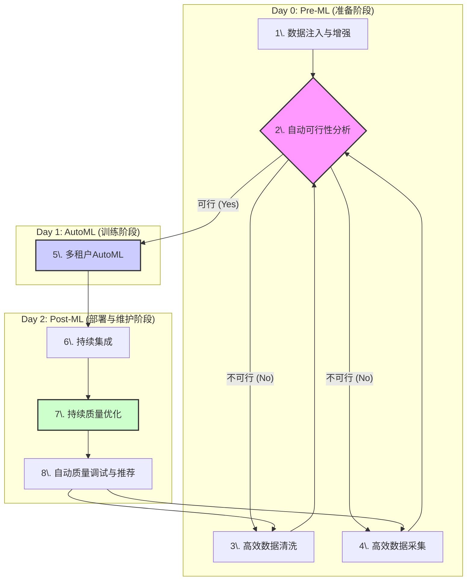
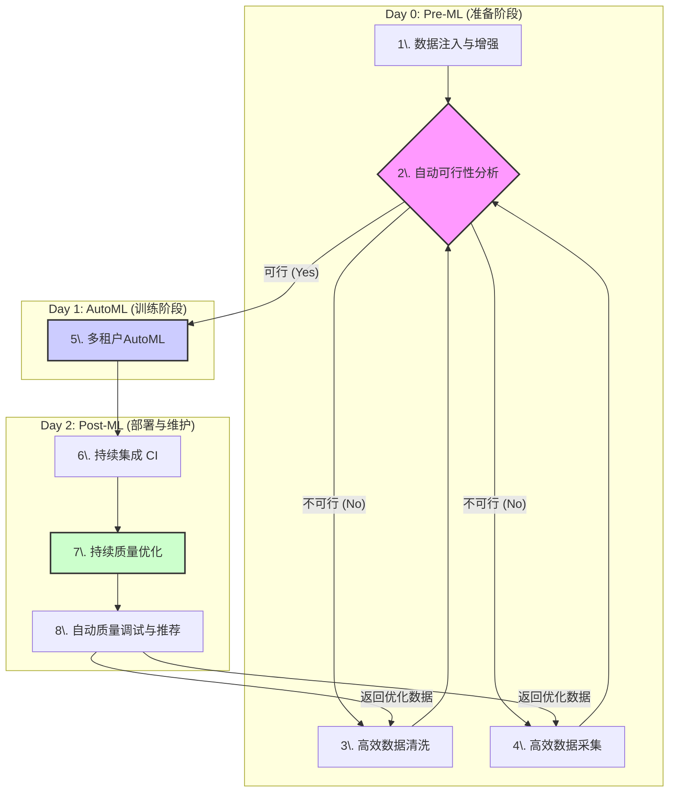
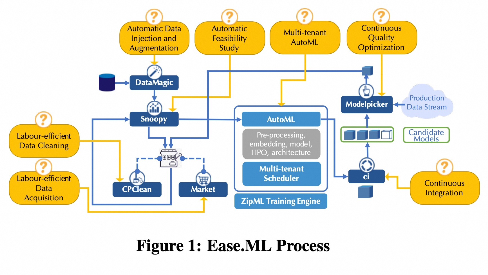

## AI论文解读 | Ease.ML: A Lifecycle Management System for MLDev and MLOps
        
### 作者        
digoal        
        
### 日期        
2025-07-28       
        
### 标签        
PostgreSQL , PolarDB , DuckDB , AI , 论文解读        
        
----        
        
## 背景  
      
https://www.vldb.org/cidrdb/papers/2021/cidr2021_paper26.pdf        
  
提示:          
```          
读懂《Ease.ML: A Lifecycle Management System for MLDev and MLOps》这篇论文需要提前掌握哪些基础知识, 请使用中文通熟易懂的讲解这些基础知识, 可以引用论文中的图、表或使用Markdown支持的图形(text,mermaid等)增加解释性. 
  
使用中文通熟易懂的解读《Ease.ML: A Lifecycle Management System for MLDev and MLOps》这篇论文, 其中的关键内容请着重讲解, 可以引用论文中的图、表或使用Markdown支持的图形(text,mermaid等)增加解释性. 
  
提取《Ease.ML: A Lifecycle Management System for MLDev and MLOps》这篇论文中的重要术语, 使用中文对这些术语进行通熟易懂的讲解, 可以引用论文中的图、表或使用Markdown支持的图形(text,mermaid等)增加解释性. 
```     
  
## 1 前置知识 
  
好的，为了完全理解《Ease.ML: 一个面向MLDev和MLOps的生命周期管理系统》这篇论文，你需要掌握一些横跨机器学习、数据管理和软件工程领域的基础知识。这篇论文的核心思想不是提出一个全新的、更快的机器学习算法，而是构建一个**管理和自动化整个机器学习应用开发流程的“智能脚手架”或“导航系统”**，特别是为那些不是计算机科学或统计学专家的领域专家（例如天文学家、生物学家）设计的 。

下面我将为你通俗地讲解这些必备的基础知识，并结合论文内容进行说明。

### 核心必备知识体系

我们可以将所需的基础知识分为三大块：

1.  **宏观理念**：理解机器学习项目的复杂性 (MLOps)。
2.  **关键技术**：理解系统运作依赖的核心技术 (AutoML, 数据处理, 概率数据库等)。
3.  **工程思想**：借鉴自软件工程的最佳实践 (CI/CD)。

-----

### 1\. 宏观理念：机器学习的生命周期 (MLOps)

**这是理解这篇论文出发点的最重要背景。**

#### (1) 什么是机器学习生命周期？

一个机器学习项目远不止“训练一个模型”那么简单。它是一个复杂的、持续迭代的完整流程，通常被称为“机器学习生命周期”。这个周期包括：

  * **数据准备**：收集、清洗、标注数据。
  * **模型开发**：选择算法、训练模型、调试、评估。
  * **模型部署**：将训练好的模型集成到实际应用中。
  * **持续监控与维护**：模型上线后，需要持续监控其表现，因为真实世界的数据会变化，可能导致模型性能下降（这被称为“模型漂移”）。这时就需要重新迭代整个流程。

管理这个复杂流程的实践和工具集合，就是 **MLOps** (Machine Learning Operations)。

#### (2) 为什么这个生命周期很痛苦？ (论文要解决的问题)

论文作者通过与领域专家的合作，发现他们在使用现有机器学习工具时面临很多困惑和陷阱 。Ease.ML的每一步设计几乎都旨在解决一个或多个这样的痛点 ：

  * **P1. 不切实际的质量期望**：拿着一份质量很差的数据，却期望得到90%以上的准确率 。
  * **P2. 该用多少数据？**：不确定需要多少训练/测试数据才能保证模型的可靠性 。
  * **P3. 怎样才能进一步提升准确率？**：面对数据清洗、数据标注、特征工程等多种提升手段，不知道该先做哪个，常常“白费力气” 。
  * **P4. 新出的模型对我有用吗？**：学术界每天都有新模型，如何判断哪个新模型适合自己的任务，并且如何高效地集成进来？ 。
  * **P5. 模型过时了怎么办？**：如何确保生产环境中的模型与不断变化的线上数据相匹配？比如，不能用二月份的数据训练的模型来处理圣诞节期间的数据 。

**理解Ease.ML的前提**：你需要认识到，一个成功的机器学习系统，其挑战不仅在于算法本身，更在于如何高效、系统地管理从数据到模型的整个端到端流程 。Ease.ML提出的八步流程（如下图所示）就是为了给这个混乱的过程提供一个清晰的“导航” 。



*一个简化的Ease.ML八步流程图，展示了从准备、训练到部署维护的完整闭环。*

-----

### 2\. 关键技术概念

Ease.ML像一个大管家，将许多先进的技术组件整合在一起。要理解它的内部运作，你需要了解以下几个核心技术。

#### (1) AutoML (自动化机器学习)

  * **是什么**：简单来说，就是让机器自动帮你完成选择模型、调整参数等繁琐工作。你只需要提供数据，AutoML系统会尝试多种模型和配置，然后告诉你哪个组合效果最好。
  * **在Ease.ML中的角色**：Ease.ML的第5步 `Multi-tenant AutoML`  就是一个AutoML引擎。但与普通AutoML不同，Ease.ML将它置于一个更大的流程中：在运行昂贵的AutoML之前，它会先通过“可行性分析”（第2步）  判断你的数据是否有潜力达到预期目标，避免无效的计算 。

#### (2) 以数据为中心的AI (Data-Centric AI)

这是一个核心理念，即**提升AI性能的关键更多在于提升数据质量，而非仅仅优化模型**。Ease.ML的“Day 0: Pre-ML”子流程  完美体现了这一点。你需要了解以下相关概念：

  * **数据清洗 (Data Cleaning)**：识别和修正数据中的错误。Ease.ML的 `CPClean` 组件  不仅是清洗，更是**智能地**告诉你应该优先清洗哪些数据，才能对最终模型准确率的提升最大 。
  * **弱监督 (Weak Supervision)**：当高质量的人工标注数据又贵又少时，我们可以利用一些不那么精确的规则、其他模型的输出或关键词等“弱”信息来自动生成大量“有噪声”的标签。Ease.ML在数据注入时，就会利用这类工具（如论文中提到的`Snorkel` ）来扩充数据 。
  * **数据采集/数据估值 (Data Acquisition/Valuation)**：不是所有未标注的数据都具有同等价值。有些数据点对于帮助模型学习至关重要，而另一些则无关紧要。Ease.ML的 `Market` 组件  就是用来**评估未标注数据的价值**，引导用户优先标注那些能最大化提升模型性能的数据 。

#### (3) 概率数据库 (Probabilistic Database)

  * **是什么**：这是理解Ease.ML数据模型设计的**关键** 。想象一个Excel表格，普通表格的每个单元格只有一个确定的值。而在概率数据库中，一个单元格可以包含**多个可能的值，每个值都有一个概率**。
  * **为什么重要**：这个模型可以**统一地表示各种不确定性** 。
      * **数据清洗**：一个脏数据，可以用多种工具清洗，得到多个“干净”的候选值。概率数据库可以将这些候选值都存起来，并附上各自的可信度 。
      * **弱监督**：一个数据点可能被多个弱监督规则打上不同的标签。概率数据库可以将这些候选标签及其置信度存下来 。
      * **未标注数据**：一个未标注的数据，其标签可以看作是所有可能标签的均匀分布 。
  * **在Ease.ML中的角色**：它是整个系统的统一数据模型 ，几乎所有的操作（如数据清洗、标注）都可以被看作是在这个概率数据库上**消除不确定性**的过程 。

#### (4) 信息论基础 (Information Theory)

你不需要深入学习复杂的数学公式，但需要理解两个核心概念的直觉：

  * **熵 (Entropy)**：衡量“不确定性”或“混乱程度”的指标。熵越高，不确定性越大。
  * **互信息 (Mutual Information)**：衡量“知道A能多大程度上减少B的不确定性”。
  * **在Ease.ML中的角色**：Ease.ML将与人的交互（如请求用户清洗或标注一个数据点）建模为一个**最大化信息增益**的过程 。系统会计算“问用户哪个问题（比如，清洗哪个数据点）能最大程度地减少我对‘真实世界’（Ground Truth）的不确定性？”。通过这种方式，系统能用最少的人力成本获得最大的模型性能提升。

-----

### 3\. 软件工程思想：持续集成 (CI/CD)

#### (1) 什么是CI/CD？

  * **持续集成 (Continuous Integration, CI)**：在软件开发中，开发者频繁地将代码集成到主干。每次集成后，系统都会自动运行测试，确保新代码没有破坏原有功能。
  * **持续交付/部署 (Continuous Delivery/Deployment, CD)**：当代码通过所有测试后，自动将其部署到生产环境。

#### (2) CI/CD for ML

Ease.ML将这个思想巧妙地应用到了机器学习中 。

  * **CI for ML**: 当AutoML产生一个新的模型时，系统不会马上接受它。`Ease.ML/ci` 组件  会自动用一个独立的测试集来检验这个新模型是否满足预设的条件（例如，“新模型准确率必须比旧模型高5%以上”） 。只有通过测试的模型才能进入下一阶段。
  * **CD for ML**: `Continuous Quality Optimization` (第7步)  就像是部署前的最后把关。它从所有通过CI测试的候选模型中，用最新的生产数据以最少的标注成本选出表现最好的一个进行部署 。

-----

### 总结

要读懂《Ease.ML》，你需要带着一个**系统工程师**的视角，而不仅仅是一个算法研究者的视角。你需要提前了解：

1.  **MLOps的全局观**：认识到机器学习项目的全流程复杂性和常见痛点。
2.  **核心技术武器**：了解AutoML、数据清洗、弱监督、概率数据库和信息论的基本思想，知道它们是如何被用来解决具体问题的。
3.  **CI/CD的工程哲学**：理解自动化测试和部署对于维护高质量、可靠的机器学习系统的重要性。

掌握了这些基础，你就能更好地理解Ease.ML是如何将这些技术和思想巧妙地编织在一起，构建一个旨在简化和自动化整个ML开发运维流程的强大系统。
  
## 2 解读论文 
  
好的，这篇论文《Ease.ML: 一个面向MLDev和MLOps的生命周期管理系统》的核心思想是：**为那些不精通机器学习的领域专家（如天文学家、社会科学家）提供一个“智能导航系统”，帮助他们系统性地、端到端地完成一个机器学习项目，避免走弯路 。**

它不是一个新的、更快的算法，而是一个管理和自动化整个开发流程的**框架（Framework）** 。下面我们来详细解读这篇论文。

### 核心痛点：为什么机器学习对非专家如此困难？

论文作者们通过和大量非专家用户合作，总结出他们在开发机器学习应用时最常遇到的五大“陷阱与困惑” (Pitfalls and Confusions) 。Ease.ML的设计正是为了解决这些问题：

  * **P1. 不切实际的期望**：用户常常拿着一份充满噪声或定义不清的数据，却希望模型能达到90%以上的超高准确率 。
  * **P2. “我需要多少数据？”**：用户不确定需要准备多少训练和测试数据，并且在使用测试集的过程中，容易因反复测试导致“过拟合”，对模型效果产生过于乐观的估计 。
  * **P3. “如何进一步提升精度？”**：当模型效果不佳时，用户面对数据清洗、数据标注、特征工程等多种手段，不知道下一步该做什么才是最高效的，常常做了很多无用功 。
  * **P4. “新出的酷炫模型对我有用吗？”**：机器学习领域日新月异，用户总想尝试最新的模型，但维护和测试这些新模型的成本非常高，令人望而却步 。
  * **P5. “我的模型是不是过时了？”**：在生产环境中，数据是持续变化的（比如季节性变化）。用户担心用几个月前的数据训练的模型，已经不适应当前的数据了，却不知道如何高效地选择和切换模型 。

### Ease.ML的解决方案：一个清晰的八步流程

为了解决上述痛点，Ease.ML设计了一个包含三个阶段、八个步骤的“傻瓜式”引导流程 。用户只要跟着这个流程走，就能系统性地构建出有质量保证的机器学习应用 。

我们可以用下面的流程图来概括这八个步骤：



-----

#### **第一阶段: Day 0 - Pre-ML (模型构建前的准备)**

这个阶段的目标是确保你的数据质量足够好，值得投入昂贵的计算资源去训练模型 。

1.  **自动数据注入和增强 (Data Injection & Augmentation)**：这是第一步，系统帮助用户将各种格式（如PDF、DOCX）的数据转换成机器可读的结构，并自动进行一些数据增强来扩充数据量 。
2.  **自动可行性分析 (Automatic Feasibility Study)**：**[解决P1]** 这是Ease.ML的一大亮点。系统会像一个ML顾问一样，先分析你的数据，并估算出当前数据质量下可能达到的**最佳模型准确率上限**（即贝叶斯错误率）。如果这个上限低于你的预期，系统会建议你先别急着训练模型，而是去优化数据 。
3.  **高效数据清洗 (Labor-efficient Data Cleaning)**：**[解决P3]** 如果可行性分析结果不理想，系统会给你一个**需要优先手动清洗的“脏数据”列表** 。这个列表是经过智能排序的，清洗它们对模型性能的提升最大 。
4.  **高效数据采集 (Labor-efficient Data Acquisition)**：**[解决P3]** 这是另一个优化数据的选项。系统会告诉你，在未标注的数据中，**优先标注哪些样本**能最高效地提升模型性能 。

#### **第二阶段: Day 1 - AutoML (自动化模型训练)**

当数据通过了“可行性分析”后，就进入了模型训练阶段 。

5.  **多租户AutoML (Multi-tenant AutoML)**：**[解决P4]** Ease.ML会启动AutoML引擎来自动进行特征工程、模型选择和超参数调优 。它的特别之处在于，系统会持续不断地产生模型流，一旦有新的、更好的模型或算法被集成到系统中，它会自动为所有可能受益的用户任务重新运行训练 。

#### **第三阶段: Day 2 - Post-ML (模型部署后的运维)**

模型训练好之后，部署和维护的挑战才真正开始 。

6.  **持续集成 (Continuous Integration)**：**[解决P2]** 模型流中的每个新模型都必须通过“质检”。系统会根据用户定义的标准（例如，“新模型准确率必须比旧模型高5%”）在测试集上进行检验 。为了防止测试集信息泄露导致过拟合，系统会自动管理测试集的“统计能力” 。
7.  **持续质量优化 (Continuous Quality Optimization)**：**[解决P5]** 通过质检的模型会进入一个“候选池” 。每天，系统会从生产环境中获取少量最新的无标签数据，然后以**最少的标注成本**，从候选池中选出在这些新数据上表现最好的模型用于第二天的生产 。
8.  **自动质量调试与推荐 (Automatic Quality Debugging)**：**[解决P3]** 最后，系统会收集当前线上模型的犯错案例，分析原因，并向用户推荐下一步的优化方向，引导用户回到第3步（数据清洗）或第4步（数据采集），形成一个完整的闭环 。

### Ease.ML背后的核心设计思想

#### 1\. 统一的概率数据模型 (A Probabilistic Data Model)

这是Ease.ML的 **“关键设计决策”** 。它不使用传统数据库，而是使用**概率数据库** 。

  * **是什么？** 想象一个表格，普通表格的单元格只有一个确定的值。在概率数据库中，一个单元格可以有**多个候选值，每个值都有一个概率**。
  * **有什么用？** 这种模型可以**用统一的方式来表示所有不确定性** ：
      * **数据噪声**：一个特征可能有多个来自不同清洗工具的“干净”候选值 。
      * **弱监督标签**：一个样本可以被多个规则打上不同的候选标签 。
      * **未标注数据**：一个未标注样本的标签，可以看作是所有可能标签的均匀概率分布 。

这个统一的模型让系统处理各种数据问题变得非常优雅和简洁 。

#### 2\. 将人类交互建模为“信息最大化”

Ease.ML认为，所有需要人参与的环节（如数据清洗、数据标注）的本质都是在**消除不确定性** 。

因此，系统遵循**信息最大化**的原则 。当系统需要向用户求助时，它会问那个能最大程度减少系统不确定性（即提供最多信息）的问题。例如，在数据清洗时，它会让你去清洗那个对最终模型结果影响最大的数据点 。

### 总结与局限

**Ease.ML的贡献在于**：

  * 它首次将机器学习开发的各个环节（数据准备、训练、部署、维护）**整合**成一个端到端的、自动化的生命周期管理系统 。
  * 它为非专家用户提供了一个**清晰、规范的引导流程**，帮助他们避免常见错误 。
  * 它基于**概率数据库**和**信息论**，为处理数据不确定性和人机交互提供了一个有理论基础的统一框架 。

**作者也承认了该研究原型的局限性**：

  * **效率问题**：当前的设计更侧重于理论的严谨性，而非执行效率 。
  * **指标单一**：整个流程目前过度关注“准确率”这一个指标，而对公平性、鲁棒性、可解释性等新兴的关键指标支持不足 。
  
## 3 术语  
  
以下是论文《Ease.ML: A Lifecycle Management System for MLDev and MLOps》中的重要术语及其通俗易懂的中文解释：

### 1. Ease.ML

* **术语**: Ease.ML 
* **中文解释**: Ease.ML是一个机器学习（ML）生命周期管理系统 。它不像许多现有工作那样只关注改进ML应用开发生命周期中的单个步骤 ，而是专注于管理和自动化整个生命周期 。其目标是为非专业ML应用开发者减轻管理整个开发生命周期的负担 ，通过提供自动化工具链和明确定义的流程，将现有和未来的工具整合起来，以改善端到端的开发体验 。

### 2. MLDev & MLOps

* **术语**: MLDev 和 MLOps 
* **中文解释**:
    * **MLDev (Machine Learning Development)**: 指的是机器学习模型的开发过程，从数据准备、特征工程、模型选择、超参数调优到模型训练等一系列活动 。Ease.ML旨在简化和自动化这个开发阶段.
    * **MLOps (Machine Learning Operations)**: 指的是机器学习模型在生产环境中的部署、监控和持续管理。它涵盖了模型部署、版本控制、持续集成、持续交付、模型监控以及在数据分布变化时进行模型更新等. Ease.ML的"Day 2" Post-ML Subprocess（Post-ML子过程）就涵盖了MLOps的部分.

### 3. Ease.ML 八步流程 (Eight-step Ease.ML Process)

* **术语**: Eight-step Ease.ML Process 
* **中文解释**: Ease.ML 定义了一个包含八个步骤的、人机协作（human-in-the-loop）的流程 ，旨在为用户在整个ML旅程中提供系统性指导 。这八个步骤分为三个子过程:
    * **Day 0: Pre-ML Subprocess (预ML子过程)**: 在ML模型构建之前开始 ，目标是系统地改进数据工件，直到系统认为ML可以达到用户期望的质量水平 。包括以下步骤：
        * **自动数据注入和增强 (Automatic Data Injection and Augmentation)**: 将用户数据导入系统，并将其转换为机器可读的格式。它还包括自动数据增强以增加数据量，并启动现有工具进行数据清洗和弱监督，为不确定特征或标签提供候选值.
        * **自动可行性研究 (Automatic Feasibility Study)**: 评估给定数据集是否能达到用户期望的准确性 。如果不能，系统会建议用户改进数据 。
        * **劳动效率型数据清洗 (Labor-efficient Data Cleaning)**: 如果自动可行性研究结果为“否”，系统会提供一个优先级的脏数据列表供用户手动清洗 。目标是最小化手动清洗工作量以达到高ML准确性 。
        * **劳动效率型数据获取 (Labor-efficient Data Acquisition)**: 如果自动可行性研究结果为“否”，系统会提供一个优先级的未标记数据列表供用户手动标记 。目标是最小化手动标记工作量以达到高ML准确性 。
    * **Day 1: AutoML Subprocess (AutoML子过程)**: 当数据工件被认为有潜力达到期望的准确性时，启动AutoML组件生成ML模型 。
        * **多租户AutoML (Multi-tenant AutoML)**: 与其他AutoML系统类似，处理端到端的ML管道，包括自动特征选择和工程、模型选择、超参数调优等。其特点是当有新的ML模型可用时，所有可能使用该模型的用户应用程序都会重新运行 。
    * **Day 2: Post-ML Subprocess (后ML子过程)**: 处理模型的部署阶段 。
        * **持续集成 (Continuous Integration)**: 测试AutoML组件输出的ML模型是否满足用户定义的部署标准（例如，新模型必须比旧模型好5%） 。系统只保留满足条件的模型 。
        * **持续质量优化 (Continuous Quality Optimization)**: 从满足用户要求的候选模型中，选择在最新生产测试集上表现最好的模型进行部署 。
        * **自动质量调试和推荐 (Automatic Quality Debugging and Recommendations)**: 收集当前部署模型在生产中犯的错误，并向用户提供改进模型的建议，例如进行劳动效率型数据清洗或数据获取 。

(图1展示了Ease.ML的整体流程，其中问号标记了与该步骤相关的“痛点”或“困惑” )   
  
## 参考        
         
https://www.vldb.org/cidrdb/papers/2021/cidr2021_paper26.pdf    
        
<b> 以上内容基于DeepSeek、Qwen、Gemini及诸多AI生成, 轻微人工调整, 感谢杭州深度求索人工智能、阿里云、Google等公司. </b>        
        
<b> AI 生成的内容请自行辨别正确性, 当然也多了些许踩坑的乐趣, 毕竟冒险是每个男人的天性.  </b>        
  
  
#### [期望 PostgreSQL|开源PolarDB 增加什么功能?](https://github.com/digoal/blog/issues/76 "269ac3d1c492e938c0191101c7238216")
  
  
#### [PolarDB 开源数据库](https://openpolardb.com/home "57258f76c37864c6e6d23383d05714ea")
  
  
#### [PolarDB 学习图谱](https://www.aliyun.com/database/openpolardb/activity "8642f60e04ed0c814bf9cb9677976bd4")
  
  
#### [PostgreSQL 解决方案集合](../201706/20170601_02.md "40cff096e9ed7122c512b35d8561d9c8")
  
  
#### [德哥 / digoal's Github - 公益是一辈子的事.](https://github.com/digoal/blog/blob/master/README.md "22709685feb7cab07d30f30387f0a9ae")
  
  
#### [About 德哥](https://github.com/digoal/blog/blob/master/me/readme.md "a37735981e7704886ffd590565582dd0")
  
  

  
