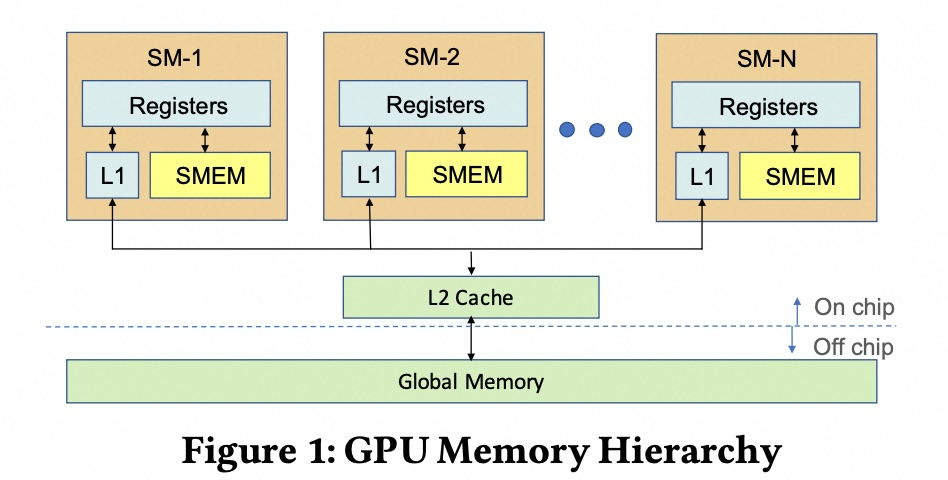
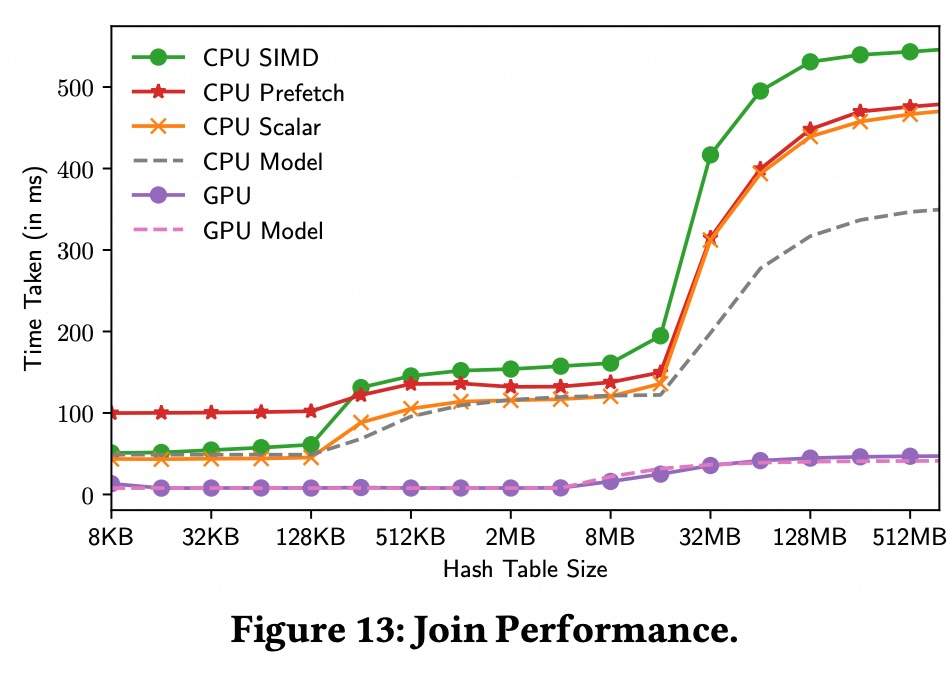
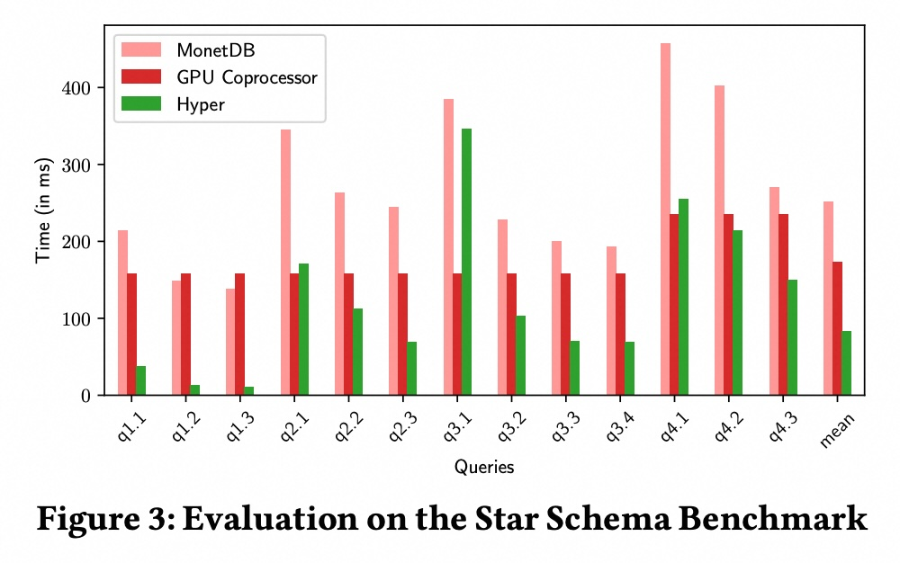
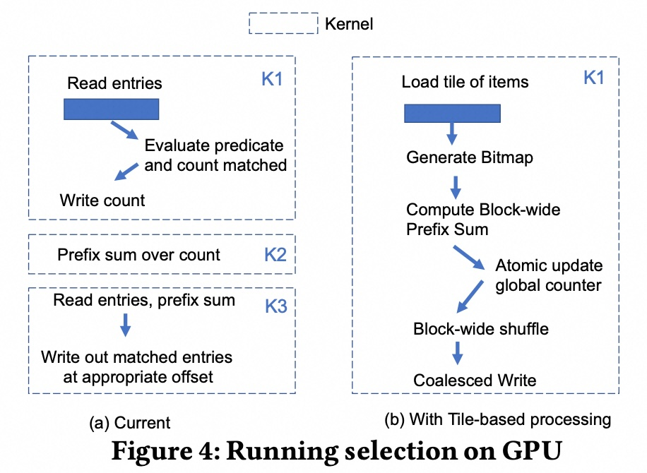
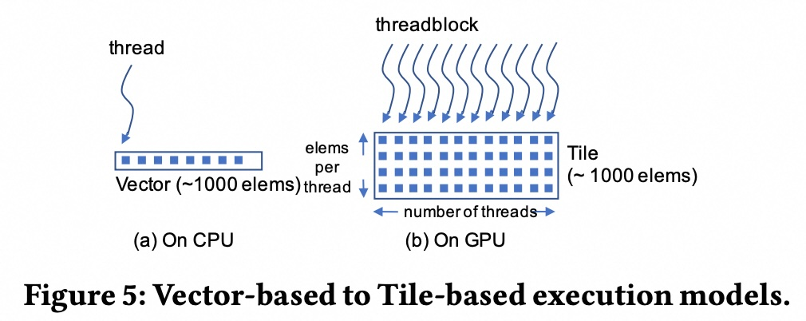
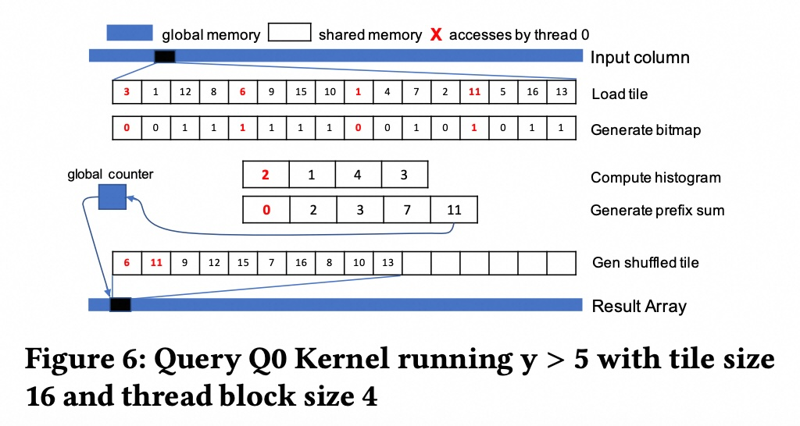

## AI论文解读 | A Study of the Fundamental Performance Characteristics of GPUs and CPUs for Database Analytics
        
### 作者        
digoal        
        
### 日期        
2025-07-29       
        
### 标签        
PostgreSQL , PolarDB , DuckDB , AI , 论文解读        
        
----        
        
## 背景  
      
https://anilshanbhag.com/static/papers/crystal_sigmod20.pdf        
  
提示:          
```          
读懂《A Study of the Fundamental Performance Characteristics of GPUs and CPUs for Database Analytics》这篇论文需要提前掌握哪些基础知识, 请使用中文通熟易懂的讲解这些基础知识, 可以引用论文中的图、表或使用Markdown支持的图形(text,mermaid等)增加解释性. 
  
使用中文通熟易懂的解读《A Study of the Fundamental Performance Characteristics of GPUs and CPUs for Database Analytics》这篇论文, 其中的关键内容请着重讲解, 可以引用论文中的图、表或使用Markdown支持的图形(text,mermaid等)增加解释性. 
  
提取《A Study of the Fundamental Performance Characteristics of GPUs and CPUs for Database Analytics》这篇论文中的重要术语, 使用中文对这些术语进行通熟易懂的讲解, 可以引用论文中的图、表或使用Markdown支持的图形(text,mermaid等)增加解释性. 
```     
  
## 1 前置知识 
  
好的，为了完全读懂《A Study of the Fundamental Performance Characteristics of GPUs and CPUs for Database Analytics》这篇论文，您需要掌握一些关于**计算机体系结构**、**数据库系统**和**GPU并行计算**的基础知识。

下面我将用通俗易懂的中文，并结合论文中的图表，为您讲解这些必备的基础知识。

-----

### 1\. 核心硬件与体系结构 (CPU vs. GPU)

这篇论文的根本是比较两种不同设计哲学的处理器。

#### **CPU (中央处理器)**

  * **设计哲学**: **“少而精”**。CPU的核心（Cores）数量较少（例如论文中测试的CPU有8个核心 ），但每个核心都非常强大和复杂。它擅长处理复杂的逻辑判断、分支预测和串行任务。可以把每个CPU核心想象成一个“专家”，能独立处理非常复杂的工作。
  * **内存与缓存**: CPU有复杂的缓存层级（L1, L2, L3 Cache）。缓存是靠近核心的高速存储，用于减少访问主内存（DDR RAM）的延迟。因为CPU处理的任务逻辑复杂多变，所以需要精密的缓存系统来加速。

#### **GPU (图形处理器)**

  * **设计哲学**: **“多而简”**。GPU拥有成千上万个相对简单的核心（例如论文测试的V100 GPU有5000个核心 ）。它不擅长复杂的逻辑，但极其擅长执行大规模、高度并行的简单计算，即“一个指令，万千数据同时执行”。可以把GPU想象成一个庞大的“工人流水线”，每个工人只做简单重复的动作，但成千上万工人一起干，总效率惊人。

  * **内存与缓存**: GPU的内存体系结构为并行计算做了特殊优化。论文中的 **图1** 非常好地展示了这一点：   

      * **全局内存 (Global Memory)**: 这是GPU上最大但最慢的内存，类似于CPU的主内存 。现代GPU使用高带宽内存(HBM)，其带宽远超CPU的DDR内存 ，这是GPU在数据密集型任务上获得巨大性能优势的关键原因之一。
      * **L2缓存 (L2 Cache)**: 所有SM共享的缓存，用于缓存对全局内存的访问 。
      * **流式多处理器 (SM - Streaming Multiprocessor)**: 这是GPU的基本计算单元，你可以把它看作一个“车间”，里面包含了几十个核心（工人）。
      * **共享内存 (SMEM - Shared Memory)**: 这是**非常关键**的一个概念。它是每个SM内部的一块高速缓存，由程序员手动控制 。同一个SM内的线程（工人）可以通过它高速地交换数据，而无需绕道缓慢的全局内存。这比CPU的自动缓存机制更灵活，也是论文提出的`Tile-based`模型的核心。
      * **寄存器 (Registers)**: 每个核心私有的最快存储 。

#### **并行执行模型**

  * **CPU - SIMD (单指令多数据)**: 现代CPU通过SIMD指令（如AVX2）实现并行，一次可以对一个向量（比如8个浮点数）执行相同操作 。
  * **GPU - SIMT (单指令多线程)**: GPU将线程（Thread）组织成一个叫`Warp`的单位（通常32个线程） 。一个Warp中的所有线程在同一时刻执行相同的指令，但处理的数据不同 。这是GPU大规模并行的基础。

-----

### 2\. 数据库查询处理基础

这篇论文将上述硬件知识应用在数据库分析查询（OLAP）场景中。

#### **OLAP (在线分析处理)**

与我们日常接触的交易处理（OLTP，如银行转账）不同，OLAP主要用于商业智能和决策支持，通常涉及对海量数据进行复杂的聚合、统计和连接操作，比如“统计过去一年每个品牌的销售总额” 。这类任务的瓶颈往往是**内存带宽**，而非计算复杂度 。

#### **列式存储 (Columnar Storage)**

传统数据库按行存储数据。而现代分析型数据库大多采用列式存储，即将同一列的数据连续存放在一起 。这样做对分析查询有巨大好处：

  * **I/O优化**: 查询通常只关心少数几列，使用列存只需读取相关列的数据，大大减少了数据读取量。
  * **高压缩率**: 同一列的数据类型相同，分布相似，更容易压缩。

#### **核心查询算子 (Query Operators)**

论文重点分析了几个核心的数据库操作：

  * **选择 (Select / Filter)**: 根据条件筛选数据，例如 `WHERE lo_quantity < 25` 。
  * **投影 (Project)**: 选择或计算新的列，例如 `SELECT lo_extendedprice * lo_discount` 。
  * **哈希连接 (Hash Join)**: 这是数据库中合并两张表最常用的算法。它分为两个阶段 ：
    1.  **构建阶段 (Build Phase)**: 选择一张较小的表，根据连接键（如`user_id`）构建一个哈希表（类似于字典或Map）。
    2.  **探测阶段 (Probe Phase)**: 遍历另一张较大的表，用它的连接键去哈希表中查找匹配项。
        这个过程的性能和缓存效率密切相关。如果哈希表能完全放入高速缓存（如CPU L3或GPU L2），性能会极高；反之，则会频繁访问慢速主存，性能急剧下降。论文中的**图13**清晰地展示了这种“阶梯式”的性能变化。   

-----

### 3\. 论文的核心思想与演进

理解了硬件和数据库基础后，就可以看懂论文的论证逻辑了。

#### **第一步：批判“协处理器模型 (Coprocessor Model)”**

过去的很多研究把GPU当作一个“外包工”，即**协处理器** 。其工作流程是：

1.  数据主要存储在CPU内存中 。
2.  需要计算时，通过PCIe总线把数据从CPU拷贝到GPU 。
3.  GPU完成计算。
4.  再通过PCIe把结果传回CPU 。

**论文指出，这个模型是有缺陷的**。因为PCIe总线的带宽远低于CPU或GPU自身的内存带宽 。数据传输成了瓶颈，导致GPU的强大算力无法发挥，甚至比一个高效的CPU实现还要慢 。论文中的**图3**通过实验数据有力地证明了这一点：`GPU Coprocessor`（协处理器模型）的性能甚至不如现代CPU数据库`Hyper`。   

所以论文的第一个结论是：**应该把数据常驻在GPU内存中，将GPU作为主执行引擎，而不是一个临时的加速器** 。

#### **第二步：提出“基于数据块 (Tile-based) 的执行模型”**

当把GPU作为主引擎后，新的挑战出现了：如何高效地组织成千上万的线程？

  * **传统方法的困境**: 如果让每个线程独立工作，它们会因为争抢写入结果内存的位置而产生巨大的“原子操作”冲突，并且多次读取相同的数据，效率低下 。这在论文的 **图4(a)** 中有描述。   

  * **论文的解决方案**: **Tile-based模型** 。其核心思想是，**不要把单个线程看作执行单元，而是把一个“线程块 (Thread Block)”看作一个整体的执行单元** 。

    这个模型借鉴了CPU的“向量化执行”思想，如下图 **图5** 所示：   

      * 在CPU上，一个核心一次处理一个**向量 (Vector)** 的数据。
      * 在GPU上，一个**线程块 (Thread Block)** 一次处理一个**数据块 (Tile)** 的数据。

    **具体流程（以Select查询为例，参考图6）**：   

    1.  一个线程块（比如包含256个线程）协作地从全局内存中加载一个数据块（比如2048个元素）到它们共享的高速 **共享内存(SMEM)** 中 。
    2.  所有线程在SMEM中并行地对这个数据块进行计算（如判断是否满足条件） 。
    3.  线程间在SMEM中高效地协作，计算出哪些数据需要被写回，以及各自的写入位置 。
    4.  最后，将整理好的结果，一次性地、连续地写回到全局内存 。

    **这个模型的好处是**：

      * 数据只从慢速的全局内存读一次，后续操作都在高速的共享内存中完成 。
      * 大大减少了对全局计数器的原子操作冲突，因为只有一个线程块才需要更新一次 。
      * 最终写入是连续的（Coalesced Write），能最大化利用内存带宽 。

#### **第三步：封装成库 (Crystal)**

为了方便地使用`Tile-based`模型，作者们将这些常用的“块级操作”（如块加载、块计算、块整理）封装成一个名为 **Crystal** 的函数库 。开发者可以像搭积木一样组合这些函数，快速写出高效的GPU查询代码 。

### 总结

掌握以上知识后，您就可以轻松地理解这篇论文的脉络了：

1.  **背景**: GPU拥有超高的内存带宽，潜力巨大。
2.  **破**: 传统的“协处理器”用法是错误的，因为PCIe是瓶颈。
3.  **立**: 应该把GPU当成主战场，并将数据常驻在GPU内存中。
4.  **法**: 为了解决大规模线程协作的难题，提出了`Tile-based`执行模型，利用线程块和共享内存来提升效率。
5.  **器**: 将`Tile-based`模型中的常用操作封装成`Crystal`库，方便开发。
6.  **证**: 通过对单个算子和完整SQL查询（SSB benchmark）进行详尽的实验和模型分析，证明了该方法相比于最优的CPU实现，能取得超过内存带宽比的性能提升（平均25倍），且性价比更高 。

希望这份解读能帮助您更好地理解这篇优秀的论文！
  
## 2 解读论文 
  
好的，这篇名为《A Study of the Fundamental Performance Characteristics of GPUs and CPUs for Database Analytics》的论文，核心是想搞清楚一个问题：**在处理数据库分析任务时，GPU到底比CPU强多少，以及为什么会强这么多？**

作者通过建立模型、实现高效算法和进行大量实验，得出了一个重要结论：**当数据集能放入GPU内存时，将GPU作为主执行引擎，其性能优势远超传统认知，平均可达CPU的25倍，性价比也更高 。**

下面，我将用通俗的方式为您解读这篇论文的关键内容。

### 核心论点一：抛弃“协处理器”旧思维，拥抱“GPU为主”新模式

在过去，很多研究把GPU当作CPU的“外包工”或“协处理器” 。工作流程是这样的：

1.  数据主要存放在CPU的内存里 。
2.  需要复杂计算时，通过PCIe总线把数据从CPU拷贝到GPU 。
3.  GPU完成计算。
4.  再通过PCIe把结果传回CPU 。

**论文尖锐地指出：这个模型已经过时且效率低下。**

原因是**PCIe总线**是一个巨大的瓶颈。它的数据传输速度（约16 GB/s）远低于CPU内存（约100 GB/s）和GPU内存（可达1.2 TB/s）的带宽 。数据来回拷贝的时间，往往会抵消掉GPU的计算优势。

论文通过在Star Schema Benchmark (SSB)上的实验有力地证明了这一点。如下图所示，`GPU Coprocessor`（协处理器模型）的平均性能甚至比现代CPU数据库 `Hyper` 还要慢1.4倍 。

**图3：SSB benchmark性能对比**   

> **关键 takeaway**：作者认为，随着现代GPU内存容量大幅增加（可达32GB甚至更多），正确的做法是**将整个工作数据集直接加载到GPU内存中，把GPU作为主要的、独立的计算引擎**，而不是一个临时的加速器 。

### 核心论点二：为GPU量身定制的“Tile-based”执行模型

当把GPU作为主战场后，新的挑战是如何高效地组织和利用其成千上万个核心 。如果简单地把CPU的并行方法搬到GPU上，会遇到很多问题，比如线程间资源争抢导致性能瓶颈 。

为此，论文提出了一个创新的 **“基于数据块 (Tile-based) 的执行模型”** 。

这个模型的核心思想是：**不要把单个GPU线程看作独立的执行单元，而是把一个“线程块 (Thread Block)”视为一个整体，协作处理一个“数据块 (Tile)”** 。

我们可以通过论文中的 **图5** 来理解这个概念的转变：   

**图5：从CPU的向量化执行到GPU的Tile-based执行** 

这个模型的工作流程（以一个简单的筛选查询为例）如 **图4(b)** 和 **图6** 所示：     

1.  **加载 (Load)**: 一个线程块（比如256个线程）从慢速的全局内存中，协作加载一个数据块（比如2048个元素）到它们共享的、速度极快的 **共享内存 (Shared Memory)** 中 。
2.  **计算 (Process)**: 所有线程在高速的共享内存中并行地对这个数据块进行计算和处理 。
3.  **整理 (Shuffle)**: 线程块内部协作，将满足条件的结果整理成一个连续的数组，仍然存放在共享内存中 。
4.  **写回 (Store)**: 最后，将整理好的、连续的结果块一次性地写回到全局内存中 。

**图4：传统GPU筛选(a) vs Tile-based模型(b)**

**这个模型带来的巨大好处是：**

  * **避免了重复读取**: 数据只从慢速的全局内存读一次，后续所有操作都在高速的共享内存中完成，避免了传统方法需要读两次输入数据的问题 。
  * **减少了同步开销**: 将成千上万个线程的同步问题，缩小为几百个线程块级别的同步，大大降低了冲突 。
  * **实现了合并写入 (Coalesced Write)**: 最终的写操作是连续的，这能最大化利用GPU恐怖的内存带宽，避免了随机写导致的性能下降 。

为了方便地使用这个模型，作者将其中的核心操作封装成了一个名为 **Crystal** 的C++库 。

### 核心论点三：GPU性能优势超过内存带宽比

在分析了单个数据库操作（如选择、投影、连接）后，作者发现对于简单操作，GPU相对于CPU的性能提升大致等于两者的内存带宽比（论文中约为16倍）。

但令人惊讶的是，在运行由多个操作组成的完整SQL查询时（如SSB benchmark），**GPU的平均性能达到了CPU的25倍**，显著超过了16倍的带宽比 。

**为什么会这样？**

论文通过对一个复杂查询（SSB Q2.1）的案例分析，揭示了原因：**GPU拥有卓越的延迟隐藏 (Latency Hiding) 能力** 。

  * **在CPU上**：当一个CPU线程需要从内存中读取数据，而数据又不在缓存中时，这个线程就会被**阻塞 (stall)**，必须等待数据返回才能继续工作，造成时间浪费 。
  * **在GPU上**：一个GPU的计算单元（SM）可以同时管理许多个线程组（Warps）。当一个Warp因为访问内存而需要等待时，GPU硬件会立刻**切换 (swap out)** 它，让另一个准备就绪的Warp上来执行 。这样一来，计算核心始终保持在忙碌状态，内存访问的延迟就被巧妙地“隐藏”了 。

这种能力在处理像**哈希连接 (Hash Join)** 这样具有大量不规则、随机内存访问的查询时，优势尤为明显 。CPU的预取器在这种情况下常常失效，导致性能远低于理论模型；而GPU则能通过快速线程切换保持高效率，使得实际性能非常接近理论模型 。

### 成本效益分析

论文最后还从经济角度进行了分析。尽管配备高端GPU的服务器比纯CPU服务器更贵，但考虑到其带来的巨大性能提升（25倍），**GPU在处理数据分析任务时的性价比（性能/美元）是CPU的4倍** 。

|  | **购买成本** | **租用成本 (AWS)** |
| :--- | :--- | :--- |
| **CPU服务器** | $2-5K  | $0.504 / 小时  |
| **GPU服务器** | CPU成本 + $8.5K  | $3.06 / 小时  |

**表3：CPU与GPU成本对比 **

### 总结

这篇论文通过严谨的分析和实验，为我们描绘了GPU在数据分析领域的清晰图景：

1.  **模式之争**：必须放弃低效的“协处理器”模式，将GPU作为**主执行引擎** 。
2.  **方法之新**：采用为GPU硬件特性量身定制的**Tile-based模型**，通过线程块协作和共享内存来最大化效率 。
3.  **性能之谜**：GPU的性能优势不仅源于其超高的内存带宽，更在于其强大的**延迟隐藏能力**，使其在复杂查询上能取得超越带宽比的性能增益 。
4.  **价值之选**：尽管硬件成本更高，但GPU提供了**更高的性价比**，是未来高性能数据分析的有力竞争者 。
  
## 3 术语  
  
好的，这篇论文包含了一些计算机体系结构和数据库领域的关键术语。下面我将提取其中的重要术语，并用通俗易懂的中文进行讲解，同时引用论文中的图表来帮助理解。

-----

### 一、 核心硬件与体系结构术语

#### 1\. **内存带宽 (Memory Bandwidth)**

  * **通俗讲解**: 内存带宽就像一条高速公路的车道宽度，决定了单位时间内有多少数据可以从内存（RAM）传输到处理器（CPU或GPU）进行处理 。对于数据分析这类需要读取海量数据的任务来说，内存带宽是决定性能的最关键瓶颈之一 。
  * **论文关联**: 这篇论文的核心论点之一就是，GPU的性能优势主要来源于其远超CPU的内存带宽 。论文中提到，现代GPU的内存带宽可达1.2 TB/s，而CPU则在100 GB/s左右，相差一个数量级 。

#### 2\. **协处理器模型 (Coprocessor Model)**

  * **通俗讲解**: 这是一种将GPU用作CPU“助手”或“外包工”的工作模式 。数据主要存放在CPU内存中，当需要进行密集计算时，才通过PCIe总线将数据发送给GPU处理，处理完后再将结果传回CPU 。

  * **论文关联**: 论文明确指出该模型存在严重性能瓶颈，因为PCIe总线的带宽（约16 GB/s）远低于CPU和GPU自身的内存带宽，数据传输耗时过长，导致GPU的强大算力无法充分发挥 。**图3**的实验结果显示，采用协处理器模型的GPU系统（GPU Coprocessor）在某些查询上的性能甚至不如高效的CPU数据库系统（Hyper）。   

    **图3：协处理器模型性能对比** 

#### 3\. **GPU内存层次结构 (GPU Memory Hierarchy)**

  * **通俗讲解**: 与CPU类似，GPU内部也有多层级的存储结构，速度和容量各不相同，目的是为了最大化数据访问效率。

  * **论文关联**: **图1** 清晰地展示了这一结构。对理解论文提出的优化方法至关重要 。   

      * **全局内存 (Global Memory)**: 容量最大但速度最慢的内存，所有计算单元都能访问 。
      * **L2缓存 (L2 Cache)**: 所有计算单元共享的缓存，比全局内存快 。
      * **共享内存 (SMEM - Shared Memory)**: **这是理解论文的关键**。它是每个计算单元（SM）内部的一块高速“草稿纸”，由程序员手动控制 。同一个SM内的线程可以通过它高速交换数据，避免访问缓慢的全局内存 。
      * **寄存器 (Registers)**: 速度最快的存储，每个核心私有 。

    **图1：GPU内存层次结构示意图** 

#### 4\. **SIMT (Single Instruction, Multiple Threads)**

  * **通俗讲解**: 这是GPU的并行执行模型，意为“单条指令，多个线程” 。GPU将线程（通常是32个）组成一个称为`Warp`的执行单元，Warp中的所有线程在同一时刻执行完全相同的指令，但各自处理的数据不同 。这就像教练对一个队列的士兵喊“向左转”，所有士兵都执行同一个动作。
  * **论文关联**: SIMT模型使得GPU能够高效地执行大规模并行任务 。但它也带来了挑战，例如，如果Warp内的线程执行了不同的分支（比如if-else），就会导致部分线程空闲，降低效率。

-----

### 二、 核心执行模型与库术语

#### 5\. **基于数据块的执行模型 (Tile-based Execution Model)**

  * **通俗讲解**: 这是论文提出的核心创新，是一种为GPU量身定制的数据处理范式 。它的思想是，**不要把单个线程看作执行单元，而是把一个“线程块 (Thread Block)”看作一个整体，协作处理一个“数据块 (Tile)”** 。

  * **论文关联**: 如下图所示，线程块内的所有线程首先协作地将一个数据块从慢速的全局内存加载到高速的共享内存中 。然后，所有后续的计算、筛选和整理工作都在这块共享内存中完成，最后再将结果一次性写回全局内存 。这种方式极大地减少了对慢速全局内存的访问次数，并能实现高效的“合并写入”，从而最大化利用带宽 。

    ```mermaid
    graph TD
        subgraph Thread Block
            A[全局内存中的数据块] --> B{协作加载};
            B --> C[高速共享内存中的数据块];
            subgraph 并行处理
                C --> D[计算/筛选];
                D --> E[结果整理];
            end
            E --> F{合并写回};
        end
        F --> G[全局内存中的结果];

        style A fill:#f9f,stroke:#333,stroke-width:2px
        style G fill:#ccf,stroke:#333,stroke-width:2px
        style C fill:#bfa,stroke:#333,stroke-width:2px
    ```

    **Tile-based模型工作流示意图**

#### 6\. **块级函数 (Block-wide functions)**

  * **通俗讲解**: 作者将Tile-based模型中的常用操作，如“块加载 (BlockLoad)”、“块筛选 (BlockPred)”、“块聚合 (BlockAggregate)”等，封装成了一系列标准函数 。
  * **论文关联**: 这些函数共同组成了一个名为 **Crystal** 的库 。开发者可以像搭积木一样调用这些函数，而无需关心底层复杂的线程同步和内存管理细节，从而可以快速、方便地构建出高性能的GPU查询程序 。**表1**列出了Crystal库中的一些核心块级函数及其描述 。

#### 7\. **延迟隐藏 (Latency Hiding)**

  * **通俗讲解**: 指的是一种硬件能力，即当一个任务因等待数据（例如从内存读取）而暂停时，处理器能够立刻切换去执行另一个准备就绪的任务，从而让计算单元一直保持忙碌，将等待时间“隐藏”起来。
  * **论文关联**: 这是解释“为何GPU性能提升超过带宽比”的关键 。GPU的硬件设计使其拥有极强的延迟隐藏能力 。当一个Warp因为访问内存而等待时，SM会立刻调度其他可执行的Warp上来工作，因此即使面对大量随机内存访问（如哈希连接），GPU也能保持极高的资源利用率 。而CPU在这方面能力较弱，等待内存时更容易发生“空转”（stall）。
  
## 参考        
         
https://anilshanbhag.com/static/papers/crystal_sigmod20.pdf    
        
<b> 以上内容基于DeepSeek、Qwen、Gemini及诸多AI生成, 轻微人工调整, 感谢杭州深度求索人工智能、阿里云、Google等公司. </b>        
        
<b> AI 生成的内容请自行辨别正确性, 当然也多了些许踩坑的乐趣, 毕竟冒险是每个男人的天性.  </b>        
  
  
