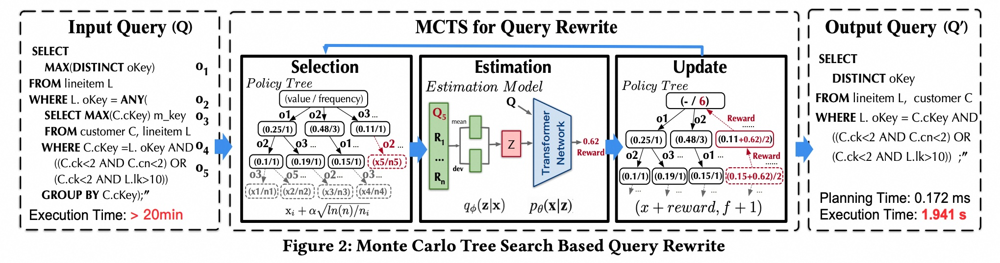

## AI论文解读 | openGauss: An Autonomous Database System
        
### 作者        
digoal        
        
### 日期        
2025-07-29       
        
### 标签        
PostgreSQL , PolarDB , DuckDB , AI , 论文解读        
        
----        
        
## 背景  
      
https://dl.acm.org/doi/pdf/10.14778/3476311.3476380        
  
提示:          
```          
读懂《openGauss: An Autonomous Database System》这篇论文需要提前掌握哪些基础知识, 请使用中文通熟易懂的讲解这些基础知识, 可以引用论文中的图、表或使用Markdown支持的图形(text,mermaid等)增加解释性. 
  
使用中文通熟易懂的解读《openGauss: An Autonomous Database System》这篇论文, 其中的关键内容请着重讲解, 可以引用论文中的图、表或使用Markdown支持的图形(text,mermaid等)增加解释性. 
  
提取《openGauss: An Autonomous Database System》这篇论文中的重要术语, 使用中文对这些术语进行通熟易懂的讲解, 可以引用论文中的图、表或使用Markdown支持的图形(text,mermaid等)增加解释性. 
```     
  
## 1 前置知识 
  
好的，为了完全理解《openGauss: An Autonomous Database System》这篇论文，你需要具备两大块基础知识：**数据库系统** 和 **机器学习**。这篇论文的核心思想，就是将机器学习（AI）技术深度融合到数据库（DB）的内核中，实现一个能自我管理、自我优化的“自治数据库”。

下面我将为你通俗易懂地讲解这些必备的基础知识，并引用论文中的图表来帮助你理解。

### 一、 数据库系统基础 (Database System Fundamentals)

这部分知识能帮助你理解 openGauss **“为什么”** 要做这些优化，以及它优化的 **“对象”** 是什么。

#### 1\. SQL查询的生命周期与查询优化

当你向数据库提交一条SQL查询语句时，它并不是马上就被执行的。它需要经历一个复杂的优化过程，以找到最高效的执行方式。这个过程通常包括：

  * **解析 (Parsing):** 将SQL文本转换成数据库内部能理解的树形结构。
  * **重写 (Rewriting):** 对查询进行等价变换，变成一个可能更优化的形式。例如，消除不必要的计算。
  * **优化 (Optimization):** 这是最核心也最复杂的一步。优化器需要做出几个关键决策：
      * **基数/代价估计 (Cardinality/Cost Estimation):** 预测查询的每个步骤会返回多少行数据（基数），以及执行这些步骤需要花费多少资源（代价）。这是后续所有决策的基础。
      * **连接顺序选择 (Join Order Selection):** 当查询涉及多表连接时，不同的连接顺序可能导致性能差异成百上千倍。
      * **物理操作选择 (Physical Operator Selection):** 为每个逻辑操作（如连接、排序）选择具体的实现算法（如哈希连接、嵌套循环连接）。
  * **执行 (Execution):** 根据最终选定的“查询执行计划”（Query Plan）去真正地获取数据。

传统数据库在“优化”这一步严重依赖启发式规则和统计信息，但这些方法在复杂查询场景下常常出错，导致选出非常糟糕的执行计划。

-----

**论文切入点：**
openGauss 的 **“学习型优化器 (Learned Optimizer)”** 就是为了用机器学习模型替代或增强传统的查询优化器。

  * **学习型查询重写 (Learned Query Rewriter):** 传统方法不知道哪种重写规则组合最好。论文用 **蒙特卡洛树搜索 (MCTS)** 来智能地探索各种重写顺序，找到最优组合。如下图所示，MCTS通过不断地“选择-评估-更新”，最终将一个执行超过20分钟的慢查询，重写成一个仅需1.9秒的快查询。

    *引用论文图2: Monte Carlo Tree Search Based Query Rewrite*   
     

  * **学习型代价估计 (Learned Cost Estimator):** 传统方法估算不准。论文使用 **树状长短期记忆网络 (Tree-LSTM)** 模型，它可以理解查询计划的树形结构，从而更准确地预测代价和基数。

    *引用论文图3: Tree-LSTM Based Cost Estimator*   
     

  * **学习型计划生成器 (Learned Plan Enumerator):** 传统方法在海量的连接顺序中容易迷失。论文使用 **深度强化学习 (DRL)**，将选择连接顺序的过程建模成一个决策过程，让AI学会如何选择最佳执行计划。

#### 2\. 数据库运维与调优 (DBA & Tuning)

一个生产环境的数据库需要持续的维护和调优，这通常是数据库管理员（DBA）的工作。主要包括：

  * **监控 (Monitoring):** 实时观察数据库的各项性能指标（如CPU使用率、内存命中率、磁盘I/O等），发现异常。
  * **诊断 (Diagnosis):** 当发现性能问题时（如系统变慢），分析日志和指标，找到根本原因（Root Cause）。
  * **配置 (Configuration):** 数据库有成百上千个配置参数（在论文中被称为 **Knobs**，即“旋钮”），如分配多少内存给缓存区。合理配置这些参数对性能至关重要。
  * **优化 (Optimization):** 创建 **索引 (Index)** 或 **物化视图 (Materialized View)** 来加速查询。索引就像书的目录，可以快速定位数据。物化视图则是预先计算并存储好的查询结果。

这些工作对DBA的经验要求很高，且耗时耗力，难以应对云时代海量的数据库实例。

-----

**论文切入点：**
openGauss 的 **“学习型顾问 (Learned Advisor)”** 旨在自动化DBA的工作，实现数据库的自监控、自诊断、自配置和自优化。

  * **自监控 (Self-Monitoring):** 使用 **LSTM自编码器** 模型自动检测指标异常。
  * **自诊断 (Self-Diagnosis):** 使用 **LSTM-KNN** 等模型自动分析系统和SQL层面的问题根源。
  * **自配置 (Self-Configuration):** 使用 **深度强化学习 (DRL)** 来自动调整数据库的数百个“旋钮”。
  * **自优化 (Self-Optimization):** 使用 **强化学习** 等模型来自动推荐创建哪些索引和物化视图。

-----

### 二、 机器学习基础 (Machine Learning Fundamentals)

这部分知识能帮助你理解 openGauss 是 **“如何”** 实现上述智能优化的，即它使用的 **“方法”** 是什么。

#### 1\. 强化学习 (Reinforcement Learning - RL)

这是论文中使用最广泛的技术。你可以把它想象成训练宠物的过程。

  * **Agent (智能体):** 学习者，即AI模型。例如，进行“旋钮调优”的模型。
  * **Environment (环境):** 智能体所处的环境。例如，运行中的 openGauss 数据库。
  * **State (状态):** 环境的当前情况。例如，当前的数据库指标和旋钮配置。
  * **Action (动作):** 智能体可以做的操作。例如，“将`shared_buffers`这个旋钮的值调大1GB”。
  * **Reward (奖励):** 执行一个动作后，环境给予的反馈。例如，动作执行后，数据库的吞吐量（TPS）提升了，就给予正奖励；反之则给予负奖励。

AI的目标就是学习一个策略（Policy），知道在什么状态（State）下，做出什么动作（Action），才能获得最大的长期累计奖励（Reward）。当神经网络被用来学习这个策略时，就称为 **深度强化学习 (Deep Reinforcement Learning, DRL)**。

**论文应用：**
查询计划生成、旋钮调优、索引/物化视图推荐等多个模块都将优化问题建模为强化学习问题，让AI自己学会如何做出最佳决策。下图展示了用DRL进行计划生成的过程。

*引用论文图4: DRL Based Plan Generator*   
 

#### 2\. 神经网络模型 (Neural Network Models)

  * **LSTM (长短期记忆网络):** 一种特殊的循环神经网络（RNN），非常擅长处理序列数据，如时间序列（数据库监控指标）或文本序列。它能捕捉序列中的长期依赖关系。

      * **Tree-LSTM (树状LSTM):** LSTM的变体，专门用于处理树形结构的数据。因为查询执行计划天然就是一棵树，所以Tree-LSTM非常适合用来理解计划的结构并估计其代价。

  * **Autoencoder (自编码器):** 一种无监督学习模型，由一个编码器（Encoder）和一个解码器（Decoder）组成。它尝试将输入数据（如正常的数据库指标）压缩成一个低维度的向量（编码），然后再从这个向量恢复出原始数据（解码）。模型通过学习，能很好地重建“正常”数据。当一个“异常”数据输入时，由于模型没见过这种模式，重建出来的结果会与原始输入有很大差异（即重构误差很大），从而被识别为异常。

    *引用论文图5: LSTM-Based Anomaly Detection*   
     

  * **图神经网络 (Graph Neural Network - GNN):** 用于学习图结构数据的表示。论文中，为了验证一个学习模型（如一个新的旋钮配置）是否有效，需要预测整个数据库在并发查询下的性能。openGauss将并发的查询 workload 建模成一个复杂的图（Workload2Graph），图中的节点代表查询操作，边代表它们之间的相互影响（如资源竞争）。然后用GNN来学习这个图的特征，从而准确预测性能。

#### 3\. 蒙特卡洛树搜索 (Monte Carlo Tree Search - MCTS)

一种强大的搜索算法，常用于游戏AI（如AlphaGo）。它不像暴力搜索那样遍历所有可能性，而是通过模拟（“rollout”）来评估最有希望的路径，并根据模拟结果动态地扩展搜索树。在论文中，它被用来在海量的查询重写规则组合中，智能地找到能带来最大性能提升的重写序列。

### 总结

要读懂这篇论文，你需要搭建一个如下的知识框架：


简单来说，只要你理解了**传统数据库是如何进行查询优化和人工运维的（What & Why）**，并掌握了**强化学习、LSTM、自编码器等核心AI算法的基本原理（How）**，就能够轻松地理解 openGauss 是如何用后者去赋能和革新前者的。
  
## 2 解读论文 
  
好的，这篇名为《openGauss: An Autonomous Database System》的论文，核心思想是利用人工智能（AI）技术，打造一个能够自我管理、自我优化的“自治数据库系统”。下面我将用通俗易懂的语言，为你深入解读其中的关键内容。

### **核心理念：让数据库拥有“大脑”**

传统数据库就像一辆需要经验丰富的司机（DBA，即数据库管理员）手动驾驶的汽车。司机需要时刻监控路况（系统状态）、换挡（调优参数）、选择最佳路径（优化查询）。而 openGauss 的目标，就是给这辆车装上一个“自动驾驶系统”，让数据库自己完成这些复杂的工作 。

这个“大脑”主要由两部分构成：

1.  **学习型优化器 (Learned Optimizer):** 优化SQL查询，找到最高效的执行路径 。
2.  **学习型顾问 (Learned Advisor):** 像一个全天候在线的DBA，负责监控、诊断和优化整个数据库系统 。

-----

### **系统架构总览**

openGauss 的整体架构如下图所示。在传统数据库的核心模块之外，它增加了五个关键的AI组件（图中粉色部分）。

*引用论文图1: The openGauss Architecture*    

我们可以用一个流程图来简化理解这些模块之间的关系：


  * **训练数据平台 (Training Data Platform):** 负责从数据库中收集各种运行时数据，如性能指标、SQL查询历史和系统日志，为AI模型提供“养料” 。
  * **模型管理平台 (Model Management Platform):** 负责统一管理、训练和部署所有的AI模型 。
  * **模型验证 (Model Validation):** 在部署一个新的AI模型前，先用它来预测部署后的性能。只有预测结果是积极的，才会真正部署，确保AI优化不会起反作用 。
  * **学习型优化器 (Learned Optimizer)** 和 **学习型顾问 (Learned Advisor)** 是系统的两大核心智能模块，下面我们重点讲解。

-----

### **关键内容一：学习型优化器 (Learned Optimizer)**

这部分的目标是解决数据库查询优化中的三大经典难题：查询重写、代价估计和计划生成 。

#### **1. 学习型查询重写器 (Learned Query Rewriter)**

  * **问题:** 一条慢查询，有时可以通过等价的SQL改写（重写）实现百倍提速。但如何找到最佳的重写方式，可能的组合方式是爆炸性的。

  * **openGauss方案:** 采用 **蒙特卡洛树搜索 (MCTS)** 算法 。它不像传统方法那样基于固定的规则，而是像一个棋类AI一样，智能地探索不同的“重写步骤”（棋谱），并利用一个深度学习模型来评估每一步的潜在收益，从而高效地找到最佳的重写序列 。

    *引用论文图2: Monte Carlo Tree Search Based Query Rewrite*   

    *上图展示了如何将一个执行时间 \>20分钟 的查询，通过MCTS重写为只需 1.941秒 的高效查询*

#### **2. 学习型代价/基数估计器 (Learned Cost/Cardinality Estimator)**

  * **问题:** 准确估计查询计划中每一步的成本（Cost）和返回的数据行数（Cardinality），是选出最优计划的基础。传统方法基于统计信息，在多表关联和复杂条件下误差很大 。

  * **openGauss方案:** 采用 **树状长短期记忆网络 (Tree-LSTM)** 模型 。查询计划本身就是一棵树，Tree-LSTM能够完美匹配这种结构，通过学习海量历史查询的真实代价，来精确预测新查询的代价和基数，因为它能捕捉到列与列之间的复杂相关性 。

    *引用论文图3: Tree-LSTM Based Cost Estimator*   

    *在JOB数据集上的实验表明，相比PostgreSQL、MySQL等，openGauss的估计误差要小1-2个数量级*

#### **3. 学习型计划生成器 (Learned Plan Enumerator)**

  * **问题:** 多表连接时，如何选择最佳的连接顺序和连接算法是一个NP-hard问题。

  * **openGauss方案:** 采用 **深度强化学习 (DRL)** 。它将计划生成过程建模为一个马尔可夫决策过程，让AI智能体（Agent）一步步地“玩连接游戏”，通过“试错”和“奖励”机制，学会如何构建一个总成本最低的查询计划树 。

    *引用论文图4: DRL Based Plan Generator*   

    *实验结果显示，在复杂的JOB基准测试中，openGauss生成的计划比传统动态规划（DP）方法快了约33% (GMRL为0.67)*

-----

### **关键内容二：学习型顾问 (Learned Advisor)**

这部分的目标是自动化DBA的日常运维工作，让数据库实现“自治” 。

#### **1. 自监控与自诊断 (Self-Monitoring & Self-Diagnosis)**

  * **问题:** 当数据库性能下降时，快速定位根本原因非常困难。

  * **openGauss方案:**

      * **异常检测:** 利用基于 **LSTM的自编码器 (Auto-encoder)** 模型，学习正常运行时的指标模式 。当检测到无法被模型很好“重建”的异常指标时，就发出警报 。
      * **根因诊断:** 一旦发现异常，系统会启动诊断模型（如 **LSTM-KNN**），分析是哪种典型故障（如CPU饱和、数据库备份等）导致了当前的异常指标组合 。

    *引用论文图6: System-level Diagnosis*   

    *上图展示了从离线分析历史数据到在线进行根因诊断的完整流程*

#### **2. 自配置 (Self-Configuration)**

  * **问题:** 数据库有数百个配置参数（称为 **knobs**，旋钮），手动调优费时费力且依赖专家经验。

  * **openGauss方案:** 再次使用 **深度强化学习 (DRL)** 。AI智能体通过不断尝试调整旋钮值，并观察系统性能（奖励）的变化，最终学会一套针对当前负载的最优配置方案 。

    *引用论文表4: Knob Tuning Comparison*

    | 方法 | TPC-H (s) | JOB (s) | TPC-C (tpmC) |
    | :--- | :--- | :--- | :--- |
    | PostgreSQL | 121.3 | 220.19 | 5552 |
    | DBA | 95.1 | 193.37 | 7023 |
    | **openGauss (DRL)** | **82.7** | **163.88** | **12118.4** |
    
    *表格数据显示，基于DRL的自动调优在各种负载下均显著优于默认配置和资深DBA的手动调优*

#### **3. 自优化 (Self-Optimization)**

  * **问题:** 何时、为何种查询创建合适的索引（Index）或物化视图（MV）是提升性能的关键，但也是一个复杂的权衡问题。
  * **openGauss方案:**
      * **索引推荐:** 利用 **DRL** 模型，将索引推荐看作一个序列决策问题，逐步挑选出对整体工作负载最有益的索引组合 。
      * **物化视图推荐:** 采用 **编码器-解码器 (Encoder-Reducer) 模型** 来评估创建某个MV的潜在收益，再结合 **强化学习** 从众多候选MV中选出性价比最高的集合 。

-----

### **论文的贡献与启示**

1.  **端到端的自治系统:** 论文不仅提出了多个独立的AI模型，更重要的是，它将这些模型整合进一个开源数据库 openGauss，并构建了数据、模型、验证等配套平台，形成了一个完整的、端到端的自治数据库框架 。
2.  **验证了AI技术的有效性:** 通过在多个标准数据集上的充分实验，论文证明了其提出的学习型方法在查询优化、数据库调优等多个方面均优于传统方法甚至专家DBA 。
3.  **实践经验分享:** 论文最后总结了部署这些学习型技术的心得，例如特征选择、模型选择、验证模型的重要性等，为后续研究和工业实践提供了宝贵经验 。

总而言之，这篇论文描绘并实现了一个激动人心的未来：**数据库不再是一个被动接受指令的工具，而是一个能够主动学习、思考和进化的智能系统**。它将DBA从繁琐的重复性工作中解放出来，并有望在云时代大规模提升数据库的管理效率和性能表现。
  
## 3 术语  
  
《openGauss: An Autonomous Database System》这篇论文提出了一个集成了机器学习技术的自治数据库系统openGauss。以下是论文中的一些重要术语及其通俗易懂的中文解释：

1.  **自治数据库系统 (Autonomous Database System)**:

      * **解释**: 这是一种能够自我管理、自我优化、自我修复的数据库系统。它利用人工智能和机器学习技术，在无需人工干预的情况下，自动完成数据库的监控、诊断、配置和优化等任务，从而降低管理成本，提高性能和可靠性。openGauss就是这样一个系统，它将基于学习的技术集成到其核心组件中。

2.  **基于学习的数据库优化 (Learning-based Database Optimization)**:

      * **解释**: 指的是使用机器学习（ML）模型和算法来改进传统数据库的各个方面，例如查询优化、性能调优、故障诊断等。与传统依赖于硬编码规则和启发式方法不同，基于学习的方法可以通过从大量数据中学习来适应更复杂的场景并提供更优的决策。

3.  **学习型优化器 (Learned Optimizers)**:

      * **解释**: openGauss中的一个核心组件，它用机器学习模型替代了传统数据库查询优化器中的部分或全部功能，以生成更高效的查询执行计划。
      * **包含**:
          * **学习型查询重写 (Learned Query Rewrite)** : 自动将低效的SQL查询改写成逻辑等价但执行效率更高的查询。例如，移除冗余操作或调整操作顺序，以显著提升查询速度。论文中提到使用**蒙特卡洛树搜索 (Monte Carlo Tree Search, MCTS)** 来智能地选择重写策略 。
              * **图示示例 (参考论文图2)**:   
                ```mermaid
                graph TD
                    A["输入查询 Q (低效)"] --> B{MCTS 查询重写};
                    B --> C["策略树 (探索重写路径)"];
                    C --> D["估算模型 (预测重写收益)"];
                    D --> E["更新策略树 (基于收益更新节点)"];
                    E --> F["输出查询 Q' (高效)"];

                    style A fill:#DCDCDC,stroke:#333,stroke-width:2px;
                    style F fill:#DCDCDC,stroke:#333,stroke-width:2px;
                    style B fill:#F0F8FF,stroke:#333,stroke-width:1px;
                    style C fill:#F0F8FF,stroke:#333,stroke-width:1px;
                    style D fill:#F0F8FF,stroke:#333,stroke-width:1px;
                    style E fill:#F0F8FF,stroke:#333,stroke-width:1px;
                ```
                  * **解释**: 如上图所示（简化自论文图2），MCTS通过迭代地构建和探索策略树来寻找最佳的查询重写路径。它评估不同重写规则组合的潜在收益，并最终选出能够大幅提升查询性能的改写结果。
          * **学习型代价/基数估计 (Learned Cost/Cardinality Estimation)** : 预测查询执行计划中每个操作的执行代价和返回结果集的行数（基数）。这对于优化器选择最优计划至关重要。openGauss使用**Tree-LSTM**（树形长短期记忆网络）来捕捉列之间的复杂关联，从而提高估计的准确性 。
          * **学习型计划生成器 (Learned Plan Generator)** : 负责选择查询的连接顺序和物理操作符（如嵌套循环连接、哈希连接或索引连接）。论文中提到使用**深度强化学习 (Deep Reinforcement Learning, DRL)** 来解决这一问题，将其建模为马尔可夫决策过程 。

4.  **学习型数据库顾问 (Learned Database Advisors)**:

      * **解释**: openGauss的另一个关键组件，它提供了一系列基于学习的自动化管理功能，旨在减少数据库管理员（DBA）的工作负担。
      * **包含**:
          * **自监控 (Self-Monitoring)** : 自动监控数据库的运行状态和关键指标（如CPU使用率、响应时间、日志），并利用机器学习模型（如基于LSTM的自编码器）自动检测异常 。
          * **自诊断 (Self-Diagnosis)** : 自动识别数据库系统或SQL查询中出现问题的根本原因。例如，系统诊断可以找出锁冲突，SQL诊断可以找出慢查询的原因。论文中提到使用**Tree-LSTM**进行自诊断 。
          * **自配置 (Self-Configuration) / 参数调优 (Knob Tuning)** : 自动调整数据库系统的配置参数（称为“knobs”），以适应不同的工作负载，从而优化性能。这通常通过**深度强化学习**实现 。
          * **自优化 (Self-Optimization) / 索引/视图推荐 (Index/View Advisor)** : 自动推荐和创建最佳的数据库索引和物化视图（materialized views），以加速查询执行。这同样利用了**深度强化学习**和编码器-解码器模型 。

5.  **模型验证 (Model Validation)**:

      * **解释**: 用于评估所训练的学习模型是否有效，以及它们在实际工作负载下的性能是否优于非学习方法。openGauss提出了一个基于**图嵌入 (Graph Embedding)** 的性能预测模型，可以在部署学习模型之前预测其性能，从而决定是否部署该模型 。

6.  **训练数据管理 (Training Data Management)**:

      * **解释**: 负责收集、组织和管理用于训练机器学习模型的高质量数据。这包括数据库运行时指标（如资源消耗、锁信息）、历史SQL查询（如查询延迟）和系统日志（如异常信息）。

7.  **模型管理 (Model Management)**:

      * **解释**: 提供一个统一的机器学习平台，用于管理和调度不同的ML模型，包括模型的训练、预测和统一资源调度。它封装了机器学习的复杂性，使学习型组件的部署更加便捷 。

8.  **蒙特卡洛树搜索 (Monte Carlo Tree Search, MCTS)**:

      * **解释**: 一种启发式搜索算法，常用于游戏AI等领域。在openGauss中，它被用于查询重写，通过构建和探索“策略树”来寻找最佳的SQL查询改写策略，以达到更优的执行性能 。

9.  **Tree-LSTM (树形长短期记忆网络)**:

      * **解释**: 是一种特殊类型的循环神经网络（RNN），能够处理树状结构的数据。在openGauss中，它被用于学习型代价/基数估计（因为查询计划是树状结构）和自诊断（用于识别异常的根本原因）。

10. **深度强化学习 (Deep Reinforcement Learning, DRL)**:

      * **解释**: 将深度学习和强化学习结合起来的技术。在openGauss中，DRL被广泛应用于多个学习型组件，例如学习型计划生成器（选择连接顺序和物理操作符）、自配置（参数调优）和自优化（索引/视图推荐），使其能够通过与环境的交互学习最优策略 。

11. **图神经网络 (Graph Neural Networks, GNN)**:

      * **解释**: 一种处理图结构数据的神经网络。在openGauss中，GNN被用于学习型计划生成器中捕捉连接树的结构，以及在模型验证中的性能预测，以处理并发查询的复杂关联 。

12. **自编码器 (Auto-encoder)**:

      * **解释**: 一种神经网络模型，旨在学习输入数据的有效编码（低维表示），然后从该编码中重建原始数据。在openGauss的自监控模块中，基于LSTM的自编码器被用于异常检测，通过重建误差来识别异常数据 。
  
## 参考        
         
https://dl.acm.org/doi/pdf/10.14778/3476311.3476380    
        
<b> 以上内容基于DeepSeek、Qwen、Gemini及诸多AI生成, 轻微人工调整, 感谢杭州深度求索人工智能、阿里云、Google等公司. </b>        
        
<b> AI 生成的内容请自行辨别正确性, 当然也多了些许踩坑的乐趣, 毕竟冒险是每个男人的天性.  </b>        
  
  
