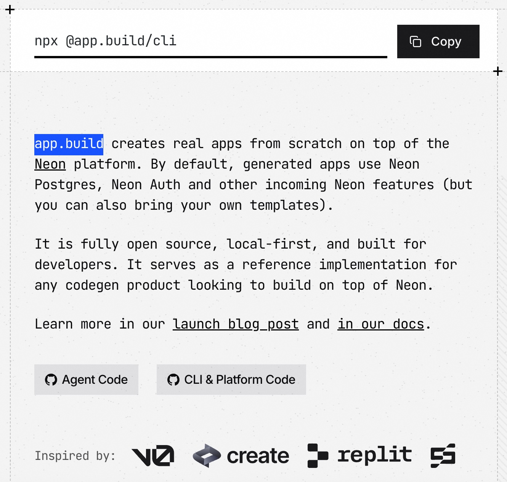
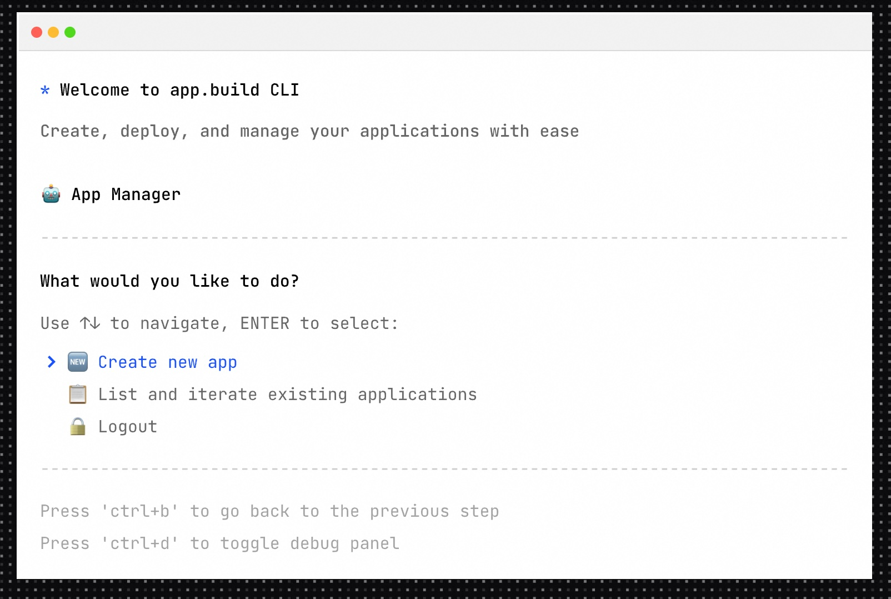
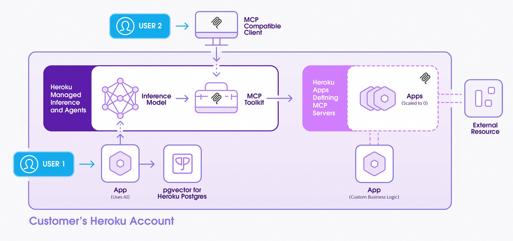

## 下一个风口 | AI 中台  
          
### 作者          
digoal          
          
### 日期          
2025-07-29         
          
### 标签          
PostgreSQL , PolarDB , DuckDB , AI , 中台 , 开发 , 测试 , 部署 , 运维          
          
----          
          
## 背景  
AI 时代需要新的中台来方便全民“开发、测试、托管AI Agent”, 最终AI Agent之间有可能形成连通性产生/涌现群体智能.  
  
## 一、从云说起  
早在云计算兴起的时候, 就有了应用开发、测试、托管产品. 例如 cloudfoundry、heroku.  
  
https://www.cloudfoundry.org/  
  
看看cf的网站标语, 你就能感受到他就是瞄准开发者的应用开发、测试、托管平台.  
  
**cf push — And Your App is Live**  
  
Cloud Foundry makes going from code to running cloud-native apps as easy as a single cf push command. Don’t spend your time writing cloud infrastructure config for Kubernetes and Istio. Stay focused on your code.  
  
**Your Language, Your Choice**  
  
Cloud Foundry supports the top programming languages and developer frameworks out of the box, and it can be easily extended thanks to the work of the diverse community of buildpack authors.  
  
没错, 云计算的兴起彻底改变了软件开发、测试和部署的模式，极大地提升了开发者的效率和创新能力。在云计算早期，涌现出了许多方便开发者的平台和服务。  
  
1、IaaS 是云计算最基础的服务模型，它提供虚拟化的计算资源（如虚拟机、存储、网络等），开发者可以在这些基础上构建和运行自己的应用程序。  
  
2、平台即服务 (PaaS) 平台  
  
PaaS 旨在为开发者提供一个完整的开发、运行和管理应用程序的平台，它抽象了底层基础设施的复杂性，让开发者可以更专注于代码本身。  
  
* **代表平台：**  
    * **Google App Engine (GAE):** 这是早期非常具有代表性的PaaS平台，允许开发者在Google的基础设施上构建和运行应用程序，尤其是Web应用。它提供了自动扩缩容、数据存储（Datastore）、身份验证等服务。  
    * **Heroku:** 一个广受欢迎的PaaS平台，以其易用性和对多种编程语言的支持而闻名，开发者可以非常方便地部署Web应用和API。  
    * **AWS Elastic Beanstalk:** AWS推出的PaaS服务，用于简化Java、.NET、PHP、Node.js、Python、Ruby、Go 和 Docker Web 应用程序的部署。  
    * **Microsoft Azure App Service:** 微软Azure提供的用于构建、部署和扩展Web应用、移动后端和API的PaaS服务。  
    * **Cloud Foundry:** 一个开源的PaaS平台，许多公司基于它构建自己的私有PaaS环境。  
  
3、特定服务/工具类平台  
  
除了综合性的IaaS和PaaS平台，还有一些针对特定开发需求的服务或工具，它们通常以API的形式提供能力。  
  
* **版本控制和协作平台：** 例如 **GitHub**、**Bitbucket** 等，它们虽然不是直接的云计算平台，但作为开发者协作和代码管理的核心工具，与云计算的开发流程紧密结合。  
* **数据库服务：** 云服务提供商提供了各种托管数据库服务，如 **AWS RDS (Relational Database Service)**、**DynamoDB (NoSQL)**，开发者无需管理底层数据库服务器。  
* **存储服务：** 例如 **AWS S3 (Simple Storage Service)**，提供高可用、可扩展的对象存储服务，方便开发者存储和访问各种文件。  
* **内容分发网络 (CDN):** 如 **Amazon CloudFront**，用于加速内容分发，提升Web应用的用户体验。  
  
  
云计算平台为开发者带来了革命性的变革，其核心价值体现在以下几个方面：  
  
1、降低成本和门槛  
* **按需付费 (Pay-as-you-go):**   
* **减少运维负担：**   
  
2、提升效率和敏捷性  
* **快速部署与迭代：**   
* **弹性伸缩 (Scalability & Elasticity):**   
* **标准化开发环境：**   
* **全球化部署：**   
  
3、增强可靠性与安全性  
* **高可用性：**   
* **专业安全保障：**   
* **容错性：**   
  
4、促进创新与专注核心业务  
* **丰富服务生态：**   
* **聚焦业务价值：**   
  
云计算的兴起为开发者提供了一个前所未有的自由和高效的开发环境，极大地加速了软件行业的进步和创新。  
  
## 二、AI 时代  
AI 时代, 开发应用的门槛急剧下降, 除了专业开发者, 几乎任何人都可以参与AI Agent的开发.  
  
正如我在gemini-cli推出时分析的:   
- [《德说-第341期, Google Gemini 正偷偷抢占智能体入口》](../202506/20250603_01.md)    
  
Qwen3-Coder则成为了国内的"gemini-cli"  
- https://github.com/QwenLM/Qwen3-Coder  
  
但是这些产品都只能用来开发应用. 它们缺失了测试、托管环节. 你开发的AI Agent总得测试吧? 最终总得(大部分时候)部署上线吧? 未来总得和其他的应用、产品交互吧?   
  
AI 时代急需新的中台来方便全民“开发、测试、托管AI Agent”, 最终AI Agent之间有可能形成连通性产生/涌现群体智能. 见此论文:   
- [《AI论文解读 | 深入解读《从第一性原理设计智能生态系统》：主动推断与未来AI , Designing Ecosystems of Intelligence from First Principles》](./202507/20250721_04.md)    
  
    
## 三、AI 中台  
实际上已经有一些厂商正在往AI 中台转型.    
  
1、有1个居然来自我们熟悉的PG云原生数据库厂商Neon.   
  
怪不得Neon有一个非常奇怪的数据库特性: branch. 原来是方便调试AI Agent应用的记忆啊?   
  
没错, 这个未来可能转型成"AI 中台"的就是`app.build`.  
  
An open-source AI agent that builds full-stack apps  
  
app.build creates real apps from scratch on top of the Neon platform. By default, generated apps use Neon Postgres, Neon Auth and other incoming Neon features (but you can also bring your own templates).  
  
It is fully open source, local-first, and built for developers. It serves as a reference implementation for any codegen product looking to build on top of Neon.  
  
Learn more in our launch blog post and in our docs.  
  
https://www.app.build/blog/app-build-open-source-ai-agent  
  
https://www.app.build/blog/design-decisions  
  
https://neon.com/docs/ai/ai-app-build  
  
接口也是个cli  
```  
npx @app.build/cli  
```  
  
  
  
  
  
2、另一个是Heroku  
  
它的标语已经改成了:  
  
Heroku AI: The AI PaaS for Modern Apps  
  
Build intelligent applications with managed inference and agents  
  
A streamlined platform for building AI-powered apps  
  
Heroku is your gateway to building, deploying, and scaling AI-powered applications without the operational complexity. As an AI PaaS, Heroku gives developers the infrastructure, tools, and managed services needed to bring AI apps to life faster. We go beyond the basics by unifying model inference, agents, and seamless interoperability with tools like MCP—all within the trusted Heroku developer experience, with our hallmark simplicity.  
  
https://www.heroku.com/  
  
https://www.heroku.com/ai/  
  
  
   
传统应用开发托管平台转型AI中台相对来说是比较简单的, 大部分基础设施可以复用, 补齐缺失部分即可. 比从0开始建设简单多了.  
   
3、应用侧, 可能也会有自己的AI Agent托管平台, 例如腾讯元器、钉钉.   
  
[《公众号如何接入DeepSeek?》](../202502/20250222_02.md)    
  
## 四、AI 中台资源分析  
AI Agent背后涉及哪些资源? 分不同功能/领域的AI Agent来进行分析阐述.  
  
AI Agent（人工智能代理）是能够感知环境、进行决策并执行动作以达成特定目标的智能实体。它们的实现离不开多种资源的协同作用。我们可以从不同功能或领域的AI Agent来深入分析其背后的资源需求。  
  
### 1. 基础资源 (所有AI Agent共通)  
  
无论何种类型的AI Agent，都离不开以下基础资源的支撑：  
  
* **计算资源 (Compute Resources):**  
    * **CPU (中央处理器):** 用于执行通用指令，处理逻辑运算和任务调度。对于许多非深度学习相关的AI Agent（如基于规则的Agent）来说，CPU是核心计算单元。  
    * **GPU (图形处理器):** 对于涉及深度学习、神经网络训练和推理的AI Agent至关重要。GPU的并行计算能力使其在处理大量矩阵运算时效率远超CPU。  
    * **TPU (张量处理器):** 谷歌为深度学习专门设计的ASIC芯片，在某些情况下能提供比GPU更高的能效比，尤其适用于大规模模型训练。  
    * **边缘计算设备:** 对于需要在本地快速响应的AI Agent（如自动驾驶、智能安防），需要搭载高性能处理器的边缘设备。  
  
* **存储资源 (Storage Resources):**  
    * **内存 (RAM):** 用于临时存储AI Agent运行时的代码、数据和模型参数，影响Agent的即时处理能力。  
    * **硬盘 (SSD/HDD):** 用于长期存储训练数据、模型文件、日志和Agent的知识库。SSD因其更快的读写速度，在模型加载和数据处理方面具有优势。  
    * **云存储:** 对于需要处理海量数据或进行分布式训练的AI Agent，云存储（如AWS S3, Google Cloud Storage）提供了可扩展、高可用的存储解决方案。  
  
* **数据资源 (Data Resources):**  
    * **训练数据 (Training Data):** 模型的“食粮”，包括文本、图像、语音、视频、传感器数据等。数据量、多样性和质量直接决定了AI Agent的性能和泛化能力。  
    * **标注数据 (Annotated Data):** 对于监督学习，数据需要经过人工或半自动标注，以提供正确的输入-输出对。  
    * **实时数据流 (Real-time Data Streams):** 对于需要感知环境并进行实时决策的Agent（如推荐系统、异常检测），需要持续的数据输入。  
  
* **软件与框架 (Software & Frameworks):**  
    * **操作系统 (OS):** 运行AI Agent的基础，如Linux、Windows等。  
    * **编程语言:** Python是主流选择，其次是Java、C++等。  
    * **机器学习/深度学习框架:** TensorFlow、PyTorch、JAX等是构建和训练AI模型的关键工具。  
    * **开发库:** NumPy、Pandas、Scikit-learn等用于数据处理和科学计算；OpenCV用于图像处理；NLTK、SpaCy用于自然语言处理。  
  
### 2. 不同功能/领域的AI Agent资源分析  
  
#### 2.1 语言型AI Agent (如ChatGPT, 智能客服)  
  
这类Agent的核心是理解和生成人类语言。  
  
* **计算资源:** 需要强大的GPU/TPU集群进行大规模预训练和微调，尤其是对于大型语言模型 (LLMs)。推理阶段也需要相当的计算力来支持高并发请求。  
* **数据资源:** 海量的文本数据是关键，包括书籍、文章、网页、对话记录等。高质量、多样化的语料库是模型智能的基础。  
* **模型资源:** 预训练的大型语言模型 (如GPT系列、BERT、LLaMA等) 是其核心知识和能力载体。  
* **知识图谱/语义网络:** 用于增强Agent对实体、概念和关系的理解，提供更准确的回答。  
* **人工反馈数据:** 用于RLHF (人类反馈强化学习) 等技术，优化模型的对话质量和安全性。  
  
#### 2.2 视觉型AI Agent (如图像识别、安防监控、自动驾驶)  
  
这类Agent主要处理图像和视频数据，理解视觉信息。  
  
* **计算资源:** 强大的GPU是标配，用于卷积神经网络 (CNN) 的训练和推理。边缘AI芯片（如NVIDIA Jetson, Google Coral）在边缘端进行实时处理。  
* **数据资源:** 大规模的图像和视频数据集是必需的，如ImageNet、COCO等。对于特定任务（如人脸识别、车辆检测），需要大量的特定场景标注数据。  
* **标注工具/平台:** 用于图像/视频的框选、分割、关键点标注等。  
* **传感器数据:** 对于自动驾驶，还需要雷达、激光雷达 (LiDAR)、超声波、GPS等传感器数据。  
* **三维重建技术:** 对于需要理解空间信息的Agent (如机器人导航)，需要处理3D点云数据。  
  
#### 2.3 决策型/控制型AI Agent (如推荐系统、机器人控制、游戏AI)  
  
这类Agent的核心是基于环境信息做出最优决策并执行动作。  
  
* **计算资源:** 强化学习训练通常需要大量计算资源进行模拟和策略迭代。对于实时决策，需要低延迟的推理能力。  
* **数据资源:** 历史行为数据、用户偏好数据（推荐系统）；环境状态数据、奖励信号（强化学习）。  
* **模拟环境 (Simulation Environment):** 对于机器人控制或游戏AI，高质量的模拟环境至关重要，它允许Agent在虚拟世界中进行大量试错学习，而无需承担实际风险。  
* **强化学习算法库:** 如Stable Baselines、Ray RLlib等，提供各种RL算法实现。  
* **奖励函数设计:** 工程师对奖励机制的精心设计，引导Agent学习正确的行为。  
  
#### 2.4 数据分析/预测型AI Agent (如金融风控、医疗诊断、市场预测)  
  
这类Agent专注于从数据中发现模式、进行预测或提供洞察。  
  
* **计算资源:** 取决于数据量和模型复杂度，可能需要CPU或GPU。分布式计算框架 (如Apache Spark) 也是常备资源。  
* **数据资源:** 大规模的结构化和非结构化数据，如交易记录、病历、市场指标、传感器读数等。数据的清洗、整合和特征工程至关重要。  
* **统计分析工具:** R、Python (Pandas, SciPy) 等。  
* **可视化工具:** 用于数据探索和结果展示。  
* **领域知识:** 领域专家对数据的理解和标注对于构建准确的模型至关重要。  
* **数据安全与隐私保护技术:** 对于敏感数据（如医疗、金融），需要差分隐私、联邦学习等技术来确保数据安全和合规性。  
  
### 总结  
  
AI Agent的实现是一个系统工程，涉及硬件、软件、数据和算法的紧密协作。随着AI技术的发展，我们看到AI Agent越来越强调多模态、实时性和自主学习能力，这也对其背后的资源提出了更高的要求，例如需要更强大的异构计算能力、更丰富和高质量的多模态数据、以及更高效的仿真和部署环境。  
  
## 五、如何建设AI 中台  
如果一家公司想成为AI中台, 承载ToB或ToC开发者开发的AI Agent, 这家公司应该怎么做?  
  
一家公司如果想成为AI中台，并承载ToB（企业级）或ToC（消费者级）开发者开发的AI Agent，需要构建一个全面、易用且可扩展的平台。这不仅仅是技术栈的堆砌，更是一种服务理念和生态系统的搭建。  
  
### 1. 明确市场定位与目标用户  
  
首先，公司需要清晰地定位自己：  
* **核心价值主张：** 为什么开发者要选择你的AI中台？是提供更强的算力、更丰富的数据、更便捷的开发工具，还是更安全的部署环境？  
* **目标开发者群体：** 是面向大型企业内部的AI团队，还是中小企业开发者，或是独立的个人开发者？ToB和ToC开发者在需求、支付能力、服务模式上会有显著差异。  
* **差异化竞争优势：** 在当前竞争激烈的AI市场中，你的中台有什么独特之处？例如，专注于特定行业、提供独家数据源、或是极致的用户体验。  
  
### 2. 构建核心技术能力  
  
AI中台作为基础设施，其技术栈必须强大且完善。  
  
#### 2.1 基础层：算力与存储  
* **异构计算资源管理：** 提供CPU、GPU、TPU等**多样化算力**的弹性调度和管理能力。支持主流的深度学习框架（TensorFlow, PyTorch, JAX等）。  
* **分布式存储系统：** 稳定、高可用的**数据存储**，支持海量数据的快速读写，并支持多种数据格式（结构化、非结构化）。  
* **容器化与云原生技术：** 基于**Kubernetes**等技术实现资源的自动化编排、部署和扩缩容，确保AI Agent的稳定运行。  
  
#### 2.2 数据层：数据管理与服务  
* **数据采集与接入：** 支持从多源（数据库、API、流数据、文件等）**快速接入和抽取**数据。  
* **数据清洗与预处理：** 提供**自动化或半自动化工具**进行数据清洗、格式转换、缺失值处理、异常值检测等。  
* **数据标注平台：** 如果涉及到图像、语音、文本等非结构化数据，提供高效的**数据标注工具**或服务，甚至可以考虑众包标注平台。  
* **特征工程：** 提供**特征生成、选择和管理**的能力，帮助开发者快速构建高质量的特征集。  
* **数据治理：** 建立完善的**数据标准、权限管理、版本控制和审计机制**，确保数据的合规性、安全性和质量。  
* **数据安全与隐私：** 特别是对于ToB业务，需要支持**联邦学习、差分隐私、同态加密**等隐私保护技术，确保客户数据安全。  
  
#### 2.3 模型层：模型开发与生命周期管理  
* **模型开发环境：** 提供Jupyter Notebook、VS Code等**集成开发环境 (IDE)**，支持多种编程语言。  
* **自动化机器学习 (AutoML)：** 降低AI开发门槛，提供**自动化特征工程、模型选择、超参数调优**等功能。  
* **模型训练与评估：** 提供**分布式训练**能力，支持多种训练策略；提供丰富的**模型评估指标和可视化工具**。  
* **模型注册与版本管理：** 对训练好的模型进行**统一注册、版本控制**，方便开发者查找、复用和回溯。  
* **模型部署与推理：** 提供**模型服务化部署**能力（API接口），支持在线推理和批量推理，并能进行**模型性能监控和优化**。  
* **模型A/B测试与灰度发布：** 支持**在线测试**不同版本的AI Agent，进行效果对比。  
  
#### 2.4 Agent特有能力层：  
* **Agent开发框架与SDK：** 提供易用的**Agent开发框架和SDK**，简化Agent的构建流程。这可能包括：  
    * **感知模块：** 帮助Agent接入各种数据源和传感器。  
    * **决策模块：** 提供强化学习、规则引擎、规划算法等支持。  
    * **行动模块：** 帮助Agent执行各种操作。  
    * **工具调用（Tool Calling）：** 支持Agent与外部API或服务进行交互。  
* **Agent运行时环境：** 为Agent提供稳定、隔离的运行环境，确保其独立性和安全性。  
* **Agent间协作机制：** 如果未来支持多个Agent协同工作，需要提供相应的通信和协调机制。  
* **Agent商店/市场：** 为开发者提供发布、发现、购买和销售AI Agent的**平台**，形成生态系统。  
  
### 3. 构建平台能力与开发者生态  
  
技术能力是基础，但要成为成功的AI中台，还需要强大的平台运营和生态建设能力。  
  
#### 3.1 开放性与兼容性  
* **开放API和SDK：** 提供清晰、易用的API和SDK，方便开发者集成和调用平台能力。  
* **支持多种框架和语言：** 尽可能支持主流的AI框架和编程语言，降低开发者的迁移成本。  
* **第三方集成：** 考虑与第三方工具、数据源或服务进行**集成**，扩大平台能力。  
  
#### 3.2 开发者体验与社区  
* **完善的文档与教程：** 提供清晰、详尽的**技术文档、API参考、开发指南和示例代码**。  
* **开发者工具链：** 除了核心平台能力，还应提供命令行工具 (CLI)、可视化界面 (GUI) 等辅助工具。  
* **技术支持与社区：** 建立**活跃的开发者社区**，提供技术论坛、问答平台，并有专业团队提供支持。定期的开发者大会和沙龙也有助于凝聚人气。  
* **案例分享与最佳实践：** 鼓励开发者分享成功的AI Agent案例，提供行业最佳实践，激励更多创新。  
  
#### 3.3 运营与商业模式  
* **灵活的计费模式：** 提供按需付费、包年包月、资源池等**多样化计费方式**，满足不同规模开发者的需求。可以考虑根据算力、存储、API调用次数、Agent部署数量等维度计费。  
* **市场推广：** 积极参与行业展会、技术峰会，进行线上线下推广，提升品牌知名度。  
* **合作与生态伙伴：** 与云计算服务商、数据供应商、行业解决方案提供商等建立**合作关系**，共同拓展市场。  
* **合规性与安全性：** 确保平台符合各项数据隐私、安全和行业法规，尤其是在处理敏感数据时。  
  
#### 3.4 持续迭代与演进  
* **用户反馈机制：** 建立有效的用户反馈渠道，积极收集和响应开发者需求。  
* **技术前瞻性：** 密切关注AI领域的新技术和趋势（如多模态Agent、具身智能、AGI发展），并将其融入平台。  
* **平台稳定性与性能：** 持续优化平台架构，提升系统的稳定性、可靠性和扩展性。  
  
### 总结  
  
成为AI中台是一个复杂且长期投入的过程。公司需要从基础设施、核心技术、平台服务到生态建设全方位布局。对于AI Agent而言，这意味着不仅要提供模型训练和部署能力，更要针对Agent的特点，提供**工具调用、记忆管理、规划能力、安全沙箱**等专业化支持，真正赋能ToB/ToC开发者快速构建、部署和管理各自的AI Agent。  
  
您是否已经对您的目标用户有了初步的设想？了解目标用户的具体需求，将有助于您更好地规划AI中台的建设路径。  
  
  
#### [期望 PostgreSQL|开源PolarDB 增加什么功能?](https://github.com/digoal/blog/issues/76 "269ac3d1c492e938c0191101c7238216")
  
  
#### [PolarDB 开源数据库](https://openpolardb.com/home "57258f76c37864c6e6d23383d05714ea")
  
  
#### [PolarDB 学习图谱](https://www.aliyun.com/database/openpolardb/activity "8642f60e04ed0c814bf9cb9677976bd4")
  
  
#### [PostgreSQL 解决方案集合](../201706/20170601_02.md "40cff096e9ed7122c512b35d8561d9c8")
  
  
#### [德哥 / digoal's Github - 公益是一辈子的事.](https://github.com/digoal/blog/blob/master/README.md "22709685feb7cab07d30f30387f0a9ae")
  
  
#### [About 德哥](https://github.com/digoal/blog/blob/master/me/readme.md "a37735981e7704886ffd590565582dd0")
  
  

  
