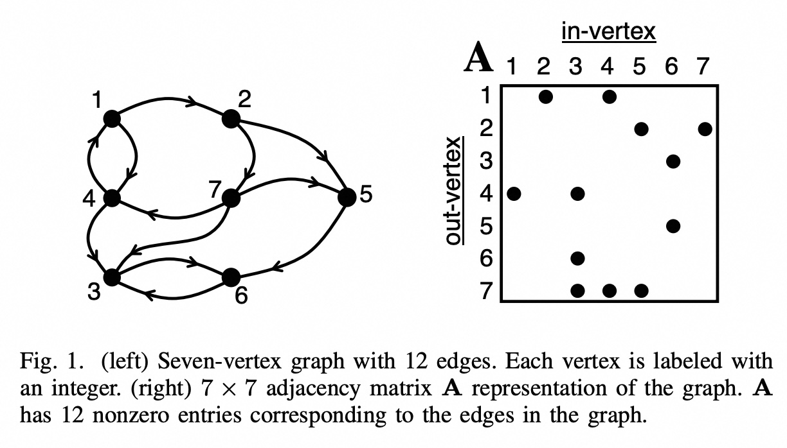
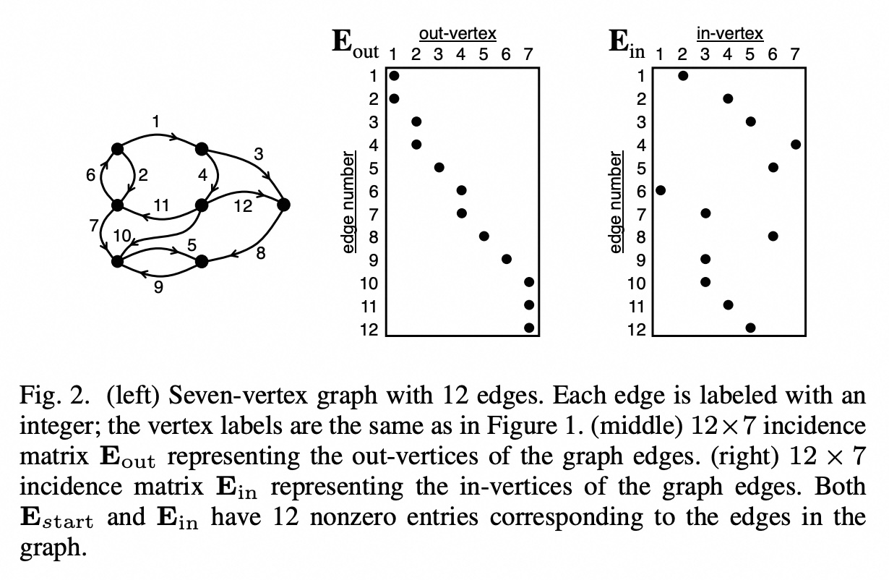
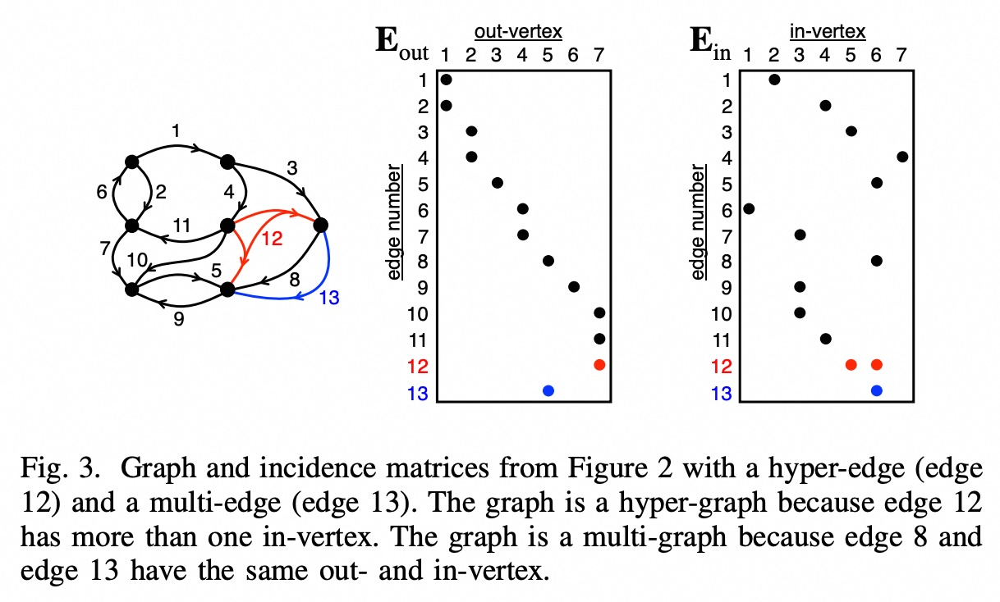
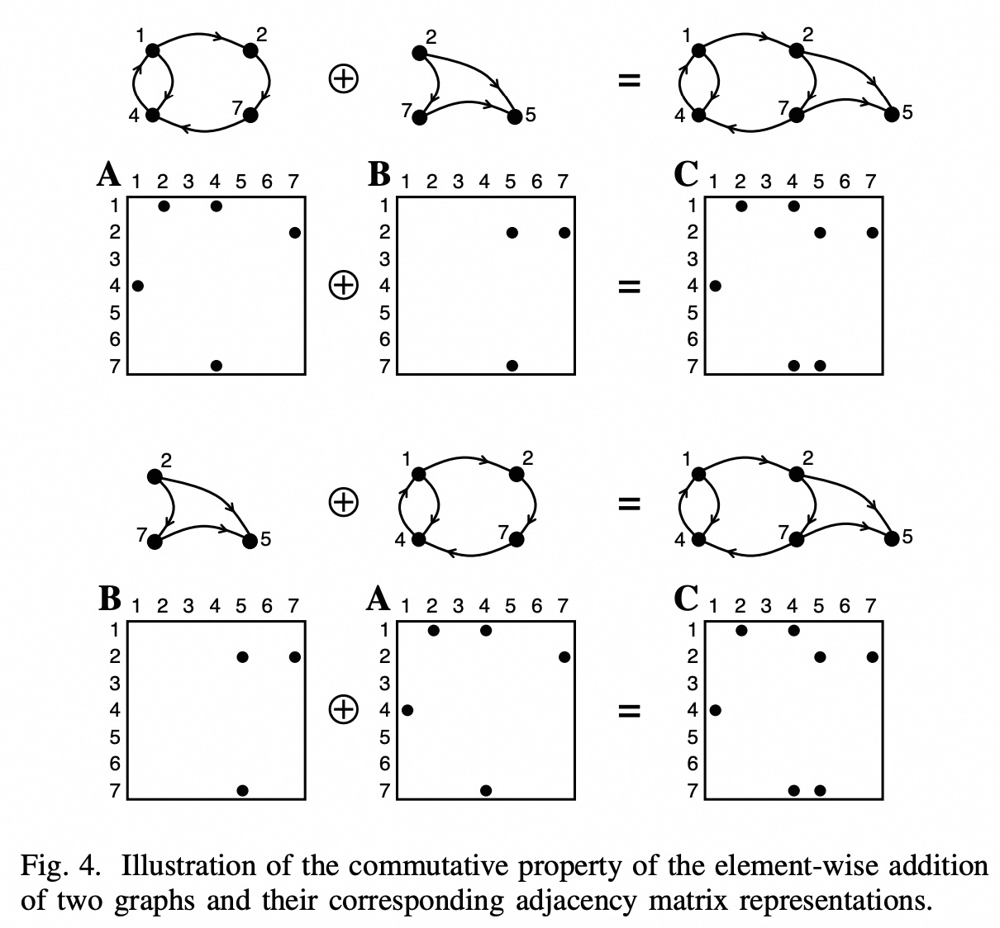
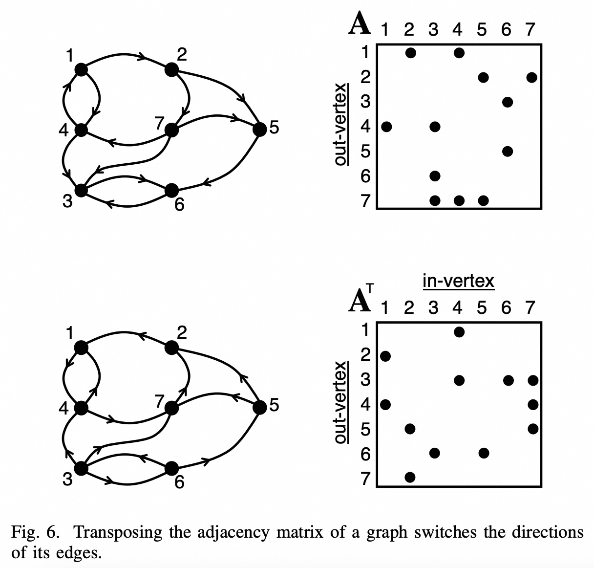
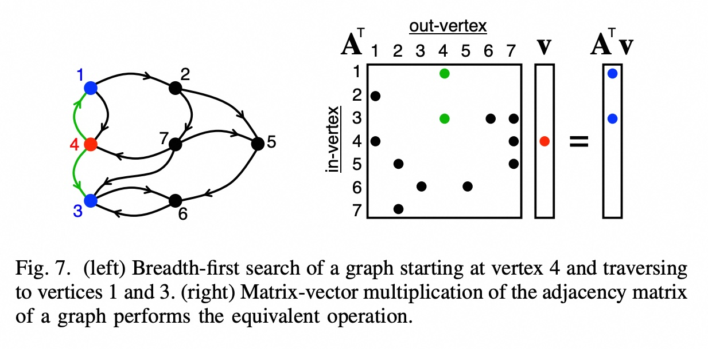
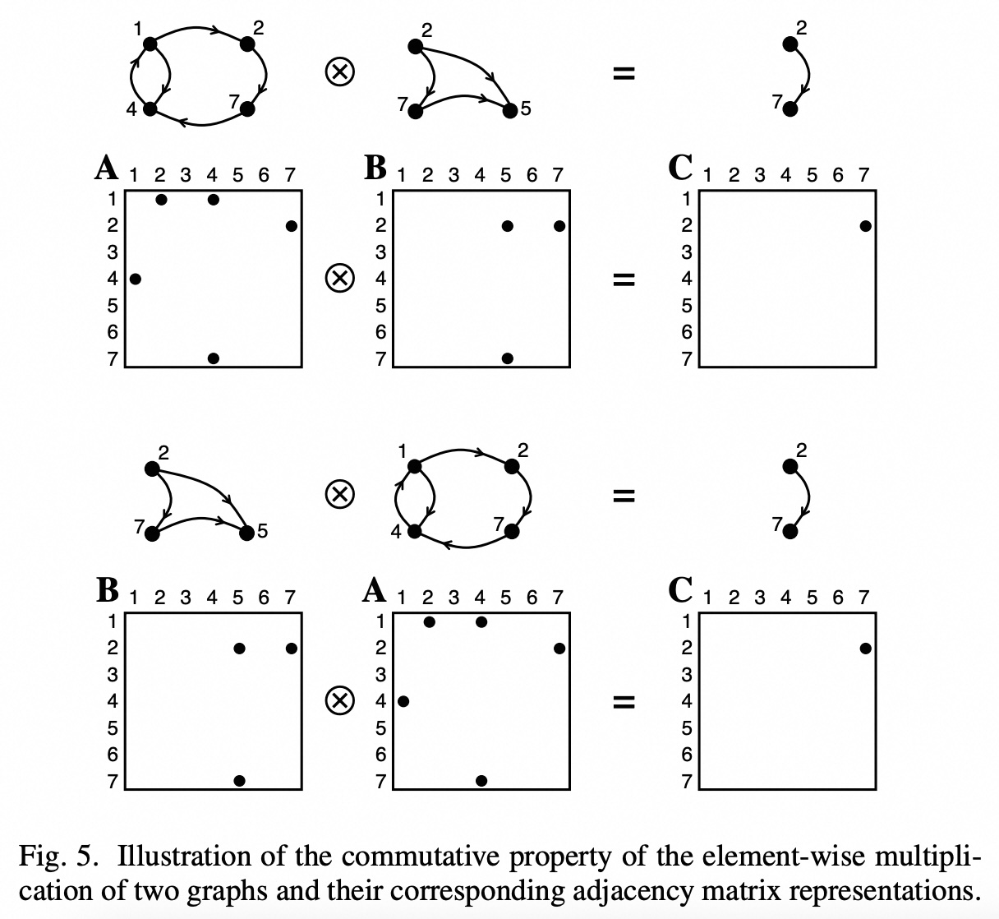
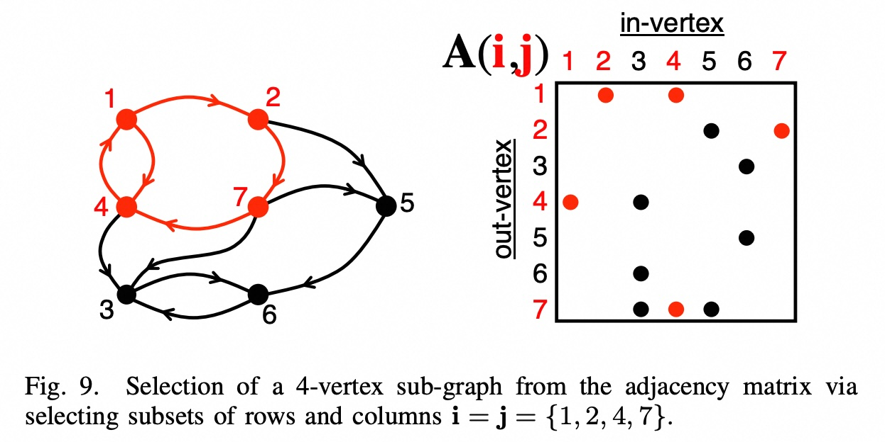
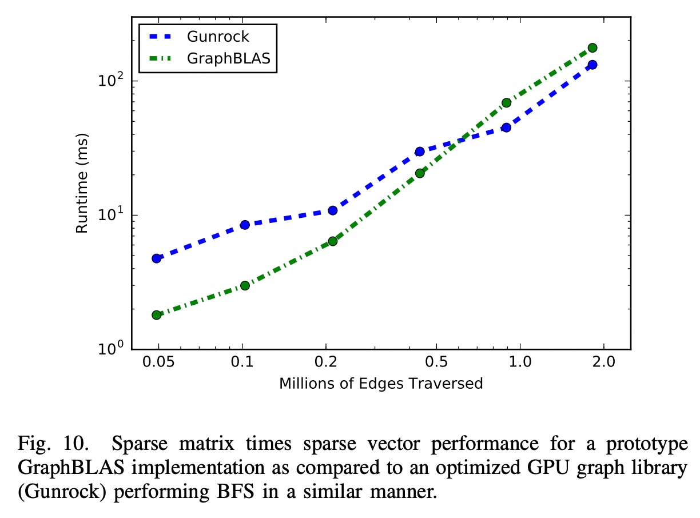
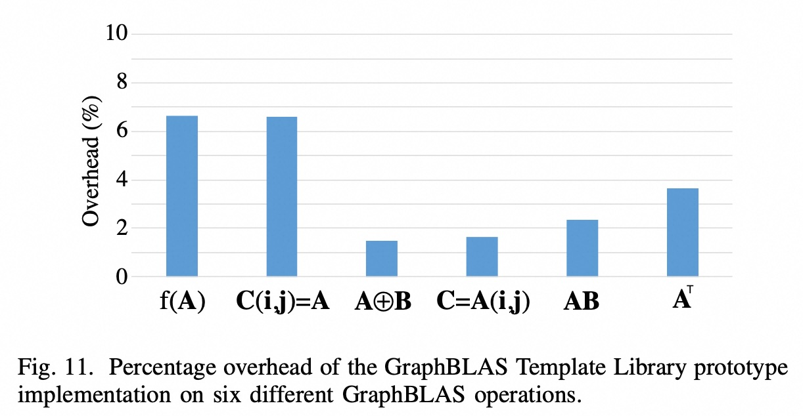

## AI论文解读 | Mathematical Foundations of the GraphBLAS
        
### 作者        
digoal        
        
### 日期        
2025-07-30       
        
### 标签        
PostgreSQL , PolarDB , DuckDB , AI , 论文解读        
        
----        
        
## 背景  
      
https://arxiv.org/pdf/1606.05790        
  
提示:          
```          
读懂《Mathematical Foundations of the GraphBLAS》这篇论文需要提前掌握哪些基础知识, 请使用中文通熟易懂的讲解这些基础知识, 可以引用论文中的图、表或使用Markdown支持的图形(text,mermaid等)增加解释性. 
  
使用中文通熟易懂的解读《Mathematical Foundations of the GraphBLAS》这篇论文, 其中的关键内容请着重讲解, 可以引用论文中的图、表或使用Markdown支持的图形(text,mermaid等)增加解释性. 
  
提取《Mathematical Foundations of the GraphBLAS》这篇论文中的重要术语, 使用中文对这些术语进行通熟易懂的讲解, 可以引用论文中的图、表或使用Markdown支持的图形(text,mermaid等)增加解释性. 
```   

相关实践: [《还在为age图插件的停更惋惜? Postgres用GraphBLAS每秒处理数十亿条边》](../202507/20250723_08.md)    
  
## 1 前置知识 
  
要完全读懂《GraphBLAS 的数学基础》（Mathematical Foundations of the GraphBLAS）这篇论文，您需要对图论、线性代数（特别是稀疏矩阵）以及一些抽象代数的基本概念有所了解。下面将用通俗易懂的中文为您逐一讲解这些基础知识，并结合论文中的图示进行说明。

### 1\. 图论基础 (Graph Theory)

图是用来表示“实体”以及它们之间“关系”的一种数学结构。

  * **顶点 (Vertex)**：代表实体。例如，在社交网络中，每个用户是一个顶点。在论文的图1中，标有数字1到7的圆圈就是顶点。
  * **边 (Edge)**：代表实体间的关系。例如，用户之间的“好友关系”。边可以有方向，从一个顶点指向另一个顶点，这被称为**有向图 (Directed Graph)**。论文图1中带箭头的线就是有向边。例如，有一条从顶点7指向顶点4的边。
  * **权重 (Weight)**：可以为边赋予一个数值，称为权重，用来表示关系的强度或成本。例如，地图上两个城市之间的距离。有权重的图称为**加权图 (Weighted Graph)**。   

简单来说，图就是由点和连接这些点的线组成的集合。

### 2\. 线性代数基础：矩阵表示法 (Linear Algebra: Matrix Representation)

GraphBLAS 的核心思想是用矩阵来表示和操作图。这极大地简化了复杂的图算法。主要有两种矩阵表示法：邻接矩阵和关联矩阵。

#### 2.1 邻接矩阵 (Adjacency Matrix)

这是最直观的表示方法。对于一个有 N 个顶点的图，我们可以用一个 N×N 的矩阵 **A** 来表示它。

  * 矩阵的行和列都代表图的顶点。
  * 矩阵中的元素 $A(i, j)$ 的值表示顶点 i 和顶点 j 之间的关系。
      * 如果存在一条从顶点 i 指向顶点 j 的边，则 $A(i, j)$ 为非零值（对于无权重的图，通常设为1）。
      * 如果不存在这条边，则 $A(i, j)$ 为0 。
      * 对于加权图， $A(i, j)$ 的值就是边的权重 。

**引用论文图1的例子：**
下面左侧是一个有7个顶点和12条边的图。右侧是它的邻接矩阵 **A**。矩阵中黑点的位置表示值为1，空白位置表示值为0。例如，矩阵在第1行第2列有一个黑点，表示存在一条从顶点1到顶点2的边。

*图示来源：Mathematical Foundations of the GraphBLAS, Figure 1*    

邻接矩阵非常适合表示顶点之间的直接连接关系，但对于包含多种复杂关系（如超图）的场景则能力有限 。

#### 2.2 关联矩阵 (Incidence Matrix)

关联矩阵提供了另一种视角，它关注的是顶点和边的关系。

  * 矩阵的行代表每一条**边**，列代表每一个**顶点** 。
  * 论文中使用了两个关联矩阵 $E\_{out}$ 和 $E\_{in}$ 来表示有向图：
      * $E\_{out}(k, i) = 1$ 表示第 k 条边从顶点 i 出发 。
      * $E\_{in}(k, j) = 1$ 表示第 k 条边指向顶点 j 。

**引用论文图2的例子：**
下图左侧是与图1相同的图，但这次边被编号了（1到12）。中间的矩阵 $E\_{out}$ 显示了每条边的出顶点，右侧的矩阵 $E\_{in}$ 显示了入顶点。例如，对于第12条边，它从顶点7出发（见 $E\_{out}$ 第12行第7列的黑点），指向顶点5（见 $E\_{in}$ 第12行第5列的黑点）。

*图示来源：Mathematical Foundations of the GraphBLAS, Figure 2*    

关联矩阵的一个巨大优势是能轻松表示**多边图**（multi-graph，两个顶点间有多条边）和**超图**（hyper-graph，一条边可以连接两个以上顶点）。例如，图3就展示了如何用关联矩阵表示一条连接多个顶点的超边（边12）。    

一个重要的关系是：**邻接矩阵可以通过关联矩阵的乘法得到** 。具体公式为： $A = E\_{out}^T E\_{in}$ ，这里的 $^T$ 表示矩阵转置。这个转换是连接两种表示法的桥梁。

### 3\. 抽象代数基础：半环 (Abstract Algebra: Semiring)

这是理解 GraphBLAS **“可组合性”** 的关键，也是论文中最抽象但最强大的部分。

在传统的矩阵乘法中，我们使用“加法”和“乘法”：
$C(i,j) = \\sum\_{k} A(i,k) \\times B(k,j)$

GraphBLAS 的创新之处在于，它将这里的“加法”和“乘法”推广到了更一般的运算。它将传统的算术运算替换成了一对可自定义的运算符 (⊕, ⊗)，这一对运算符和一个数值集合共同构成了一个名为**半环 (Semiring)** 的代数结构。

一个半环需要满足一些基本定律，如结合律和分配律，这样才能保证矩阵运算的结果是正确且可预测的 。

  * **广义加法 (⊕)**：用来“汇总”路径信息。
  * **广义乘法 (⊗)**：用来“扩展”路径信息。

通过替换这对运算符，同一个矩阵乘法操作可以用来解决完全不同的图问题。

**论文中列举的常用半环实例 ：**

| 半环名称 (Semiring) | 广义加法 (⊕) | 广义乘法 (⊗) | 零元 (类似0) | 应用场景 |
| :--- | :--- | :--- | :--- | :--- |
| **实数域** (+, ×) | 标准加法 (+) | 标准乘法 (×) | 0 | 普通的数值计算 |
| **Max-Plus 代数** | `max` (取最大值) | `+` (加法) | -∞ | 最长路径问题 |
| **Min-Plus 代数** | `min` (取最小值) | `+` (加法) | +∞ | 最短路径问题 (例如：Dijkstra 算法) |
| **逻辑半环** (or, and) | `OR` (逻辑或) | `AND` (逻辑与) | `False` | 顶点可达性、传递闭包 |

**为什么这很重要？**
以“广度优先搜索 (BFS)” 为例，该算法寻找从一个源顶点到其他所有顶点的最短路径（以边数为单位）。在 GraphBLAS 中，这可以优雅地通过在一个逻辑半环（或称为布尔半环）上执行**矩阵-向量乘法**来实现 。矩阵代表图的连接关系，向量代表当前已访问到的顶点。每乘一次，就相当于将搜索范围扩大一步。

### 4\. 核心矩阵操作 (Core Matrix Operations)

理解了图的矩阵表示和半环的概念后，最后需要了解 GraphBLAS 定义的一组核心矩阵操作，这些操作构成了其 API 的基础 。

  * **矩阵乘法 (Matrix Multiply)**: 这是最核心的操作，如上所述，用于路径发现、BFS等 。
  * **元素级运算 (Element-wise Operations)**: 对两个矩阵相同位置的元素进行操作。例如，矩阵相加 (A ⊕ B) 可用于合并两个图 。
      * **引用论文图4**：该图展示了两个图（及它们的邻接矩阵A和B）通过元素级加法合并成一个新图（C）的过程，这体现了加法的交换律 (A + B = B + A) 。    
  * **提取 (Extract)**: 从一个大矩阵中提取一个子矩阵，相当于在图中选取一个**子图** 。
  * **分配 (Assign)**: 修改大矩阵中的一个子区域，相当于修改或插入一个子图 。
  * **转置 (Transpose)**: 交换矩阵的行和列 ($C=A^T$)，在图论中，这相当于**反转所有边的方向** 。
      * **引用论文图6**：该图直观地显示了对邻接矩阵进行转置后，图中所有边的箭头方向都反过来了 。    

### 总结

要读懂这篇论文，您需要按以下顺序掌握这些知识：

1.  **图论入门**：了解什么是图、顶点和边。
2.  **线性代数**：重点理解如何用**邻接矩阵**和**关联矩阵**来描述一个图。
3.  **抽象代数**：理解**半环**（Semiring）的概念，即如何将普通的(+, ×)运算推广到更一般化的(⊕, ⊗)对，并明白这种推广如何让单一的矩阵运算适用于多种图算法。
4.  **GraphBLAS 操作**：了解其定义的核心矩阵操作（如乘法、元素级运算、提取等）及其对应的图论意义。

掌握了这些知识后，您就能理解 GraphBLAS 如何通过一套简洁而强大的数学工具，为各类图算法提供一个统一、高效的编程框架。
  
## 2 解读论文 
  
好的，我们来通俗易懂地解读《GraphBLAS的数学基础》这篇论文。

这篇论文的核心思想是：**将复杂的图算法问题，统一转化为定义在特定代数结构（半环）上的稀疏矩阵运算问题**。这样做的好处是，我们不再需要为每一种图算法从头设计和优化，而是可以利用一套高度优化、可组合的矩阵运算“积木”来搭建各种图算法 。

下面我们来分解论文的关键内容：

### 1\. 用矩阵表示图：两种核心方法

论文首先介绍了如何将“图”这种由点和线构成的数据结构，转化为计算机善于处理的“矩阵” 。

#### **方法一：邻接矩阵 (Adjacency Matrix)**

这是最直观的表示法。对于一个图，邻接矩阵 **A** 的行和列都代表图的顶点 。

  * **含义**：如果矩阵元素 $A(i, j) = 1$（或某个非零权重），则表示存在一条从顶点 `i` 指向顶点 `j` 的边 。如果为 0，则表示没有直接连接的边 。
  * **适用场景**：非常适合表示顶点之间的直接连接关系，例如社交网络中的“好友”关系 。

**论文图1示例解读：**
下图左边是一个有7个顶点的图，右边是它对应的7x7邻接矩阵。矩阵中，第4行第3列有一个黑点，这代表图中有一条从顶点4指向顶点3的边。

*来源: Mathematical Foundations of the GraphBLAS, Figure 1*    

#### **方法二：关联矩阵 (Incidence Matrix)**

关联矩阵换了一个视角，它的行代表图中的**边**，列代表**顶点** 。这种表示法在处理复杂图时更具优势 。

  * **含义**：论文中使用两个矩阵 $E\_{out}$ 和 $E\_{in}$ 来描述有向图。
      * $E\_{out}(k, i) = 1$ 表示第 `k` 条边**离开**顶点 `i` 。
      * $E\_{in}(k, j) = 1$ 表示第 `k` 条边**进入**顶点 `j` 。
  * **优势**：可以轻松表示一些邻接矩阵难以处理的复杂情况，比如两个顶点间存在多条边的**多边图 (multi-graph)**，或一条边连接多个顶点的**超图 (hyper-graph)** 。

**论文图2示例解读：**
下图的中间和右侧分别是图的 `out` 矩阵和 `in` 矩阵。以图中的第12条边为例，它从顶点7出发，指向顶点5。因此，在 $E\_{out}$ 矩阵的第12行第7列有一个点，在 $E\_{in}$ 矩阵的第12行第5列有一个点。

*来源: Mathematical Foundations of the GraphBLAS, Figure 2*    

一个非常重要的转换关系是：**邻接矩阵可以通过关联矩阵相乘得到： $A = E\_{out}^T E\_{in}$ 。** 这两种表示法因此被巧妙地联系起来。

-----

### 2\. 核心魔法：半环 (Semiring) - 让矩阵运算“变形”

这是论文最关键、最抽象，也是GraphBLAS最强大的地方。

我们熟悉的标准矩阵乘法，依赖于“加法”和“乘法” ($c = a + b$, $c = a \\times b$) 。GraphBLAS的突破在于它将这两个基础运算进行了推广。

它定义了一对广义的运算符：

  * 广义加法： $\\oplus$
  * 广义乘法： $\\otimes$

通过替换这两个运算符，原本单一的矩阵乘法就能实现完全不同的功能。这一套由 **(数值集合, $\\oplus$ 运算符, $\\otimes$ 运算符)** 组成的代数结构，被称为 **半环 (Semiring)** 。

为了让运算结果可预测，这些运算符需要满足一些基本数学定律，比如**结合律、分配律**等，这使得运算可以被分解和重排，是实现“可组合性”的基础 。

**论文中列举的常用“半环”及其图论应用：**

| 半环名称 | 广义加法 (⊕) | 广义乘法 (⊗) | 零元 (用于稀疏存储) | 图论应用 |
| :--- | :--- | :--- | :--- | :--- |
| **标准算术** (+, ×) | 标准加法 `+`  | 标准乘法 `×`  | 0 | - |
| **Max-Plus 代数** | `max` (取最大值)  | `+` (标准加法)  | `-∞` | 寻找图中的**最长路径** |
| **Min-Plus 代数** | `min` (取最小值) | `+` (标准加法) | `+∞`  | 寻找图中的**最短路径**（许多最短路算法的核心） |
| **逻辑半环** (or, and) | `xor` (异或) / `or` (或)  | `and` (与)  | `False` (0)  | 判断顶点之间是否**可达**（路径是否存在） |
| **幂集代数** ($\\cup$, $\\cap$) | `∪` (并集)  | `∩` (交集)  | `∅` (空集) | - |

通过选用不同的半环，同一个矩阵乘法表达式 $C = A \cdot B$ 就可以用来解决最短路径、可达性分析等截然不同的问题。

-----

### 3\. GraphBLAS核心图操作：用矩阵积木搭建算法

论文定义了一套简洁的核心矩阵操作，这些操作构成了GraphBLAS API的基础 。每个操作都有明确的图论意义。

  * **矩阵乘法 (`C = A * B`)**: 这是最核心的操作 。

      * **应用1：广度优先搜索 (BFS)**。如下图7所示，用图的邻接矩阵（转置后）乘以一个向量，就可以找到从某个顶点出发一步能到达的所有邻居。反复执行这个操作，就完成了BFS遍历 。
        *来源: Mathematical Foundations of the GraphBLAS, Figure 7*    
      * **应用2：关联矩阵转邻接矩阵**。如前所述，通过 $A = E\_{out}^T \\otimes E\_{in}$ 完成转换 。

  * **元素级运算 (`C = A ⊕ B` 或 `C = A ⊗ B`)**:

      * **图的合并**：两个图的邻接矩阵通过元素级加法 `A ⊕ B`，可以实现图的合并 。
      * **图的交集**：通过元素级乘法 `A ⊗ B`，可以得到两个图共有的边 。
      * **论文图4和图5** 直观展示了元素级加法和乘法，并说明了它们满足交换律（`A+B = B+A`），这意味着运算顺序不影响结果。       

  * **转置 (`C = Aᵀ`)**:

      * **意义**：将矩阵转置，相当于将图中所有有向边的**方向反转** 。
      * **论文图6**清晰地展示了矩阵转置前后，图中边的箭头方向的变化。    

  * **提取 (`Extract`) 与分配 (`Assign`)**:

      * **提取 (`C = A(i, j)`)**：从一个大矩阵中按索引提取行和列，形成一个小矩阵。在图论中，这等同于从一个大图中**抽取出子图** 。论文图9展示了从一个7顶点图中抽取出4个顶点（1,2,4,7）组成的子图的过程。    
      * **分配 (`C(i, j) = A`)**：将一个小矩阵 `A` 的值“贴”到大矩阵 `C` 的指定位置。在图论中，这相当于在图中**修改或插入一个子图** 。

### 4\. 性能考量

一个标准要能成功，必须不能带来过高的性能开销 。论文通过实验数据表明，GraphBLAS原型库的性能与业界顶尖的、专门为图计算优化的库（如Gunrock）相当，证明了其API抽象带来的性能开销很小 。

  * **论文图10** 比较了GraphBLAS原型在稀疏矩阵-稀疏向量乘法（BFS的核心）上的性能和Gunrock库的性能，两者曲线非常接近 。    
  * **论文图11** 显示了另一个原型库GBTL中，调用GraphBLAS API相比直接调用底层CUDA实现的开销百分比，大部分操作的开销都在几个百分点以内 。    

### 结论

《GraphBLAS的数学基础》这篇论文描绘了一个宏伟的蓝图：通过将图论与线性代数深度融合，并借助半环这一强大的代数工具，可以构建一个统一、简洁且高效的图计算标准 。开发者不再需要“重复造轮子”，而是可以使用一套通用的、可组合的、高性能的矩阵操作来解决各式各样的图问题，从而极大地解放生产力。
  
## 3 术语 
  
好的，这里是《Mathematical Foundations of the GraphBLAS》论文中的一些重要术语及其通俗易懂的中文讲解。

### 1\. 图的矩阵表示 (Matrix Representation of Graphs)

#### **邻接矩阵 (Adjacency Matrix)**

  * **讲解**：邻接矩阵是表示图中顶点之间连接关系的最直观方式 。对于一个有 N 个顶点的图，我们可以创建一个 N×N 的矩阵 **A** 。如果矩阵中第 `i` 行第 `j` 列的元素 $A(i, j)$ 不为零，就代表有一条从顶点 `i` 指向顶点 `j` 的边 。这个非零值本身还可以代表边的权重（比如距离或强度） 。

  * **图示解释 (引用论文图1)**：下图中，左边是一个图，右边是它的邻接矩阵。矩阵在第1行第2列有一个点，表示存在一条从顶点1到顶点2的边。同样，第7行第4列有店，代表存在从顶点7到4的边。

    *图示来源：Mathematical Foundations of the GraphBLAS, Figure 1*    

#### **关联矩阵 (Incidence Matrix)**

  * **讲解**：关联矩阵（也叫边矩阵）从另一个角度描述图，它的行代表每一条**边**，列代表每一个**顶点** 。这种方式在表示复杂图结构时特别有用，例如两个顶点间有多条边的“多边图”(multi-graph)或一条边连接多个顶点的“超图”(hyper-graph) 。论文中使用两个矩阵来精确描述有向图：

      * $E\_{out}$: 标记每条边的“出顶点” 。
      * $E\_{in}$: 标记每条边的“入顶点” 。

  * **图示解释 (引用论文图2)**：下图展示了同个图的关联矩阵表示。以第12条边为例，它从顶点7出发，指向顶点5。因此，在 $E\_{out}$ 矩阵的第12行第7列有一个点，在 $E\_{in}$ 矩阵的第12行第5列有一个点。

    *图示来源：Mathematical Foundations of the GraphBLAS, Figure 2*    

### 2\. 核心代数概念 (Core Algebraic Concepts)

#### **半环 (Semiring)**

  * **讲解**：这是 GraphBLAS 的核心魔法。我们通常的矩阵乘法使用“加法”和“乘法”。半环将这两个运算推广为一对可自定义的广义运算符 ($\\oplus$, $\\otimes$) 。通过替换这两个运算符，同一个矩阵运算公式就能解决完全不同的图问题 。
  * **关键组合实例**：
      * **常规算术 (`+`, `×`)**: 用于标准的数值计算 。
      * **Max-Plus 代数 (`max`, `+`)**: 用于寻找图中的最长路径 。
      * **Min-Plus 代数 (`min`, `+`)**: 常用于寻找图中的最短路径。
      * **逻辑半环 (`or`, `and`)**: 用于判断两点之间是否存在路径（可达性问题） 。

#### **可组合性 (Composability)**

  * **讲解**：指仅用少数几个核心运算（如矩阵乘法、元素级运算）就能像搭积木一样，构建出大量复杂的图算法 。这种能力的基础是半环中的运算符满足**结合律 (associativity)** 和 **分配律 (distributivity)** 等数学性质，这保证了运算可以被重新排序和组合，而不改变最终结果 。

#### **零元 (0-Element)**

  * **讲解**：在稀疏矩阵中，我们通常不存储值为“0”的元素来节省空间 。这个“0”在图中代表“没有边” 。在不同的半环中，“0”的具体值也不同，例如在 Max-Plus 代数中，“0”是 `-∞` 。这个“0”元素需要满足两个关键性质：
      * **加法单位元 (Additive Identity)**: `a ⊕ 0 = a`（任何数和0相加还得任何数） 。
      * **乘法零元 (Multiplicative Annihilator)**: `a ⊗ 0 = 0`（任何数和0相乘都得0） 。
        满足这两个性质使得稀疏矩阵的运算可以高效进行 。

### 3\. 核心矩阵运算 (Core Matrix Operations)

GraphBLAS 定义了一系列核心的矩阵运算，每一种都对应着一种或多种图操作。

#### **矩阵乘法 (Matrix Multiplication)**

  * **讲解**：这是 GraphBLAS 中最重要、最强大的运算 。通过在不同半环上执行矩阵乘法 $C = A \oplus . \otimes B$ ，可以实现多种图算法，如广度优先搜索 (BFS)、最短路径、可达性分析等 。

  * **图示解释 (引用论文图7)**：下图展示了如何通过一次**矩阵-向量乘法**实现从顶点4出发的单步BFS，找到了邻居顶点1和3。

    *图示来源：Mathematical Foundations of the GraphBLAS, Figure 7*    

#### **元素级运算 (Element-wise Operations)**

  * **讲解**：指对两个矩阵中位置相同的元素进行运算 。

      * **元素级加法 (`A ⊕ B`)**: 对应**图的合并 (Union)** 。
      * **元素级乘法 (`A ⊗ B`)**: 对应**图的交集 (Intersection)** 或对边的权重进行缩放 。

  * **图示解释 (引用论文图5)**：下图展示了两个图（A和B）通过元素级乘法得到它们的交集（C），即只保留两个图中都存在的边。

    *图示来源：Mathematical Foundations of the GraphBLAS, Figure 5*    

#### **转置 (Transpose)**

  * **讲解**：即将矩阵的行和列互换 ($C = A^T$) 。在图论中，这个操作的意义是**将图中所有有向边的方向反转** 。

  * **图示解释 (引用论文图6)**：下图清晰地展示了对邻接矩阵A进行转置得到Aᵀ后，图中所有边的箭头方向都反过来了。

    *图示来源：Mathematical Foundations of the GraphBLAS, Figure 6*    

#### **提取 (Extract) 与 分配 (Assign)**

  * **提取 (`C = A(i,j)`)**: 从一个大矩阵中按指定的行、列索引 `i` 和 `j` 抽取出元素，形成一个新的小矩阵 `C` 。这相当于从一个大图中**选择一个子图** 。
  * **分配 (`C(i,j) = A`)**: 将一个小矩阵 `A` 的值“贴”到大矩阵 `C` 的指定位置上 。这相当于**修改或插入一个子图**到大图中 。
  
## 参考        
         
https://arxiv.org/pdf/1606.05790    
        
<b> 以上内容基于DeepSeek、Qwen、Gemini及诸多AI生成, 轻微人工调整, 感谢杭州深度求索人工智能、阿里云、Google等公司. </b>        
        
<b> AI 生成的内容请自行辨别正确性, 当然也多了些许踩坑的乐趣, 毕竟冒险是每个男人的天性.  </b>        
  
  
