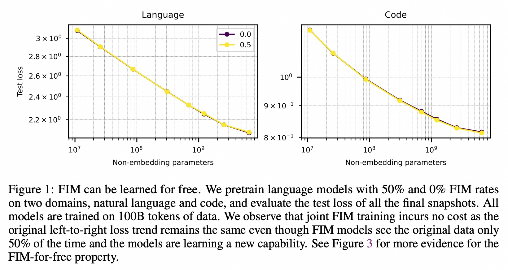
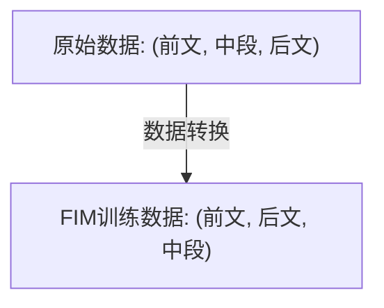
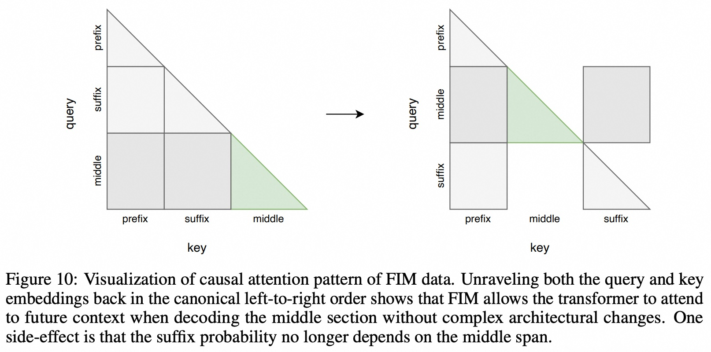
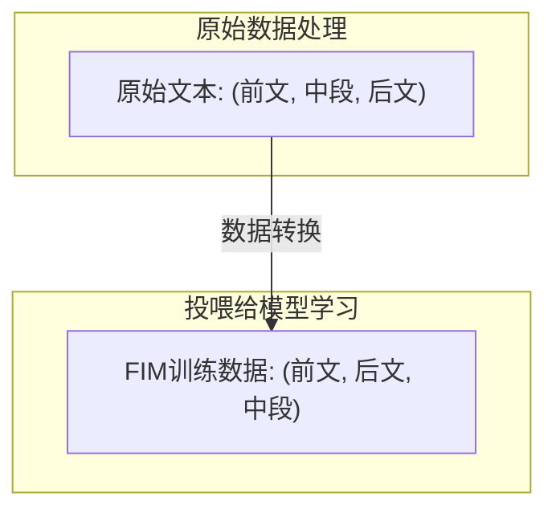
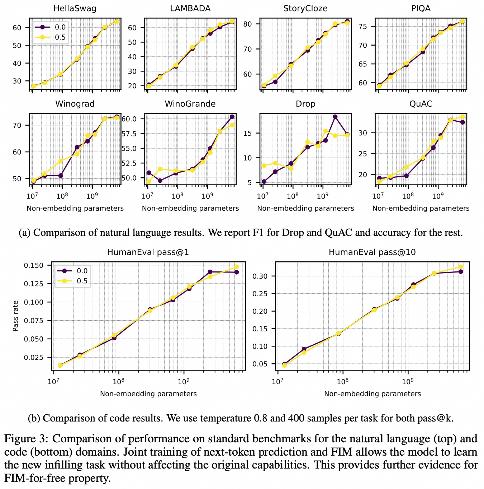

## AI论文解读 | Efficient Training of Language Models to Fill in the Middle
        
### 作者        
digoal        
        
### 日期        
2025-07-30       
        
### 标签        
PostgreSQL , PolarDB , DuckDB , AI , 论文解读        
        
----        
        
## 背景  
      
https://arxiv.org/pdf/2207.14255        
  
提示:          
```          
读懂《Efficient Training of Language Models to Fill in the Middle》这篇论文需要提前掌握哪些基础知识, 请使用中文通熟易懂的讲解这些基础知识, 可以引用论文中的图、表或使用Markdown支持的图形(text,mermaid等)增加解释性. 
  
使用中文通熟易懂的解读《Efficient Training of Language Models to Fill in the Middle》这篇论文, 其中的关键内容请着重讲解, 可以引用论文中的图、表或使用Markdown支持的图形(text,mermaid等)增加解释性. 
  
提取《Efficient Training of Language Models to Fill in the Middle》这篇论文中的重要术语, 使用中文对这些术语进行通熟易懂的讲解, 可以引用论文中的图、表或使用Markdown支持的图形(text,mermaid等)增加解释性. 
```     
  
## 1 前置知识 
  
好的，为了完全读懂《Efficient Training of Language Models to Fill in the Middle》这篇论文，你需要对现代自然语言处理（NLP）的一些基础概念有所了解。这篇论文的核心思想非常巧妙，它用一种简单高效的方法，让一种特定类型的语言模型学会了一项新技能，而几乎没有额外成本。

下面我将用通俗易懂的中文，为你梳理和讲解所需的基础知识，并结合论文中的图表和Markdown图形进行解释。

-----

### 核心基础知识概览

你需要掌握的基础知识可以分为三个层次：

1.  **宏观背景**: 什么是语言模型？主流的Transformer架构有哪些？
2.  **训练核心**: 语言模型是怎么学习的？（自回归、损失函数、预训练与微调）
3.  **FIM论文专属概念**: 论文提出的核心技巧和相关术语是什么？

让我们逐一展开。

### 1\. 宏观背景：语言模型与Transformer

#### 1.1 什么是语言模型 (Language Model, LM)？

简单来说，语言模型就是一个会“文字接龙”的AI。你给它一段话，它能预测下一个最可能出现的词或字是什么。通过不断地“接龙”，它就能生成完整的句子甚至文章。

比如，你输入“今天天气真不错，我们一起去”，模型可能会预测出“公园”、“散步”或“吃饭”等词。

#### 1.2 主流的Transformer架构

自2017年Transformer架构被提出以来 ，它已成为构建语言模型的事实标准。不过，根据其内部结构的不同，主要分为三大家族，这篇论文在引言部分就对它们进行了梳理 ：

  * **Encoder-only (仅编码器模型)**:
      * **代表**: BERT 。
      * **特点**: 像做“完形填空”一样学习语言。它能同时看到整个句子的上下文，因此非常擅长**理解**任务，比如文本分类、情感分析。但它不擅长生成长文本。
  * **Encoder-Decoder (编码器-解码器模型)**:
      * **代表**: T5, BART 。
      * **特点**: 既有编码器（理解输入）又有解码器（生成输出），像一个“翻译模型”。适合处理“输入A -\> 输出B”这样的任务，比如机器翻译、文章摘要。
  * **Decoder-only (仅解码器模型)**:
      * **代表**: GPT系列 (本文重点) 。
      * **特点**: 只有解码器，严格遵循“从左到右”的顺序生成文本，也就是我们前面说的“文字接龙”。这类模型在开放式文本生成、续写故事、写代码等方面表现极为出色，是目前最大、最强的生成模型的代表 。

**这篇论文主要关注的就是第三种——仅解码器模型 (Decoder-only Models)。**

### 2\. 训练核心：语言模型如何“学习”

#### 2.1 自回归 (Autoregressive) / 从左到右预测

这是仅解码器模型（如GPT）的标准学习方式。模型在预测第 `N` 个词时，只能看到它前面的 `N-1` 个词，不能“偷看”后面的内容。这就像我们写文章一样，一个字一个字地往后写。论文中反复提到的“left-to-right capability”（从左到右的能力）就是指这个 。

#### 2.2 损失函数 (Loss Function) / 困惑度 (Perplexity)

模型如何知道自己学得好不好？答案是**损失函数**。在训练时，模型会预测下一个词的概率分布，然后与真实答案进行比较。如果预测的概率和真实答案差得越远，“损失”就越大。模型的目标就是通过调整内部参数，让这个“损失”变得尽可能小。

论文中的图表（如Figure 1）纵坐标的 "Test loss" (测试损失) 就是这个指标 。**损失越低，代表模型对文本的预测能力越强**。困惑度（Perplexity）是损失函数的另一种形式，同样是越低越好。   

> **图1解读**: 这张图展示了不同大小的模型（横坐标：模型参数量）在“从左到右”预测任务上的测试损失（纵坐标）。黑线 (0.0) 代表传统模型，黄线 (0.5) 代表加入了FIM训练的模型。可以看到，两条线几乎完全重合，说明**加入FIM训练并没有损害模型原有的“从左到右”生成能力** 。这就是论文核心论点“FIM-for-free”（免费的FIM）的有力证据。

#### 2.3 预训练 (Pre-training) 与 微调 (Fine-tuning)

这是训练大型语言模型的两个关键阶段：

  * **预训练 (Pre-training)**: 在海量的、无标注的文本数据（如整个互联网的网页、书籍）上进行基础学习。这个过程非常耗时且昂贵，目标是让模型掌握通用的语言知识和世界知识。
  * **微调 (Fine-tuning)**: 在一个具体的、较小的数据集上对预训练好的模型进行“二次训练”，让它适应特定任务，比如客服对话、诗歌写作等。

论文的一个惊人发现是：在**预训练**阶段加入FIM任务是“免费”的；但如果在一个已经预训练好的模型上通过**微调**来学习FIM，则效率低下且成本高昂 。

### 3\. 理解FIM的核心创新：本文的专属知识

掌握了以上基础，我们就可以来看这篇论文最核心的贡献了。

#### 3.1 核心任务：中间填充 (Fill-in-the-Middle, FIM)

传统的从左到右模型只能根据前文（prefix）生成后文，无法考虑后缀（suffix）。比如，要完成句子：
`"今天我去了 [___待填充___] ，玩得很开心。"`
传统模型只能看到"今天我去了"，它不知道后面有"玩得很开心"，所以可能填充出"医院"，这显然不合适。

FIM任务就是要求模型在**同时看到前文和后文**的情况下，填充中间的空白部分 。这在代码补全、文档写作等场景中非常有用 。

#### 3.2 巧妙的数据转换技巧

如何让一个只会“从左到右”接龙的解码器模型，学会同时看前文和后文呢？这篇论文的作者想出了一个绝妙的办法：**不改模型，只改数据**。

他们把一份原始文本随机切分成三段：`前文 (prefix)`、`中段 (middle)`、`后文 (suffix)`。然后，他们把这三段重新排列顺序，变成：`前文 (prefix)`、`后文 (suffix)`、`中段 (middle)` 。

我们可以用一个简单的图来表示这个过程：



例如，原始文本是：`"我喜欢用Python写代码"`

1.  **切分**: `前文`="我喜欢用", `中段`="Python", `后文`="写代码"
2.  **重排**: `我喜欢用` `写代码` `Python`

然后，把这个重排后的文本喂给模型去学习。模型在学习预测 `Python` 时，它已经“看”到了 `我喜欢用` 和 `写代码`。这样一来，模型就间接地学会了根据前后文来填充中间内容。

#### 3.3 因果注意力机制 (Causal Attention Mask) 的“魔术”

这个数据转换技巧之所以有效，是因为它巧妙地利用了Transformer的“因果注意力机制”。在标准的“从左到右”模型中，一个词只能“注意”到它前面的词。

下面是论文中Figure 10的可视化解释 ：   

```text
标准从左到右注意力:                FIM数据转换后的注意力:
(模型在预测"中段"时)

      前  中  后                    前  后  中  (输入给模型的数据顺序)
前   [■, □, □]                  前 [■, □, □]
中   [■, ■, □]                  后 [■, ■, □]
后   [■, ■, ■]                  中 [■, ■, ■]

■: 可以注意到的部分
□: 不可见的部分 (被mask)
```

  * **左图（标准情况）**: 当模型要生成`中段`时，它完全看不到`后文`的信息。
  * **右图（FIM情况）**: 通过数据重排，`后文`被放到了`中段`的前面。因此，当模型在生成`中段`的每一个词时，它都可以“合法地”注意到`前文`和`后文`的全部内容！

这个技巧的神奇之处在于，**它没有对模型架构做任何修改**，仅仅通过改变输入数据的顺序，就让一个标准的自回归模型获得了强大的双向上下文理解能力，从而实现了FIM功能。

#### 3.4 哨兵标记 (Sentinel Tokens)

为了让模型知道哪部分是前文、后文和中段，作者在各部分的开头加入了特殊的“路标”，即哨兵标记，如 `<PRE>` (前文开始), `<SUF>` (后文开始), `<MID>` (中段开始) 。

#### 3.5 重要超参数 (Hyperparameters)

论文还探讨了一些影响FIM效果的关键设置，理解它们有助于你把握论文的细节：

  * **FIM rate (FIM比率)**: 在训练数据中，有多大比例的数据被转换成FIM格式。论文发现，即使高达90%的数据都用于FIM训练，模型原有的“从左到右”能力也不受影响 。
  * **PSM vs SPM**: 这是两种不同的FIM数据排列方式。PSM是 `前文-后文-中段` (`Prefix, Suffix, Middle`)，SPM是 `后文-前文-中段` (`Suffix, Prefix, Middle`)。论文发现SPM模式在某些情况下效果更好 。

-----

### 总结

要读懂这篇论文，你需要：

1.  **了解语言模型的基础**，特别是GPT这类**仅解码器模型**的工作原理（从左到右生成）。
2.  **熟悉核心训练概念**，如**损失函数**（评估模型好坏）和**预训练/微调**（模型学习的不同阶段）。
3.  **牢牢抓住论文的核心创新点**：通过 `(前文, 中段, 后文) -> (前文, 后文, 中段)` 的**数据重排**，巧妙地利用了模型的**因果注意力机制**，使得一个标准的自回归模型无需任何结构改动就能学会**中间填充（FIM）**，且几乎没有额外成本（所谓的**FIM-for-free**）。

理解了这些，你就能轻松领会这篇论文的精髓和其对未来语言模型训练的深刻启示了。
  
## 2 解读论文 
  
好的，这是一份对《Efficient Training of Language Models to Fill in the Middle》这篇论文的通俗易懂的中文解读。我们将深入探讨其关键发现，并利用论文中的图表和图形进行解释。

### 论文一句话总结

这篇论文提出了一种极其简单且高效的方法，通过巧妙地重新排列训练数据，让只会“从左到右”写文章的AI语言模型，学会了在已有前后文的情况下“填充中间内容”（Fill-in-the-Middle, FIM）的强大能力，而且这项新技能的学习几乎是“免费”的，不会损害模型原有的性能。

-----

### 1\. 核心问题：为什么需要“中间填充”？

传统的语言模型（如GPT系列）是“续写”大师 。它们根据你提供的前文（prefix），从左到右地生成后续内容 。但这存在一个局限：它们无法“瞻前顾后”。

想象一下在写代码时，你写好了函数头和结尾的返回语句，希望AI帮你补全中间的逻辑。或者在写文章时，你写好了开头和结尾，想让AI填充中间的段落。在这些场景下，模型必须同时理解前文和后文，才能生成连贯的内容。而传统模型做不到这一点 。

“中间填充” (FIM) 能力正是为了解决这个痛点，它在代码辅助、文档写作等领域有巨大的应用价值 。

### 2\. 绝妙的核心思想：不改模型，只改数据

这篇论文最精彩的地方在于其解决方案的简洁性。作者没有设计复杂的模型架构，而是直接对训练数据“动了手脚”。

他们的方法是：将一份文本随机切分成 `前文 (prefix)`、`中段 (middle)` 和 `后文 (suffix)` 三部分，然后以 `前文-后文-中段` 的顺序重新组合，再喂给模型学习 。

我们可以用一个图来清晰地展示这个过程：



**这个简单的重排为什么有效？** 因为它巧妙地利用了模型的“从左到右”学习机制。当模型学习生成被移到末尾的 `中段` 时，它已经“看”到了 `前文` 和 `后文`。这样，模型就自然而然地学会了在理解前后文语境的基础上，生成中间的内容 。为了让模型能区分这几部分，作者还引入了特殊标记（如 `<PRE>`, `<SUF>`, `<MID>`）作为“路标” 。

### 3\. 关键发现一：FIM是“免费”的 (FIM-for-free)

这是论文最核心、最惊人的发现。所谓“免费”，指的是**在预训练阶段加入FIM任务，并不会损害模型原有的“从左到右”生成能力，也不需要额外的计算成本** 。

**证据1：模型损失（Loss）几乎不变**

论文通过训练一系列从5000万到69亿参数不等的模型来验证这一点 。下图（Figure 1）是关键证据：   

  * **图解**: 该图展示了在自然语言（左）和代码（右）两个领域，模型的测试损失（纵坐标，越低越好）随模型参数量（横坐标）的变化趋势 。
  * **黑线 (0.0)**：传统模型，未进行FIM训练 。
  * **黄线 (0.5)**：用50%的FIM数据训练的模型 。
  * **结论**: 我们可以清楚地看到，两条线几乎完全重合 。这意味着，即使模型有一半的时间在学习FIM这个新任务，它在传统“从左到右”任务上的表现也丝毫没有下降 。

**证据2：下游任务表现不受影响**

除了模型损失，作者还在一系列标准的下游基准测试（如常识推理、阅读理解等）上进行了评估。

  * **图解**: 这组图表对比了FIM模型（黄线）和传统模型（黑线）在多个自然语言和代码任务上的表现 。
  * **结论**: 再次地，两条线在所有任务上都齐头并进，误差范围内没有显著差异 。这进一步证明了FIM-for-free的特性 。

### 4\. 关键发现二：如何高效地训练FIM模型（最佳实践）

既然FIM是免费的，那么如何才能最好地训练它呢？论文通过大量的实验，给出了一套“最佳实践指南” 。

  * **FIM比率（FIM Rate）**
      * **发现**: 越高的FIM比率能带来更强的填充能力 。即使将比率提高到90%，模型原有的从左到右能力也几乎不受影响 。但是，100%的FIM训练会导致性能下降 。
      * **建议**: 实践中，**50%到90%之间**的比率是合理的选择 。
  * **数据排列方式（PSM vs SPM）**
      * **发现**: 论文对比了两种排列方式：`前文-后文-中段` (PSM) 和 `后文-前文-中段` (SPM) 。实验表明，SPM模式在评测中表现略好一些 。
      * **建议**: **同时混合训练PSM和SPM模式**是最高效的，这能让模型更灵活，并且两种模式之间存在积极的知识迁移 。
  * **数据处理级别（Context-level vs Document-level）**
      * **发现**: 在将长文档切分成模型可处理的上下文（context）**之后**再进行FIM转换（Context-level），其性能显著优于在切分**之前**进行转换（Document-level） 。
      * **建议**: **优先使用Context-level FIM** 。
  * **中间跨度选择（Middle Span Selection）**
      * **发现**: 在代码等场景，填充的起始和结束位置可能恰好在一个词的中间。如果在训练时按字符（character）级别随机切分数据，模型就能最好地处理这种情况，鲁棒性最强 。按行或按词（token）切分则无法很好地处理这类现实场景 。
      * **建议**: **强烈推荐使用字符级别的随机跨度选择** 。

### 5\. 关键发现三：从头预训练远胜于微调

另一个非常重要的发现是：学习FIM能力的最佳时机是在**预训练阶段** 。如果试图在一个已经预训练好的标准模型上通过 **微调（Finetuning）** 来教会它FIM，效果会差很多，且计算成本高昂 。

  * **图解**: 该图展示了对一个已有的AR模型进行FIM微调后的性能。横坐标是微调时使用的学习率，纵坐标是FIM任务的得分 。虚线代表从头开始用FIM预训练的模型的性能基线 。
  * **结论**: 即使经过长达500亿个token的微调，并且使用了激进的超参数，微调模型的性能也仅仅是勉强追上从头预训练的基线模型 。作者推测，这可能是因为在标准的预训练中，模型的注意力模式已经“固化”（ossification），很难在微调阶段被高效地改变以适应FIM任务 。

### 结论与启示

这篇论文的贡献是巨大且务实的：

1.  **证明了FIM-for-free**: 它向我们展示了一种可以为语言模型增加强大新功能而无需牺牲原有性能的方法 。
2.  **提供了“黄金配方”**: 它通过详尽的实验，为未来训练大型语言模型提供了明确的、可操作的最佳实践 。论文建议未来的自回归语言模型都应该默认开启FIM训练 。
3.  **揭示了预训练的重要性**: 它强调了在模型生命周期的最初阶段（预训练）就引入多样化任务的重要性，而不是等到微调阶段再“亡羊补牢” 。

总而言之，这篇论文以其简洁、高效、有力的发现，为构建更强大、更实用的语言模型铺平了道路，让我们离拥有一个既能续写又能填充的全能AI助手更近了一步。
  
## 3 术语 
  
填充在中间 (FIM) 是一种训练自回归语言模型的新方法，使其能够根据前缀和后缀来填充文本，而不是仅仅从左到右生成文本。以下是论文中提到的一些重要术语及其解释：

**1. 填充在中间 (Fill-in-the-Middle, FIM)**:

  * **解释**: 传统自回归语言模型（如GPT系列）通常是从左到右预测下一个词元。而FIM模型经过特殊的数据转换训练，使其能够根据给定的一段文本的前缀和后缀来预测中间缺失的文本内容。这使得模型在需要补全代码、生成文档字符串等场景下更加有用.
  * **数据转换示例**: 论文中描述了一种简单的数据转换方式：将文档分解为三部分：前缀（prefix）、中间（middle）和后缀（suffix），然后将顺序改为（前缀、后缀、中间），并通过特殊的标记（sentinel tokens）将它们连接起来。例如，一个文档 `(prefix, middle, suffix)` 会被转换为 `(prefix, suffix, middle)`.

**2. 自回归模型 (Autoregressive Models, AR Models)**:

  * **解释**: 指的是像GPT系列这样，通过预测序列中下一个词元来生成文本的语言模型。它们通常按从左到右的顺序进行训练和推理.
  * **与FIM的关系**: 论文的目标是为这些主流的自回归模型添加FIM能力，并且证明这种添加不会损害它们原有的从左到右的生成能力.

**3. FIM-for-free 特性 (FIM-for-free Property)**:

  * **解释**: 这是论文中的一个核心发现。它表示在预训练过程中，通过将FIM数据混合到训练数据中，模型可以在不损害其原有从左到右生成能力（通过困惑度、采样评估等指标衡量）的前提下，免费学习到填充中间文本的能力. 换句话说，模型在学习新能力的同时，不会降低其在传统任务上的表现。

  * **图表支持**: 论文中的图1和图3都提供了FIM-for-free特性的证据。图1展示了在自然语言和代码领域，以50%和0%的FIM率预训练语言模型后，模型的测试损失（Test loss）曲线几乎保持一致，这表明联合FIM训练不会对原始的从左到右损失造成影响.     

    ```mermaid
    graph TD
        A[传统自回归训练] --> B{从左到右生成能力};
        C[FIM数据转换] --> D{填充中间能力};
        E[联合训练: 传统数据 + FIM数据] --> F{从左到右生成能力};
        E --> G{填充中间能力};
        F -- 性能无损 --> B;
        G -- 新增 --> D;
    ```

    *上述图示简要说明了FIM-for-free特性的概念：在联合训练下，模型能够同时保持原有的从左到右生成能力并获得新的填充中间能力。*

**4. 哨兵标记 (Sentinel Tokens)**:

  * **解释**: 为了将文档的前缀、中间和后缀部分连接起来，同时在模型中区分它们，论文使用了特殊的标记，例如 `<PRE>` (前缀)、`<SUF>` (后缀) 和 `<MID>` (中间). 这些标记在FIM数据的格式化中起着关键作用。
  * **应用**: 例如，在PSM（Prefix-Suffix-Middle）模式中，FIM文档的标记化版本会形成 `<PRE> Enc(prefix) <SUF> Enc(suffix) <MID> Enc(middle)` 的结构.

**5. FIM 训练模式 (FIM Training Modes)**:
论文中主要探讨了两种FIM数据构造方式：
  * **PSM 模式 (Prefix-Suffix-Middle, PSM)**:
    * **解释**: 这是最直观的FIM数据格式，即将文档分割为前缀、中间、后缀后，按照 `前缀-后缀-中间` 的顺序排列，并用哨兵标记分隔. 其格式为 `<PRE> Enc(prefix) <SUF> Enc(suffix) <MID> Enc(middle)`.
  * **SPM 模式 (Suffix-Prefix-Middle, SPM)**:
    * **解释**: 这是PSM的一种变体，将前缀和后缀的顺序进行交换，即 `后缀-前缀-中间`. 论文发现SPM模式在填充基准测试中略优于PSM，并且在推理过程中能提供更好的键值缓存效率.

  * **联合训练**: 论文建议在预训练时同时使用PSM和SPM两种模式，因为这能带来积极的迁移效果，并使模型在两种推理模式下都具有灵活性.

**6. FIM 率 (FIM Rate)**:

  * **解释**: 指的是在数据集中应用FIM转换的概率。例如，如果FIM率为50%，则意味着一半的训练数据会进行FIM转换，另一半保持原始的从左到右格式.
  * **重要性**: 论文对FIM率进行了消融研究，发现即使高达90%的FIM率也不会对模型的从左到右能力造成损害，反而可以显著提升填充性能.

**7. 上下文级别 FIM (Context-level FIM) 与 文档级别 FIM (Document-level FIM)**:

  * **解释**: 这两种模式指的是FIM转换在数据加载管道中发生的不同阶段：
      * **文档级别 FIM**: 在文档被词元化之前，即文档仍是字符序列时进行分割和转换. 这种方式在处理长文档时可能导致FIM数据碎片化，即前缀、中间、后缀可能被截断而无法在同一个上下文中出现.
      * **上下文级别 FIM**: 在文档被分块（chunking）到模型上下文长度之后应用FIM转换. 这种方法可以解决文档级别FIM的碎片化问题，并且通常能带来更好的性能.

**8. 随机跨度填充 (Random Span Infilling)**:

  * **解释**: 论文中提出的一种新的评估基准。它通过从`HumanEval`数据集的规范解决方案中随机选择中间跨度来创建填充任务. 这与之前基于行或多行的填充基准不同，更能评估模型在任意位置进行填充的能力.

**9. HumanEval**:

  * **解释**: 一个用于评估代码生成模型性能的基准测试集. 论文在评估FIM模型时广泛使用了基于HumanEval的填充任务和通过率指标.

**10. 左到右损失 (Left-to-right Loss) / AR 损失 (AR Loss)**:

  * **解释**: 指的是在正常从左到右数据上的交叉熵损失。它用于衡量模型在传统自回归任务上的表现.
  * **与FIM损失对比**: 论文通过比较AR损失和FIM损失（在100%FIM转换数据上的损失）来证明FIM-for-free特性，即FIM训练不会增加AR损失，但会降低FIM损失，表明模型学会了有效地利用后缀信息.
  
## 参考        
         
https://arxiv.org/pdf/2207.14255    
        
<b> 以上内容基于DeepSeek、Qwen、Gemini及诸多AI生成, 轻微人工调整, 感谢杭州深度求索人工智能、阿里云、Google等公司. </b>        
        
<b> AI 生成的内容请自行辨别正确性, 当然也多了些许踩坑的乐趣, 毕竟冒险是每个男人的天性.  </b>        
  
